第一次打正式的国赛半决赛awd，复盘总结，分析与反思

<!-- more -->

## 队伍名称：S3C_2021

第31名

止步于此，虽不荣耀，但仅以此鞭策自己。为自己，为团队，为后继的学弟学妹们记录。

至暗时刻，虽不愿承认，本工作室打出了历史辉煌后最差的一次成绩

本人很自责，没能跟随师傅们的步伐前进，拖队伍后腿止步于半决赛

在此复盘总结

---

## 比赛时间：2021年6月19日 9:00-18:30

按照`时间：- 事件`格式进行完整复盘，以本人角度对赛况进行分析

### 时间：比赛前 - 赛前准备

准备好了完备的awd不死码批量上传激活脚本，提交flag脚本，以及各类log日志及分析工具，按照去年情况，题目是web多pwn少，对于web做好了充分的准备，awd前期速度取胜，如果有简单后门就可以直接利用，达到全程拿分的目的。

本队三位web师傅一位pwn师傅

### 时间：比赛时 - 赛况

#### 8:30左右 - 未开赛

准备好设备，我带了两台电脑，一台电脑插上网线，开wifi，另一台电脑连接。由于m1的arm架构问题，有些事情不得不在windows上做，比如D盾扫描之类的，为防止纠纷我两台电脑都进行了录屏。


#### 9:00 - 第1轮

开始比赛，靶机全部用ssh私钥连接，不存在篡改密码的情况。

第一批2道web两道pwn。以ip标号命名，`11/12` 是web，`13/15`是pwn


从左到右依次是11-17

上来我们三位web师傅首先下载ssh

```
safecms --> 172.35.xx.11:80,
eyou --> 172.35.xx.12:80,
decoder --> 172.35.xx.13:9999,
cryptopark --> 172.35.xx.14:9999,
eval --> 172.35.xx.15:9999,
secgame --> 172.35.xx.16:9999,
lol --> 172.35.xx.17:80
```

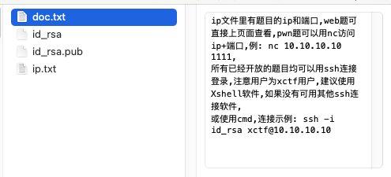

一看就是3web，4pwn。导入密钥后发现怎么都连不上，过了一段时间，主办方通知 有些靶机没有启动成功，正在启动，有问题举手示意。离谱的是，大家都没连上，某学校第一轮已经发现漏洞并写好脚本打了全场的分，独占鳌头。

第一轮由于靶机未启动成功，所以check down了，无语。

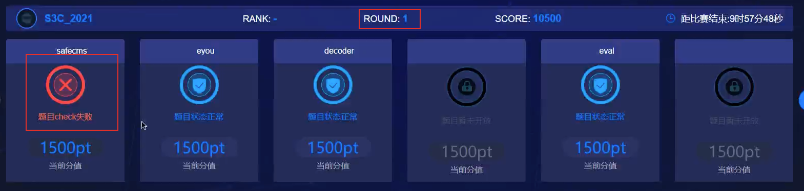

#### 9:10 - 第2轮 - 直接进攻

旁边web师傅连接成功，上去后首先挂了log和文件监控，然后拖下来源码开始扫。

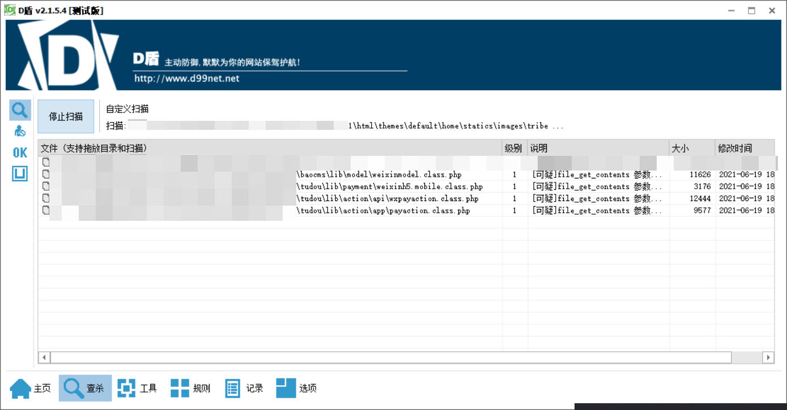


直接发现文件包含漏洞，如下

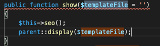

调用show方法，直接可以文件包含`/flag`

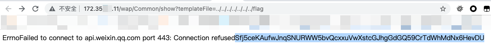

Payload:

```
./wap/Common/show?templateFile=../../../../../../../flag
```

开始写脚本全场打，之前预先写好的提交flag脚本针对的是D段的，改成C段浪费了点时间。

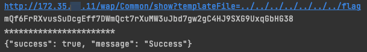

然后直线上分，靠这一步稳步在了第5名。我们将此处调用直接注释，成功防御和check。11被打到了第3轮。

此时12，13，15还没有人出，我们开始分析源码挖洞。

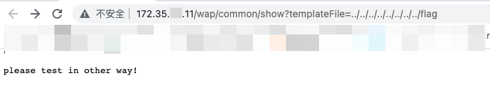

上通防的给逮到了吧

#### 9:30左右 - 第4-5轮

发现我们的服务直接就checkdown了，经确认，发现是waf和套壳的原因，我们下掉了waf和壳

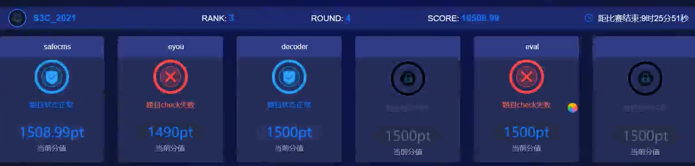

12被扣20分，15被扣10分

#### 9:50左右 - 第6-9轮

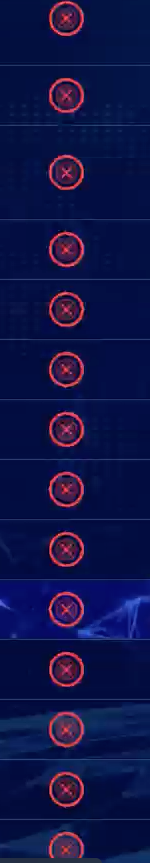

发现12大量宕机，警惕

第9轮，进到了第三名

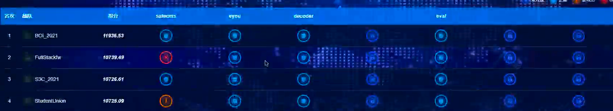

#### 10:30左右 - 第10轮 - pwn题一血

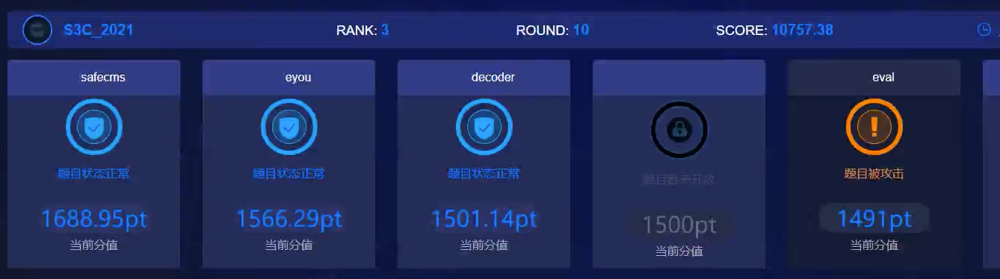

pwn全场被攻击，开始分析流量

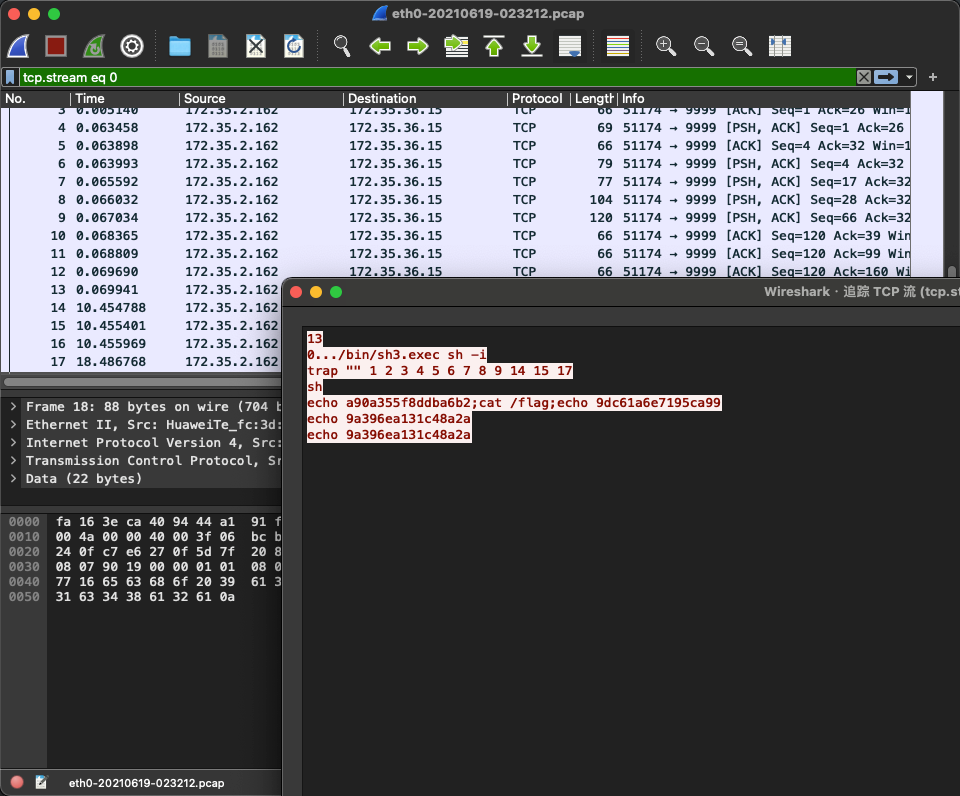

pwn爷在努力复现

第11轮，`TimeKeeper`直接凭借一题上了近700分，打到了第二，我们到了第四

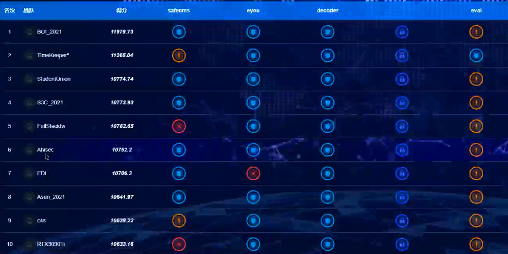

pwn爷本地套壳尝试，发现本地可以，靶机不行。此时商量对策，由于我们排名较为靠前，为减少差距，我们决定宕机。这样宕机扣10分给全场，被打扣10分给打的人，不如给全场，于是决定自行宕机。

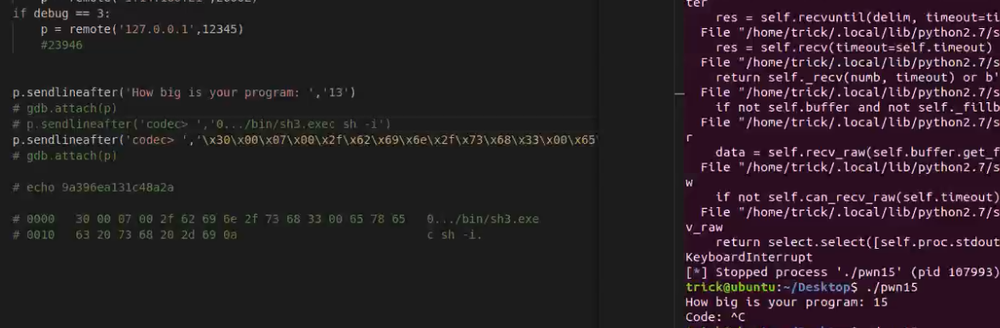

pwn爷重放失败，觉得是方式问题，我们让他稳住，慢慢检查。

#### 11:20左右 - 第15轮

13被攻击

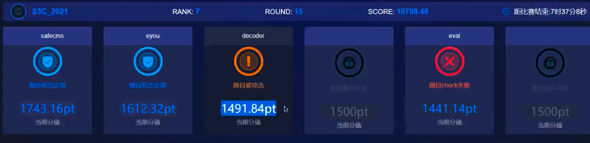

由于部分队伍重放成功，我们掉到了第7。我们鼓励pwn师傅优先重放，暂时不用修。

同时我帮忙检查了流量

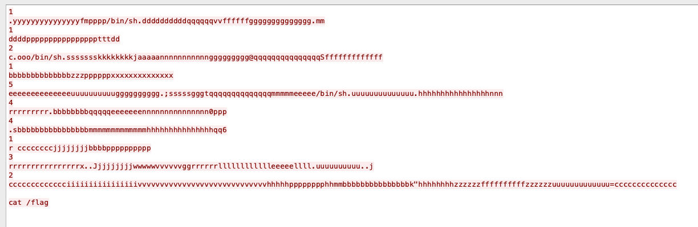

怀疑是混淆流量，最后证实不需要这么复杂。当时让pwn师傅先保存，优先看15.

#### 11:40 - 第17轮 - 被人关站

（主办方送饭来了）

突发状况，web2大量宕机。发现网站被人关闭了。经主办方提醒，web2有后台管理，密码默认，被人批量改了密码登陆后台关闭了网站。网站显示`网站暂时关闭，维护中……`

黑，真tm的黑啊。

还好网站有备份，尝试复原，发现无法复原，没有权限。

但是数据库还在，尝试修改数据库里的admin密码，发现是md5，生成后发现不对，密码应该是加盐了

**各方尝试后，在11:45左右，我们向主办方申请了重置靶机12。**

重置完成后立刻登陆，可是人家写好了批量攻击脚本，我们没人家快

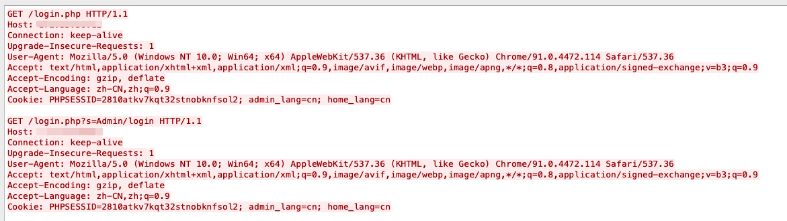

这时候突发奇想，搜索源码

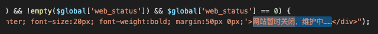

既然这有判断，那就干脆全部注释，或者把`0`改成`1`

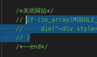

网站恢复了，但这次处理耗费了大量时间，我们已经开始乱了阵脚

此时pwn师傅那决定13也自行宕机。

#### 12:00 - 第19轮 - 修复12

危机还未解除，我们发现12还是checkdown的状态

同时12点上了新题，刷新发现，上了两道pwn题，pwn师傅直接瘫倒在了椅子上，我们三个web心里凉了一截，已经认定本次比赛我们基本上已经输了。（此时要是上1web1pwn也许还有机会，可是上了2pwn题）

pwn师傅此时发现不会重放流量，意味着我们pwn题没有输出了，同时尝试修复，发现修复就checkdown，意味着我们现在2web4pwn，4pwn完全就是送分的状态，基本上结局已定。

11/12为web，13/15为pwn，14/16为新上的pwn

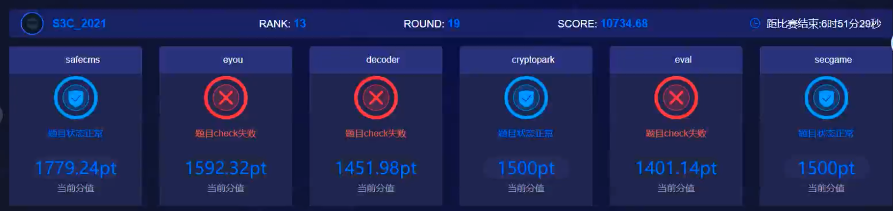

我们让pwn师傅稳住，不管结果如何我们一起接受，此时大家都心知肚明，可是没人敢点破...

**即使注定失败，我们也得战到最后**

目前web任务：修复好12

我去审计代码

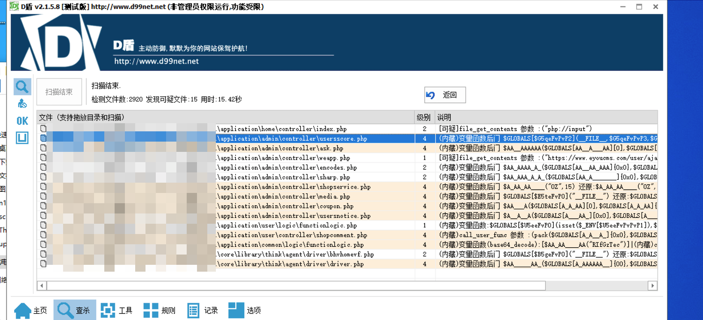

找到了Admin后台路由为`/Admin/login`（其实审流量能看到，可是被人打了混淆太恶心了）

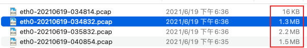

在`application/admin/controller/Admin.php`下发现验证方式

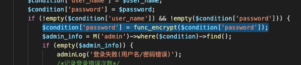

跟进`func_encrypt`看，发现确实加盐了，现在要找到位置，继续跟进

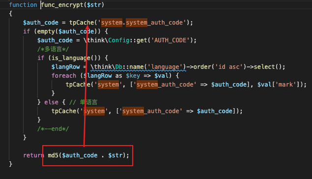

发现应该存在数据库中，幸亏数据库未被改密码

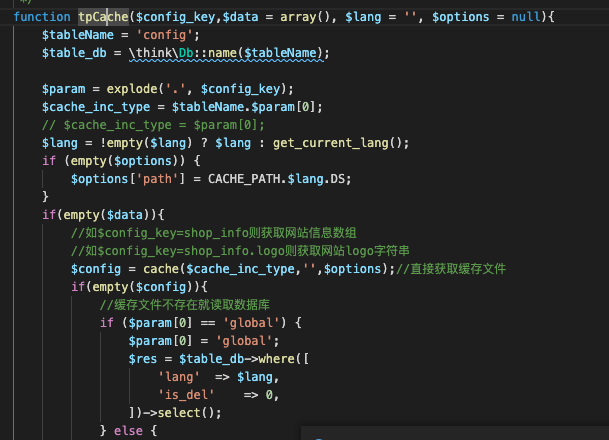

在数据库中找到盐

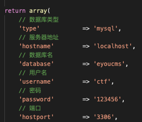

update一下admin的密码，成功修改成功，把网站恢复正常了。

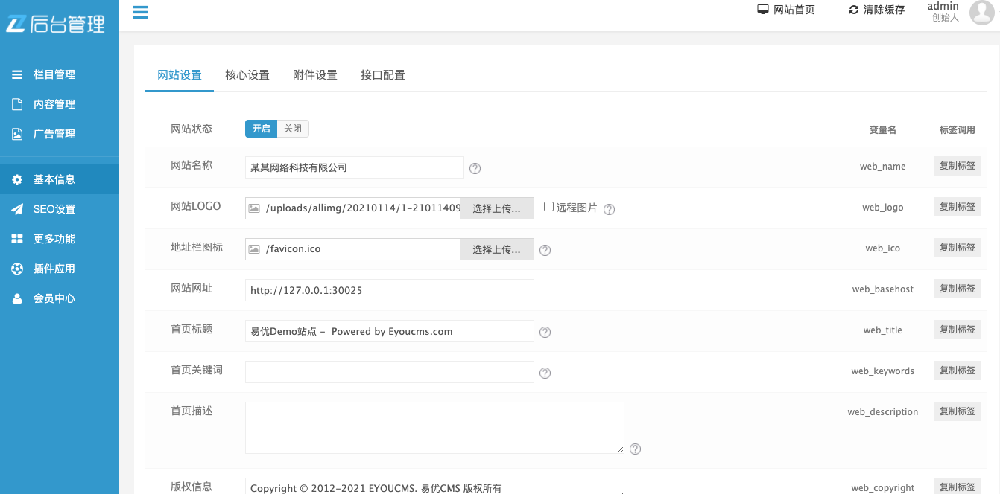

#### 12:20 - 第21轮

我们掉到了17名

此时新上的14直接被人a掉了，不过是试探性的打了两个队，下一轮就要全场打了

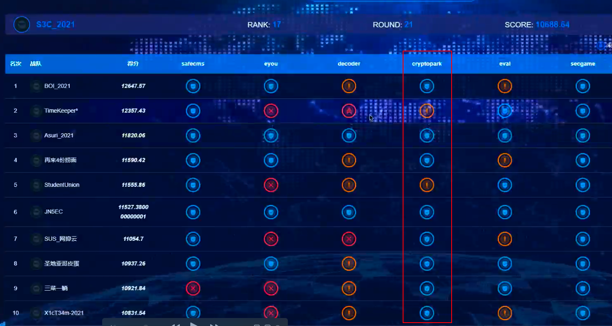

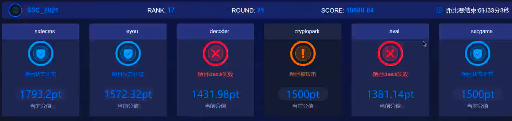

#### 13:00 - 第25轮

（主办方提示饭凉了，我们还没动过旁边的饭）

此时掉到了26名

我审计14的流量，发现流量很简单，没有地址特殊字符等等

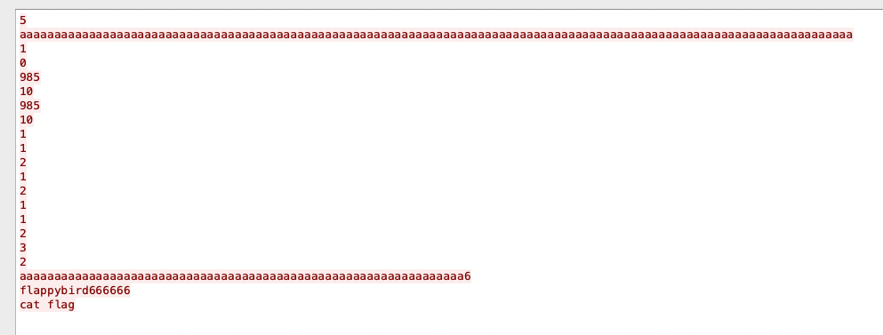

我叫pwn师傅先看这题，此时pwn师傅神情恍惚

#### 14:00 - 第31轮

此时16被人解出，我们掉到了30名

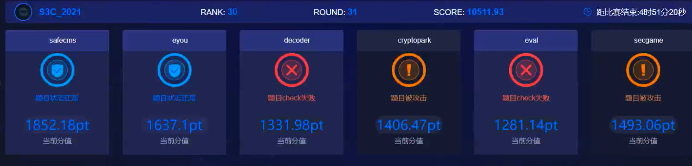

pwn师傅尝试修复14，被checkdown并被攻击

#### 14:20 - 第33轮 - pwn重放成功

pwn师傅重放14成功！

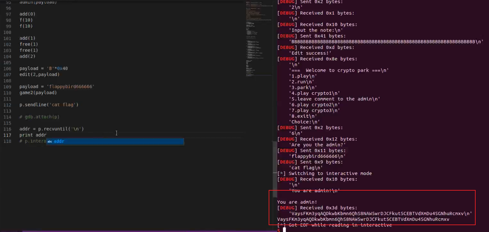

开始准备批量打，这时发现批量打脚本有问题，无法结束连接。无奈最后我们全部手交14的flag一直交到比赛结束，中间遗漏了不少

#### 15:00 - 第37轮 - 新题上场

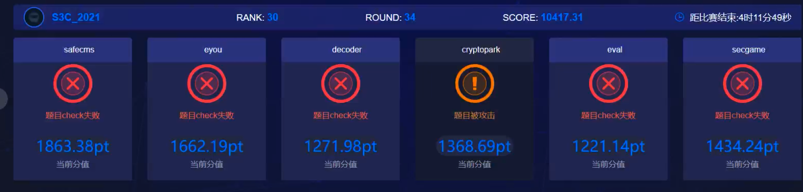

11,12全down了，16pwn师傅还是自行宕机

此时上了新题，一道简单web，我们决定努力一下

直接发现文件包含漏洞

`./statics/1.php?file=/flag`

里面是个file_get_contents，直接删除，我立刻写脚本开始全场打

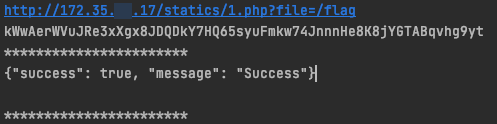

题目刚上来一轮就攻击成功，也有其他队发现了漏洞，和我们平分了分数

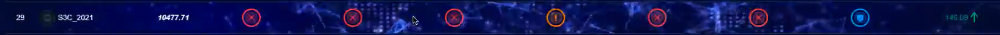

这一波的反应极其迅速，可是还是无法弥补前面的差距。但我们不想放弃。

决定一位web师傅继续审计17，另外的师傅修11/12，我继续审计流量。

#### 15:20 - 第39轮 - 再出一洞

审计发现了17第二个洞如下

`/index.php?g=Admin&m=Public&a=display&templateFile=../../../../../../../../../../../../../../flag`

与11模版相似，直接写脚本再打

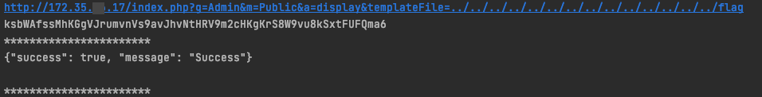

修复方法直接注释

#### 15:50 - 第42轮 - 针对check

12网站正常却checkdown，发现数据库给人删了，听说是sql注入手注给人删了库，我们仅剩一次重置机会，况且11现在还在宕机找不到原因。

队里师傅灵机一动开始分析，我们发现check流量是登陆随机用户，用户名密码都是错的，验证码不可能智能到分析验证码吧

来自10.10.10.10的check流量

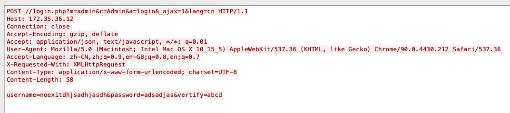

现在登陆会显示数据库错误，那就全局搜索，把`数据库错误`改成了`验证码错误`

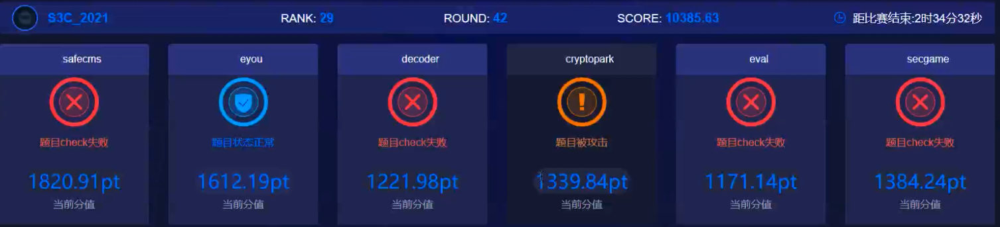

#### 16:00 - 第43轮

pwn师傅尝试修复14被checkdown并被攻击

11经确认被人写码了，占用资源疯狂写缓存

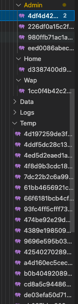

实在是不知道怎么办，如果重置的话又会被打。

pwn师傅说他累了，手 交 要洗内了

#### 16:30 - 第46轮 - 新的0day

12突然报又被打了，立刻查流量

 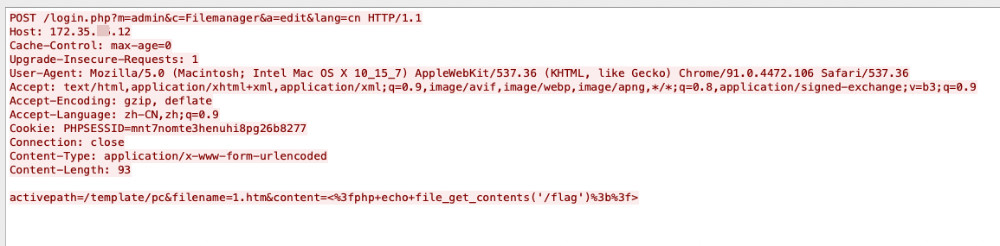

然后一刷新主页发现flag就在主页

咱们就也写，复现成功

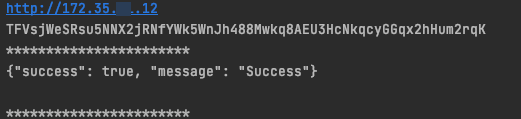

最后一句话没写进去，不知道为啥

修复就再编辑下把自己的主页恢复就行。前端rce，收获0day一个


第47轮惨状留念

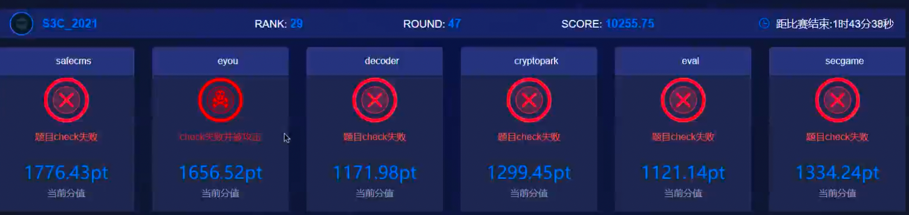


#### 17:00 - 第49轮

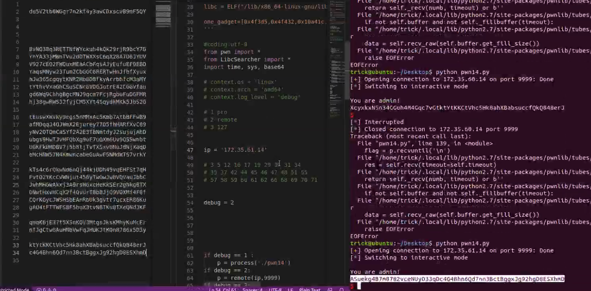

pwn师傅说他真的累了，给pwn师傅写了个一键提交，让他稍微轻松一点

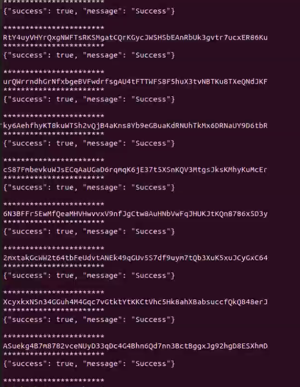

#### 17:30 - 第52轮 - 复原pwn题

比赛还剩一个小时，pwn师傅将pwn题全部复原了

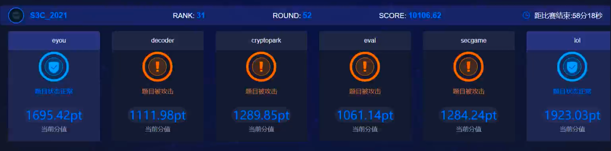

11不准备修了，不准备重置了，躺平了。

咱开了31个shell帮pwn师傅一起交flag

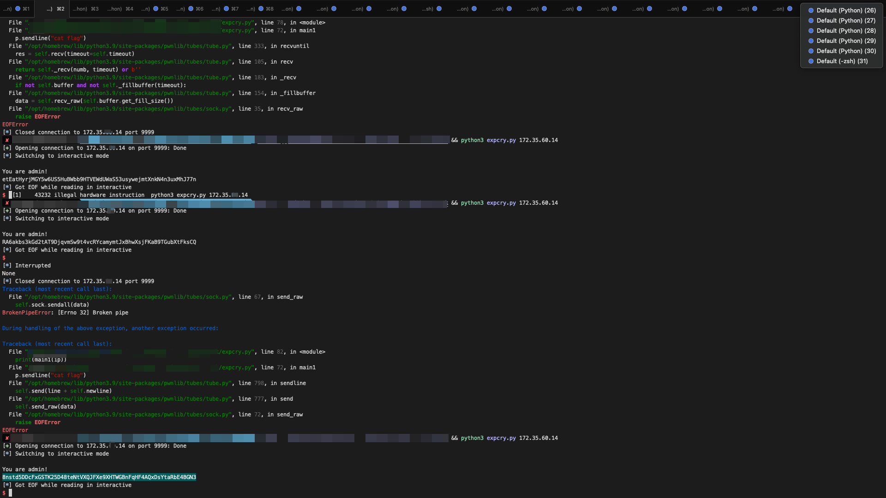

#### 18:10 - 第56轮

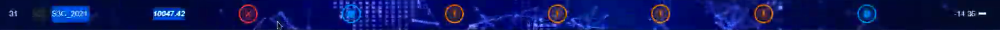

咱17从3:00刚上到最后没被打一次，而且刚上就一直在打别人，算是小小的欣慰吧。

#### 18:30 - 第57轮 - 比赛结束

最终记录

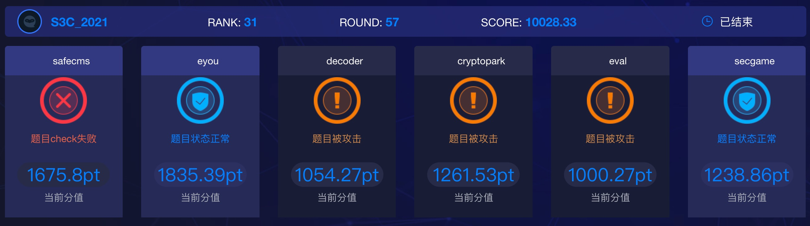

饭都凉了，一天没吃东西


---

## 后记

结束后合照都没有，我们2只队直接离开了赛场。

这是5位大三师傅们最后一次比赛了可能。

大二我是web，两位是pwn，一位准备考研去不想打ctf了，另一位很自责

那位pwn师傅回校后2小时复现了全部的题，自动化提交flag脚本注释掉一行就好了

他现在非常非常自责

---

## 总结

其实并不是pwn师傅一个人的责任，我们团队的问题还是很大。

3web1pwn的配置就把重担压在了pwn师傅身上

这次比赛说实话题目下发时间有点不合理

开赛2web2pwn，12:00竟上了2pwn，15:00上了1web

说实话就算12:00上1web1pwn，即web多3小时，pwn少3小时。咱们还是有机会的

当然咱不能怪主办方问题，咱们自身pwn薄弱是根本问题

---

## 对于下届的想法

觉得咱们对于新人的培养出现了问题，工作室的作风慵懒。

对于我们这届，进入后没有再次考核，8位师傅有的根本就不再学习技术了

排除走文艺路线，非技术路线，我们平时的技术提升全靠自己自觉

对于20届，我们应该除了注重自身的技术成长，也要关注学弟学妹们的培养

我们工作室已经有断代的迹象了，这次比赛体现了出来，明年可能会更加严重

咱希望就算从头做起，也不希望辜负前面师傅们打下的基石

就这样吧

2021年6月22日