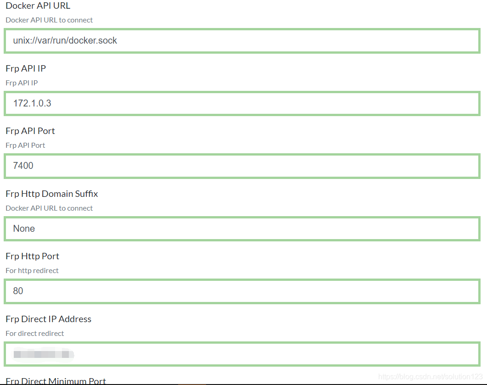

# CTFD支持动态靶机的搭建笔记（docker：ctfd+ctf-whale）

## 本篇文章最后更新于2021.2.25

转载请注明来源：https://err0r.top/article/CTFD/


## 前言
ctfd可以说是如今最方便的ctf靶场搭建平台，支持各种插件与二次开发，[赵师傅](https://www.zhaoj.in/)早前写了一款插件ctf-whale非常方便，但本人在搭建的过程中遇到了不少问题，经过不断研究终于完成，特此记录，以防后期忘记，也供大家交流学习。
赵师傅开发的插件是为了适合 [buu](https://buuoj.cn) 的架构,本篇文章采用完整流程+填坑讲解的格式。

我修改了一份CTFd，已上传github：https://github.com/Err0rCM/CTFd_with_CTFd-whale，启动后仍需按照教程后半部分配置，省去前半部分时间，如有问题请提issue或者从头自行配置。

#### 强调！
由于国内git clone实在太慢，本人采用的方法是科学上网下载zip解压的方式，可自行百度git clong与Download zip的区别。本篇文章是用本地下载zip解压上传的方式完成**在服务器上**搭建

如果阅读中操作出现问题请自行百度，翻到文末查看坑点讲解或者查看其它搭建文章

这里感谢赵师傅zhaoj，fjh1997等前辈写的文章指导，读者遇到问题或有不足或缺陷的地方请私信我添加改正

## 事前准备
**注意**：本机为CentOS7
要求：
1. 已安装基础环境，熟悉linux基本操作
2. 已安装好 Docker 和 Docker-Compose，并且启用 Docker Swarm，完成换源等操作
3. 会*科学上网*
4. 有绝对的耐心


需求：
1. 下载赵师傅改写的ctfd，赵师傅已经完成了镜像换源等操作

```
https://github.com/glzjin/CTFd.git ->赵师傅仓库
```

2. 下载frp

```
wget https://github.com/fatedier/frp/releases/download/v0.29.0/frp_0.29.0_linux_amd64.tar.gz

tar -zxvf frp_0.29.0_linux_amd64.tar.gz
```
也可以直接访问链接下载然后解压上传

3. 下载ctf-whale

```
https://github.com/glzjin/CTFd-Whale
```

4. 下载docker的frps
这里在赵师傅仓库里扒拉发现的
```
https://github.com/glzjin/Frp-Docker-For-CTFd-Whale
```

以上除ctfd解压后请确保字母小写，并只有一级文件夹

----

## 安装步骤
### 1.docker集群设置
输入命令
```
docker swarm init

docker node ls

docker node update --label-add name=linux-1 <节点 ID>
```


具体原理等可以查看其它ctfd搭建文章，文末会贴出，这里不做过多阐述

### 2.放入ctfd-whale
将解压的ctfd-whale改小写后放入/CTFd/CTFd/plugins


### 3.安装frps（这里有其他教程写的是不对的）
这里注意下，frp**不是**装在服务器机子上的，简单来说，frps与frpc都是在docker里的。（大坑在这里）
frpc是在ctfd里的，frps是在docker机里的

上传赵师傅的Frp-Docker-For-CTFd-Whale，进入目录后运行`docker-compose up -d`即可，然后`docker ps`可看到frps的容器运行中


这里看到frps有28000-28100，这是在**Frp-Docker-For-CTFd-Whale里的docker-compose.yml**，可更改配置后compose
```yaml
version: '2'

services:
  frps:
    image: glzjin/frp:latest
    restart: always
    volumes:
      - ./frp:/conf/
    entrypoint:
        - /usr/local/bin/frps
        - -c
        - /conf/frps.ini
    ports:
      - "28000-28100:28000-28100"     #可更改开放端口
      - "6490:6490"    #此处必须与frps.ini配置一致
    networks:
        default:

networks:
    default:

```

再看一下/frp/frps.ini
```
[common]
bind_port = 6490
token = randomme
```


### 4.配置ctfd

直接上**ctfd的docker-compose.yml**配置
```yaml
version: '2.2'

services:
  ctfd-nginx:
    image: nginx:1.17
    volumes:
      - ./nginx/http.conf:/etc/nginx/nginx.conf   #这里注意
    user: root
    restart: always
    ports:
      #- "85:80"     #我将这里注释掉了，这里通过nginx转发感觉速度访问速度会变慢，可能因为我的配置问题，多次尝试之后直接开8000端口访问不会对服务造成影响
      - "443:443"
    networks:
        default:
        internal:
    depends_on:
      - ctfd
    cpus: '1.00'  #可改
    mem_limit: 150M     #可改
  ctfd:
    build: .
    user: root
    restart: always
    ports:
      - "8000:8000"     #这里原本没开端口，直接打开访问网站速度会加快
    environment:
      - UPLOAD_FOLDER=/var/uploads
      - DATABASE_URL=mysql+pymysql://root:ctfd@db/ctfd
      - REDIS_URL=redis://cache:6379
      - WORKERS=1
      - LOG_FOLDER=/var/log/CTFd
      - ACCESS_LOG=-
      - ERROR_LOG=-
      - REVERSE_PROXY=true
    volumes:
      - .data/CTFd/logs:/var/log/CTFd
      - .data/CTFd/uploads:/var/uploads
      - .:/opt/CTFd:ro
      - /var/run/docker.sock:/var/run/docker.sock     #这里是添加的
    depends_on:
      - db
    networks:
        default:
        internal:
        frp:
            ipv4_address: 172.1.0.2
    cpus: '1.00'     #可改
    mem_limit: 450M     #可改

  db:
    image: mariadb:10.4
    restart: always
    environment:
      - MYSQL_ROOT_PASSWORD=ctfd
      - MYSQL_USER=ctfd
      - MYSQL_PASSWORD=ctfd
    volumes:
      - .data/mysql:/var/lib/mysql
    networks:
        internal:
    # This command is required to set important mariadb defaults
    command: [mysqld, --character-set-server=utf8mb4, --collation-server=utf8mb4_unicode_ci, --wait_timeout=28800, --log-warnings=0]
    cpus: '1.00'     #可改
    mem_limit: 750M     #可改

  cache:
    image: redis:4
    restart: always
    volumes:
      - .data/redis:/data
    networks:
        internal:
    cpus: '1.00'     #可改
    mem_limit: 450M     #可改

  frpc:    
    image: glzjin/frp:latest     #赵师傅tql
    restart: always
    volumes:
      - ./frpc:/conf/     #这里注意
    entrypoint:
        - /usr/local/bin/frpc
        - -c
        - /conf/frpc.ini
    networks:
        frp:
            ipv4_address: 172.1.0.3  #记住此处
        frp-containers:
    cpus: '1.00'     #可改
    mem_limit: 250M     #可改

networks:
    default:
    internal:
        internal: true
    frp:
        driver: bridge
        ipam:
            config:
                - subnet: 172.1.0.0/16
    frp-containers:
        driver: overlay
        internal: true
        ipam:
            config:
                - subnet: 172.2.0.0/16

```


然后**注意！注意！注意！**

在docker-compose.yml同目录下建nginx文件夹，即与第一个#这里注意相应，然后建`http.conf`文件写入以下内容

**2021年2月25日更新**目前最新版本的CTFd已经有此配置了，不需要再另加了。

转载请注明来源：https://err0r.top/article/CTFD/

```
worker_processes 4;
events {
  worker_connections 1024;
}
http {
  # Configuration containing list of application servers
  upstream app_servers {
    server ctfd:8000;
  }
  server {
    listen 80;
    client_max_body_size 4G;
    # Handle Server Sent Events for Notifications
    location /events {
      proxy_pass http://app_servers;
      proxy_set_header Connection '';
      proxy_http_version 1.1;
      chunked_transfer_encoding off;
      proxy_buffering off;
      proxy_cache off;
      proxy_redirect off;
      proxy_set_header Host $host;
      proxy_set_header X-Real-IP $remote_addr;
      proxy_set_header X-Forwarded-For $proxy_add_x_forwarded_for;
      proxy_set_header X-Forwarded-Host $server_name;
    }
    # Proxy connections to the application servers
    location / {
      proxy_pass http://app_servers;
      proxy_redirect off;
      proxy_set_header Host $host;
      proxy_set_header X-Real-IP $remote_addr;
      proxy_set_header X-Forwarded-For $proxy_add_x_forwarded_for;
      proxy_set_header X-Forwarded-Host $server_name;
    }
  }
}

```


在docker-compose.yml同目录下建frpc文件夹，即与第二个#这里注意相应，然后进入解压的/frp_0.29.0_linux_amd64文件夹，或直接上传，将


```
frpc
frpc.ini
frpc_full.ini
LICENSE

```


放入frpc文件夹
接着配置frpc.ini，直接上配置


```
[common]
token = randomme
server_addr = 172.1.0.4
server_port = 6490     #此处必须与frpc.ini配置一致
pool_count = 200
tls_enable = true

admin_addr = 172.1.0.3 #一定要加！！与后面相应
admin_port = 7400

```

此处非常重要，之前本人在这里踩了好多次坑。


### 5.配置Dockerfile

还是直接上配置，**Dockerfile**.注意，最新版本的CTFd已经更换了Dockerfile的写法，可以参考一下apt换源
```dockerfile
FROM python:3.7-alpine  #如果出现问题可尝试更换python，一般不需要
RUN sed -i 's/dl-cdn.alpinelinux.org/mirrors.ustc.edu.cn/g' /etc/apk/repositories && \
    apk update && \
    apk add linux-headers libffi-dev gcc make musl-dev py-pip mysql-client git openssl-dev   #这里注意1
RUN adduser -D -u 1001 -s /bin/bash ctfd

WORKDIR /opt/CTFd
RUN mkdir -p /opt/CTFd /var/log/CTFd /var/uploads

COPY requirements.txt .

RUN pip install -r requirements.txt -i https://mirrors.tuna.tsinghua.edu.cn/pypi/web/simple/   #这里注意2

COPY . /opt/CTFd

RUN for d in CTFd/plugins/*; do \
      if [ -f "$d/requirements.txt" ]; then \
        pip install -r $d/requirements.txt -i https://mirrors.tuna.tsinghua.edu.cn/pypi/web/simple/ ; \
      fi; \
    done; #同样注意2

RUN chmod +x /opt/CTFd/docker-entrypoint.sh
RUN chown -R 1001:1001 /opt/CTFd
RUN chown -R 1001:1001 /var/log/CTFd /var/uploads

USER 1001
EXPOSE 8000
ENTRYPOINT ["/opt/CTFd/docker-entrypoint.sh"]

```

注意点：
1. 第一处的镜像源可百度更换其它源，例如

`sed -i 's/dl-cdn.alpinelinux.org/mirrors.tuna.tsinghua.edu.cn/g' /etc/apk/repositories`
注意如果出现问题检查下最后有没有`&& \`

2. python版本一般不需要换
3. RUN第三行我将python和python-dev删掉了，如果要加上则会报错`python requires by world`之类的，请加上`python2`或`python3`，`python2-dev`或`python3-dev`.即可解决。删掉后没有发现对服务有什么影响
4. 所有`-i "url"`都是指定源，如果下载失败则可更换源再试
5. 第二处注意即我更换了源，因为之前看其他教程下载失败了


### 6.准备完毕
运行`docker-compose build`
静待完成


然后运行`docker-compose up -d`


如图所示，有WARNING即为在集群网络类，是正常情况
运行`docker ps`查看容器情况


访问 http://ip:8000 即可访问ctfd

### 配置CTFD

进入后随便设置，然后进Admin Panel进行设置

| 属性                                             | 配置                                  |
| ------------------------------------------------ | ------------------------------------- |
| Docker API URL                                   | unix://var/run/docker.sock            |
| Frp API IP                                       | frpc的ip配置                          |
| Frp API Port                                     | frpc的端口配置                        |
| Frp Http Domain Suffix                           | Docker API URL to connect（可填None） |
| Frp Http Port                                    | 80                                    |
| Frp Direct IP Address                            | 你的公网ip，本机即为127.0.0.1         |
| Frp Direct Minimum Port                          | 与之前frps最小端口呼应                |
| Frp Direct Minimum Port                          | 与之前frps最大端口呼应                |
| Max Container Count                              | 不超过最大-最小                       |
| Max Renewal Times                                | 最大实例延时次数                      |
| Frp config template                              | 填入frps的配置，只需填[common]        |
| Docker Auto Connect Containers                   | ctfd_frpc_1                           |
| Docker Dns Setting                               | 可填机器内DNS，没有可填个外网DNS      |
| Docker Swarm Nodes                               | linux-1   与前面swarm集群呼应         |
| Docker Multi-Container Network Subnet            | 内网题大子网ip配置/CIDR               |
| Docker Multi-Container Network Subnet New Prefix | 每个内网题实例的CIDR                  |
| Docker Container Timeout                         | 单位为秒                              |

最后附上我的配置图片



### 设置docker网络

这个时候运行`docker ps`
发现frpc在无限重启，因为我们还没有配置网络
运行`docker network ls`


显示ctfd_frp-containers

运行`docker network inspect ctfd_frp`


这个是docker-compose里compose后创建的网络，我们将frps加入此网络，例如我的frp容器id为12345，则运行`docker network connect ctfd_frp 12345<即frp容器id>`。再运行`docker network inspect ctfd_frp`，如下


这里可以看到ip与我们之前设置的相应。

此时运行`docker restart ctfd_frpc_1 frp_frps_1`

然后`docker ps`

最终如下


成功完成。

最后设置道题目选择（我做了汉化）


`docker ps`里可以看到容器成功启动，地址正常访问

### 坑点注意

1. 如果frpc重复出现retrying，请返回检查docker-compose.yml。找到frpc设置，检查ip设置是否正确。再检查ctfd的Admin Panel里ctfd-whale设置是否正确。
2. 如果出现安装某个文件失败问题，请更换源，很多都是源里没有指定文件造成的。可以自行访问一下网站，查看一下要下载的文件名，再进行配置。
3. 似乎docker和系统的版本会有影响，本机为CentOS7.4 64位，腾讯云，docker配置如下


4. python的问题，上面提到的，可以删除，是因为没有指定版本的原因，也可以指定版本再下载

5. ctfd运行`docker-compose up -d`后有可能提示docker-entrypoint.sh没有权限，手动加个权限即可。在CTFd文件夹下运行`chmod a+x docker-entrypoint.sh`（docker-compose.yml里其实写了加权限，但是最后并没有加上去？）

6. 如果docker容器无法启动或者frp端口无法映射可以进容器检查 

   确保docker api填写正确，如docker-compose.yml中写的unix:///var/run/docker.sock
   你也可以使用端口形式的api如[官方示例](https://success.docker.com/article/how-do-i-enable-the-remote-api-for-dockerd)：可以用IP：端口指定API

   ###### docker容器无法启动问题

   进入容器检查：

   ```
   docker exec -it <ctfd容器id> sh
   /opt/CTFd# python
   >>>import docker
   >>>client=docker.DockerClient(base_url="unix:///var/run/docker.sock")
   >>>client.images.list()
   ```

    如果api正确会列出所有镜像 

   ###### frp端口无法映射问题

   进入容器检查：

   ```
   //其实检查可以顺便检查一下上面的，因为都在ctfd容器内
   docker exec -it <ctfd容器id> sh
   /opt/CTFd# python
   >>>import requests
   >>>requests.get("http://172.1.0.3:7400/api/reload")//即frp api的地址
   
   返回
   <Response [200]> #表示成功
   ```

   如果frpc还是出现如下问题

   ```
   requests.exceptions.ConnectionError: HTTPConnectionPool(host='172.1.0.3', port=7400): Max retries exceeded with url: /api/reload (Caused by NewConnectionError('<urllib3.connection.HTTPConnection object at 0x7f8df919f850>: Failed to establish a new connection: [Errno 111] Connection refused'))
   
   ```

   则重新配置frpc。编辑/CTFd/frpc/frpc.ini

   ```
   [common]
   token = randomme
   server_addr = 172.1.0.4
   server_port = 6490
   pool_count = 200
   tls_enable = true
   
   admin_addr = 172.1.0.3 #这里千万千万别忘加，之前要被搞气死
   admin_port = 7400
   ```

   然后运行`docker restart ctfd_frpc_1`（这里再看frpc.ini会发现内容更新了，admin配置没了，不用担心）

   再进容器检查`requests.get("http://172.1.0.3:7400/api/reload")`应该就可以了`<Response [200]>`

   

7. 遇事不决请重启

8. 如果发现frp端口冲突，请检查本地frpc或者frps服务，frp是在docker上**不是在本地**的！

   ```
   systemctl stop frpc
   systemctl stop frps
   ```

   

9. 活用查看log

   ```
   docker logs <ctfd容器id>
   docker logs <frp容器id>
   ```

10. 如果修改了任意配置，请跟着修改**系列配置**，很多就是因为漏改造成的

    

11.docker ps显示正常但是无法访问

 可以使用 `docker logs ctfd_ctfd_1` 查看输出，如果发现输出类似： 


```
/usr/local/lib/python3.7/site-packages/tzlocal/unix.py:158: UserWarning: Can not find any timezone configuration, defaulting to UTC.
  warnings.warn('Can not find any timezone configuration, defaulting to UTC.')
Starting CTFd
/usr/local/lib/python3.7/importlib/_bootstrap.py:219: RuntimeWarning: greenlet.greenlet size changed, may indicate binary incompatibility. Expected 144 from C header, got 152 from PyObject
  return f(*args, **kwds)
/usr/local/lib/python3.7/importlib/_bootstrap.py:219: RuntimeWarning: greenlet.greenlet size changed, may indicate binary incompatibility. Expected 144 from C header, got 152 from PyObject
  return f(*args, **kwds)
/usr/local/lib/python3.7/importlib/_bootstrap.py:219: RuntimeWarning: greenlet.greenlet size changed, may indicate binary incompatibility. Expected 144 from C header, got 152 from PyObject
  return f(*args, **kwds)
[2020-10-11 12:31:30 +0000] [1] [INFO] Starting gunicorn 19.9.0
[2020-10-11 12:31:30 +0000] [1] [INFO] Listening at: http://0.0.0.0:8000 (1)
[2020-10-11 12:31:30 +0000] [1] [INFO] Using worker: gevent
[2020-10-11 12:31:30 +0000] [21] [INFO] Booting worker with pid: 21
[2020-10-11 12:31:31 +0000] [23] [INFO] Booting worker with pid: 23
[2020-10-11 12:31:32 +0000] [25] [INFO] Booting worker with pid: 25
[2020-10-11 12:31:34 +0000] [27] [INFO] Booting worker with pid: 27
[2020-10-11 12:31:35 +0000] [29] [INFO] Booting worker with pid: 29
[2020-10-11 12:31:36 +0000] [31] [INFO] Booting worker with pid: 31
[2020-10-11 12:31:37 +0000] [33] [INFO] Booting worker with pid: 33
[2020-10-11 12:31:39 +0000] [35] [INFO] Booting worker with pid: 35
[2020-10-11 12:31:40 +0000] [37] [INFO] Booting worker with pid: 37(一直在加)

```

 则问题为[这篇文章中所提到的问题](https://stackoverflow.com/questions/64105616/greenlet-runtime-error-and-deployed-app-in-docker-keeps-booting-all-the-workers)，只需要删除 `requirements.txt` 中的 `gevent` 版本号即可，结果类似下面这样 

```
/requirements.txt
...
redis==3.3.11
datafreeze==0.1.0
gevent
python-dotenv==0.10.3
flask-restplus==0.13.0
...
```

 然后 `docker-compose down` 再启动 `docker-compose up -d --build` 不出意外应该就能解决问题 

(更新)12.出现如下问题可参考[此issue](https://github.com/glzjin/CTFd-Whale/issues/20)提出的问题，在ctfd的docker-compose.yml添加`/var/run/docker.sock:/var/run/docker.sock`


如下


## 2021.2.25 更新

最新的CTFd改了部分代码，由于兼容性问题，需要重新编辑一些东西，例如`Dockerfile`

```dockerfile
FROM python:3.7-slim-buster
WORKDIR /opt/CTFd
RUN mkdir -p /opt/CTFd /var/log/CTFd /var/uploads

# hadolint ignore=DL3008
RUN echo 'deb http://mirrors.aliyun.com/debian/ buster main non-free contrib \
 deb http://mirrors.aliyun.com/debian/ buster-updates main non-free contrib \
 deb http://mirrors.aliyun.com/debian/ buster-backports main non-free contrib \
 deb-src http://mirrors.aliyun.com/debian/ buster main non-free contrib \
 deb-src http://mirrors.aliyun.com/debian/ buster-updates main non-free contrib \
 deb-src http://mirrors.aliyun.com/debian/ buster-backports main non-free contrib \
 deb http://mirrors.aliyun.com/debian-security/ buster/updates main non-free contrib \
 deb-src http://mirrors.aliyun.com/debian-security/ buster/updates main non-free contrib'> /etc/apt/sources.list && \
    apt-get update \
    && apt-get install -y --no-install-recommends \
        build-essential \
        default-mysql-client \
        python3-dev \
        libffi-dev \
        libssl-dev \
        git \
    && apt-get clean \
    && rm -rf /var/lib/apt/lists/*

COPY requirements.txt /opt/CTFd/

RUN pip install -r requirements.txt -i http://mirrors.aliyun.com/pypi/simple/ --no-cache-dir

COPY . /opt/CTFd

# hadolint ignore=SC2086
RUN for d in CTFd/plugins/*; do \
        if [ -f "$d/requirements.txt" ]; then \
            pip install -r $d/requirements.txt -i http://mirrors.aliyun.com/pypi/simple/ --no-cache-dir; \
        fi; \
    done;

RUN adduser \
    --disabled-login \
    -u 1001 \
    --gecos "" \
    --shell /bin/bash \
    ctfd
RUN chmod +x /opt/CTFd/docker-entrypoint.sh \
    && chown -R 1001:1001 /opt/CTFd /var/log/CTFd /var/uploads

USER 1001
EXPOSE 8000
ENTRYPOINT ["/opt/CTFd/docker-entrypoint.sh"]
```

其他pip源

```
清华：https://pypi.tuna.tsinghua.edu.cn/simple/
中国科技大学 https://pypi.mirrors.ustc.edu.cn/simple/
华中理工大学：http://pypi.hustunique.com/
山东理工大学：http://pypi.sdutlinux.org/
豆瓣：http://pypi.douban.com/simple/
```


**我整合了一下CTFd+ctfd-whale+frpc+frps，可以参考一下，[已上传github](https://github.com/Err0rCM/CTFd_with_CTFd-whale)**

### 参考文章

 [CTFd-Whale 推荐部署实践](https://www.zhaoj.in/read-6333.html)(赵师傅官方)

[手把手教你如何建立一个支持ctf动态独立靶机的靶场（ctfd+ctfd-whale）](https://blog.csdn.net/fjh1997/article/details/100850756/)

 [ctfd使用ctfd-whale动态靶机插件搭建靶场指南](https://vaala.cat/2020/09/21/ctfd使用ctfd-whale动态靶机插件搭建靶场指南/)


转载请注明来源：https://err0r.top/article/CTFD/

如果有问题请私信联系我，不足之处敬请谅解