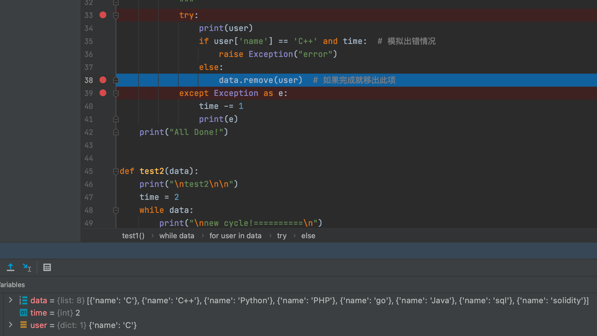
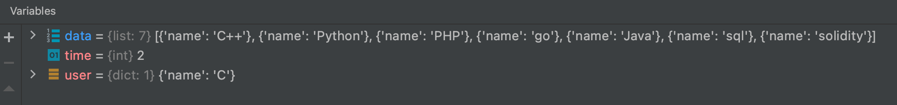
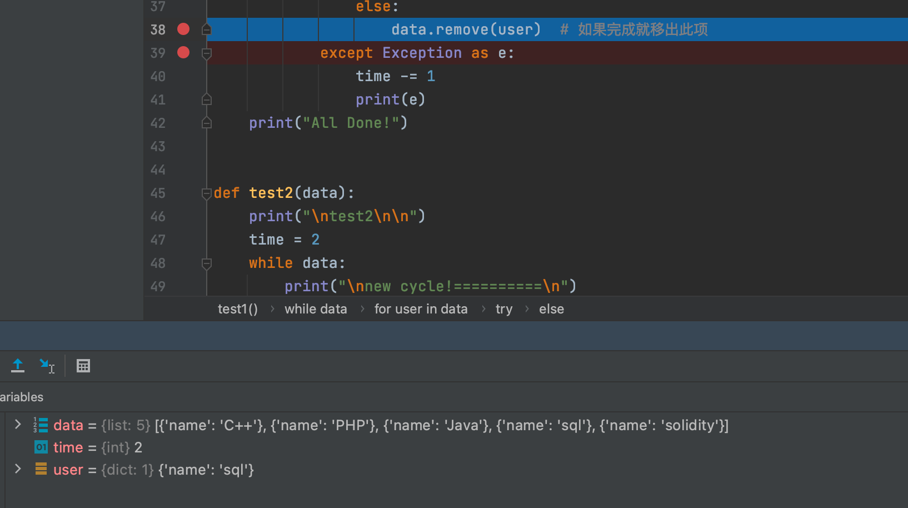
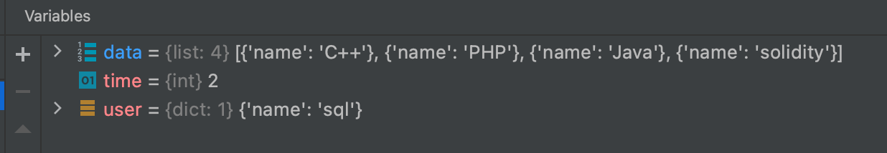
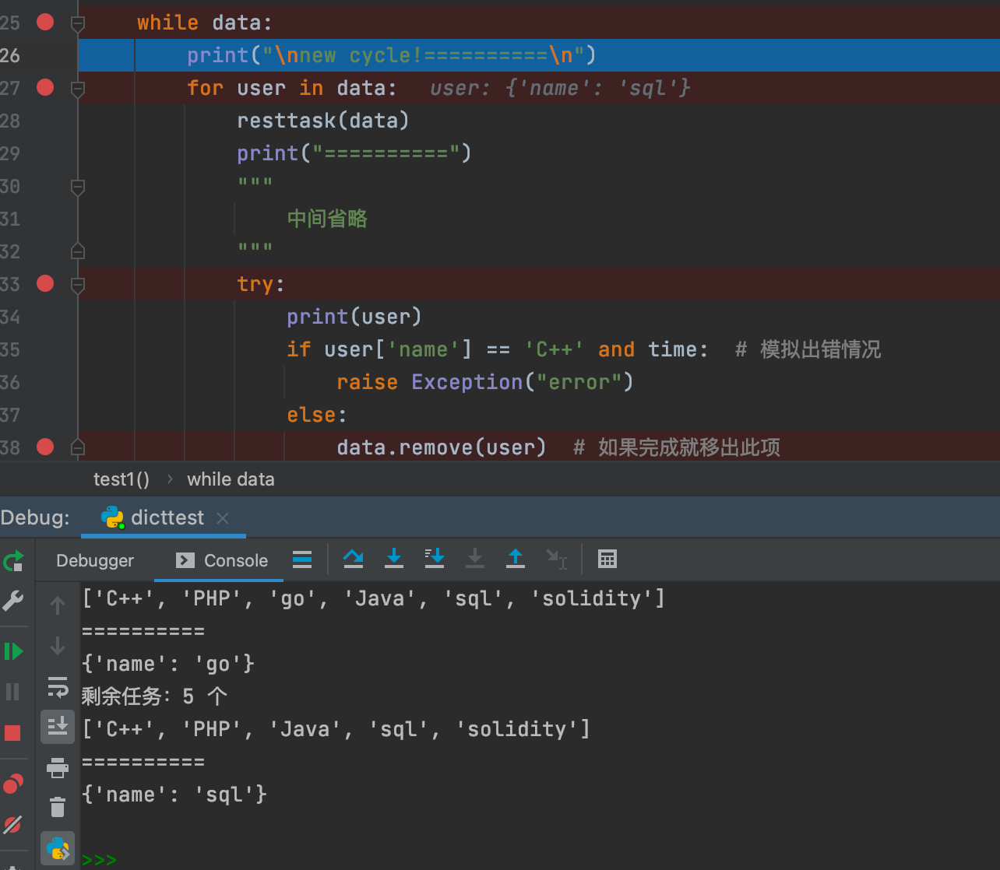
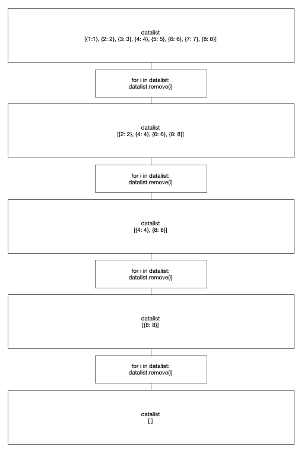

记录下撸脚本的时候处理数据用到dict时的有趣发现

<!-- more -->

字典是另一种可变容器模型，且可存储任意类型对象。

先上

## 测试代码

```python
"""
-*- coding: utf-8 -*-
@File: dicttest.py
@Author: gyy
@Time: 6月 08, 2021
"""


def show(data):
    for i in data:
        print(i)


def resttask(data):
    print("剩余任务：%d 个" % len(data))
    rest = []
    for i in data:
        rest.append(i['name'])
    print(rest)


def test1(data):
    print("\ntest1\n\n")
    time = 2
    while data:
        print("\nnew cycle!==========\n")
        for user in data:
            resttask(data)
            print("==========")
            """
                中间省略
            """
            try:
                print(user)
                if user['name'] == 'C++' and time:  # 模拟出错情况
                    raise Exception("error")  # 本次选用的测试数据均没有任何主观意见
                else:
                    data.remove(user)  # 如果完成就移出此项
            except Exception as e:
                time -= 1
                print(e)
    print("All Done!")


def test2(data):
    print("\ntest2\n\n")
    time = 2
    while data:
        print("\nnew cycle!==========\n")
        resttask(data)
        print("==========")
        user = data.pop()  # 先pop出dict
        try:
            """
                中间省略
            """
            print(user)
            if user['name'] == 'Java' and time:  # 模拟出错情况
                raise Exception("error")  # 本次选用的测试数据均没有任何主观意见
        except Exception as e:
            time -= 1
            print(e)
            data.append(user)  # 如果出错再给它加回进队列
    print("All Done!")


def getdata():
    return [{"name": "C"}, {"name": "C++"}, {"name": "Python"}, {"name": "PHP"}, {"name": "go"}, {"name": "Java"},
            {"name": "sql"},
            {"name": "solidity"}]  # 本次选用的测试数据均没有任何主观意见


if __name__ == '__main__':
    show(getdata())
    test1(getdata())
    test2(getdata())

```


---

测试结果如下

```

{'name': 'C'}
{'name': 'C++'}
{'name': 'Python'}
{'name': 'PHP'}
{'name': 'go'}
{'name': 'Java'}
{'name': 'sql'}
{'name': 'solidity'}


test1

new cycle!==========

剩余任务：8 个
['C', 'C++', 'Python', 'PHP', 'go', 'Java', 'sql', 'solidity']
==========
{'name': 'C'}
剩余任务：7 个
['C++', 'Python', 'PHP', 'go', 'Java', 'sql', 'solidity']
==========
{'name': 'Python'}
剩余任务：6 个
['C++', 'PHP', 'go', 'Java', 'sql', 'solidity']
==========
{'name': 'go'}
剩余任务：5 个
['C++', 'PHP', 'Java', 'sql', 'solidity']
==========
{'name': 'sql'}

new cycle!==========

剩余任务：4 个
['C++', 'PHP', 'Java', 'solidity']
==========
{'name': 'C++'}
error
剩余任务：4 个
['C++', 'PHP', 'Java', 'solidity']
==========
{'name': 'PHP'}
剩余任务：3 个
['C++', 'Java', 'solidity']
==========
{'name': 'solidity'}

new cycle!==========

剩余任务：2 个
['C++', 'Java']
==========
{'name': 'C++'}
error
剩余任务：2 个
['C++', 'Java']
==========
{'name': 'Java'}

new cycle!==========

剩余任务：1 个
['C++']
==========
{'name': 'C++'}

All Done!


test2

new cycle!==========

剩余任务：8 个
['C', 'C++', 'Python', 'PHP', 'go', 'Java', 'sql', 'solidity']
==========
{'name': 'solidity'}

new cycle!==========

剩余任务：7 个
['C', 'C++', 'Python', 'PHP', 'go', 'Java', 'sql']
==========
{'name': 'sql'}

new cycle!==========

剩余任务：6 个
['C', 'C++', 'Python', 'PHP', 'go', 'Java']
==========
{'name': 'Java'}
error

new cycle!==========

剩余任务：6 个
['C', 'C++', 'Python', 'PHP', 'go', 'Java']
==========
{'name': 'Java'}
error

new cycle!==========

剩余任务：6 个
['C', 'C++', 'Python', 'PHP', 'go', 'Java']
==========
{'name': 'Java'}

new cycle!==========

剩余任务：5 个
['C', 'C++', 'Python', 'PHP', 'go']
==========
{'name': 'go'}

new cycle!==========

剩余任务：4 个
['C', 'C++', 'Python', 'PHP']
==========
{'name': 'PHP'}

new cycle!==========

剩余任务：3 个
['C', 'C++', 'Python']
==========
{'name': 'Python'}

new cycle!==========

剩余任务：2 个
['C', 'C++']
==========
{'name': 'C++'}

new cycle!==========

剩余任务：1 个
['C']
==========
{'name': 'C'}

All Done!

```

---

## 任务概况

这个脚本是为了完成某任务，将所有用户存储在一个list里，即

```python
data = [{"name": "C"}, {"name": "C++"}, {"name": "Python"}, {"name": "PHP"}, {"name": "go"}, {"name": "Java"},
            {"name": "sql"},
            {"name": "solidity"}]
```

对于此任务，中间过程直接省略，有概率(不可定因素)会失败，所以有补错措施。

假使本任务补错措施完整，不会出现死循环情况。

对于本测试，模拟出错记录次数time为2次。

---

## 测试

### test1

#### 代码

```python
while data:
        print("\nnew cycle!==========\n")
        for user in data:
        	"""xxx"""
```

可见对于list中(下称用户集)的每个dict(下称用户)赋给user，然后进行处理任务(下称任务)，由于`while data` 必须所有用户全部完成任务才会结束。

#### 原思想：

对于每个用户先全部做一遍任务，然后出错的用户由补错措施补错

```python
if xxxx:
  raise Exception("error")
else:
    data.remove(user)
```

如上，模拟完成任务就从用户集中移出此用户，然后如果有任务出错，用户还在用户集里，输出一行`new cycle!==========`，继续执行任务。

然而最终输出却是如下

```
test1

new cycle!==========

剩余任务：8 个
['C', 'C++', 'Python', 'PHP', 'go', 'Java', 'sql', 'solidity']
==========
{'name': 'C'}
剩余任务：7 个
['C++', 'Python', 'PHP', 'go', 'Java', 'sql', 'solidity']
==========
{'name': 'Python'}
剩余任务：6 个
['C++', 'PHP', 'go', 'Java', 'sql', 'solidity']
==========
{'name': 'go'}
剩余任务：5 个
['C++', 'PHP', 'Java', 'sql', 'solidity']
==========
{'name': 'sql'}

new cycle!==========

剩余任务：4 个
['C++', 'PHP', 'Java', 'solidity']
==========
{'name': 'C++'}
error
剩余任务：4 个
['C++', 'PHP', 'Java', 'solidity']
==========
{'name': 'PHP'}
剩余任务：3 个
['C++', 'Java', 'solidity']
==========
{'name': 'solidity'}

new cycle!==========

剩余任务：2 个
['C++', 'Java']
==========
{'name': 'C++'}
error
剩余任务：2 个
['C++', 'Java']
==========
{'name': 'Java'}

new cycle!==========

剩余任务：1 个
['C++']
==========
{'name': 'C++'}

All Done!
```

出现了4次`new cycle!==========`

#### 实际情况：

通过debug，可以看到

第一次：



移出后：



这里并没有什么异常，我们过四次看看

第四次：



移出后：



然后，它竟然跳出了for循环



也就是说`for user in data`已经走完一遍了

后面几次同理

#### 原因：

本人才疏学浅，略有拙见，如有错误还请大佬指正！

经过考虑，觉得原因如下

python的变量定义并没有那么严格，凭感觉说，像是一种容器。

`for user in data`，其实就是user对于data处的指针，我们做个小测试

```python
dictlist = [{1:1}, {2: 2}, {3: 3}, {4: 4}, {5: 5}, {6: 6}, {7: 7}, {8: 8}]

for i in dictlist:
    print(i)
    dictlist.remove(i)
```

猜猜结果怎么样？

<details>
  <summary>结果如下</summary>
{1: 1}
{3: 3}
{5: 5}
{7: 7}
</details>

可见，只输出了单数位

`for i in datalist`测试`datalist`里的值

第一次，即为 `datalist[0]`（这里不规范地用数组来表示，比较直观）

有值为{1: 1}，任务进行

结束后`dictlist.remove(i)`

此时`dictlist->[{2: 2}, {3: 3}, {4: 4}, {5: 5}, {6: 6}, {7: 7}, {8: 8}]` 

第二次为`datalist[1]->{3: 3}`

则可以认定，对于dict的remove是即时完成，而i作为`in data`的指代，其实只是`for(int i=0;i<data.length;i++)`的等价代换。(此处的表达并不规范，仅作示意参考)

当第四次时，`dictlist->[{2: 2}, {4: 4}, {6: 6}, {7: 7}, {8: 8}]` 

`datalist[3]->{7: 7}`，remove it.

第五次，`dictlist->[{2: 2}, {4: 4}, {6: 6}, {8: 8}]`

`datalist[4]->NULL`跳出了循环



##### 问题缘由

写了个小脚本，准备按用户顺序处理任务，结果发现并没有按顺序执行，然后输出cycle后，发现按单数执行了第一遍，进一步深究。发现了这个情况。


---

### test2

那如果我直接pop出dict呢？

#### 代码

```python
while data:
  user = data.pop()
```

#### 原思想：

既然for会有越界问题(似乎Python并不觉得这是个问题hhh)，那么如果换种方式呢。

每次直接pop出一个用户，然后执行任务，如果出错就把这个用户加回用户集

```python
except Exception as e:
  data.append(user) 
```

这样一来，确实没啥问题

#### 实际情况：

对于本测试，不需要考虑其他因素，而对于撸的那个脚本，一般是不会出错，如果出错应该是一段时间内出错，即无法立刻解决，需要等待（例如这个用户今天不需要执行这个任务，补救达到上限才会执行其他用户任务，会大大拖延脚本的运行速度），这时候如test1先执行其他用户任务即可。

但在实际脚本中，由于补错措施，程序不写好补错上限就会陷入死循环。

#### 原因：

问题在于，pop会弹出用户集最后一个用户，而一旦出现错误，补错措施是将其append回用户集，即还是最后一个用户，这样就会造成死循环

这里不能用`data['xxx']=xxx`，因为实际dict有很多键值对

没啥好的根本解决方法，咱不是搞算法和开发的，没有深究这里面的方法，如有方法请师傅们指教。

---

## 总结

最后脚本还是test1的方式没有变了，既然Python没有对越界做啥表示，咱也就这样用着就好啦

这是菜鸡摸鱼撸撸小脚本时候遇到的小情况，也算是一个学习记录吧，还没有系统性地学习Python，可能学到了就会有方法可以解决了吧...
