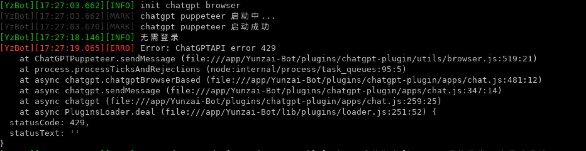

本篇记录云崽机器人在Ubuntu20下的Docker环境中的过程及chatgpt-plugin的安装和排错

<!-- more -->

宿主机环境：Ubuntu20虚拟机

Yunzai环境：Docker

## 前言

原文地址：https://err0r.top/article/Yunzai-chatgptPlugin/

转载请注明作者和原文地址，谢谢！

本人原批（开门见山），一直在用云崽，最近chatGPT大火，偶然发现有大佬写了云崽的chatGPT插件，家里买了台新NAS（群晖黑转白），总想搞点什么折腾一下，于是乎把在云服务器上的云崽迁移了下来，并且重新安装了一遍。加入了chatGPT插件的群发现不少人有奇奇怪怪的问题，自己也遇到其中不少，就顺手写下此篇文章，给其他有问题的同学一个参考。由于本人非酋抽不到bing的测试资格，相关配置等拿到资格了再说，生气。

**声明**：本方案较为繁琐，可以直接跳到对应的章节看对应的项目怎么安装。本教程记录了全部安装过程，贴出很多指令为防本人后续忘记，如您已经配置完毕即可跳过对应小节:)

## 环境及插件准备

系统：Ubuntu20虚拟机 下载地址：[MSDN](https://next.itellyou.cn/)

YunzaiBot：【2023.2.15 yunzai的github仓库被ban，目前转为gitee下载】[Yunzai](https://gitee.com/Le-niao/Yunzai-Bot)

chatGPT-Plugin：[chatGPT-Plugin](https://github.com/ikechan8370/chatgpt-plugin)

**以下选装，非本文主题**

Guoba-Plugin：[Guoba-Plugin](https://github.com/guoba-yunzai/guoba-plugin)

miao-plugin：[miao-plugin](https://github.com/yoimiya-kokomi/miao-plugin)

rconsole-plugin：[rconsole-plugin](https://gitee.com/kyrzy0416/rconsole-plugin)

xiaoyao-cvs-plugin：[xiaoyao-cvs-plugin](https://github.com/ctrlcvs/xiaoyao-cvs-plugin)

xitian-plugin：[xitian-plugin](https://github.com/XiTianGame/xitian-plugin)

## 安装过程

保姆级教程，大佬们可以跳过前段部分

### 安装Ubuntu20及相关设置

因为是在NAS上跑虚拟机，所以我选择了Live版，纯命令行版本，安装过程会让你配一些选项，这里选择装一下OpenSSH，后续可以远程连接

#### 配置root登陆

**注意，本次安装是在家里的NAS上安装，如在公网或非安全环境下请勿配置root登陆并设置强密码！！！**

**为方便复制和非root用户，本文中大部分可能需要权限的指令都加上了`sudo`，请自行斟酌**

默认的ssh配置`/etc/ssh/sshd_config`是这样的

```sh
# PermitRootLogin without-password
```

是注释状态，我们不用管，直接在最后补一行`PermitRootLogin yes`即可

命令行运行：

```sh
sudo echo "PermitRootLogin yes" >> /etc/ssh/sshd_config
sudo service ssh restart
```

即可远程登录系统

### 安装Docker及docker-compose

（很多人喜欢直接在本机装yunzai，不过我还是喜欢Docker版的，虽说有点麻烦，但整理方便）

[docker官网的文档](https://docs.docker.com/engine/install/ubuntu/)

> 新装的系统不存在旧版本安装的问题，如果已安装Docker且无法正常运行，请运行：`sudo apt-get remove docker docker-engine docker.io containerd runc`

不做过多阐述，按照命令行如下安装即可：

```sh
sudo apt-get update
sudo apt-get install \
    ca-certificates \
    curl \
    gnupg \
    lsb-release -y
sudo mkdir -m 0755 -p /etc/apt/keyrings
curl -fsSL https://download.docker.com/linux/ubuntu/gpg | sudo gpg --dearmor -o /etc/apt/keyrings/docker.gpg
echo \
  "deb [arch=$(dpkg --print-architecture) signed-by=/etc/apt/keyrings/docker.gpg] https://download.docker.com/linux/ubuntu \
  $(lsb_release -cs) stable" | sudo tee /etc/apt/sources.list.d/docker.list > /dev/null
sudo apt-get update
sudo apt-get install docker-ce docker-ce-cli containerd.io docker-buildx-plugin docker-compose-plugin -y
```

如果有问题请去官网查看文档，都有很详细的解释和排错

### 设置代理

这里是在宿主机使用clash设置代理和自动启动

#### 下载clash

[clash](https://github.com/Dreamacro/clash/releases)

```sh
wget -O clash.gz https://github.com/Dreamacro/clash/releases/download/v1.13.0/clash-linux-amd64-v1.13.0.gz
```


下载好后解压安装包中 clash 到 /usr/local/bin/ 目录下，给予执行权限，并以此在全局环境运行软件

```sh
gzip -dc clash.gz > /usr/local/bin/clash
chmod +x /usr/local/bin/clash
```

创建配置文件目录，并[下载 MMDB 文件](https://www.sub-speeder.com/client-download/Country.mmdb)（如果速度慢可以直接下载后上传）

> MMDB 文件可以提供 IP 与地理位置相对应的数据信息，可以更精确地确认 IP 所对应地域，以此提高网络分流的效率和质量

```sh
mkdir /etc/clash
wget -O /etc/clash/Country.mmdb https://www.sub-speeder.com/client-download/Country.mmdb
```

#### 持久化运行

创建 systemd 脚本，以使程序持久化运行

```sh
sudo echo "[Unit]
Description=clash daemon
 
[Service]
Type=simple
# 注意此处user
User=root
ExecStart=/usr/local/bin/clash -d /etc/clash/
Restart=on-failure
 
[Install]
WantedBy=multi-user.target" > /etc/systemd/system/clash.service
```

重载 systemd

```sh
sudo systemctl daemon-reload
```

#### ********

下载你的配置文件后写入`/etc/clash/config.yaml`

或者直接wget下载

```sh
sudo wget -O /etc/clash/config.yaml https://example.com/config.yaml
```

#### 设置系统代理

```sh
sudo echo 'export http_proxy="http://127.0.0.1:7890"
export https_proxy="https://127.0.0.1:7890"
export no_proxy="localhost, 127.0.0.1"' > /etc/profile.d/proxy.sh
```

#### 重载 /etc/profile 配置

```sh
source /etc/profile
```

#### 启动clash并设置开机自启

```sh
systemctl start clash
systemctl enable clash
```

此时可以通过`curl www.google.com`测试代理是否正常

### 下载Yunzai及对应的插件

#### 下载Yunzai

在你想要的目录运行

```sh
git clone --depth=1 -b main https://gitee.com/Le-niao/Yunzai-Bot.git
```

进入Yunzai目录

```sh
cd Yunzai-Bot/
```

**注意：至此以后所有的目录默认均在Yunzai目录下！！！**

#### 下载对应插件

**注意**：如果卡的话请将`github`更换为`gitee`，如不需要可跳过本小节，安装插件前请看好对应作用及说明，本教程会展示安装全部插件及所需库的过程

##### chatGPT-Plugin

```sh
git clone --depth=1 https://github.com/ikechan8370/chatgpt-plugin.git ./plugins/chatgpt-plugin
```

##### Guoba-Plugin

```sh
git clone --depth=1 https://github.com/guoba-yunzai/guoba-plugin.git ./plugins/Guoba-Plugin/
```

##### miao-plugin

```sh
git clone --depth=1 https://github.com/yoimiya-kokomi/miao-plugin.git ./plugins/miao-plugin/
```

##### rconsole-plugin

```sh
git clone --depth=1 https://gitee.com/kyrzy0416/rconsole-plugin ./plugins/rconsole-plugin/
```

##### xiaoyao-cvs-plugin

```sh
git clone --depth=1 https://github.com/Ctrlcvs/xiaoyao-cvs-plugin.git ./plugins/xiaoyao-cvs-plugin/
```

##### xitian-plugin

```sh
git clone --depth=1 https://github.com/XiTianGame/xitian-plugin.git ./plugins/xitian-plugin/
```

### 更新docker-compose.yaml文件

如果您不使用docker搭建Yunzai，请跳过此步骤

正常情况下默认的docker-compose文件肯定是不行的，我们要把插件加进去，下面给出一份参考文件，可以直接复制但请一定对比看好注释，默认的注释已全部删除，仅放出修改部分的注释

```yaml
version: "3"
services:
  yunzai-bot:
    container_name: yunzai-bot
    # image: swr.cn-south-1.myhuaweicloud.com/sirly/yunzai-bot:v3         # 使用云端精简镜像
    image: swr.cn-south-1.myhuaweicloud.com/sirly/yunzai-bot:v3plus   # 使用扩展镜像，如果你想节省资源可以注释此行用上面的精简镜像
    restart: always
    ports:
      - "50831:50831"      # 映射锅巴插件端口
      - "5900:5900"        # 此端口为chatGPT浏览器模式所需的桌面程序所释放的端口
    volumes:
      - ./yunzai/config/:/app/Yunzai-Bot/config/config/
      - ./yunzai/genshin_config:/app/Yunzai-Bot/plugins/genshin/config
      - ./yunzai/logs:/app/Yunzai-Bot/logs
      - ./yunzai/data:/app/Yunzai-Bot/data
      
      # 以下目录是插件目录，安装完插件后需要手动添加映射（如有其他插件请自行添加）
      # 映射格式：./yunzai/plugins/<插件目录名>:/app/Yunzai-Bot/plugins/<插件目录名>
      - ./yunzai/plugins/example:/app/Yunzai-Bot/plugins/example                          # 单js插件目录
      - ./yunzai/plugins/miao-plugin:/app/Yunzai-Bot/plugins/miao-plugin                  # 喵喵插件
      # - ./yunzai/plugins/py-plugin:/app/Yunzai-Bot/plugins/py-plugin                      # 新py插件
      - ./yunzai/plugins/xiaoyao-cvs-plugin:/app/Yunzai-Bot/plugins/xiaoyao-cvs-plugin    # 图鉴插件
      - ./yunzai/plugins/chatgpt-plugin:/app/Yunzai-Bot/plugins/chatgpt-plugin    # chatgpt插件
      - ./yunzai/plugins/xitian-plugin:/app/Yunzai-Bot/plugins/xitian-plugin    # xitian插件
      - ./yunzai/plugins/rconsole-plugin:/app/Yunzai-Bot/plugins/rconsole-plugin    # R插件
      - ./yunzai/plugins/Guoba-Plugin:/app/Yunzai-Bot/plugins/Guoba-Plugin                # 锅巴插件
    environment:
      - CUID=1000
      - CGID=1000
    depends_on:
      redis: { condition: service_healthy }
    deploy:
      resources:
        limits:
          memory: 2G

  redis:
    container_name: yunzai-redis
    image: redis:alpine
    restart: always
    volumes:
      - ./redis/data:/data
      - ./redis/logs:/logs
    healthcheck:
      test: [ "CMD", "redis-cli", "PING" ]
      start_period: 10s
      interval: 5s
      timeout: 1s

```


### 【docker】开始安装

**如果您不使用docker版请按照Yunzai的README所提供的方式启动**

Yunzai目录下运行

```sh
docker compose up -d
```

> 如果您是安装的docker compose standalone，非plugin，则命令为`docker-compose up -d`


安装完毕后运行`docker ps`会看到如上


### 进行相关配置

#### Yunzai的配置

进入docker容器

```sh
docker exec -it yunzai-bot bash
```


结合前图所示，可以看到命令行前符号变成了`root@2c02297a53c1`，而这个`2c02297a53c1`就是前图所示我的yunzai-bot的`CONTAINER ID`，说明我们**已经进入了yunzai-bot容器内部**

在容器内部运行`exit`即可退出容器，标志为命令行符号变成主机名了

> 接下的步骤基本同在主机安装的步骤一样

在**容器内部**的Yunzai目录（默认就在，不用动）运行

```sh
npm run login
```

按照提示输入账号密码，登录端口默认ipad就行

可以不设置密码，进行扫码登录，但扫码登录要求设备和系统**在同一个网络环境下**


#### 获取ticket

触发了验证选择`手动获取ticket`的步骤，选择`滑动验证app`请跳过并按照要求操作

1. 先打开给出的链接，在浏览器中首先**按下F12或直接打开开发者模式**
2. 打开"网络"或"Network"
3. 完成滑动验证
4. 在网络请求中找到`cap_union_new_verify`，点击Preview，右键`ticket`选择`Copy value`
5. 回到系统粘贴


如果触发了二次验证，请按要求验证

> 2023.2.15 本人试了几台机子`网页扫码验证`都显示不出来
>
> 


成功登陆后本地就保存了登录的token，按CTRL+C退出到容器命令行界面


#### chatGPT对应的配置

配置文件位置

```sh
plugins/chatgpt-plugin/config/index.js
```

> 注意：如果您是docker用户，在安装完（即执行完`docker-compose up -d`后，可以发现Yunzai-bot的目录下多了一个yunzai文件夹，这是Yunzai在编译的时候映射入docker容器内的文件夹，文件夹目录如下
>
> ```
> yunzai
> ├── config
> │   ├── bot.yaml
> │   ├── group.yaml
> │   ├── other.yaml
> │   ├── qq.yaml
> │   └── redis.yaml
> ├── data
> │   ├── [你登录的qq号]
> │   │   └── device-[你登录的qq号].json
> │   ├── html
> │   └── image
> ├── genshin_config
> ├── logs
> └── plugins
> ```
>
> 所有的文件修改请在此文件夹下修改，如我需要改`qq.yaml`，请勿在`Yunzai-Bot/config/qq.yaml`更改，而是在`Yunzai-Bot/yunzai/config/qq.yaml`修改！！！
>
> 此处有两种方案
>
> 1. **退出容器**，在宿主机的`Yunzai-Bot/yunzai/plugins/chatgpt-plugin/config/index.js`
> 2. 在容器内，修改`Yunzai-Bot/plugins/chatgpt-plugin/config/index.js`

请自行查看文档并上传或vim等方式修改

##### 【docker】配置代理（重点）

**如使用docker版，请一定一定注意代理的配置！！！在配置文件的第二行**

```js
const PROXY = ''
```

注意！由于是docker版，docker内部的网络与宿主机不同，我们需要宿主机的代理，请注意宿主机的代理需设置为允许lan连接

> Docker 服务默认会创建一个 *docker0* 网桥(其上有一个 docker0 内部接口)，它在内核层连通了其他的物理或虚拟网卡

在宿主机，即主机运行

```sh
docker network ls
```


可以看到有一个yunzai的网络，运行命令查看

```sh
docker network inspect yunzai-bot_default
```


可以看到这就是我的yunzai-bot所在的虚拟网，我们只要关注`IPAM-Config-Gateway`即可，这个地址就是我们宿主机和这个网络通信的地址，也是我们宿主机在这个网络的地址，所以我们的代理地址就需要填这个而不是127.0.0.1

```js
// 每个人每台机子随机分配地址，不一定一样，请按照自己的情况配置，这里我就该配置
const PROXY = 'http://172.21.0.1:7890' // 7890是我宿主机的clash默认的http代理端口
```

#### 安装依赖

如果是docker用户请注意，所有依赖均需要在**容器内**安装，如未安装插件则无需安装其依赖

miao-plugin/py-plugin/xiaoyao-cvs-plugin/Guoba-Plugin插件依赖默认在docker构建镜像时就已经安装，无需额外操作

chatGPT-Plugin所需依赖

```sh
pnpm install -w undici chatgpt showdown mathjax-node delay uuid remark strip-markdown random puppeteer-extra-plugin-recaptcha puppeteer-extra puppeteer-extra-plugin-stealth @waylaidwanderer/chatgpt-api keyv-file
```

rconsole-plugin所需依赖

```sh
pnpm add mongodb axios tunnel twitter-api-v2 -w
```

### 【docker】最后

重启Yunzai-Bot容器

```sh
docker restart yunzai-bot
```

基础安装教程到这里就结束了

## 【docker】chatGPT-Plugin想使用浏览器模式怎么办

chatGPT-Plugin想使用浏览器模式需要有桌面环境

1. 宿主机执行，安装xvfb和fluxbox，并选择安装screen或tmux，这里以screen演示

```sh
apt-get install x11vnc xvfb fluxbox screen
```

2. 启动桌面环境

首先运行

```sh
screen
```

接着在弹出来的新命令行输入

```sh
x11vnc -create -env FD_PROG=/usr/bin/fluxbox -env X11VNC_FINDDISPLAY_ALWAYS_FAILS=1   -env X11VNC_CREATE_GEOM=${1:-1024x768x16}   -nopw -forever
```

然后直接关闭这个窗口吧～

> 你问我为啥，因为这个一启动就一直占前台，没机会CTRL+D退到后台，如果你的机器可以那就退到后台就行
>
> 用nohup挂后台反而多此一举

3. 使用vnc客户端连接至桌面

vnc连接你宿主机的 `[ip]:5900`，之前的端口映射就是为了把容器内部的端口映射到宿主机

> 注意！再次强调安全问题！！！注意本命令使用默认5900端口和无密码，请勿在公网或非安全环境下使用


使用vnc客户端连接至云桌面，右键Applications > Shells > Bash打开终端，然后进入Yunzai目录（默认就是）下运行node app即可

## 问题解答

### 【bot】载入插件错误：chat

问题详情：Error [ERR_MODULE_NOT_FOUND]: Cannot find package 'showdown' imported from /app/Yunzai-Bot/plugins/chatgpt-plugin/apps/chat.js

原因：没装依赖

解决方式：请参考文档用`pnmp install -w xxx`安装依赖


### 【bot】chatgpt puppeteer 启动失败

问题详情：TypeError: this.browser.pages is not a function

原因：没有桌面环境

解决方式：请参照文档安装桌面环境`apt-get install x11vnc xvfb fluxbox`


### 【bot】-10003

问题详情：Error: unsuccessful retcode: -10003

原因：登录失效

解决方式：重新登录bot，运行`node app`或`npm run login`


### 【bot】我的bot突然掉线再登录提示禁止登录/版本过低怎么办

问题详情：[温馨提示]当前QQ版本过低，请升级至最新版本后再登录。点击进入下载页面

原因：Yunzai-bot的内置QQ版本与最新版本相差过大，且账号容易被风控

解决方式：不保证成功

1. 更改登录设备，在`config/qq.yaml`修改登录设备

> 注意：如果您是docker用户，在安装完（即执行完`docker-compose up -d`后，可以发现Yunzai-bot的目录下多了一个yunzai文件夹，这是Yunzai在编译的时候映射入docker容器内的文件夹，文件夹目录如下
>
> ```
> yunzai
> ├── config
> │   ├── bot.yaml
> │   ├── group.yaml
> │   ├── other.yaml
> │   ├── qq.yaml
> │   └── redis.yaml
> ├── data
> │   ├── [你登录的qq号]
> │   │   └── device-[你登录的qq号].json
> │   ├── html
> │   └── image
> ├── genshin_config
> ├── logs
> └── plugins
> ```
>
> 所有的文件修改请在此文件夹下修改，如我需要改`qq.yaml`，请勿在`Yunzai-Bot/config/qq.yaml`更改，而是在`Yunzai-Bot/yunzai/config/qq.yaml`修改！！！
>
> 

2. 尝试修改设备信息


3. 膜一膜[Le-niao](https://gitee.com/Le-niao/Yunzai-Bot)大佬更新下云崽


### 【docker】我执行docker compose的时候报如下错误怎么办

问题详情：ERROR: The Compose file './docker-compose.yaml' is invalid


原因：docker compose版本过低

解决方式：升级docker compose版本——[重新下载plugin或standalone](https://docs.docker.com/compose/install/)

### 【docker】在docker Running的过程中报如下错误怎么办

问题详情：Your kernel does not support swap limit capabilities or the cgroup is not mounted


原因：系统默认未开启swap内存限制

解决方式：编辑`/etc/default/grub file`，注意有**两个文件**，建议用vim


```sh
vim /etc/default/grub file
```

添加一行，如果用vin需要按`:wq`后按回车再来一次保存

`GRUB_CMDLINE_LINUX="cgroup_enable=memory swapaccount=1"`

执行

```sh
sudo update-grub
```

执行完后重启系统


### 【ChatGPT】timed out

问题详情：Error: ChatGPT timed out waiting for response

原因：卡了

解决方式：再试试


### 【ChatGPT】ERR_ABORTED

问题详情：Error: net::ERR_ABORTED at https://chat.openai.com/auth/login

原因：在恢复会话登录的时候失败了

解决方式：再试试


### 【ChatGPT】ERR_CONNECTION_RESET

问题详情：Error: net::ERR_CONNECTION_RESET at https://chat.openai.com/chat

原因：1. 网络不好 2. 代理挂了

解决方式：重试或者换代理


### 【ChatGPT】ERR_PROXY_CONNECTION_FAILED

问题详情：Error: net::ERR_PROXY_CONNECTION_FAILED at https://chat.openai.com/chat

原因：代理挂了

解决方式：检查代理配置


### 【ChatGPT】ECONNRESET

问题详情：FetchError: request to https://chat.duti.tech/api/conversation failed, reason: read ECONNRESET

原因：连不上服务器

解决方式：检查代理


### 【ChatGPT】Not signed in

问题详情：Error: Not signed in

原因：登录流程结束但是实际上未登录，一般是主机卡了一下，或者服务器capacity了

解决方式：再试试，一般要么就好了要么就会报其他的错 = =


### 【ChatGPT】404

问题详情：Error: ChatGPTAPI error 404

原因：一般是服务器抽风，少量情况是代理被ban了

解决方式：更换代理或再试试


### 【ChatGPT】429

问题详情：Error: ChatGPTAPI error 429

原因：请求太多，多半是代理的问题

解决方式：关了浏览器重开或更换代理再试试




### 【ChatGPT】capacity

问题详情：Error: ChatGPT is at capacity

原因：每天晚上固定时间忙碌

解决方式：尊贵的plus用户永远不会遇到此问题


待续...

---

### 【标签】问题标题

问题详情：

原因：

解决方式：


## 后记

还没想好，还会更新


原文地址：https://err0r.top/article/Yunzai-chatgptPlugin/

转载请注明作者和原文地址，谢谢！

## 参考文章及感谢

[Yunzai-Bot](https://gitee.com/Le-niao/Yunzai-Bot)

[chatGPT-Plugin作者](https://github.com/ikechan8370/chatgpt-plugin)

[使用 Clash 为 Linux 提供网络代理服务](https://www.ahdark.com/som/1643.shtml)

所有在chatGPT-Plugin插件群的群友们，爱你们～