记录下之前搭建过程

<!-- more -->

## 前置要求：

1. 装好phpstorm
2. 装好docker
3. 下载docker-compose(可选)

最后附一键docker-compose搭建方法，可附带mysql，感谢王神指导。

## 手动搭建

### docker进行PHP多版本部署

`docker run -d -p 10001:80 -v /Users/gyy/dockerPHP/www/html:/var/www/html php:5.6-apache`
`docker run -d -p 10002:80 -v /Users/gyy/dockerPHP/www/html:/var/www/html php:7.4-apache`
`docker run -d -p 10003:80 -v /Users/gyy/dockerPHP/www/html:/var/www/html php:7.2-apache`
`docker run -d -p 10004:80 -v /Users/gyy/dockerPHP/www/html:/var/www/html php:7.3-apache`
`docker run -d -p 10005:80 -v /Users/gyy/dockerPHP/www/html:/var/www/html php:7.0-apache`

随意，要啥版本起啥容器，可以去https://hub.docker.com/_/php 看

参数解释：

```
-d ： 后台运行
-v ： 目录映射，因为我们要把本地目录映射到容器目录
	本地目录:容器目录
```


### 安装xdebug模块

安装vim并换源

```sh
echo 'deb http://mirrors.aliyun.com/debian/ buster main non-free contrib \
			deb http://mirrors.aliyun.com/debian/ buster-updates main non-free contrib \
 			deb http://mirrors.aliyun.com/debian/ buster-backports main non-free contrib \
 			deb-src http://mirrors.aliyun.com/debian/ buster main non-free contrib \
 			deb-src http://mirrors.aliyun.com/debian/ buster-updates main non-free contrib \
 			deb-src http://mirrors.aliyun.com/debian/ buster-backports main non-free contrib \
 			deb http://mirrors.aliyun.com/debian-security/ buster/updates main non-free contrib \
 			deb-src http://mirrors.aliyun.com/debian-security/ buster/updates main non-free contrib'> /etc/apt/sources.list \
&& apt update && apt install -y vim
```

#### **更新一种换源方法，基本上各种系统均有效**：

##### amd:

```sh
sed -i 's/http:\/\/archive.ubuntu.com\/ubuntu\//http:\/\/mirrors.tuna.tsinghua.edu.cn\/ubuntu\//g' /etc/apt/sources.list && \
sed -i 's/http:\/\/security.ubuntu.com\/ubuntu\//http:\/\/mirrors.tuna.tsinghua.edu.cn\/ubuntu\//g' /etc/apt/sources.list
```

##### arm(一般为用mac的小伙伴):

``` sh
sed -i 's/http:\/\/archive.ubuntu.com\/ubuntu\//http:\/\/mirrors.tuna.tsinghua.edu.cn\/ubuntu-ports\//g' /etc/apt/sources.list && \
sed -i 's/http:\/\/security.ubuntu.com\/ubuntu\//http:\/\/mirrors.tuna.tsinghua.edu.cn\/ubuntu-ports\//g' /etc/apt/sources.list
```

安装xdebug模块

`docker exec -it <id> bash`进入容器后

```sh
docker-php-ext-install mysqli \
    && pecl install xdebug \
    && docker-php-ext-enable xdebug
```

**注意**：php5.6需要指定版本安装xdebug

```sh
RUN docker-php-ext-install mysqli \
    && docker-php-ext-install mysql \
    && pecl install xdebug-2.5.0
```

运行`php -m` 发现已经安装好xdebug模块


### 修改php.ini

```sh
cp /usr/local/etc/php/php.ini-production /usr/local/etc/php/php.ini
vim /usr/local/etc/php/php.ini
```

添加

```
[XDebug]
xdebug.remote_enable=On
xdebug.remote_host=host.docker.internal
xdebug.remote_port=9000
xdebug.auto_trace=On
xdebug.collect_vars=On
xdebug.collect_return=On
xdebug.collect_params=On
xdebug.idekey=phpstorm
xdebug.remote_log='/tmp/xdebug.log'
```

写进去之后重启apache服务 `apache2ctl restart`

查看phpinfo，访问http://127.0.0.1:[port]

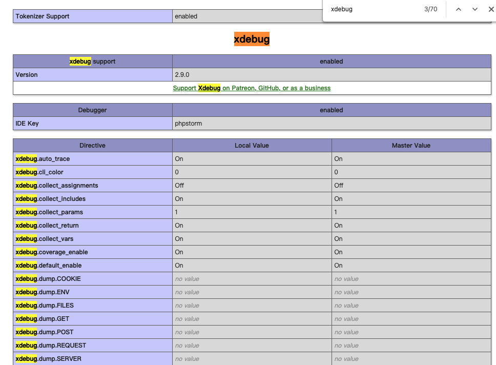


---

## 一键部署

php多版本+mysql服务

目录结构

```
|	docker-compose.yml
└--5.6
	 └-Dockerfile
└--7.4
	 └-Dockerfile
```

Docker-compose.yml，如果需要起不同或更多的版本，照着修改yml和Dockerfile即可

```yml
version: '3'
services:
    php5.6:                # 容器名称, 自行修改
        build: ./5.6/           # 构建路径, . 表示会在当前路径下找 Dockerfile 文件
        # image: php:5.6-apache   # 镜像名称, 如果没有上面的 build, docker-compose 将会尝试从官方仓库 pull 该镜像
        ports: 
            - 10001:80     # 映射端口 虚拟机端口:容器内端口
        volumes: 
            [/Users/gyy/dockerPHP/www/html:/var/www/html]
        links: 
            - mysql     #连接mysql服务
        stdin_open: true
        tty: true
        restart: always # 自动重启，一般用于开机自启
    mysql:
        image: mysql/mysql-server:5.6
        environment: 
            MYSQL_ROOT_PASSWORD: "<password>" # 自设mysql的password
        ports: 
            - 3306:3306 # 由于映射端口，密码需设强密码，否则请关闭端口映射
        restart: always
    php7.4:                # 容器名称, 自行修改
        build: ./7.4/           # 构建路径, . 表示会在当前路径下找 Dockerfile 文件
        # image: php:7.4-apache   # 镜像名称, 如果没有上面的 build, docker-compose 将会尝试从官方仓库 pull 该镜像
        ports: 
            - 10002:80     # 映射端口 虚拟机端口:容器内端口
        volumes: 
            [/Users/gyy/dockerPHP/www/html:/var/www/html]
        links: 
            - mysql     #连接mysql服务
        stdin_open: true
        tty: true
        restart: always
```

5.6的Dockerfile(此处未使用更新换源方法，如报错或有需要可自行更换)

```dockerfile
FROM php:5.6-apache

RUN echo 'deb http://mirrors.aliyun.com/debian/ buster main non-free contrib \
  deb http://mirrors.aliyun.com/debian/ buster-updates main non-free contrib \
  deb http://mirrors.aliyun.com/debian/ buster-backports main non-free contrib \
  deb-src http://mirrors.aliyun.com/debian/ buster main non-free contrib \
  deb-src http://mirrors.aliyun.com/debian/ buster-updates main non-free contrib \
  deb-src http://mirrors.aliyun.com/debian/ buster-backports main non-free contrib \
  deb http://mirrors.aliyun.com/debian-security/ buster/updates main non-free contrib \
  deb-src http://mirrors.aliyun.com/debian-security/ buster/updates main non-free contrib'> /etc/apt/sources.list \
    && apt update && apt install -y vim

RUN ["/bin/bash","-c","echo -e \"xdebug.remote_enable=On\nxdebug.remote_host=host.docker.internal\nxdebug.remote_port=9000\nxdebug.auto_trace=On\nxdebug.collect_vars=On\nxdebug.collect_return=On\nxdebug.collect_params=On\nxdebug.idekey=phpstorm\nxdebug.remote_log='/tmp/xdebug.log'\" >> /usr/local/etc/php/conf.d/myconfig.ini"]

RUN docker-php-ext-install mysqli \
    && docker-php-ext-install mysql \
    && pecl install xdebug-2.5.0 \ # 指定xdebug版本
    && docker-php-ext-enable xdebug

RUN apache2ctl restart
```

7.4的dockerfile(此处未使用更新换源方法，如报错或有需要可自行更换)

```dockerfile
FROM php:7.4-apache

RUN echo 'deb http://mirrors.aliyun.com/debian/ buster main non-free contrib \
  deb http://mirrors.aliyun.com/debian/ buster-updates main non-free contrib \
  deb http://mirrors.aliyun.com/debian/ buster-backports main non-free contrib \
  deb-src http://mirrors.aliyun.com/debian/ buster main non-free contrib \
  deb-src http://mirrors.aliyun.com/debian/ buster-updates main non-free contrib \
  deb-src http://mirrors.aliyun.com/debian/ buster-backports main non-free contrib \
  deb http://mirrors.aliyun.com/debian-security/ buster/updates main non-free contrib \
  deb-src http://mirrors.aliyun.com/debian-security/ buster/updates main non-free contrib'> /etc/apt/sources.list \
    && apt update && apt install -y vim

RUN ["/bin/bash","-c","echo -e \"xdebug.remote_enable=On\nxdebug.remote_host=host.docker.internal\nxdebug.remote_port=9000\nxdebug.auto_trace=On\nxdebug.collect_vars=On\nxdebug.collect_return=On\nxdebug.collect_params=On\nxdebug.idekey=phpstorm\nxdebug.remote_log='/tmp/xdebug.log'\" >> /usr/local/etc/php/conf.d/myconfig.ini"]

RUN  docker-php-ext-install mysqli \
    && pecl install xdebug-2.9.0 \ # 最好也指定下版本
    && docker-php-ext-enable xdebug

RUN apache2ctl restart
```

在docker-compose.yml所在目录运行`docker-compose up -d`


如图所示，在映射目录写个phpinfo，用不同端口访问本地可见版本不同，可以非常灵活地调试

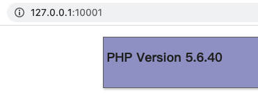

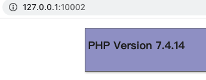

xdebug模块也加载好了

---

## 配置phpstorm

在本地映射目录下新建项目并打开，点击右上角配置

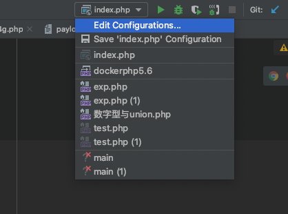

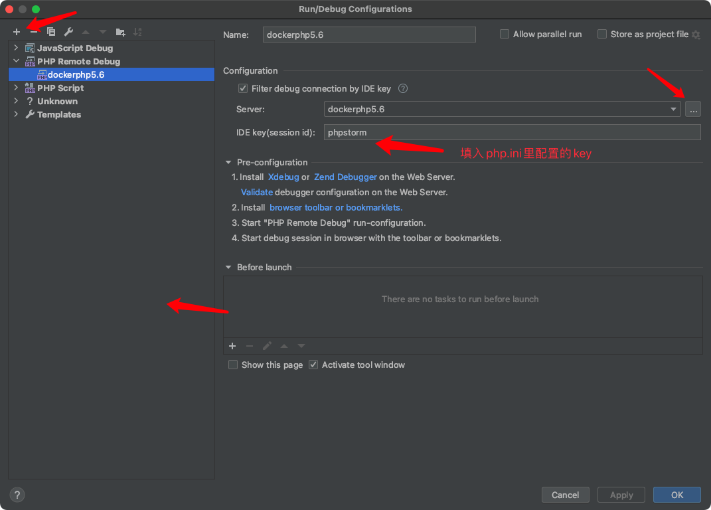

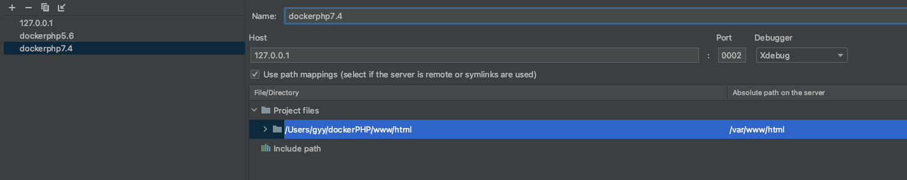

打开`设置Preferences->Build,Execution,Deployment->Deployment`

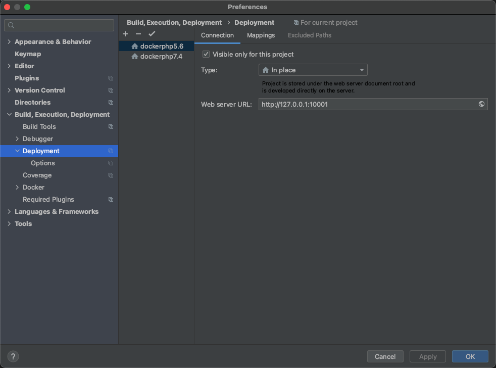

打开`Run->Web Server Debug Validation`

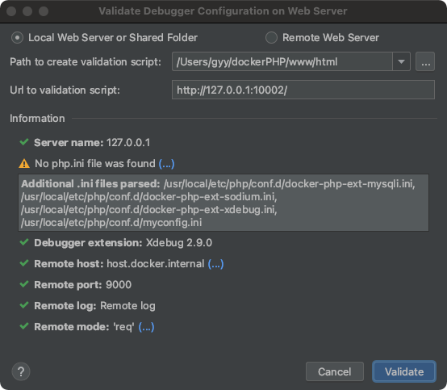

Chrome浏览器安装debug插件

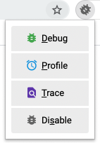


然后就可以惹

---

## 访问测试

一般来说都是在本地搭建环境，尽量别放有公网vps的服务器上...会被打

### 页面测试

映射目录写phpinfo()，访问对应端口的容器


### mysql测试(一键部署可用)

映射目录写`mysqltest.php`

```php
<?php
$servername = "mysql";
$username = "root";
$password = "<password>"; // 自设的mysql密码

$conn = new mysqli($servername, $username, $password);


if ($conn->connect_error) {
    die("error:" . $conn->connect_error);
}
echo "success";
?>
```

访问`http://127.0.0.1:[port]/mysqltest.php`

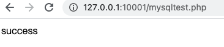

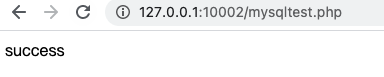

测试完毕