摸鱼的学习总结

<!-- more -->

[TOC]

> **信息是从多个可能状态中确定实际状态的代价**

有篇知乎的回答挺好的，借用了一些图和描述，推荐看看https://www.zhihu.com/question/22178202

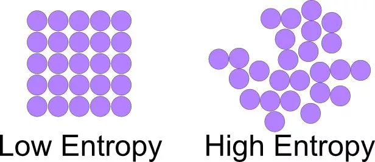

**例子：How much is the shirt?**

**衬衫的价格是9磅15便士，所以你选择B项，答案却是C项。**

## 信息熵

当一件事情(宏观态)有很多种可能的情况时，这件事情(宏观态)对某人(观察者)而言具体是哪种情况(微观态)的不确定性叫做熵.

即这(知情情况的不确定性)就是熵

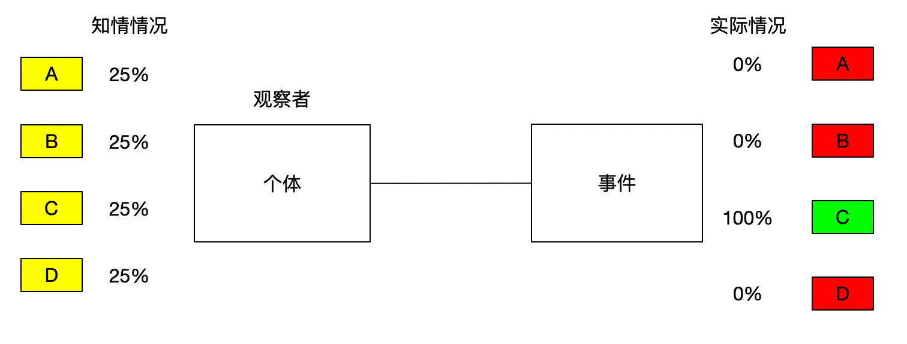

而能**消除这种不确定性的事物**就是信息

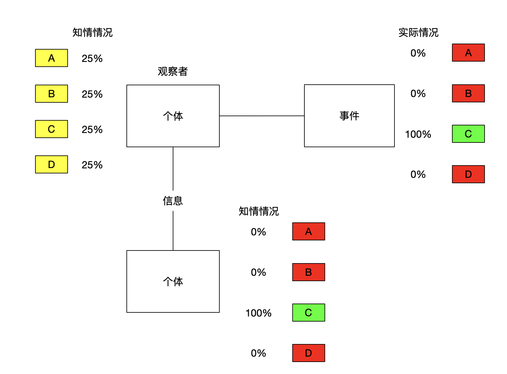

## 信息量

熵和信息数量相等，获取信息的同时也会消除不确定性(熵)

> **消除**熵 == **获取**信息

例如在举例中，ABCD四个选项对于不知道最终答案的人来说都是等概率(25%)的，熵在此时(等概率)最大。

而告诉你答案是C的时候，这时熵最小。

能够消除熵的信息有三种类型，本质都是能够**正确**的调整每个可能情况的概率。

如果告诉你`"答案是ABCD中的一个"`则获取了0bit的信息，这种定义下，没有假信息的说法。只有能消除某人对某事不确定性的事物才叫做信息，即`"答案是ABCD中的一个"`不是信息

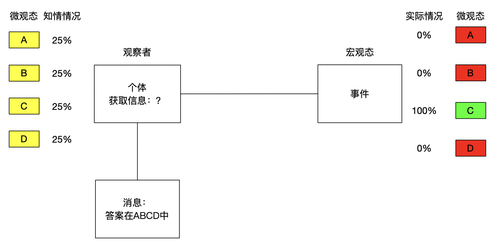

而告诉你`"A是正确答案"`也不是信息(正确答案为C)，因为它不是正确的。

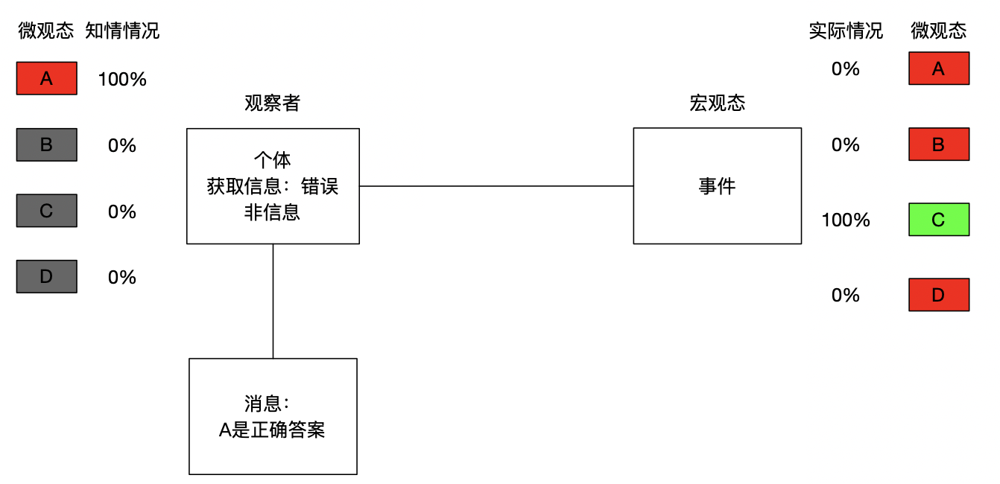

### 类型一：调整概率

听完听力后，你获取了一个消息"衬衫的价格是9磅15便士"，从这个消息中张三得知`"有一半可能是C选项"`，这个信息将C选项的概率提高到了50%(提供了0.21bits)

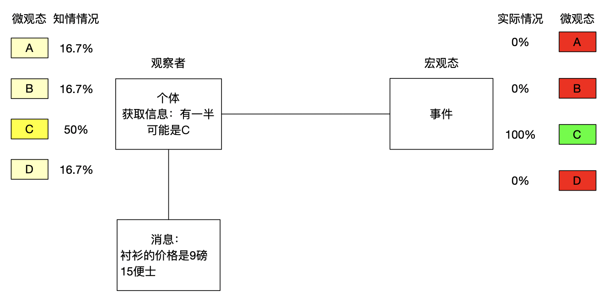

### 类型二：排除干扰

听完听力后，你获取了一个消息"衬衫的价格是9磅15便士"，从这个消息中李四得知`"B选项是错的"`，这个信息直接将B选项概率降低到0%(0.415bits)

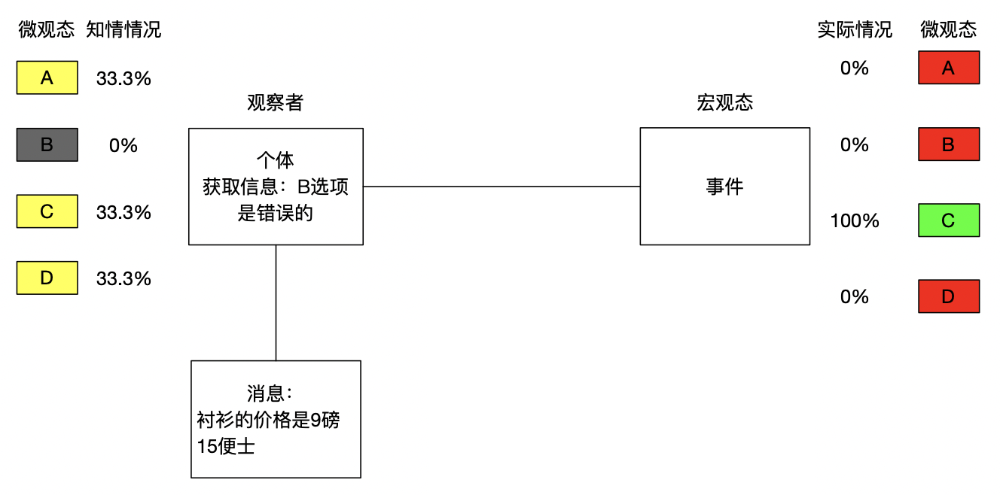

### 类型三：确定情况

听完听力后，你获取了一个消息"衬衫的价格是9磅15便士"，王五英语非常好，从这个消息中王五直接得知`"C选项是正确的"`，这个信息直接将C选项概率提高到100%(2bits)，直接确定了实际情况。

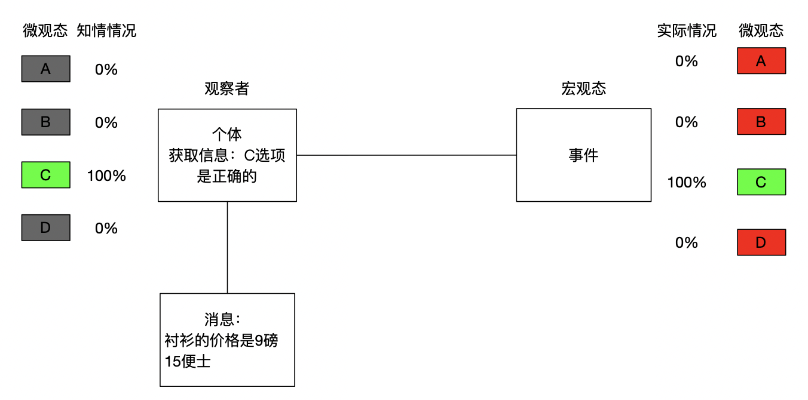

## 信息的接收

### 媒介无关

**同一个观察者对同一件事接受到的信息与传递信息的信号模式无关**

王五写纸条给赵六`"答案是C"`传递的信息是2bits，直接告诉赵六传递的信息也是2bits，打三个响指(与赵六约定好，赵六能够理解)，传递的信息也是2bits

### 相对个体

**接收到的信息是相对于观察者已经对该事情的实际了解程度而言的**

王五会这道题，王五对这道题的熵就为0bit，不管王五搞不告诉赵六正确答案是C，因为观察者王五已经拥有这件事的所有信息，即王五确定(知道)这道题的答案是C，不确定性从最初就不存在。

赵六不会这道题，所以赵六对这道题的熵为2bits，因为观察者赵六没有对于这件事的任何信息。

对于李四而言，王五告诉张三`"答案是C"`，提供给李四1.58bits信息，因为观察者李四知道B是错的，观察者拥有关于这件事情的部分信息。

赵六认为C是错的，再告诉赵六答案是C，熵不会减少，因为没有实际帮助赵六消除事情的不确定性，因为熵不会随着主观臆想而减少，信息也不随主观意识而改变。

### 相对事件

`"太阳东升西落"`，这句话对知道的人提供0bit信息，对知道或东或西升起的人提供了1bit信息，对认为东南西北都可能升起的人提供了2bits信息

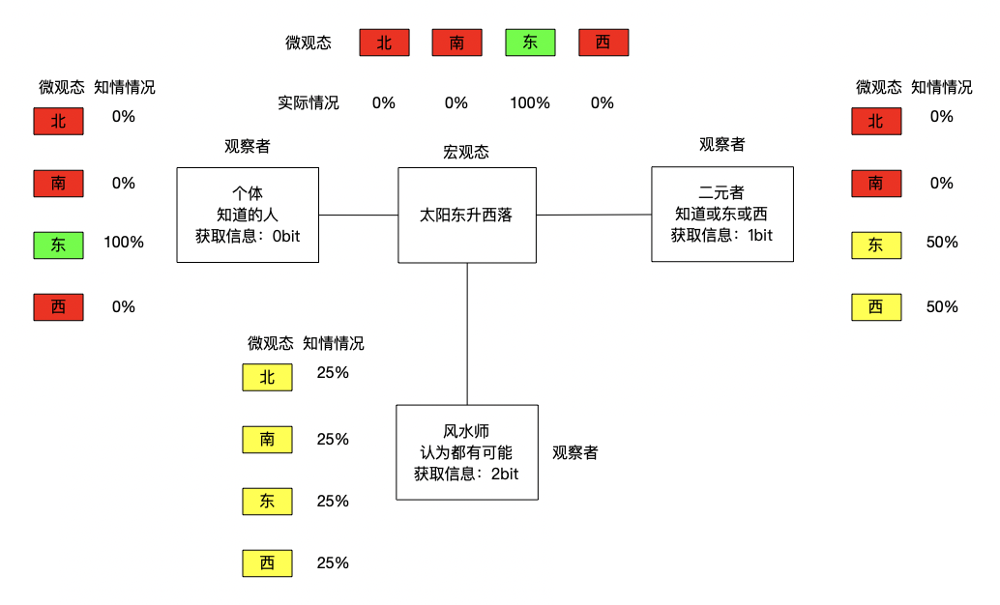

## 信息量的计算

信息也是物理量，类似于`千克`，选种千克为单位物理量，则测量其他物体的质量就是以多少个单位质量，即多少千克来计算。

信息也是参照单位事件的不确定性，看看待测事件的不确定性相当于"多少个"参照事件的不确定性，其中"多少个"，便是信息量。

如果选择参照事件像是抛硬币这样50%两种等概率情况的事件时，测量的信息量的单位就称为比特(bit)。

测量质量是，可以用待测物体质量m除以参照物体质量B，因为待测物体质量m=参照物体质量B 乘 参照物体个数n，所以知道总质量m 求 个数 n 时，利用除法计算即可。

可是测量信息时却不能用除法，因为抛三枚硬币产生的等可能结果并非 3*2=6种，而是 2^3=8种

`[正正正,正正反,正反正,正反反,反正正,反正反,反反正,反反反]`

不是线性关系，而是指数关系，所以当知道可能情况个数m，想求这些情况相当于多少个n参照事件产生的时，就用对数运算即可。
$$
m = 2^n
$$

$$
n = log_2m
$$

所以对答案ABCD里哪一选项的不确定性即为
$$
log_24 = 2 bits
$$
这种情况因为每个选项都是25%的等概率才可以，与抛硬币一样，出现正反的概率都是相等的50%

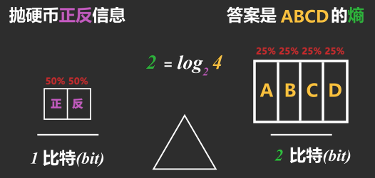

可张三知道有一半可能是C选项时，各个情况的概率就不一样了。这时要分别测量待测事件每种可能的信息量后乘它们各自发生的概率再相加即可。

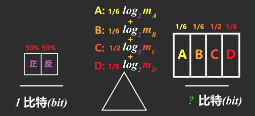

不过我们不知道概率为1/6的情况的不确定性相当于抛多少个硬币所产生的不确定性，m未知就没法用这个公式
$$
log_2m_A
$$
但1%会发生的情况相当于从100个等概率情况中确定实际情况，而概率的倒数=等概率情况的个数
$$
p = 1/100
$$
用概率的倒数1/p替换等概率情况个数m后就可以计算每种情况的信息量了
$$
m = 1/p
$$
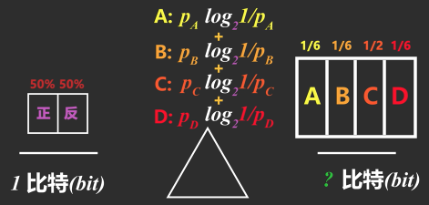

再将每个情况的信息量乘对应发生的概率再相加，就能算出总信息量了
$$
A: 1/6 log_2(6/1)
$$

$$
B:1/6 log_2(6/1)
$$

$$
C:1/2 log_2(2/1)
$$

$$
D:1/6 log_2(6/1)
$$

A+B+C+D = 1.79 bits

### 均匀分布

$$
log_2m
$$

### 一般分布

$$
\sum p_i log_2 p_i^{-1}
$$

