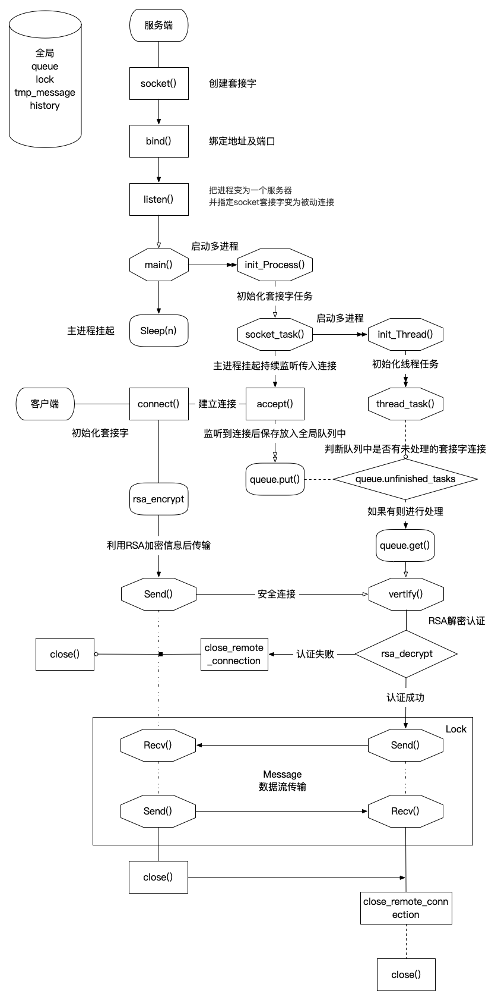
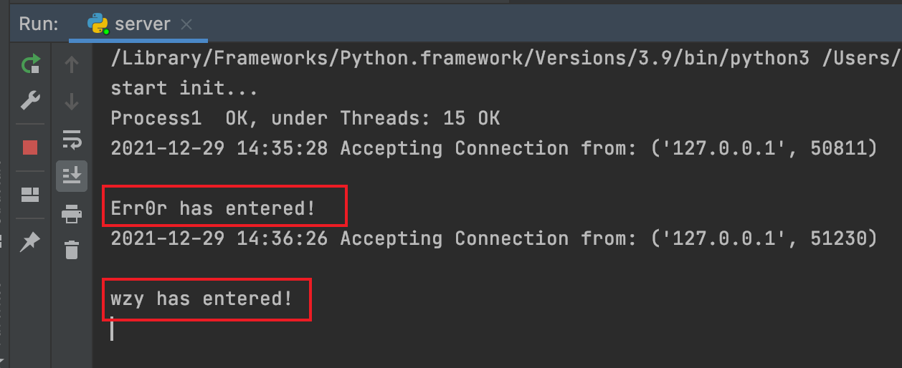
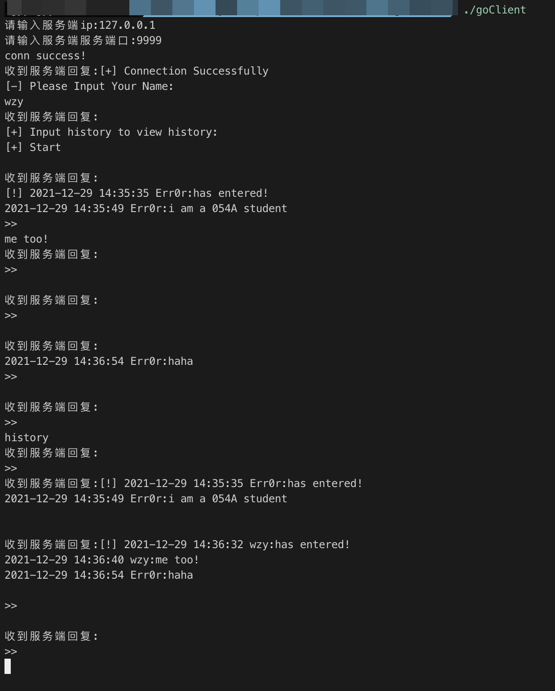
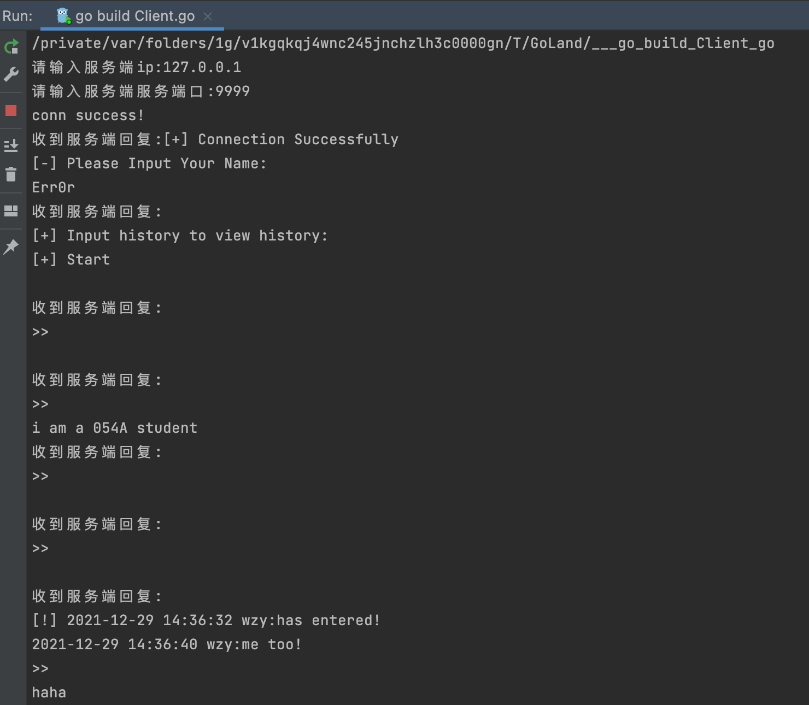
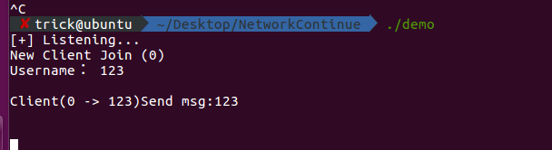
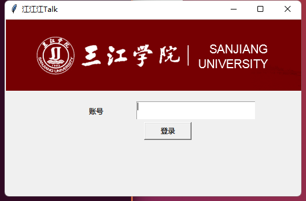
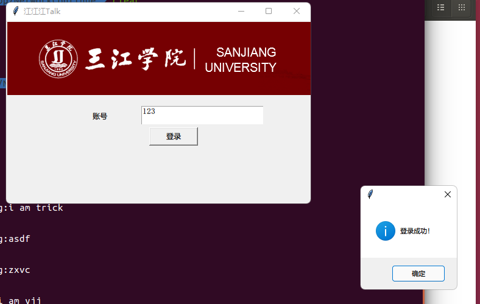
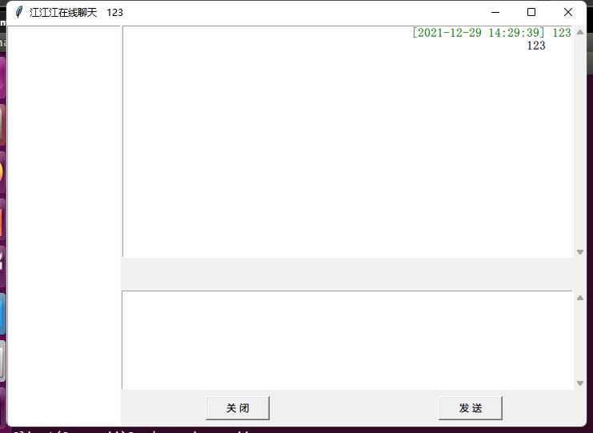

基于多种编程语言组成的聊天室系统

<!-- more -->

## Socket网络通信编程项目

### 背景

为深入研究socket编程，本人开发应用了一套socket通信编程项目，旨在深入学习其原理和实现方法。本人独立实现了方案一，并参与帮助完成了方案二。

### 项目功能简介

本项目实现网络聊天室了功能，可以进行多人在线聊天，可以自定义昵称并记录历史记录和发言时间。

### 系统设计

方案一：项目包括客户端和服务端两个部分，其中服务端模块用Python语言在Linux系统上完成开发，而客户端模块用Go语言在Windows系统上完成开发，系统具有跨平台跨语言分布特性。

方案二：项目包括客户端和服务端两个部分，其中服务端模块用C语言在Linux系统上完成开发，而客户端模块用Python语言在Windows系统上完成开发，系统具有跨平台跨语言分布特性。


### 项目实现

#### 方案一：

程序流程图



在Linux操作系统中，运行server.py程序，可以启动服务端，在Windows操作系统中，再运行goClient.exe程序，可以启动客户端。在弹出的聊天室窗口输入服务端IP和端口，若输入正确则服务端连接成功并打印“conn success！”，若输入错误则窗口消失。在服务端连接成功后，输入用户名则可以开始聊天，在聊天窗口输入histroy，则可以查看所以历史记录。

服务端窗口：



客户端窗口：





#### 方案二：

在Linux操作系统中，运行netdemo.c程序，可以启动服务端，在Windows操作系统中，再运行test2.py程序，可以启动客户端。在服务端和客户端启动成功后，输入用户名登录成功后则可以开始聊天。

服务端窗口：



客户端登录窗口：



客户端登录成功：



聊天窗口：



### 代码结构说明  

各函数名称和所实现功能列表如下：

#### 方案一：

| 函数名            | 功能                        |
| ----------------- | --------------------------- |
| rsa_decrypt()     | 用于rsa解密                 |
| rsa_encrypt()     | 用于rsa加密                 |
| printStackTrace() | 用于debug调试，输出错误信息 |
| vertify()         | 用于认证模块                |
| game()            | 主流程模块                  |
| thread_task()     | 线程任务                    |
| socket_task()     | 套接字处理                  |
| init_Thread()     | 线程初始化                  |
| init_Process()    | 进程初始化                  |

#### 方案二：

| 函数名         | 功能                         |
| -------------- | ---------------------------- |
| login_socket() | 客户端与服务端进行socket连接 |
| ChatUI()       | 聊天窗口UI                   |
| sendMsgEvent() | 实现回车登录或发送消息       |
| senddata()     | 发送数据                     |
| recvdata()     | 接收数据                     |
| close()        | 关闭程序                     |


### 代码分析  

#### 方案一：

在实现rsa解密功能时，借助了rsa_decrypt()函数，关键代码为：  

```python
    def rsa_decrypt(text):
        """校验RSA加密 使用私钥进行解密"""
        private_key = '''私钥，略'''
        cipher = PKCS1_v1_5.new(RSA.importKey(private_key))
        retval = cipher.decrypt(base64.b64decode(text), 'ERROR').decode('utf-8')
        return retval.replace("\n", "").replace("\r", "") # 去除换行符
```

在实现rsa加密功能时，借助了rsa_encrypt()函数，关键代码为：

``` python
    def rsa_encrypt(text):
        PUBLIC_KEY = '''公钥，略'''
        cipher = PKCS1_v1_5.new(RSA.importKey(PUBLIC_KEY))
        cipher_text = base64.b64encode(cipher.encrypt(bytes(text, encoding="utf8")))
        return cipher_text.decode("utf-8")
```

在实现debug调试，输出错误信息功能时，借助了printStackTrace(函数，关键代码为：

``` python
def printStackTrace(self, e, current_name=""):
        info = "\n" + str(datetime.now())[:-7] + " " + str(current_name) + " Error: " + str(e) + "\nat " + str(
            e.__traceback__.tb_frame.f_globals["__file__"]) + "\nat line: " + str(e.__traceback__.tb_lineno), "\n"
        print(info)
        # 写入文件
        with open("logs.txt", "a") as logger:
            logger.write(info)
```

连接建立后，需要对用户进行认证，这里接收用户名后利用rsa解密，解密成功即使用了正确的客户端，否则服务端会断开于客户端的连接


``` python
    def vertify(self, socket_handle):
    		try:
        """
        前段略
        """
            name = socket_handle.recv(1024).decode().strip()
            name = self.rsa_decrypt(name)
            print("%s has entered!" % (name))
            
						# 防止并发错误
            lock.acquire()
            # 写入消息和历史记录
            history.append("[!] " + str(datetime.now())[:-7] + " " + name + ":has entered!")
            tmp_message.append({"name": name, "view_names": [],
                                "message": "[!] " + str(datetime.now())[:-7] + " " + name + ":has entered!"})
            lock.release()
						
            # 认证完成后接入主聊天流程
            self.game(socket_handle, name)
        except Exception as e:
            # 出错说明认证失败，断开连接
            socket_handle.send(b"\n[-] Please use the authentication client to connect!")
            socket_handle.close()
```


``` python
    def game(self, socket_handle, name):
        try:
          	"""
        前段略
        		"""
          	# 挂起程序，防止退出
            while True:
                sleep(0.25)
                if tmp_message:
                  # 对每个消息都进行处理
                    for item in tmp_message:
                      # 如果发送人非本人，且本人不在"已阅消息"列表，则发送客户端此消息，并添加到已阅列表
                        if item["name"] != name and name not in item["view_names"]:
                            socket_handle.send(("\n" + item["message"]).encode())
                            # 防止并发错误
                            lock.acquire()
                            item["view_names"].append(name)
                            lock.release()

                socket_handle.send(b"\n>> ")
                # 接收客户端消息
                msg = socket_handle.recv(1024).decode().strip()
                if msg:
                  # 如果客户端输入了"history"，则返回全部历史信息
                    if msg == "history":
                        # print(history)
                        for i in history:
                            socket_handle.send((i + "\n").encode())
                    else:
                      # 否则即为正常消息，防止并发冲突
                        lock.acquire()
                      # 添加至历史记录
                        history.append(str(datetime.now())[:-7] + " " + name + ":" + msg)
                      # 添加至待处理消息list中，其中每条消息都是发送人，已阅列表，信息内容三个关键字组成的字典
                        tmp_message.append({"name": name, "view_names": [],
                                            "message": str(datetime.now())[:-7] + " " + name + ":" + msg})
                        lock.release()
        except Exception as e:
            print(e)
        finally:
          # 最终关闭连接
            socket_handle.close()
```

其中有进程任务，即处理每个连接的客户端送至认证模块中

``` python
    def thread_task(self):
        while True:
            sleep(0.25)
            if queue.unfinished_tasks:
              # 队列取还未认证的套接字
                item = queue.get()
                try:
                    self.vertify(item)
                except Exception as e:
                    self.printStackTrace(e, threading.current_thread().name)
                    
    def init_Thread(self):
        for i in range(self.threading_nums):
            item = threading.Thread(target=self.thread_task, name="Thread" + str(i + 1))
            item.setDaemon(True)
            item.start()
```

进程任务是由线程任务触发的

``` python
    def socket_task(self):
    # 套接字任务，初始化线程
        self.init_Thread()
        print(multiprocessing.current_process().name, " OK, under Threads:", self.threading_nums, "OK")
        try:
            while True:
              # 挂起，持续接收连接的套接字
                socket_handle, address = self.socket.accept()
              # 长超时设置
                socket_handle.settimeout(999999)
              # 收到了就将其put到队列中，等待线程处理
                queue.put(socket_handle)
                info = str(datetime.now())[:-7] + " Accepting Connection from: " + str(address) + "\n"
                print(info)
              # 写日志
                with open("logs.txt", "a") as logger:
                    logger.write(info)

        except Exception as e:
            self.printStackTrace(e, multiprocessing.current_process().name)

    def init_Process(self):
        print("start init...")
        # 初始化多进程
        for i in range(self.process_nums):
            p = multiprocessing.Process(target=self.socket_task, name="Process" + str(i + 1), daemon=True)
            p.start()
```

主函数仅做后台挂起，直接初始化进程后挂后台

``` python
    def main(self):
        self.init_Process()
        while True:
            sleep(60000)
```

#### 方案二：

在实现客户端与服务端socket连接功能时，借助了login_socket()函数，关键代码为：  

``` python
    def login_socket(self):
        # try:
            if str(self.input_username.get(1.0,END).strip()) == '':
                tkinter.messagebox.askretrycancel(title='message', message='请输入用户名')
            else:
                self.client = socket.socket(socket.AF_INET, socket.SOCK_STREAM)
                self.client.connect((self.local, 8888))
                self.flag = True
                self.username_data = str(self.input_username.get(1.0,END).strip())[:12]
                self.client.send(self.username_data.encode())
                ret = self.client.recv(1)
                if ret == b'Y':
                    tkinter.messagebox.showinfo(title='', message='登录成功！')
                    self.root.destroy()
                    self.is_login = False
                    ClientUI.ChatUI(self)
                elif ret == b'N':
                    tkinter.messagebox.askretrycancel(title='message', message='请输入用户名！')
                    return
                elif ret == b'R':
                    tkinter.messagebox.askretrycancel(title='message', message='用户名重复！')
                    return
                print("Login Done!\n")
```

在实现聊天窗口UI功能时，借助了ChatUI()函数，关键代码为：  

``` python
    def ChatUI(self):
        self.root = Tk()
        self.title += self.username_data
        self.root.title(self.title)

        self.frame = [tkinter.Frame(), tkinter.Frame(), tkinter.Frame(), tkinter.Frame()]
        self.talk_list = Listbox(self.root)
        self.talk_list.pack(side=tkinter.LEFT, fill=tkinter.Y)
        # self.talk_list.insert(0,'asd')

        self.chatTextScrollBar = tkinter.Scrollbar(self.frame[0])
        self.chatTextScrollBar.pack(side=tkinter.RIGHT, fill=tkinter.Y)

        ft = tkFont.Font(family='Fixdsys', size=11)
        self.chatText = tkinter.Listbox(self.frame[0], width=70, height=18, font=ft)
        self.chatText['yscrollcommand'] = self.chatTextScrollBar.set
        self.chatText.pack(expand=1, fill=tkinter.BOTH)
        self.chatTextScrollBar['command'] = self.chatText.yview()
        self.frame[0].pack(expand=1, fill=tkinter.BOTH)

        label = tkinter.Label(self.frame[1], height=2)
        label.pack(fill=tkinter.BOTH)
        self.frame[1].pack(expand=1, fill=tkinter.BOTH)

        self.inputTextScrollBar = tkinter.Scrollbar(self.frame[2])
        self.inputTextScrollBar.pack(side=tkinter.RIGHT, fill=tkinter.Y)

        ft = tkFont.Font(family='Fixdsys', size=11)
        self.inputText = tkinter.Text(self.frame[2], width=70, height=8, font=ft)
        self.inputText.focus_set()
        self.inputText.bind_all("<KeyPress-Return>",self.sendMsgEvent)
        self.inputText['yscrollcommand'] = self.inputTextScrollBar.set
        self.inputText.pack(expand=1, fill=tkinter.BOTH)
        self.inputTextScrollBar['command'] = self.chatText.yview()
        self.frame[2].pack(expand=1, fill=tkinter.BOTH)

        self.sendButton = tkinter.Button(self.frame[3], text=' 发 送 ', width=10, command=self.senddata)
        self.sendButton.pack(expand=1, side=tkinter.BOTTOM and tkinter.RIGHT, padx=15, pady=8)

        self.closeButton = tkinter.Button(self.frame[3], text=' 关 闭 ', width=10, command=self.close)
        self.closeButton.pack(expand=1, side=tkinter.RIGHT, padx=15, pady=8)
        self.frame[3].pack(expand=1, fill=tkinter.BOTH)

        t1 = threading.Thread(target=self.recvdata, name='recvdata')
        t1.start()
        self.root.mainloop()
```

在实现登录和发送信息功能时，借助了sendMsgEvent()函数，关键代码为：  

``` python
    def sendMsgEvent(self, event):
        if event.keysym == "Return":
            if self.is_login == True:
                self.login_socket()
            else:
                self.senddata()
```

在实现发送数据和接收数据功能时，借助了senddata()和recvdata()函数，关键代码为： 

``` python
    def senddata(self):
        message = self.inputText.get('1.0', tkinter.END)
        theTime = time.strftime("%Y-%m-%d %H:%M:%S", time.localtime())
        new_message = '[' + theTime + '] ' + self.username_data
        self.chatText.insert(tkinter.END, new_message.rjust(70,' ') + ' \n')
        self.chatText.itemconfig(tkinter.END, fg='green')
        self.chatText.insert(tkinter.END, '  ' + message.rjust(66,' ') + '\n')
        self.chatText.see(END)
        self.client.send(message.encode())
        self.inputText.delete(0.0, message.__len__() - 1.0)

    def recvdata(self):
        while True:
            theTime = time.strftime("%Y-%m-%d %H:%M:%S", time.localtime())
            message = self.client.recv(1024).decode()
            new_message = message.split('\n',1)
            self.chatText.insert(tkinter.END,   new_message[0] + ' [' + theTime + '] ：\n')
            self.chatText.itemconfig(tkinter.END, fg='red')
            self.chatText.insert(tkinter.END, '  ' + new_message[1] + '\n')
            self.chatText.see(END)
```

在实现关闭程序时，借助了close()函数，关键代码为： 

```python
    def close(self):
        self.client.close()
        self.root.destroy()
```

### 回顾与展望

通过本项目使我的代码能力和纠错能力得到了进一步提升，尤其是在独立面对困难和程序bug的时候多多调试就可以解决问题，并且记录下来，这样对我的学习非常有帮助。