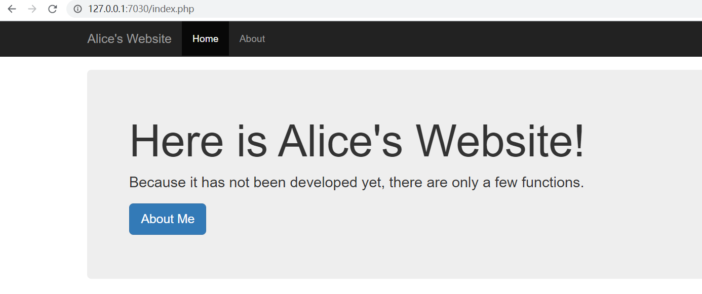
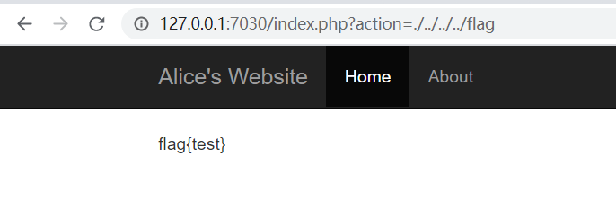

每日一题，WEB狗的逆袭之路

旨在记录

<!-- more -->

##### 前两天的题关了，没得写WP了...

----

## Day3

### web_AliceWebsite



点击界面发现url更改

` http://127.0.0.1:7030/index.php?action=home.php `

盲猜文件包含，直接访问`./../../../flag`



直接出flag

#### 额外题：如何修复

看下源码

```php
<?php
        $action = (isset($_GET['action']) ? $_GET['action'] : 'home.php');
        if (file_exists($action)) {
            include $action;
        } else {
            echo "File not found!";
        }
        ?>
```

好家伙，啥都不过滤


最后修改加了yi点点过滤

```php
<?php
        $action = (isset($_GET['action']) ? $_GET['action'] : 'home.php');
        if (file_exists($action)) {
            if(!preg_match("/\{|\}|\(|\)|\^|\=|\<|\>|\?|\||\.\.|php:|\/\/|data:|zip:|phar:|\/|flag|\*|\:|read|http|\#|\+|\~|\[|\]|\-/",$action)) {
                include $action;
            }
            else{
                echo "hacker!";
            }
        } else {
            echo "File not found!";
        }
        ?>
```

没测试呢...


---

## Day4

### [CSAWQual 2016]i_got_id

移步[buuojWP]( ./../Buuoj-WEB-Write-up/ )


---

## Day5

### [DDCTF 2019]homebrew event loop

移步[buuojWP](./../Buuoj-WEB-Write-up/ )


---

## Day6

### [GWCTF 2019]枯燥的抽奖

移步[buuojWP](./../Buuoj-WEB-Write-up/ )


---

## Day7

### [N1CTF 2018]eating_cms

移步[buuojWP](./../Buuoj-WEB-Write-up/ )

