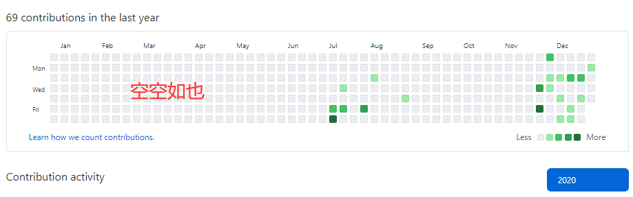

# 这里会写一点点随感

加不加日期随缘了...每次用横线隔着了。说不定哪天羞耻心爆发这个界面就给我删了...

----

----

 **学得越多，越觉得自己渺小** 

----

刷题，刷buu，不刷学弟都比不过...

----

学弟身上看到了自己，不过今年学生好像有点...~~(被删除)~~？承认确实他们有些人很强，不过踏踏实实虚心学习才是本道...谦虚吧。

---

考了六级，没好好复习...明年再说吧。

----

下辈子还学反序列化

---

下午在复习离散数学，传来师傅们某比赛打了第二名的好成绩，很是崇拜，希望明年我也可以有机会上场...

可我一个人的力量实在不够，同届师傅的学习情况令人担忧，虽说我也只是个菜鸡，但是比我还菜还不学，混日子终归是一无所成的...加油吧，希望战队的荣光不要折戟在我们这届了...

----

博客真是个由充实到稀疏的过程，很多博客看着不满意都给我删了23333

---

2021惹，后悔在2020上半年没有建树，希望今年能像师傅们一样强！

  

---

不想复习，考试周555，考完还是一条好汉

----

考完惹